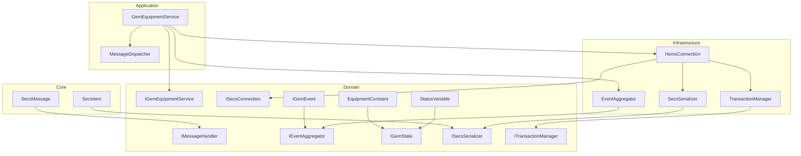
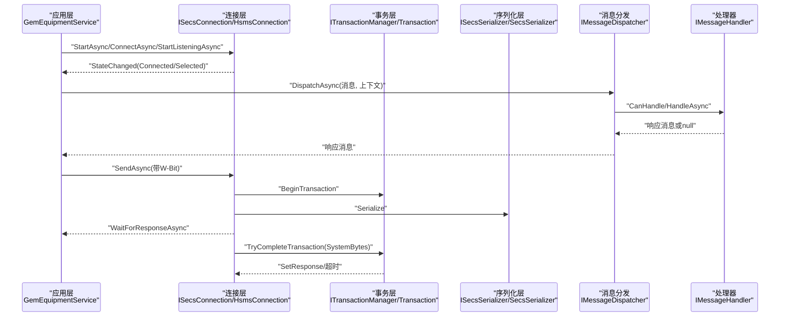
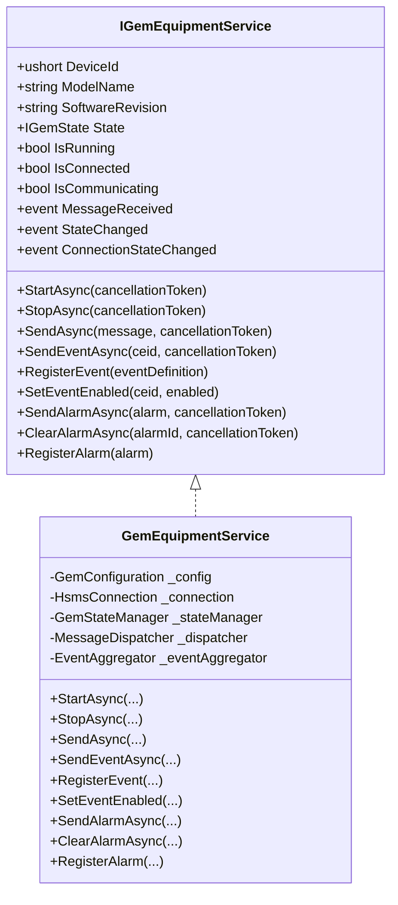
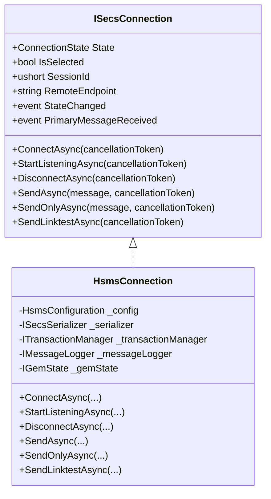
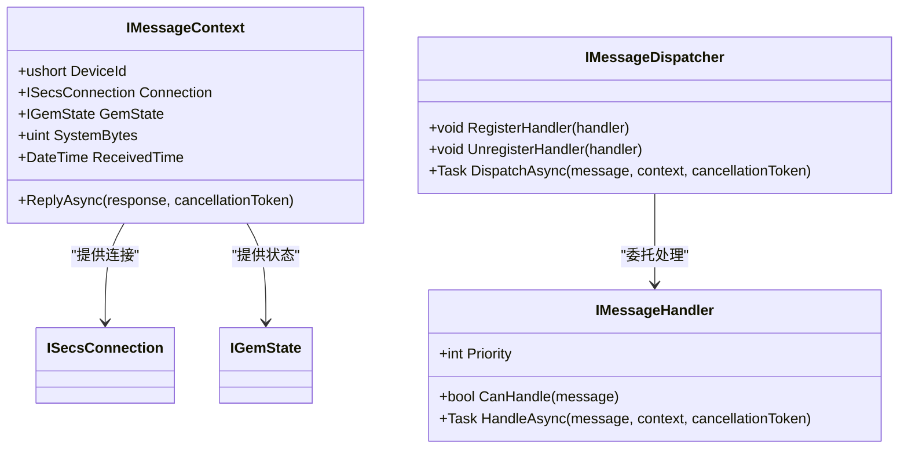
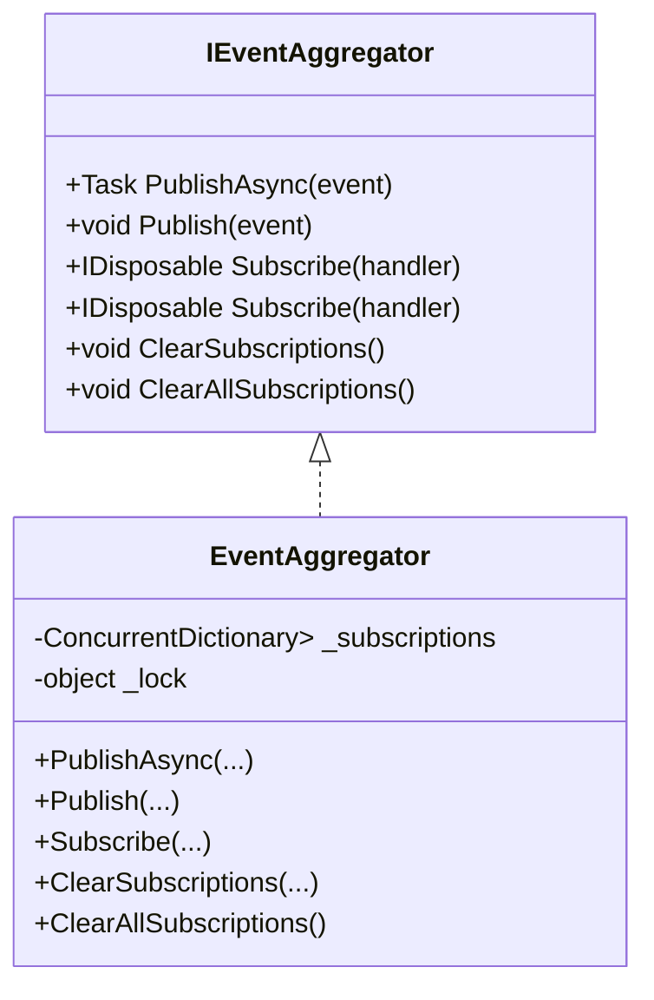
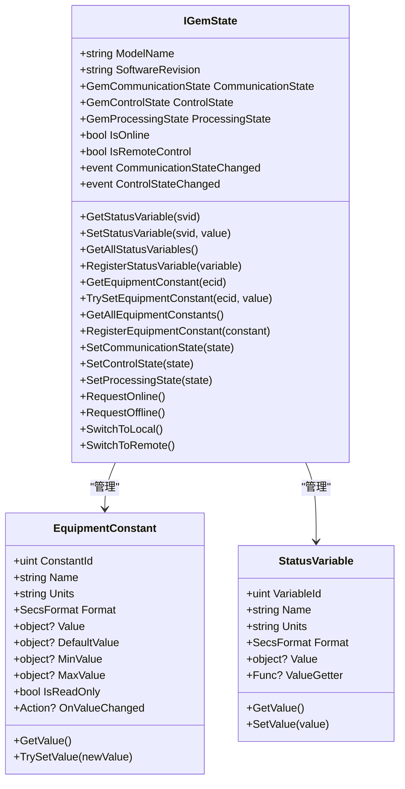
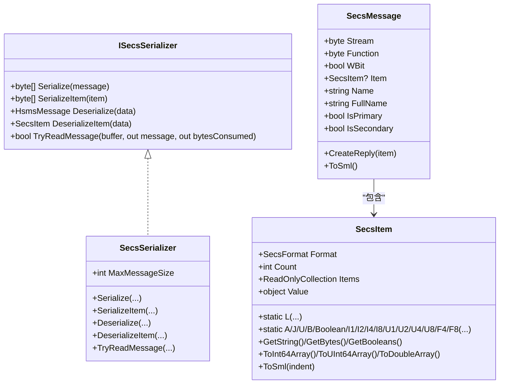
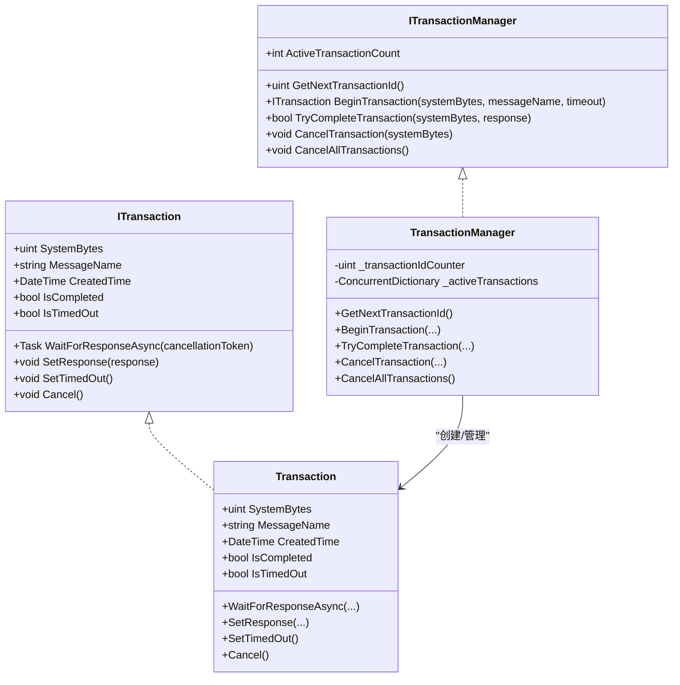
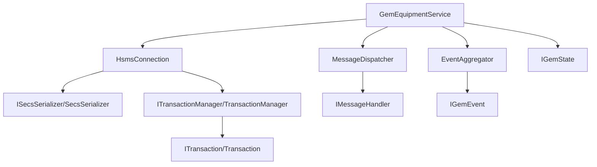

# API参考

<cite>
**本文引用的文件**
- [IGemEquipmentService.cs](file://WebGem/SECS2GEM/Domain/Interfaces/IGemEquipmentService.cs)
- [IMessageHandler.cs](file://WebGem/SECS2GEM/Domain/Interfaces/IMessageHandler.cs)
- [ISecsConnection.cs](file://WebGem/SECS2GEM/Domain/Interfaces/ISecsConnection.cs)
- [IEventAggregator.cs](file://WebGem/SECS2GEM/Domain/Interfaces/IEventAggregator.cs)
- [IGemState.cs](file://WebGem/SECS2GEM/Domain/Interfaces/IGemState.cs)
- [ISecsSerializer.cs](file://WebGem/SECS2GEM/Domain/Interfaces/ISecsSerializer.cs)
- [ITransactionManager.cs](file://WebGem/SECS2GEM/Domain/Interfaces/ITransactionManager.cs)
- [EventAggregator.cs](file://WebGem/SECS2GEM/Infrastructure/Services/EventAggregator.cs)
- [GemEquipmentService.cs](file://WebGem/SECS2GEM/Application/Services/GemEquipmentService.cs)
- [HsmsConnection.cs](file://WebGem/SECS2GEM/Infrastructure/Connection/HsmsConnection.cs)
- [SecsSerializer.cs](file://WebGem/SECS2GEM/Infrastructure/Serialization/SecsSerializer.cs)
- [TransactionManager.cs](file://WebGem/SECS2GEM/Infrastructure/Services/TransactionManager.cs)
- [SecsMessage.cs](file://WebGem/SECS2GEM/Core/Entities/SecsMessage.cs)
- [SecsItem.cs](file://WebGem/SECS2GEM/Core/Entities/SecsItem.cs)
- [IGemEvent.cs](file://WebGem/SECS2GEM/Domain/Events/IGemEvent.cs)
- [EquipmentConstant.cs](file://WebGem/SECS2GEM/Domain/Models/EquipmentConstant.cs)
- [StatusVariable.cs](file://WebGem/SECS2GEM/Domain/Models/StatusVariable.cs)
</cite>

## 目录
1. [简介](#简介)
2. [项目结构](#项目结构)
3. [核心组件](#核心组件)
4. [架构总览](#架构总览)
5. [详细组件分析](#详细组件分析)
6. [依赖分析](#依赖分析)
7. [性能考虑](#性能考虑)
8. [故障排查指南](#故障排查指南)
9. [结论](#结论)
10. [附录](#附录)

## 简介
本文件为 SECS2-GEM 项目的完整 API 参考，覆盖以下公共接口与其实现：
- 设备服务：IGemEquipmentService
- 连接抽象：ISecsConnection
- 消息处理：IMessageHandler、IMessageDispatcher
- 事件聚合：IEventAggregator
- GEM状态：IGemState
- 序列化：ISecsSerializer
- 事务管理：ITransactionManager

文档提供每个接口的方法签名、参数说明、返回值、异常处理策略、使用场景与最佳实践，并给出类层次结构与继承关系图、扩展与自定义指南、版本兼容性与迁移建议、性能与限制说明。

## 项目结构
SECS2-GEM 采用分层架构：
- Core 层：协议实体（SecsMessage、SecsItem）
- Domain 层：领域接口与事件、模型（IGemEvent、EquipmentConstant、StatusVariable）
- Infrastructure 层：连接、序列化、服务（HsmsConnection、SecsSerializer、EventAggregator、TransactionManager）
- Application 层：应用服务（GemEquipmentService）、消息分发与处理器
- WebGem 示例：Web 应用入口与测试

图表来源
- [IGemEquipmentService.cs:25-158](file://WebGem/SECS2GEM/Domain/Interfaces/IGemEquipmentService.cs#L25-L158)
- [ISecsConnection.cs:71-142](file://WebGem/SECS2GEM/Domain/Interfaces/ISecsConnection.cs#L71-L142)
- [IMessageHandler.cs:63-129](file://WebGem/SECS2GEM/Domain/Interfaces/IMessageHandler.cs#L63-L129)
- [IEventAggregator.cs:22-65](file://WebGem/SECS2GEM/Domain/Interfaces/IEventAggregator.cs#L22-L65)
- [IGemState.cs:20-164](file://WebGem/SECS2GEM/Domain/Interfaces/IGemState.cs#L20-L164)
- [ISecsSerializer.cs:21-59](file://WebGem/SECS2GEM/Domain/Interfaces/ISecsSerializer.cs#L21-L59)
- [ITransactionManager.cs:78-118](file://WebGem/SECS2GEM/Domain/Interfaces/ITransactionManager.cs#L78-L118)
- [GemEquipmentService.cs:33-454](file://WebGem/SECS2GEM/Application/Services/GemEquipmentService.cs#L33-L454)
- [HsmsConnection.cs:30-800](file://WebGem/SECS2GEM/Infrastructure/Connection/HsmsConnection.cs#L30-L800)
- [SecsSerializer.cs:27-662](file://WebGem/SECS2GEM/Infrastructure/Serialization/SecsSerializer.cs#L27-L662)
- [EventAggregator.cs:17-219](file://WebGem/SECS2GEM/Infrastructure/Services/EventAggregator.cs#L17-L219)
- [TransactionManager.cs:24-201](file://WebGem/SECS2GEM/Infrastructure/Services/TransactionManager.cs#L24-L201)
- [SecsMessage.cs:18-209](file://WebGem/SECS2GEM/Core/Entities/SecsMessage.cs#L18-L209)
- [SecsItem.cs:23-480](file://WebGem/SECS2GEM/Core/Entities/SecsItem.cs#L23-L480)
- [IGemEvent.cs:10-51](file://WebGem/SECS2GEM/Domain/Events/IGemEvent.cs#L10-L51)
- [EquipmentConstant.cs:12-122](file://WebGem/SECS2GEM/Domain/Models/EquipmentConstant.cs#L12-L122)
- [StatusVariable.cs:12-61](file://WebGem/SECS2GEM/Domain/Models/StatusVariable.cs#L12-L61)

章节来源
- [IGemEquipmentService.cs:1-160](file://WebGem/SECS2GEM/Domain/Interfaces/IGemEquipmentService.cs#L1-L160)
- [ISecsConnection.cs:1-144](file://WebGem/SECS2GEM/Domain/Interfaces/ISecsConnection.cs#L1-L144)
- [IMessageHandler.cs:1-131](file://WebGem/SECS2GEM/Domain/Interfaces/IMessageHandler.cs#L1-L131)
- [IEventAggregator.cs:1-67](file://WebGem/SECS2GEM/Domain/Interfaces/IEventAggregator.cs#L1-L67)
- [IGemState.cs:1-166](file://WebGem/SECS2GEM/Domain/Interfaces/IGemState.cs#L1-L166)
- [ISecsSerializer.cs:1-61](file://WebGem/SECS2GEM/Domain/Interfaces/ISecsSerializer.cs#L1-L61)
- [ITransactionManager.cs:1-120](file://WebGem/SECS2GEM/Domain/Interfaces/ITransactionManager.cs#L1-L120)

## 核心组件
本节对各接口进行逐项说明，包括职责、方法签名、参数、返回值、异常与使用场景。

- IGemEquipmentService
  - 职责：统一的设备服务外观，整合连接、消息分发、状态管理与事件上报；支持事件报告与报警管理。
  - 关键属性与事件：设备标识、型号、软件版本、状态、运行/连接/通信状态；消息接收、状态变化、连接状态变化事件。
  - 生命周期：StartAsync/StopAsync；支持异步释放。
  - 消息发送：SendAsync（带响应等待）。
  - 事件报告：SendEventAsync、RegisterEvent、SetEventEnabled。
  - 报警：SendAlarmAsync、ClearAlarmAsync、RegisterAlarm。
  - 异常：未连接或未选择时发送消息会抛出无效操作异常。
  - 使用场景：作为设备端主入口，负责建立连接、处理消息、上报事件与报警。
  
  章节来源
  - [IGemEquipmentService.cs:25-158](file://WebGem/SECS2GEM/Domain/Interfaces/IGemEquipmentService.cs#L25-L158)

- ISecsConnection
  - 职责：抽象 HSMS 连接，提供连接/断开、监听、发送/接收、心跳、状态事件。
  - 关键属性：State、IsSelected、SessionId、RemoteEndpoint。
  - 事件：StateChanged、PrimaryMessageReceived。
  - 方法：ConnectAsync、StartListeningAsync、DisconnectAsync、SendAsync、SendOnlyAsync、SendLinktestAsync。
  - 异常：非选择状态发送消息抛出“未选择”异常；连接失败抛出通信异常。
  - 使用场景：设备端被动监听或主动连接 Host，管理消息生命周期与心跳。
  
  章节来源
  - [ISecsConnection.cs:71-142](file://WebGem/SECS2GEM/Domain/Interfaces/ISecsConnection.cs#L71-L142)

- IMessageHandler 与 IMessageDispatcher
  - IMessageHandler：策略模式处理器，支持优先级、CanHandle、HandleAsync；提供 IMessageContext 上下文（设备ID、连接、状态、SystemBytes、接收时间、ReplyAsync）。
  - IMessageDispatcher：责任链+策略组合，维护处理器列表，按优先级查找并委托处理，返回响应消息或 null。
  - 使用场景：按 Stream/Function 注册处理器，实现模块化消息处理。
  
  章节来源
  - [IMessageHandler.cs:15-129](file://WebGem/SECS2GEM/Domain/Interfaces/IMessageHandler.cs#L15-L129)

- IEventAggregator
  - 职责：观察者模式事件聚合器，支持异步/同步发布、订阅、取消订阅、清空订阅。
  - 方法：PublishAsync/Publish、Subscribe（异步/同步）、ClearSubscriptions/ClearAllSubscriptions。
  - 使用场景：跨组件解耦事件通知（报警、状态、消息接收）。
  
  章节来源
  - [IEventAggregator.cs:22-65](file://WebGem/SECS2GEM/Domain/Interfaces/IEventAggregator.cs#L22-L65)

- IGemState
  - 职责：封装 GEM 协议状态（通信/控制/处理状态），提供状态变量与设备常量的增删改查与注册。
  - 方法：Get/Set 状态变量、注册状态变量；Get/TrySet 设备常量、注册设备常量；Set*State 与切换在线/离线、本地/远程。
  - 事件：通信/控制状态变化事件。
  - 使用场景：设备状态机驱动与外部查询。
  
  章节来源
  - [IGemState.cs:20-164](file://WebGem/SECS2GEM/Domain/Interfaces/IGemState.cs#L20-L164)

- ISecsSerializer
  - 职责：SECS/HSMS 消息与字节数组互转，支持 TryReadMessage 流式读取。
  - 方法：Serialize/SerializeItem、Deserialize/DeserializeItem、TryReadMessage。
  - 使用场景：底层序列化与反序列化，支持最大消息大小限制。
  
  章节来源
  - [ISecsSerializer.cs:21-59](file://WebGem/SECS2GEM/Domain/Interfaces/ISecsSerializer.cs#L21-L59)

- ITransactionManager
  - 职责：生成唯一 SystemBytes，跟踪待响应事务，匹配响应，支持超时与取消。
  - 方法：GetNextTransactionId、BeginTransaction、TryCompleteTransaction、CancelTransaction/CancelAllTransactions。
  - 使用场景：请求-响应事务管理，保障消息匹配与超时控制。
  
  章节来源
  - [ITransactionManager.cs:78-118](file://WebGem/SECS2GEM/Domain/Interfaces/ITransactionManager.cs#L78-L118)

## 架构总览
SECS2-GEM 的核心交互流程如下：

图表来源
- [GemEquipmentService.cs:137-184](file://WebGem/SECS2GEM/Application/Services/GemEquipmentService.cs#L137-L184)
- [HsmsConnection.cs:427-541](file://WebGem/SECS2GEM/Infrastructure/Connection/HsmsConnection.cs#L427-L541)
- [TransactionManager.cs:46-72](file://WebGem/SECS2GEM/Infrastructure/Services/TransactionManager.cs#L46-L72)
- [SecsSerializer.cs:49-77](file://WebGem/SECS2GEM/Infrastructure/Serialization/SecsSerializer.cs#L49-L77)
- [IMessageHandler.cs:75-87](file://WebGem/SECS2GEM/Domain/Interfaces/IMessageHandler.cs#L75-L87)

## 详细组件分析

### IGemEquipmentService 接口与实现
- 类层次结构
  - 接口：IGemEquipmentService
  - 实现：GemEquipmentService
  - 依赖：HsmsConnection、MessageDispatcher、EventAggregator、GemStateManager

图表来源
- [IGemEquipmentService.cs:25-158](file://WebGem/SECS2GEM/Domain/Interfaces/IGemEquipmentService.cs#L25-L158)
- [GemEquipmentService.cs:33-454](file://WebGem/SECS2GEM/Application/Services/GemEquipmentService.cs#L33-L454)

- 使用示例与最佳实践
  - 启动服务：在应用初始化阶段调用 StartAsync，根据配置决定主动/被动模式。
  - 发送消息：仅在 IsConnected 且处于 Selected 状态时发送；若消息 W-Bit 为真，等待响应。
  - 事件报告：先 RegisterEvent，再在触发条件满足时调用 SendEventAsync。
  - 报警管理：RegisterAlarm 后，SendAlarmAsync 上报；ClearAlarmAsync 清除。
  - 事件订阅：通过 IEventAggregator 订阅报警、状态、消息事件，注意异步处理与异常隔离。

章节来源
- [GemEquipmentService.cs:137-316](file://WebGem/SECS2GEM/Application/Services/GemEquipmentService.cs#L137-L316)
- [IEventAggregator.cs:22-65](file://WebGem/SECS2GEM/Domain/Interfaces/IEventAggregator.cs#L22-L65)

### ISecsConnection 接口与实现
- 类层次结构
  - 接口：ISecsConnection
  - 实现：HsmsConnection
  - 依赖：ISecsSerializer、ITransactionManager、IMessageLogger

图表来源
- [ISecsConnection.cs:71-142](file://WebGem/SECS2GEM/Domain/Interfaces/ISecsConnection.cs#L71-L142)
- [HsmsConnection.cs:30-800](file://WebGem/SECS2GEM/Infrastructure/Connection/HsmsConnection.cs#L30-L800)

- 使用示例与最佳实践
  - 主动/被动模式：Active 模式调用 ConnectAsync，Passive 模式调用 StartListeningAsync。
  - 心跳与超时：配置 Linktest 与 T7/T6/T3 超时；心跳失败达到阈值自动断开。
  - 发送消息：W-Bit 为真时使用 SendAsync 并等待响应；否则使用 SendOnlyAsync。
  - 异常处理：连接失败抛出通信异常；非选择状态发送消息抛出无效操作异常。

章节来源
- [HsmsConnection.cs:146-337](file://WebGem/SECS2GEM/Infrastructure/Connection/HsmsConnection.cs#L146-L337)
- [ISecsConnection.cs:104-142](file://WebGem/SECS2GEM/Domain/Interfaces/ISecsConnection.cs#L104-L142)

### IMessageHandler 与 IMessageDispatcher
- 类层次结构
  - IMessageHandler：策略接口，IMessageContext 上下文，IMessageDispatcher 分发器。
  - 实现：默认处理器注册在 GemEquipmentService 中（S1F1/S1F13/S1F15/S1F17、S2F13/S2F15/S2F29/S2F33/S2F35/S2F37/S2F41、S5F3/S5F5/S5F7、S6F15/S6F19、S7F1/S7F3/S7F5/S7F17/S7F19、S10F3/S10F5）。

图表来源
- [IMessageHandler.cs:15-129](file://WebGem/SECS2GEM/Domain/Interfaces/IMessageHandler.cs#L15-L129)
- [GemEquipmentService.cs:407-453](file://WebGem/SECS2GEM/Application/Services/GemEquipmentService.cs#L407-L453)

- 使用示例与最佳实践
  - 优先级：通过 Priority 控制处理器优先级；CanHandle 判断消息类型；HandleAsync 返回响应或 null。
  - 动态注册：通过 GemEquipmentService.RegisterHandler 注册自定义处理器。
  - 上下文使用：ReplyAsync 发送响应；SystemBytes 用于事务匹配。

章节来源
- [IMessageHandler.cs:63-129](file://WebGem/SECS2GEM/Domain/Interfaces/IMessageHandler.cs#L63-L129)
- [GemEquipmentService.cs:448-453](file://WebGem/SECS2GEM/Application/Services/GemEquipmentService.cs#L448-L453)

### IEventAggregator 实现
- 类层次结构
  - 接口：IEventAggregator
  - 实现：EventAggregator（ConcurrentDictionary 存储订阅者，异步/同步发布，异常隔离）

图表来源
- [IEventAggregator.cs:22-65](file://WebGem/SECS2GEM/Domain/Interfaces/IEventAggregator.cs#L22-L65)
- [EventAggregator.cs:17-219](file://WebGem/SECS2GEM/Infrastructure/Services/EventAggregator.cs#L17-L219)

- 使用示例与最佳实践
  - 异步发布：PublishAsync 并行调用所有订阅者；同步发布：Publish 启动任务但不等待。
  - 订阅凭证：Subscribe 返回 IDisposable，调用 Dispose 取消订阅。
  - 异常隔离：单个订阅者异常不影响其他订阅者。

章节来源
- [EventAggregator.cs:25-106](file://WebGem/SECS2GEM/Infrastructure/Services/EventAggregator.cs#L25-L106)

### IGemState 接口与模型
- 类层次结构
  - 接口：IGemState
  - 模型：EquipmentConstant、StatusVariable（设备常量与状态变量定义）

图表来源
- [IGemState.cs:20-164](file://WebGem/SECS2GEM/Domain/Interfaces/IGemState.cs#L20-L164)
- [EquipmentConstant.cs:12-122](file://WebGem/SECS2GEM/Domain/Models/EquipmentConstant.cs#L12-L122)
- [StatusVariable.cs:12-61](file://WebGem/SECS2GEM/Domain/Models/StatusVariable.cs#L12-L61)

- 使用示例与最佳实践
  - 状态变量：通过 RegisterStatusVariable 注册，运行时通过 GetValue/SetValue 或 ValueGetter 更新。
  - 设备常量：通过 RegisterEquipmentConstant 注册，TrySetEquipmentConstant 进行范围校验与变更通知。
  - 状态转换：SetCommunicationState/SetControlState/SetProcessingState 驱动状态机；RequestOnline/RequestOffline 与 SwitchToLocal/SwitchToRemote 控制在线与控制模式。

章节来源
- [IGemState.cs:67-163](file://WebGem/SECS2GEM/Domain/Interfaces/IGemState.cs#L67-L163)
- [EquipmentConstant.cs:75-96](file://WebGem/SECS2GEM/Domain/Models/EquipmentConstant.cs#L75-L96)
- [StatusVariable.cs:46-58](file://WebGem/SECS2GEM/Domain/Models/StatusVariable.cs#L46-L58)

### ISecsSerializer 与 SecsMessage/SecsItem
- 类层次结构
  - 接口：ISecsSerializer
  - 实现：SecsSerializer（HSMS/SECS 序列化与反序列化，支持 TryReadMessage 流式读取）
  - 实体：SecsMessage（Stream/Function/WBit/Item）、SecsItem（多格式数据项，支持递归 List）

图表来源
- [ISecsSerializer.cs:21-59](file://WebGem/SECS2GEM/Domain/Interfaces/ISecsSerializer.cs#L21-L59)
- [SecsSerializer.cs:27-177](file://WebGem/SECS2GEM/Infrastructure/Serialization/SecsSerializer.cs#L27-L177)
- [SecsMessage.cs:18-139](file://WebGem/SECS2GEM/Core/Entities/SecsMessage.cs#L18-L139)
- [SecsItem.cs:23-476](file://WebGem/SECS2GEM/Core/Entities/SecsItem.cs#L23-L476)

- 使用示例与最佳实践
  - 序列化：Serialize/SerializeItem 输出字节数组；TryReadMessage 支持流式解析。
  - 反序列化：Deserialize/DeserializeItem 构造 HsmsMessage/SecsItem；异常类型包括格式错误与超长消息。
  - 消息构建：通过 SecsMessage 的工厂方法快速构造常用消息（如 S1F1、S1F13、S1F14）。

章节来源
- [SecsSerializer.cs:93-177](file://WebGem/SECS2GEM/Infrastructure/Serialization/SecsSerializer.cs#L93-L177)
- [SecsMessage.cs:140-206](file://WebGem/SECS2GEM/Core/Entities/SecsMessage.cs#L140-L206)
- [SecsItem.cs:69-476](file://WebGem/SECS2GEM/Core/Entities/SecsItem.cs#L69-L476)

### ITransactionManager 与 Transaction
- 类层次结构
  - 接口：ITransactionManager、ITransaction
  - 实现：TransactionManager（并发字典管理事务）、Transaction（TaskCompletionSource + 超时）

图表来源
- [ITransactionManager.cs:78-118](file://WebGem/SECS2GEM/Domain/Interfaces/ITransactionManager.cs#L78-L118)
- [TransactionManager.cs:24-201](file://WebGem/SECS2GEM/Infrastructure/Services/TransactionManager.cs#L24-L201)

- 使用示例与最佳实践
  - 事务创建：发送前 BeginTransaction，携带 SystemBytes 与超时；收到响应 TryCompleteTransaction 完成。
  - 超时处理：OnTransactionTimeout 自动取消并抛出超时异常；CancelAllTransactions 用于清理。
  - 并发安全：使用 Interlocked 生成事务 ID，ConcurrentDictionary 管理活跃事务。

章节来源
- [TransactionManager.cs:46-118](file://WebGem/SECS2GEM/Infrastructure/Services/TransactionManager.cs#L46-L118)

## 依赖分析
- 组件耦合
  - GemEquipmentService 依赖 HsmsConnection、MessageDispatcher、EventAggregator、IGemState。
  - HsmsConnection 依赖 ISecsSerializer、ITransactionManager、IMessageLogger。
  - IMessageDispatcher 依赖 IMessageHandler 列表。
  - EventAggregator 依赖 IGemEvent 类型体系。
  - TransactionManager 依赖 ITransaction 与异常类型。

图表来源
- [GemEquipmentService.cs:33-133](file://WebGem/SECS2GEM/Application/Services/GemEquipmentService.cs#L33-L133)
- [HsmsConnection.cs:30-139](file://WebGem/SECS2GEM/Infrastructure/Connection/HsmsConnection.cs#L30-L139)
- [IMessageHandler.cs:63-87](file://WebGem/SECS2GEM/Domain/Interfaces/IMessageHandler.cs#L63-L87)
- [IEventAggregator.cs:22-30](file://WebGem/SECS2GEM/Domain/Interfaces/IEventAggregator.cs#L22-L30)
- [ITransactionManager.cs:78-98](file://WebGem/SECS2GEM/Domain/Interfaces/ITransactionManager.cs#L78-L98)

章节来源
- [GemEquipmentService.cs:106-133](file://WebGem/SECS2GEM/Application/Services/GemEquipmentService.cs#L106-L133)
- [HsmsConnection.cs:111-139](file://WebGem/SECS2GEM/Infrastructure/Connection/HsmsConnection.cs#L111-L139)

## 性能考虑
- 异步与并发
  - HsmsConnection 使用 Channel 实现发送队列，异步接收/发送与心跳循环，避免阻塞。
  - EventAggregator 异步发布并行调用订阅者，减少等待时间。
  - TransactionManager 使用 ConcurrentDictionary 与 Interlocked 保证高并发下的事务管理效率。
- 序列化与内存
  - SecsSerializer 支持 TryReadMessage 流式解析，降低一次性内存占用。
  - MaxMessageSize 限制最大消息大小，防止内存溢出。
- 超时与心跳
  - T3/T6/T7 超时配置影响响应延迟与连接稳定性；合理设置 Linktest 间隔与失败阈值。
- 事件与日志
  - 消息日志记录可开关，避免在高吞吐场景下产生额外开销。

[本节为通用性能指导，不直接分析具体文件]

## 故障排查指南
- 连接问题
  - 非选择状态发送消息：抛出“未选择”异常；检查连接状态与 Select 流程。
  - 连接失败：抛出通信异常；检查 IP/端口、防火墙、被动监听是否启动。
  - 心跳失败：超过阈值自动断开；检查网络质量与超时配置。
- 序列化问题
  - 不完整数据/非法格式：抛出格式异常；检查消息长度与格式码。
  - 超长消息：抛出头部无效异常；调整 MaxMessageSize 或拆分消息。
- 事务问题
  - T3 超时：抛出超时异常；检查网络延迟与响应处理逻辑。
  - 重复 SystemBytes：抛出事务已存在异常；确保唯一性生成策略。
- 事件问题
  - 订阅者异常：EventAggregator 对单个订阅者异常进行隔离；检查订阅者实现。
- 状态问题
  - 状态变量/设备常量范围校验失败：TrySet 失败；检查取值范围与格式。

章节来源
- [HsmsConnection.cs:427-541](file://WebGem/SECS2GEM/Infrastructure/Connection/HsmsConnection.cs#L427-L541)
- [SecsSerializer.cs:139-177](file://WebGem/SECS2GEM/Infrastructure/Serialization/SecsSerializer.cs#L139-L177)
- [TransactionManager.cs:46-72](file://WebGem/SECS2GEM/Infrastructure/Services/TransactionManager.cs#L46-L72)
- [EventAggregator.cs:169-197](file://WebGem/SECS2GEM/Infrastructure/Services/EventAggregator.cs#L169-L197)

## 结论
SECS2-GEM 提供了清晰的分层架构与完善的接口体系，覆盖连接、消息处理、状态管理、事件与序列化等关键能力。通过策略与责任链模式实现模块化消息处理，通过事务管理保障请求-响应一致性，通过事件聚合器实现解耦通知。推荐在生产环境中合理配置超时与日志，关注流式序列化与内存限制，并遵循接口契约进行扩展与自定义。

[本节为总结性内容，不直接分析具体文件]

## 附录

### 版本兼容性与迁移指南
- 版本与目标框架
  - 项目包含针对 .NET 10 与 .NET 9 的构建产物，建议在目标环境中保持一致的运行时版本。
- 接口演进建议
  - 新增方法时保持向后兼容，优先通过可选参数或默认实现。
  - 若需破坏性变更，建议引入新接口并保留旧接口一段时间，提供迁移指引。
- 配置迁移
  - HsmsConfiguration 与 MessageLogging 配置项变更时，确保在启动阶段重新初始化相关组件。

[本节为通用指导，不直接分析具体文件]

### 扩展与自定义指南
- 自定义消息处理器
  - 实现 IMessageHandler，注册到 IMessageDispatcher；通过 Priority 控制处理顺序。
  - 在 HandleAsync 中根据消息类型与上下文生成响应或执行业务逻辑。
- 自定义事件处理器
  - 通过 IEventAggregator.Subscribe 订阅事件；异步/同步处理器均可。
- 自定义序列化策略
  - 实现 ISecsSerializer；注意大端序编码与长度字段处理。
- 自定义事务策略
  - 实现 ITransactionManager；可替换默认并发容器或超时策略。

章节来源
- [IMessageHandler.cs:63-87](file://WebGem/SECS2GEM/Domain/Interfaces/IMessageHandler.cs#L63-L87)
- [IEventAggregator.cs:40-53](file://WebGem/SECS2GEM/Domain/Interfaces/IEventAggregator.cs#L40-L53)
- [ISecsSerializer.cs:21-59](file://WebGem/SECS2GEM/Domain/Interfaces/ISecsSerializer.cs#L21-L59)
- [ITransactionManager.cs:78-118](file://WebGem/SECS2GEM/Domain/Interfaces/ITransactionManager.cs#L78-L118)