# GEM状态接口

<cite>
**本文档引用的文件**
- [IGemState.cs](file://WebGem/SECS2GEM/Domain/Interfaces/IGemState.cs)
- [GemStateManager.cs](file://WebGem/SECS2GEM/Application/State/GemStateManager.cs)
- [GemStates.cs](file://WebGem/SECS2GEM/Core/Enums/GemStates.cs)
- [StatusVariable.cs](file://WebGem/SECS2GEM/Domain/Models/StatusVariable.cs)
- [EquipmentConstant.cs](file://WebGem/SECS2GEM/Domain/Models/EquipmentConstant.cs)
- [StateChangedEvent.cs](file://WebGem/SECS2GEM/Domain/Events/StateChangedEvent.cs)
- [AlarmEvent.cs](file://WebGem/SECS2GEM/Domain/Events/AlarmEvent.cs)
- [CollectionEventTriggeredEvent.cs](file://WebGem/SECS2GEM/Domain/Events/CollectionEventTriggeredEvent.cs)
- [IEventAggregator.cs](file://WebGem/SECS2GEM/Domain/Interfaces/IEventAggregator.cs)
- [EventAggregator.cs](file://WebGem/SECS2GEM/Infrastructure/Services/EventAggregator.cs)
- [GemStateManagerTests.cs](file://WebGem/SECS2GEM.Tests/GemStateManagerTests.cs)
</cite>

## 目录
1. [简介](#简介)
2. [项目结构](#项目结构)
3. [核心组件](#核心组件)
4. [架构概览](#架构概览)
5. [详细组件分析](#详细组件分析)
6. [依赖关系分析](#依赖关系分析)
7. [性能考虑](#性能考虑)
8. [故障排除指南](#故障排除指南)
9. [结论](#结论)
10. [附录](#附录)

## 简介

IGemState接口是SECS/GEM协议状态管理系统的核心抽象，负责封装和管理设备的GEM状态信息。该接口实现了状态模式设计，提供了完整的状态查询、状态转换、状态同步功能，并支持状态变量（SV）和设备常量（EC）的访问。

GEM协议定义了三个主要的状态机：
- **通信状态（Communication State）**：描述设备与主机之间的通信状态
- **控制状态（Control State）**：描述设备的在线/离线和控制模式
- **处理状态（Processing State）**：描述设备的处理状态

## 项目结构

基于SECS2GEM项目的组织结构，GEM状态管理相关的文件分布如下：

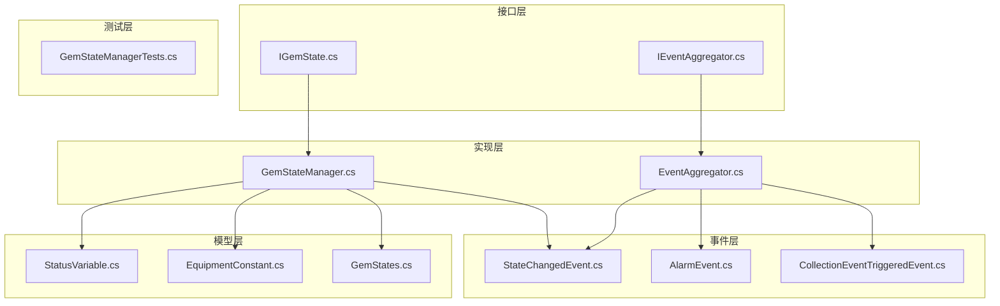

**图表来源**
- [IGemState.cs:20-164](file://WebGem/SECS2GEM/Domain/Interfaces/IGemState.cs#L20-L164)
- [GemStateManager.cs:22-492](file://WebGem/SECS2GEM/Application/State/GemStateManager.cs#L22-L492)
- [StatusVariable.cs:12-61](file://WebGem/SECS2GEM/Domain/Models/StatusVariable.cs#L12-L61)
- [EquipmentConstant.cs:12-122](file://WebGem/SECS2GEM/Domain/Models/EquipmentConstant.cs#L12-L122)

## 核心组件

### IGemState接口概述

IGemState接口定义了GEM状态管理的核心功能，包括：

#### 基础属性
- **设备信息**：ModelName（设备型号）、SoftwareRevision（软件版本）
- **状态属性**：CommunicationState、ControlState、ProcessingState
- **运行状态**：IsOnline（是否在线）、IsRemoteControl（是否远程控制）

#### 状态变量管理
- **GetStatusVariable(uint)**：获取状态变量值
- **SetStatusVariable(uint, object)**：设置状态变量值
- **GetAllStatusVariables()**：获取所有状态变量定义
- **RegisterStatusVariable(StatusVariable)**：注册状态变量

#### 设备常量管理
- **GetEquipmentConstant(uint)**：获取设备常量值
- **TrySetEquipmentConstant(uint, object)**：设置设备常量值
- **GetAllEquipmentConstants()**：获取所有设备常量定义
- **RegisterEquipmentConstant(EquipmentConstant)**：注册设备常量

#### 状态转换功能
- **SetCommunicationState(GemCommunicationState)**：设置通信状态
- **SetControlState(GemControlState)**：设置控制状态
- **SetProcessingState(GemProcessingState)**：设置处理状态
- **RequestOnline()**：请求上线
- **RequestOffline()**：请求离线
- **SwitchToLocal()**：切换到本地控制
- **SwitchToRemote()**：切换到远程控制

**章节来源**
- [IGemState.cs:20-164](file://WebGem/SECS2GEM/Domain/Interfaces/IGemState.cs#L20-L164)

## 架构概览

GEM状态管理系统采用分层架构设计，实现了清晰的职责分离：

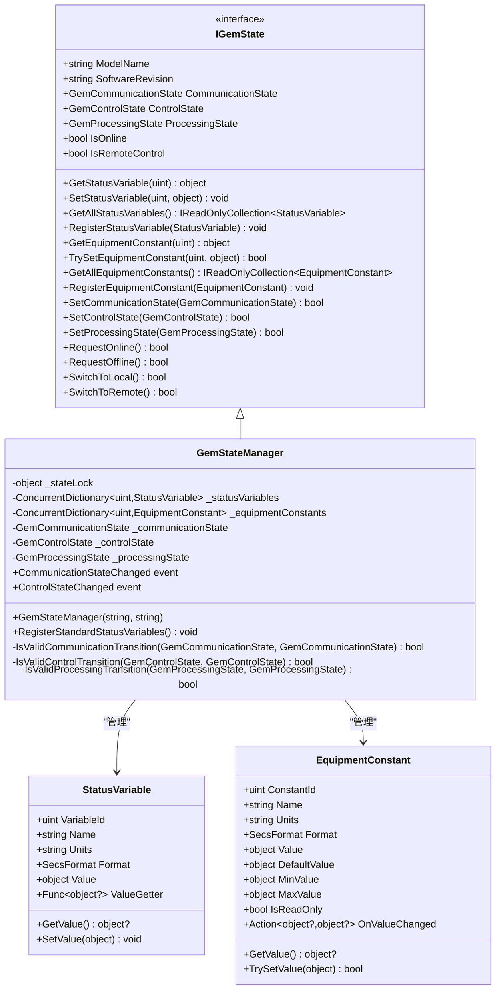

**图表来源**
- [IGemState.cs:20-164](file://WebGem/SECS2GEM/Domain/Interfaces/IGemState.cs#L20-L164)
- [GemStateManager.cs:22-492](file://WebGem/SECS2GEM/Application/State/GemStateManager.cs#L22-L492)
- [StatusVariable.cs:12-61](file://WebGem/SECS2GEM/Domain/Models/StatusVariable.cs#L12-L61)
- [EquipmentConstant.cs:12-122](file://WebGem/SECS2GEM/Domain/Models/EquipmentConstant.cs#L12-L122)

## 详细组件分析

### 状态机设计

#### 通信状态机

GEM通信状态机遵循SEMI E30标准，包含以下状态：

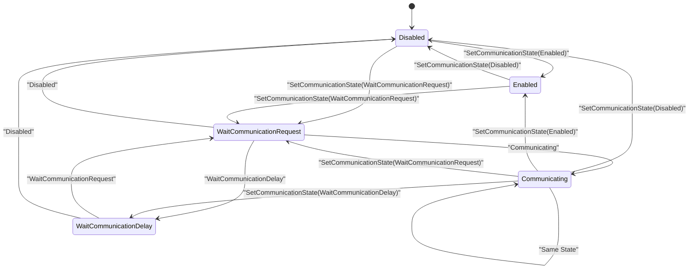

**图表来源**
- [GemStates.cs:10-41](file://WebGem/SECS2GEM/Core/Enums/GemStates.cs#L10-L41)
- [GemStateManager.cs:357-387](file://WebGem/SECS2GEM/Application/State/GemStateManager.cs#L357-L387)

#### 控制状态机

控制状态机管理设备的在线/离线和控制模式：

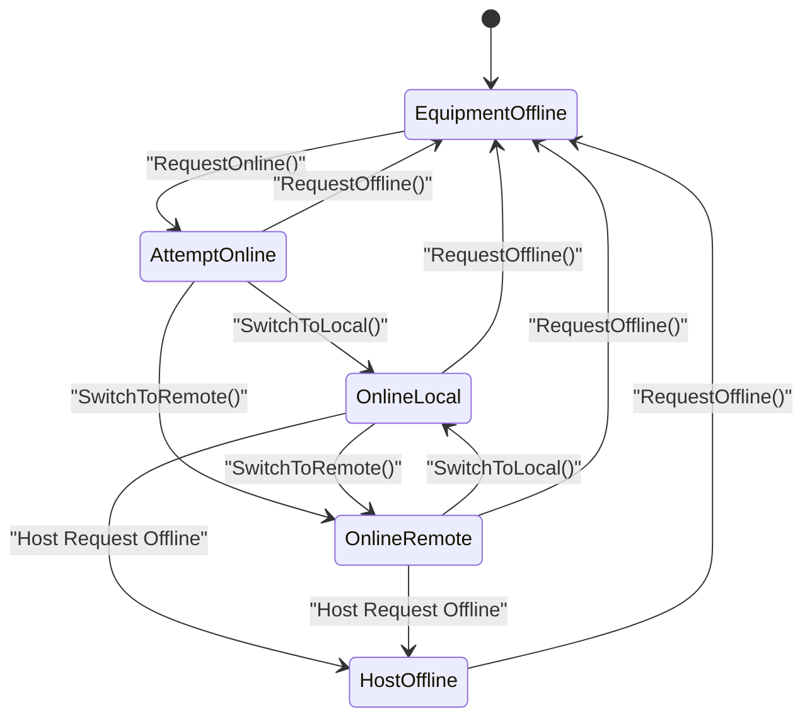

**图表来源**
- [GemStates.cs:50-81](file://WebGem/SECS2GEM/Core/Enums/GemStates.cs#L50-L81)
- [GemStateManager.cs:392-420](file://WebGem/SECS2GEM/Application/State/GemStateManager.cs#L392-L420)

#### 处理状态机

处理状态机描述设备的处理流程：

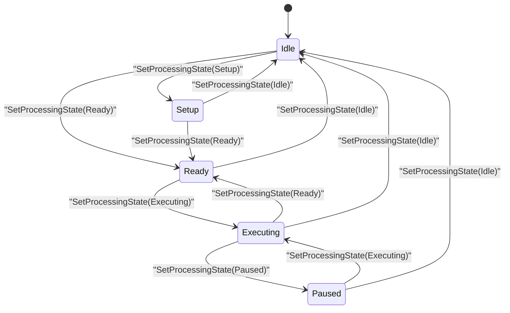

**图表来源**
- [GemStates.cs:89-120](file://WebGem/SECS2GEM/Core/Enums/GemStates.cs#L89-L120)
- [GemStateManager.cs:425-455](file://WebGem/SECS2GEM/Application/State/GemStateManager.cs#L425-L455)

### 状态转换验证机制

GemStateManager实现了严格的转换验证逻辑，确保状态转换的合法性：

#### 通信状态转换验证

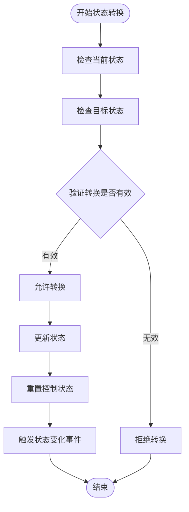

**图表来源**
- [GemStateManager.cs:201-223](file://WebGem/SECS2GEM/Application/State/GemStateManager.cs#L201-L223)
- [GemStateManager.cs:357-387](file://WebGem/SECS2GEM/Application/State/GemStateManager.cs#L357-L387)

#### 控制状态转换验证

控制状态转换验证确保只有在适当的条件下才能进行状态转换，例如只有在通信状态为Communicating时才能请求上线。

**章节来源**
- [GemStateManager.cs:201-348](file://WebGem/SECS2GEM/Application/State/GemStateManager.cs#L201-L348)

### 状态变量和设备常量系统

#### 状态变量管理

状态变量系统提供了灵活的数据访问机制：

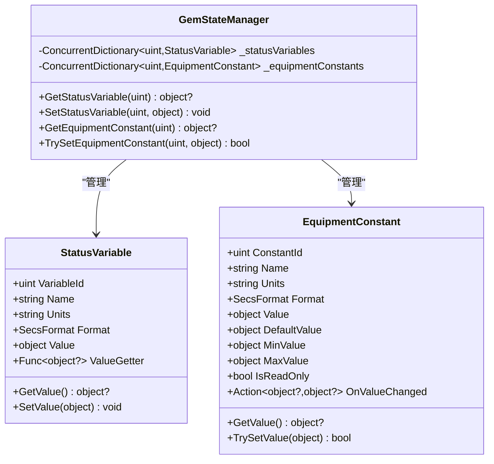

**图表来源**
- [StatusVariable.cs:12-61](file://WebGem/SECS2GEM/Domain/Models/StatusVariable.cs#L12-L61)
- [EquipmentConstant.cs:12-122](file://WebGem/SECS2GEM/Domain/Models/EquipmentConstant.cs#L12-L122)
- [GemStateManager.cs:114-192](file://WebGem/SECS2GEM/Application/State/GemStateManager.cs#L114-L192)

#### 标准状态变量注册

系统自动注册标准状态变量，包括时钟变量（SVID 1）和控制状态变量（SVID 2）：

- **时钟变量（SVID 1）**：提供格式化的当前时间字符串
- **控制状态变量（SVID 2）**：提供当前控制状态的字节值

**章节来源**
- [GemStateManager.cs:464-487](file://WebGem/SECS2GEM/Application/State/GemStateManager.cs#L464-L487)

### 事件驱动架构

#### 事件聚合器实现

系统使用事件聚合器实现松耦合的事件发布/订阅机制：

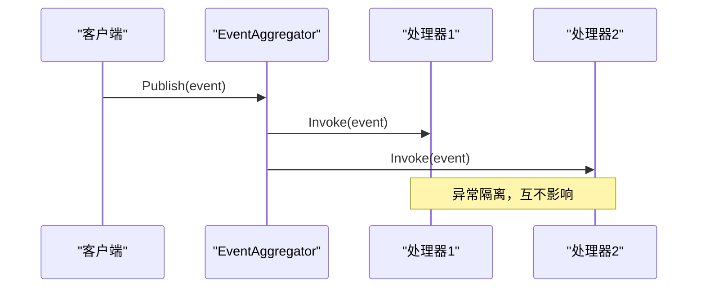

**图表来源**
- [EventAggregator.cs:25-67](file://WebGem/SECS2GEM/Infrastructure/Services/EventAggregator.cs#L25-L67)
- [IEventAggregator.cs:22-65](file://WebGem/SECS2GEM/Domain/Interfaces/IEventAggregator.cs#L22-L65)

#### 状态变化事件

状态变化事件提供了完整的状态转换跟踪能力：

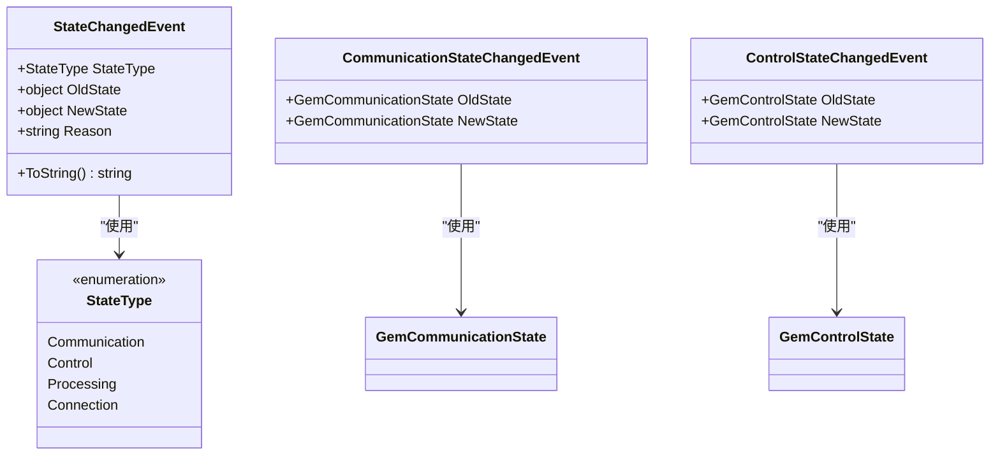

**图表来源**
- [StateChangedEvent.cs:11-110](file://WebGem/SECS2GEM/Domain/Events/StateChangedEvent.cs#L11-L110)

**章节来源**
- [EventAggregator.cs:17-219](file://WebGem/SECS2GEM/Infrastructure/Services/EventAggregator.cs#L17-L219)
- [StateChangedEvent.cs:11-110](file://WebGem/SECS2GEM/Domain/Events/StateChangedEvent.cs#L11-L110)

## 依赖关系分析

### 组件间依赖关系

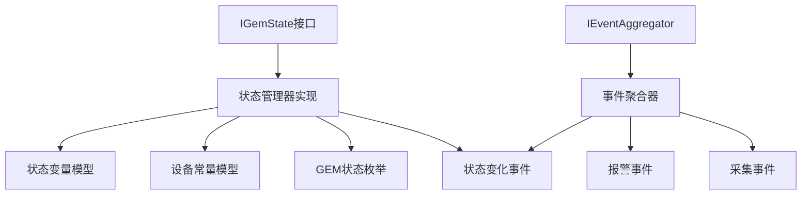

**图表来源**
- [IGemState.cs:1-3](file://WebGem/SECS2GEM/Domain/Interfaces/IGemState.cs#L1-L3)
- [GemStateManager.cs:1-6](file://WebGem/SECS2GEM/Application/State/GemStateManager.cs#L1-L6)
- [EventAggregator.cs:1-4](file://WebGem/SECS2GEM/Infrastructure/Services/EventAggregator.cs#L1-L4)

### 外部依赖

系统主要依赖以下外部组件：
- **System.Collections.Concurrent**：提供线程安全的集合操作
- **SECS2GEM.Core.Enums**：提供GEM协议相关的枚举定义
- **SECS2GEM.Domain.Models**：提供领域模型定义
- **SECS2GEM.Domain.Events**：提供事件模型定义
- **SECS2GEM.Domain.Interfaces**：提供接口定义

**章节来源**
- [GemStateManager.cs:1-6](file://WebGem/SECS2GEM/Application/State/GemStateManager.cs#L1-L6)

## 性能考虑

### 并发安全性

系统采用了多种并发安全机制：

1. **锁机制**：使用`_stateLock`对象确保状态转换的原子性
2. **线程安全集合**：使用`ConcurrentDictionary`管理状态变量和设备常量
3. **事件隔离**：事件处理器之间相互独立，避免阻塞

### 内存优化

- **延迟初始化**：状态变量和设备常量按需注册
- **只读集合**：返回状态变量和设备常量的只读视图
- **值类型优化**：使用值类型枚举减少内存分配

### 性能最佳实践

1. **批量操作**：对于频繁的状态查询，考虑缓存最近的状态值
2. **事件订阅管理**：及时取消不需要的事件订阅，避免内存泄漏
3. **状态变量设计**：合理设计状态变量的ValueGetter，避免昂贵的操作

## 故障排除指南

### 常见问题诊断

#### 状态转换失败

当状态转换返回false时，通常表示转换无效：

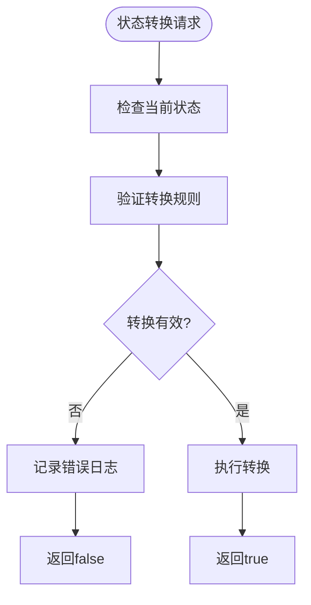

**图表来源**
- [GemStateManager.cs:205-208](file://WebGem/SECS2GEM/Application/State/GemStateManager.cs#L205-L208)

#### 事件处理异常

事件聚合器实现了异常隔离机制，单个事件处理器的异常不会影响其他处理器：

1. **异步处理器异常**：捕获并忽略异常，继续处理其他处理器
2. **同步处理器异常**：捕获并忽略异常，继续处理其他处理器
3. **日志记录**：建议在生产环境中添加适当的日志记录

### 调试工具和方法

#### 状态监控

1. **状态查询**：通过IGemState接口查询当前状态
2. **事件监听**：订阅状态变化事件获取实时状态更新
3. **状态变量检查**：验证状态变量的值是否符合预期

#### 性能监控

1. **事件处理时间**：监控事件处理器的执行时间
2. **内存使用**：监控状态变量和设备常量的数量
3. **并发冲突**：监控状态转换的并发访问情况

**章节来源**
- [EventAggregator.cs:170-197](file://WebGem/SECS2GEM/Infrastructure/Services/EventAggregator.cs#L170-L197)

## 结论

IGemState接口为SECS/GEM协议的状态管理提供了完整而强大的解决方案。通过清晰的接口设计、严格的转换验证、灵活的事件机制和高效的实现，系统能够可靠地管理复杂的设备状态。

关键优势包括：
- **完整的GEM协议支持**：严格遵循SEMI E30标准
- **灵活的状态管理**：支持状态变量和设备常量的动态管理
- **可靠的事件系统**：提供松耦合的状态变化通知
- **高性能实现**：采用并发安全的设计和优化

## 附录

### API参考

#### 接口方法分类

**基础状态查询**
- `CommunicationState`：获取通信状态
- `ControlState`：获取控制状态  
- `ProcessingState`：获取处理状态
- `IsOnline`：检查是否在线
- `IsRemoteControl`：检查是否远程控制

**状态变量操作**
- `GetStatusVariable(uint)`：获取状态变量值
- `SetStatusVariable(uint, object)`：设置状态变量值
- `RegisterStatusVariable(StatusVariable)`：注册状态变量
- `GetAllStatusVariables()`：获取所有状态变量

**设备常量操作**
- `GetEquipmentConstant(uint)`：获取设备常量值
- `TrySetEquipmentConstant(uint, object)`：设置设备常量值
- `RegisterEquipmentConstant(EquipmentConstant)`：注册设备常量
- `GetAllEquipmentConstants()`：获取所有设备常量

**状态转换操作**
- `SetCommunicationState(GemCommunicationState)`：设置通信状态
- `SetControlState(GemControlState)`：设置控制状态
- `SetProcessingState(GemProcessingState)`：设置处理状态
- `RequestOnline()`：请求上线
- `RequestOffline()`：请求离线
- `SwitchToLocal()`：切换到本地控制
- `SwitchToRemote()`：切换到远程控制

### 状态转换规则摘要

#### 通信状态转换规则
- Disabled → Enabled, WaitCommunicationRequest
- Enabled → Disabled, WaitCommunicationRequest
- WaitCommunicationRequest → WaitCommunicationDelay, Communicating, Disabled
- WaitCommunicationDelay → WaitCommunicationRequest, Disabled
- Communicating → 任意状态

#### 控制状态转换规则
- EquipmentOffline → AttemptOnline
- AttemptOnline → OnlineLocal, OnlineRemote, EquipmentOffline
- OnlineLocal → OnlineRemote, EquipmentOffline
- OnlineRemote → OnlineLocal, EquipmentOffline
- HostOffline → EquipmentOffline（从在线状态进入）

#### 处理状态转换规则
- Idle → Setup, Ready
- Setup → Ready, Idle
- Ready → Executing, Idle
- Executing → Paused, Ready, Idle
- Paused → Executing, Idle

### 最佳实践

1. **状态转换验证**：始终检查状态转换的有效性
2. **事件处理**：实现健壮的事件处理器，包含异常处理
3. **资源管理**：及时取消事件订阅，避免内存泄漏
4. **性能优化**：合理设计状态变量，避免昂贵的计算操作
5. **错误处理**：提供清晰的错误信息和回退机制