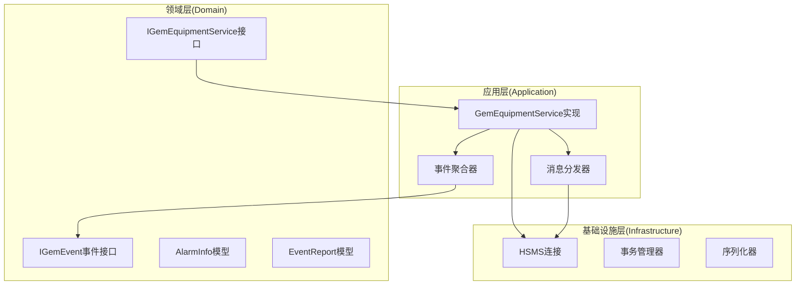
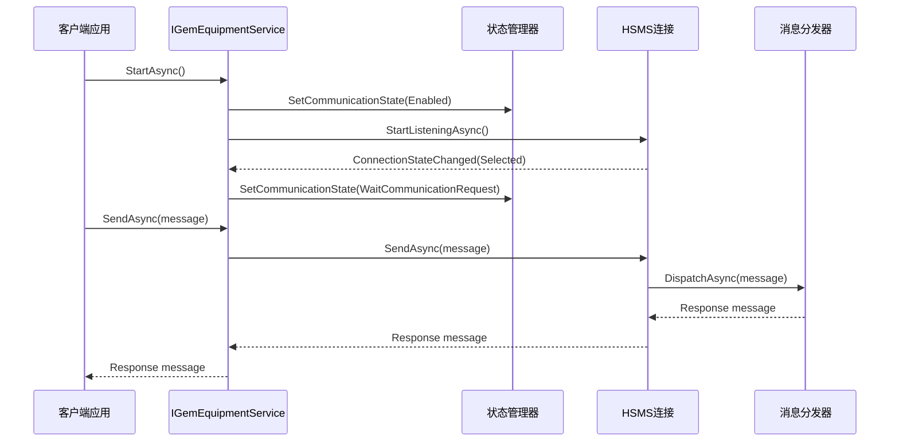
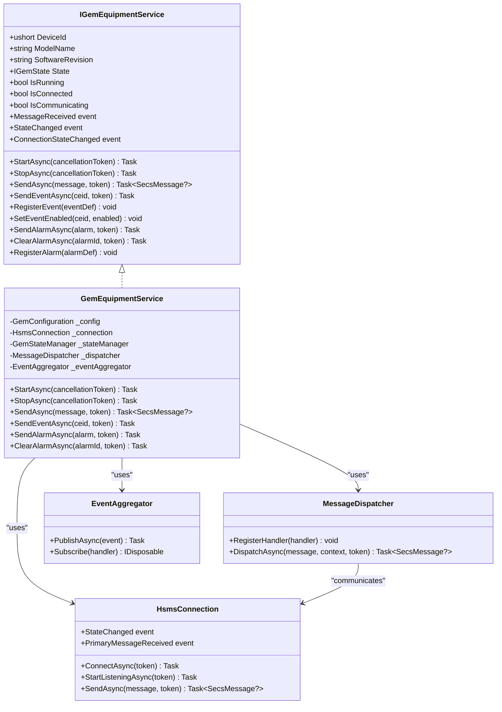

# GEM设备服务接口

<cite>
**本文档引用的文件**
- [IGemEquipmentService.cs](file://WebGem/SECS2GEM/Domain/Interfaces/IGemEquipmentService.cs)
- [GemEquipmentService.cs](file://WebGem/SECS2GEM/Application/Services/GemEquipmentService.cs)
- [GemStates.cs](file://WebGem/SECS2GEM/Core/Enums/GemStates.cs)
- [HsmsConnection.cs](file://WebGem/SECS2GEM/Infrastructure/Connection/HsmsConnection.cs)
- [MessageDispatcher.cs](file://WebGem/SECS2GEM/Application/Messaging/MessageDispatcher.cs)
- [AlarmInfo.cs](file://WebGem/SECS2GEM/Domain/Models/AlarmInfo.cs)
- [EventReport.cs](file://WebGem/SECS2GEM/Domain/Models/EventReport.cs)
- [MessageReceivedEvent.cs](file://WebGem/SECS2GEM/Domain/Events/MessageReceivedEvent.cs)
- [StateChangedEvent.cs](file://WebGem/SECS2GEM/Domain/Events/StateChangedEvent.cs)
- [AlarmEvent.cs](file://WebGem/SECS2GEM/Domain/Events/AlarmEvent.cs)
- [CollectionEventTriggeredEvent.cs](file://WebGem/SECS2GEM/Domain/Events/CollectionEventTriggeredEvent.cs)
- [IEventAggregator.cs](file://WebGem/SECS2GEM/Domain/Interfaces/IEventAggregator.cs)
- [EventAggregator.cs](file://WebGem/SECS2GEM/Infrastructure/Services/EventAggregator.cs)
</cite>

## 目录
1. [简介](#简介)
2. [项目结构](#项目结构)
3. [核心组件](#核心组件)
4. [架构概览](#架构概览)
5. [详细组件分析](#详细组件分析)
6. [依赖关系分析](#依赖关系分析)
7. [性能考虑](#性能考虑)
8. [故障排除指南](#故障排除指南)
9. [结论](#结论)

## 简介

IGemEquipmentService接口是SECS/GEM协议栈中的核心设备服务接口，采用外观模式为复杂的GEM子系统提供统一的入口点。该接口实现了SEMI E30标准中定义的GEM设备功能，包括设备属性访问、状态查询、生命周期管理、消息发送、事件报告、报警管理和事件订阅等功能。

该接口设计遵循面向对象原则，通过清晰的方法签名和事件机制，为上层应用提供了简洁而强大的API。接口的实现采用了模块化设计，将HSMS连接管理、消息分发、状态管理等功能进行有效分离，提高了系统的可维护性和可扩展性。

## 项目结构

基于SECS2GEM项目的架构，IGemEquipmentService接口位于领域层(Domain)，通过应用程序层(Application)的具体实现来提供完整的设备服务功能。



**图表来源**
- [IGemEquipmentService.cs:1-160](file://WebGem/SECS2GEM/Domain/Interfaces/IGemEquipmentService.cs#L1-L160)
- [GemEquipmentService.cs:1-456](file://WebGem/SECS2GEM/Application/Services/GemEquipmentService.cs#L1-L456)

**章节来源**
- [IGemEquipmentService.cs:1-160](file://WebGem/SECS2GEM/Domain/Interfaces/IGemEquipmentService.cs#L1-L160)
- [GemEquipmentService.cs:1-456](file://WebGem/SECS2GEM/Application/Services/GemEquipmentService.cs#L1-L456)

## 核心组件

### 设备属性访问接口

IGemEquipmentService接口提供了三个核心的设备属性访问方法：

- **DeviceId**: 返回设备的唯一标识符(ushort类型)，用于在HSMS网络中识别特定设备
- **ModelName**: 返回设备的型号字符串，描述设备的硬件或软件型号
- **SoftwareRevision**: 返回设备的软件版本信息，用于版本管理和兼容性检查

这些属性为上层应用提供了设备的基本识别信息，支持设备发现和管理功能。

### 状态查询接口

接口定义了三个状态查询属性，用于监控设备的运行状态：

- **IsRunning**: 布尔值，指示服务是否正在运行
- **IsConnected**: 布尔值，指示设备是否已建立HSMS连接(Selected状态)
- **IsCommunicating**: 布尔值，指示设备是否处于正常的GEM通信状态

这些状态属性提供了设备运行时的实时状态信息，支持监控和诊断功能。

**章节来源**
- [IGemEquipmentService.cs:25-60](file://WebGem/SECS2GEM/Domain/Interfaces/IGemEquipmentService.cs#L25-L60)

## 架构概览

GEM设备服务采用分层架构设计，通过外观模式将复杂的GEM协议处理逻辑封装在统一的接口后面。



**图表来源**
- [GemEquipmentService.cs:140-202](file://WebGem/SECS2GEM/Application/Services/GemEquipmentService.cs#L140-L202)
- [HsmsConnection.cs:146-186](file://WebGem/SECS2GEM/Infrastructure/Connection/HsmsConnection.cs#L146-L186)

**章节来源**
- [GemEquipmentService.cs:13-456](file://WebGem/SECS2GEM/Application/Services/GemEquipmentService.cs#L13-L456)

## 详细组件分析

### 生命周期管理

#### StartAsync方法

**方法签名**: `Task StartAsync(CancellationToken cancellationToken = default)`

**功能**: 启动GEM设备服务，开始监听HSMS连接或主动建立连接。

**参数说明**:
- `cancellationToken`: 取消令牌，用于中断启动过程

**返回值**: Task类型的异步操作

**异常处理**:
- 不支持重复启动：如果服务已在运行状态，直接返回
- 配置验证：根据HsmsConfiguration.Mode决定启动模式
- 连接异常：捕获连接失败并转换为SecsCommunicationException

**使用示例**:
```csharp
// 基本启动
await equipmentService.StartAsync();

// 带取消令牌的启动
using var cts = new CancellationTokenSource(TimeSpan.FromSeconds(30));
await equipmentService.StartAsync(cts.Token);
```

#### StopAsync方法

**方法签名**: `Task StopAsync(CancellationToken cancellationToken = default)`

**功能**: 停止GEM设备服务，断开HSMS连接并重置状态。

**参数说明**:
- `cancellationToken`: 取消令牌，用于中断停止过程

**返回值**: Task类型的异步操作

**异常处理**:
- 不支持重复停止：如果服务未运行，直接返回
- 连接断开：确保底层连接正确断开
- 状态重置：将通信状态设置为Disabled

**使用示例**:
```csharp
// 基本停止
await equipmentService.StopAsync();

// 带取消令牌的停止
await equipmentService.StopAsync(cts.Token);
```

**章节来源**
- [IGemEquipmentService.cs:62-76](file://WebGem/SECS2GEM/Domain/Interfaces/IGemEquipmentService.cs#L62-L76)
- [GemEquipmentService.cs:140-174](file://WebGem/SECS2GEM/Application/Services/GemEquipmentService.cs#L140-L174)

### 消息发送

#### SendAsync方法

**方法签名**: `Task<SecsMessage?> SendAsync(SecsMessage message, CancellationToken cancellationToken = default)`

**功能**: 发送SECS消息并等待响应，支持同步和异步消息交互。

**参数说明**:
- `message`: 要发送的SecsMessage对象
- `cancellationToken`: 取消令牌，用于中断发送过程

**返回值**: Task<SecsMessage?>，返回响应消息或null

**异常处理**:
- 连接状态检查：如果未连接则抛出InvalidOperationException
- 底层传输异常：捕获网络传输异常并重新抛出
- 取消操作：支持取消令牌中断操作

**使用示例**:
```csharp
// 发送简单消息
var message = new SecsMessage(1, 1, false);
var response = await equipmentService.SendAsync(message);

// 发送带取消支持的消息
using var cts = new CancellationTokenSource(TimeSpan.FromSeconds(10));
var response = await equipmentService.SendAsync(message, cts.Token);
```

**章节来源**
- [IGemEquipmentService.cs:78-90](file://WebGem/SECS2GEM/Domain/Interfaces/IGemEquipmentService.cs#L78-L90)
- [GemEquipmentService.cs:192-202](file://WebGem/SECS2GEM/Application/Services/GemEquipmentService.cs#L192-L202)

### 事件报告

#### SendEventAsync方法

**方法签名**: `Task SendEventAsync(uint ceid, CancellationToken cancellationToken = default)`

**功能**: 发送S6F11事件报告消息，上报设备状态变化或生产事件。

**参数说明**:
- `ceid`: 采集事件ID，标识要上报的事件类型
- `cancellationToken`: 取消令牌

**返回值**: Task类型的异步操作

**异常处理**:
- 通信状态检查：仅在IsCommunicating状态下处理
- 事件定义验证：检查事件是否存在且已启用
- 消息构建：动态构建事件报告数据
- 事件发布：通过EventAggregator发布CollectionEventTriggeredEvent

**使用示例**:
```csharp
// 发送事件报告
await equipmentService.SendEventAsync(1001);

// 发送带取消支持的事件报告
await equipmentService.SendEventAsync(1001, cts.Token);
```

#### RegisterEvent方法

**方法签名**: `void RegisterEvent(CollectionEvent eventDefinition)`

**功能**: 注册采集事件定义，配置事件与报告的关联关系。

**参数说明**:
- `eventDefinition`: CollectionEvent对象，包含事件配置信息

**返回值**: void

**使用示例**:
```csharp
var eventDef = new CollectionEvent
{
    EventId = 1001,
    Name = "MachineStatusChange",
    IsEnabled = true,
    LinkedReportIds = new List<uint> { 1, 2, 3 }
};
equipmentService.RegisterEvent(eventDef);
```

#### SetEventEnabled方法

**方法签名**: `void SetEventEnabled(uint ceid, bool enabled)`

**功能**: 启用或禁用指定的采集事件。

**参数说明**:
- `ceid`: 事件ID
- `enabled`: 是否启用事件

**返回值**: void

**使用示例**:
```csharp
// 禁用事件
equipmentService.SetEventEnabled(1001, false);

// 启用事件
equipmentService.SetEventEnabled(1001, true);
```

**章节来源**
- [IGemEquipmentService.cs:92-114](file://WebGem/SECS2GEM/Domain/Interfaces/IGemEquipmentService.cs#L92-L114)
- [GemEquipmentService.cs:211-264](file://WebGem/SECS2GEM/Application/Services/GemEquipmentService.cs#L211-L264)

### 报警管理

#### SendAlarmAsync方法

**方法签名**: `Task SendAlarmAsync(AlarmInfo alarm, CancellationToken cancellationToken = default)`

**功能**: 发送S5F1报警消息，上报设备报警状态。

**参数说明**:
- `alarm`: AlarmInfo对象，包含报警信息
- `cancellationToken`: 取消令牌

**返回值**: Task类型的异步操作

**异常处理**:
- 通信状态检查：仅在IsCommunicating状态下处理
- 报警状态管理：跟踪活动报警
- 消息构建：根据报警状态构建ALCD字节
- 事件发布：通过EventAggregator发布AlarmEvent

**使用示例**:
```csharp
var alarm = new AlarmInfo
{
    AlarmId = 1,
    AlarmText = "Temperature Too High",
    IsSet = true,
    Category = AlarmCategory.EquipmentSafety
};
await equipmentService.SendAlarmAsync(alarm);
```

#### ClearAlarmAsync方法

**方法签名**: `Task ClearAlarmAsync(uint alarmId, CancellationToken cancellationToken = default)`

**功能**: 清除指定的报警状态。

**参数说明**:
- `alarmId`: 报警ID
- `cancellationToken`: 取消令牌

**返回值**: Task类型的异步操作

**异常处理**:
- 活动报警检查：验证报警是否存在于活动报警集合中
- 状态更新：将报警状态设置为false
- 重新发送：调用SendAlarmAsync发送清除消息
- 状态清理：从活动报警集合中移除报警

**使用示例**:
```csharp
await equipmentService.ClearAlarmAsync(1);
```

#### RegisterAlarm方法

**方法签名**: `void RegisterAlarm(AlarmDefinition alarm)`

**功能**: 注册报警定义，配置设备支持的报警类型。

**参数说明**:
- `alarm`: AlarmDefinition对象，包含报警配置

**返回值**: void

**使用示例**:
```csharp
var alarmDef = new AlarmDefinition
{
    AlarmId = 1,
    Name = "OverTemperature",
    Description = "Temperature exceeds safe limits",
    Category = AlarmCategory.EquipmentSafety,
    IsEnabled = true
};
equipmentService.RegisterAlarm(alarmDef);
```

**章节来源**
- [IGemEquipmentService.cs:116-138](file://WebGem/SECS2GEM/Domain/Interfaces/IGemEquipmentService.cs#L116-L138)
- [GemEquipmentService.cs:273-315](file://WebGem/SECS2GEM/Application/Services/GemEquipmentService.cs#L273-L315)

### 事件订阅

#### MessageReceived事件

**事件签名**: `event EventHandler<MessageReceivedEvent>? MessageReceived`

**功能**: 当设备接收到SECS消息时触发，提供消息接收通知。

**事件参数**: MessageReceivedEvent对象，包含消息内容、方向、系统字节等信息

**使用示例**:
```csharp
equipmentService.MessageReceived += (sender, e) =>
{
    Console.WriteLine($"Received message: {e.Message.Name}");
};
```

#### StateChanged事件

**事件签名**: `event EventHandler<StateChangedEvent>? StateChanged`

**功能**: 当GEM状态发生变化时触发，提供状态变更通知。

**事件参数**: StateChangedEvent对象，包含状态类型、新旧状态值等信息

**使用示例**:
```csharp
equipmentService.StateChanged += (sender, e) =>
{
    Console.WriteLine($"State changed: {e.OldState} -> {e.NewState}");
};
```

#### ConnectionStateChanged事件

**事件签名**: `event EventHandler<ConnectionStateChangedEventArgs>? ConnectionStateChanged`

**功能**: 当连接状态发生变化时触发，提供连接状态变更通知。

**事件参数**: ConnectionStateChangedEventArgs对象，包含连接状态变化详情

**使用示例**:
```csharp
equipmentService.ConnectionStateChanged += (sender, e) =>
{
    Console.WriteLine($"Connection state: {e.OldState} -> {e.NewState}");
};
```

**章节来源**
- [IGemEquipmentService.cs:140-157](file://WebGem/SECS2GEM/Domain/Interfaces/IGemEquipmentService.cs#L140-L157)

## 依赖关系分析

GEM设备服务接口的实现展示了良好的依赖注入和模块化设计。



**图表来源**
- [IGemEquipmentService.cs:25-158](file://WebGem/SECS2GEM/Domain/Interfaces/IGemEquipmentService.cs#L25-L158)
- [GemEquipmentService.cs:33-133](file://WebGem/SECS2GEM/Application/Services/GemEquipmentService.cs#L33-L133)

**章节来源**
- [GemEquipmentService.cs:33-133](file://WebGem/SECS2GEM/Application/Services/GemEquipmentService.cs#L33-L133)

## 性能考虑

### 异步操作优化

GEM设备服务接口全面采用异步编程模型，避免阻塞操作对系统性能的影响。所有I/O密集型操作都使用async/await模式实现，支持取消令牌中断长时间操作。

### 连接池管理

HSMS连接采用连接池模式，支持被动(Passive)和主动(Active)两种连接模式。连接状态通过ConnectionState枚举管理，确保连接的可靠性和稳定性。

### 消息处理效率

消息分发器使用责任链模式，支持动态注册处理器。处理器按优先级排序，首次匹配即处理，提高了消息处理的效率。

### 内存管理

使用Interlocked.Increment确保多线程环境下的原子性操作，避免竞态条件。事件聚合器使用ConcurrentDictionary存储订阅者，支持高并发场景下的事件发布。

## 故障排除指南

### 连接问题

**常见问题**: 设备无法连接到主机

**解决方案**:
1. 检查HsmsConfiguration配置是否正确
2. 验证网络连通性和防火墙设置
3. 确认主机IP地址和端口配置
4. 查看连接状态事件获取详细错误信息

**章节来源**
- [HsmsConnection.cs:146-186](file://WebGem/SECS2GEM/Infrastructure/Connection/HsmsConnection.cs#L146-L186)

### 通信状态异常

**常见问题**: 设备状态停留在WaitCommunicationRequest

**解决方案**:
1. 检查S1F13消息处理是否正确
2. 验证设备是否正确响应Select请求
3. 查看状态变化事件获取状态转换详情
4. 确认AutoOnline配置是否正确

**章节来源**
- [GemEquipmentService.cs:324-384](file://WebGem/SECS2GEM/Application/Services/GemEquipmentService.cs#L324-L384)

### 消息发送失败

**常见问题**: SendAsync抛出InvalidOperationException

**解决方案**:
1. 检查IsConnected属性确认连接状态
2. 验证消息格式和参数
3. 查看底层连接状态
4. 实现适当的重试机制

**章节来源**
- [GemEquipmentService.cs:196-202](file://WebGem/SECS2GEM/Application/Services/GemEquipmentService.cs#L196-L202)

### 事件处理问题

**常见问题**: 事件未按预期触发

**解决方案**:
1. 确认事件已正确注册
2. 检查事件是否已启用
3. 验证事件处理器是否正确实现
4. 查看事件聚合器订阅状态

**章节来源**
- [EventAggregator.cs:25-67](file://WebGem/SECS2GEM/Infrastructure/Services/EventAggregator.cs#L25-L67)

## 结论

IGemEquipmentService接口为SECS/GEM协议栈提供了完整而优雅的设备服务抽象。通过外观模式的设计，该接口成功地将复杂的GEM协议处理逻辑封装起来，为上层应用提供了简洁而强大的API。

接口设计体现了以下优秀特性：

1. **清晰的职责分离**: 设备属性、状态查询、生命周期管理、消息处理等功能模块化
2. **完善的异常处理**: 全面的错误处理和状态检查机制
3. **灵活的事件机制**: 基于观察者模式的事件发布订阅系统
4. **高性能的异步实现**: 全面的异步编程支持和优化
5. **良好的扩展性**: 支持自定义消息处理器和事件处理器

该接口不仅满足了SEMI E30标准的要求，还通过创新的设计模式提升了系统的可维护性和可扩展性，为工业自动化领域的设备通信提供了可靠的解决方案。