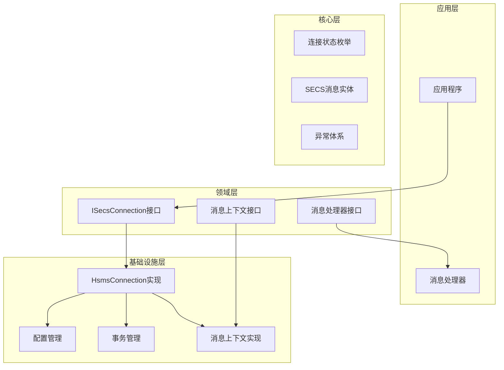
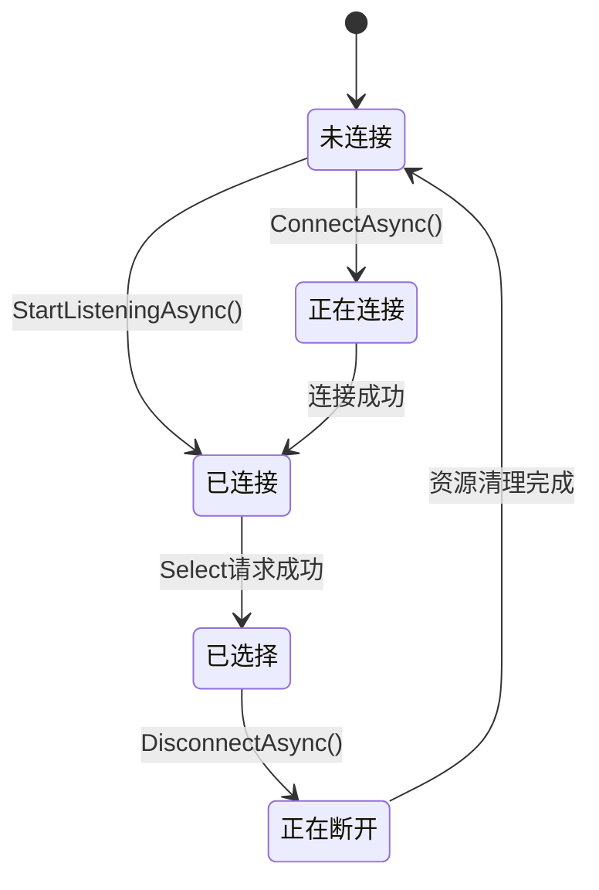
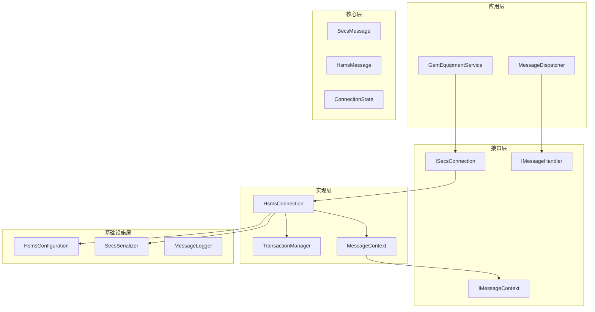
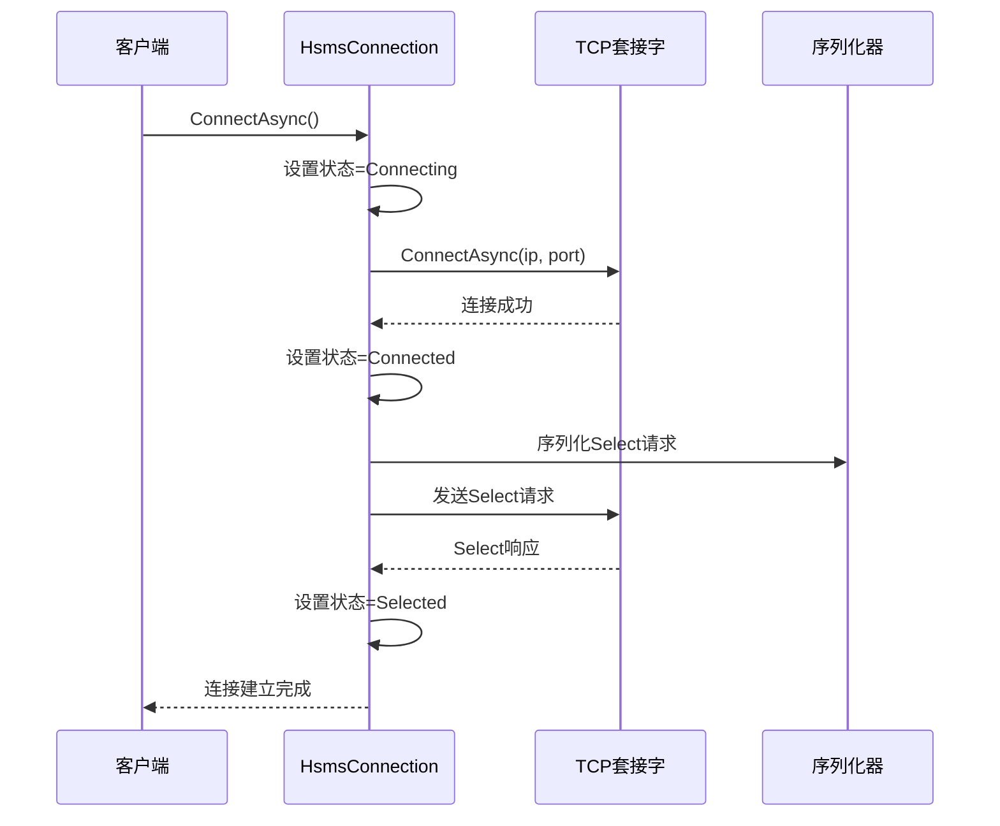
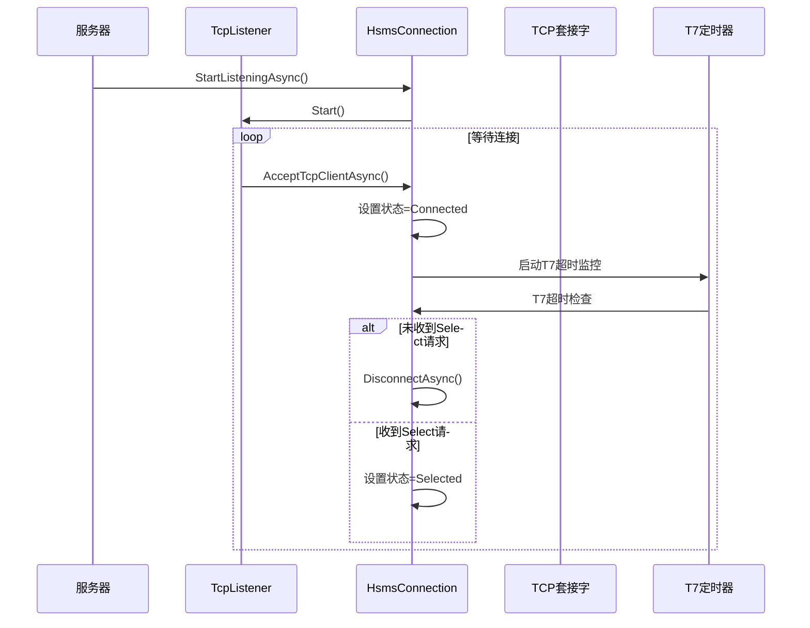
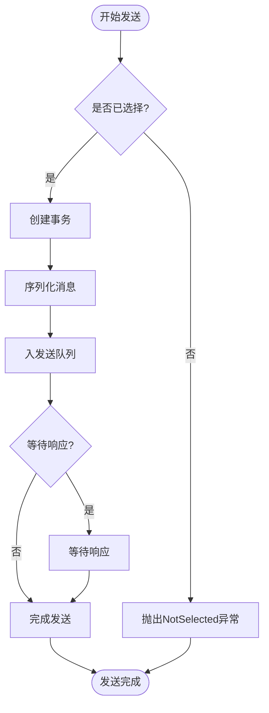
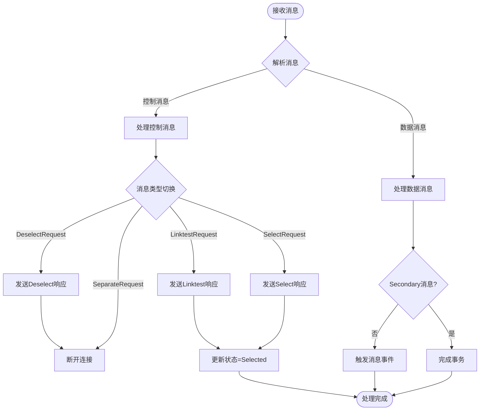
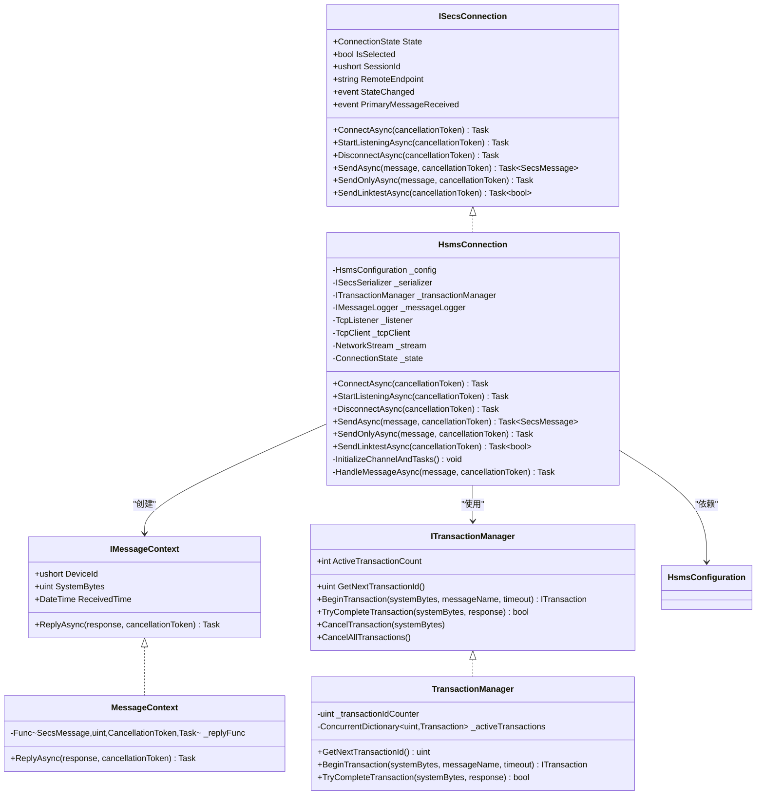
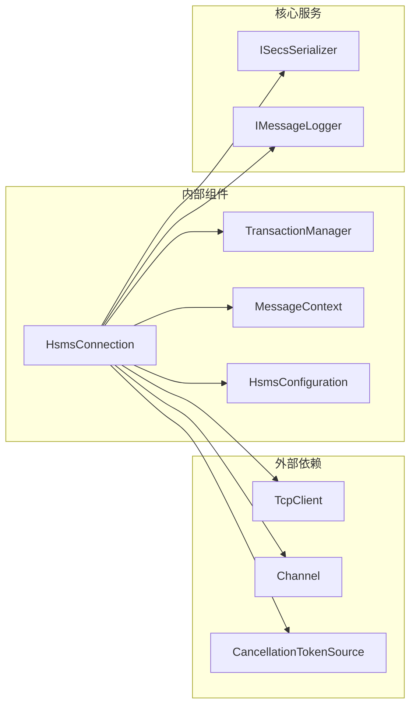
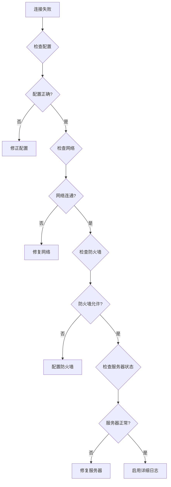

# SECS连接接口

<cite>
**本文档引用的文件**
- [ISecsConnection.cs](file://WebGem/SECS2GEM/Domain/Interfaces/ISecsConnection.cs)
- [HsmsConnection.cs](file://WebGem/SECS2GEM/Infrastructure/Connection/HsmsConnection.cs)
- [HsmsConfiguration.cs](file://WebGem/SECS2GEM/Infrastructure/Configuration/HsmsConfiguration.cs)
- [ConnectionState.cs](file://WebGem/SECS2GEM/Core/Enums/ConnectionState.cs)
- [MessageContext.cs](file://WebGem/SECS2GEM/Infrastructure/Connection/MessageContext.cs)
- [IMessageHandler.cs](file://WebGem/SECS2GEM/Domain/Interfaces/IMessageHandler.cs)
- [TransactionManager.cs](file://WebGem/SECS2GEM/Infrastructure/Services/TransactionManager.cs)
- [SecsCommunicationException.cs](file://WebGem/SECS2GEM/Core/Exceptions/SecsCommunicationException.cs)
- [SecsTimeoutException.cs](file://WebGem/SECS2GEM/Core/Exceptions/SecsTimeoutException.cs)
- [IntegrationTests.cs](file://WebGem/SECS2GEM.Tests/IntegrationTests.cs)
</cite>

## 目录
1. [简介](#简介)
2. [项目结构](#项目结构)
3. [核心组件](#核心组件)
4. [架构概览](#架构概览)
5. [详细组件分析](#详细组件分析)
6. [依赖关系分析](#依赖关系分析)
7. [性能考虑](#性能考虑)
8. [故障排除指南](#故障排除指南)
9. [结论](#结论)

## 简介

SECS连接接口是SEMI E37标准HSMS（High-Speed Machine Side）协议的.NET实现，提供了设备与主机之间的高速通信能力。本接口设计遵循异步编程模型，支持主动和被动两种连接模式，实现了完整的HSMS协议栈功能。

该接口的核心价值在于：
- **标准化协议支持**：完全符合SEMI E37标准的HSMS协议实现
- **异步非阻塞**：基于Task和Channel的异步消息处理模型
- **状态管理**：完整的连接生命周期状态管理
- **事务处理**：基于SystemBytes的事务跟踪和超时管理
- **事件驱动**：通过事件通知连接状态变化和消息接收

## 项目结构

SECS连接接口位于WebGem解决方案的SECS2GEM项目中，采用清晰的分层架构：

**图表来源**
- [ISecsConnection.cs:59-142](file://WebGem/SECS2GEM/Domain/Interfaces/ISecsConnection.cs#L59-L142)
- [HsmsConnection.cs:30-139](file://WebGem/SECS2GEM/Infrastructure/Connection/HsmsConnection.cs#L30-L139)

**章节来源**
- [ISecsConnection.cs:1-144](file://WebGem/SECS2GEM/Domain/Interfaces/ISecsConnection.cs#L1-L144)
- [HsmsConnection.cs:1-906](file://WebGem/SECS2GEM/Infrastructure/Connection/HsmsConnection.cs#L1-L906)

## 核心组件

### ISecsConnection接口

ISecsConnection是SECS连接的核心抽象，定义了完整的连接管理API：

#### 连接管理方法
- **ConnectAsync()**：主动模式建立连接
- **StartListeningAsync()**：被动模式开始监听
- **DisconnectAsync()**：断开连接

#### 消息处理方法
- **SendAsync()**：发送消息并等待回复
- **SendOnlyAsync()**：发送消息（不等待回复）
- **SendLinktestAsync()**：发送Linktest心跳

#### 状态属性
- **State**：当前连接状态
- **IsSelected**：是否已选择（会话建立）
- **SessionId**：会话ID（设备ID）
- **RemoteEndpoint**：远程端点信息

#### 事件系统
- **StateChanged**：连接状态变化事件
- **PrimaryMessageReceived**：Primary消息接收事件

**章节来源**
- [ISecsConnection.cs:71-142](file://WebGem/SECS2GEM/Domain/Interfaces/ISecsConnection.cs#L71-L142)

### HsmsConnection实现

HsmsConnection是ISecsConnection接口的具体实现，采用状态模式管理连接生命周期：

#### 线程模型
- **接收任务**：持续读取TCP数据，解析消息
- **发送任务**：从Channel读取消息并发送
- **心跳任务**：定期发送Linktest

#### 状态转换

**图表来源**
- [ConnectionState.cs:10-41](file://WebGem/SECS2GEM/Core/Enums/ConnectionState.cs#L10-L41)
- [HsmsConnection.cs:64-78](file://WebGem/SECS2GEM/Infrastructure/Connection/HsmsConnection.cs#L64-L78)

**章节来源**
- [HsmsConnection.cs:30-418](file://WebGem/SECS2GEM/Infrastructure/Connection/HsmsConnection.cs#L30-L418)

## 架构概览

SECS连接架构采用分层设计，各层职责明确：

**图表来源**
- [HsmsConnection.cs:122-139](file://WebGem/SECS2GEM/Infrastructure/Connection/HsmsConnection.cs#L122-L139)
- [TransactionManager.cs:24-119](file://WebGem/SECS2GEM/Infrastructure/Services/TransactionManager.cs#L24-L119)

## 详细组件分析

### 连接建立流程

#### 主动连接流程

**图表来源**
- [HsmsConnection.cs:146-186](file://WebGem/SECS2GEM/Infrastructure/Connection/HsmsConnection.cs#L146-L186)
- [HsmsConnection.cs:520-541](file://WebGem/SECS2GEM/Infrastructure/Connection/HsmsConnection.cs#L520-L541)

#### 被动连接流程

**图表来源**
- [HsmsConnection.cs:191-296](file://WebGem/SECS2GEM/Infrastructure/Connection/HsmsConnection.cs#L191-L296)

**章节来源**
- [HsmsConnection.cs:146-296](file://WebGem/SECS2GEM/Infrastructure/Connection/HsmsConnection.cs#L146-L296)

### 消息发送与接收

#### 异步消息发送流程

**图表来源**
- [HsmsConnection.cs:427-453](file://WebGem/SECS2GEM/Infrastructure/Connection/HsmsConnection.cs#L427-L453)
- [TransactionManager.cs:46-72](file://WebGem/SECS2GEM/Infrastructure/Services/TransactionManager.cs#L46-L72)

#### 消息处理流程

**图表来源**
- [HsmsConnection.cs:732-814](file://WebGem/SECS2GEM/Infrastructure/Connection/HsmsConnection.cs#L732-L814)
- [HsmsConnection.cs:747-792](file://WebGem/SECS2GEM/Infrastructure/Connection/HsmsConnection.cs#L747-L792)

**章节来源**
- [HsmsConnection.cs:427-814](file://WebGem/SECS2GEM/Infrastructure/Connection/HsmsConnection.cs#L427-L814)

### 配置管理

HsmsConfiguration提供了全面的连接参数配置：

#### 超时参数配置
- **T3超时**：回复超时（默认45秒）
- **T5超时**：连接分离超时（默认10秒）
- **T6超时**：控制事务超时（默认5秒）
- **T7超时**：未选择超时（默认10秒）
- **T8超时**：网络字符间隔超时（默认5秒）

#### 心跳参数配置
- **LinktestInterval**：心跳间隔（默认30秒）
- **MaxLinktestFailures**：最大连续心跳失败次数（默认3次）

#### 缓冲区配置
- **ReceiveBufferSize**：接收缓冲区大小（默认64KB）
- **SendBufferSize**：发送缓冲区大小（默认64KB）

**章节来源**
- [HsmsConfiguration.cs:15-228](file://WebGem/SECS2GEM/Infrastructure/Configuration/HsmsConfiguration.cs#L15-L228)

## 依赖关系分析

### 类关系图

**图表来源**
- [ISecsConnection.cs:71-142](file://WebGem/SECS2GEM/Domain/Interfaces/ISecsConnection.cs#L71-L142)
- [HsmsConnection.cs:30-139](file://WebGem/SECS2GEM/Infrastructure/Connection/HsmsConnection.cs#L30-L139)
- [MessageContext.cs:12-63](file://WebGem/SECS2GEM/Infrastructure/Connection/MessageContext.cs#L12-L63)
- [TransactionManager.cs:24-119](file://WebGem/SECS2GEM/Infrastructure/Services/TransactionManager.cs#L24-L119)

### 依赖注入关系

**图表来源**
- [HsmsConnection.cs:32-36](file://WebGem/SECS2GEM/Infrastructure/Connection/HsmsConnection.cs#L32-L36)
- [TransactionManager.cs:24-28](file://WebGem/SECS2GEM/Infrastructure/Services/TransactionManager.cs#L24-L28)

**章节来源**
- [HsmsConnection.cs:30-418](file://WebGem/SECS2GEM/Infrastructure/Connection/HsmsConnection.cs#L30-L418)
- [TransactionManager.cs:24-201](file://WebGem/SECS2GEM/Infrastructure/Services/TransactionManager.cs#L24-L201)

## 性能考虑

### 并发连接处理最佳实践

#### 连接池管理
- **单连接单用途**：每个HsmsConnection实例管理单一连接
- **无连接池设计**：避免连接池复杂性，简化状态管理
- **资源隔离**：每个连接拥有独立的缓冲区和线程

#### 异步处理优化
- **Channel队列**：使用无界Channel实现消息队列
- **Task并行**：接收、发送、心跳任务并行执行
- **零拷贝优化**：直接使用byte[]避免额外复制

#### 内存管理
- **缓冲区复用**：接收缓冲区在循环中复用
- **及时释放**：连接断开时立即释放所有资源
- **弱引用**：避免循环引用导致的内存泄漏

### 性能调优建议

#### 网络参数优化
- **缓冲区大小**：根据消息大小调整ReceiveBufferSize和SendBufferSize
- **心跳间隔**：平衡心跳频率与CPU消耗
- **超时设置**：根据网络环境调整T3-T8超时参数

#### 事务管理优化
- **事务超时**：合理设置T3超时避免长时间占用资源
- **事务清理**：及时清理超时和已完成的事务
- **并发控制**：避免同时发送大量需要响应的消息

**章节来源**
- [HsmsConfiguration.cs:96-173](file://WebGem/SECS2GEM/Infrastructure/Configuration/HsmsConfiguration.cs#L96-L173)
- [TransactionManager.cs:124-201](file://WebGem/SECS2GEM/Infrastructure/Services/TransactionManager.cs#L124-L201)

## 故障排除指南

### 常见连接问题

#### 连接失败诊断

**图表来源**
- [SecsCommunicationException.cs:114-151](file://WebGem/SECS2GEM/Core/Exceptions/SecsCommunicationException.cs#L114-L151)

#### 超时问题诊断
- **T3超时**：消息发送后未收到响应
- **T6超时**：控制消息（Select/Deselect/Linktest）响应超时
- **T7超时**：被动模式下未收到Select请求
- **T8超时**：消息传输中字符间隔超时

#### 心跳问题诊断
- **Linktest失败**：连续多次心跳请求无响应
- **连接中断**：心跳失败达到阈值后自动断开
- **恢复机制**：断开后按T5间隔自动重连

### 日志和监控

#### 消息日志配置
- **启用条件**：通过MessageLogging配置控制
- **日志级别**：区分详细和基本日志模式
- **文件管理**：自动轮转和清理旧日志

#### 异常处理策略
- **通信异常**：封装具体的错误类型
- **超时异常**：提供详细的超时信息
- **状态异常**：在不适当状态下调用方法时抛出

**章节来源**
- [SecsCommunicationException.cs:64-154](file://WebGem/SECS2GEM/Core/Exceptions/SecsCommunicationException.cs#L64-L154)
- [SecsTimeoutException.cs:57-162](file://WebGem/SECS2GEM/Core/Exceptions/SecsTimeoutException.cs#L57-L162)

## 结论

SECS连接接口提供了完整的HSMS协议实现，具有以下特点：

### 技术优势
- **标准兼容**：完全符合SEMI E37标准
- **异步设计**：基于现代.NET异步编程模型
- **状态管理**：清晰的连接生命周期管理
- **扩展性强**：模块化设计便于功能扩展

### 实现特色
- **事件驱动**：通过事件实现松耦合的消息处理
- **事务管理**：完善的事务跟踪和超时处理
- **错误处理**：详细的异常类型和诊断信息
- **性能优化**：多线程并发和内存优化

### 应用场景
该接口适用于各种SEMI E37标准的设备通信场景，包括：
- 半导体制造设备通信
- 显示面板生产设备集成
- 电子元器件测试设备
- 自动化生产线控制系统

通过合理的配置和使用，SECS连接接口能够为企业提供稳定可靠的设备通信解决方案。