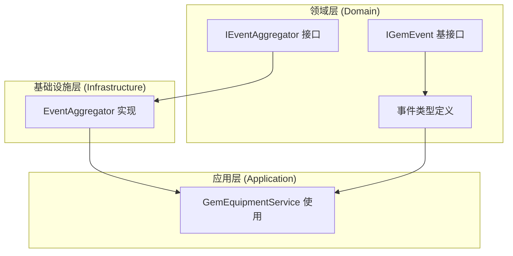
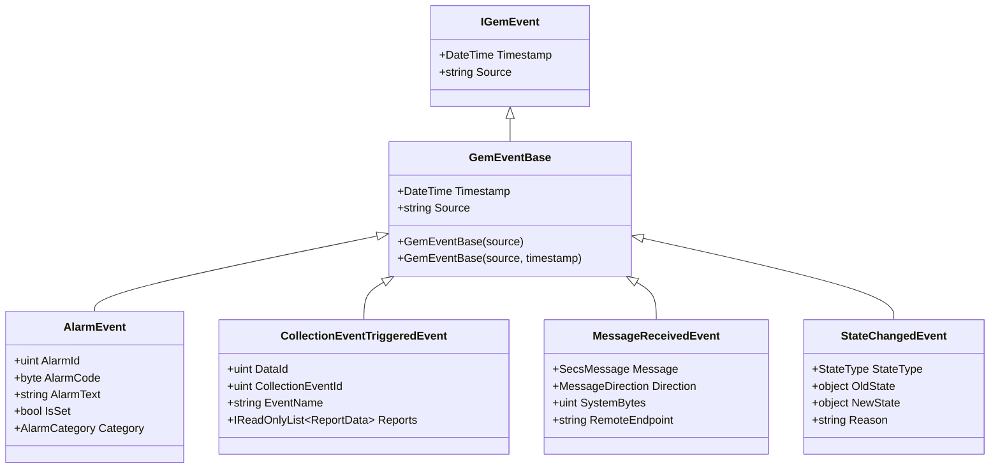
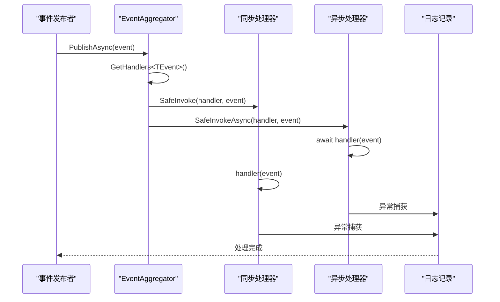
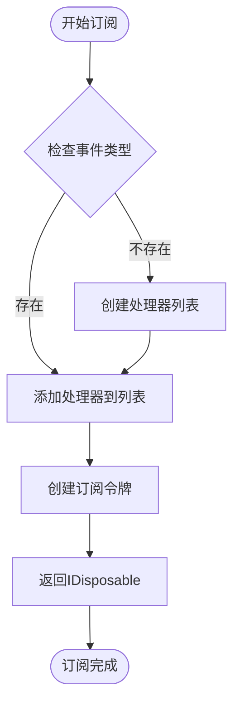
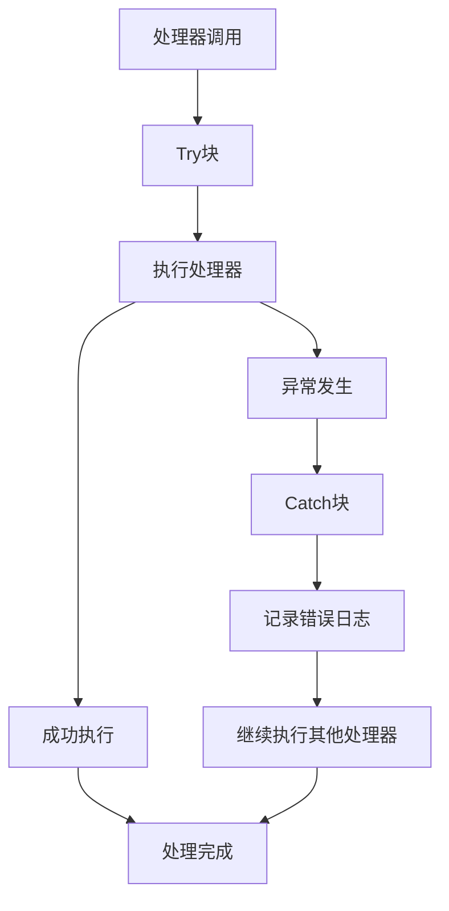
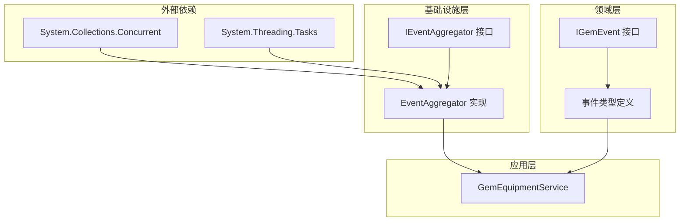

# 事件聚合器接口

<cite>
**本文档引用的文件**
- [IEventAggregator.cs](file://WebGem/SECS2GEM/Domain/Interfaces/IEventAggregator.cs)
- [EventAggregator.cs](file://WebGem/SECS2GEM/Infrastructure/Services/EventAggregator.cs)
- [IGemEvent.cs](file://WebGem/SECS2GEM/Domain/Events/IGemEvent.cs)
- [AlarmEvent.cs](file://WebGem/SECS2GEM/Domain/Events/AlarmEvent.cs)
- [CollectionEventTriggeredEvent.cs](file://WebGem/SECS2GEM/Domain/Events/CollectionEventTriggeredEvent.cs)
- [MessageReceivedEvent.cs](file://WebGem/SECS2GEM/Domain/Events/MessageReceivedEvent.cs)
- [StateChangedEvent.cs](file://WebGem/SECS2GEM/Domain/Events/StateChangedEvent.cs)
- [GemEquipmentService.cs](file://WebGem/SECS2GEM/Application/Services/GemEquipmentService.cs)
</cite>

## 目录
1. [简介](#简介)
2. [项目结构](#项目结构)
3. [核心组件](#核心组件)
4. [架构概览](#架构概览)
5. [详细组件分析](#详细组件分析)
6. [依赖关系分析](#依赖关系分析)
7. [性能考虑](#性能考虑)
8. [故障排除指南](#故障排除指南)
9. [结论](#结论)

## 简介

事件聚合器接口是SECS/GEM设备通信系统中的核心组件，实现了观察者模式，用于解耦事件发布者和订阅者。该接口提供了统一的事件发布入口，支持多个订阅者，并通过异步事件处理机制确保系统的响应性和可靠性。

在SECS/GEM协议中，事件聚合器负责处理各种设备状态变化、报警事件、消息接收等关键业务事件，为整个系统提供松耦合的事件驱动架构。

## 项目结构

事件聚合器相关的代码分布在以下目录结构中：



**图表来源**
- [IEventAggregator.cs:1-67](file://WebGem/SECS2GEM/Domain/Interfaces/IEventAggregator.cs#L1-L67)
- [EventAggregator.cs:1-219](file://WebGem/SECS2GEM/Infrastructure/Services/EventAggregator.cs#L1-L219)

**章节来源**
- [IEventAggregator.cs:1-67](file://WebGem/SECS2GEM/Domain/Interfaces/IEventAggregator.cs#L1-L67)
- [EventAggregator.cs:1-219](file://WebGem/SECS2GEM/Infrastructure/Services/EventAggregator.cs#L1-L219)

## 核心组件

### IEventAggregator 接口

IEventAggregator接口定义了事件聚合器的核心功能，采用泛型设计确保类型安全：

- **发布机制**：支持同步和异步两种发布方式
- **订阅机制**：支持异步和同步两种处理方式  
- **取消订阅**：通过IDisposable返回值实现
- **清理机制**：支持按类型和全局清理订阅

### 事件类型系统

系统定义了完整的事件类型层次结构：



**图表来源**
- [IGemEvent.cs:1-51](file://WebGem/SECS2GEM/Domain/Events/IGemEvent.cs#L1-L51)
- [AlarmEvent.cs:1-57](file://WebGem/SECS2GEM/Domain/Events/AlarmEvent.cs#L1-L57)
- [CollectionEventTriggeredEvent.cs:1-101](file://WebGem/SECS2GEM/Domain/Events/CollectionEventTriggeredEvent.cs#L1-L101)
- [MessageReceivedEvent.cs:1-67](file://WebGem/SECS2GEM/Domain/Events/MessageReceivedEvent.cs#L1-L67)
- [StateChangedEvent.cs:1-110](file://WebGem/SECS2GEM/Domain/Events/StateChangedEvent.cs#L1-L110)

**章节来源**
- [IGemEvent.cs:1-51](file://WebGem/SECS2GEM/Domain/Events/IGemEvent.cs#L1-L51)
- [AlarmEvent.cs:1-57](file://WebGem/SECS2GEM/Domain/Events/AlarmEvent.cs#L1-L57)
- [CollectionEventTriggeredEvent.cs:1-101](file://WebGem/SECS2GEM/Domain/Events/CollectionEventTriggeredEvent.cs#L1-L101)
- [MessageReceivedEvent.cs:1-67](file://WebGem/SECS2GEM/Domain/Events/MessageReceivedEvent.cs#L1-L67)
- [StateChangedEvent.cs:1-110](file://WebGem/SECS2GEM/Domain/Events/StateChangedEvent.cs#L1-L110)

## 架构概览

事件聚合器采用观察者模式实现，通过类型安全的泛型设计确保事件处理的正确性：



**图表来源**
- [EventAggregator.cs:25-45](file://WebGem/SECS2GEM/Infrastructure/Services/EventAggregator.cs#L25-L45)
- [EventAggregator.cs:170-197](file://WebGem/SECS2GEM/Infrastructure/Services/EventAggregator.cs#L170-L197)

### 订阅管理机制

事件聚合器通过内部字典管理订阅关系，支持动态添加和移除订阅：



**图表来源**
- [EventAggregator.cs:111-127](file://WebGem/SECS2GEM/Infrastructure/Services/EventAggregator.cs#L111-L127)

**章节来源**
- [EventAggregator.cs:1-219](file://WebGem/SECS2GEM/Infrastructure/Services/EventAggregator.cs#L1-L219)

## 详细组件分析

### EventAggregator 实现

EventAggregator类提供了完整的事件聚合器实现，具有以下特性：

#### 并发安全设计

- 使用`ConcurrentDictionary`存储订阅关系，确保多线程环境下的安全性
- 通过锁机制保护共享资源，避免竞态条件
- 支持高并发的事件发布和订阅操作

#### 异常隔离机制

实现中包含了完善的异常处理策略：



**图表来源**
- [EventAggregator.cs:170-197](file://WebGem/SECS2GEM/Infrastructure/Services/EventAggregator.cs#L170-L197)

#### 订阅生命周期管理

订阅通过IDisposable模式管理，确保资源正确释放：

**章节来源**
- [EventAggregator.cs:17-219](file://WebGem/SECS2GEM/Infrastructure/Services/EventAggregator.cs#L17-L219)

### 事件类型详解

#### 报警事件 (AlarmEvent)

报警事件用于处理设备报警状态的变化：

- **AlarmId**: 报警唯一标识符
- **AlarmCode**: 报警编码，包含设置/清除标志和报警类别
- **AlarmText**: 报警描述文本
- **IsSet**: 判断是否为报警触发状态
- **Category**: 解析后的报警类别

#### 采集事件 (CollectionEventTriggeredEvent)

采集事件用于触发S6F11事件报告：

- **DataId**: 数据标识符
- **CollectionEventId**: 采集事件标识符
- **EventName**: 事件名称
- **Reports**: 报告数据集合

#### 消息接收事件 (MessageReceivedEvent)

消息接收事件用于记录消息传输信息：

- **Message**: 接收的消息对象
- **Direction**: 消息方向（接收/发送）
- **SystemBytes**: 事务标识符
- **RemoteEndpoint**: 远程端点信息

#### 状态变化事件 (StateChangedEvent)

状态变化事件用于跟踪设备状态转换：

- **StateType**: 状态类型（通信/控制/处理/连接）
- **OldState**: 旧状态值
- **NewState**: 新状态值
- **Reason**: 状态变化原因

**章节来源**
- [AlarmEvent.cs:1-57](file://WebGem/SECS2GEM/Domain/Events/AlarmEvent.cs#L1-L57)
- [CollectionEventTriggeredEvent.cs:1-101](file://WebGem/SECS2GEM/Domain/Events/CollectionEventTriggeredEvent.cs#L1-L101)
- [MessageReceivedEvent.cs:1-67](file://WebGem/SECS2GEM/Domain/Events/MessageReceivedEvent.cs#L1-L67)
- [StateChangedEvent.cs:1-110](file://WebGem/SECS2GEM/Domain/Events/StateChangedEvent.cs#L1-L110)

### 实际应用场景

在GemEquipmentService中，事件聚合器被广泛应用于各种业务场景：

#### 事件报告发布

当设备需要发送事件报告时，通过事件聚合器通知所有订阅者：

```csharp
// 发布事件报告事件
await _eventAggregator.PublishAsync(new CollectionEventTriggeredEvent(
    "GemEquipmentService", dataId, ceid, evt.Name, new List<ReportData>()));
```

#### 报警事件发布

设备报警状态变化时，通过事件聚合器广播报警信息：

```csharp
// 发布报警事件
await _eventAggregator.PublishAsync(new AlarmEvent(
    "GemEquipmentService", alarm.AlarmId, alarm.AlarmCode, alarm.AlarmText));
```

**章节来源**
- [GemEquipmentService.cs:243-244](file://WebGem/SECS2GEM/Application/Services/GemEquipmentService.cs#L243-L244)
- [GemEquipmentService.cs:292-293](file://WebGem/SECS2GEM/Application/Services/GemEquipmentService.cs#L292-L293)

## 依赖关系分析

事件聚合器的依赖关系体现了清晰的分层架构：



**图表来源**
- [EventAggregator.cs:1-3](file://WebGem/SECS2GEM/Infrastructure/Services/EventAggregator.cs#L1-L3)
- [IEventAggregator.cs:1](file://WebGem/SECS2GEM/Domain/Interfaces/IEventAggregator.cs#L1)

### 组件耦合度分析

- **低耦合设计**：接口与实现分离，便于测试和替换
- **单向依赖**：应用层依赖基础设施层，但反向依赖不存在
- **可扩展性**：新的事件类型只需实现IGemEvent接口

**章节来源**
- [IEventAggregator.cs:1-67](file://WebGem/SECS2GEM/Domain/Interfaces/IEventAggregator.cs#L1-L67)
- [EventAggregator.cs:1-219](file://WebGem/SECS2GEM/Infrastructure/Services/EventAggregator.cs#L1-L219)

## 性能考虑

### 并发性能优化

事件聚合器在设计时充分考虑了并发性能：

- **ConcurrentDictionary使用**：避免锁竞争，提高并发访问效率
- **处理器复制**：发布前复制处理器列表，避免并发修改问题
- **异步处理**：支持异步处理器，充分利用异步I/O优势

### 内存管理策略

- **弱引用模式**：处理器以对象形式存储，便于垃圾回收
- **及时清理**：取消订阅时立即从内存中移除
- **批量处理**：异步发布时使用Task.WhenAll并行执行

### 线程安全保证

- **双重检查锁定**：确保订阅和取消订阅的原子性
- **锁粒度优化**：最小化锁的持有时间
- **无阻塞读取**：读取操作不使用锁，提高读取性能

## 故障排除指南

### 常见问题诊断

#### 事件未被接收

可能原因：
1. 订阅未正确建立
2. 事件类型不匹配
3. 订阅已被取消

解决方案：
- 检查订阅返回的IDisposable对象是否被正确保存
- 验证事件类型参数是否正确
- 确认订阅未被提前Dispose

#### 异常传播问题

现象：某个处理器异常导致其他处理器无法执行

解决方法：
- 检查异常隔离机制是否正常工作
- 查看日志记录是否完整
- 确保每个处理器都有独立的异常处理

#### 性能问题

症状：事件发布延迟或处理器响应缓慢

排查步骤：
- 监控处理器执行时间
- 检查异步处理器的实现
- 分析并发访问模式

**章节来源**
- [EventAggregator.cs:170-197](file://WebGem/SECS2GEM/Infrastructure/Services/EventAggregator.cs#L170-L197)

## 结论

事件聚合器接口为SECS/GEM设备通信系统提供了强大而灵活的事件驱动架构。通过类型安全的设计、完善的异常处理机制和高性能的并发实现，它成功地解耦了系统的各个组件，提高了代码的可维护性和可扩展性。

该接口的设计充分体现了现代软件架构的最佳实践，包括：
- 清晰的职责分离
- 类型安全的泛型设计
- 完善的生命周期管理
- 高性能的并发处理
- 健壮的错误处理机制

对于开发者而言，理解事件聚合器的工作原理和最佳实践，将有助于构建更加稳定和高效的SECS/GEM系统。