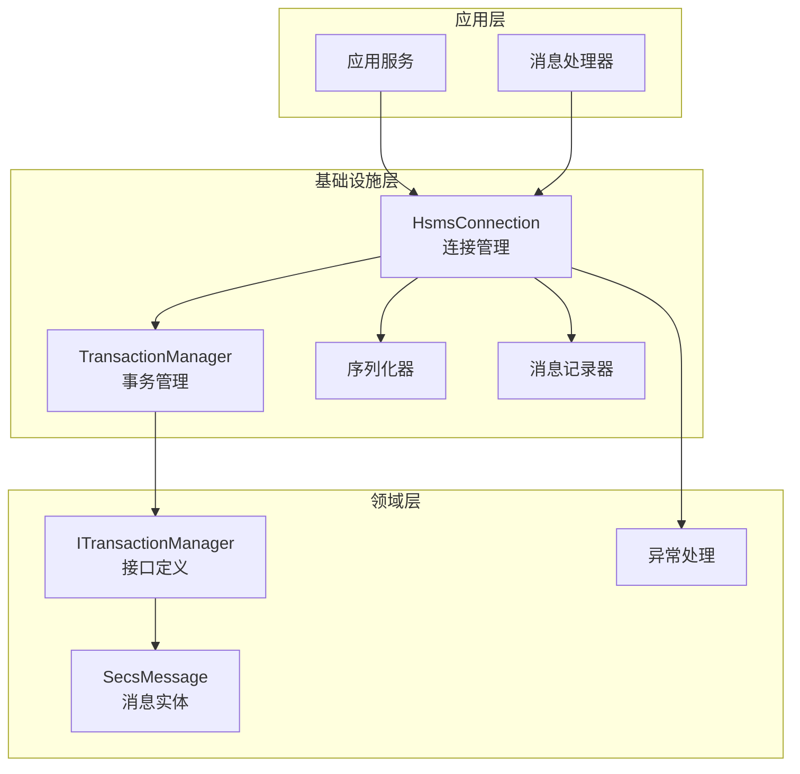
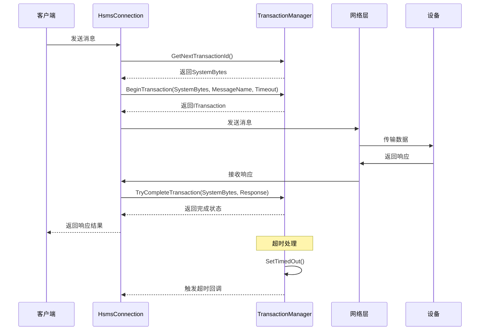
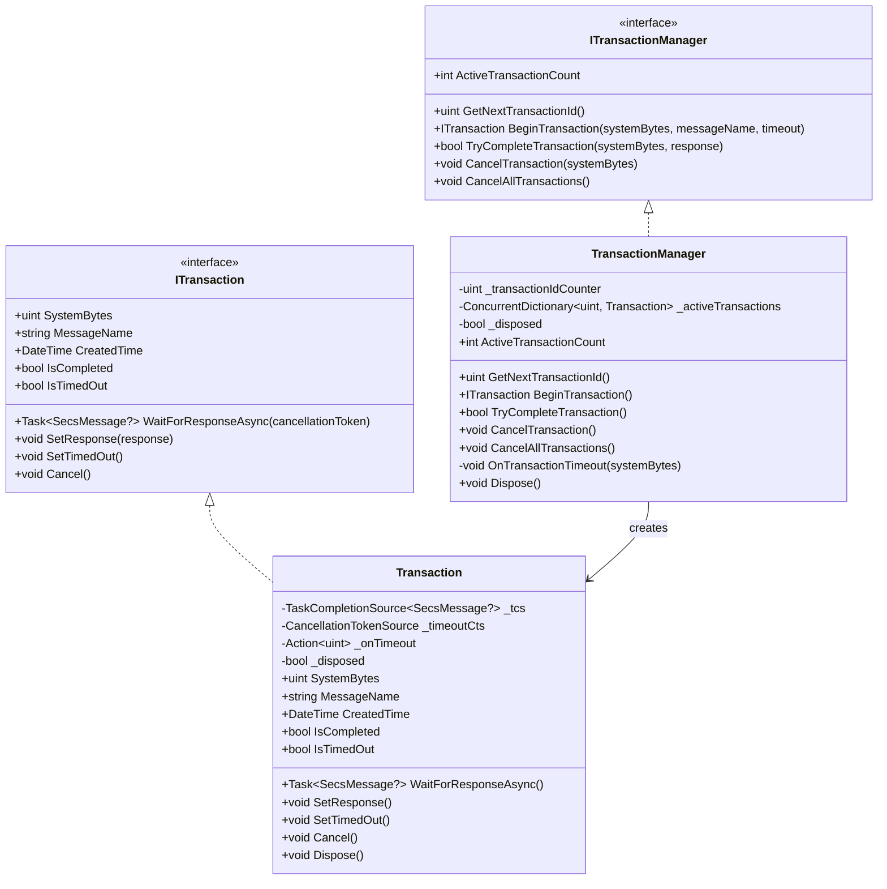
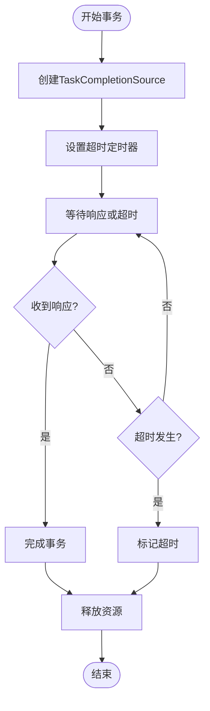
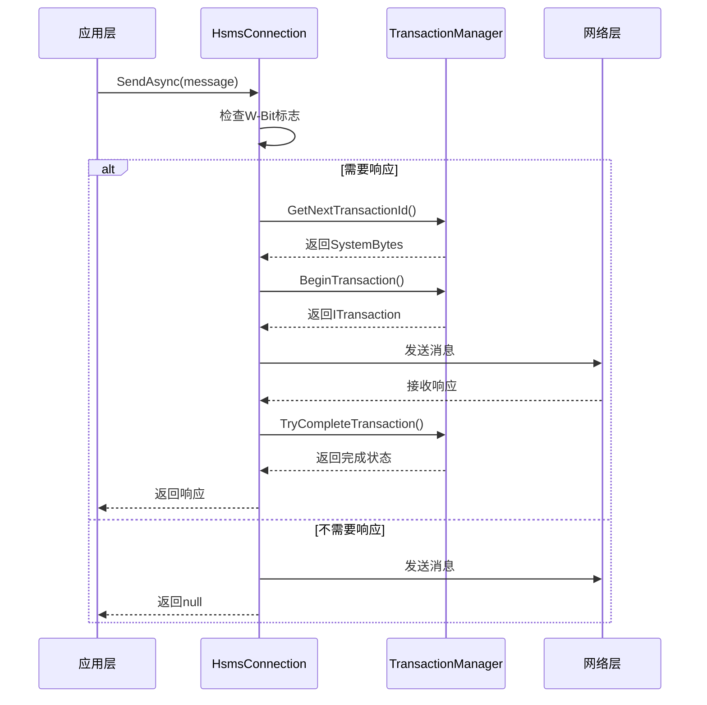
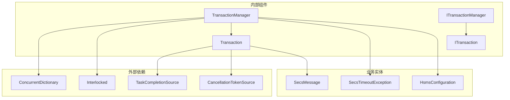

# 事务管理接口

<cite>
**本文档引用的文件**
- [ITransactionManager.cs](file://WebGem/SECS2GEM/Domain/Interfaces/ITransactionManager.cs)
- [TransactionManager.cs](file://WebGem/SECS2GEM/Infrastructure/Services/TransactionManager.cs)
- [HsmsConnection.cs](file://WebGem/SECS2GEM/Infrastructure/Connection/HsmsConnection.cs)
- [HsmsConfiguration.cs](file://WebGem/SECS2GEM/Infrastructure/Configuration/HsmsConfiguration.cs)
- [SecsTimeoutException.cs](file://WebGem/SECS2GEM/Core/Exceptions/SecsTimeoutException.cs)
- [SecsMessage.cs](file://WebGem/SECS2GEM/Core/Entities/SecsMessage.cs)
</cite>

## 目录
1. [简介](#简介)
2. [项目结构](#项目结构)
3. [核心组件](#核心组件)
4. [架构概览](#架构概览)
5. [详细组件分析](#详细组件分析)
6. [依赖关系分析](#依赖关系分析)
7. [性能考虑](#性能考虑)
8. [故障排除指南](#故障排除指南)
9. [结论](#结论)

## 简介

ITransactionManager接口是SECS/GEM通信系统中的关键组件，负责管理请求-响应事务的生命周期。该接口实现了基于System Bytes的消息匹配机制，确保每个请求都能正确地与对应的响应进行关联。

在SECS-II协议中，每个数据消息都包含一个System Bytes字段作为事务标识符。ITransactionManager通过这个标识符来跟踪和匹配事务，支持超时处理、异常管理和资源清理等功能。

## 项目结构

SECS2GEM项目采用分层架构设计，事务管理器位于基础设施层，为上层的连接管理和应用服务提供基础支撑。

**图表来源**
- [ITransactionManager.cs:1-120](file://WebGem/SECS2GEM/Domain/Interfaces/ITransactionManager.cs#L1-L120)
- [TransactionManager.cs:1-201](file://WebGem/SECS2GEM/Infrastructure/Services/TransactionManager.cs#L1-L201)
- [HsmsConnection.cs:1-200](file://WebGem/SECS2GEM/Infrastructure/Connection/HsmsConnection.cs#L1-L200)

**章节来源**
- [ITransactionManager.cs:1-120](file://WebGem/SECS2GEM/Domain/Interfaces/ITransactionManager.cs#L1-L120)
- [TransactionManager.cs:1-201](file://WebGem/SECS2GEM/Infrastructure/Services/TransactionManager.cs#L1-L201)

## 核心组件

### ITransaction接口

ITransaction接口定义了单个事务的生命周期管理：

- **SystemBytes**: 唯一的事务标识符（System Bytes）
- **MessageName**: 关联的消息名称，用于日志和调试
- **CreatedTime**: 事务创建时间
- **IsCompleted**: 事务完成状态
- **IsTimedOut**: 事务超时状态

主要方法：
- `WaitForResponseAsync()`: 异步等待响应消息
- `SetResponse()`: 设置响应消息
- `SetTimedOut()`: 标记事务为超时
- `Cancel()`: 取消事务

### ITransactionManager接口

ITransactionManager接口提供了事务管理的核心功能：

- **ActiveTransactionCount**: 当前活跃事务数量
- `GetNextTransactionId()`: 获取下一个唯一事务ID
- `BeginTransaction()`: 开始新事务
- `TryCompleteTransaction()`: 尝试完成事务
- `CancelTransaction()`: 取消指定事务
- `CancelAllTransactions()`: 取消所有事务

**章节来源**
- [ITransactionManager.cs:12-120](file://WebGem/SECS2GEM/Domain/Interfaces/ITransactionManager.cs#L12-L120)

## 架构概览

ITransactionManager在整个系统中的作用是作为事务协调器，确保消息的可靠传递和响应的正确匹配。

**图表来源**
- [HsmsConnection.cs:427-453](file://WebGem/SECS2GEM/Infrastructure/Connection/HsmsConnection.cs#L427-L453)
- [TransactionManager.cs:46-72](file://WebGem/SECS2GEM/Infrastructure/Services/TransactionManager.cs#L46-L72)

**章节来源**
- [HsmsConnection.cs:427-541](file://WebGem/SECS2GEM/Infrastructure/Connection/HsmsConnection.cs#L427-L541)
- [TransactionManager.cs:24-119](file://WebGem/SECS2GEM/Infrastructure/Services/TransactionManager.cs#L24-L119)

## 详细组件分析

### TransactionManager实现

TransactionManager是ITransactionManager接口的具体实现，采用了高性能的并发设计：

**图表来源**
- [ITransactionManager.cs:78-118](file://WebGem/SECS2GEM/Domain/Interfaces/ITransactionManager.cs#L78-L118)
- [TransactionManager.cs:24-199](file://WebGem/SECS2GEM/Infrastructure/Services/TransactionManager.cs#L24-L199)

#### 事务超时机制

Transaction类实现了精确的超时控制机制：

**图表来源**
- [TransactionManager.cs:137-199](file://WebGem/SECS2GEM/Infrastructure/Services/TransactionManager.cs#L137-L199)

**章节来源**
- [TransactionManager.cs:24-201](file://WebGem/SECS2GEM/Infrastructure/Services/TransactionManager.cs#L24-L201)

### HsmsConnection中的事务集成

HsmsConnection类展示了ITransactionManager在实际场景中的使用方式：

**图表来源**
- [HsmsConnection.cs:427-453](file://WebGem/SECS2GEM/Infrastructure/Connection/HsmsConnection.cs#L427-L453)

**章节来源**
- [HsmsConnection.cs:427-541](file://WebGem/SECS2GEM/Infrastructure/Connection/HsmsConnection.cs#L427-L541)

## 依赖关系分析

ITransactionManager与其他组件的依赖关系如下：

**图表来源**
- [TransactionManager.cs:1-201](file://WebGem/SECS2GEM/Infrastructure/Services/TransactionManager.cs#L1-L201)
- [ITransactionManager.cs:1-120](file://WebGem/SECS2GEM/Domain/Interfaces/ITransactionManager.cs#L1-L120)

**章节来源**
- [TransactionManager.cs:1-201](file://WebGem/SECS2GEM/Infrastructure/Services/TransactionManager.cs#L1-L201)
- [HsmsConfiguration.cs:1-266](file://WebGem/SECS2GEM/Infrastructure/Configuration/HsmsConfiguration.cs#L1-L266)

## 性能考虑

### 并发性能优化

1. **原子性操作**: 使用`Interlocked.Increment`确保事务ID生成的线程安全
2. **无锁数据结构**: 使用`ConcurrentDictionary`避免锁竞争
3. **异步编程模型**: 基于`TaskCompletionSource`实现非阻塞等待
4. **内存管理**: 及时释放CancellationTokenSource资源

### 内存和资源管理

- **及时释放**: 在事务完成或超时时立即释放相关资源
- **弱引用模式**: 避免循环引用导致的内存泄漏
- **批量操作**: 支持批量取消所有事务以提高效率

### 性能监控指标

- **活跃事务数量**: 通过`ActiveTransactionCount`属性监控系统负载
- **超时率统计**: 分析不同消息类型的超时情况
- **响应时间分布**: 监控事务处理的性能表现

## 故障排除指南

### 常见问题及解决方案

#### 事务超时问题

**症状**: `SecsTimeoutException`异常被抛出

**原因分析**:
1. 网络延迟过高
2. 设备处理时间过长
3. 超时配置不合理

**解决方法**:
1. 调整`HsmsConfiguration`中的超时参数
2. 检查网络连接质量
3. 优化设备端处理逻辑

#### 事务重复问题

**症状**: 抛出`InvalidOperationException`异常

**原因**: 同一个System Bytes的事务已经存在

**解决方法**:
1. 检查事务ID生成逻辑
2. 确保事务生命周期管理正确
3. 避免重复使用相同的System Bytes

#### 资源泄漏问题

**症状**: 内存使用量持续增长

**原因**: 事务对象未正确释放

**解决方法**:
1. 确保所有事务都在使用完毕后调用`Dispose()`
2. 检查`using`语句的正确使用
3. 定期检查`ActiveTransactionCount`指标

**章节来源**
- [SecsTimeoutException.cs:1-162](file://WebGem/SECS2GEM/Core/Exceptions/SecsTimeoutException.cs#L1-L162)
- [TransactionManager.cs:112-119](file://WebGem/SECS2GEM/Infrastructure/Services/TransactionManager.cs#L112-L119)

## 结论

ITransactionManager接口为SECS/GEM通信系统提供了可靠的事务管理能力。通过精心设计的接口和高效的实现，系统能够：

1. **确保消息可靠性**: 通过System Bytes精确匹配请求和响应
2. **提供灵活的超时控制**: 支持多种超时类型和自定义配置
3. **优化性能表现**: 采用并发数据结构和异步编程模型
4. **简化资源管理**: 自动化的生命周期管理和异常处理

该接口的设计充分考虑了工业自动化环境的特殊需求，在保证可靠性的同时实现了良好的性能表现。对于分布式事务和本地事务的支持，开发者可以根据具体需求选择合适的实现策略。