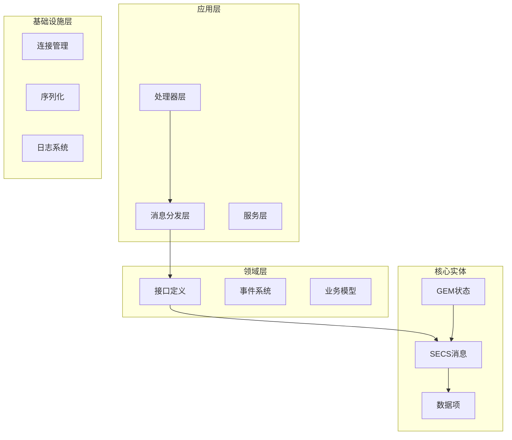
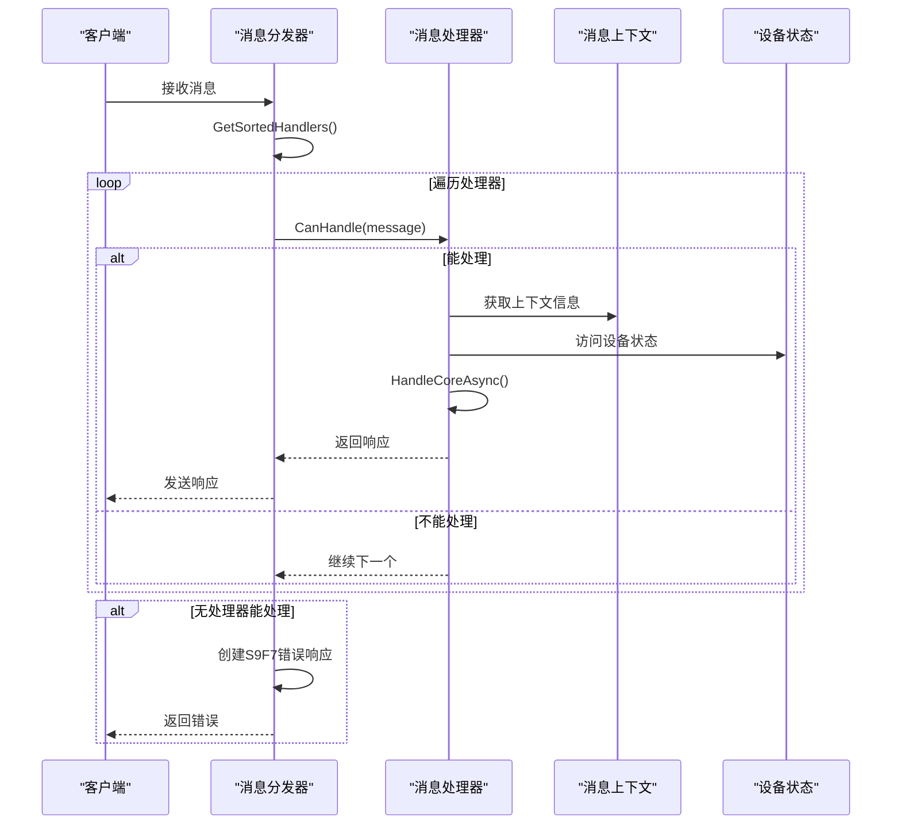
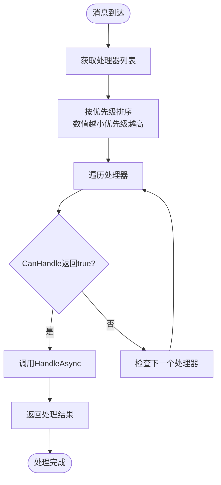
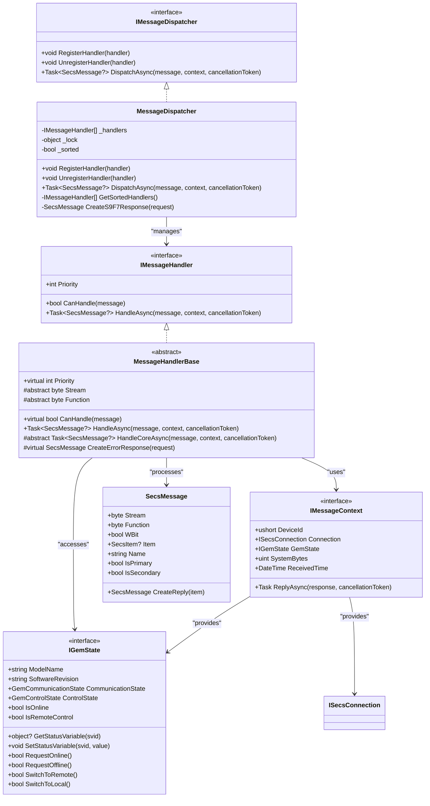

# 消息处理器接口

<cite>
**本文档引用的文件**
- [IMessageHandler.cs](file://WebGem/SECS2GEM/Domain/Interfaces/IMessageHandler.cs)
- [MessageDispatcher.cs](file://WebGem/SECS2GEM/Application/Messaging/MessageDispatcher.cs)
- [MessageHandlerBase.cs](file://WebGem/SECS2GEM/Application/Handlers/StreamOneHandlers.cs)
- [S1F1Handler.cs](file://WebGem/SECS2GEM/Application/Handlers/StreamOneHandlers.cs)
- [S1F13Handler.cs](file://WebGem/SECS2GEM/Application/Handlers/StreamOneHandlers.cs)
- [S2F13Handler.cs](file://WebGem/SECS2GEM/Application/Handlers/StreamTwoHandlers.cs)
- [S2F15Handler.cs](file://WebGem/SECS2GEM/Application/Handlers/StreamTwoHandlers.cs)
- [S5F3Handler.cs](file://WebGem/SECS2GEM/Application/Handlers/OtherStreamHandlers.cs)
- [S7F1Handler.cs](file://WebGem/SECS2GEM/Application/Handlers/OtherStreamHandlers.cs)
- [S10F3Handler.cs](file://WebGem/SECS2GEM/Application/Handlers/OtherStreamHandlers.cs)
- [SecsMessage.cs](file://WebGem/SECS2GEM/Core/Entities/SecsMessage.cs)
- [SecsItem.cs](file://WebGem/SECS2GEM/Core/Entities/SecsItem.cs)
- [IGemState.cs](file://WebGem/SECS2GEM/Domain/Interfaces/IGemState.cs)
- [ISecsConnection.cs](file://WebGem/SECS2GEM/Domain/Interfaces/ISecsConnection.cs)
- [MessageHandlerTests.cs](file://WebGem/SECS2GEM.Tests/MessageHandlerTests.cs)
</cite>

## 目录
1. [简介](#简介)
2. [项目结构](#项目结构)
3. [核心组件](#核心组件)
4. [架构概览](#架构概览)
5. [详细组件分析](#详细组件分析)
6. [依赖关系分析](#依赖关系分析)
7. [性能考虑](#性能考虑)
8. [故障排除指南](#故障排除指南)
9. [结论](#结论)

## 简介

IMessageHandler接口是SECS2GEM项目中消息处理系统的核心基础接口，采用策略模式和责任链模式相结合的设计理念。该接口定义了消息处理器的标准规范，支持灵活的消息分发和处理机制。

SECS2GEM项目实现了完整的SEMI E37标准（SECS-II协议），用于半导体制造设备与主机之间的通信。消息处理器接口为不同Stream/Function组合提供了标准化的处理方式，支持动态扩展和优先级管理。

## 项目结构

SECS2GEM项目的整体架构采用分层设计，消息处理系统位于应用层的核心位置：



**图表来源**
- [IMessageHandler.cs:1-131](file://WebGem/SECS2GEM/Domain/Interfaces/IMessageHandler.cs#L1-L131)
- [MessageDispatcher.cs:1-123](file://WebGem/SECS2GEM/Application/Messaging/MessageDispatcher.cs#L1-L123)

**章节来源**
- [IMessageHandler.cs:1-131](file://WebGem/SECS2GEM/Domain/Interfaces/IMessageHandler.cs#L1-L131)
- [MessageDispatcher.cs:1-123](file://WebGem/SECS2GEM/Application/Messaging/MessageDispatcher.cs#L1-L123)

## 核心组件

### IMessageHandler接口定义

IMessageHandler接口是消息处理系统的基础抽象，定义了以下关键要素：

#### 接口特性
- **策略模式支持**：每个Stream/Function组合可以有独立的处理器
- **开闭原则**：添加新消息处理只需实现此接口，无需修改现有代码
- **优先级机制**：支持处理器优先级排序，数值越小优先级越高

#### 核心方法

**HandleAsync方法**
- **参数**：
  - `message`: 待处理的SecsMessage对象
  - `context`: IMessageContext消息上下文
  - `cancellationToken`: 取消令牌
- **返回值**：Task<SecsMessage?>，返回响应消息或null
- **异常处理**：内部自动捕获异常并返回适当的错误响应

**CanHandle方法**
- **参数**：SecsMessage message
- **返回值**：bool，指示处理器是否能处理该消息
- **实现逻辑**：基于Stream和Function属性进行匹配

**Priority属性**
- **类型**：int，默认值为0
- **含义**：数值越小优先级越高
- **用途**：消息分发时的排序依据

#### IMessageContext上下文接口

消息上下文提供了处理器执行所需的所有环境信息：

**核心属性**
- `DeviceId`: ushort设备ID
- `Connection`: ISecsConnection当前连接
- `GemState`: IGemState设备状态
- `SystemBytes`: uint事务ID（System Bytes）
- `ReceivedTime`: DateTime消息接收时间

**核心方法**
- `ReplyAsync`: 发送响应消息的方法

**章节来源**
- [IMessageHandler.cs:63-88](file://WebGem/SECS2GEM/Domain/Interfaces/IMessageHandler.cs#L63-L88)
- [IMessageHandler.cs:15-48](file://WebGem/SECS2GEM/Domain/Interfaces/IMessageHandler.cs#L15-L48)

## 架构概览

消息处理系统的整体架构采用责任链模式与策略模式的组合：



**图表来源**
- [MessageDispatcher.cs:67-91](file://WebGem/SECS2GEM/Application/Messaging/MessageDispatcher.cs#L67-L91)
- [MessageHandlerBase.cs:48-66](file://WebGem/SECS2GEM/Application/Handlers/StreamOneHandlers.cs#L48-L66)

### 设计原则

1. **单一职责原则**：每个处理器只负责一个特定的Stream/Function组合
2. **开闭原则**：对扩展开放，对修改关闭
3. **依赖倒置原则**：依赖抽象而非具体实现
4. **模板方法模式**：MessageHandlerBase提供处理流程骨架

**章节来源**
- [IMessageHandler.cs:50-62](file://WebGem/SECS2GEM/Domain/Interfaces/IMessageHandler.cs#L50-L62)
- [MessageHandlerBase.cs:10-19](file://WebGem/SECS2GEM/Application/Handlers/StreamOneHandlers.cs#L10-L19)

## 详细组件分析

### MessageDispatcher分发器

MessageDispatcher实现了IMessageDispatcher接口，是消息处理系统的核心协调器：

#### 核心功能

**处理器注册管理**
- `RegisterHandler`: 注册新的消息处理器
- `UnregisterHandler`: 注销消息处理器
- 内部维护处理器列表，支持动态添加和移除

**消息分发流程**
1. 获取排序后的处理器列表
2. 遍历处理器调用CanHandle方法
3. 找到能处理的处理器后调用HandleAsync
4. 返回处理结果

**优先级排序机制**
- 处理器按Priority属性升序排列
- 数值越小优先级越高
- 支持覆盖默认行为

#### 错误处理策略

**无处理器匹配**
- 如果消息期望回复（WBit=true），返回S9F7错误响应
- 如果消息不期望回复，返回null

**异常处理**
- 处理器内部异常会被捕获
- 自动创建适当的错误响应消息

**章节来源**
- [MessageDispatcher.cs:27-121](file://WebGem/SECS2GEM/Application/Messaging/MessageDispatcher.cs#L27-L121)

### MessageHandlerBase基类

MessageHandlerBase实现了IMessageHandler接口，为具体的处理器提供模板方法：

#### 模板方法模式

**HandleAsync方法**
- 提供统一的异常处理框架
- 调用子类实现的HandleCoreAsync方法
- 自动处理异常并返回错误响应

**CanHandle方法**
- 基于Stream和Function属性进行消息匹配
- 子类只需指定目标Stream和Function

#### 核心抽象方法

**HandleCoreAsync**
- 子类必须实现的具体处理逻辑
- 处理完成后返回响应消息或null

**CreateErrorResponse**
- 可重写的错误响应创建方法
- 默认创建S9F7（非法数据）响应

**章节来源**
- [MessageHandlerBase.cs:20-86](file://WebGem/SECS2GEM/Application/Handlers/StreamOneHandlers.cs#L20-L86)

### 具体处理器实现

#### S1F1处理器（Are You There）

S1F1处理器处理设备连接检测请求：

**处理逻辑**
- 返回设备型号和软件版本信息
- 创建S1F2响应消息
- 使用IGemState获取设备信息

**响应格式**
```
S1F2: <L [2] <A "设备型号"> <A "软件版本"> >
```

#### S1F13处理器（Establish Communications）

S1F13处理器处理建立通信请求：

**状态转换**
- 设置通信状态为Communicating
- 更新设备状态信息
- 返回COMMACK确认码

**响应格式**
```
S1F14: <L [2] <B COMMACK> <L [2] <A "MDLN"> <A "SOFTREV"> > >
```

#### S2F13处理器（Equipment Constant Request）

S2F13处理器处理设备常量查询：

**功能特性**
- 支持查询单个或多个设备常量
- 自动类型转换和格式化
- 返回ECV（Equipment Constant Value）格式

**数据处理**
- 解析请求中的ECID列表
- 查询IGemState获取常量值
- 动态创建响应数据项

**章节来源**
- [S1F1Handler.cs:94-113](file://WebGem/SECS2GEM/Application/Handlers/StreamOneHandlers.cs#L94-L113)
- [S1F13Handler.cs:122-148](file://WebGem/SECS2GEM/Application/Handlers/StreamOneHandlers.cs#L122-L148)
- [S2F13Handler.cs:13-57](file://WebGem/SECS2GEM/Application/Handlers/StreamTwoHandlers.cs#L13-L57)

### 处理器优先级设计

处理器优先级机制允许自定义处理器覆盖默认行为：



**图表来源**
- [MessageDispatcher.cs:96-108](file://WebGem/SECS2GEM/Application/Messaging/MessageDispatcher.cs#L96-L108)
- [MessageHandlerBase.cs:25](file://WebGem/SECS2GEM/Application/Handlers/StreamOneHandlers.cs#L25)

**章节来源**
- [MessageDispatcher.cs:96-108](file://WebGem/SECS2GEM/Application/Messaging/MessageDispatcher.cs#L96-L108)
- [MessageHandlerBase.cs:25](file://WebGem/SECS2GEM/Application/Handlers/StreamOneHandlers.cs#L25)

## 依赖关系分析

消息处理器系统的关键依赖关系如下：



**图表来源**
- [IMessageHandler.cs:63-129](file://WebGem/SECS2GEM/Domain/Interfaces/IMessageHandler.cs#L63-L129)
- [MessageDispatcher.cs:27-121](file://WebGem/SECS2GEM/Application/Messaging/MessageDispatcher.cs#L27-L121)
- [MessageHandlerBase.cs:20-86](file://WebGem/SECS2GEM/Application/Handlers/StreamOneHandlers.cs#L20-L86)

### 依赖注入关系

消息处理器系统采用松耦合设计，通过接口实现依赖注入：

1. **处理器依赖**：IMessageContext → IGemState, ISecsConnection
2. **分发器依赖**：IMessageHandler列表管理
3. **消息依赖**：SecsMessage, SecsItem数据结构

**章节来源**
- [IMessageHandler.cs:15-48](file://WebGem/SECS2GEM/Domain/Interfaces/IMessageHandler.cs#L15-L48)
- [MessageDispatcher.cs:29-58](file://WebGem/SECS2GEM/Application/Messaging/MessageDispatcher.cs#L29-L58)

## 性能考虑

### 并发安全性

消息分发器使用线程锁保护处理器列表的并发访问：

- `_lock`对象确保处理器注册/注销的原子性
- `_sorted`标志避免不必要的重新排序
- GetSortedHandlers方法返回副本，防止外部修改

### 内存优化

1. **处理器缓存**：处理器列表按需排序并缓存
2. **消息对象复用**：使用不可变的SecsMessage设计
3. **异步处理**：充分利用async/await避免阻塞

### 性能监控建议

1. **处理器执行时间统计**
2. **消息处理吞吐量监控**
3. **异常处理耗时分析**
4. **内存使用情况跟踪**

## 故障排除指南

### 常见问题诊断

**问题1：消息无法被任何处理器处理**
- 检查MessageDispatcher的处理器注册
- 验证消息的Stream/Function是否正确
- 确认WBit标志是否符合预期

**问题2：处理器优先级冲突**
- 检查Priority属性设置
- 验证处理器注册顺序
- 确认是否有更高优先级的处理器

**问题3：异常处理不当**
- 检查MessageHandlerBase的异常捕获
- 验证CreateErrorResponse方法
- 确认S9F7响应格式

### 调试技巧

1. **启用详细日志记录**
2. **使用MockMessageContext进行单元测试**
3. **验证IGemState的状态一致性**
4. **检查ISecsConnection的连接状态**

**章节来源**
- [MessageHandlerTests.cs:163-220](file://WebGem/SECS2GEM.Tests/MessageHandlerTests.cs#L163-L220)

## 结论

IMessageHandler接口为SECS2GEM项目提供了强大而灵活的消息处理框架。通过策略模式和责任链模式的结合，系统实现了：

1. **高度模块化**：每个处理器专注于特定的功能
2. **易于扩展**：新增消息类型只需实现接口
3. **灵活配置**：支持处理器优先级和动态注册
4. **健壮性**：完善的异常处理和错误恢复机制

该设计充分体现了面向对象设计原则，为复杂的SECS-II消息处理提供了清晰、可维护的解决方案。开发者可以根据具体需求实现自定义处理器，同时保持系统的稳定性和可扩展性。