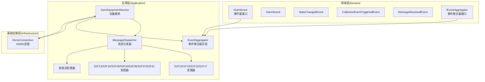
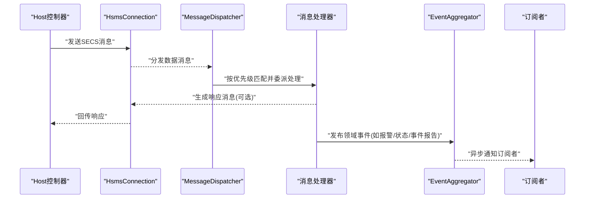
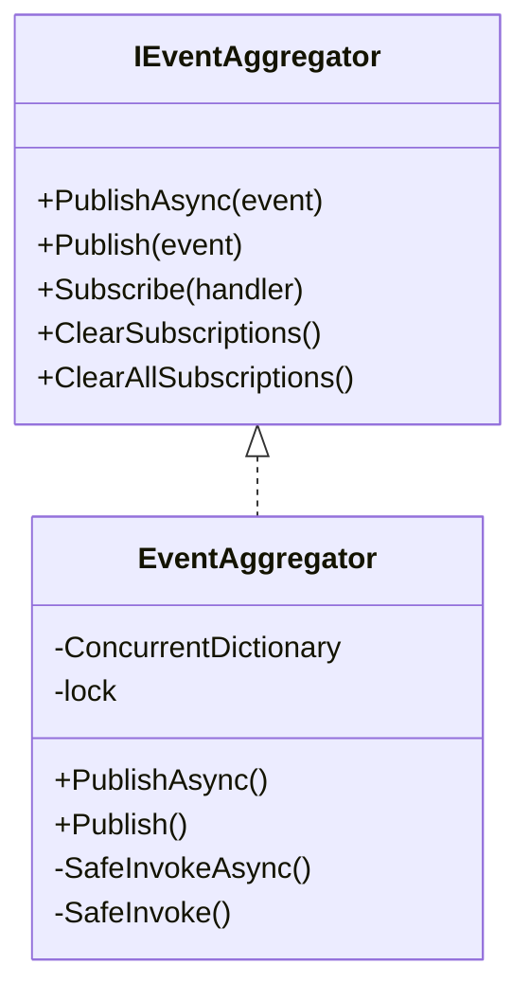
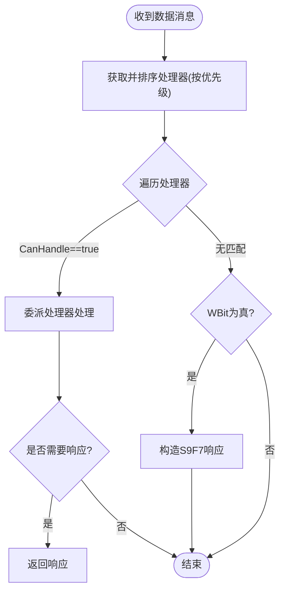
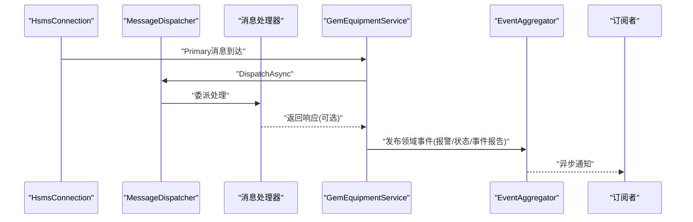
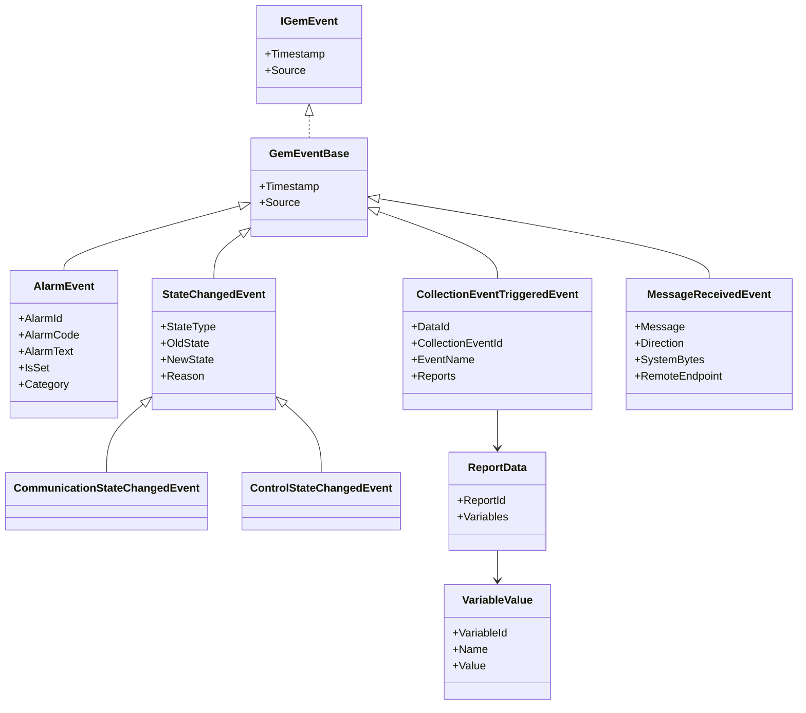
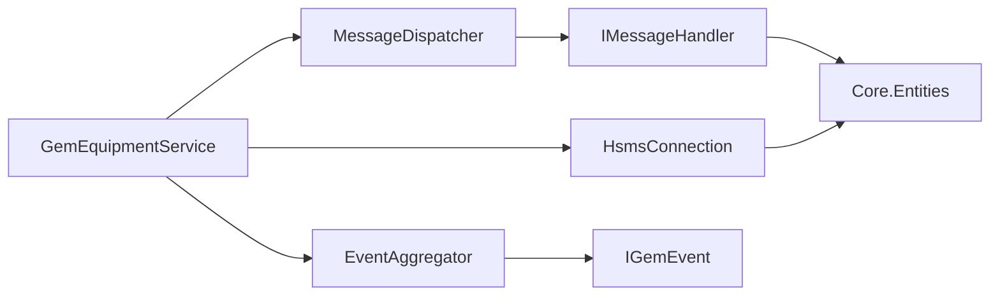

# 事件处理模式

<cite>
**本文引用的文件**
- [IGemEvent.cs](file://WebGem/SECS2GEM/Domain/Events/IGemEvent.cs)
- [AlarmEvent.cs](file://WebGem/SECS2GEM/Domain/Events/AlarmEvent.cs)
- [StateChangedEvent.cs](file://WebGem/SECS2GEM/Domain/Events/StateChangedEvent.cs)
- [CollectionEventTriggeredEvent.cs](file://WebGem/SECS2GEM/Domain/Events/CollectionEventTriggeredEvent.cs)
- [MessageReceivedEvent.cs](file://WebGem/SECS2GEM/Domain/Events/MessageReceivedEvent.cs)
- [IEventAggregator.cs](file://WebGem/SECS2GEM/Domain/Interfaces/IEventAggregator.cs)
- [EventAggregator.cs](file://WebGem/SECS2GEM/Infrastructure/Services/EventAggregator.cs)
- [IMessageHandler.cs](file://WebGem/SECS2GEM/Domain/Interfaces/IMessageHandler.cs)
- [MessageDispatcher.cs](file://WebGem/SECS2GEM/Application/Messaging/MessageDispatcher.cs)
- [StreamOneHandlers.cs](file://WebGem/SECS2GEM/Application/Handlers/StreamOneHandlers.cs)
- [StreamTwoHandlers.cs](file://WebGem/SECS2GEM/Application/Handlers/StreamTwoHandlers.cs)
- [OtherStreamHandlers.cs](file://WebGem/SECS2GEM/Application/Handlers/OtherStreamHandlers.cs)
- [GemEquipmentService.cs](file://WebGem/SECS2GEM/Application/Services/GemEquipmentService.cs)
- [HsmsConnection.cs](file://WebGem/SECS2GEM/Infrastructure/Connection/HsmsConnection.cs)
- [IntegrationTests.cs](file://WebGem/SECS2GEM.Tests/IntegrationTests.cs)
</cite>

## 目录
1. [简介](#简介)
2. [项目结构](#项目结构)
3. [核心组件](#核心组件)
4. [架构总览](#架构总览)
5. [详细组件分析](#详细组件分析)
6. [依赖关系分析](#依赖关系分析)
7. [性能考量](#性能考量)
8. [故障排查指南](#故障排查指南)
9. [结论](#结论)
10. [附录](#附录)

## 简介
本文件围绕 SECS2-GEM 的事件处理模式进行系统化文档化，重点阐述事件驱动架构在 GEM 设备通信中的设计优势与适用场景；详细说明同步与异步事件处理的最佳实践，特别是基于 Task.WhenAll 的并行处理策略；解释异常处理与错误恢复机制，尤其是 EventAggregator 中 SafeInvoke 的异常隔离设计；提供事件处理的性能优化技巧，包括处理器注册、事件过滤与批处理策略；描述事件处理链与中间件模式的应用；最后给出事件处理的调试与监控方法。

## 项目结构
SECS2-GEM 采用分层与职责分离的组织方式：
- Domain 层：定义事件模型与接口契约（事件、处理器、分发器、状态等）
- Application 层：业务服务（设备服务）、消息分发器、处理器集合
- Infrastructure 层：连接实现（HSMS）、序列化、事务管理、日志等基础设施
- Tests 层：集成测试验证端到端流程

图表来源
- [IGemEvent.cs:1-51](file://WebGem/SECS2GEM/Domain/Events/IGemEvent.cs#L1-L51)
- [IEventAggregator.cs:1-67](file://WebGem/SECS2GEM/Domain/Interfaces/IEventAggregator.cs#L1-L67)
- [EventAggregator.cs:1-219](file://WebGem/SECS2GEM/Infrastructure/Services/EventAggregator.cs#L1-L219)
- [MessageDispatcher.cs:1-123](file://WebGem/SECS2GEM/Application/Messaging/MessageDispatcher.cs#L1-L123)
- [StreamOneHandlers.cs:1-211](file://WebGem/SECS2GEM/Application/Handlers/StreamOneHandlers.cs#L1-L211)
- [StreamTwoHandlers.cs:1-331](file://WebGem/SECS2GEM/Application/Handlers/StreamTwoHandlers.cs#L1-L331)
- [OtherStreamHandlers.cs:1-276](file://WebGem/SECS2GEM/Application/Handlers/OtherStreamHandlers.cs#L1-L276)
- [GemEquipmentService.cs:1-456](file://WebGem/SECS2GEM/Application/Services/GemEquipmentService.cs#L1-L456)
- [HsmsConnection.cs:1-906](file://WebGem/SECS2GEM/Infrastructure/Connection/HsmsConnection.cs#L1-L906)

章节来源
- [GemEquipmentService.cs:1-456](file://WebGem/SECS2GEM/Application/Services/GemEquipmentService.cs#L1-L456)
- [MessageDispatcher.cs:1-123](file://WebGem/SECS2GEM/Application/Messaging/MessageDispatcher.cs#L1-L123)
- [EventAggregator.cs:1-219](file://WebGem/SECS2GEM/Infrastructure/Services/EventAggregator.cs#L1-L219)

## 核心组件
- 事件模型与基接口
  - IGemEvent：所有 GEM 事件的统一接口，包含时间戳与事件源标识
  - 事件派生类：AlarmEvent、StateChangedEvent、CollectionEventTriggeredEvent、MessageReceivedEvent
- 事件聚合器
  - IEventAggregator：定义发布/订阅能力（同步与异步、清理订阅、取消订阅）
  - EventAggregator：观察者模式实现，支持并发安全、异步/同步处理器混合、异常隔离
- 消息处理链
  - IMessageHandler：消息处理器接口，定义 CanHandle 与 HandleAsync
  - MessageDispatcher：责任链+策略模式，按优先级匹配处理器并委派处理
- 设备服务
  - GemEquipmentService：外观模式整合连接、分发、状态与事件聚合器，负责事件上报与消息分发

章节来源
- [IGemEvent.cs:1-51](file://WebGem/SECS2GEM/Domain/Events/IGemEvent.cs#L1-L51)
- [AlarmEvent.cs:1-57](file://WebGem/SECS2GEM/Domain/Events/AlarmEvent.cs#L1-L57)
- [StateChangedEvent.cs:1-110](file://WebGem/SECS2GEM/Domain/Events/StateChangedEvent.cs#L1-L110)
- [CollectionEventTriggeredEvent.cs:1-101](file://WebGem/SECS2GEM/Domain/Events/CollectionEventTriggeredEvent.cs#L1-L101)
- [MessageReceivedEvent.cs:1-67](file://WebGem/SECS2GEM/Domain/Events/MessageReceivedEvent.cs#L1-L67)
- [IEventAggregator.cs:1-67](file://WebGem/SECS2GEM/Domain/Interfaces/IEventAggregator.cs#L1-L67)
- [EventAggregator.cs:1-219](file://WebGem/SECS2GEM/Infrastructure/Services/EventAggregator.cs#L1-L219)
- [IMessageHandler.cs:1-131](file://WebGem/SECS2GEM/Domain/Interfaces/IMessageHandler.cs#L1-L131)
- [MessageDispatcher.cs:1-123](file://WebGem/SECS2GEM/Application/Messaging/MessageDispatcher.cs#L1-L123)
- [GemEquipmentService.cs:1-456](file://WebGem/SECS2GEM/Application/Services/GemEquipmentService.cs#L1-L456)

## 架构总览
SECS2-GEM 的事件驱动架构以“事件聚合器”为核心，贯穿消息接收、状态变化、事件上报与外部订阅者的解耦。HSMS 连接层负责底层网络与消息编解码，应用层通过消息分发器将消息路由至对应处理器，处理器在执行业务逻辑的同时，通过事件聚合器发布领域事件，供订阅者异步消费。

图表来源
- [HsmsConnection.cs:1-906](file://WebGem/SECS2GEM/Infrastructure/Connection/HsmsConnection.cs#L1-L906)
- [MessageDispatcher.cs:1-123](file://WebGem/SECS2GEM/Application/Messaging/MessageDispatcher.cs#L1-L123)
- [StreamOneHandlers.cs:1-211](file://WebGem/SECS2GEM/Application/Handlers/StreamOneHandlers.cs#L1-L211)
- [StreamTwoHandlers.cs:1-331](file://WebGem/SECS2GEM/Application/Handlers/StreamTwoHandlers.cs#L1-L331)
- [EventAggregator.cs:1-219](file://WebGem/SECS2GEM/Infrastructure/Services/EventAggregator.cs#L1-L219)

## 详细组件分析

### 事件聚合器与异常隔离
EventAggregator 实现观察者模式，支持：
- 并发安全：内部使用锁与并发字典维护订阅者列表
- 异步/同步混合：PublishAsync 并行执行所有处理器；Publish 启动异步任务但不等待
- 异常隔离：SafeInvoke/SafeInvokeAsync 捕获处理器异常，避免影响其他订阅者
- 取消订阅：返回 IDisposable，便于在生命周期结束时清理

图表来源
- [IEventAggregator.cs:1-67](file://WebGem/SECS2GEM/Domain/Interfaces/IEventAggregator.cs#L1-L67)
- [EventAggregator.cs:1-219](file://WebGem/SECS2GEM/Infrastructure/Services/EventAggregator.cs#L1-L219)

章节来源
- [EventAggregator.cs:17-106](file://WebGem/SECS2GEM/Infrastructure/Services/EventAggregator.cs#L17-L106)
- [EventAggregator.cs:167-197](file://WebGem/SECS2GEM/Infrastructure/Services/EventAggregator.cs#L167-L197)

### 消息处理链与中间件模式
MessageDispatcher 采用“责任链 + 策略”组合：
- 维护处理器列表，按优先级排序
- 收到消息时遍历处理器，首个 CanHandle 返回 true 的处理器即被委派处理
- 未匹配处理器时，若 WBit 为真，返回 S9F7 错误响应

图表来源
- [MessageDispatcher.cs:67-91](file://WebGem/SECS2GEM/Application/Messaging/MessageDispatcher.cs#L67-L91)
- [IMessageHandler.cs:63-88](file://WebGem/SECS2GEM/Domain/Interfaces/IMessageHandler.cs#L63-L88)

章节来源
- [MessageDispatcher.cs:27-123](file://WebGem/SECS2GEM/Application/Messaging/MessageDispatcher.cs#L27-L123)
- [IMessageHandler.cs:50-88](file://WebGem/SECS2GEM/Domain/Interfaces/IMessageHandler.cs#L50-L88)

### 设备服务中的事件发布与订阅
GemEquipmentService 作为外观层，负责：
- 注册默认消息处理器（按 Stream/Function 分类）
- 在消息到达与状态变化时发布领域事件
- 通过事件聚合器向订阅者广播（如报警事件、状态变化事件、事件报告触发事件）

图表来源
- [GemEquipmentService.cs:33-456](file://WebGem/SECS2GEM/Application/Services/GemEquipmentService.cs#L33-L456)
- [MessageDispatcher.cs:67-91](file://WebGem/SECS2GEM/Application/Messaging/MessageDispatcher.cs#L67-L91)
- [EventAggregator.cs:25-67](file://WebGem/SECS2GEM/Infrastructure/Services/EventAggregator.cs#L25-L67)

章节来源
- [GemEquipmentService.cs:33-456](file://WebGem/SECS2GEM/Application/Services/GemEquipmentService.cs#L33-L456)

### 事件模型与典型事件
- AlarmEvent：设备报警/报警清除事件，包含报警ID、报警码与报警文本
- StateChangedEvent：状态变化事件，区分通信/控制/处理/连接状态
- CollectionEventTriggeredEvent：事件报告触发事件，携带 DATAID、CEID、事件名与报告数据
- MessageReceivedEvent：消息接收事件，包含消息、方向、事务ID与远端信息

图表来源
- [IGemEvent.cs:10-51](file://WebGem/SECS2GEM/Domain/Events/IGemEvent.cs#L10-L51)
- [AlarmEvent.cs:12-57](file://WebGem/SECS2GEM/Domain/Events/AlarmEvent.cs#L12-L57)
- [StateChangedEvent.cs:11-110](file://WebGem/SECS2GEM/Domain/Events/StateChangedEvent.cs#L11-L110)
- [CollectionEventTriggeredEvent.cs:9-101](file://WebGem/SECS2GEM/Domain/Events/CollectionEventTriggeredEvent.cs#L9-L101)
- [MessageReceivedEvent.cs:12-67](file://WebGem/SECS2GEM/Domain/Events/MessageReceivedEvent.cs#L12-L67)

章节来源
- [AlarmEvent.cs:12-57](file://WebGem/SECS2GEM/Domain/Events/AlarmEvent.cs#L12-L57)
- [StateChangedEvent.cs:11-110](file://WebGem/SECS2GEM/Domain/Events/StateChangedEvent.cs#L11-L110)
- [CollectionEventTriggeredEvent.cs:9-101](file://WebGem/SECS2GEM/Domain/Events/CollectionEventTriggeredEvent.cs#L9-L101)
- [MessageReceivedEvent.cs:12-67](file://WebGem/SECS2GEM/Domain/Events/MessageReceivedEvent.cs#L12-L67)

### 处理器注册与优先级
- 默认处理器注册：设备服务在初始化时注册各 Stream 的默认处理器
- 动态注册：可通过 RegisterHandler 动态扩展或覆盖默认行为
- 优先级：MessageDispatcher 在 DispatchAsync 前对处理器按 Priority 排序，确保高优先级先匹配

章节来源
- [GemEquipmentService.cs:407-453](file://WebGem/SECS2GEM/Application/Services/GemEquipmentService.cs#L407-L453)
- [MessageDispatcher.cs:96-108](file://WebGem/SECS2GEM/Application/Messaging/MessageDispatcher.cs#L96-L108)
- [StreamOneHandlers.cs:20-86](file://WebGem/SECS2GEM/Application/Handlers/StreamOneHandlers.cs#L20-L86)
- [StreamTwoHandlers.cs:13-331](file://WebGem/SECS2GEM/Application/Handlers/StreamTwoHandlers.cs#L13-L331)
- [OtherStreamHandlers.cs:9-276](file://WebGem/SECS2GEM/Application/Handlers/OtherStreamHandlers.cs#L9-L276)

## 依赖关系分析
- 设备服务依赖连接、分发器与事件聚合器
- 分发器依赖处理器接口与实体模型
- 事件聚合器依赖事件接口与处理器委托类型
- 连接层负责网络与消息编解码，向上提供事件与消息回调

图表来源
- [GemEquipmentService.cs:33-456](file://WebGem/SECS2GEM/Application/Services/GemEquipmentService.cs#L33-L456)
- [MessageDispatcher.cs:27-123](file://WebGem/SECS2GEM/Application/Messaging/MessageDispatcher.cs#L27-L123)
- [EventAggregator.cs:17-219](file://WebGem/SECS2GEM/Infrastructure/Services/EventAggregator.cs#L17-L219)
- [HsmsConnection.cs:1-906](file://WebGem/SECS2GEM/Infrastructure/Connection/HsmsConnection.cs#L1-L906)

章节来源
- [GemEquipmentService.cs:33-456](file://WebGem/SECS2GEM/Application/Services/GemEquipmentService.cs#L33-L456)
- [MessageDispatcher.cs:27-123](file://WebGem/SECS2GEM/Application/Messaging/MessageDispatcher.cs#L27-L123)
- [EventAggregator.cs:17-219](file://WebGem/SECS2GEM/Infrastructure/Services/EventAggregator.cs#L17-L219)

## 性能考量
- 并行处理策略
  - PublishAsync 使用 Task.WhenAll 并行触发所有处理器，适合无共享状态且耗时的异步处理
  - Publish 启动异步任务但不等待，避免阻塞消息处理路径
- 处理器注册与排序
  - 仅在注册/注销时更新排序标记，DispatchAsync 期间复用排序结果，降低每次分发的排序成本
- 异常隔离
  - SafeInvoke/SafeInvokeAsync 捕获异常，避免单个订阅者失败拖累整体吞吐
- 事件过滤与批处理
  - 订阅者侧可基于事件类型与内容进行过滤，减少无效处理
  - 对高频事件可采用批处理策略（如合并若干事件后再统一处理），降低事件风暴
- 线程与并发
  - EventAggregator 内部使用锁保护订阅者列表，建议避免在处理器中执行长时间阻塞操作
  - 处理器内部异常应快速返回，必要时将错误转换为标准响应或错误事件

章节来源
- [EventAggregator.cs:25-67](file://WebGem/SECS2GEM/Infrastructure/Services/EventAggregator.cs#L25-L67)
- [MessageDispatcher.cs:96-108](file://WebGem/SECS2GEM/Application/Messaging/MessageDispatcher.cs#L96-L108)

## 故障排查指南
- 事件未被订阅者接收
  - 检查订阅是否成功返回 IDisposable，以及生命周期内未提前 Dispose
  - 确认事件类型与处理器签名一致（Func<TEvent, Task> 或 Action<TEvent>）
- 异步事件未并行执行
  - 确认使用 PublishAsync；若使用 Publish，注意其不会等待任务完成
- 处理器未被调用
  - 检查 CanHandle 判定条件与消息 Stream/Function 匹配
  - 确认处理器优先级未导致更早的处理器拦截
- 错误响应与非法数据
  - 若消息 WBit 为真且无处理器处理，将返回 S9F7；可在测试中验证
- 集成测试参考
  - 通过 IntegrationTests 验证连接、Select、S1F1、S1F13、Linktest 等关键流程

章节来源
- [EventAggregator.cs:167-197](file://WebGem/SECS2GEM/Infrastructure/Services/EventAggregator.cs#L167-L197)
- [MessageDispatcher.cs:67-91](file://WebGem/SECS2GEM/Application/Messaging/MessageDispatcher.cs#L67-L91)
- [IntegrationTests.cs:14-194](file://WebGem/SECS2GEM.Tests/IntegrationTests.cs#L14-L194)

## 结论
SECS2-GEM 的事件处理模式通过事件聚合器实现了事件发布与订阅的解耦，结合消息处理链与中间件式处理器，提供了高内聚、低耦合的扩展能力。EventAggregator 的异常隔离与 Task.WhenAll 并行策略提升了系统的可靠性与吞吐；配合处理器优先级与动态注册，满足 GEM 设备在复杂通信场景下的灵活性需求。通过事件过滤与批处理等优化手段，可在保证实时性的前提下进一步提升性能。

## 附录
- 事件驱动架构适用场景
  - 需要多模块协作的设备状态变更通知
  - 日志记录、审计与监控等横切关注点
  - 事件报告触发与报警传播
- 最佳实践清单
  - 使用 PublishAsync 进行并行事件通知
  - 在处理器中避免长时间阻塞操作
  - 对高频事件进行过滤与批处理
  - 明确异常边界，利用异常隔离机制
  - 通过测试验证关键消息流程（如 Select、S1F1、S1F13、Linktest）