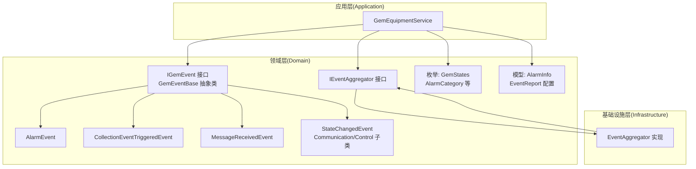
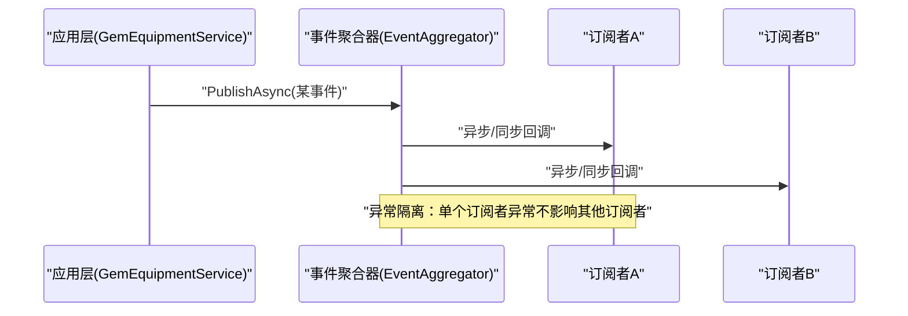
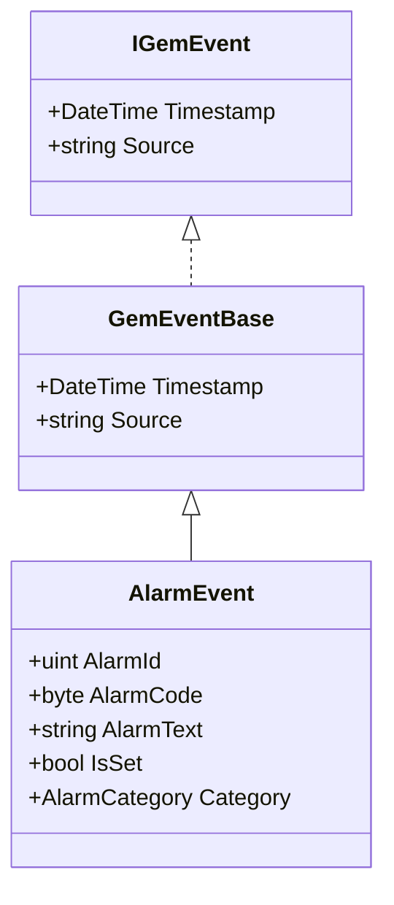
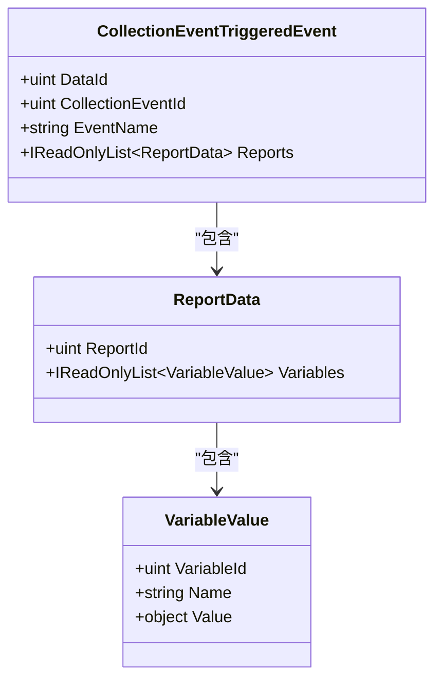
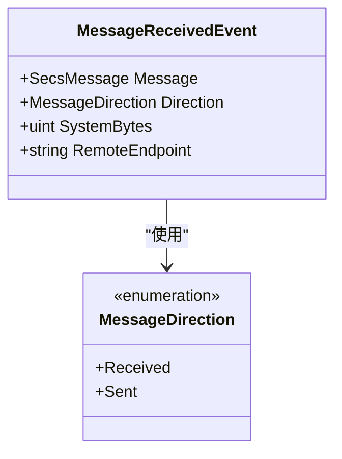
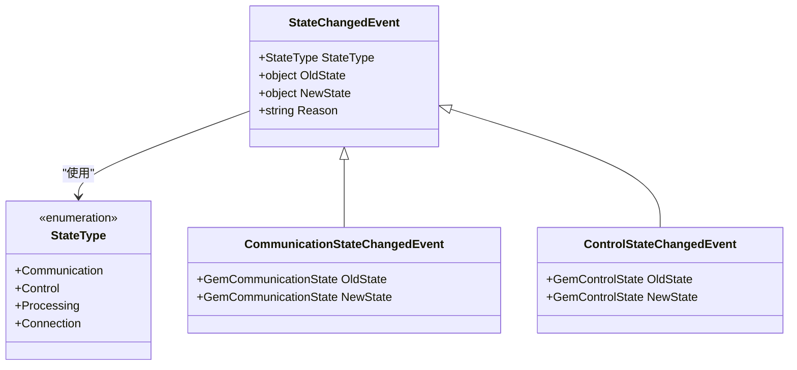
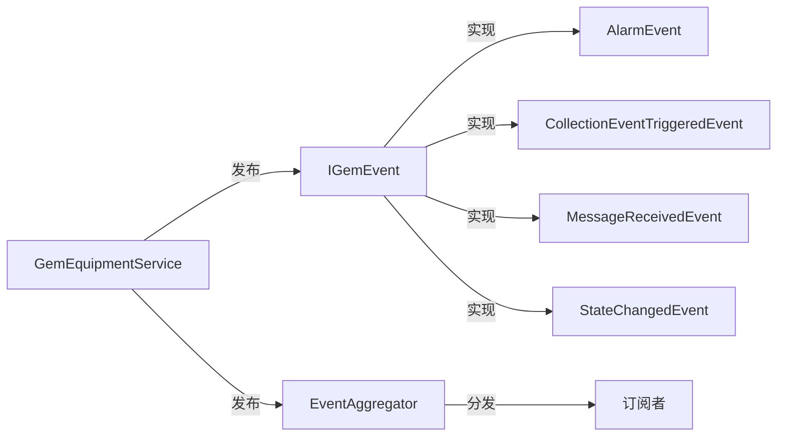

# 事件类型

<cite>
**本文引用的文件**
- [IGemEvent.cs](file://WebGem/SECS2GEM/Domain/Events/IGemEvent.cs)
- [AlarmEvent.cs](file://WebGem/SECS2GEM/Domain/Events/AlarmEvent.cs)
- [CollectionEventTriggeredEvent.cs](file://WebGem/SECS2GEM/Domain/Events/CollectionEventTriggeredEvent.cs)
- [MessageReceivedEvent.cs](file://WebGem/SECS2GEM/Domain/Events/MessageReceivedEvent.cs)
- [StateChangedEvent.cs](file://WebGem/SECS2GEM/Domain/Events/StateChangedEvent.cs)
- [GemStates.cs](file://WebGem/SECS2GEM/Core/Enums/GemStates.cs)
- [IEventAggregator.cs](file://WebGem/SECS2GEM/Domain/Interfaces/IEventAggregator.cs)
- [EventAggregator.cs](file://WebGem/SECS2GEM/Infrastructure/Services/EventAggregator.cs)
- [GemEquipmentService.cs](file://WebGem/SECS2GEM/Application/Services/GemEquipmentService.cs)
- [AlarmInfo.cs](file://WebGem/SECS2GEM/Domain/Models/AlarmInfo.cs)
- [EventReport.cs](file://WebGem/SECS2GEM/Domain/Models/EventReport.cs)
- [IntegrationTests.cs](file://WebGem/SECS2GEM.Tests/IntegrationTests.cs)
</cite>

## 目录
1. [简介](#简介)
2. [项目结构](#项目结构)
3. [核心组件](#核心组件)
4. [架构总览](#架构总览)
5. [详细组件分析](#详细组件分析)
6. [依赖分析](#依赖分析)
7. [性能考虑](#性能考虑)
8. [故障排查指南](#故障排查指南)
9. [结论](#结论)
10. [附录](#附录)

## 简介
本文件系统性梳理 SECS2-GEM 事件类型体系，围绕统一的事件模型与事件聚合器，深入解析以下事件类型：
- AlarmEvent 报警事件
- CollectionEventTriggeredEvent 采集事件
- MessageReceivedEvent 消息接收事件
- StateChangedEvent 状态变化事件（含通信/控制/处理/连接子类）

同时给出事件扩展指南与序列化/反序列化的最佳实践建议，帮助读者在不破坏现有架构的前提下，安全地扩展自定义事件类型。

## 项目结构
事件类型位于 Domain 层的 Events 命名空间，配合 Infrastructure 的 EventAggregator 实现观察者模式；应用层服务（如 GemEquipmentService）负责在业务流程中发布事件；枚举与模型位于 Core/Enums 与 Domain/Models。

图示来源
- [IGemEvent.cs:10-49](file://WebGem/SECS2GEM/Domain/Events/IGemEvent.cs#L10-L49)
- [AlarmEvent.cs:12-49](file://WebGem/SECS2GEM/Domain/Events/AlarmEvent.cs#L12-L49)
- [CollectionEventTriggeredEvent.cs:9-49](file://WebGem/SECS2GEM/Domain/Events/CollectionEventTriggeredEvent.cs#L9-L49)
- [MessageReceivedEvent.cs:12-52](file://WebGem/SECS2GEM/Domain/Events/MessageReceivedEvent.cs#L12-L52)
- [StateChangedEvent.cs:11-110](file://WebGem/SECS2GEM/Domain/Events/StateChangedEvent.cs#L11-L110)
- [IEventAggregator.cs:22-65](file://WebGem/SECS2GEM/Domain/Interfaces/IEventAggregator.cs#L22-L65)
- [EventAggregator.cs:17-219](file://WebGem/SECS2GEM/Infrastructure/Services/EventAggregator.cs#L17-L219)
- [GemStates.cs:10-176](file://WebGem/SECS2GEM/Core/Enums/GemStates.cs#L10-L176)
- [AlarmInfo.cs:8-43](file://WebGem/SECS2GEM/Domain/Models/AlarmInfo.cs#L8-L43)
- [EventReport.cs:10-159](file://WebGem/SECS2GEM/Domain/Models/EventReport.cs#L10-L159)
- [GemEquipmentService.cs:33-456](file://WebGem/SECS2GEM/Application/Services/GemEquipmentService.cs#L33-L456)

章节来源
- [IGemEvent.cs:10-49](file://WebGem/SECS2GEM/Domain/Events/IGemEvent.cs#L10-L49)
- [IEventAggregator.cs:22-65](file://WebGem/SECS2GEM/Domain/Interfaces/IEventAggregator.cs#L22-L65)
- [EventAggregator.cs:17-219](file://WebGem/SECS2GEM/Infrastructure/Services/EventAggregator.cs#L17-L219)
- [GemEquipmentService.cs:33-456](file://WebGem/SECS2GEM/Application/Services/GemEquipmentService.cs#L33-L456)

## 核心组件
- 统一事件模型
  - IGemEvent：定义事件的最小契约（时间戳、事件源）。
  - GemEventBase：提供统一的时间戳与源字段初始化逻辑。
- 事件聚合器
  - IEventAggregator：定义发布/订阅能力与清理机制。
  - EventAggregator：基于并发字典维护订阅者列表，支持同步/异步处理，异常隔离。
- 应用服务
  - GemEquipmentService：在关键业务点（报警、事件报告、消息接收、状态变化）发布事件。

章节来源
- [IGemEvent.cs:10-49](file://WebGem/SECS2GEM/Domain/Events/IGemEvent.cs#L10-L49)
- [IEventAggregator.cs:22-65](file://WebGem/SECS2GEM/Domain/Interfaces/IEventAggregator.cs#L22-L65)
- [EventAggregator.cs:17-219](file://WebGem/SECS2GEM/Infrastructure/Services/EventAggregator.cs#L17-L219)
- [GemEquipmentService.cs:33-456](file://WebGem/SECS2GEM/Application/Services/GemEquipmentService.cs#L33-L456)

## 架构总览
事件驱动的发布/订阅架构，应用层在业务流程中触发事件，事件聚合器将事件分发给所有订阅者，实现松耦合。

图示来源
- [GemEquipmentService.cs:243-244](file://WebGem/SECS2GEM/Application/Services/GemEquipmentService.cs#L243-L244)
- [EventAggregator.cs:25-67](file://WebGem/SECS2GEM/Infrastructure/Services/EventAggregator.cs#L25-L67)

章节来源
- [GemEquipmentService.cs:243-244](file://WebGem/SECS2GEM/Application/Services/GemEquipmentService.cs#L243-L244)
- [EventAggregator.cs:25-67](file://WebGem/SECS2GEM/Infrastructure/Services/EventAggregator.cs#L25-L67)

## 详细组件分析

### AlarmEvent 报警事件
- 设计理念
  - 表达一次报警触发或清除，携带报警码（含是否设置位与类别）、报警ID与报警文本。
  - 通过 IsSet 与 Category 提供便捷访问。
- 数据结构
  - AlarmId：报警唯一标识。
  - AlarmCode：报警码，bit7 表示 Set/Clear，低7位为 AlarmCategory。
  - AlarmText：报警文本。
  - IsSet、Category：派生属性，便于业务判断与展示。
- 触发条件与使用场景
  - 当设备产生报警或报警清除时触发（对应 S5F1）。
  - 应用层在发送 S5F1 后发布 AlarmEvent，供监控/日志/告警平台消费。
- 典型调用路径
  - 发送 S5F1 -> 发布 AlarmEvent -> 订阅者处理。

图示来源
- [IGemEvent.cs:10-49](file://WebGem/SECS2GEM/Domain/Events/IGemEvent.cs#L10-L49)
- [AlarmEvent.cs:12-49](file://WebGem/SECS2GEM/Domain/Events/AlarmEvent.cs#L12-L49)

章节来源
- [AlarmEvent.cs:12-49](file://WebGem/SECS2GEM/Domain/Events/AlarmEvent.cs#L12-L49)
- [GemEquipmentService.cs:292-294](file://WebGem/SECS2GEM/Application/Services/GemEquipmentService.cs#L292-L294)
- [GemStates.cs:128-176](file://WebGem/SECS2GEM/Core/Enums/GemStates.cs#L128-L176)
- [AlarmInfo.cs:8-43](file://WebGem/SECS2GEM/Domain/Models/AlarmInfo.cs#L8-L43)

### CollectionEventTriggeredEvent 采集事件
- 设计理念
  - 表达一次采集事件触发，携带事件ID、事件名称、数据ID与关联报告集合。
  - 报告数据由 ReportData 与 VariableValue 组成，便于扩展变量维度。
- 数据结构
  - DataId：本次事件的数据ID。
  - CollectionEventId：事件ID（CEID）。
  - EventName：事件名称。
  - Reports：ReportData 列表，每个包含 ReportId 与 VariableValue 列表。
- 触发条件与使用场景
  - 当需要发送 S6F11 事件报告时触发。
  - 应用层在构造并发送 S6F11 后发布 CollectionEventTriggeredEvent。
- 典型调用路径
  - 生成事件报告 -> 发送 S6F11 -> 发布 CollectionEventTriggeredEvent。

图示来源
- [CollectionEventTriggeredEvent.cs:9-49](file://WebGem/SECS2GEM/Domain/Events/CollectionEventTriggeredEvent.cs#L9-L49)
- [CollectionEventTriggeredEvent.cs:54-71](file://WebGem/SECS2GEM/Domain/Events/CollectionEventTriggeredEvent.cs#L54-L71)
- [CollectionEventTriggeredEvent.cs:76-99](file://WebGem/SECS2GEM/Domain/Events/CollectionEventTriggeredEvent.cs#L76-L99)

章节来源
- [CollectionEventTriggeredEvent.cs:9-49](file://WebGem/SECS2GEM/Domain/Events/CollectionEventTriggeredEvent.cs#L9-L49)
- [GemEquipmentService.cs:243-244](file://WebGem/SECS2GEM/Application/Services/GemEquipmentService.cs#L243-L244)
- [EventReport.cs:10-159](file://WebGem/SECS2GEM/Domain/Models/EventReport.cs#L10-L159)

### MessageReceivedEvent 消息接收事件
- 设计理念
  - 表达一次 SECS 消息接收，携带消息对象、方向（收/发）、系统字节（事务ID）与远端地址。
  - 便于日志记录、消息拦截与调试。
- 数据结构
  - Message：接收到的 SecsMessage。
  - Direction：Received/Sent。
  - SystemBytes：事务ID。
  - RemoteEndpoint：可选的远端地址。
- 触发条件与使用场景
  - 应用层在收到主通道消息时发布，供上层订阅者进行审计、过滤或二次处理。
- 典型调用路径
  - 接收消息 -> 构造 MessageReceivedEvent -> 发布 -> 订阅者处理。

图示来源
- [MessageReceivedEvent.cs:12-52](file://WebGem/SECS2GEM/Domain/Events/MessageReceivedEvent.cs#L12-L52)
- [MessageReceivedEvent.cs:58-65](file://WebGem/SECS2GEM/Domain/Events/MessageReceivedEvent.cs#L58-L65)

章节来源
- [MessageReceivedEvent.cs:12-52](file://WebGem/SECS2GEM/Domain/Events/MessageReceivedEvent.cs#L12-L52)
- [GemEquipmentService.cs:346-348](file://WebGem/SECS2GEM/Application/Services/GemEquipmentService.cs#L346-L348)

### StateChangedEvent 状态变化事件
- 设计理念
  - 表达 GEM 状态机的状态变化，包含状态类型（通信/控制/处理/连接）与新旧状态值。
  - 提供 Reason 字段便于记录变化原因。
- 数据结构
  - StateType：通信/控制/处理/连接。
  - OldState/NewState：分别为旧状态与新状态对象。
  - Reason：变化原因说明。
- 子类
  - CommunicationStateChangedEvent：通信状态变化。
  - ControlStateChangedEvent：控制状态变化。
- 触发条件与使用场景
  - 当设备状态发生切换（如从 Enabled 到 Communicating）时触发。
  - 应用层在状态变更回调中发布，供监控/报表/自动化流程消费。
- 典型调用路径
  - 状态变更回调 -> 构造 StateChangedEvent -> 发布 -> 订阅者处理。

图示来源
- [StateChangedEvent.cs:11-110](file://WebGem/SECS2GEM/Domain/Events/StateChangedEvent.cs#L11-L110)
- [StateChangedEvent.cs:95-108](file://WebGem/SECS2GEM/Domain/Events/StateChangedEvent.cs#L95-L108)
- [GemStates.cs:10-176](file://WebGem/SECS2GEM/Core/Enums/GemStates.cs#L10-L176)

章节来源
- [StateChangedEvent.cs:11-110](file://WebGem/SECS2GEM/Domain/Events/StateChangedEvent.cs#L11-L110)
- [GemEquipmentService.cs:365-398](file://WebGem/SECS2GEM/Application/Services/GemEquipmentService.cs#L365-L398)
- [GemStates.cs:10-176](file://WebGem/SECS2GEM/Core/Enums/GemStates.cs#L10-L176)

### 事件序列化与反序列化最佳实践
- 事件对象本身通常为轻量数据载体，适合采用 JSON 或二进制序列化。
- 建议：
  - 明确事件版本号，便于演进。
  - 对可空字段与枚举使用显式默认值，避免反序列化歧义。
  - 对大对象（如 ReportData/VariableValue）采用分页或流式传输策略。
  - 保持事件字段不可变，避免并发读写问题。
  - 在事件聚合器中对异常进行隔离，确保订阅者失败不影响整体分发。
- 与 SECS 消息序列化的关系
  - 事件对象与 SECS 消息的序列化是两套独立机制：事件用于应用内解耦，SECS 消息用于设备间协议交互。

章节来源
- [EventAggregator.cs:170-197](file://WebGem/SECS2GEM/Infrastructure/Services/EventAggregator.cs#L170-L197)

### 事件扩展指南
- 扩展步骤
  - 定义事件类型：继承 GemEventBase，添加必要属性。
  - 在应用层合适位置发布事件：在业务流程完成后调用 EventAggregator.PublishAsync/Publish。
  - 订阅事件：通过 IEventAggregator.Subscribe 注册处理函数。
- 示例参考
  - AlarmEvent：展示报警码解析与 IsSet/Category 派生属性设计。
  - CollectionEventTriggeredEvent：展示复杂嵌套数据结构的事件设计。
  - MessageReceivedEvent：展示消息元数据的事件封装。
  - StateChangedEvent：展示多态状态变化事件的分类设计。

章节来源
- [IGemEvent.cs:26-49](file://WebGem/SECS2GEM/Domain/Events/IGemEvent.cs#L26-L49)
- [GemEquipmentService.cs:243-244](file://WebGem/SECS2GEM/Application/Services/GemEquipmentService.cs#L243-L244)
- [IEventAggregator.cs:45-53](file://WebGem/SECS2GEM/Domain/Interfaces/IEventAggregator.cs#L45-L53)

## 依赖分析
- 松耦合
  - 应用层仅依赖事件接口与聚合器接口，不直接依赖具体事件实现。
- 订阅者隔离
  - EventAggregator 使用并发容器与锁保护订阅者列表，异常隔离避免连锁反应。
- 事件与协议映射
  - 事件用于应用内通知，与 SECS 协议消息（S5F1/S6F11 等）一一对应，但彼此独立。

图示来源
- [GemEquipmentService.cs:243-244](file://WebGem/SECS2GEM/Application/Services/GemEquipmentService.cs#L243-L244)
- [IEventAggregator.cs:30-53](file://WebGem/SECS2GEM/Domain/Interfaces/IEventAggregator.cs#L30-L53)
- [EventAggregator.cs:19-219](file://WebGem/SECS2GEM/Infrastructure/Services/EventAggregator.cs#L19-L219)

章节来源
- [GemEquipmentService.cs:243-244](file://WebGem/SECS2GEM/Application/Services/GemEquipmentService.cs#L243-L244)
- [IEventAggregator.cs:30-53](file://WebGem/SECS2GEM/Domain/Interfaces/IEventAggregator.cs#L30-L53)
- [EventAggregator.cs:19-219](file://WebGem/SECS2GEM/Infrastructure/Services/EventAggregator.cs#L19-L219)

## 性能考虑
- 异步发布优先：使用 PublishAsync 并行触发多个订阅者，提升吞吐。
- 异常隔离：单个订阅者异常不会阻塞其他订阅者，保障整体稳定性。
- 订阅者数量控制：过多订阅者会增加分发成本，建议按功能拆分订阅。
- 事件负载评估：对包含大量变量的采集事件，建议在应用层做采样或分批上报。

## 故障排查指南
- 未收到事件
  - 检查订阅是否成功注册（返回的 IDisposable 是否被正确持有）。
  - 确认事件发布路径是否被执行（例如报警/事件报告/消息接收回调）。
- 事件异常导致分发中断
  - EventAggregator 已内置异常隔离，若出现异常，检查订阅者的异常处理策略。
- 状态事件未触发
  - 确认状态变更回调是否被触发，以及 StateChangedEvent 的 Reason 是否有助于定位。
- 集成测试验证
  - 可参考集成测试中对连接、选择、链路测试等流程的验证，确保事件发布前的前置条件满足。

章节来源
- [EventAggregator.cs:170-197](file://WebGem/SECS2GEM/Infrastructure/Services/EventAggregator.cs#L170-L197)
- [GemEquipmentService.cs:346-398](file://WebGem/SECS2GEM/Application/Services/GemEquipmentService.cs#L346-L398)
- [IntegrationTests.cs:53-194](file://WebGem/SECS2GEM.Tests/IntegrationTests.cs#L53-L194)

## 结论
SECS2-GEM 事件类型系统通过统一的 IGemEvent 与 EventAggregator，实现了应用层事件的标准化与解耦。AlarmEvent、CollectionEventTriggeredEvent、MessageReceivedEvent、StateChangedEvent 四类事件覆盖了报警、采集、消息与状态三大核心场景。遵循扩展指南与最佳实践，可在不破坏现有架构的前提下，安全地引入新的事件类型，进一步增强系统的可观测性与可维护性。

## 附录
- 术语
  - ALCD：报警码，bit7 表示 Set/Clear，低7位为 AlarmCategory。
  - CEID：采集事件ID。
  - RPTID：报告ID。
  - VID：变量ID。
- 参考协议
  - S5F1：报警事件上报。
  - S6F11：事件报告。