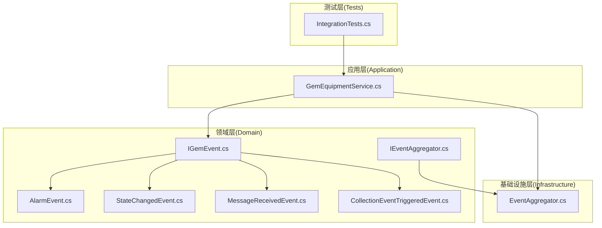
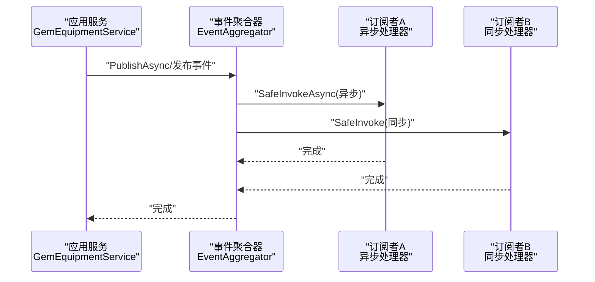
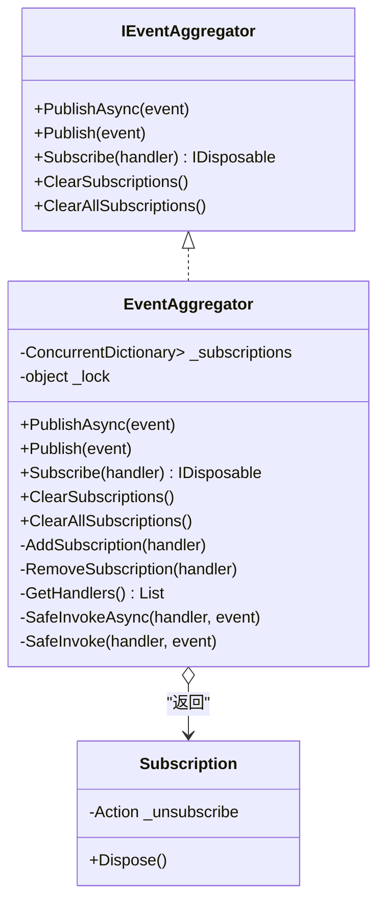
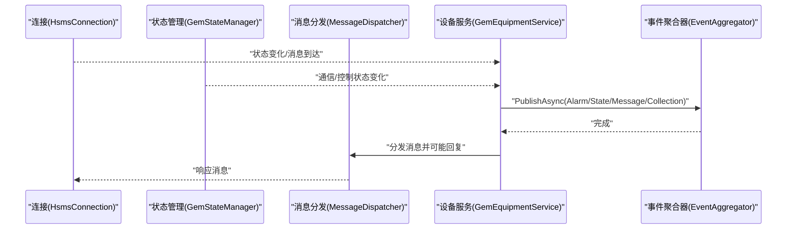
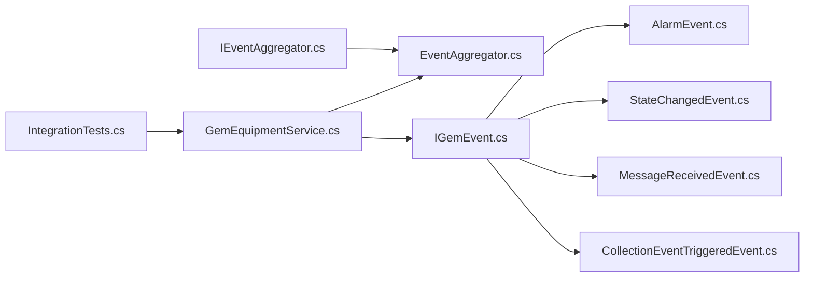

# 事件系统

<cite>
**本文引用的文件**
- [IGemEvent.cs](file://WebGem/SECS2GEM/Domain/Events/IGemEvent.cs)
- [EventAggregator.cs](file://WebGem/SECS2GEM/Infrastructure/Services/EventAggregator.cs)
- [IEventAggregator.cs](file://WebGem/SECS2GEM/Domain/Interfaces/IEventAggregator.cs)
- [AlarmEvent.cs](file://WebGem/SECS2GEM/Domain/Events/AlarmEvent.cs)
- [StateChangedEvent.cs](file://WebGem/SECS2GEM/Domain/Events/StateChangedEvent.cs)
- [MessageReceivedEvent.cs](file://WebGem/SECS2GEM/Domain/Events/MessageReceivedEvent.cs)
- [CollectionEventTriggeredEvent.cs](file://WebGem/SECS2GEM/Domain/Events/CollectionEventTriggeredEvent.cs)
- [GemEquipmentService.cs](file://WebGem/SECS2GEM/Application/Services/GemEquipmentService.cs)
- [AlarmInfo.cs](file://WebGem/SECS2GEM/Domain/Models/AlarmInfo.cs)
- [HsmsConfiguration.cs](file://WebGem/SECS2GEM/Infrastructure/Configuration/HsmsConfiguration.cs)
- [IntegrationTests.cs](file://WebGem/SECS2GEM.Tests/IntegrationTests.cs)
</cite>

## 目录
1. [简介](#简介)
2. [项目结构](#项目结构)
3. [核心组件](#核心组件)
4. [架构总览](#架构总览)
5. [详细组件分析](#详细组件分析)
6. [依赖关系分析](#依赖关系分析)
7. [性能考量](#性能考量)
8. [故障排除指南](#故障排除指南)
9. [结论](#结论)
10. [附录](#附录)

## 简介
本文件面向SECS2-GEM事件系统，聚焦EventAggregator事件聚合器的实现与使用，系统性阐述事件订阅、发布与路由机制；详解AlarmEvent、StateChangedEvent、MessageReceivedEvent、CollectionEventTriggeredEvent等事件类型；给出事件驱动架构的优势与适用场景；提供最佳实践、性能优化建议、完整示例与调试技巧，并说明如何扩展事件系统以支持自定义事件类型。

## 项目结构
事件系统主要分布在以下层次：
- Domain 层：事件模型与接口定义（事件基接口、具体事件类型）
- Domain 层：事件聚合器接口定义
- Infrastructure 层：事件聚合器实现（线程安全、异步/同步处理、异常隔离）
- Application 层：业务服务（GemEquipmentService）在关键生命周期节点发布事件
- Tests 层：集成测试验证事件在真实通信流程中的行为

图表来源
- [IGemEvent.cs:1-51](file://WebGem/SECS2GEM/Domain/Events/IGemEvent.cs#L1-L51)
- [IEventAggregator.cs:1-67](file://WebGem/SECS2GEM/Domain/Interfaces/IEventAggregator.cs#L1-L67)
- [EventAggregator.cs:1-219](file://WebGem/SECS2GEM/Infrastructure/Services/EventAggregator.cs#L1-L219)
- [GemEquipmentService.cs:1-456](file://WebGem/SECS2GEM/Application/Services/GemEquipmentService.cs#L1-L456)
- [IntegrationTests.cs:1-194](file://WebGem/SECS2GEM.Tests/IntegrationTests.cs#L1-L194)

章节来源
- [IGemEvent.cs:1-51](file://WebGem/SECS2GEM/Domain/Events/IGemEvent.cs#L1-L51)
- [IEventAggregator.cs:1-67](file://WebGem/SECS2GEM/Domain/Interfaces/IEventAggregator.cs#L1-L67)
- [EventAggregator.cs:1-219](file://WebGem/SECS2GEM/Infrastructure/Services/EventAggregator.cs#L1-L219)
- [GemEquipmentService.cs:1-456](file://WebGem/SECS2GEM/Application/Services/GemEquipmentService.cs#L1-L456)
- [IntegrationTests.cs:1-194](file://WebGem/SECS2GEM.Tests/IntegrationTests.cs#L1-L194)

## 核心组件
- 事件基接口与基类：定义事件的时间戳与来源标识，确保所有事件具备统一元数据。
- 事件聚合器接口：定义异步/同步发布、订阅（异步/同步处理器）、清理订阅等契约。
- 事件聚合器实现：基于并发字典维护订阅者列表，支持异步/同步处理器混合，异常隔离，返回可释放的订阅令牌。
- 业务服务：在连接建立、消息接收、状态变化、报警发送、事件上报等关键节点发布事件。

章节来源
- [IGemEvent.cs:10-51](file://WebGem/SECS2GEM/Domain/Events/IGemEvent.cs#L10-L51)
- [IEventAggregator.cs:22-67](file://WebGem/SECS2GEM/Domain/Interfaces/IEventAggregator.cs#L22-L67)
- [EventAggregator.cs:17-219](file://WebGem/SECS2GEM/Infrastructure/Services/EventAggregator.cs#L17-L219)
- [GemEquipmentService.cs:33-456](file://WebGem/SECS2GEM/Application/Services/GemEquipmentService.cs#L33-L456)

## 架构总览
事件驱动架构通过EventAggregator实现发布/订阅解耦，业务服务在合适时机发布事件，订阅者异步或同步处理，互不影响。

图表来源
- [EventAggregator.cs:25-67](file://WebGem/SECS2GEM/Infrastructure/Services/EventAggregator.cs#L25-L67)
- [EventAggregator.cs:170-197](file://WebGem/SECS2GEM/Infrastructure/Services/EventAggregator.cs#L170-L197)

## 详细组件分析

### EventAggregator 事件聚合器
- 实现要点
  - 并发安全：内部使用并发字典与锁保护订阅列表，避免并发修改。
  - 处理器类型：同时支持Func<TEvent, Task>异步处理器与Action<TEvent>同步处理器。
  - 异步发布：收集所有处理器并行执行，使用Task.WhenAll等待全部完成。
  - 同步发布：对异步处理器启动任务但不等待，对同步处理器直接调用。
  - 异常隔离：每个处理器调用包裹在try/catch中，异常不传播至其他订阅者。
  - 订阅管理：AddSubscription返回可释放对象，Dispose时自动移除订阅。
  - 清理能力：支持按事件类型或全局清理订阅。

图表来源
- [IEventAggregator.cs:22-67](file://WebGem/SECS2GEM/Domain/Interfaces/IEventAggregator.cs#L22-L67)
- [EventAggregator.cs:17-219](file://WebGem/SECS2GEM/Infrastructure/Services/EventAggregator.cs#L17-L219)

章节来源
- [EventAggregator.cs:17-219](file://WebGem/SECS2GEM/Infrastructure/Services/EventAggregator.cs#L17-L219)
- [IEventAggregator.cs:22-67](file://WebGem/SECS2GEM/Domain/Interfaces/IEventAggregator.cs#L22-L67)

### 事件类型与语义

#### AlarmEvent 报警事件
- 用途：设备报警触发或清除时发布，对应S5F1消息。
- 关键字段：报警ID、报警码（含Set/Clear位与类别）、报警文本；提供IsSet与Category便捷属性。
- 适用场景：报警监控、历史记录、联动处理。

章节来源
- [AlarmEvent.cs:12-57](file://WebGem/SECS2GEM/Domain/Events/AlarmEvent.cs#L12-L57)
- [AlarmInfo.cs:8-43](file://WebGem/SECS2GEM/Domain/Models/AlarmInfo.cs#L8-L43)

#### StateChangedEvent 状态变化事件
- 用途：GEM状态机状态变化时发布。
- 细分类型：
  - CommunicationStateChangedEvent：通信状态变化
  - ControlStateChangedEvent：控制状态变化
  - StateChangedEvent：通用状态变化（含状态类型枚举）
- 字段：状态类型、旧值、新值、原因说明。

章节来源
- [StateChangedEvent.cs:11-110](file://WebGem/SECS2GEM/Domain/Events/StateChangedEvent.cs#L11-L110)

#### MessageReceivedEvent 消息接收事件
- 用途：收到SECS消息时发布，可用于日志、拦截、统计。
- 关键字段：消息对象、方向（发送/接收）、事务ID、远端地址。

章节来源
- [MessageReceivedEvent.cs:12-67](file://WebGem/SECS2GEM/Domain/Events/MessageReceivedEvent.cs#L12-L67)

#### CollectionEventTriggeredEvent 采集事件报告事件
- 用途：需要发送S6F11事件报告时触发。
- 关键字段：数据ID、采集事件ID、事件名称、报告数据集合（含报告ID与变量值列表）。

章节来源
- [CollectionEventTriggeredEvent.cs:9-101](file://WebGem/SECS2GEM/Domain/Events/CollectionEventTriggeredEvent.cs#L9-L101)

### 事件发布与路由（业务服务）
- 在GemEquipmentService中，连接状态变化、消息接收、通信/控制状态变化、报警发送、事件上报等节点会发布相应事件。
- 发布方式：优先使用异步发布以避免阻塞主流程；必要时使用同步发布。
- 订阅者：可为异步或同步处理器，聚合器负责调度与异常隔离。

图表来源
- [GemEquipmentService.cs:324-400](file://WebGem/SECS2GEM/Application/Services/GemEquipmentService.cs#L324-L400)
- [EventAggregator.cs:25-67](file://WebGem/SECS2GEM/Infrastructure/Services/EventAggregator.cs#L25-L67)

章节来源
- [GemEquipmentService.cs:242-294](file://WebGem/SECS2GEM/Application/Services/GemEquipmentService.cs#L242-L294)
- [GemEquipmentService.cs:324-400](file://WebGem/SECS2GEM/Application/Services/GemEquipmentService.cs#L324-L400)

## 依赖关系分析
- 事件聚合器依赖事件接口与事件基类，确保类型约束与统一元数据。
- 业务服务依赖事件聚合器进行事件发布，同时依赖状态管理与消息分发模块。
- 测试层通过集成测试验证事件在真实通信流程中的行为。

图表来源
- [IGemEvent.cs:10-51](file://WebGem/SECS2GEM/Domain/Events/IGemEvent.cs#L10-L51)
- [IEventAggregator.cs:22-67](file://WebGem/SECS2GEM/Domain/Interfaces/IEventAggregator.cs#L22-L67)
- [EventAggregator.cs:17-219](file://WebGem/SECS2GEM/Infrastructure/Services/EventAggregator.cs#L17-L219)
- [GemEquipmentService.cs:33-456](file://WebGem/SECS2GEM/Application/Services/GemEquipmentService.cs#L33-L456)
- [IntegrationTests.cs:1-194](file://WebGem/SECS2GEM.Tests/IntegrationTests.cs#L1-L194)

章节来源
- [IGemEvent.cs:10-51](file://WebGem/SECS2GEM/Domain/Events/IGemEvent.cs#L10-L51)
- [IEventAggregator.cs:22-67](file://WebGem/SECS2GEM/Domain/Interfaces/IEventAggregator.cs#L22-L67)
- [EventAggregator.cs:17-219](file://WebGem/SECS2GEM/Infrastructure/Services/EventAggregator.cs#L17-L219)
- [GemEquipmentService.cs:33-456](file://WebGem/SECS2GEM/Application/Services/GemEquipmentService.cs#L33-L456)
- [IntegrationTests.cs:1-194](file://WebGem/SECS2GEM.Tests/IntegrationTests.cs#L1-L194)

## 性能考量
- 异步发布优先：使用异步发布避免阻塞IO与状态机推进，提高吞吐。
- 并行处理：异步处理器并行执行，充分利用多核；同步处理器串行执行，注意耗时逻辑。
- 异常隔离：单个订阅者异常不影响其他订阅者，提升整体稳定性。
- 订阅粒度：按事件类型订阅，减少无关事件处理开销。
- 清理策略：及时清理不再使用的订阅，避免内存泄漏与额外调度成本。
- 日志与可观测性：建议在聚合器中增加日志记录（当前实现为TODO），便于定位问题。

## 故障排除指南
- 订阅未生效
  - 检查订阅是否正确返回并保存IDisposable；确认未提前Dispose。
  - 确认事件类型泛型匹配，处理器签名一致。
- 事件未被处理
  - 确认发布路径确实调用了事件聚合器发布方法。
  - 检查是否存在异常导致处理器被跳过（当前实现捕获异常，建议补充日志）。
- 性能问题
  - 同步处理器耗时过长会导致阻塞；将耗时逻辑迁移到异步处理器。
  - 大量订阅者时，评估异步并行带来的上下文切换成本。
- 集成测试验证
  - 使用集成测试验证从连接、选择请求、S1F1/S1F13到消息往返的完整链路，确保事件在真实场景下被触发与处理。

章节来源
- [EventAggregator.cs:170-197](file://WebGem/SECS2GEM/Infrastructure/Services/EventAggregator.cs#L170-L197)
- [IntegrationTests.cs:53-194](file://WebGem/SECS2GEM.Tests/IntegrationTests.cs#L53-L194)

## 结论
EventAggregator提供了轻量、线程安全且具备异常隔离的事件发布/订阅能力，结合业务服务在关键节点发布事件，形成清晰的事件驱动架构。通过合理选择异步/同步处理器、控制订阅粒度与清理策略，可在保证稳定性的同时获得良好性能。扩展自定义事件类型只需遵循事件基接口约定并在业务服务中发布即可。

## 附录

### 事件驱动架构优势与适用场景
- 解耦：发布者与订阅者无直接依赖，降低模块间耦合。
- 可扩展：新增订阅者无需修改发布者。
- 可观测：集中式事件便于日志、审计与监控。
- 适用场景：报警通知、状态变更通知、消息接收日志、事件上报等。

### 事件处理最佳实践
- 优先使用异步处理器处理耗时操作（如写日志、远程调用）。
- 同步处理器仅用于轻量、快速处理（如内存缓存更新）。
- 明确事件边界与职责，避免在一个事件处理器中做过多职责。
- 为关键事件添加唯一标识（如Source/Timestamp），便于追踪。
- 在聚合器中完善日志记录，便于排障。

### 事件处理示例（步骤说明）
- 订阅事件
  - 使用事件聚合器的Subscribe方法注册异步或同步处理器，保存返回的IDisposable以便取消订阅。
- 发布事件
  - 在业务服务的关键节点（如报警发送、状态变化、消息接收、事件上报）调用PublishAsync/Publish发布事件。
- 取消订阅
  - 在不再需要时调用IDisposable.Dispose移除订阅，避免资源泄漏。

章节来源
- [IEventAggregator.cs:44-64](file://WebGem/SECS2GEM/Domain/Interfaces/IEventAggregator.cs#L44-L64)
- [EventAggregator.cs:72-83](file://WebGem/SECS2GEM/Infrastructure/Services/EventAggregator.cs#L72-L83)
- [GemEquipmentService.cs:242-294](file://WebGem/SECS2GEM/Application/Services/GemEquipmentService.cs#L242-L294)

### 扩展事件系统（自定义事件类型）
- 定义事件
  - 新建事件类型，继承事件基类，包含必要的业务字段与只读属性。
- 发布事件
  - 在业务服务中选择合适的时机调用事件聚合器发布该事件。
- 订阅事件
  - 在订阅方注册对应的异步或同步处理器。
- 配置与测试
  - 在集成测试中验证事件在真实通信流程中的行为。

章节来源
- [IGemEvent.cs:26-49](file://WebGem/SECS2GEM/Domain/Events/IGemEvent.cs#L26-L49)
- [GemEquipmentService.cs:242-294](file://WebGem/SECS2GEM/Application/Services/GemEquipmentService.cs#L242-L294)

### 调试技巧
- 在事件聚合器中为异常处理补充日志记录，定位异常处理器。
- 使用集成测试模拟真实通信流程，观察事件是否按预期触发。
- 通过配置调整超时与心跳参数，确保事件在复杂网络环境下稳定触发。

章节来源
- [EventAggregator.cs:170-197](file://WebGem/SECS2GEM/Infrastructure/Services/EventAggregator.cs#L170-L197)
- [IntegrationTests.cs:53-194](file://WebGem/SECS2GEM.Tests/IntegrationTests.cs#L53-L194)
- [HsmsConfiguration.cs:15-266](file://WebGem/SECS2GEM/Infrastructure/Configuration/HsmsConfiguration.cs#L15-L266)