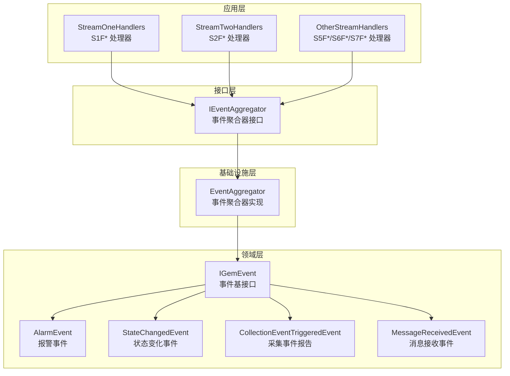
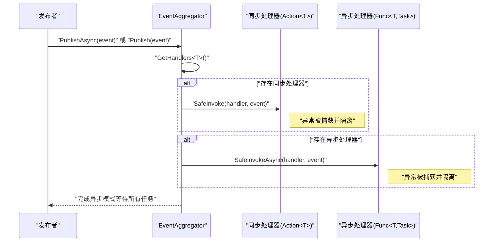
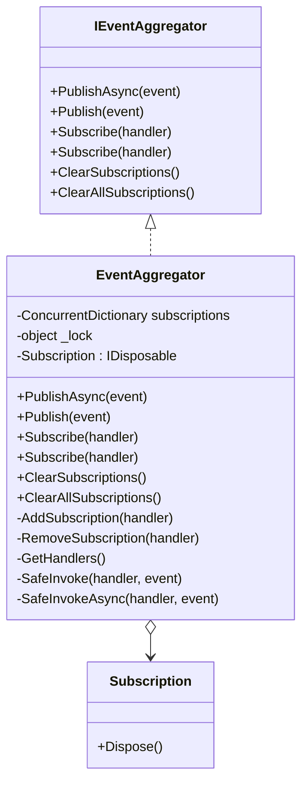
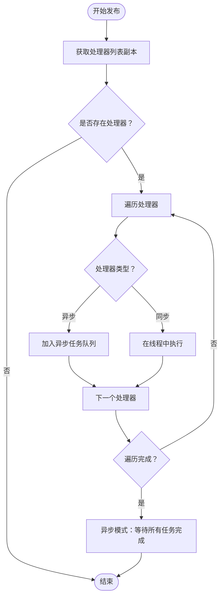
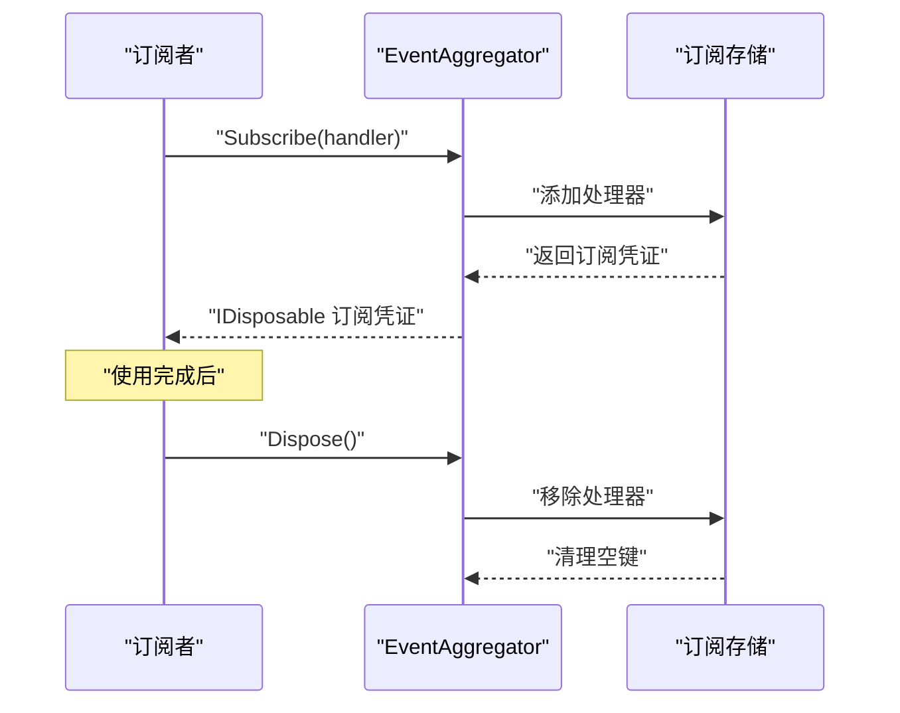
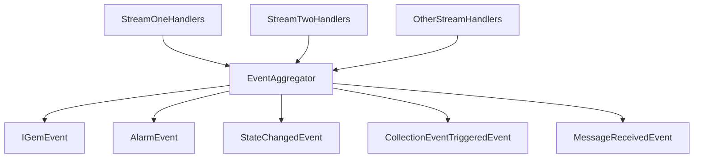

# 事件聚合器

<cite>
**本文引用的文件**
- [EventAggregator.cs](file://WebGem/SECS2GEM/Infrastructure/Services/EventAggregator.cs)
- [IEventAggregator.cs](file://WebGem/SECS2GEM/Domain/Interfaces/IEventAggregator.cs)
- [IGemEvent.cs](file://WebGem/SECS2GEM/Domain/Events/IGemEvent.cs)
- [AlarmEvent.cs](file://WebGem/SECS2GEM/Domain/Events/AlarmEvent.cs)
- [StateChangedEvent.cs](file://WebGem/SECS2GEM/Domain/Events/StateChangedEvent.cs)
- [CollectionEventTriggeredEvent.cs](file://WebGem/SECS2GEM/Domain/Events/CollectionEventTriggeredEvent.cs)
- [MessageReceivedEvent.cs](file://WebGem/SECS2GEM/Domain/Events/MessageReceivedEvent.cs)
- [StreamOneHandlers.cs](file://WebGem/SECS2GEM/Application/Handlers/StreamOneHandlers.cs)
- [StreamTwoHandlers.cs](file://WebGem/SECS2GEM/Application/Handlers/StreamTwoHandlers.cs)
- [OtherStreamHandlers.cs](file://WebGem/SECS2GEM/Application/Handlers/OtherStreamHandlers.cs)
</cite>

## 目录
1. [简介](#简介)
2. [项目结构](#项目结构)
3. [核心组件](#核心组件)
4. [架构总览](#架构总览)
5. [详细组件分析](#详细组件分析)
6. [依赖关系分析](#依赖关系分析)
7. [性能考量](#性能考量)
8. [故障排查指南](#故障排查指南)
9. [结论](#结论)
10. [附录](#附录)

## 简介
本文件围绕 SECS2-GEM 事件聚合器进行系统化技术文档编写，重点阐述 EventAggregator 类的实现机制与使用方法。内容涵盖观察者模式设计、并发安全策略（基于 ConcurrentDictionary 与锁）、异步与同步事件处理支持、订阅/发布/取消订阅全流程、异常隔离（SafeInvoke/SafeInvokeAsync）机制，并提供可操作的使用示例与性能优化建议。

## 项目结构
事件聚合器位于基础设施层，面向领域事件接口与事件模型，通过统一的发布/订阅入口实现模块间解耦。下图展示与事件聚合器直接相关的文件与角色：

图表来源
- [EventAggregator.cs:17-219](file://WebGem/SECS2GEM/Infrastructure/Services/EventAggregator.cs#L17-L219)
- [IEventAggregator.cs:22-65](file://WebGem/SECS2GEM/Domain/Interfaces/IEventAggregator.cs#L22-L65)
- [IGemEvent.cs:10-51](file://WebGem/SECS2GEM/Domain/Events/IGemEvent.cs#L10-L51)
- [AlarmEvent.cs:12-57](file://WebGem/SECS2GEM/Domain/Events/AlarmEvent.cs#L12-L57)
- [StateChangedEvent.cs:11-110](file://WebGem/SECS2GEM/Domain/Events/StateChangedEvent.cs#L11-L110)
- [CollectionEventTriggeredEvent.cs:9-101](file://WebGem/SECS2GEM/Domain/Events/CollectionEventTriggeredEvent.cs#L9-L101)
- [MessageReceivedEvent.cs:12-67](file://WebGem/SECS2GEM/Domain/Events/MessageReceivedEvent.cs#L12-L67)
- [StreamOneHandlers.cs:20-211](file://WebGem/SECS2GEM/Application/Handlers/StreamOneHandlers.cs#L20-L211)
- [StreamTwoHandlers.cs:13-331](file://WebGem/SECS2GEM/Application/Handlers/StreamTwoHandlers.cs#L13-L331)
- [OtherStreamHandlers.cs:9-276](file://WebGem/SECS2GEM/Application/Handlers/OtherStreamHandlers.cs#L9-L276)

章节来源
- [EventAggregator.cs:17-219](file://WebGem/SECS2GEM/Infrastructure/Services/EventAggregator.cs#L17-L219)
- [IEventAggregator.cs:22-65](file://WebGem/SECS2GEM/Domain/Interfaces/IEventAggregator.cs#L22-L65)

## 核心组件
- 事件聚合器接口 IEventAggregator：定义统一的发布/订阅能力，支持泛型事件类型约束（IGemEvent），提供同步与异步发布、订阅（异步/同步处理器）、清理订阅等能力。
- 事件聚合器实现 EventAggregator：基于类型键的订阅存储、并发安全的订阅管理、异常隔离的处理器执行、以及 Disposable 订阅凭证。

关键职责与契约
- 发布事件：支持同步 Publish 与异步 PublishAsync；内部根据处理器类型自动分派至异步或同步执行路径。
- 订阅事件：支持 Func<TEvent, Task>（异步）与 Action<TEvent>（同步）两种处理器签名；返回 IDisposable 以便取消订阅。
- 清理订阅：按事件类型或全部清理，确保内存与资源释放。
- 并发安全：内部使用 ConcurrentDictionary 作为主存储容器，并在关键路径加锁以避免并发修改导致的异常。

章节来源
- [IEventAggregator.cs:22-65](file://WebGem/SECS2GEM/Domain/Interfaces/IEventAggregator.cs#L22-L65)
- [EventAggregator.cs:17-219](file://WebGem/SECS2GEM/Infrastructure/Services/EventAggregator.cs#L17-L219)

## 架构总览
事件聚合器采用“观察者模式”实现，发布者无需关心订阅者数量与类型，订阅者通过统一接口注册处理器。下图展示典型交互序列：

图表来源
- [EventAggregator.cs:25-67](file://WebGem/SECS2GEM/Infrastructure/Services/EventAggregator.cs#L25-L67)
- [EventAggregator.cs:170-197](file://WebGem/SECS2GEM/Infrastructure/Services/EventAggregator.cs#L170-L197)

## 详细组件分析

### EventAggregator 类分析
- 设计要点
  - 使用 ConcurrentDictionary<Type, List<object>> 按事件类型维护处理器列表，键为 Type，值为处理器对象集合。
  - 在订阅/移除/查询等关键路径使用私有锁对象，保证并发安全与一致性。
  - 订阅返回内部类 Subscription 的 IDisposable 实例，Dispose 时回调移除订阅逻辑。
  - 发布时复制处理器列表，避免遍历期间被并发修改。
- 处理器类型识别
  - 异步处理器：Func<TEvent, Task>，直接加入任务队列并统一等待（异步模式）或后台调度（同步模式）。
  - 同步处理器：Action<TEvent>，在独立线程中执行（异步模式）或直接同步调用（同步模式）。
- 异常隔离
  - SafeInvoke/SafeInvokeAsync 内部捕获异常，避免单个订阅者的异常影响其他订阅者。
  - 日志记录为 TODO，实际部署中建议接入日志框架以定位问题。

图表来源
- [IEventAggregator.cs:22-65](file://WebGem/SECS2GEM/Domain/Interfaces/IEventAggregator.cs#L22-L65)
- [EventAggregator.cs:17-219](file://WebGem/SECS2GEM/Infrastructure/Services/EventAggregator.cs#L17-L219)

章节来源
- [EventAggregator.cs:17-219](file://WebGem/SECS2GEM/Infrastructure/Services/EventAggregator.cs#L17-L219)

### 发布流程（异步/同步）
- 异步发布 PublishAsync
  - 获取当前事件类型的处理器列表副本。
  - 遍历处理器：若为异步处理器则加入任务列表；若为同步处理器则在新线程中执行。
  - 使用统一等待（Task.WhenAll）确保所有处理器完成后再返回。
- 同步发布 Publish
  - 遍历处理器：异步处理器启动后台任务但不等待；同步处理器直接调用。
  - 不等待任何处理器完成，适合低延迟场景但不保证完成顺序。

图表来源
- [EventAggregator.cs:25-67](file://WebGem/SECS2GEM/Infrastructure/Services/EventAggregator.cs#L25-L67)

章节来源
- [EventAggregator.cs:25-67](file://WebGem/SECS2GEM/Infrastructure/Services/EventAggregator.cs#L25-L67)

### 订阅/取消订阅流程
- 订阅 Subscribe
  - 根据处理器类型确定事件类型键，向订阅表追加处理器。
  - 返回 Subscription 实例，其 Dispose 调用会触发移除订阅。
- 取消订阅 RemoveSubscription
  - 从订阅表中移除对应处理器；若列表为空则移除该类型键。
- 清理 ClearSubscriptions/ClearAllSubscriptions
  - 按事件类型或全部清理订阅，避免内存泄漏。

图表来源
- [EventAggregator.cs:111-147](file://WebGem/SECS2GEM/Infrastructure/Services/EventAggregator.cs#L111-L147)

章节来源
- [EventAggregator.cs:111-147](file://WebGem/SECS2GEM/Infrastructure/Services/EventAggregator.cs#L111-L147)

### 异常隔离机制（SafeInvoke/SafeInvokeAsync）
- SafeInvoke：包装同步处理器调用，捕获异常后静默处理，避免影响其他订阅者。
- SafeInvokeAsync：包装异步处理器调用，捕获异常后静默处理，避免影响其他订阅者。
- 建议：在生产环境为异常隔离增加日志记录，便于问题追踪与恢复。

章节来源
- [EventAggregator.cs:170-197](file://WebGem/SECS2GEM/Infrastructure/Services/EventAggregator.cs#L170-L197)

### 事件类型与使用场景
- 报警事件 AlarmEvent：用于设备报警/报警清除通知，常见于 S5F1 场景。
- 状态变化事件 StateChangedEvent：包含通信/控制/处理/连接状态变化，便于状态机驱动。
- 采集事件报告 CollectionEventTriggeredEvent：用于 S6F11 事件报告触发。
- 消息接收事件 MessageReceivedEvent：用于日志记录、消息拦截与调试。

章节来源
- [AlarmEvent.cs:12-57](file://WebGem/SECS2GEM/Domain/Events/AlarmEvent.cs#L12-L57)
- [StateChangedEvent.cs:11-110](file://WebGem/SECS2GEM/Domain/Events/StateChangedEvent.cs#L11-L110)
- [CollectionEventTriggeredEvent.cs:9-101](file://WebGem/SECS2GEM/Domain/Events/CollectionEventTriggeredEvent.cs#L9-L101)
- [MessageReceivedEvent.cs:12-67](file://WebGem/SECS2GEM/Domain/Events/MessageReceivedEvent.cs#L12-L67)

### 应用层处理器与事件聚合器的结合
- StreamOneHandlers：处理 S1F* 消息，可能在状态变更时触发状态变化事件。
- StreamTwoHandlers：处理 S2F* 消息，可能在设备常量更新或事件报告链接时触发相应事件。
- OtherStreamHandlers：处理 S5F*/S6F*/S7F* 消息，可能涉及报警与事件报告相关事件。

章节来源
- [StreamOneHandlers.cs:20-211](file://WebGem/SECS2GEM/Application/Handlers/StreamOneHandlers.cs#L20-L211)
- [StreamTwoHandlers.cs:13-331](file://WebGem/SECS2GEM/Application/Handlers/StreamTwoHandlers.cs#L13-L331)
- [OtherStreamHandlers.cs:9-276](file://WebGem/SECS2GEM/Application/Handlers/OtherStreamHandlers.cs#L9-L276)

## 依赖关系分析
- EventAggregator 依赖领域事件接口 IGemEvent 与具体事件类型，确保类型安全与扩展性。
- 应用层处理器通过 IEventAggregator 发布事件，形成松耦合的事件驱动架构。
- 订阅存储使用 ConcurrentDictionary 与锁保护，兼顾高并发与一致性。

图表来源
- [EventAggregator.cs:17-219](file://WebGem/SECS2GEM/Infrastructure/Services/EventAggregator.cs#L17-L219)
- [IEventAggregator.cs:22-65](file://WebGem/SECS2GEM/Domain/Interfaces/IEventAggregator.cs#L22-L65)
- [IGemEvent.cs:10-51](file://WebGem/SECS2GEM/Domain/Events/IGemEvent.cs#L10-L51)
- [StreamOneHandlers.cs:20-211](file://WebGem/SECS2GEM/Application/Handlers/StreamOneHandlers.cs#L20-L211)
- [StreamTwoHandlers.cs:13-331](file://WebGem/SECS2GEM/Application/Handlers/StreamTwoHandlers.cs#L13-L331)
- [OtherStreamHandlers.cs:9-276](file://WebGem/SECS2GEM/Application/Handlers/OtherStreamHandlers.cs#L9-L276)

章节来源
- [EventAggregator.cs:17-219](file://WebGem/SECS2GEM/Infrastructure/Services/EventAggregator.cs#L17-L219)
- [IEventAggregator.cs:22-65](file://WebGem/SECS2GEM/Domain/Interfaces/IEventAggregator.cs#L22-L65)

## 性能考量
- 并发安全
  - 使用 ConcurrentDictionary 作为主存储，降低锁竞争；在订阅/移除/查询时使用细粒度锁，避免长时间持有全局锁。
- 发布路径优化
  - 异步发布使用 Task.WhenAll 并行执行，提升吞吐；同步发布对异步处理器采用后台任务，避免阻塞调用线程。
  - 发布前复制处理器列表，避免遍历期间的并发修改。
- 线程与任务
  - 同步处理器在独立线程执行，避免阻塞事件发布线程；异步处理器直接参与并行等待。
- 建议
  - 对高频事件，优先使用异步处理器与异步发布，减少阻塞。
  - 合理控制订阅数量，避免单事件处理器过多导致任务爆炸。
  - 在异常隔离基础上增加日志采样，避免日志风暴。

[本节为通用性能建议，不直接分析具体文件]

## 故障排查指南
- 订阅未生效
  - 检查事件类型是否正确匹配（泛型约束 IGemEvent）。
  - 确认订阅返回的 IDisposable 未提前 Dispose。
- 处理器异常导致其他订阅者失效
  - EventAggregator 已内置异常隔离；如需定位问题，请在生产环境补充日志记录。
- 性能问题
  - 高频事件导致线程池耗尽：考虑合并事件或降级为同步发布。
  - 处理器数量过多：拆分事件或引入批处理。
- 资源泄漏
  - 确保 Dispose 订阅凭证，或使用 ClearSubscriptions/ClearAllSubscriptions 清理。

章节来源
- [EventAggregator.cs:170-197](file://WebGem/SECS2GEM/Infrastructure/Services/EventAggregator.cs#L170-L197)
- [EventAggregator.cs:111-147](file://WebGem/SECS2GEM/Infrastructure/Services/EventAggregator.cs#L111-L147)

## 结论
EventAggregator 通过观察者模式与并发安全设计，提供了统一、灵活且高性能的事件发布/订阅能力。其对异步/同步处理器的兼容、异常隔离与 Disposable 订阅凭证，使其适用于复杂的 SECS2-GEM 场景。配合领域事件模型与应用层处理器，可构建清晰、可维护的事件驱动架构。

[本节为总结性内容，不直接分析具体文件]

## 附录

### 使用示例（步骤说明）
- 订阅不同类型的事件处理器
  - 订阅异步处理器：使用 Subscribe(Func<TEvent, Task>)，返回 IDisposable。
  - 订阅同步处理器：使用 Subscribe(Action<TEvent>)，返回 IDisposable。
- 批量发布事件
  - 使用 PublishAsync 并行触发所有处理器；或使用 Publish 后台触发。
- 清理订阅
  - 使用 ClearSubscriptions<TEvent>() 清理指定类型；使用 ClearAllSubscriptions() 清理全部。
- 典型事件类型
  - 报警事件：AlarmEvent
  - 状态变化：StateChangedEvent
  - 采集事件报告：CollectionEventTriggeredEvent
  - 消息接收：MessageReceivedEvent

章节来源
- [IEventAggregator.cs:22-65](file://WebGem/SECS2GEM/Domain/Interfaces/IEventAggregator.cs#L22-L65)
- [EventAggregator.cs:25-106](file://WebGem/SECS2GEM/Infrastructure/Services/EventAggregator.cs#L25-L106)
- [AlarmEvent.cs:12-57](file://WebGem/SECS2GEM/Domain/Events/AlarmEvent.cs#L12-L57)
- [StateChangedEvent.cs:11-110](file://WebGem/SECS2GEM/Domain/Events/StateChangedEvent.cs#L11-L110)
- [CollectionEventTriggeredEvent.cs:9-101](file://WebGem/SECS2GEM/Domain/Events/CollectionEventTriggeredEvent.cs#L9-L101)
- [MessageReceivedEvent.cs:12-67](file://WebGem/SECS2GEM/Domain/Events/MessageReceivedEvent.cs#L12-L67)