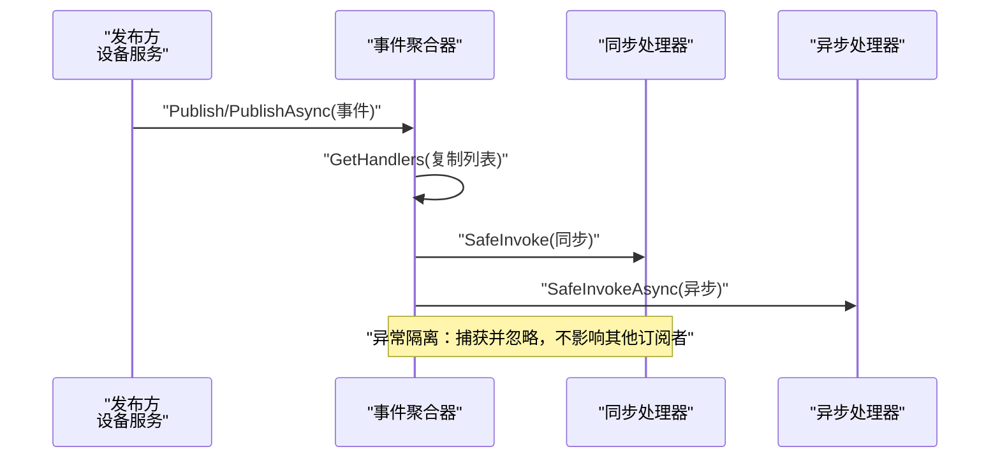
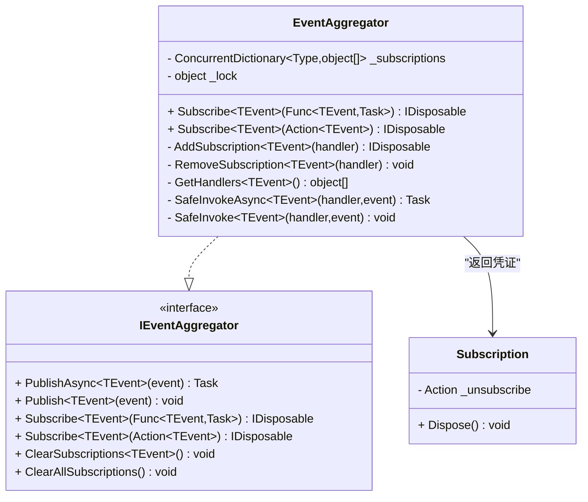
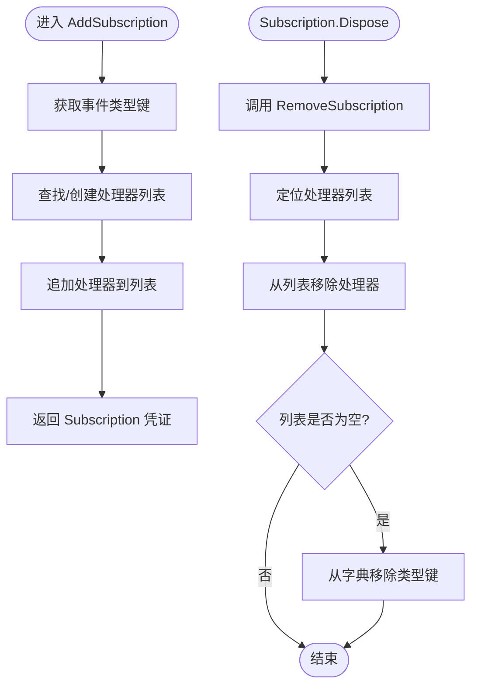
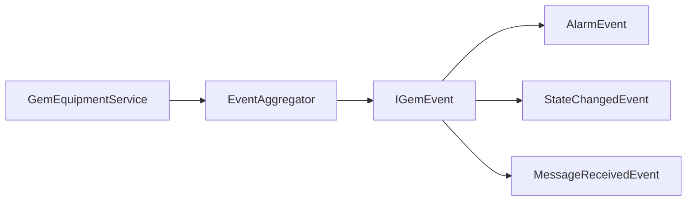

# 事件订阅机制

<cite>
**本文引用的文件**
- [EventAggregator.cs](file://WebGem/SECS2GEM/Infrastructure/Services/EventAggregator.cs)
- [IEventAggregator.cs](file://WebGem/SECS2GEM/Domain/Interfaces/IEventAggregator.cs)
- [IGemEvent.cs](file://WebGem/SECS2GEM/Domain/Events/IGemEvent.cs)
- [AlarmEvent.cs](file://WebGem/SECS2GEM/Domain/Events/AlarmEvent.cs)
- [StateChangedEvent.cs](file://WebGem/SECS2GEM/Domain/Events/StateChangedEvent.cs)
- [MessageReceivedEvent.cs](file://WebGem/SECS2GEM/Domain/Events/MessageReceivedEvent.cs)
- [GemEquipmentService.cs](file://WebGem/SECS2GEM/Application/Services/GemEquipmentService.cs)
</cite>

## 目录
1. [引言](#引言)
2. [项目结构](#项目结构)
3. [核心组件](#核心组件)
4. [架构总览](#架构总览)
5. [详细组件分析](#详细组件分析)
6. [依赖关系分析](#依赖关系分析)
7. [性能考虑](#性能考虑)
8. [故障排查指南](#故障排查指南)
9. [结论](#结论)
10. [附录](#附录)

## 引言
本文件围绕 SECS2-GEM 的事件订阅机制进行系统性说明，重点覆盖以下方面：
- 订阅系统的实现原理与工作机制
- AddSubscription 与 RemoveSubscription 的内部流程
- Subscription 内部类与 IDisposable 模式在取消订阅中的应用
- 异步与同步订阅处理器的使用方式与差异
- 订阅生命周期管理与内存泄漏防护策略
- 事件传播顺序与优先级设计
- 性能优化建议与调试技巧

## 项目结构
事件订阅机制主要由以下层次构成：
- 领域层：事件模型与接口，定义事件契约与基类
- 应用层：设备服务在业务流程中触发事件并委托事件聚合器发布
- 基础设施层：事件聚合器实现订阅、发布、异常隔离与取消订阅

```mermaid
graph TB
subgraph "领域层"
IEvt["IGemEvent<br/>事件接口"]
AlarmEvt["AlarmEvent<br/>报警事件"]
StateEvt["StateChangedEvent<br/>状态变化事件"]
MsgEvt["MessageReceivedEvent<br/>消息接收事件"]
end
subgraph "应用层"
GES["GemEquipmentService<br/>设备服务"]
end
subgraph "基础设施层"
EA["EventAggregator<br/>事件聚合器"]
Sub["Subscription<br/>订阅凭证"]
end
IEvt --> AlarmEvt
IEvt --> StateEvt
IEvt --> MsgEvt
GES --> EA
EA --> Sub
```

图表来源
- [IGemEvent.cs:10-50](file://WebGem/SECS2GEM/Domain/Events/IGemEvent.cs#L10-L50)
- [AlarmEvent.cs:12-55](file://WebGem/SECS2GEM/Domain/Events/AlarmEvent.cs#L12-L55)
- [StateChangedEvent.cs:11-108](file://WebGem/SECS2GEM/Domain/Events/StateChangedEvent.cs#L11-L108)
- [MessageReceivedEvent.cs:12-66](file://WebGem/SECS2GEM/Domain/Events/MessageReceivedEvent.cs#L12-L66)
- [GemEquipmentService.cs:33-133](file://WebGem/SECS2GEM/Application/Services/GemEquipmentService.cs#L33-L133)
- [EventAggregator.cs:17-218](file://WebGem/SECS2GEM/Infrastructure/Services/EventAggregator.cs#L17-L218)

章节来源
- [IEventAggregator.cs:22-65](file://WebGem/SECS2GEM/Domain/Interfaces/IEventAggregator.cs#L22-L65)
- [IGemEvent.cs:10-50](file://WebGem/SECS2GEM/Domain/Events/IGemEvent.cs#L10-L50)
- [GemEquipmentService.cs:33-133](file://WebGem/SECS2GEM/Application/Services/GemEquipmentService.cs#L33-L133)

## 核心组件
- 事件聚合器 EventAggregator：提供统一的订阅、发布与取消订阅能力；支持异步与同步两种处理器；内部通过线程安全集合维护订阅者列表；通过 IDisposable 返回订阅凭证，便于显式取消订阅。
- 事件接口与模型：IGemEvent 定义事件基元（时间戳、来源），具体事件如 AlarmEvent、StateChangedEvent、MessageReceivedEvent 继承该基类，承载业务语义。
- 设备服务 GemEquipmentService：在业务流程中触发事件（如报警、状态变化、消息接收），并通过事件聚合器发布。

章节来源
- [EventAggregator.cs:17-218](file://WebGem/SECS2GEM/Infrastructure/Services/EventAggregator.cs#L17-L218)
- [IEventAggregator.cs:22-65](file://WebGem/SECS2GEM/Domain/Interfaces/IEventAggregator.cs#L22-L65)
- [IGemEvent.cs:10-50](file://WebGem/SECS2GEM/Domain/Events/IGemEvent.cs#L10-L50)
- [GemEquipmentService.cs:33-133](file://WebGem/SECS2GEM/Application/Services/GemEquipmentService.cs#L33-L133)

## 架构总览
事件订阅采用观察者模式，事件聚合器作为中介，解耦事件发布方与订阅方。发布路径支持同步与异步两种模式，订阅者可选择同步或异步处理器，聚合器内部对异常进行隔离，确保单个订阅者的异常不影响其他订阅者。

图表来源
- [EventAggregator.cs:25-67](file://WebGem/SECS2GEM/Infrastructure/Services/EventAggregator.cs#L25-L67)
- [EventAggregator.cs:167-197](file://WebGem/SECS2GEM/Infrastructure/Services/EventAggregator.cs#L167-L197)

## 详细组件分析

### 事件聚合器与订阅生命周期
- 订阅入口
  - Subscribe<TEvent>(Func<TEvent, Task>)：注册异步处理器
  - Subscribe<TEvent>(Action<TEvent>)：注册同步处理器
  - 两者最终委托 AddSubscription<TEvent>(object handler) 完成注册，并返回 IDisposable 订阅凭证
- 取消订阅
  - AddSubscription 内部创建 Subscription 凭证，其 Dispose 调用 RemoveSubscription<TEvent>(handler)
  - RemoveSubscription 在临界区内从类型对应的处理器列表移除目标处理器，若列表为空则移除该类型键
- 并发与一致性
  - 使用锁保护订阅字典，避免并发修改导致的数据竞争
  - GetHandlers 在读取时复制列表，防止遍历期间被其他线程修改
- 异常隔离
  - SafeInvoke/SafeInvokeAsync 捕获异常，避免单个订阅者失败影响其他订阅者

图表来源
- [EventAggregator.cs:17-218](file://WebGem/SECS2GEM/Infrastructure/Services/EventAggregator.cs#L17-L218)
- [IEventAggregator.cs:22-65](file://WebGem/SECS2GEM/Domain/Interfaces/IEventAggregator.cs#L22-L65)

章节来源
- [EventAggregator.cs:72-147](file://WebGem/SECS2GEM/Infrastructure/Services/EventAggregator.cs#L72-L147)
- [IEventAggregator.cs:22-65](file://WebGem/SECS2GEM/Domain/Interfaces/IEventAggregator.cs#L22-L65)

### AddSubscription 与 RemoveSubscription 工作机制
- AddSubscription
  - 获取事件类型键，尝试从字典取处理器列表，不存在则新建并加入字典
  - 将处理器追加到列表
  - 返回 Subscription 凭证，其 Dispose 会回调 RemoveSubscription
- RemoveSubscription
  - 从字典定位处理器列表
  - 从列表移除目标处理器，若列表为空则移除该类型键
  - 保证订阅表只保留活跃订阅者，避免内存泄漏

图表来源
- [EventAggregator.cs:111-147](file://WebGem/SECS2GEM/Infrastructure/Services/EventAggregator.cs#L111-L147)

章节来源
- [EventAggregator.cs:111-147](file://WebGem/SECS2GEM/Infrastructure/Services/EventAggregator.cs#L111-L147)

### Subscription 内部类与 IDisposable 模式
- Subscription 是私有的内部类，构造时注入“取消订阅动作”
- Dispose 调用该动作一次后将其置空，避免重复调用
- 该模式确保订阅者在不再需要时能及时释放资源，防止订阅链残留导致内存泄漏

章节来源
- [EventAggregator.cs:202-216](file://WebGem/SECS2GEM/Infrastructure/Services/EventAggregator.cs#L202-L216)

### 异步与同步订阅处理器
- 同步处理器（Action<TEvent>）
  - 发布时直接调用，适合轻量、快速处理逻辑
  - 若在 PublishAsync 中，会包装为 Task 并启动后台执行，不阻塞当前线程
- 异步处理器（Func<TEvent, Task>）
  - 发布时以 Task 形式并行执行，提高吞吐
  - PublishAsync 会等待所有异步任务完成；Publish 则启动任务但不等待
- 异常隔离
  - 无论同步还是异步，均在内部捕获异常，避免影响其他订阅者

章节来源
- [EventAggregator.cs:25-67](file://WebGem/SECS2GEM/Infrastructure/Services/EventAggregator.cs#L25-L67)
- [EventAggregator.cs:167-197](file://WebGem/SECS2GEM/Infrastructure/Services/EventAggregator.cs#L167-L197)

### 订阅生命周期管理与内存泄漏防护
- 显式取消订阅：通过 IDisposable 订阅凭证调用 Dispose，确保处理器从列表移除
- 清理接口：支持按事件类型清理（ClearSubscriptions<TEvent>）与全量清理（ClearAllSubscriptions）
- 并发安全：所有读写操作在临界区内进行，避免竞态条件
- 列表复制：遍历时复制处理器列表，避免遍历期间的并发修改

章节来源
- [EventAggregator.cs:88-106](file://WebGem/SECS2GEM/Infrastructure/Services/EventAggregator.cs#L88-L106)
- [EventAggregator.cs:152-165](file://WebGem/SECS2GEM/Infrastructure/Services/EventAggregator.cs#L152-L165)

### 事件传播顺序与优先级
- 传播顺序
  - 同步处理器按订阅顺序依次执行
  - 异步处理器并行执行，完成后 PublishAsync 等待全部完成
- 优先级
  - 代码未实现显式优先级排序；若需优先级，请在处理器内部自行实现或扩展事件聚合器以支持有序队列

章节来源
- [EventAggregator.cs:30-45](file://WebGem/SECS2GEM/Infrastructure/Services/EventAggregator.cs#L30-L45)

### 典型事件类型与使用场景
- 报警事件 AlarmEvent：设备报警/清除时触发，可用于通知与日志
- 状态变化事件 StateChangedEvent：通信/控制/处理/连接状态变化时触发
- 消息接收事件 MessageReceivedEvent：收到/发送 SECS 消息时触发，可用于审计与拦截

章节来源
- [AlarmEvent.cs:12-55](file://WebGem/SECS2GEM/Domain/Events/AlarmEvent.cs#L12-L55)
- [StateChangedEvent.cs:11-108](file://WebGem/SECS2GEM/Domain/Events/StateChangedEvent.cs#L11-L108)
- [MessageReceivedEvent.cs:12-66](file://WebGem/SECS2GEM/Domain/Events/MessageReceivedEvent.cs#L12-L66)

### 事件发布与订阅在设备服务中的应用
- 设备服务在业务流程中触发事件（如报警、状态变化、消息接收），并通过事件聚合器发布
- 订阅者可注册同步或异步处理器，实现解耦的事件消费

章节来源
- [GemEquipmentService.cs:291-294](file://WebGem/SECS2GEM/Application/Services/GemEquipmentService.cs#L291-L294)
- [GemEquipmentService.cs:365-370](file://WebGem/SECS2GEM/Application/Services/GemEquipmentService.cs#L365-L370)
- [GemEquipmentService.cs:346-348](file://WebGem/SECS2GEM/Application/Services/GemEquipmentService.cs#L346-L348)

## 依赖关系分析
事件聚合器依赖于事件接口与模型，设备服务在业务流程中触发事件并委托聚合器发布。订阅者通过接口注册处理器，聚合器负责调度与异常隔离。

图表来源
- [IGemEvent.cs:10-50](file://WebGem/SECS2GEM/Domain/Events/IGemEvent.cs#L10-L50)
- [AlarmEvent.cs:12-55](file://WebGem/SECS2GEM/Domain/Events/AlarmEvent.cs#L12-L55)
- [StateChangedEvent.cs:11-108](file://WebGem/SECS2GEM/Domain/Events/StateChangedEvent.cs#L11-L108)
- [MessageReceivedEvent.cs:12-66](file://WebGem/SECS2GEM/Domain/Events/MessageReceivedEvent.cs#L12-L66)
- [GemEquipmentService.cs:33-133](file://WebGem/SECS2GEM/Application/Services/GemEquipmentService.cs#L33-L133)
- [EventAggregator.cs:17-218](file://WebGem/SECS2GEM/Infrastructure/Services/EventAggregator.cs#L17-L218)

章节来源
- [IEventAggregator.cs:22-65](file://WebGem/SECS2GEM/Domain/Interfaces/IEventAggregator.cs#L22-L65)
- [EventAggregator.cs:17-218](file://WebGem/SECS2GEM/Infrastructure/Services/EventAggregator.cs#L17-L218)
- [GemEquipmentService.cs:33-133](file://WebGem/SECS2GEM/Application/Services/GemEquipmentService.cs#L33-L133)

## 性能考虑
- 异步并行处理：对于耗时操作，优先使用异步处理器，提升整体吞吐
- 同步轻量处理：仅在极短耗时逻辑中使用同步处理器，避免阻塞
- 异常隔离：内部捕获异常，避免单点失败拖累整体性能
- 列表复制：遍历时复制处理器列表，减少锁持有时间
- 并发安全：通过锁与线程安全集合降低并发冲突概率

## 故障排查指南
- 订阅未生效
  - 检查是否正确调用 Subscribe 并保存 IDisposable 订阅凭证
  - 确认事件类型匹配且处理器签名一致
- 取消订阅无效
  - 确保 Dispose 被调用且未重复调用
  - 检查是否在并发环境下重复取消
- 性能问题
  - 异步处理器中避免长时间阻塞操作
  - 对高频事件采用异步并行处理
- 内存泄漏
  - 确保在对象生命周期结束时调用 Dispose
  - 使用 ClearSubscriptions 或 ClearAllSubscriptions 进行批量清理

## 结论
SECS2-GEM 的事件订阅机制通过事件聚合器实现了高内聚、低耦合的事件分发体系。其核心特性包括：
- 统一的订阅/发布入口与 IDisposable 取消订阅
- 同步与异步处理器并存，满足不同性能需求
- 异常隔离保障系统稳定性
- 并发安全与生命周期管理降低内存泄漏风险

## 附录
- 使用建议
  - 高频事件优先采用异步处理器
  - 在订阅者生命周期结束时调用 Dispose
  - 对关键路径避免在同步处理器中执行阻塞操作
  - 如需严格顺序，可在处理器内部实现有序执行逻辑