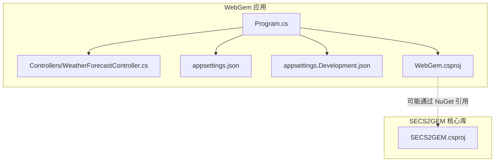
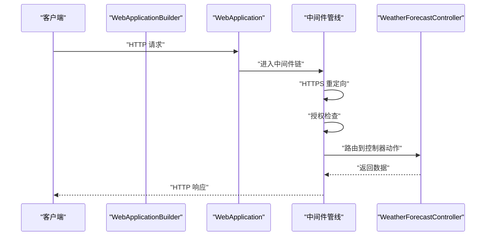
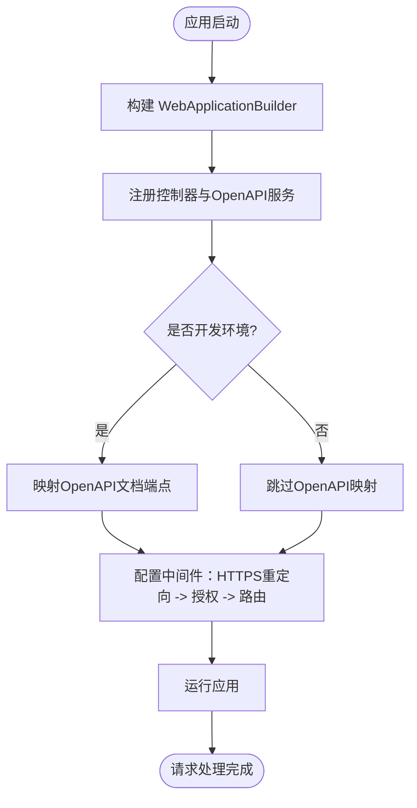
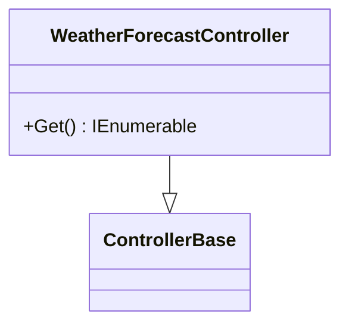
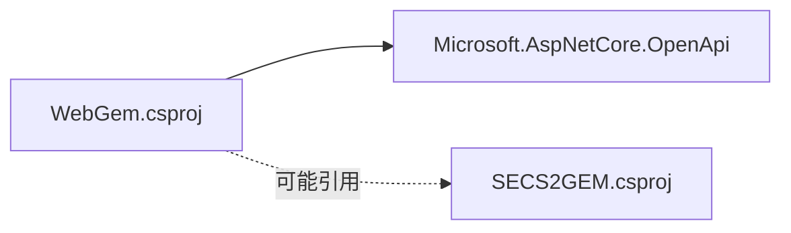

# Web API集成

<cite>
**本文引用的文件**
- [WebGem.csproj](file://WebGem/WebGem/WebGem.csproj)
- [Program.cs](file://WebGem/WebGem/Program.cs)
- [appsettings.json](file://WebGem/WebGem/appsettings.json)
- [appsettings.Development.json](file://WebGem/WebGem/appsettings.Development.json)
- [WeatherForecastController.cs](file://WebGem/WebGem/Controllers/WeatherForecastController.cs)
- [SECS2GEM.csproj](file://WebGem/SECS2GEM/SECS2GEM.csproj)
</cite>

## 目录
1. [简介](#简介)
2. [项目结构](#项目结构)
3. [核心组件](#核心组件)
4. [架构总览](#架构总览)
5. [详细组件分析](#详细组件分析)
6. [依赖关系分析](#依赖关系分析)
7. [性能考虑](#性能考虑)
8. [故障排除指南](#故障排除指南)
9. [结论](#结论)
10. [附录](#附录)

## 简介
本文件面向SECS2-GEM的Web API集成，聚焦于ASP.NET Core应用的配置与启动流程（服务注册、中间件配置、路由映射）、控制器设计模式与RESTful接口实现现状，并结合现有代码对OpenAPI/Swagger集成、HTTPS重定向与授权配置进行说明。同时提供配置管理、环境设置与部署策略建议，以及将SECS2-GEM功能暴露为Web服务的集成指南。

当前仓库中WebGem项目已具备基础的ASP.NET Core Web API骨架：控制器、服务注册、中间件管线与OpenAPI集成均已实现；但尚未包含SECS2-GEM业务逻辑的直接Web公开层。后续可基于现有结构扩展控制器以暴露设备状态、事件、消息等SECS/GEM能力。

## 项目结构
WebGem解决方案包含以下与Web API相关的关键目录与文件：
- WebGem：ASP.NET Core Web API应用
  - Controllers：控制器目录（当前包含WeatherForecastController）
  - Program.cs：应用入口与管道配置
  - appsettings.json / appsettings.Development.json：配置文件
  - WebGem.csproj：项目文件，声明OpenAPI包引用
- SECS2GEM：SECS2-GEM核心库（非Web）
  - SECS2GEM.csproj：标准.NET库项目文件

**图表来源**
- [Program.cs:1-24](file://WebGem/WebGem/Program.cs#L1-L24)
- [WeatherForecastController.cs:1-27](file://WebGem/WebGem/Controllers/WeatherForecastController.cs#L1-L27)
- [appsettings.json:1-10](file://WebGem/WebGem/appsettings.json#L1-L10)
- [appsettings.Development.json:1-9](file://WebGem/WebGem/appsettings.Development.json#L1-L9)
- [WebGem.csproj:1-14](file://WebGem/WebGem/WebGem.csproj#L1-L14)
- [SECS2GEM.csproj:1-10](file://WebGem/SECS2GEM/SECS2GEM.csproj#L1-L10)

**章节来源**
- [Program.cs:1-24](file://WebGem/WebGem/Program.cs#L1-L24)
- [WebGem.csproj:1-14](file://WebGem/WebGem/WebGem.csproj#L1-L14)
- [SECS2GEM.csproj:1-10](file://WebGem/SECS2GEM/SECS2GEM.csproj#L1-L10)

## 核心组件
- 应用入口与服务注册
  - 使用WebApplicationBuilder创建应用，注册控制器服务与OpenAPI服务
  - 在开发环境映射OpenAPI文档端点
- 中间件管线
  - HTTPS重定向：确保所有请求通过HTTPS传输
  - 授权中间件：启用授权策略（默认无具体策略）
  - 控制器路由映射：将HTTP请求分发到对应控制器动作
- 配置系统
  - appsettings.json定义日志级别与允许主机
  - appsettings.Development.json在开发环境覆盖日志级别
- 控制器示例
  - WeatherForecastController演示了基于特性路由的GET端点

**章节来源**
- [Program.cs:1-24](file://WebGem/WebGem/Program.cs#L1-L24)
- [appsettings.json:1-10](file://WebGem/WebGem/appsettings.json#L1-L10)
- [appsettings.Development.json:1-9](file://WebGem/WebGem/appsettings.Development.json#L1-L9)
- [WeatherForecastController.cs:1-27](file://WebGem/WebGem/Controllers/WeatherForecastController.cs#L1-L27)

## 架构总览
下图展示了从客户端到控制器的典型请求流，以及OpenAPI文档在开发环境中的映射位置。

**图表来源**
- [Program.cs:11-21](file://WebGem/WebGem/Program.cs#L11-L21)
- [WeatherForecastController.cs:14-24](file://WebGem/WebGem/Controllers/WeatherForecastController.cs#L14-L24)

## 详细组件分析

### 应用程序启动与中间件配置
- 服务注册
  - 控制器服务：用于启用模型绑定、过滤器、动作选择等
  - OpenAPI服务：启用Swagger/OpenAPI文档生成与端点
- 环境特定行为
  - 开发环境：映射OpenAPI文档端点，便于调试
- 中间件顺序
  - HTTPS重定向：提升安全性
  - 授权：为后续策略实施预留
  - 控制器路由：最终将请求分发至控制器动作

**图表来源**
- [Program.cs:1-24](file://WebGem/WebGem/Program.cs#L1-L24)

**章节来源**
- [Program.cs:1-24](file://WebGem/WebGem/Program.cs#L1-L24)

### 控制器设计模式与RESTful接口
- 设计模式
  - 基于特性路由的控制器模式：通过[ApiController]与[Route]特性标注控制器与动作
  - 动作方法：使用HTTP方法特性（如HttpGet）声明REST端点
- 当前实现
  - WeatherForecastController提供一个GET端点，返回天气预报数据集合
  - 路由规则：基于控制器名称生成路由模板
- 扩展建议
  - 为SECS2-GEM引入专门的控制器（如EquipmentController、EventController），以暴露设备状态、事件上报、消息收发等能力
  - 统一响应模型与错误处理（见“故障排除指南”）

**图表来源**
- [WeatherForecastController.cs:5-25](file://WebGem/WebGem/Controllers/WeatherForecastController.cs#L5-L25)

**章节来源**
- [WeatherForecastController.cs:1-27](file://WebGem/WebGem/Controllers/WeatherForecastController.cs#L1-L27)

### OpenAPI/Swagger集成
- 集成方式
  - 通过AddOpenApi注册OpenAPI服务
  - 在开发环境通过MapOpenApi映射文档端点
- 访问方式
  - 开发环境下可通过应用根路径访问Swagger UI（具体路径取决于MapOpenApi的实现细节）
- 后续优化
  - 添加描述性元数据（标题、版本、描述）
  - 为SECS2-GEM端点添加注释与示例

**章节来源**
- [Program.cs:6-15](file://WebGem/WebGem/Program.cs#L6-L15)
- [WebGem.csproj:10](file://WebGem/WebGem/WebGem.csproj#L10)

### HTTPS重定向与授权配置
- HTTPS重定向
  - 通过UseHttpsRedirection启用强制HTTPS
- 授权
  - 通过UseAuthorization启用授权中间件
  - 当前未配置具体授权策略，可在Program.cs中扩展
- 建议
  - 生产环境确保IIS或反向代理正确终止TLS
  - 根据业务需要添加认证与授权策略（如Bearer Token）

**章节来源**
- [Program.cs:17-19](file://WebGem/WebGem/Program.cs#L17-L19)

### 配置管理与环境设置
- appsettings.json
  - 定义日志记录级别与允许主机
- appsettings.Development.json
  - 在开发环境覆盖日志级别
- 环境变量
  - 可通过环境变量覆盖配置键值（如ASPNETCORE_ENVIRONMENT）
- 部署建议
  - 生产环境使用安全的密钥存储与机密管理
  - 将敏感配置（如连接字符串、证书）置于安全位置

**章节来源**
- [appsettings.json:1-10](file://WebGem/WebGem/appsettings.json#L1-L10)
- [appsettings.Development.json:1-9](file://WebGem/WebGem/appsettings.Development.json#L1-L9)

### 部署策略
- 运行时目标
  - WebGem目标框架为net10.0，SECS2GEM为net9.0
- 发布与运行
  - 使用dotnet publish生成发布包
  - 支持容器化部署（Dockerfile可按需添加）
- 安全与性能
  - 生产环境启用HTTPS与授权
  - 结合负载均衡与健康检查

**章节来源**
- [WebGem.csproj:3-7](file://WebGem/WebGem/WebGem.csproj#L3-L7)
- [SECS2GEM.csproj:3-7](file://WebGem/SECS2GEM/SECS2GEM.csproj#L3-L7)

## 依赖关系分析
- WebGem.csproj
  - 引用Microsoft.AspNetCore.OpenApi包，支持OpenAPI/Swagger
- 项目间关系
  - WebGem作为Web应用，SECS2GEM为核心库
  - WebGem可通过NuGet引用SECS2GEM（当前项目文件未显式引用，但可作为依赖项）

**图表来源**
- [WebGem.csproj:9-11](file://WebGem/WebGem/WebGem.csproj#L9-L11)
- [SECS2GEM.csproj:1-10](file://WebGem/SECS2GEM/SECS2GEM.csproj#L1-L10)

**章节来源**
- [WebGem.csproj:1-14](file://WebGem/WebGem/WebGem.csproj#L1-L14)
- [SECS2GEM.csproj:1-10](file://WebGem/SECS2GEM/SECS2GEM.csproj#L1-L10)

## 性能考虑
- 中间件顺序与开销
  - HTTPS重定向与授权中间件应尽量前置，避免不必要的计算
- 控制器与序列化
  - 返回大数据集时考虑分页与压缩
  - 使用强类型模型减少序列化成本
- 缓存与并发
  - 对只读数据可采用缓存策略
  - 并发场景下注意线程安全与锁竞争

## 故障排除指南
- OpenAPI不可见
  - 确认处于开发环境且已调用MapOpenApi
- HTTPS重定向问题
  - 检查反向代理或IIS配置是否正确终止TLS
- 授权失败
  - 检查授权中间件是否启用，以及是否存在自定义策略
- 配置不生效
  - 确认环境变量与appsettings层级覆盖顺序

**章节来源**
- [Program.cs:12-15](file://WebGem/WebGem/Program.cs#L12-L15)
- [Program.cs:17-19](file://WebGem/WebGem/Program.cs#L17-L19)
- [appsettings.json:1-10](file://WebGem/WebGem/appsettings.json#L1-L10)
- [appsettings.Development.json:1-9](file://WebGem/WebGem/appsettings.Development.json#L1-L9)

## 结论
当前WebGem项目已具备ASP.NET Core Web API的基础能力：控制器、OpenAPI集成、HTTPS重定向与授权中间件。SECS2-GEM核心库提供了设备状态、事件与消息处理等能力，可作为Web API的后端服务被调用。建议在此基础上扩展SECS2-GEM专用控制器，完善错误处理与统一响应模型，并在生产环境中强化安全与性能配置。

## 附录

### API端点文档（基于现有控制器）
- 端点：GET /WeatherForecast
  - 方法：GET
  - 路由：WeatherForecastController
  - 响应：集合（天气预报项）
  - 错误：无显式错误处理（可扩展）

**章节来源**
- [WeatherForecastController.cs:14-24](file://WebGem/WebGem/Controllers/WeatherForecastController.cs#L14-L24)

### 集成指南：将SECS2-GEM功能暴露为Web服务
- 步骤概览
  - 在WebGem中创建SECS2-GEM专用控制器（如EquipmentController、EventController）
  - 注入SECS2GEM服务接口（IGemEquipmentService等）
  - 实现动作方法：查询设备状态、触发事件上报、发送/接收SECS消息
  - 统一响应模型与异常处理
  - 配置授权策略与HTTPS
- 示例参考
  - 参考WeatherForecastController的特性路由与动作方法模式
  - 参考Program.cs的服务注册与中间件配置

**章节来源**
- [WeatherForecastController.cs:5-25](file://WebGem/WebGem/Controllers/WeatherForecastController.cs#L5-L25)
- [Program.cs:5-21](file://WebGem/WebGem/Program.cs#L5-L21)