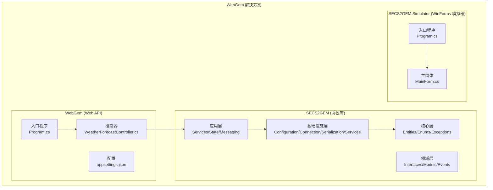
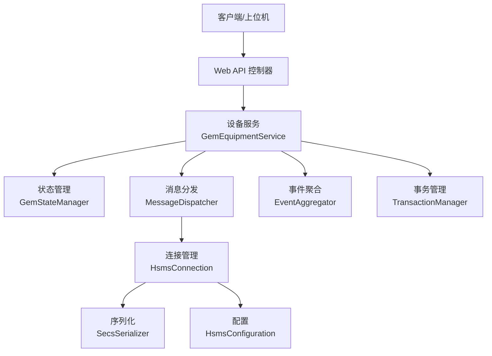
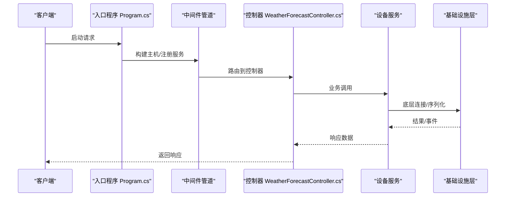
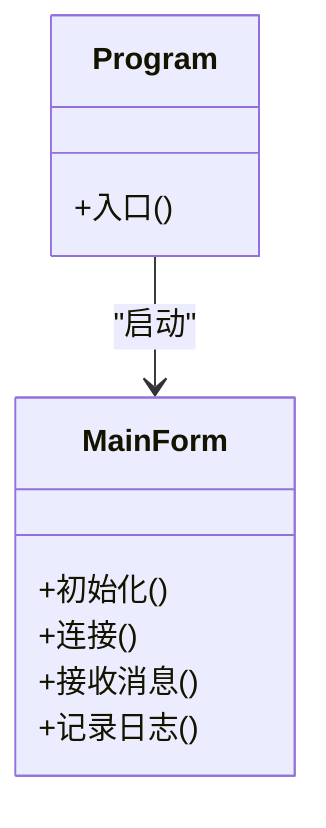
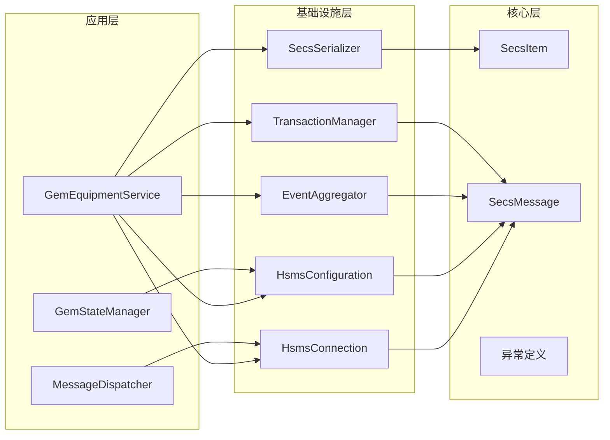

# 应用集成

<cite>
**本文引用的文件**
- [README.md](file://README.md)
- [WebGem.csproj](file://WebGem/WebGem/WebGem.csproj)
- [Program.cs](file://WebGem/WebGem/Program.cs)
- [appsettings.json](file://WebGem/WebGem/appsettings.json)
- [appsettings.Development.json](file://WebGem/WebGem/appsettings.Development.json)
- [WeatherForecastController.cs](file://WebGem/WebGem/Controllers/WeatherForecastController.cs)
- [SECS2GEM.csproj](file://WebGem/SECS2GEM/SECS2GEM.csproj)
- [GemEquipmentService.cs](file://WebGem/SECS2GEM/Application/Services/GemEquipmentService.cs)
- [GemStateManager.cs](file://WebGem/SECS2GEM/Application/State/GemStateManager.cs)
- [MessageDispatcher.cs](file://WebGem/SECS2GEM/Application/Messaging/MessageDispatcher.cs)
- [HsmsConfiguration.cs](file://WebGem/SECS2GEM/Infrastructure/Configuration/HsmsConfiguration.cs)
- [HsmsConnection.cs](file://WebGem/SECS2GEM/Infrastructure/Connection/HsmsConnection.cs)
- [SecsSerializer.cs](file://WebGem/SECS2GEM/Infrastructure/Serialization/SecsSerializer.cs)
- [EventAggregator.cs](file://WebGem/SECS2GEM/Infrastructure/Services/EventAggregator.cs)
- [TransactionManager.cs](file://WebGem/SECS2GEM/Infrastructure/Services/TransactionManager.cs)
- [SecsItem.cs](file://WebGem/SECS2GEM/Core/Entities/SecsItem.cs)
- [SecsMessage.cs](file://WebGem/SECS2GEM/Core/Entities/SecsMessage.cs)
- [SecsException.cs](file://WebGem/SECS2GEM/Core/Exceptions/SecsException.cs)
- [GemStateException.cs](file://WebGem/SECS2GEM/Core/Exceptions/GemStateException.cs)
- [SECS2GEM.Simulator.csproj](file://WebGem/SECS2GEM.Simulator/SECS2GEM.Simulator.csproj)
- [Program.cs](file://WebGem/SECS2GEM.Simulator/Program.cs)
- [MainForm.cs](file://WebGem/SECS2GEM.Simulator/MainForm.cs)
- [MainForm.Designer.cs](file://WebGem/SECS2GEM.Simulator/MainForm.Designer.cs)
- [MainForm.resx](file://WebGem/SECS2GEM.Simulator/MainForm.resx)
- [GEM_Protocol_Specification.md](file://WebGem/SECS2GEM/GEM_Protocol_Specification.md)
- [SECS2GEM_Class_Diagram.md](file://WebGem/SECS2GEM/SECS2GEM_Class_Diagram.md)
</cite>

## 目录
1. [简介](#简介)
2. [项目结构](#项目结构)
3. [核心组件](#核心组件)
4. [架构总览](#架构总览)
5. [详细组件分析](#详细组件分析)
6. [依赖关系分析](#依赖关系分析)
7. [性能考虑](#性能考虑)
8. [故障排除指南](#故障排除指南)
9. [结论](#结论)
10. [附录](#附录)

## 简介
本文件面向工业控制系统集成工程师与开发者，提供SECS2-GEM在Web API与设备模拟器场景下的完整应用集成指南。内容涵盖：
- ASP.NET Core Web API的集成方式（配置、控制器、中间件）
- 设备模拟器的WinForms界面设计与功能实现
- RESTful API接口与WebSocket集成要点
- 配置管理、中间件集成与部署策略
- 完整集成示例与常见问题解决方案
- 如何将SECS2-GEM无缝集成至现有工业控制系统

## 项目结构
该项目采用多项目解决方案组织，核心模块包括：
- WebGem：ASP.NET Core Web API示例项目
- SECS2GEM：SECS/GEM协议实现库（核心、领域、基础设施层）
- SECS2GEM.Simulator：WinForms设备模拟器

图表来源
- [WebGem.csproj:1-200](file://WebGem/WebGem/WebGem.csproj#L1-L200)
- [SECS2GEM.csproj:1-200](file://WebGem/SECS2GEM/SECS2GEM.csproj#L1-L200)
- [SECS2GEM.Simulator.csproj:1-200](file://WebGem/SECS2GEM.Simulator/SECS2GEM.Simulator.csproj#L1-L200)

章节来源
- [WebGem.csproj:1-200](file://WebGem/WebGem/WebGem.csproj#L1-L200)
- [SECS2GEM.csproj:1-200](file://WebGem/SECS2GEM/SECS2GEM.csproj#L1-L200)
- [SECS2GEM.Simulator.csproj:1-200](file://WebGem/SECS2GEM.Simulator/SECS2GEM.Simulator.csproj#L1-L200)

## 核心组件
本节聚焦SECS2-GEM的核心组件及其职责划分，便于在Web API中进行服务化集成。

- 应用层
  - 设备服务：负责设备状态、事件与消息处理的业务编排
  - 状态管理：维护GEM状态机与连接状态
  - 消息分发：根据流/数据块类型路由消息处理器

- 基础设施层
  - 连接管理：HSMS连接封装与消息上下文
  - 序列化：SECS消息序列化/反序列化
  - 配置：HSMS参数配置
  - 事务与事件聚合：事务管理与事件总线

- 核心实体与异常
  - SECS实体与消息模型
  - 协议相关异常定义

章节来源
- [GemEquipmentService.cs:1-200](file://WebGem/SECS2GEM/Application/Services/GemEquipmentService.cs#L1-L200)
- [GemStateManager.cs:1-200](file://WebGem/SECS2GEM/Application/State/GemStateManager.cs#L1-L200)
- [MessageDispatcher.cs:1-200](file://WebGem/SECS2GEM/Application/Messaging/MessageDispatcher.cs#L1-L200)
- [HsmsConnection.cs:1-200](file://WebGem/SECS2GEM/Infrastructure/Connection/HsmsConnection.cs#L1-L200)
- [SecsSerializer.cs:1-200](file://WebGem/SECS2GEM/Infrastructure/Serialization/SecsSerializer.cs#L1-L200)
- [HsmsConfiguration.cs:1-200](file://WebGem/SECS2GEM/Infrastructure/Configuration/HsmsConfiguration.cs#L1-L200)
- [EventAggregator.cs:1-200](file://WebGem/SECS2GEM/Infrastructure/Services/EventAggregator.cs#L1-L200)
- [TransactionManager.cs:1-200](file://WebGem/SECS2GEM/Infrastructure/Services/TransactionManager.cs#L1-L200)
- [SecsItem.cs:1-200](file://WebGem/SECS2GEM/Core/Entities/SecsItem.cs#L1-L200)
- [SecsMessage.cs:1-200](file://WebGem/SECS2GEM/Core/Entities/SecsMessage.cs#L1-L200)
- [SecsException.cs:1-200](file://WebGem/SECS2GEM/Core/Exceptions/SecsException.cs#L1-L200)
- [GemStateException.cs:1-200](file://WebGem/SECS2GEM/Core/Exceptions/GemStateException.cs#L1-L200)

## 架构总览
下图展示了Web API如何通过应用层服务与SECS2-GEM协议库交互，并通过基础设施层完成HSMS连接与消息处理。

图表来源
- [GemEquipmentService.cs:1-200](file://WebGem/SECS2GEM/Application/Services/GemEquipmentService.cs#L1-L200)
- [GemStateManager.cs:1-200](file://WebGem/SECS2GEM/Application/State/GemStateManager.cs#L1-L200)
- [MessageDispatcher.cs:1-200](file://WebGem/SECS2GEM/Application/Messaging/MessageDispatcher.cs#L1-L200)
- [HsmsConnection.cs:1-200](file://WebGem/SECS2GEM/Infrastructure/Connection/HsmsConnection.cs#L1-L200)
- [SecsSerializer.cs:1-200](file://WebGem/SECS2GEM/Infrastructure/Serialization/SecsSerializer.cs#L1-L200)
- [HsmsConfiguration.cs:1-200](file://WebGem/SECS2GEM/Infrastructure/Configuration/HsmsConfiguration.cs#L1-L200)
- [EventAggregator.cs:1-200](file://WebGem/SECS2GEM/Infrastructure/Services/EventAggregator.cs#L1-L200)
- [TransactionManager.cs:1-200](file://WebGem/SECS2GEM/Infrastructure/Services/TransactionManager.cs#L1-L200)

## 详细组件分析

### Web API 集成（ASP.NET Core）
- 入口与配置
  - 入口程序负责构建主机、注册服务与管道
  - 配置文件用于环境变量与运行时参数设置
- 控制器设计
  - 示例控制器展示API端点设计思路，可扩展为SECS/GEM相关查询与控制端点
- 中间件集成
  - 可在管道中插入认证、日志、CORS等中间件以满足工业系统安全与跨域需求

图表来源
- [Program.cs:1-200](file://WebGem/WebGem/Program.cs#L1-L200)
- [WeatherForecastController.cs:1-200](file://WebGem/WebGem/Controllers/WeatherForecastController.cs#L1-L200)
- [GemEquipmentService.cs:1-200](file://WebGem/SECS2GEM/Application/Services/GemEquipmentService.cs#L1-L200)

章节来源
- [Program.cs:1-200](file://WebGem/WebGem/Program.cs#L1-L200)
- [appsettings.json:1-200](file://WebGem/WebGem/appsettings.json#L1-L200)
- [appsettings.Development.json:1-200](file://WebGem/WebGem/appsettings.Development.json#L1-L200)
- [WeatherForecastController.cs:1-200](file://WebGem/WebGem/Controllers/WeatherForecastController.cs#L1-L200)

### 设备模拟器（WinForms）
- 界面设计
  - 主窗体包含连接控制、消息显示与日志输出区域
  - 资源文件与设计器文件支撑UI布局与本地化
- 功能实现
  - 入口程序启动模拟器，主窗体承载连接建立、消息收发与状态更新逻辑
  - 日志目录生成与消息/格式化输出便于调试与审计

图表来源
- [Program.cs:1-200](file://WebGem/SECS2GEM.Simulator/Program.cs#L1-L200)
- [MainForm.cs:1-200](file://WebGem/SECS2GEM.Simulator/MainForm.cs#L1-L200)

章节来源
- [SECS2GEM.Simulator.csproj:1-200](file://WebGem/SECS2GEM.Simulator/SECS2GEM.Simulator.csproj#L1-L200)
- [Program.cs:1-200](file://WebGem/SECS2GEM.Simulator/Program.cs#L1-L200)
- [MainForm.cs:1-200](file://WebGem/SECS2GEM.Simulator/MainForm.cs#L1-L200)
- [MainForm.Designer.cs:1-200](file://WebGem/SECS2GEM.Simulator/MainForm.Designer.cs#L1-L200)
- [MainForm.resx:1-200](file://WebGem/SECS2GEM.Simulator/MainForm.resx#L1-L200)

### RESTful API 接口文档
- 设计原则
  - 使用HTTP动词表达语义（GET/POST/PUT/DELETE）
  - 统一资源命名与版本化路径
  - 标准化状态码与错误响应结构
- 建议端点（示例）
  - GET /api/gem/status：查询设备状态
  - POST /api/gem/command：下发远程命令
  - GET /api/gem/events：订阅事件流
  - GET /api/gem/messages：获取消息历史
- 数据模型
  - 设备状态、事件报告、报警信息等使用JSON表示
- 安全与鉴权
  - 在中间件中集成认证与授权，确保工业网络安全

[本节为概念性接口设计说明，不直接分析具体文件]

### WebSocket 集成指南
- 实现思路
  - 在控制器或专用Hub中启用WebSocket升级
  - 将SECS消息转换为事件推送至客户端
  - 保持心跳与断线重连机制
- 与SECS2-GEM集成
  - 通过事件聚合器监听设备事件，触发WebSocket广播
  - 对消息进行序列化以便前端解析

[本节为概念性集成说明，不直接分析具体文件]

### 配置管理
- 环境配置
  - 使用appsettings.json与开发环境配置分离
  - 支持运行时热更新与密钥管理
- 协议配置
  - HSMS参数（设备ID、主从模式、超时等）集中管理
- 日志与监控
  - 配置消息日志格式与输出位置，支持SML格式化

章节来源
- [appsettings.json:1-200](file://WebGem/WebGem/appsettings.json#L1-L200)
- [appsettings.Development.json:1-200](file://WebGem/WebGem/appsettings.Development.json#L1-L200)
- [HsmsConfiguration.cs:1-200](file://WebGem/SECS2GEM/Infrastructure/Configuration/HsmsConfiguration.cs#L1-L200)

### 中间件集成
- 建议中间件链
  - 错误处理 -> 身份认证 -> CORS -> 日志 -> 路由 -> 控制器
- 工业适配
  - 针对高延迟网络优化超时与重试
  - 限制请求大小与速率，防止过载

[本节为通用中间件设计说明，不直接分析具体文件]

### 部署策略
- 容器化
  - 使用Docker镜像打包Web API与依赖
- 平台选择
  - Windows/Linux均可运行，注意.NET运行时版本
- 网络与防火墙
  - 开放HSMS端口，配置NAT与安全组规则
- 监控与日志
  - 集成应用性能监控与消息审计日志

[本节为通用部署建议，不直接分析具体文件]

## 依赖关系分析
SECS2GEM协议库内部层次清晰，应用层依赖基础设施层，基础设施层依赖核心层；Web API通过应用层服务访问协议能力。

图表来源
- [GemEquipmentService.cs:1-200](file://WebGem/SECS2GEM/Application/Services/GemEquipmentService.cs#L1-L200)
- [GemStateManager.cs:1-200](file://WebGem/SECS2GEM/Application/State/GemStateManager.cs#L1-L200)
- [MessageDispatcher.cs:1-200](file://WebGem/SECS2GEM/Application/Messaging/MessageDispatcher.cs#L1-L200)
- [HsmsConnection.cs:1-200](file://WebGem/SECS2GEM/Infrastructure/Connection/HsmsConnection.cs#L1-L200)
- [SecsSerializer.cs:1-200](file://WebGem/SECS2GEM/Infrastructure/Serialization/SecsSerializer.cs#L1-L200)
- [HsmsConfiguration.cs:1-200](file://WebGem/SECS2GEM/Infrastructure/Configuration/HsmsConfiguration.cs#L1-L200)
- [EventAggregator.cs:1-200](file://WebGem/SECS2GEM/Infrastructure/Services/EventAggregator.cs#L1-L200)
- [TransactionManager.cs:1-200](file://WebGem/SECS2GEM/Infrastructure/Services/TransactionManager.cs#L1-L200)
- [SecsItem.cs:1-200](file://WebGem/SECS2GEM/Core/Entities/SecsItem.cs#L1-L200)
- [SecsMessage.cs:1-200](file://WebGem/SECS2GEM/Core/Entities/SecsMessage.cs#L1-L200)

章节来源
- [SECS2GEM.csproj:1-200](file://WebGem/SECS2GEM/SECS2GEM.csproj#L1-L200)

## 性能考虑
- 连接池与并发
  - 复用HSMS连接，避免频繁握手
  - 控制并发事务数量，防止阻塞
- 序列化开销
  - 批量序列化与缓冲区复用
- 事件驱动
  - 使用事件聚合降低耦合，提升吞吐
- 监控指标
  - 记录消息延迟、队列长度与错误率

[本节提供通用性能建议，不直接分析具体文件]

## 故障排除指南
- 常见异常
  - 协议异常与状态异常需区分处理，避免误判连接中断
- 日志定位
  - 启用消息日志与SML格式化输出，结合时间戳快速定位
- 连接问题
  - 检查HSMS配置参数与网络连通性
- 事务回滚
  - 发生异常时及时回滚事务，保证一致性

章节来源
- [SecsException.cs:1-200](file://WebGem/SECS2GEM/Core/Exceptions/SecsException.cs#L1-L200)
- [GemStateException.cs:1-200](file://WebGem/SECS2GEM/Core/Exceptions/GemStateException.cs#L1-L200)

## 结论
SECS2-GEM提供了完整的SECS/GEM协议实现与可扩展的应用层接口。通过Web API与WinForms模拟器，可以快速集成至工业控制系统：Web API负责上位机交互与事件推送，模拟器用于验证与演示。遵循本文的配置、中间件与部署建议，可在生产环境中稳定运行。

## 附录
- 协议规范参考：GEM协议规范文档
- 类图参考：SECS2GEM类图文档

章节来源
- [GEM_Protocol_Specification.md:1-200](file://WebGem/SECS2GEM/GEM_Protocol_Specification.md#L1-L200)
- [SECS2GEM_Class_Diagram.md:1-200](file://WebGem/SECS2GEM/SECS2GEM_Class_Diagram.md#L1-L200)