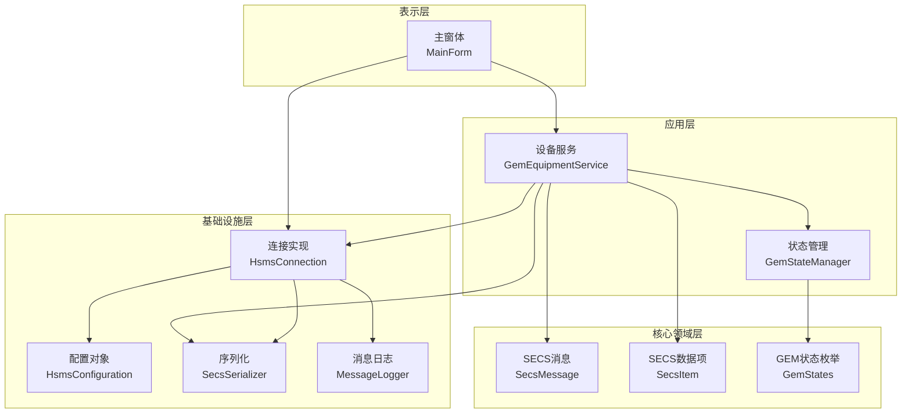
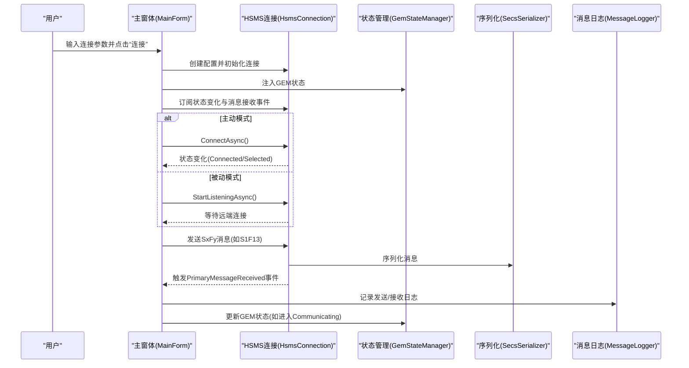
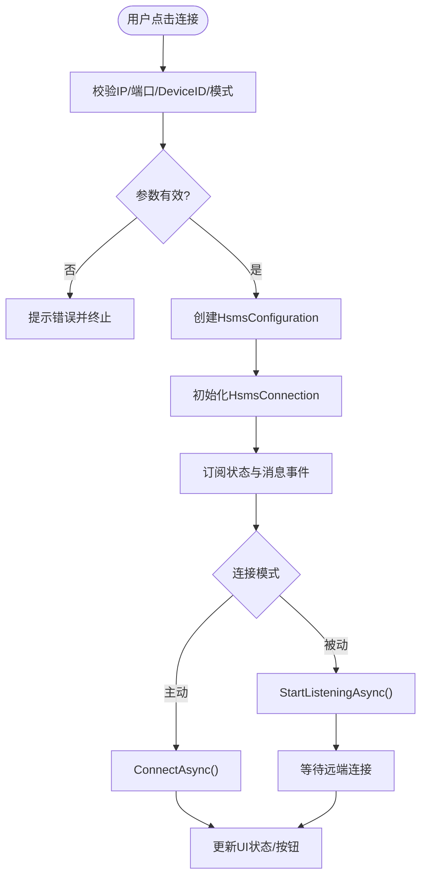
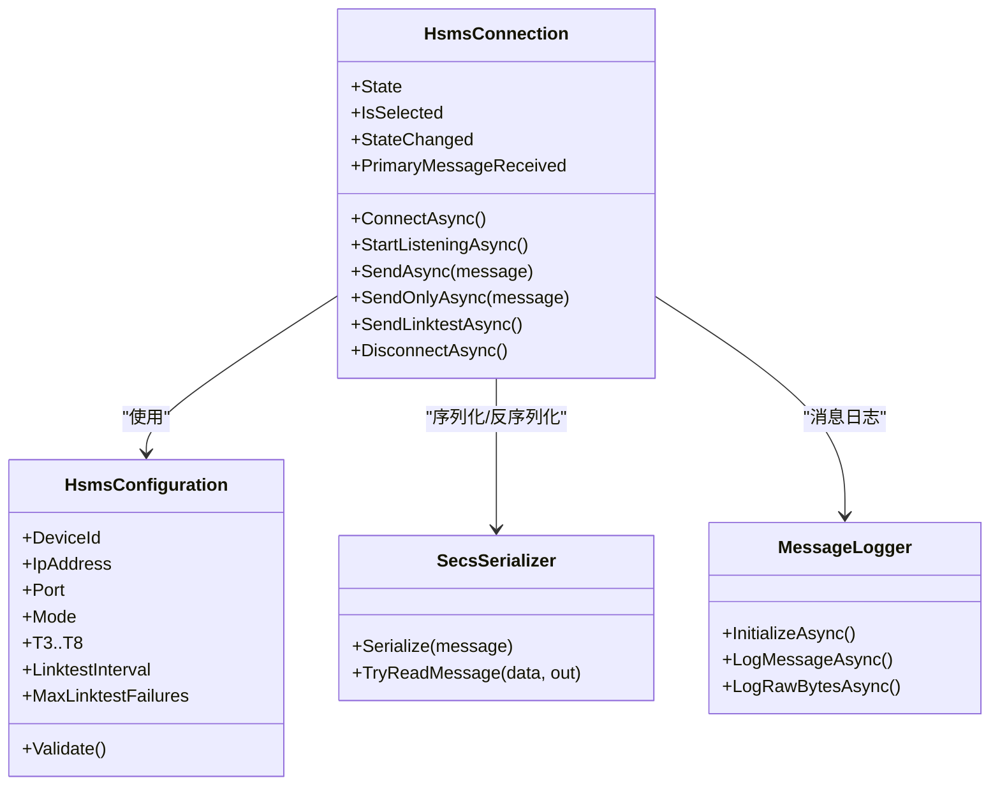
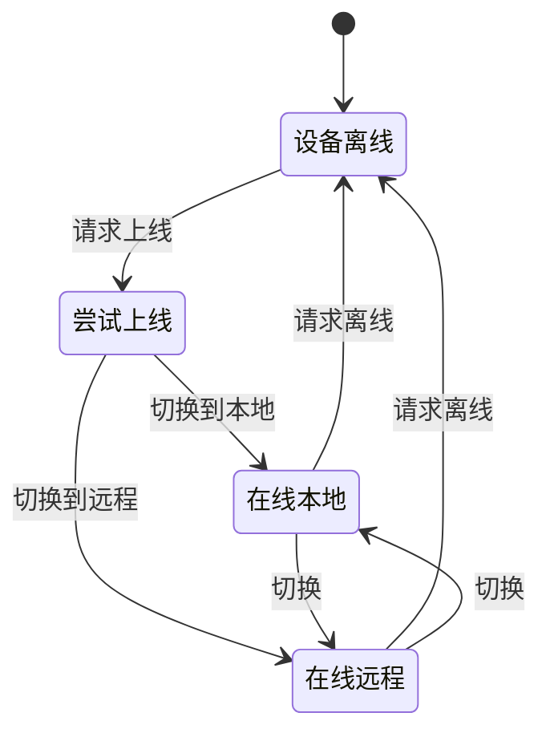
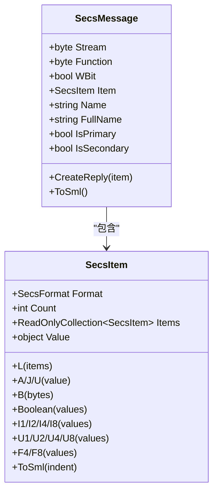
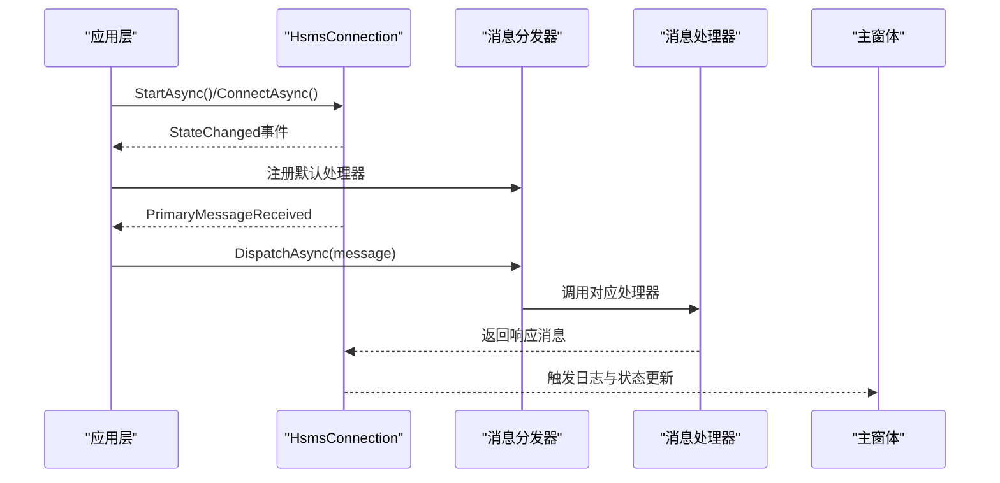
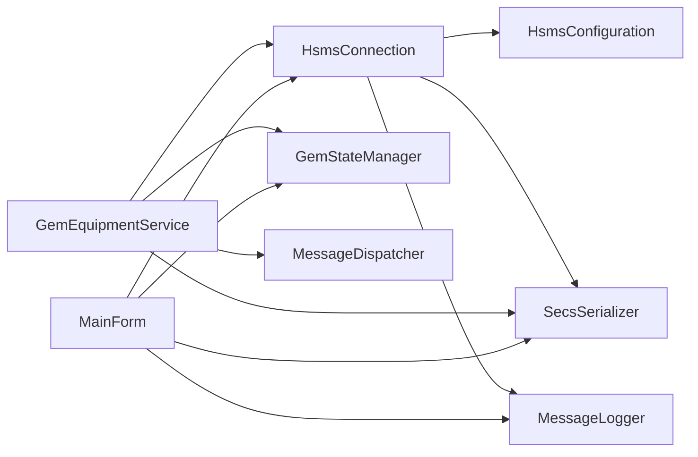

# 设备模拟器集成

<cite>
**本文引用的文件**
- [MainForm.cs](file://WebGem/SECS2GEM.Simulator/MainForm.cs)
- [MainForm.Designer.cs](file://WebGem/SECS2GEM.Simulator/MainForm.Designer.cs)
- [Program.cs](file://WebGem/SECS2GEM.Simulator/Program.cs)
- [GemEquipmentService.cs](file://WebGem/SECS2GEM/Application/Services/GemEquipmentService.cs)
- [HsmsConnection.cs](file://WebGem/SECS2GEM/Infrastructure/Connection/HsmsConnection.cs)
- [HsmsConfiguration.cs](file://WebGem/SECS2GEM/Infrastructure/Configuration/HsmsConfiguration.cs)
- [GemStateManager.cs](file://WebGem/SECS2GEM/Application/State/GemStateManager.cs)
- [SecsMessage.cs](file://WebGem/SECS2GEM/Core/Entities/SecsMessage.cs)
- [SecsItem.cs](file://WebGem/SECS2GEM/Core/Entities/SecsItem.cs)
- [GemStates.cs](file://WebGem/SECS2GEM/Core/Enums/GemStates.cs)
</cite>

## 目录
1. [简介](#简介)
2. [项目结构](#项目结构)
3. [核心组件](#核心组件)
4. [架构总览](#架构总览)
5. [详细组件分析](#详细组件分析)
6. [依赖关系分析](#依赖关系分析)
7. [性能考虑](#性能考虑)
8. [故障排除指南](#故障排除指南)
9. [结论](#结论)
10. [附录](#附录)

## 简介
本文件面向SECS2-GEM设备模拟器的集成与使用，重点覆盖WinForms应用界面设计与功能实现、核心连接与消息处理机制、状态管理与日志记录、配置选项与测试流程，并提供基于模拟器进行SECS-II协议测试与GEM状态验证的操作指南。读者无需深入底层即可高效使用模拟器进行系统集成测试。

## 项目结构
模拟器采用分层架构，主要模块如下：
- 表示层（WinForms）：主窗体负责用户交互、连接配置、消息发送与日志展示。
- 应用层：设备服务封装HSMS连接、消息分发、状态管理与事件聚合。
- 基础设施层：连接管理、序列化、事务管理、消息日志。
- 核心领域层：SECS-II实体（消息、数据项）、枚举（状态、格式）。

**图表来源**
- [MainForm.cs:1-868](file://WebGem/SECS2GEM.Simulator/MainForm.cs#L1-L868)
- [GemEquipmentService.cs:1-456](file://WebGem/SECS2GEM/Application/Services/GemEquipmentService.cs#L1-L456)
- [HsmsConnection.cs:1-906](file://WebGem/SECS2GEM/Infrastructure/Connection/HsmsConnection.cs#L1-L906)
- [HsmsConfiguration.cs:1-266](file://WebGem/SECS2GEM/Infrastructure/Configuration/HsmsConfiguration.cs#L1-L266)
- [GemStateManager.cs:1-492](file://WebGem/SECS2GEM/Application/State/GemStateManager.cs#L1-L492)
- [SecsMessage.cs:1-209](file://WebGem/SECS2GEM/Core/Entities/SecsMessage.cs#L1-L209)
- [SecsItem.cs:1-480](file://WebGem/SECS2GEM/Core/Entities/SecsItem.cs#L1-L480)
- [GemStates.cs:1-176](file://WebGem/SECS2GEM/Core/Enums/GemStates.cs#L1-L176)

**章节来源**
- [MainForm.cs:1-868](file://WebGem/SECS2GEM.Simulator/MainForm.cs#L1-L868)
- [Program.cs:1-19](file://WebGem/SECS2GEM.Simulator/Program.cs#L1-L19)

## 核心组件
- 主窗体（MainForm）
  - 负责连接设置输入、连接/断开控制、消息按钮分组、日志输出与状态显示。
  - 内部组合序列化器、事务管理器、状态管理器与HSMS连接。
- 设备服务（GemEquipmentService）
  - 统一外观入口，整合连接、消息分发、状态管理与事件聚合。
  - 自动注册默认消息处理器，支持事件与报警上报。
- 连接实现（HsmsConnection）
  - 实现HSMS连接生命周期、状态机、消息收发、事务管理与心跳。
- 配置对象（HsmsConfiguration）
  - 提供网络、超时、心跳、缓冲区、消息日志等参数。
- 状态管理（GemStateManager）
  - 管理通信/控制/处理三类状态机与标准状态变量。
- SECS实体（SecsMessage、SecsItem）
  - 封装SECS-II消息与数据项，提供SML格式化与类型安全访问。

**章节来源**
- [MainForm.cs:1-868](file://WebGem/SECS2GEM.Simulator/MainForm.cs#L1-L868)
- [GemEquipmentService.cs:1-456](file://WebGem/SECS2GEM/Application/Services/GemEquipmentService.cs#L1-L456)
- [HsmsConnection.cs:1-906](file://WebGem/SECS2GEM/Infrastructure/Connection/HsmsConnection.cs#L1-L906)
- [HsmsConfiguration.cs:1-266](file://WebGem/SECS2GEM/Infrastructure/Configuration/HsmsConfiguration.cs#L1-L266)
- [GemStateManager.cs:1-492](file://WebGem/SECS2GEM/Application/State/GemStateManager.cs#L1-L492)
- [SecsMessage.cs:1-209](file://WebGem/SECS2GEM/Core/Entities/SecsMessage.cs#L1-L209)
- [SecsItem.cs:1-480](file://WebGem/SECS2GEM/Core/Entities/SecsItem.cs#L1-L480)

## 架构总览
下图展示主窗体与各核心组件的交互关系及数据流向。

**图表来源**
- [MainForm.cs:51-101](file://WebGem/SECS2GEM.Simulator/MainForm.cs#L51-L101)
- [HsmsConnection.cs:146-186](file://WebGem/SECS2GEM/Infrastructure/Connection/HsmsConnection.cs#L146-L186)
- [GemStateManager.cs:196-241](file://WebGem/SECS2GEM/Application/State/GemStateManager.cs#L196-L241)
- [SecsMessage.cs:1-209](file://WebGem/SECS2GEM/Core/Entities/SecsMessage.cs#L1-L209)

## 详细组件分析

### 主窗体界面与交互
- 布局与控件
  - 顶部区域：连接设置组（IP、端口、DeviceID、连接模式、超时与心跳参数）、状态显示、连接/断开按钮。
  - 中部区域：消息按钮分组（S1F1/S1F3/S1F11/S1F13/S1F15/S1F17；S2F13/S2F15/S2F17/S2F29/S2F31/S2F33/S2F35/S2F37/S2F41；其他Stream按钮）。
  - 底部区域：日志组（RichTextBox显示，清空日志按钮）。
  - 状态栏：实时显示连接状态。
- 事件处理
  - 连接/断开：校验参数、创建配置、初始化连接、订阅事件、更新UI状态。
  - 消息发送：构造SecsMessage与SecsItem，调用连接发送，记录日志与格式化输出。
  - 状态更新：根据连接状态变更更新颜色与文本。
- 日志与可视化
  - 支持彩色日志（发送/接收/错误），SML格式化输出，支持清空日志。

**图表来源**
- [MainForm.cs:150-194](file://WebGem/SECS2GEM.Simulator/MainForm.cs#L150-L194)
- [MainForm.cs:51-101](file://WebGem/SECS2GEM.Simulator/MainForm.cs#L51-L101)

**章节来源**
- [MainForm.Designer.cs:1-758](file://WebGem/SECS2GEM.Simulator/MainForm.Designer.cs#L1-L758)
- [MainForm.cs:1-868](file://WebGem/SECS2GEM.Simulator/MainForm.cs#L1-L868)

### 连接与消息处理
- HSMS连接
  - 支持主动/被动模式，自动Select、心跳Linktest、T3/T6/T7/T8超时控制。
  - 使用Channel异步发送队列，ReceiveLoop解析消息，SendLoop发送数据。
  - 记录消息日志，支持原始字节与解析消息两种记录方式。
- 事务管理
  - 为Primary消息创建事务，等待Secondary响应或超时。
- 序列化
  - 将HsmsMessage/SecsMessage序列化为字节流，反序列化解析消息。

**图表来源**
- [HsmsConnection.cs:1-906](file://WebGem/SECS2GEM/Infrastructure/Connection/HsmsConnection.cs#L1-L906)
- [HsmsConfiguration.cs:1-266](file://WebGem/SECS2GEM/Infrastructure/Configuration/HsmsConfiguration.cs#L1-L266)

**章节来源**
- [HsmsConnection.cs:1-906](file://WebGem/SECS2GEM/Infrastructure/Connection/HsmsConnection.cs#L1-L906)
- [HsmsConfiguration.cs:1-266](file://WebGem/SECS2GEM/Infrastructure/Configuration/HsmsConfiguration.cs#L1-L266)

### 状态管理与GEM状态
- 通信状态（Disabled/Enabled/WaitCommunicationRequest/WaitCommunicationDelay/Communicating）
- 控制状态（EquipmentOffline/AttemptOnline/HostOffline/OnlineLocal/OnlineRemote）
- 处理状态（Idle/Setup/Ready/Executing/Paused）
- 标准状态变量（如时钟、控制状态等）

**图表来源**
- [GemStateManager.cs:196-348](file://WebGem/SECS2GEM/Application/State/GemStateManager.cs#L196-L348)
- [GemStates.cs:1-176](file://WebGem/SECS2GEM/Core/Enums/GemStates.cs#L1-L176)

**章节来源**
- [GemStateManager.cs:1-492](file://WebGem/SECS2GEM/Application/State/GemStateManager.cs#L1-L492)
- [GemStates.cs:1-176](file://WebGem/SECS2GEM/Core/Enums/GemStates.cs#L1-L176)

### SECS-II消息与数据项
- SecsMessage：封装Stream/Function/WBit/Item，提供常用工厂方法与SML输出。
- SecsItem：不可变设计，支持List/字符串/二进制/布尔/整数/浮点等格式，提供类型安全访问与SML格式化。

**图表来源**
- [SecsMessage.cs:1-209](file://WebGem/SECS2GEM/Core/Entities/SecsMessage.cs#L1-L209)
- [SecsItem.cs:1-480](file://WebGem/SECS2GEM/Core/Entities/SecsItem.cs#L1-L480)

**章节来源**
- [SecsMessage.cs:1-209](file://WebGem/SECS2GEM/Core/Entities/SecsMessage.cs#L1-L209)
- [SecsItem.cs:1-480](file://WebGem/SECS2GEM/Core/Entities/SecsItem.cs#L1-L480)

### 设备服务（外观模式）
- 统一入口：启动/停止服务、连接监听、消息发送、事件与报警上报。
- 默认处理器：自动注册S1F1/S1F13/S1F15/S1F17、S2F13/15/29/31/33/35/37/41、S5F3/5/7、S6F15/19、S7F1/3/5/17/19、S10F3/5等。
- 状态联动：连接状态变化驱动通信状态，通信状态变化驱动控制状态与上线/离线切换。

**图表来源**
- [GemEquipmentService.cs:135-185](file://WebGem/SECS2GEM/Application/Services/GemEquipmentService.cs#L135-L185)
- [GemEquipmentService.cs:320-358](file://WebGem/SECS2GEM/Application/Services/GemEquipmentService.cs#L320-L358)
- [GemEquipmentService.cs:407-443](file://WebGem/SECS2GEM/Application/Services/GemEquipmentService.cs#L407-L443)

**章节来源**
- [GemEquipmentService.cs:1-456](file://WebGem/SECS2GEM/Application/Services/GemEquipmentService.cs#L1-L456)

## 依赖关系分析
- 组件耦合
  - 主窗体依赖连接、序列化、事务管理、状态管理与日志。
  - 设备服务聚合连接、状态管理、消息分发与事件聚合。
  - 连接实现依赖配置、序列化、事务管理与消息日志。
- 外部依赖
  - .NET System.Net.Sockets、System.Threading.Channels等。
- 循环依赖
  - 未发现循环依赖，职责清晰分层。

**图表来源**
- [MainForm.cs:1-868](file://WebGem/SECS2GEM.Simulator/MainForm.cs#L1-L868)
- [GemEquipmentService.cs:1-456](file://WebGem/SECS2GEM/Application/Services/GemEquipmentService.cs#L1-L456)
- [HsmsConnection.cs:1-906](file://WebGem/SECS2GEM/Infrastructure/Connection/HsmsConnection.cs#L1-L906)

**章节来源**
- [MainForm.cs:1-868](file://WebGem/SECS2GEM.Simulator/MainForm.cs#L1-L868)
- [GemEquipmentService.cs:1-456](file://WebGem/SECS2GEM/Application/Services/GemEquipmentService.cs#L1-L456)
- [HsmsConnection.cs:1-906](file://WebGem/SECS2GEM/Infrastructure/Connection/HsmsConnection.cs#L1-L906)

## 性能考虑
- 异步与并发
  - 使用Channel实现发送队列，ReceiveLoop与SendLoop并行，提升吞吐。
  - 心跳任务独立运行，失败累计阈值避免无效重试。
- 缓冲区与消息大小
  - 可配置接收/发送缓冲区与最大消息大小，避免内存压力。
- 序列化与日志
  - 仅在启用时记录消息日志，减少IO开销；SML格式化用于调试，生产环境建议关闭。

[本节为通用指导，无需特定文件引用]

## 故障排除指南
- 连接失败
  - 检查IP/端口/DeviceID有效性；确认防火墙与网络可达。
  - 主动模式需确保目标服务器开放端口；被动模式需确认监听端口正确。
- 无法发送消息
  - 确认连接状态为Selected/Connected；S1F13建立通信后方可发送S2Fxx等消息。
  - 查看日志中发送/接收记录与SML格式化输出定位问题。
- 心跳失败断开
  - 调整T7/T8与心跳间隔；检查网络质量与中间设备。
- UI无响应
  - 确保事件回调在UI线程更新；主窗体内部已处理Invoke，若自定义扩展需注意线程切换。

**章节来源**
- [MainForm.cs:90-100](file://WebGem/SECS2GEM.Simulator/MainForm.cs#L90-L100)
- [HsmsConnection.cs:280-296](file://WebGem/SECS2GEM/Infrastructure/Connection/HsmsConnection.cs#L280-L296)
- [HsmsConnection.cs:693-723](file://WebGem/SECS2GEM/Infrastructure/Connection/HsmsConnection.cs#L693-L723)

## 结论
该模拟器以WinForms提供直观的SECS-II/GEM测试界面，结合完善的连接、消息、状态与日志能力，能够高效验证HSMS通信与GEM状态流转。通过合理配置与规范测试流程，可快速完成系统集成测试与协议一致性验证。

[本节为总结，无需特定文件引用]

## 附录

### 配置选项与使用方法
- 连接设置
  - IP地址、端口、DeviceID、连接模式（主动/被动）、T3/T5/T6/T7/T8、心跳间隔。
- 使用步骤
  - 在“连接设置”填写参数，选择模式，点击“连接”。
  - 在“Stream 1/2/其他Stream”组中选择消息按钮发送测试消息。
  - 在“通信日志”查看SML格式化输出与原始字节。
  - 点击“断开”结束测试。

**章节来源**
- [MainForm.Designer.cs:160-353](file://WebGem/SECS2GEM.Simulator/MainForm.Designer.cs#L160-L353)
- [HsmsConfiguration.cs:1-266](file://WebGem/SECS2GEM/Infrastructure/Configuration/HsmsConfiguration.cs#L1-L266)

### 测试流程示例
- 建立连接
  - 主动模式：填写远端IP与端口，点击“连接”，等待状态变为“已选择/已连接”。
  - 被动模式：填写本地IP与端口，点击“连接”，等待远端发起连接。
- 发送S1F13建立通信
  - 在“Stream 1”组点击“S1F13”，观察响应与状态变化。
- 发送S2F13/S2F15/S2F33/S2F35/S2F37/S2F41
  - 在“Stream 2”组选择相应按钮，验证响应与状态变量/设备常量变化。
- 验证GEM状态
  - 通过状态栏颜色与日志输出判断当前状态（Enabled/Communicating等）。
- 清理与断开
  - 使用“断开”按钮结束测试，恢复UI至初始状态。

**章节来源**
- [MainForm.cs:196-376](file://WebGem/SECS2GEM.Simulator/MainForm.cs#L196-L376)
- [GemStateManager.cs:196-241](file://WebGem/SECS2GEM/Application/State/GemStateManager.cs#L196-L241)