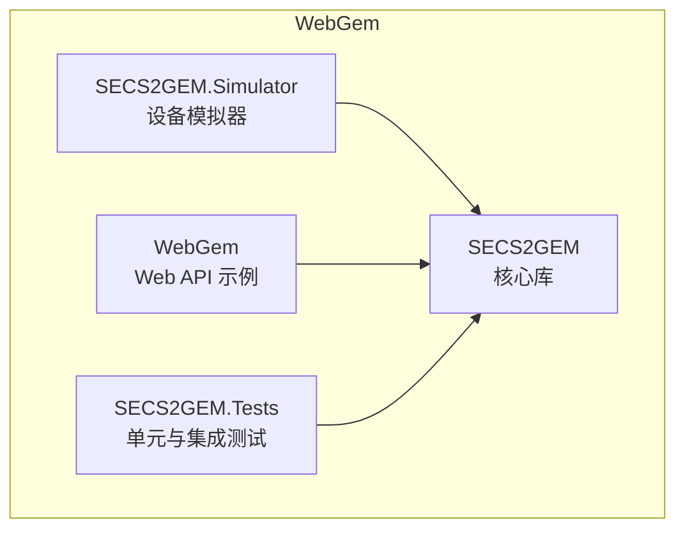
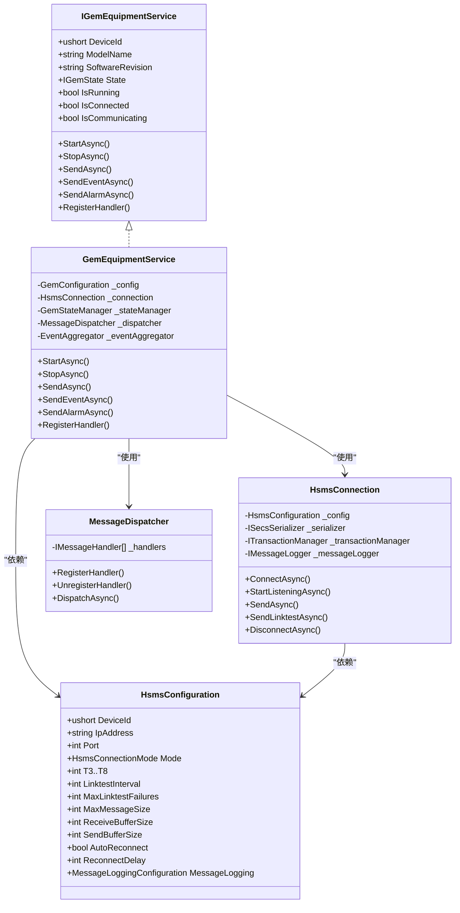
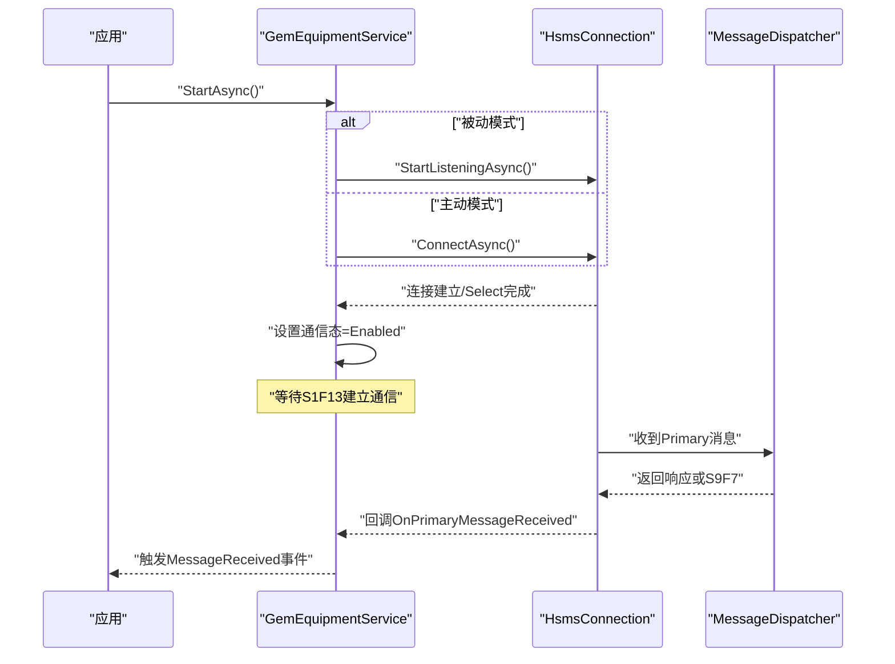
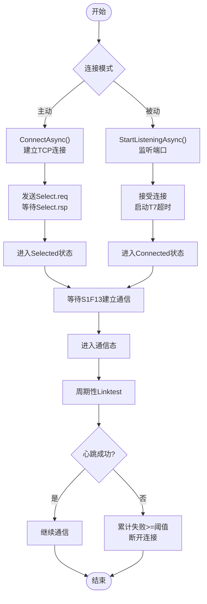
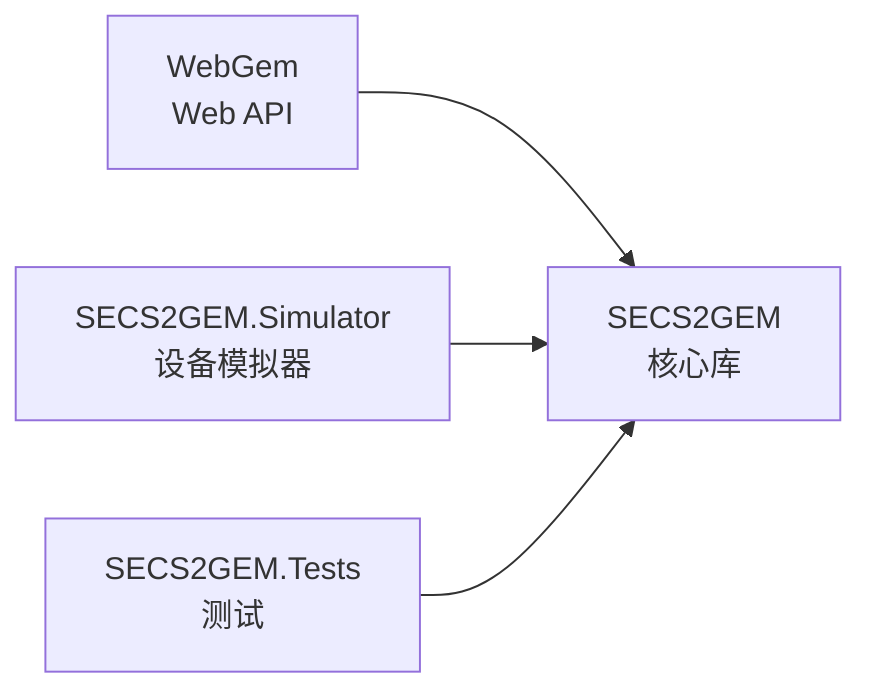

# 快速开始

<cite>
**本文引用的文件**
- [README.md](file://README.md)
- [SECS2GEM.csproj](file://WebGem/SECS2GEM/SECS2GEM.csproj)
- [SECS2GEM.Simulator.csproj](file://WebGem/SECS2GEM.Simulator/SECS2GEM.Simulator.csproj)
- [Program.cs（WebGem）](file://WebGem/WebGem/Program.cs)
- [Program.cs（Simulator）](file://WebGem/SECS2GEM.Simulator/Program.cs)
- [GemEquipmentService.cs](file://WebGem/SECS2GEM/Application/Services/GemEquipmentService.cs)
- [HsmsConnection.cs](file://WebGem/SECS2GEM/Infrastructure/Connection/HsmsConnection.cs)
- [HsmsConfiguration.cs](file://WebGem/SECS2GEM/Infrastructure/Configuration/HsmsConfiguration.cs)
- [MessageDispatcher.cs](file://WebGem/SECS2GEM/Application/Messaging/MessageDispatcher.cs)
- [IGemEquipmentService.cs](file://WebGem/SECS2GEM/Domain/Interfaces/IGemEquipmentService.cs)
- [IntegrationTests.cs](file://WebGem/SECS2GEM.Tests/IntegrationTests.cs)
</cite>

## 目录
1. [简介](#简介)
2. [项目结构](#项目结构)
3. [核心组件](#核心组件)
4. [架构总览](#架构总览)
5. [详细组件分析](#详细组件分析)
6. [依赖关系分析](#依赖关系分析)
7. [性能注意事项](#性能注意事项)
8. [故障排除指南](#故障排除指南)
9. [结论](#结论)
10. [附录](#附录)

## 简介
本指南面向首次接触 SECS2-GEM 的开发者，帮助你在约 30 分钟内完成环境准备、项目构建与运行，并掌握如何启动 Web API 应用与设备模拟器，以及如何初始化 GemEquipmentService、建立 HSMS 连接与处理基础消息。文档同时提供常见配置项与启动参数说明，以及常见问题排查建议。

## 项目结构
该项目采用多项目解决方案组织，核心模块位于 WebGem/SECS2GEM，包含应用层、基础设施层、领域层与测试层；另有 WebGem.Web 作为最小化的 ASP.NET Core Web API 示例；SECS2GEM.Simulator 是基于 Windows Forms 的设备模拟器。

图示来源
- [SECS2GEM.csproj:1-10](file://WebGem/SECS2GEM/SECS2GEM.csproj#L1-L10)
- [SECS2GEM.Simulator.csproj:1-15](file://WebGem/SECS2GEM.Simulator/SECS2GEM.Simulator.csproj#L1-L15)
- [Program.cs（WebGem）:1-24](file://WebGem/WebGem/Program.cs#L1-L24)
- [Program.cs（Simulator）:1-19](file://WebGem/SECS2GEM.Simulator/Program.cs#L1-L19)

章节来源
- [README.md:1-1](file://README.md#L1-L1)
- [SECS2GEM.csproj:1-10](file://WebGem/SECS2GEM/SECS2GEM.csproj#L1-L10)
- [SECS2GEM.Simulator.csproj:1-15](file://WebGem/SECS2GEM.Simulator/SECS2GEM.Simulator.csproj#L1-L15)
- [Program.cs（WebGem）:1-24](file://WebGem/WebGem/Program.cs#L1-L24)
- [Program.cs（Simulator）:1-19](file://WebGem/SECS2GEM.Simulator/Program.cs#L1-L19)

## 核心组件
- 设备服务（GemEquipmentService）：对外统一入口，负责生命周期管理、消息分发、事件与报警上报、状态机联动等。
- HSMS 连接（HsmsConnection）：封装 TCP、HSMS 协议、事务管理、心跳与超时控制。
- 消息分发器（MessageDispatcher）：责任链+策略模式，按优先级匹配处理器并生成响应或 S9F7。
- 配置（HsmsConfiguration）：集中管理网络、超时、心跳、缓冲区、自动重连等参数。
- 接口（IGemEquipmentService）：定义设备服务对外契约，便于替换实现与测试。

章节来源
- [GemEquipmentService.cs:1-456](file://WebGem/SECS2GEM/Application/Services/GemEquipmentService.cs#L1-L456)
- [HsmsConnection.cs:1-906](file://WebGem/SECS2GEM/Infrastructure/Connection/HsmsConnection.cs#L1-L906)
- [MessageDispatcher.cs:1-123](file://WebGem/SECS2GEM/Application/Messaging/MessageDispatcher.cs#L1-L123)
- [HsmsConfiguration.cs:1-266](file://WebGem/SECS2GEM/Infrastructure/Configuration/HsmsConfiguration.cs#L1-L266)
- [IGemEquipmentService.cs:1-160](file://WebGem/SECS2GEM/Domain/Interfaces/IGemEquipmentService.cs#L1-L160)

## 架构总览
下图展示了设备服务、连接层、消息分发与配置之间的交互关系，以及默认处理器注册与消息处理流程。

图示来源
- [IGemEquipmentService.cs:1-160](file://WebGem/SECS2GEM/Domain/Interfaces/IGemEquipmentService.cs#L1-L160)
- [GemEquipmentService.cs:1-456](file://WebGem/SECS2GEM/Application/Services/GemEquipmentService.cs#L1-L456)
- [HsmsConnection.cs:1-906](file://WebGem/SECS2GEM/Infrastructure/Connection/HsmsConnection.cs#L1-L906)
- [MessageDispatcher.cs:1-123](file://WebGem/SECS2GEM/Application/Messaging/MessageDispatcher.cs#L1-L123)
- [HsmsConfiguration.cs:1-266](file://WebGem/SECS2GEM/Infrastructure/Configuration/HsmsConfiguration.cs#L1-L266)

## 详细组件分析

### 设备服务（GemEquipmentService）
- 角色定位：外观模式，整合连接、状态、分发与事件聚合，向上提供统一 API。
- 生命周期：StartAsync/StopAsync，内部根据配置决定主动连接或被动监听；自动注册默认处理器。
- 消息处理：通过 MessageDispatcher 分发至具体处理器，必要时构造 S9F7 响应。
- 事件与报警：支持事件报告（S6F11）与报警（S5F1）上报，并发布领域事件。
- 自动上线：在进入通信态后可按配置自动请求 Online 并切换 Local/Remote。

图示来源
- [GemEquipmentService.cs:137-184](file://WebGem/SECS2GEM/Application/Services/GemEquipmentService.cs#L137-L184)
- [HsmsConnection.cs:146-186](file://WebGem/SECS2GEM/Infrastructure/Connection/HsmsConnection.cs#L146-L186)
- [MessageDispatcher.cs:67-91](file://WebGem/SECS2GEM/Application/Messaging/MessageDispatcher.cs#L67-L91)

章节来源
- [GemEquipmentService.cs:1-456](file://WebGem/SECS2GEM/Application/Services/GemEquipmentService.cs#L1-L456)

### HSMS 连接（HsmsConnection）
- 连接模式：支持 Active（主动发起）与 Passive（被动监听），分别对应不同的握手流程。
- 事务管理：为 W-位消息创建事务，等待 Secondary 响应并在超时后清理。
- 心跳与超时：周期性 Linktest，T7 超时监控，失败累计达到阈值自动断开。
- 日志：可选消息日志记录，便于调试与审计。
- 发送队列：基于 Channel 的异步发送队列，保证有序可靠发送。

图示来源
- [HsmsConnection.cs:146-296](file://WebGem/SECS2GEM/Infrastructure/Connection/HsmsConnection.cs#L146-L296)
- [HsmsConnection.cs:547-725](file://WebGem/SECS2GEM/Infrastructure/Connection/HsmsConnection.cs#L547-L725)

章节来源
- [HsmsConnection.cs:1-906](file://WebGem/SECS2GEM/Infrastructure/Connection/HsmsConnection.cs#L1-L906)

### 消息分发器（MessageDispatcher）
- 责任链+策略：维护处理器列表，按优先级排序，首个 CanHandle 的处理器即被委派处理。
- 无处理器匹配：对 W-位消息返回 S9F7（含原始消息头），非 W-位消息直接忽略。
- 动态注册：支持运行时注册/注销处理器，便于扩展。

章节来源
- [MessageDispatcher.cs:1-123](file://WebGem/SECS2GEM/Application/Messaging/MessageDispatcher.cs#L1-L123)

### 配置（HsmsConfiguration）
- 网络参数：DeviceId、IpAddress、Port、Mode（Active/Passive）。
- 超时参数：T3（回复超时）、T5（分离超时）、T6（控制事务）、T7（未选择超时）、T8（字符间隔）。
- 心跳参数：LinktestInterval、MaxLinktestFailures。
- 缓冲区与大小：MaxMessageSize、ReceiveBufferSize、SendBufferSize。
- 自动重连：AutoReconnect、ReconnectDelay。
- 消息日志：MessageLogging。

章节来源
- [HsmsConfiguration.cs:1-266](file://WebGem/SECS2GEM/Infrastructure/Configuration/HsmsConfiguration.cs#L1-L266)

### 接口（IGemEquipmentService）
- 对外契约：统一的设备服务 API，包含生命周期、消息发送、事件与报警、状态查询与事件订阅。
- 便于替换与测试：通过接口抽象，可在上层以不同实现进行替换或注入。

章节来源
- [IGemEquipmentService.cs:1-160](file://WebGem/SECS2GEM/Domain/Interfaces/IGemEquipmentService.cs#L1-L160)

## 依赖关系分析
- WebGem 项目引用 SECS2GEM 核心库，提供最小化 Web API 示例。
- Simulator 项目同样引用 SECS2GEM，作为设备侧演示。
- 测试项目依赖核心库，验证端到端通信流程。

图示来源
- [SECS2GEM.Simulator.csproj:11-13](file://WebGem/SECS2GEM.Simulator/SECS2GEM.Simulator.csproj#L11-L13)
- [Program.cs（WebGem）:1-24](file://WebGem/WebGem/Program.cs#L1-L24)
- [Program.cs（Simulator）:1-19](file://WebGem/SECS2GEM.Simulator/Program.cs#L1-L19)

章节来源
- [SECS2GEM.Simulator.csproj:1-15](file://WebGem/SECS2GEM.Simulator/SECS2GEM.Simulator.csproj#L1-L15)
- [Program.cs（WebGem）:1-24](file://WebGem/WebGem/Program.cs#L1-L24)
- [Program.cs（Simulator）:1-19](file://WebGem/SECS2GEM.Simulator/Program.cs#L1-L19)

## 性能注意事项
- 缓冲区大小：合理设置 ReceiveBufferSize/SendBufferSize，避免频繁系统调用与内存拷贝。
- 心跳频率：LinktestInterval 过短会增加网络与 CPU 压力，过长可能导致误判断线。
- 超时参数：T3/T6/T7 应结合网络状况与业务需求调整，避免过短导致误超时或过长影响恢复速度。
- 消息大小：MaxMessageSize 限制过大可能占用较多内存，需平衡吞吐与稳定性。
- 日志级别：生产环境建议降低消息日志频率或关闭，避免 I/O 成为瓶颈。

## 故障排除指南
- 无法启动设备服务
  - 检查配置端口与模式是否正确，确认防火墙放行。
  - 若为被动模式，确认 StartListeningAsync 已调用且监听地址与端口可用。
  - 参考：[HsmsConnection.cs:191-213](file://WebGem/SECS2GEM/Infrastructure/Connection/HsmsConnection.cs#L191-L213)
- 连接建立后无响应
  - 确认已发送 Select.req 并等待 Select.rsp；若 T7 超时，连接会被断开。
  - 参考：[HsmsConnection.cs:280-296](file://WebGem/SECS2GEM/Infrastructure/Connection/HsmsConnection.cs#L280-L296)
- 发送消息无响应
  - 对于 W-位消息，需等待对应响应；检查 T3 超时设置。
  - 参考：[HsmsConnection.cs:427-453](file://WebGem/SECS2GEM/Infrastructure/Connection/HsmsConnection.cs#L427-L453)
- 心跳失败频繁
  - 检查 LinktestInterval 与 MaxLinktestFailures；网络抖动或高负载可能导致失败。
  - 参考：[HsmsConnection.cs:693-723](file://WebGem/SECS2GEM/Infrastructure/Connection/HsmsConnection.cs#L693-L723)
- 无法看到消息日志
  - 确认 MessageLogging 已启用，查看日志输出目录。
  - 参考：[HsmsConfiguration.cs:129-131](file://WebGem/SECS2GEM/Infrastructure/Configuration/HsmsConfiguration.cs#L129-L131)
- Web API 无法访问
  - 确认开发环境已映射 OpenAPI；检查 HTTPS 重定向与授权中间件。
  - 参考：[Program.cs（WebGem）:12-21](file://WebGem/WebGem/Program.cs#L12-L21)
- 设备模拟器无法运行
  - 确保 .NET 9.0 Windows 桌面 SDK 已安装；以管理员权限运行可能有助于端口访问。
  - 参考：[SECS2GEM.Simulator.csproj:1-15](file://WebGem/SECS2GEM.Simulator/SECS2GEM.Simulator.csproj#L1-L15)

章节来源
- [HsmsConnection.cs:146-296](file://WebGem/SECS2GEM/Infrastructure/Connection/HsmsConnection.cs#L146-L296)
- [HsmsConnection.cs:427-500](file://WebGem/SECS2GEM/Infrastructure/Connection/HsmsConnection.cs#L427-L500)
- [HsmsConnection.cs:693-723](file://WebGem/SECS2GEM/Infrastructure/Connection/HsmsConnection.cs#L693-L723)
- [HsmsConfiguration.cs:129-131](file://WebGem/SECS2GEM/Infrastructure/Configuration/HsmsConfiguration.cs#L129-L131)
- [Program.cs（WebGem）:12-21](file://WebGem/WebGem/Program.cs#L12-L21)
- [SECS2GEM.Simulator.csproj:1-15](file://WebGem/SECS2GEM.Simulator/SECS2GEM.Simulator.csproj#L1-L15)

## 结论
通过本指南，你可以在 30 分钟内完成环境准备、项目构建与运行，启动 Web API 与设备模拟器，并成功初始化 GemEquipmentService、建立 HSMS 连接、处理基础消息。建议在实际部署前根据网络与业务场景调整超时、心跳与缓冲区参数，并开启必要的日志以便排障。

## 附录

### 安装与构建步骤
- 环境要求
  - .NET 9.0 SDK（含桌面开发工具包，用于 Simulator）
  - Windows（Simulator 为 WinForms 应用）
- 克隆与构建
  - 使用 .NET CLI 在根目录执行构建，或在 IDE 中打开解决方案进行构建。
  - 核心库 TargetFramework 为 net9.0。
- 运行 Web API
  - 在 WebGem/WebGem 目录下运行 dotnet run，或在 IDE 中启动。
- 运行设备模拟器
  - 在 WebGem/SECS2GEM.Simulator 目录下运行 dotnet run，或在 IDE 中启动。

章节来源
- [SECS2GEM.csproj:1-10](file://WebGem/SECS2GEM/SECS2GEM.csproj#L1-L10)
- [SECS2GEM.Simulator.csproj:1-15](file://WebGem/SECS2GEM.Simulator/SECS2GEM.Simulator.csproj#L1-L15)
- [Program.cs（WebGem）:1-24](file://WebGem/WebGem/Program.cs#L1-L24)
- [Program.cs（Simulator）:1-19](file://WebGem/SECS2GEM.Simulator/Program.cs#L1-L19)

### 基本使用示例（路径指引）
- 初始化 GemEquipmentService
  - 使用 GemConfiguration（包含 Hsms、ModelName、SoftwareRevision、InitialControlState、AutoOnline、InitialRemoteMode）创建服务实例。
  - 参考：[GemEquipmentService.cs:110-133](file://WebGem/SECS2GEM/Application/Services/GemEquipmentService.cs#L110-L133)，[HsmsConfiguration.cs:233-264](file://WebGem/SECS2GEM/Infrastructure/Configuration/HsmsConfiguration.cs#L233-L264)
- 启动服务
  - 调用 StartAsync，根据配置决定主动连接或被动监听。
  - 参考：[GemEquipmentService.cs:140-158](file://WebGem/SECS2GEM/Application/Services/GemEquipmentService.cs#L140-L158)
- 建立 HSMS 连接
  - 主动模式：ConnectAsync；被动模式：StartListeningAsync；随后等待 Select.req 并进入 Selected。
  - 参考：[HsmsConnection.cs:146-186](file://WebGem/SECS2GEM/Infrastructure/Connection/HsmsConnection.cs#L146-L186)，[HsmsConnection.cs:191-213](file://WebGem/SECS2GEM/Infrastructure/Connection/HsmsConnection.cs#L191-L213)
- 处理基础消息
  - 默认处理器已注册，可处理 S1F1/S1F13/S1F15/S1F17、S2F13/S2F15/S2F29/S2F33/S2F35/S2F37/S2F41、S5F3/S5F5/S5F7、S6F15/S6F19、S7F1/S7F3/S7F5/S7F17/S7F19、S10F3/S10F5。
  - 参考：[GemEquipmentService.cs:407-443](file://WebGem/SECS2GEM/Application/Services/GemEquipmentService.cs#L407-L443)
- 发送事件报告与报警
  - 使用 SendEventAsync 与 SendAlarmAsync；ClearAlarmAsync 可清除报警。
  - 参考：[GemEquipmentService.cs:211-316](file://WebGem/SECS2GEM/Application/Services/GemEquipmentService.cs#L211-L316)
- 集成测试参考
  - 可参考 IntegrationTests 中的连接、Select、S1F1、S1F13、Linktest 流程。
  - 参考：[IntegrationTests.cs:14-194](file://WebGem/SECS2GEM.Tests/IntegrationTests.cs#L14-L194)

章节来源
- [GemEquipmentService.cs:110-133](file://WebGem/SECS2GEM/Application/Services/GemEquipmentService.cs#L110-L133)
- [GemEquipmentService.cs:407-443](file://WebGem/SECS2GEM/Application/Services/GemEquipmentService.cs#L407-L443)
- [HsmsConnection.cs:146-186](file://WebGem/SECS2GEM/Infrastructure/Connection/HsmsConnection.cs#L146-L186)
- [HsmsConnection.cs:191-213](file://WebGem/SECS2GEM/Infrastructure/Connection/HsmsConnection.cs#L191-L213)
- [IntegrationTests.cs:14-194](file://WebGem/SECS2GEM.Tests/IntegrationTests.cs#L14-L194)

### 常见配置选项与启动参数
- HsmsConfiguration
  - DeviceId：设备标识（会话ID）
  - IpAddress/Port：IP 与端口
  - Mode：Active 或 Passive
  - T3/T5/T6/T7/T8：超时参数（秒）
  - LinktestInterval/MaxLinktestFailures：心跳与失败阈值
  - MaxMessageSize/ReceiveBufferSize/SendBufferSize：消息大小与缓冲区
  - AutoReconnect/ReconnectDelay：自动重连与延迟
  - MessageLogging：消息日志配置
- GemConfiguration
  - ModelName/SoftwareRevision：设备型号与软件版本
  - InitialControlState：初始控制状态
  - AutoOnline/InitialRemoteMode：自动上线与初始在线模式

章节来源
- [HsmsConfiguration.cs:15-266](file://WebGem/SECS2GEM/Infrastructure/Configuration/HsmsConfiguration.cs#L15-L266)