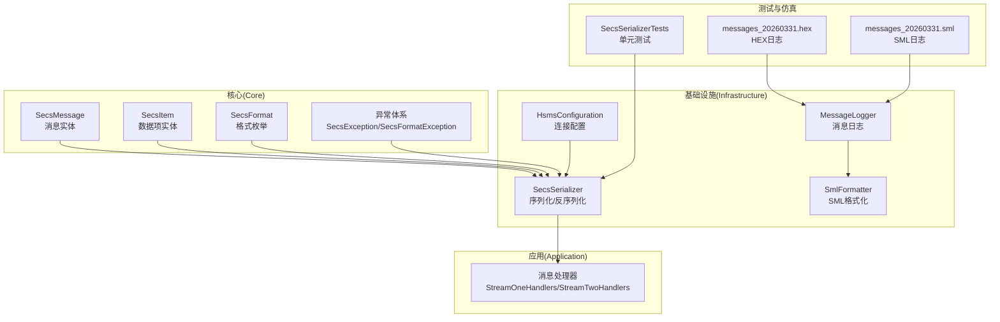
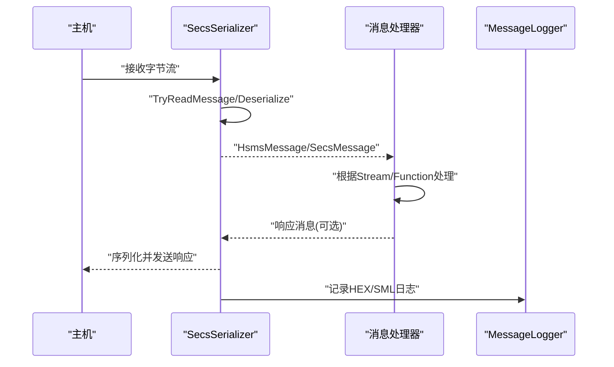
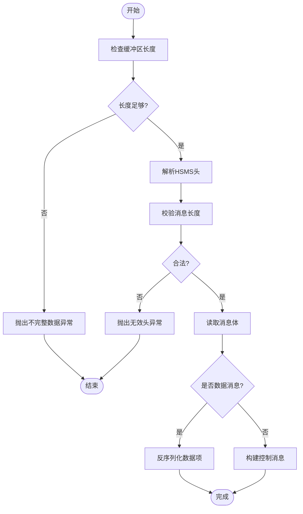
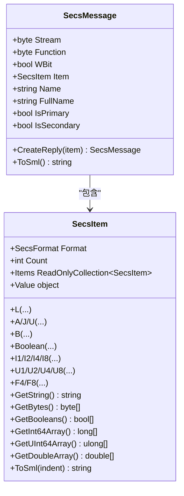
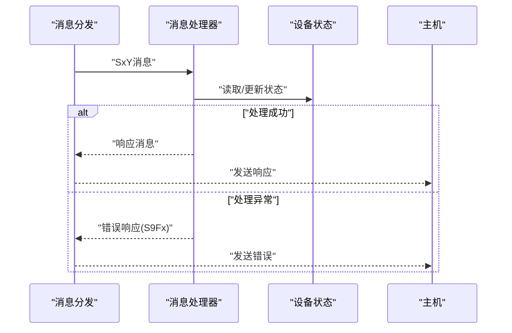
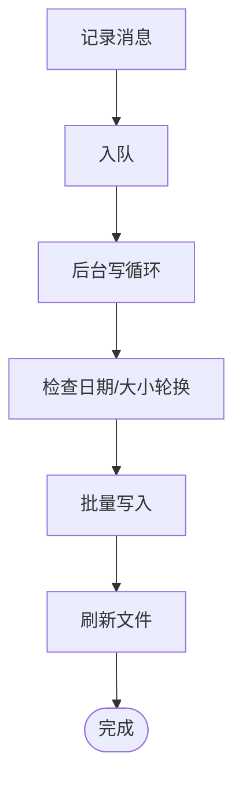
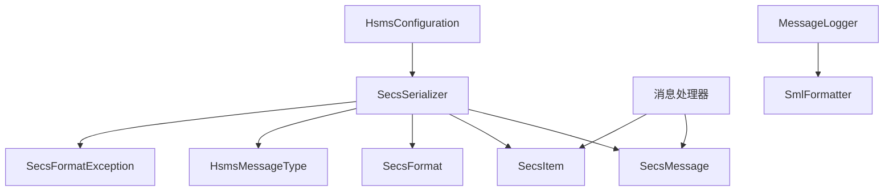

# 协议问题

<cite>
**本文引用的文件**
- [SecsFormatException.cs](file://WebGem/SECS2GEM/Core/Exceptions/SecsFormatException.cs)
- [SecsException.cs](file://WebGem/SECS2GEM/Core/Exceptions/SecsException.cs)
- [SecsSerializer.cs](file://WebGem/SECS2GEM/Infrastructure/Serialization/SecsSerializer.cs)
- [SecsMessage.cs](file://WebGem/SECS2GEM/Core/Entities/SecsMessage.cs)
- [SecsItem.cs](file://WebGem/SECS2GEM/Core/Entities/SecsItem.cs)
- [SecsFormat.cs](file://WebGem/SECS2GEM/Core/Enums/SecsFormat.cs)
- [HsmsMessageType.cs](file://WebGem/SECS2GEM/Core/Enums/HsmsMessageType.cs)
- [StreamOneHandlers.cs](file://WebGem/SECS2GEM/Application/Handlers/StreamOneHandlers.cs)
- [StreamTwoHandlers.cs](file://WebGem/SECS2GEM/Application/Handlers/StreamTwoHandlers.cs)
- [MessageLogger.cs](file://WebGem/SECS2GEM/Infrastructure/Logging/MessageLogger.cs)
- [SmlFormatter.cs](file://WebGem/SECS2GEM/Infrastructure/Logging/SmlFormatter.cs)
- [SecsSerializerTests.cs](file://WebGem/SECS2GEM.Tests/SecsSerializerTests.cs)
- [HsmsConfiguration.cs](file://WebGem/SECS2GEM/Infrastructure/Configuration/HsmsConfiguration.cs)
- [messages_20260331.hex](file://WebGem/SECS2GEM.Simulator/bin/Debug/net9.0-windows/logs/127_0_0_1-5000-0/messages_20260331.hex)
- [messages_20260331.sml](file://WebGem/SECS2GEM.Simulator/bin/Debug/net9.0-windows/logs/127_0_0_1-5000-0/messages_20260331.sml)
</cite>

## 目录
1. [简介](#简介)
2. [项目结构](#项目结构)
3. [核心组件](#核心组件)
4. [架构总览](#架构总览)
5. [详细组件分析](#详细组件分析)
6. [依赖关系分析](#依赖关系分析)
7. [性能考量](#性能考量)
8. [故障排除指南](#故障排除指南)
9. [结论](#结论)
10. [附录](#附录)

## 简介
本指南聚焦于SECS2GEM协议相关的“协议问题”故障排除，覆盖以下主题：
- SECS消息格式错误与异常处理（SecsFormatException）
- 协议解析失败的定位与修复
- 数据项不匹配与类型不一致的诊断
- 消息序列化与反序列化的调试技巧
- 不同Stream/Function类型的处理差异与常见错误
- 协议版本兼容性问题的识别与解决
- 消息格式验证与协议一致性检查方法

本指南以代码为依据，结合日志与仿真器输出，帮助开发者快速定位并解决问题。

## 项目结构
SECS2GEM采用分层架构，核心模块包括：
- Core：实体与异常、枚举（SECS消息、数据项、格式、异常）
- Infrastructure：序列化、日志、配置
- Application：消息处理器（按Stream分类）
- Tests：单元测试（覆盖序列化往返与TryReadMessage）
- Simulator：日志输出（HEX/SML），便于问题复现与分析

图示来源
- [SecsMessage.cs:18-209](file://WebGem/SECS2GEM/Core/Entities/SecsMessage.cs#L18-L209)
- [SecsItem.cs:23-480](file://WebGem/SECS2GEM/Core/Entities/SecsItem.cs#L23-L480)
- [SecsFormat.cs:13-112](file://WebGem/SECS2GEM/Core/Enums/SecsFormat.cs#L13-L112)
- [SecsFormatException.cs:56-185](file://WebGem/SECS2GEM/Core/Exceptions/SecsFormatException.cs#L56-L185)
- [SecsSerializer.cs:27-662](file://WebGem/SECS2GEM/Infrastructure/Serialization/SecsSerializer.cs#L27-L662)
- [MessageLogger.cs:23-438](file://WebGem/SECS2GEM/Infrastructure/Logging/MessageLogger.cs#L23-L438)
- [SmlFormatter.cs:23-322](file://WebGem/SECS2GEM/Infrastructure/Logging/SmlFormatter.cs#L23-L322)
- [HsmsConfiguration.cs:15-266](file://WebGem/SECS2GEM/Infrastructure/Configuration/HsmsConfiguration.cs#L15-L266)
- [StreamOneHandlers.cs:20-211](file://WebGem/SECS2GEM/Application/Handlers/StreamOneHandlers.cs#L20-L211)
- [StreamTwoHandlers.cs:13-331](file://WebGem/SECS2GEM/Application/Handlers/StreamTwoHandlers.cs#L13-L331)
- [SecsSerializerTests.cs:10-296](file://WebGem/SECS2GEM.Tests/SecsSerializerTests.cs#L10-L296)
- [messages_20260331.hex:39-567](file://WebGem/SECS2GEM.Simulator/bin/Debug/net9.0-windows/logs/127_0_0_1-5000-0/messages_20260331.hex#L39-L567)
- [messages_20260331.sml:68-144](file://WebGem/SECS2GEM.Simulator/bin/Debug/net9.0-windows/logs/127_0_0_1-5000-0/messages_20260331.sml#L68-L144)

章节来源
- [SecsMessage.cs:18-209](file://WebGem/SECS2GEM/Core/Entities/SecsMessage.cs#L18-L209)
- [SecsItem.cs:23-480](file://WebGem/SECS2GEM/Core/Entities/SecsItem.cs#L23-L480)
- [SecsSerializer.cs:27-662](file://WebGem/SECS2GEM/Infrastructure/Serialization/SecsSerializer.cs#L27-L662)
- [MessageLogger.cs:23-438](file://WebGem/SECS2GEM/Infrastructure/Logging/MessageLogger.cs#L23-L438)
- [SmlFormatter.cs:23-322](file://WebGem/SECS2GEM/Infrastructure/Logging/SmlFormatter.cs#L23-L322)
- [HsmsConfiguration.cs:15-266](file://WebGem/SECS2GEM/Infrastructure/Configuration/HsmsConfiguration.cs#L15-L266)
- [StreamOneHandlers.cs:20-211](file://WebGem/SECS2GEM/Application/Handlers/StreamOneHandlers.cs#L20-L211)
- [StreamTwoHandlers.cs:13-331](file://WebGem/SECS2GEM/Application/Handlers/StreamTwoHandlers.cs#L13-L331)
- [SecsSerializerTests.cs:10-296](file://WebGem/SECS2GEM.Tests/SecsSerializerTests.cs#L10-L296)
- [messages_20260331.hex:39-567](file://WebGem/SECS2GEM.Simulator/bin/Debug/net9.0-windows/logs/127_0_0_1-5000-0/messages_20260331.hex#L39-L567)
- [messages_20260331.sml:68-144](file://WebGem/SECS2GEM.Simulator/bin/Debug/net9.0-windows/logs/127_0_0_1-5000-0/messages_20260331.sml#L68-L144)

## 核心组件
- SecsMessage：封装Stream/Function/W-Bit与数据项，提供工厂方法与响应消息生成
- SecsItem：不可变SECS-II数据项，支持递归结构与多格式值访问
- SecsFormat：SECS-II格式枚举（List/Binary/Boolean/ASCII/JIS8/Unicode/I1/I2/I4/I8/F4/F8/U1/U2/U4/U8）
- SecsSerializer：HSMS消息与SECS-II数据项的序列化/反序列化实现，含TryReadMessage
- SecsFormatException：协议格式异常，携带错误类型、位置、期望/实际值
- MessageLogger/SmlFormatter：消息日志（HEX/SML）与格式化工具
- 消息处理器：按Stream分类（S1/S2等）处理消息并生成响应

章节来源
- [SecsMessage.cs:18-209](file://WebGem/SECS2GEM/Core/Entities/SecsMessage.cs#L18-L209)
- [SecsItem.cs:23-480](file://WebGem/SECS2GEM/Core/Entities/SecsItem.cs#L23-L480)
- [SecsFormat.cs:13-112](file://WebGem/SECS2GEM/Core/Enums/SecsFormat.cs#L13-L112)
- [SecsSerializer.cs:27-662](file://WebGem/SECS2GEM/Infrastructure/Serialization/SecsSerializer.cs#L27-L662)
- [SecsFormatException.cs:56-185](file://WebGem/SECS2GEM/Core/Exceptions/SecsFormatException.cs#L56-L185)
- [MessageLogger.cs:23-438](file://WebGem/SECS2GEM/Infrastructure/Logging/MessageLogger.cs#L23-L438)
- [SmlFormatter.cs:23-322](file://WebGem/SECS2GEM/Infrastructure/Logging/SmlFormatter.cs#L23-L322)
- [StreamOneHandlers.cs:20-211](file://WebGem/SECS2GEM/Application/Handlers/StreamOneHandlers.cs#L20-L211)
- [StreamTwoHandlers.cs:13-331](file://WebGem/SECS2GEM/Application/Handlers/StreamTwoHandlers.cs#L13-L331)

## 架构总览
下图展示SECS消息从接收、解析、路由到响应的关键交互：

图示来源
- [SecsSerializer.cs:93-177](file://WebGem/SECS2GEM/Infrastructure/Serialization/SecsSerializer.cs#L93-L177)
- [StreamOneHandlers.cs:48-86](file://WebGem/SECS2GEM/Application/Handlers/StreamOneHandlers.cs#L48-L86)
- [StreamTwoHandlers.cs:18-57](file://WebGem/SECS2GEM/Application/Handlers/StreamTwoHandlers.cs#L18-L57)
- [MessageLogger.cs:99-114](file://WebGem/SECS2GEM/Infrastructure/Logging/MessageLogger.cs#L99-L114)

## 详细组件分析

### 组件A：消息序列化与反序列化（SecsSerializer）
- 功能要点
  - 序列化：计算数据项大小、写入格式字节与长度字节、按大端序写入数据
  - 反序列化：解析格式字节与长度字节、递归读取子项或原始数据
  - TryReadMessage：从缓冲区尝试读取完整消息，支持不完整数据场景
- 关键异常
  - 不完整数据：长度不足或数据项不完整
  - 无效头：消息长度小于头部或超出最大值
  - 无效格式码：未知或不支持的格式
- 调试建议
  - 使用SML日志查看消息结构
  - 使用HEX日志核对格式字节与长度字节
  - 在反序列化路径增加断点，观察位置与期望/实际值

图示来源
- [SecsSerializer.cs:139-177](file://WebGem/SECS2GEM/Infrastructure/Serialization/SecsSerializer.cs#L139-L177)
- [SecsSerializer.cs:420-477](file://WebGem/SECS2GEM/Infrastructure/Serialization/SecsSerializer.cs#L420-L477)

章节来源
- [SecsSerializer.cs:27-662](file://WebGem/SECS2GEM/Infrastructure/Serialization/SecsSerializer.cs#L27-L662)
- [SecsSerializerTests.cs:260-295](file://WebGem/SECS2GEM.Tests/SecsSerializerTests.cs#L260-L295)
- [SmlFormatter.cs:28-54](file://WebGem/SECS2GEM/Infrastructure/Logging/SmlFormatter.cs#L28-L54)

### 组件B：消息实体与数据项（SecsMessage/SecsItem）
- SecsMessage
  - 封装Stream/Function/W-Bit与数据项
  - 工厂方法：S1F1/S1F2/S1F13/S1F14/S9Fx等
  - 响应生成：CreateReply
- SecsItem
  - 不可变设计，支持递归List
  - 多格式值访问：字符串/字节/布尔/整数/浮点
  - SML格式化输出

图示来源
- [SecsMessage.cs:18-209](file://WebGem/SECS2GEM/Core/Entities/SecsMessage.cs#L18-L209)
- [SecsItem.cs:23-480](file://WebGem/SECS2GEM/Core/Entities/SecsItem.cs#L23-L480)

章节来源
- [SecsMessage.cs:18-209](file://WebGem/SECS2GEM/Core/Entities/SecsMessage.cs#L18-L209)
- [SecsItem.cs:23-480](file://WebGem/SECS2GEM/Core/Entities/SecsItem.cs#L23-L480)
- [SecsFormat.cs:13-112](file://WebGem/SECS2GEM/Core/Enums/SecsFormat.cs#L13-L112)

### 组件C：消息处理器（按Stream分类）
- S1F1/S1F13/S1F15/S1F17：设备状态与在线/离线控制
- S2F13/S2F15/S2F29/S2F33/S2F35/S2F37/S2F41：设备常量、报告、事件与远程命令
- 统一异常处理：捕获异常并按需返回S9F7错误响应

图示来源
- [StreamOneHandlers.cs:48-86](file://WebGem/SECS2GEM/Application/Handlers/StreamOneHandlers.cs#L48-L86)
- [StreamTwoHandlers.cs:18-57](file://WebGem/SECS2GEM/Application/Handlers/StreamTwoHandlers.cs#L18-L57)

章节来源
- [StreamOneHandlers.cs:20-211](file://WebGem/SECS2GEM/Application/Handlers/StreamOneHandlers.cs#L20-L211)
- [StreamTwoHandlers.cs:13-331](file://WebGem/SECS2GEM/Application/Handlers/StreamTwoHandlers.cs#L13-L331)

### 组件D：日志与格式化（MessageLogger/SmlFormatter）
- MessageLogger：异步写入，支持按日期/大小轮换，记录HEX与SML
- SmlFormatter：SML文本格式化，便于人类阅读与对比

图示来源
- [MessageLogger.cs:176-223](file://WebGem/SECS2GEM/Infrastructure/Logging/MessageLogger.cs#L176-L223)
- [SmlFormatter.cs:28-54](file://WebGem/SECS2GEM/Infrastructure/Logging/SmlFormatter.cs#L28-L54)

章节来源
- [MessageLogger.cs:23-438](file://WebGem/SECS2GEM/Infrastructure/Logging/MessageLogger.cs#L23-L438)
- [SmlFormatter.cs:23-322](file://WebGem/SECS2GEM/Infrastructure/Logging/SmlFormatter.cs#L23-L322)

## 依赖关系分析
- 序列化器依赖：实体（SecsMessage/SecsItem）、枚举（SecsFormat/HsmsMessageType）、异常（SecsFormatException）
- 处理器依赖：消息实体、领域模型接口、上下文
- 日志依赖：SML格式化器与配置

图示来源
- [SecsSerializer.cs:27-662](file://WebGem/SECS2GEM/Infrastructure/Serialization/SecsSerializer.cs#L27-L662)
- [StreamOneHandlers.cs:20-211](file://WebGem/SECS2GEM/Application/Handlers/StreamOneHandlers.cs#L20-L211)
- [StreamTwoHandlers.cs:13-331](file://WebGem/SECS2GEM/Application/Handlers/StreamTwoHandlers.cs#L13-L331)
- [MessageLogger.cs:23-438](file://WebGem/SECS2GEM/Infrastructure/Logging/MessageLogger.cs#L23-L438)
- [SmlFormatter.cs:23-322](file://WebGem/SECS2GEM/Infrastructure/Logging/SmlFormatter.cs#L23-L322)
- [HsmsConfiguration.cs:15-266](file://WebGem/SECS2GEM/Infrastructure/Configuration/HsmsConfiguration.cs#L15-L266)

章节来源
- [SecsSerializer.cs:27-662](file://WebGem/SECS2GEM/Infrastructure/Serialization/SecsSerializer.cs#L27-L662)
- [StreamOneHandlers.cs:20-211](file://WebGem/SECS2GEM/Application/Handlers/StreamOneHandlers.cs#L20-L211)
- [StreamTwoHandlers.cs:13-331](file://WebGem/SECS2GEM/Application/Handlers/StreamTwoHandlers.cs#L13-L331)
- [MessageLogger.cs:23-438](file://WebGem/SECS2GEM/Infrastructure/Logging/MessageLogger.cs#L23-L438)
- [SmlFormatter.cs:23-322](file://WebGem/SECS2GEM/Infrastructure/Logging/SmlFormatter.cs#L23-L322)
- [HsmsConfiguration.cs:15-266](file://WebGem/SECS2GEM/Infrastructure/Configuration/HsmsConfiguration.cs#L15-L266)

## 性能考量
- 缓冲区与批量写入：日志采用异步队列与批量写入，降低阻塞
- 大端序与直接内存拷贝：序列化/反序列化使用Span与大端序原语，提升吞吐
- 最大消息大小限制：防止异常/恶意消息导致内存压力
- 建议
  - 合理设置MaxMessageSize与缓冲区大小
  - 使用SML/HEX日志辅助定位热点消息与异常结构

章节来源
- [MessageLogger.cs:176-223](file://WebGem/SECS2GEM/Infrastructure/Logging/MessageLogger.cs#L176-L223)
- [SecsSerializer.cs:42-42](file://WebGem/SECS2GEM/Infrastructure/Serialization/SecsSerializer.cs#L42-L42)
- [HsmsConfiguration.cs:99-102](file://WebGem/SECS2GEM/Infrastructure/Configuration/HsmsConfiguration.cs#L99-L102)

## 故障排除指南

### 1. SECS消息格式错误（SecsFormatException）
- 常见类型
  - 无效格式码：格式字节不被识别
  - 无效长度字节数/长度不匹配：格式字节低2位与长度字节不一致
  - 数据不完整：缓冲区不足以解析完整数据项
  - 无效Stream/Function：超出范围或为保留值
  - 无效消息结构/HSMS头：消息长度非法或小于头部
- 诊断步骤
  - 查看异常的ErrorType与Position
  - 结合SML/HEX日志定位格式字节与长度字节
  - 使用单元测试用例核对格式码与长度字节组合
- 预防措施
  - 在序列化前校验数据项结构与格式
  - 在反序列化前检查缓冲区完整性
  - 使用TryReadMessage逐步读取，避免一次性解析整个缓冲区

章节来源
- [SecsFormatException.cs:6-47](file://WebGem/SECS2GEM/Core/Exceptions/SecsFormatException.cs#L6-L47)
- [SecsFormatException.cs:128-182](file://WebGem/SECS2GEM/Core/Exceptions/SecsFormatException.cs#L128-L182)
- [SecsSerializer.cs:420-477](file://WebGem/SECS2GEM/Infrastructure/Serialization/SecsSerializer.cs#L420-L477)
- [SecsSerializerTests.cs:10-296](file://WebGem/SECS2GEM.Tests/SecsSerializerTests.cs#L10-L296)

### 2. 协议解析失败
- 现象
  - TryReadMessage返回false且consumed为0
  - 反序列化抛出不完整数据异常
- 排查
  - 检查网络层是否正确拼接帧
  - 使用HEX日志核对消息长度字段与头部
  - 确认消息长度字段与消息体长度一致
- 修复
  - 在接收侧累积缓冲区，直到满足消息长度
  - 使用TryReadMessage循环解析

章节来源
- [SecsSerializer.cs:139-177](file://WebGem/SECS2GEM/Infrastructure/Serialization/SecsSerializer.cs#L139-L177)
- [SecsSerializerTests.cs:262-292](file://WebGem/SECS2GEM.Tests/SecsSerializerTests.cs#L262-L292)
- [messages_20260331.hex:39-567](file://WebGem/SECS2GEM.Simulator/bin/Debug/net9.0-windows/logs/127_0_0_1-5000-0/messages_20260331.hex#L39-L567)

### 3. 数据项不匹配与类型不一致
- 现象
  - 反序列化后访问值抛出类型不匹配异常
  - SML显示格式与预期不符
- 排查
  - 对比SML输出与期望结构
  - 核对格式字节（高6位）与长度字节（低2位）
  - 检查大端序数据读取顺序
- 修复
  - 在构造数据项时使用正确的静态工厂方法
  - 明确数据项的Count与Items访问约束

章节来源
- [SecsItem.cs:270-389](file://WebGem/SECS2GEM/Core/Entities/SecsItem.cs#L270-L389)
- [SecsItem.cs:448-476](file://WebGem/SECS2GEM/Core/Entities/SecsItem.cs#L448-L476)
- [SmlFormatter.cs:143-169](file://WebGem/SECS2GEM/Infrastructure/Logging/SmlFormatter.cs#L143-L169)
- [SecsSerializerTests.cs:104-157](file://WebGem/SECS2GEM.Tests/SecsSerializerTests.cs#L104-L157)

### 4. 消息序列化与反序列化调试技巧
- 使用SML日志快速定位结构问题
- 使用HEX日志核对格式字节与长度字节
- 在反序列化路径打印位置与期望/实际值
- 使用单元测试覆盖边界条件（空列表、大端序、嵌套结构）

章节来源
- [SmlFormatter.cs:28-54](file://WebGem/SECS2GEM/Infrastructure/Logging/SmlFormatter.cs#L28-L54)
- [SmlFormatter.cs:258-319](file://WebGem/SECS2GEM/Infrastructure/Logging/SmlFormatter.cs#L258-L319)
- [SecsSerializerTests.cs:10-296](file://WebGem/SECS2GEM.Tests/SecsSerializerTests.cs#L10-L296)

### 5. 不同Stream/Function类型的处理差异与常见错误
- S1F1/S1F2：Are You There与On-Line Data；注意Function奇偶与W-Bit
- S1F13/S1F14：Establish Communications；注意COMMACK与设备信息
- S2F13/S2F15：设备常量查询与设置；注意ECID与ECV类型映射
- 常见错误
  - 非Primary消息创建响应
  - Function与Stream范围错误
  - 响应消息未设置W-Bit为false
- 修复
  - 使用SecsMessage工厂方法与CreateReply
  - 在处理器中严格校验消息属性

章节来源
- [SecsMessage.cs:106-119](file://WebGem/SECS2GEM/Core/Entities/SecsMessage.cs#L106-L119)
- [StreamOneHandlers.cs:94-114](file://WebGem/SECS2GEM/Application/Handlers/StreamOneHandlers.cs#L94-L114)
- [StreamOneHandlers.cs:122-149](file://WebGem/SECS2GEM/Application/Handlers/StreamOneHandlers.cs#L122-L149)
- [StreamTwoHandlers.cs:13-78](file://WebGem/SECS2GEM/Application/Handlers/StreamTwoHandlers.cs#L13-L78)

### 6. 协议版本兼容性问题
- HSMS消息类型（HsmsMessageType）用于区分数据消息与控制消息
- 配置参数（T3/T6/T7等）影响握手与超时行为
- 建议
  - 明确双方HSMS实现与超时参数
  - 在日志中记录消息类型与系统字节，便于对齐

章节来源
- [HsmsMessageType.cs:10-67](file://WebGem/SECS2GEM/Core/Enums/HsmsMessageType.cs#L10-L67)
- [HsmsConfiguration.cs:39-94](file://WebGem/SECS2GEM/Infrastructure/Configuration/HsmsConfiguration.cs#L39-L94)
- [messages_20260331.sml:68-144](file://WebGem/SECS2GEM.Simulator/bin/Debug/net9.0-windows/logs/127_0_0_1-5000-0/messages_20260331.sml#L68-L144)

### 7. 消息格式验证与协议一致性检查
- 格式验证
  - 校验格式字节高6位与低2位组合合法性
  - 校验长度字段与数据项长度一致性
- 一致性检查
  - 使用单元测试覆盖往返序列化（Serialize/Deserialize）
  - 使用SML/Simulator日志交叉验证

章节来源
- [SecsSerializerTests.cs:16-296](file://WebGem/SECS2GEM.Tests/SecsSerializerTests.cs#L16-L296)
- [messages_20260331.sml:68-144](file://WebGem/SECS2GEM.Simulator/bin/Debug/net9.0-windows/logs/127_0_0_1-5000-0/messages_20260331.sml#L68-L144)

## 结论
- 通过异常类型与位置信息快速定位格式错误
- 使用SML/HEX日志与单元测试形成闭环验证
- 严格遵循Stream/Function与W-Bit规则，避免响应消息错误
- 合理配置超时与消息大小，保障稳定性与兼容性

## 附录
- 关键文件清单
  - 异常与实体：[SecsFormatException.cs:56-185](file://WebGem/SECS2GEM/Core/Exceptions/SecsFormatException.cs#L56-L185)、[SecsMessage.cs:18-209](file://WebGem/SECS2GEM/Core/Entities/SecsMessage.cs#L18-L209)、[SecsItem.cs:23-480](file://WebGem/SECS2GEM/Core/Entities/SecsItem.cs#L23-L480)
  - 序列化与日志：[SecsSerializer.cs:27-662](file://WebGem/SECS2GEM/Infrastructure/Serialization/SecsSerializer.cs#L27-L662)、[MessageLogger.cs:23-438](file://WebGem/SECS2GEM/Infrastructure/Logging/MessageLogger.cs#L23-L438)、[SmlFormatter.cs:23-322](file://WebGem/SECS2GEM/Infrastructure/Logging/SmlFormatter.cs#L23-L322)
  - 处理器与配置：[StreamOneHandlers.cs:20-211](file://WebGem/SECS2GEM/Application/Handlers/StreamOneHandlers.cs#L20-L211)、[StreamTwoHandlers.cs:13-331](file://WebGem/SECS2GEM/Application/Handlers/StreamTwoHandlers.cs#L13-L331)、[HsmsConfiguration.cs:15-266](file://WebGem/SECS2GEM/Infrastructure/Configuration/HsmsConfiguration.cs#L15-L266)
  - 测试与仿真：[SecsSerializerTests.cs:10-296](file://WebGem/SECS2GEM.Tests/SecsSerializerTests.cs#L10-L296)、[messages_20260331.hex:39-567](file://WebGem/SECS2GEM.Simulator/bin/Debug/net9.0-windows/logs/127_0_0_1-5000-0/messages_20260331.hex#L39-L567)、[messages_20260331.sml:68-144](file://WebGem/SECS2GEM.Simulator/bin/Debug/net9.0-windows/logs/127_0_0_1-5000-0/messages_20260331.sml#L68-L144)