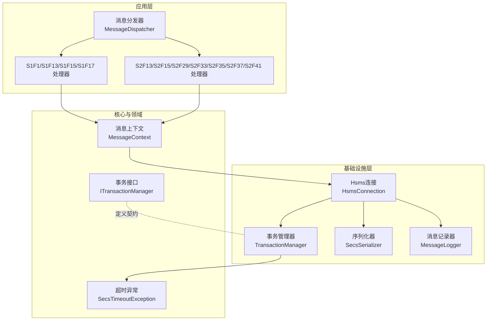
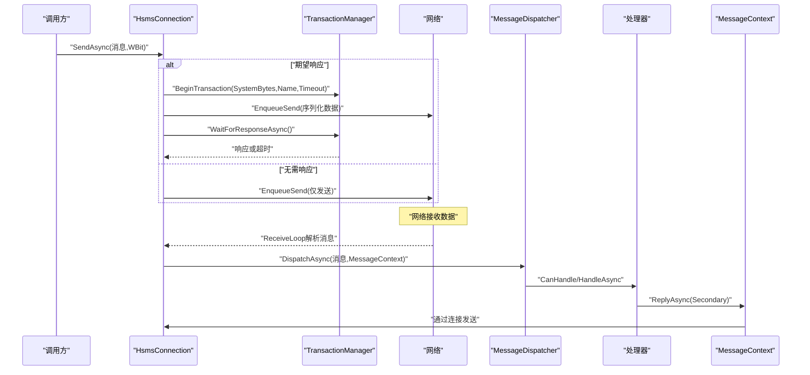
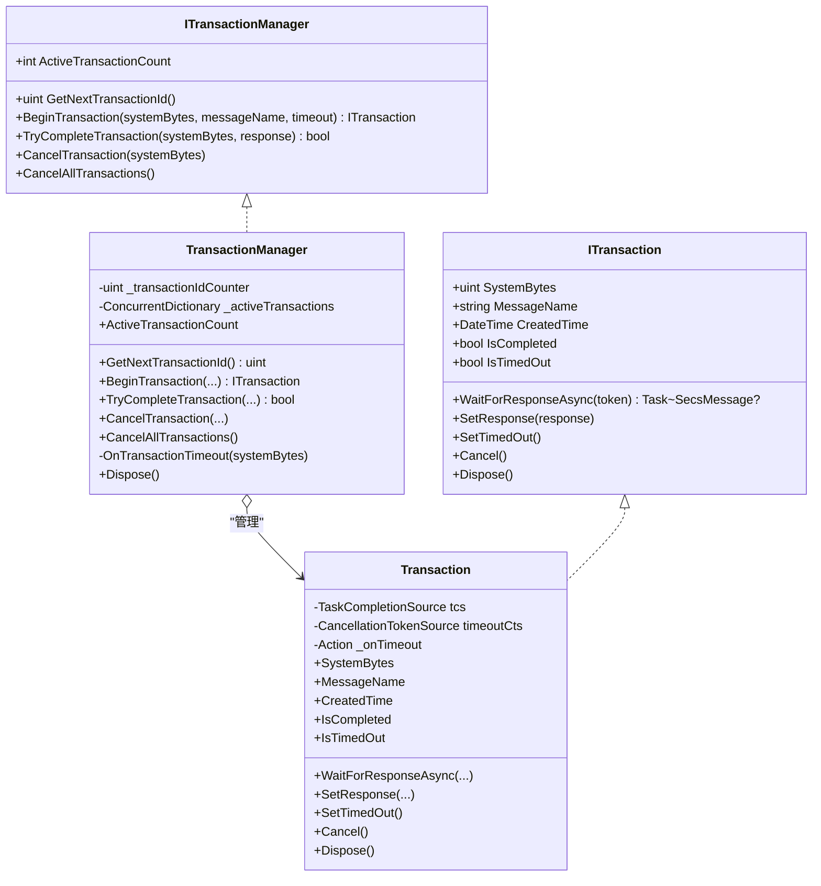
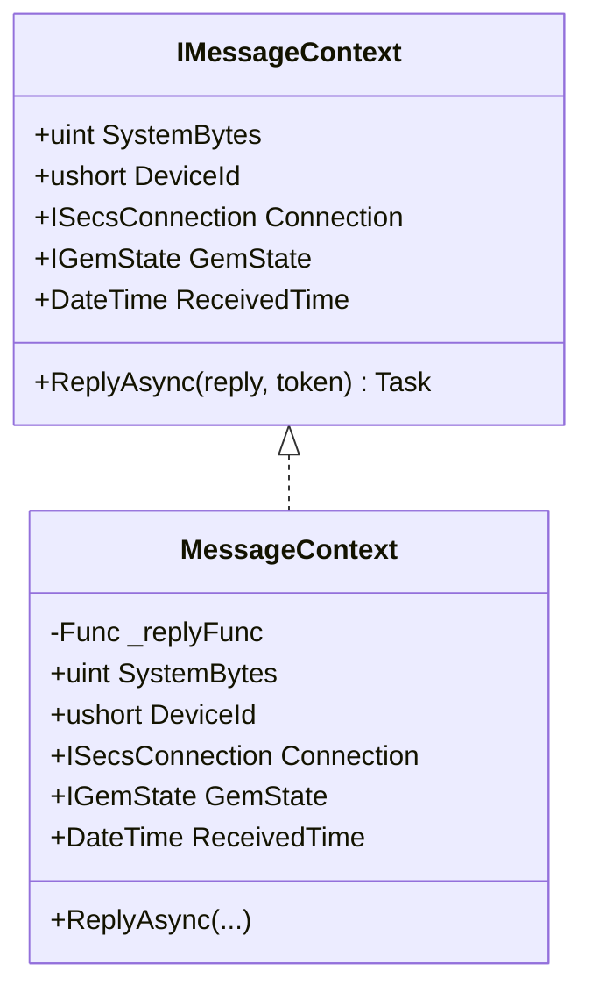
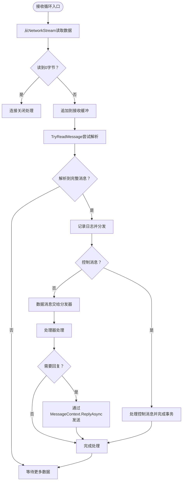
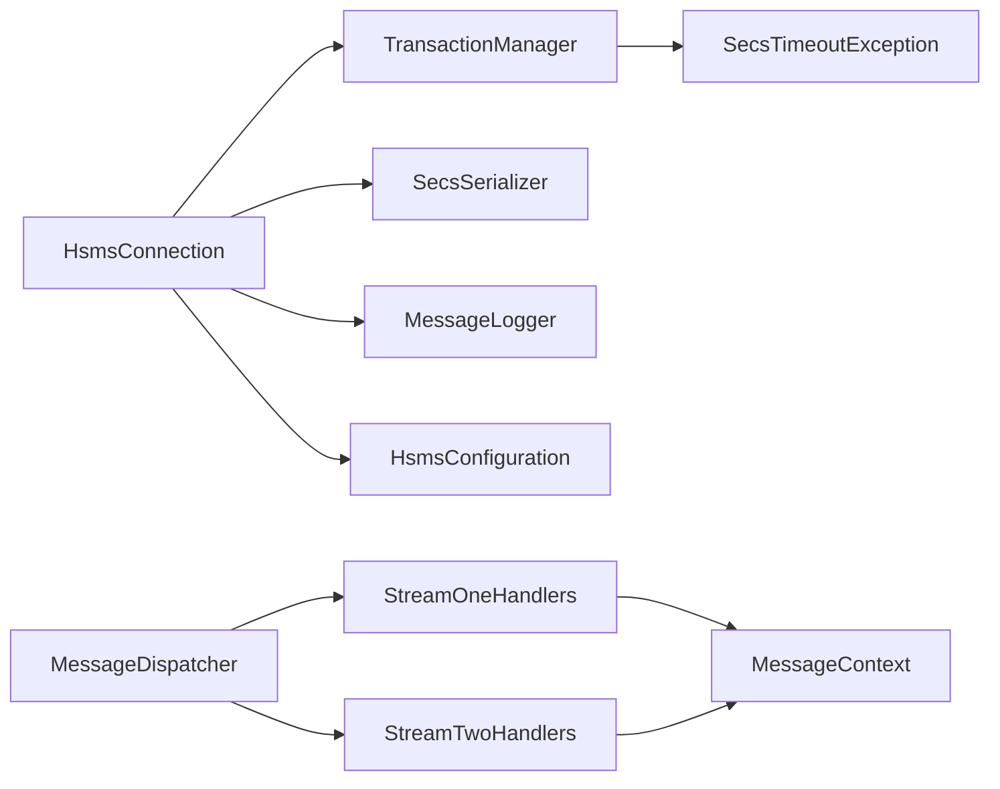

# 性能问题

<cite>
**本文引用的文件**   
- [SecsTimeoutException.cs](file://WebGem/SECS2GEM/Core/Exceptions/SecsTimeoutException.cs)
- [TransactionManager.cs](file://WebGem/SECS2GEM/Infrastructure/Services/TransactionManager.cs)
- [ITransactionManager.cs](file://WebGem/SECS2GEM/Domain/Interfaces/ITransactionManager.cs)
- [MessageContext.cs](file://WebGem/SECS2GEM/Infrastructure/Connection/MessageContext.cs)
- [HsmsConnection.cs](file://WebGem/SECS2GEM/Infrastructure/Connection/HsmsConnection.cs)
- [HsmsConfiguration.cs](file://WebGem/SECS2GEM/Infrastructure/Configuration/HsmsConfiguration.cs)
- [SecsSerializer.cs](file://WebGem/SECS2GEM/Infrastructure/Serialization/SecsSerializer.cs)
- [MessageDispatcher.cs](file://WebGem/SECS2GEM/Application/Messaging/MessageDispatcher.cs)
- [StreamOneHandlers.cs](file://WebGem/SECS2GEM/Application/Handlers/StreamOneHandlers.cs)
- [StreamTwoHandlers.cs](file://WebGem/SECS2GEM/Application/Handlers/StreamTwoHandlers.cs)
- [MessageLogger.cs](file://WebGem/SECS2GEM/Infrastructure/Logging/MessageLogger.cs)
- [IMessageLogger.cs](file://WebGem/SECS2GEM/Infrastructure/Logging/IMessageLogger.cs)
- [IntegrationTests.cs](file://WebGem/SECS2GEM.Tests/IntegrationTests.cs)
</cite>

## 目录
1. [简介](#简介)
2. [项目结构](#项目结构)
3. [核心组件](#核心组件)
4. [架构总览](#架构总览)
5. [详细组件分析](#详细组件分析)
6. [依赖关系分析](#依赖关系分析)
7. [性能考量](#性能考量)
8. [故障排除指南](#故障排除指南)
9. [结论](#结论)
10. [附录](#附录)

## 简介
本指南聚焦于SECS2GEM在实际运行中可能遇到的性能问题，特别是与超时相关的异常（SecsTimeoutException）的诊断与优化。内容覆盖消息处理延迟、内存泄漏风险、CPU占用过高、并发瓶颈等，并提供TransactionManager的性能监控与调优建议，解释MessageContext的资源管理与清理策略，以及系统负载测试与性能基准测试的方法。最后给出性能分析工具使用与最佳实践。

## 项目结构
SECS2GEM采用分层+领域驱动设计，核心模块包括：
- Core：异常、实体、枚举等基础能力
- Domain：接口与领域模型
- Infrastructure：连接、序列化、日志、服务（事务管理）
- Application：消息分发与处理器（Stream1/2）
- Tests：集成测试样例

图表来源
- [HsmsConnection.cs:1-906](file://WebGem/SECS2GEM/Infrastructure/Connection/HsmsConnection.cs#L1-L906)
- [TransactionManager.cs:1-201](file://WebGem/SECS2GEM/Infrastructure/Services/TransactionManager.cs#L1-L201)
- [MessageDispatcher.cs:1-123](file://WebGem/SECS2GEM/Application/Messaging/MessageDispatcher.cs#L1-L123)
- [SecsSerializer.cs:1-662](file://WebGem/SECS2GEM/Infrastructure/Serialization/SecsSerializer.cs#L1-L662)
- [MessageLogger.cs:1-438](file://WebGem/SECS2GEM/Infrastructure/Logging/MessageLogger.cs#L1-L438)
- [SecsTimeoutException.cs:1-162](file://WebGem/SECS2GEM/Core/Exceptions/SecsTimeoutException.cs#L1-L162)
- [ITransactionManager.cs:1-120](file://WebGem/SECS2GEM/Domain/Interfaces/ITransactionManager.cs#L1-L120)
- [MessageContext.cs:1-65](file://WebGem/SECS2GEM/Infrastructure/Connection/MessageContext.cs#L1-L65)

章节来源
- [HsmsConnection.cs:1-906](file://WebGem/SECS2GEM/Infrastructure/Connection/HsmsConnection.cs#L1-L906)
- [TransactionManager.cs:1-201](file://WebGem/SECS2GEM/Infrastructure/Services/TransactionManager.cs#L1-L201)
- [MessageDispatcher.cs:1-123](file://WebGem/SECS2GEM/Application/Messaging/MessageDispatcher.cs#L1-L123)

## 核心组件
- 事务管理（TransactionManager）：基于并发字典维护活跃事务，使用TaskCompletionSource异步等待响应，支持超时自动清理与取消。
- 消息上下文（MessageContext）：封装SystemBytes、设备ID、连接、GEM状态与回复能力，用于在处理Primary消息时快速发送Secondary响应。
- Hsms连接（HsmsConnection）：状态机管理、Channel异步队列、心跳、日志记录；发送/接收/心跳三线程模型。
- 序列化器（SecsSerializer）：高性能大端序序列化/反序列化，支持TryReadMessage增量解析。
- 消息分发（MessageDispatcher）：责任链+策略组合，按优先级匹配处理器。
- 超时异常（SecsTimeoutException）：统一表达T3/T6/T7/连接等超时类型，携带已等待时间、配置超时、消息名与事务ID。

章节来源
- [TransactionManager.cs:24-201](file://WebGem/SECS2GEM/Infrastructure/Services/TransactionManager.cs#L24-L201)
- [MessageContext.cs:12-65](file://WebGem/SECS2GEM/Infrastructure/Connection/MessageContext.cs#L12-L65)
- [HsmsConnection.cs:30-906](file://WebGem/SECS2GEM/Infrastructure/Connection/HsmsConnection.cs#L30-L906)
- [SecsSerializer.cs:27-662](file://WebGem/SECS2GEM/Infrastructure/Serialization/SecsSerializer.cs#L27-L662)
- [MessageDispatcher.cs:27-123](file://WebGem/SECS2GEM/Application/Messaging/MessageDispatcher.cs#L27-L123)
- [SecsTimeoutException.cs:57-162](file://WebGem/SECS2GEM/Core/Exceptions/SecsTimeoutException.cs#L57-L162)

## 架构总览
SECS2GEM以“连接-事务-消息”为主线，形成如下交互闭环：
- 发送侧：HsmsConnection根据消息WBit决定是否创建事务，EnqueueSend后WaitForResponseAsync等待响应或超时。
- 接收侧：ReceiveLoop解析消息，区分控制/数据消息；数据消息交由MessageDispatcher路由至对应处理器，处理器通过MessageContext.ReplyAsync快速回复。
- 超时侧：TransactionManager在超时触发OnTransactionTimeout，抛出SecsTimeoutException，包含TimeoutType、Elapsed、ConfiguredTimeout、MessageName、SystemBytes。

图表来源
- [HsmsConnection.cs:427-541](file://WebGem/SECS2GEM/Infrastructure/Connection/HsmsConnection.cs#L427-L541)
- [TransactionManager.cs:46-174](file://WebGem/SECS2GEM/Infrastructure/Services/TransactionManager.cs#L46-L174)
- [MessageDispatcher.cs:67-91](file://WebGem/SECS2GEM/Application/Messaging/MessageDispatcher.cs#L67-L91)
- [MessageContext.cs:59-62](file://WebGem/SECS2GEM/Infrastructure/Connection/MessageContext.cs#L59-L62)

## 详细组件分析

### 事务管理器（TransactionManager）与超时异常
- 并发事务存储：ConcurrentDictionary<uint, Transaction>，键为SystemBytes，值为事务对象。
- 超时机制：CancellationTokenSource在构造时注册超时回调，若超时且未完成，触发OnTransactionTimeout并标记超时。
- 异常语义：WaitForResponseAsync在被超时取消时，计算已耗时并抛出SecsTimeoutException，包含TimeoutType、Elapsed、ConfiguredTimeout、MessageName、SystemBytes。
- 资源清理：Dispose/ClearAll会取消并释放事务内部的CancellationTokenSource。

图表来源
- [ITransactionManager.cs:78-118](file://WebGem/SECS2GEM/Domain/Interfaces/ITransactionManager.cs#L78-L118)
- [TransactionManager.cs:24-201](file://WebGem/SECS2GEM/Infrastructure/Services/TransactionManager.cs#L24-L201)

章节来源
- [TransactionManager.cs:46-118](file://WebGem/SECS2GEM/Infrastructure/Services/TransactionManager.cs#L46-L118)
- [SecsTimeoutException.cs:87-126](file://WebGem/SECS2GEM/Core/Exceptions/SecsTimeoutException.cs#L87-L126)

### 消息上下文（MessageContext）与资源管理
- 职责：在处理Primary消息时提供ReplyAsync能力，持有连接、设备ID、GEM状态、SystemBytes与接收时间。
- 资源管理：ReplyAsync委托底层连接发送；生命周期由上层调用控制；内部无长驻资源，Dispose即释放关联资源。
- 清理策略：在消息处理完成后及时返回，避免长时间持有MessageContext；如需异步回复，应在处理器内尽快完成并释放上下文。

图表来源
- [MessageContext.cs:12-65](file://WebGem/SECS2GEM/Infrastructure/Connection/MessageContext.cs#L12-L65)

章节来源
- [MessageContext.cs:41-62](file://WebGem/SECS2GEM/Infrastructure/Connection/MessageContext.cs#L41-L62)

### Hsms连接（HsmsConnection）与消息处理延迟
- 线程模型：接收/发送/心跳三个后台任务，Channel作为异步队列，避免阻塞。
- 增量解析：TryReadMessage支持从缓冲区逐步解析，减少拷贝与分配。
- 日志异步：MessageLogger采用生产者-消费者异步写入，避免阻塞网络线程。
- 延迟来源排查要点：
  - 发送队列积压：检查EnqueueSend与SendLoop的吞吐与背压。
  - 解析效率：TryReadMessage的循环解析与最小消息长度判断。
  - 处理器耗时：MessageDispatcher按优先级匹配，处理器实现复杂度直接影响延迟。
  - 心跳失败：Linktest失败累计导致断开，影响后续T7/T3等待。

图表来源
- [HsmsConnection.cs:550-610](file://WebGem/SECS2GEM/Infrastructure/Connection/HsmsConnection.cs#L550-L610)
- [SecsSerializer.cs:139-177](file://WebGem/SECS2GEM/Infrastructure/Serialization/SecsSerializer.cs#L139-L177)
- [MessageDispatcher.cs:67-91](file://WebGem/SECS2GEM/Application/Messaging/MessageDispatcher.cs#L67-L91)
- [MessageLogger.cs:176-223](file://WebGem/SECS2GEM/Infrastructure/Logging/MessageLogger.cs#L176-L223)

章节来源
- [HsmsConnection.cs:547-725](file://WebGem/SECS2GEM/Infrastructure/Connection/HsmsConnection.cs#L547-L725)
- [SecsSerializer.cs:139-177](file://WebGem/SECS2GEM/Infrastructure/Serialization/SecsSerializer.cs#L139-L177)
- [MessageLogger.cs:99-145](file://WebGem/SECS2GEM/Infrastructure/Logging/MessageLogger.cs#L99-L145)

### 序列化器（SecsSerializer）与内存/CPU
- 大端序编码/解码，Span与数组结合，尽量减少中间分配。
- TryReadMessage先读长度再校验，避免无效解析。
- 列表/基本类型分支明确，按格式码与长度字节数写入。

章节来源
- [SecsSerializer.cs:49-177](file://WebGem/SECS2GEM/Infrastructure/Serialization/SecsSerializer.cs#L49-L177)

### 消息分发（MessageDispatcher）与处理器（StreamOne/Two）
- 分发器维护处理器列表，按优先级排序后匹配首个CanHandle的处理器。
- StreamOneHandlers与StreamTwoHandlers提供标准GEM消息处理，处理器内部应避免长时间阻塞与同步等待。

章节来源
- [MessageDispatcher.cs:67-121](file://WebGem/SECS2GEM/Application/Messaging/MessageDispatcher.cs#L67-L121)
- [StreamOneHandlers.cs:94-211](file://WebGem/SECS2GEM/Application/Handlers/StreamOneHandlers.cs#L94-L211)
- [StreamTwoHandlers.cs:13-331](file://WebGem/SECS2GEM/Application/Handlers/StreamTwoHandlers.cs#L13-L331)

## 依赖关系分析
- HsmsConnection依赖：ITransactionManager、ISecsSerializer、IMessageLogger、HsmsConfiguration。
- TransactionManager依赖：Core.Entities.SecsMessage、Core.Exceptions.SecsTimeoutException。
- MessageDispatcher依赖：IMessageHandler集合与MessageContext。
- MessageLogger实现IMessageLogger，异步写入避免阻塞。

图表来源
- [HsmsConnection.cs:30-139](file://WebGem/SECS2GEM/Infrastructure/Connection/HsmsConnection.cs#L30-L139)
- [TransactionManager.cs:1-201](file://WebGem/SECS2GEM/Infrastructure/Services/TransactionManager.cs#L1-L201)
- [SecsTimeoutException.cs:1-162](file://WebGem/SECS2GEM/Core/Exceptions/SecsTimeoutException.cs#L1-L162)
- [MessageDispatcher.cs:27-123](file://WebGem/SECS2GEM/Application/Messaging/MessageDispatcher.cs#L27-L123)
- [StreamOneHandlers.cs:20-86](file://WebGem/SECS2GEM/Application/Handlers/StreamOneHandlers.cs#L20-L86)
- [StreamTwoHandlers.cs:7-138](file://WebGem/SECS2GEM/Application/Handlers/StreamTwoHandlers.cs#L7-L138)
- [MessageContext.cs:12-65](file://WebGem/SECS2GEM/Infrastructure/Connection/MessageContext.cs#L12-L65)

章节来源
- [HsmsConnection.cs:30-139](file://WebGem/SECS2GEM/Infrastructure/Connection/HsmsConnection.cs#L30-L139)
- [ITransactionManager.cs:78-118](file://WebGem/SECS2GEM/Domain/Interfaces/ITransactionManager.cs#L78-L118)

## 性能考量
- 并发与锁竞争
  - TransactionManager使用ConcurrentDictionary，键为SystemBytes，冲突概率低；注意避免在高并发下频繁创建/销毁事务。
  - MessageDispatcher内部使用锁保护处理器列表，注册/注销应集中在启动阶段，运行期避免频繁变更。
- 内存与GC压力
  - HsmsConnection接收缓冲使用List<byte>累积后再切片解析，建议在高吞吐场景评估缓冲区大小与扩容策略。
  - MessageLogger采用ConcurrentQueue+批量写入，注意日志级别与文件大小限制，避免磁盘IO成为瓶颈。
- CPU占用
  - 增量解析TryReadMessage与大端序编码/解码为热点路径，建议在处理器中避免额外字符串拼接与装箱。
  - 心跳LinktestLoop与日志写入循环存在固定周期，应结合业务负载调整频率。
- 超时与重连
  - T3/T6/T7分别对应不同阶段超时，应结合网络质量与处理器耗时合理配置；T5用于断开后的重连等待。
  - HsmsConnection在断开时会CancelAllTransactions，确保事务池不会泄漏。

章节来源
- [HsmsConnection.cs:550-610](file://WebGem/SECS2GEM/Infrastructure/Connection/HsmsConnection.cs#L550-L610)
- [MessageLogger.cs:176-223](file://WebGem/SECS2GEM/Infrastructure/Logging/MessageLogger.cs#L176-L223)
- [HsmsConfiguration.cs:135-173](file://WebGem/SECS2GEM/Infrastructure/Configuration/HsmsConfiguration.cs#L135-L173)

## 故障排除指南

### 超时异常（SecsTimeoutException）诊断与优化
- 识别超时类型
  - T3：发送Primary消息后等待Secondary响应超时，通常与处理器耗时或网络抖动有关。
  - T6：控制事务（Select/Linktest）响应超时，关注连接建立与心跳。
  - T7：TCP连接建立后等待Select.req超时，多见于被动模式未及时握手。
  - Connect：TCP连接建立超时，检查网络连通性与防火墙。
- 诊断步骤
  - 查看异常属性：TimeoutType、Elapsed、ConfiguredTimeout、MessageName、SystemBytes，定位具体消息与事务。
  - 检查ActiveTransactionCount，确认是否存在大量未完成事务堆积。
  - 结合日志：查看MessageLogger输出的SML/HEX，确认消息往返时间与顺序。
  - 核对配置：T3/T6/T7是否过短；心跳间隔与失败阈值是否合理。
- 优化建议
  - 提升处理器效率：避免阻塞I/O、减少字符串转换、缓存昂贵计算。
  - 调整超时配置：根据实测P95/P99延迟适当上调T3/T6；T7在被动模式下尤为关键。
  - 降低背压：提升发送线程吞吐，缩短消息队列积压。
  - 心跳与断线：确保LinktestLoop稳定，失败次数阈值适中，避免误断。

章节来源
- [SecsTimeoutException.cs:6-48](file://WebGem/SECS2GEM/Core/Exceptions/SecsTimeoutException.cs#L6-L48)
- [TransactionManager.cs:104-110](file://WebGem/SECS2GEM/Infrastructure/Services/TransactionManager.cs#L104-L110)
- [HsmsConnection.cs:520-541](file://WebGem/SECS2GEM/Infrastructure/Connection/HsmsConnection.cs#L520-L541)
- [HsmsConfiguration.cs:135-173](file://WebGem/SECS2GEM/Infrastructure/Configuration/HsmsConfiguration.cs#L135-L173)

### 消息处理延迟
- 关键路径
  - 接收：ReceiveLoop → TryReadMessage → LogReceivedMessageAsync → HandleMessageAsync → Dispatcher → Handler → ReplyAsync
  - 发送：EnqueueSend → SendLoop → LogSentMessageAsync
- 优化点
  - 增量解析：确保缓冲区足够大，减少多次解析。
  - 处理器：将耗时逻辑异步化，必要时拆分为多个处理器或引入工作线程池。
  - 日志：在高负载时可临时关闭SML或降低频率，保留HEX以便抓包分析。

章节来源
- [HsmsConnection.cs:550-688](file://WebGem/SECS2GEM/Infrastructure/Connection/HsmsConnection.cs#L550-L688)
- [MessageDispatcher.cs:67-91](file://WebGem/SECS2GEM/Application/Messaging/MessageDispatcher.cs#L67-L91)
- [MessageLogger.cs:65-94](file://WebGem/SECS2GEM/Infrastructure/Logging/MessageLogger.cs#L65-L94)

### 内存泄漏排查
- 事务泄漏
  - 确认每个BeginTransaction都有对应的TryCompleteTransaction或超时自动清理。
  - 在断开连接时，HsmsConnection会调用CancelAllTransactions，确保事务池清空。
- 日志泄漏
  - MessageLogger使用异步队列与批量写入，注意在DisposeAsync中调用FlushAsync并等待后台任务结束。
- 连接泄漏
  - HsmsConnection.Cleanup中会释放TcpClient/NetworkStream、取消任务、完成Channel Writer，确保资源回收。

章节来源
- [TransactionManager.cs:89-118](file://WebGem/SECS2GEM/Infrastructure/Services/TransactionManager.cs#L89-L118)
- [HsmsConnection.cs:342-400](file://WebGem/SECS2GEM/Infrastructure/Connection/HsmsConnection.cs#L342-L400)
- [MessageLogger.cs:400-435](file://WebGem/SECS2GEM/Infrastructure/Logging/MessageLogger.cs#L400-L435)

### CPU占用过高
- 热点定位
  - 处理器内部字符串拼接、正则、反射调用。
  - 序列化/反序列化路径上的装箱与数组复制。
  - 心跳与日志写入过于频繁。
- 优化手段
  - 使用Span/ReadOnlySpan减少分配。
  - 缓存处理器优先级排序结果（运行期避免重复排序）。
  - 降低日志级别或频率，或使用异步落盘。

章节来源
- [SecsSerializer.cs:248-411](file://WebGem/SECS2GEM/Infrastructure/Serialization/SecsSerializer.cs#L248-L411)
- [MessageLogger.cs:176-223](file://WebGem/SECS2GEM/Infrastructure/Logging/MessageLogger.cs#L176-L223)

### 并发处理瓶颈
- 发送队列
  - 检查EnqueueSend与SendLoop的吞吐，必要时增大缓冲区或并行化发送。
- 接收线程
  - 确保ReceiveLoop不阻塞，避免在解析过程中做重逻辑。
- 处理器并发
  - 将处理器改为异步实现，避免阻塞分发线程。

章节来源
- [HsmsConnection.cs:505-515](file://WebGem/SECS2GEM/Infrastructure/Connection/HsmsConnection.cs#L505-L515)
- [MessageDispatcher.cs:96-108](file://WebGem/SECS2GEM/Application/Messaging/MessageDispatcher.cs#L96-L108)

### TransactionManager性能监控与调优
- 监控指标
  - ActiveTransactionCount：观察峰值与平均值，识别堆积。
  - 超时率：统计各TimeoutType占比，定位瓶颈阶段。
  - 响应时间分布：P50/P95/P99，指导T3/T6/T7调参。
- 调优建议
  - 合理设置T3/T6/T7，避免过短导致频繁超时。
  - 对高频消息（如Linktest）适当降低心跳频率。
  - 在高负载场景下，考虑增加发送/接收缓冲区与线程池大小。

章节来源
- [ITransactionManager.cs:80-118](file://WebGem/SECS2GEM/Domain/Interfaces/ITransactionManager.cs#L80-L118)
- [TransactionManager.cs:31-58](file://WebGem/SECS2GEM/Infrastructure/Services/TransactionManager.cs#L31-L58)
- [HsmsConfiguration.cs:135-173](file://WebGem/SECS2GEM/Infrastructure/Configuration/HsmsConfiguration.cs#L135-L173)

### MessageContext资源管理与清理策略
- 生命周期：在处理器HandleAsync期间持有，处理完成后尽快释放。
- 回复时机：ReplyAsync应尽快完成，避免长时间挂起导致上下文滞留。
- 上下文隔离：不同消息的上下文不应跨协程共享，避免竞态。

章节来源
- [MessageContext.cs:41-62](file://WebGem/SECS2GEM/Infrastructure/Connection/MessageContext.cs#L41-L62)

### 系统负载测试与性能基准测试
- 场景设计
  - 连接建立：Passive/Active模式下的Select/Linktest成功率与时延。
  - 压力消息：S1F1/S1F13/S2F13/S2F15等高频消息的吞吐与延迟。
  - 并发场景：多连接、多消息并发，观察ActiveTransactionCount与超时率。
- 工具与方法
  - 使用IntegrationTests作为起点，扩展为多客户端并发脚本。
  - 采集指标：吞吐、P50/P95/P99、超时率、CPU/内存/IO。
  - 基准对比：在不同配置（缓冲区、心跳、日志级别）下对比结果。

章节来源
- [IntegrationTests.cs:14-194](file://WebGem/SECS2GEM.Tests/IntegrationTests.cs#L14-L194)

### 性能分析工具与最佳实践
- 工具建议
  - dotTrace/PerfView：定位CPU热点与GC压力。
  - dotnet-counters/dotnet-trace：采集运行时指标与堆栈采样。
  - Wireshark：抓取HEX日志对应的网络流量，核对消息往返。
- 最佳实践
  - 保持处理器无阻塞；将耗时逻辑异步化。
  - 合理配置日志级别与文件轮转，避免IO瓶颈。
  - 调整缓冲区与心跳参数，使T3/T6/T7与实测延迟相匹配。
  - 在断开/异常路径确保事务与资源清理。

## 结论
SECS2GEM的性能问题多源于消息处理延迟、事务堆积与超时配置不当。通过监控ActiveTransactionCount、细化超时类型、优化处理器与序列化路径、合理配置心跳与缓冲区，可显著降低超时率与延迟。配合系统化负载测试与性能基准，可形成持续优化的闭环。

## 附录
- 关键配置项参考
  - T3/T6/T7：消息等待超时
  - LinktestInterval/MaxLinktestFailures：心跳与断线阈值
  - ReceiveBufferSize/SendBufferSize：网络缓冲区
  - MessageLogging：日志开关与轮转

章节来源
- [HsmsConfiguration.cs:135-173](file://WebGem/SECS2GEM/Infrastructure/Configuration/HsmsConfiguration.cs#L135-L173)