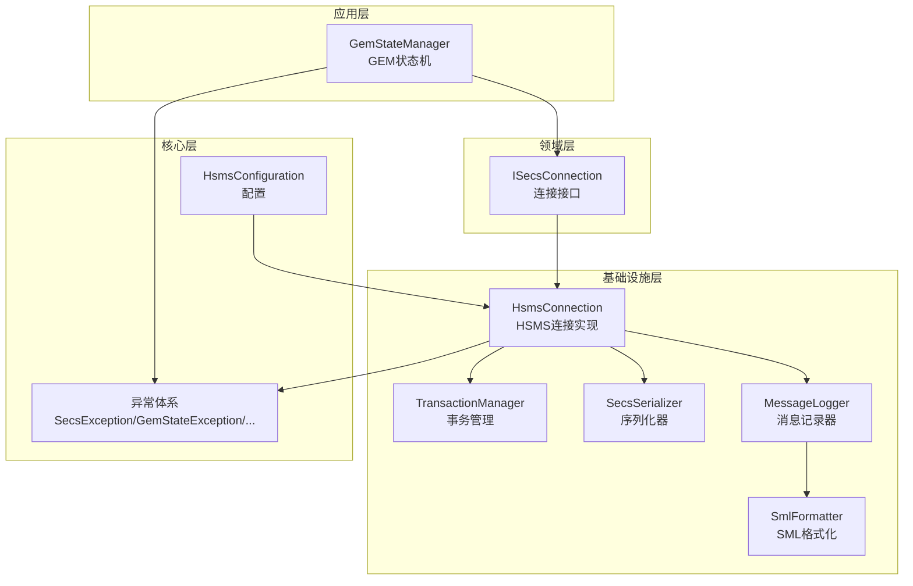
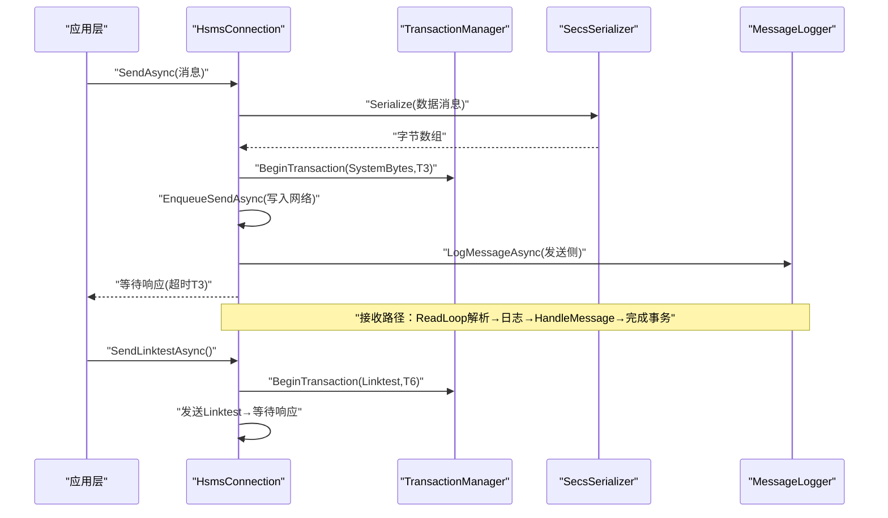
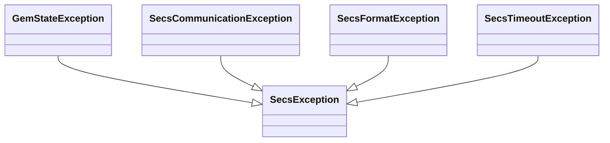
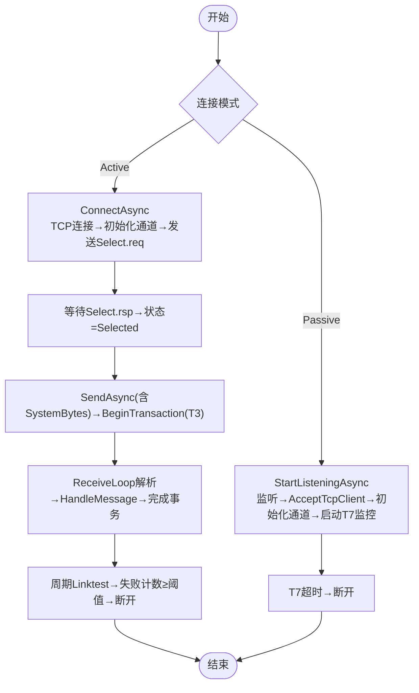
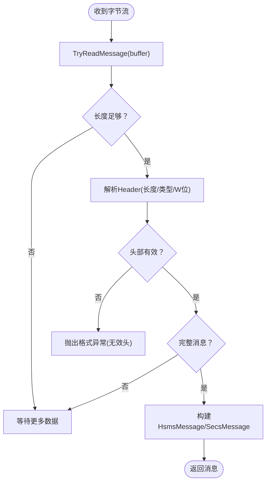
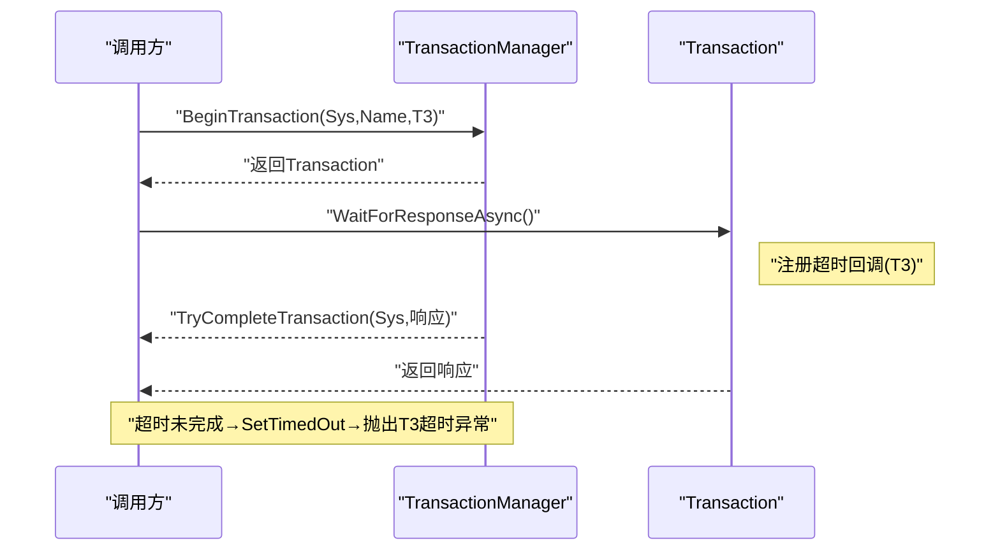
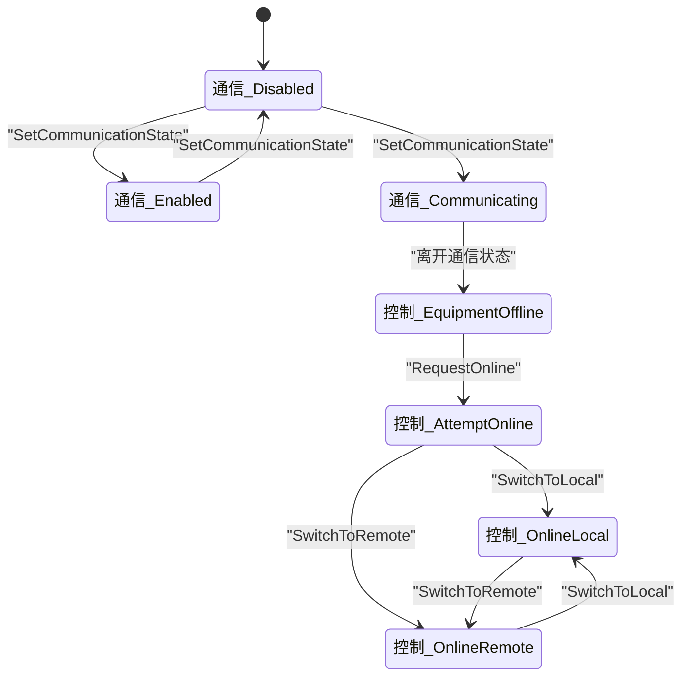
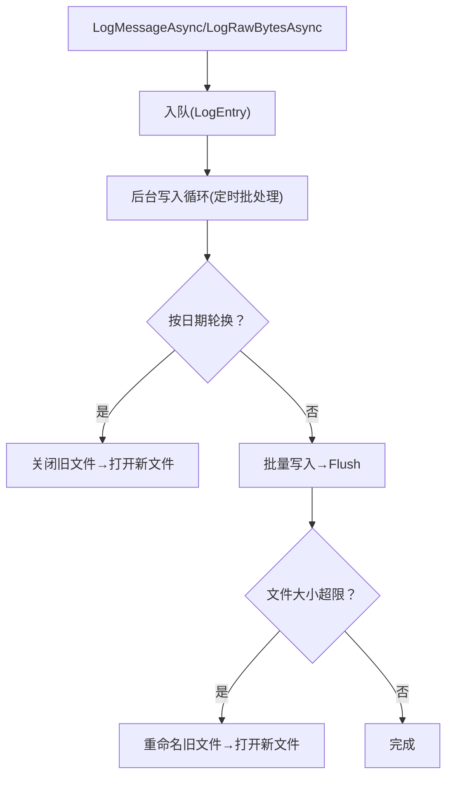
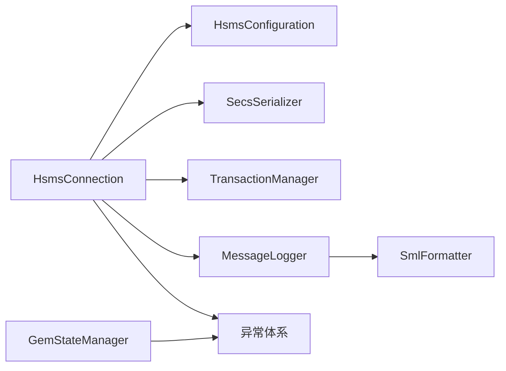

# 故障排除

<cite>
**本文引用的文件**
- [SecsException.cs](file://WebGem/SECS2GEM/Core/Exceptions/SecsException.cs)
- [GemStateException.cs](file://WebGem/SECS2GEM/Core/Exceptions/GemStateException.cs)
- [SecsCommunicationException.cs](file://WebGem/SECS2GEM/Core/Exceptions/SecsCommunicationException.cs)
- [SecsFormatException.cs](file://WebGem/SECS2GEM/Core/Exceptions/SecsFormatException.cs)
- [SecsTimeoutException.cs](file://WebGem/SECS2GEM/Core/Exceptions/SecsTimeoutException.cs)
- [HsmsConnection.cs](file://WebGem/SECS2GEM/Infrastructure/Connection/HsmsConnection.cs)
- [ISecsConnection.cs](file://WebGem/SECS2GEM/Domain/Interfaces/ISecsConnection.cs)
- [HsmsConfiguration.cs](file://WebGem/SECS2GEM/Infrastructure/Configuration/HsmsConfiguration.cs)
- [SecsSerializer.cs](file://WebGem/SECS2GEM/Infrastructure/Serialization/SecsSerializer.cs)
- [TransactionManager.cs](file://WebGem/SECS2GEM/Infrastructure/Services/TransactionManager.cs)
- [GemStateManager.cs](file://WebGem/SECS2GEM/Application/State/GemStateManager.cs)
- [MessageLogger.cs](file://WebGem/SECS2GEM/Infrastructure/Logging/MessageLogger.cs)
- [IMessageLogger.cs](file://WebGem/SECS2GEM/Infrastructure/Logging/IMessageLogger.cs)
- [SmlFormatter.cs](file://WebGem/SECS2GEM/Infrastructure/Logging/SmlFormatter.cs)
- [MessageLoggingConfiguration.cs](file://WebGem/SECS2GEM/Infrastructure/Logging/MessageLoggingConfiguration.cs)
</cite>

## 目录
1. [简介](#简介)
2. [项目结构](#项目结构)
3. [核心组件](#核心组件)
4. [架构总览](#架构总览)
5. [详细组件分析与故障排除](#详细组件分析与故障排除)
6. [依赖关系分析](#依赖关系分析)
7. [性能考量与优化建议](#性能考量与优化建议)
8. [故障排除指南](#故障排除指南)
9. [结论](#结论)
10. [附录](#附录)

## 简介
本指南面向SECS2-GEM系统的运维与开发人员，聚焦于常见异常类型的诊断与修复、日志分析与调试技巧、网络连接与协议解析问题排查、状态管理异常处理、性能问题定位与优化，以及预防性维护与系统健康检查。文档基于代码库中的异常体系、连接实现、序列化与事务管理、状态机与日志模块，提供可操作的排障步骤与可视化图示。

## 项目结构
SECS2-GEM采用分层架构：应用层负责状态管理与业务事件；基础设施层提供连接、序列化、事务与日志；领域层定义接口契约；核心层承载实体、枚举与异常。关键模块如下：
- 异常体系：统一的SECS/GEM异常基类与细分异常类型
- 连接层：HSMS连接、事件与状态管理
- 序列化层：SECS消息编解码与格式校验
- 事务层：消息事务与超时控制
- 状态层：GEM三态机与状态变量
- 日志层：消息记录与SML/HEX格式化输出

**图表来源**
- [GemStateManager.cs](file://WebGem/SECS2GEM/Application/State/GemStateManager.cs)
- [ISecsConnection.cs](file://WebGem/SECS2GEM/Domain/Interfaces/ISecsConnection.cs)
- [HsmsConnection.cs](file://WebGem/SECS2GEM/Infrastructure/Connection/HsmsConnection.cs)
- [SecsSerializer.cs](file://WebGem/SECS2GEM/Infrastructure/Serialization/SecsSerializer.cs)
- [TransactionManager.cs](file://WebGem/SECS2GEM/Infrastructure/Services/TransactionManager.cs)
- [MessageLogger.cs](file://WebGem/SECS2GEM/Infrastructure/Logging/MessageLogger.cs)
- [SmlFormatter.cs](file://WebGem/SECS2GEM/Infrastructure/Logging/SmlFormatter.cs)
- [HsmsConfiguration.cs](file://WebGem/SECS2GEM/Infrastructure/Configuration/HsmsConfiguration.cs)
- [SecsException.cs](file://WebGem/SECS2GEM/Core/Exceptions/SecsException.cs)

**章节来源**
- [ISecsConnection.cs](file://WebGem/SECS2GEM/Domain/Interfaces/ISecsConnection.cs)
- [HsmsConnection.cs](file://WebGem/SECS2GEM/Infrastructure/Connection/HsmsConnection.cs)
- [SecsSerializer.cs](file://WebGem/SECS2GEM/Infrastructure/Serialization/SecsSerializer.cs)
- [TransactionManager.cs](file://WebGem/SECS2GEM/Infrastructure/Services/TransactionManager.cs)
- [GemStateManager.cs](file://WebGem/SECS2GEM/Application/State/GemStateManager.cs)
- [MessageLogger.cs](file://WebGem/SECS2GEM/Infrastructure/Logging/MessageLogger.cs)
- [SmlFormatter.cs](file://WebGem/SECS2GEM/Infrastructure/Logging/SmlFormatter.cs)
- [HsmsConfiguration.cs](file://WebGem/SECS2GEM/Infrastructure/Configuration/HsmsConfiguration.cs)
- [SecsException.cs](file://WebGem/SECS2GEM/Core/Exceptions/SecsException.cs)

## 核心组件
- 异常体系：提供统一的异常分类与上下文信息，便于快速定位问题类型与场景
- HSMS连接：封装TCP、HSMS选择/去选择、链路测试、事务与超时控制
- 序列化器：实现SECS-II/HSMS消息的编解码与格式校验
- 事务管理：基于SystemBytes的事务跟踪与超时回调
- 状态管理：GEM通信/控制/处理三态机与状态变量注册
- 日志系统：异步消息记录、SML/HEX格式化、文件轮转与保留策略

**章节来源**
- [SecsException.cs](file://WebGem/SECS2GEM/Core/Exceptions/SecsException.cs)
- [GemStateException.cs](file://WebGem/SECS2GEM/Core/Exceptions/GemStateException.cs)
- [SecsCommunicationException.cs](file://WebGem/SECS2GEM/Core/Exceptions/SecsCommunicationException.cs)
- [SecsFormatException.cs](file://WebGem/SECS2GEM/Core/Exceptions/SecsFormatException.cs)
- [SecsTimeoutException.cs](file://WebGem/SECS2GEM/Core/Exceptions/SecsTimeoutException.cs)
- [HsmsConnection.cs](file://WebGem/SECS2GEM/Infrastructure/Connection/HsmsConnection.cs)
- [SecsSerializer.cs](file://WebGem/SECS2GEM/Infrastructure/Serialization/SecsSerializer.cs)
- [TransactionManager.cs](file://WebGem/SECS2GEM/Infrastructure/Services/TransactionManager.cs)
- [GemStateManager.cs](file://WebGem/SECS2GEM/Application/State/GemStateManager.cs)
- [MessageLogger.cs](file://WebGem/SECS2GEM/Infrastructure/Logging/MessageLogger.cs)
- [SmlFormatter.cs](file://WebGem/SECS2GEM/Infrastructure/Logging/SmlFormatter.cs)

## 架构总览
SECS2-GEM通过ISecsConnection抽象连接行为，HsmsConnection实现具体连接生命周期与消息收发；事务管理器配合超时配置保障消息往返；序列化器负责协议解析；日志系统异步记录SML/HEX以便回溯；状态管理器驱动GEM状态机。

**图表来源**
- [HsmsConnection.cs](file://WebGem/SECS2GEM/Infrastructure/Connection/HsmsConnection.cs)
- [TransactionManager.cs](file://WebGem/SECS2GEM/Infrastructure/Services/TransactionManager.cs)
- [SecsSerializer.cs](file://WebGem/SECS2GEM/Infrastructure/Serialization/SecsSerializer.cs)
- [MessageLogger.cs](file://WebGem/SECS2GEM/Infrastructure/Logging/MessageLogger.cs)

## 详细组件分析与故障排除

### 异常类型与诊断要点
- SecsException：SECS/GEM相关异常的基类，用于统一捕获与处理
- GemStateException：GEM状态机相关异常，包含状态错误类型与当前/目标状态
- SecsCommunicationException：通信相关异常，包含错误类型与远端端点
- SecsFormatException：协议格式异常，包含错误类型、位置与期望/实际值
- SecsTimeoutException：超时异常，包含超时类型、已等待时间与配置超时

**图表来源**
- [SecsException.cs](file://WebGem/SECS2GEM/Core/Exceptions/SecsException.cs)
- [GemStateException.cs](file://WebGem/SECS2GEM/Core/Exceptions/GemStateException.cs)
- [SecsCommunicationException.cs](file://WebGem/SECS2GEM/Core/Exceptions/SecsCommunicationException.cs)
- [SecsFormatException.cs](file://WebGem/SECS2GEM/Core/Exceptions/SecsFormatException.cs)
- [SecsTimeoutException.cs](file://WebGem/SECS2GEM/Core/Exceptions/SecsTimeoutException.cs)

**章节来源**
- [GemStateException.cs](file://WebGem/SECS2GEM/Core/Exceptions/GemStateException.cs)
- [SecsCommunicationException.cs](file://WebGem/SECS2GEM/Core/Exceptions/SecsCommunicationException.cs)
- [SecsFormatException.cs](file://WebGem/SECS2GEM/Core/Exceptions/SecsFormatException.cs)
- [SecsTimeoutException.cs](file://WebGem/SECS2GEM/Core/Exceptions/SecsTimeoutException.cs)

### 连接与通信（HsmsConnection）
- 主动/被动模式：Active模式调用ConnectAsync，Passive模式调用StartListeningAsync
- 选择/去选择：连接建立后发送Select请求，等待Select响应；Deselect请求触发断开
- 心跳与超时：周期性发送Linktest，失败累计超过阈值断开；T7超时（未选择）主动断开
- 事务与超时：发送Primary消息时创建事务，等待Secondary响应，T3超时抛出超时异常
- 日志记录：发送/接收消息均异步记录SML/HEX，便于回溯

**图表来源**
- [HsmsConnection.cs](file://WebGem/SECS2GEM/Infrastructure/Connection/HsmsConnection.cs)
- [ISecsConnection.cs](file://WebGem/SECS2GEM/Domain/Interfaces/ISecsConnection.cs)
- [HsmsConfiguration.cs](file://WebGem/SECS2GEM/Infrastructure/Configuration/HsmsConfiguration.cs)

**章节来源**
- [HsmsConnection.cs](file://WebGem/SECS2GEM/Infrastructure/Connection/HsmsConnection.cs)
- [ISecsConnection.cs](file://WebGem/SECS2GEM/Domain/Interfaces/ISecsConnection.cs)
- [HsmsConfiguration.cs](file://WebGem/SECS2GEM/Infrastructure/Configuration/HsmsConfiguration.cs)

### 序列化与协议解析（SecsSerializer）
- 编解码：大端序、格式码+长度字节+数据，支持多种数据类型与列表嵌套
- 校验：TryReadMessage先解析长度与头部，再判断数据完整性与最大消息大小
- 错误定位：格式异常包含位置与期望/实际值，便于快速定位问题字段

**图表来源**
- [SecsSerializer.cs](file://WebGem/SECS2GEM/Infrastructure/Serialization/SecsSerializer.cs)
- [SecsFormatException.cs](file://WebGem/SECS2GEM/Core/Exceptions/SecsFormatException.cs)

**章节来源**
- [SecsSerializer.cs](file://WebGem/SECS2GEM/Infrastructure/Serialization/SecsSerializer.cs)
- [SecsFormatException.cs](file://WebGem/SECS2GEM/Core/Exceptions/SecsFormatException.cs)

### 事务与超时（TransactionManager）
- 事务ID：自增SystemBytes，唯一标识一次请求-响应
- 超时：基于CancellationTokenSource，超时后设置取消并抛出T3超时异常
- 完成：收到对应SystemBytes的响应后完成事务，否则自动清理

**图表来源**
- [TransactionManager.cs](file://WebGem/SECS2GEM/Infrastructure/Services/TransactionManager.cs)
- [SecsTimeoutException.cs](file://WebGem/SECS2GEM/Core/Exceptions/SecsTimeoutException.cs)

**章节来源**
- [TransactionManager.cs](file://WebGem/SECS2GEM/Infrastructure/Services/TransactionManager.cs)
- [SecsTimeoutException.cs](file://WebGem/SECS2GEM/Core/Exceptions/SecsTimeoutException.cs)

### 状态管理（GemStateManager）
- 三态机：通信/控制/处理状态分别管理
- 状态转换：严格的转换规则，非法转换返回false
- 状态变量：注册标准与自定义状态变量，提供查询与更新
- 事件：状态变化触发事件，便于上层订阅

**图表来源**
- [GemStateManager.cs](file://WebGem/SECS2GEM/Application/State/GemStateManager.cs)

**章节来源**
- [GemStateManager.cs](file://WebGem/SECS2GEM/Application/State/GemStateManager.cs)

### 日志系统（MessageLogger/SmlFormatter）
- 异步写入：生产者-消费者队列，避免阻塞网络线程
- 文件轮转：按日期与大小轮换，支持保留天数清理
- 格式化：SML文本格式与HEX十六进制，便于人工与工具分析
- 方向标记：区分发送/接收，结合时间戳定位时序

**图表来源**
- [MessageLogger.cs](file://WebGem/SECS2GEM/Infrastructure/Logging/MessageLogger.cs)
- [SmlFormatter.cs](file://WebGem/SECS2GEM/Infrastructure/Logging/SmlFormatter.cs)
- [IMessageLogger.cs](file://WebGem/SECS2GEM/Infrastructure/Logging/IMessageLogger.cs)
- [MessageLoggingConfiguration.cs](file://WebGem/SECS2GEM/Infrastructure/Logging/MessageLoggingConfiguration.cs)

**章节来源**
- [MessageLogger.cs](file://WebGem/SECS2GEM/Infrastructure/Logging/MessageLogger.cs)
- [SmlFormatter.cs](file://WebGem/SECS2GEM/Infrastructure/Logging/SmlFormatter.cs)
- [IMessageLogger.cs](file://WebGem/SECS2GEM/Infrastructure/Logging/IMessageLogger.cs)
- [MessageLoggingConfiguration.cs](file://WebGem/SECS2GEM/Infrastructure/Logging/MessageLoggingConfiguration.cs)

## 依赖关系分析
- HsmsConnection依赖：配置、序列化器、事务管理器、消息日志
- 事务管理器依赖：并发字典与超时回调，保证事务生命周期
- 序列化器依赖：格式枚举与异常，保障协议一致性
- 状态管理器依赖：状态枚举与事件，驱动业务流转
- 日志系统依赖：SML格式化器与配置，提供可读性与可维护性

**图表来源**
- [HsmsConnection.cs](file://WebGem/SECS2GEM/Infrastructure/Connection/HsmsConnection.cs)
- [HsmsConfiguration.cs](file://WebGem/SECS2GEM/Infrastructure/Configuration/HsmsConfiguration.cs)
- [SecsSerializer.cs](file://WebGem/SECS2GEM/Infrastructure/Serialization/SecsSerializer.cs)
- [TransactionManager.cs](file://WebGem/SECS2GEM/Infrastructure/Services/TransactionManager.cs)
- [MessageLogger.cs](file://WebGem/SECS2GEM/Infrastructure/Logging/MessageLogger.cs)
- [SmlFormatter.cs](file://WebGem/SECS2GEM/Infrastructure/Logging/SmlFormatter.cs)
- [GemStateManager.cs](file://WebGem/SECS2GEM/Application/State/GemStateManager.cs)
- [SecsException.cs](file://WebGem/SECS2GEM/Core/Exceptions/SecsException.cs)

**章节来源**
- [HsmsConnection.cs](file://WebGem/SECS2GEM/Infrastructure/Connection/HsmsConnection.cs)
- [TransactionManager.cs](file://WebGem/SECS2GEM/Infrastructure/Services/TransactionManager.cs)
- [SecsSerializer.cs](file://WebGem/SECS2GEM/Infrastructure/Serialization/SecsSerializer.cs)
- [MessageLogger.cs](file://WebGem/SECS2GEM/Infrastructure/Logging/MessageLogger.cs)
- [GemStateManager.cs](file://WebGem/SECS2GEM/Application/State/GemStateManager.cs)
- [SecsException.cs](file://WebGem/SECS2GEM/Core/Exceptions/SecsException.cs)

## 性能考量与优化建议
- 异步与背压：日志系统采用异步写入与批处理，降低对网络线程影响
- 缓冲区与消息大小：合理设置接收/发送缓冲区与最大消息大小，避免频繁分配与拷贝
- 心跳与超时：适度的心跳间隔与最大失败次数，平衡连接健壮性与资源消耗
- 事务并发：关注活跃事务数量，避免积压导致内存与超时风险
- 日志轮转：按大小与日期轮转，避免单文件过大影响IO与磁盘占用

[本节为通用指导，无需特定文件引用]

## 故障排除指南

### 一、常见异常类型与处置
- GemStateException
  - 场景：状态转换非法、操作在当前状态不允许、通信未建立、设备离线、非远程控制
  - 处置：检查当前状态与目标状态，确认GEM状态机转换规则；若通信未建立，先建立HSMS会话；若设备离线或非远程，先调整至允许状态
  - 参考
    - [GemStateException.cs](file://WebGem/SECS2GEM/Core/Exceptions/GemStateException.cs)
    - [GemStateManager.cs](file://WebGem/SECS2GEM/Application/State/GemStateManager.cs)

- SecsCommunicationException
  - 场景：连接失败/丢失、选择/去选择失败、未选择即发送、链路测试失败
  - 处置：核对远端端点与防火墙；检查HSMS选择流程；确保会话已建立后再发送数据；排查链路质量与超时配置
  - 参考
    - [SecsCommunicationException.cs](file://WebGem/SECS2GEM/Core/Exceptions/SecsCommunicationException.cs)
    - [HsmsConnection.cs](file://WebGem/SECS2GEM/Infrastructure/Connection/HsmsConnection.cs)

- SecsFormatException
  - 场景：格式码/长度字节/数据长度不匹配/数据不完整、Stream/Function无效、HSMS头无效
  - 处置：根据错误位置与期望/实际值修正消息构造；检查序列化器配置与数据类型；核对协议规范
  - 参考
    - [SecsFormatException.cs](file://WebGem/SECS2GEM/Core/Exceptions/SecsFormatException.cs)
    - [SecsSerializer.cs](file://WebGem/SECS2GEM/Infrastructure/Serialization/SecsSerializer.cs)

- SecsTimeoutException
  - 场景：T3回复超时、T6控制超时、T7未选择超时、连接超时
  - 处置：增大相应超时配置；检查网络延迟与对端处理能力；必要时优化消息大小与并发
  - 参考
    - [SecsTimeoutException.cs](file://WebGem/SECS2GEM/Core/Exceptions/SecsTimeoutException.cs)
    - [HsmsConfiguration.cs](file://WebGem/SECS2GEM/Infrastructure/Configuration/HsmsConfiguration.cs)
    - [TransactionManager.cs](file://WebGem/SECS2GEM/Infrastructure/Services/TransactionManager.cs)

### 二、网络连接问题
- 症状：连接失败、连接丢失、T7超时、链路测试失败
- 诊断步骤
  - 核对IP/端口与防火墙策略
  - 检查HSMS选择流程与响应
  - 观察T7超时与心跳失败次数
  - 查看日志中“发送/接收”方向与时间戳
- 修复建议
  - 调整T6/T7超时；启用自动重连；优化心跳间隔
  - 若Passive端长时间无Select，确认T7超时配置与对端行为
- 参考
  - [HsmsConnection.cs](file://WebGem/SECS2GEM/Infrastructure/Connection/HsmsConnection.cs)
  - [HsmsConfiguration.cs](file://WebGem/SECS2GEM/Infrastructure/Configuration/HsmsConfiguration.cs)
  - [MessageLogger.cs](file://WebGem/SECS2GEM/Infrastructure/Logging/MessageLogger.cs)

### 三、协议解析错误
- 症状：格式异常、消息不完整、长度不匹配
- 诊断步骤
  - 在日志中定位错误位置（Position），比对期望/实际值
  - 检查序列化器对数据类型的编码与长度计算
  - 核对消息长度字段与最大消息大小限制
- 修复建议
  - 修正消息构造逻辑，确保格式码与长度一致
  - 对长数据采用分片或压缩策略
- 参考
  - [SecsFormatException.cs](file://WebGem/SECS2GEM/Core/Exceptions/SecsFormatException.cs)
  - [SecsSerializer.cs](file://WebGem/SECS2GEM/Infrastructure/Serialization/SecsSerializer.cs)

### 四、状态管理异常
- 症状：状态转换失败、非法操作、状态不一致
- 诊断步骤
  - 检查当前状态与目标状态是否满足转换规则
  - 确认通信状态为“正在通信”时才允许上线
  - 核对远程/本地控制切换条件
- 修复建议
  - 严格遵循状态机规则；在状态变化事件中同步业务状态
- 参考
  - [GemStateManager.cs](file://WebGem/SECS2GEM/Application/State/GemStateManager.cs)

### 五、日志分析与调试技巧
- 启用与配置
  - 启用消息日志，选择SML/HEX格式，设置保留天数与文件大小
  - 使用异步写入，避免阻塞网络线程
- 分析要点
  - 依据方向标记（发送/接收）与时间戳重建时序
  - 结合SystemBytes定位请求-响应配对
  - 关注异常前后相邻消息，定位首包问题
- 参考
  - [MessageLoggingConfiguration.cs](file://WebGem/SECS2GEM/Infrastructure/Logging/MessageLoggingConfiguration.cs)
  - [MessageLogger.cs](file://WebGem/SECS2GEM/Infrastructure/Logging/MessageLogger.cs)
  - [SmlFormatter.cs](file://WebGem/SECS2GEM/Infrastructure/Logging/SmlFormatter.cs)

### 六、性能问题诊断与优化
- 诊断
  - 观察活跃事务数量与平均等待时间
  - 检查日志写入延迟与文件轮转频率
  - 评估消息大小与并发度对吞吐的影响
- 优化
  - 合理设置T3/T6/T7与心跳参数
  - 调整缓冲区大小与最大消息大小
  - 优化日志轮转策略，避免高峰时段大量IO
- 参考
  - [TransactionManager.cs](file://WebGem/SECS2GEM/Infrastructure/Services/TransactionManager.cs)
  - [MessageLogger.cs](file://WebGem/SECS2GEM/Infrastructure/Logging/MessageLogger.cs)
  - [HsmsConfiguration.cs](file://WebGem/SECS2GEM/Infrastructure/Configuration/HsmsConfiguration.cs)

### 七、调试工具与监控
- 工具
  - SML/HEX日志：用于协议级回放与问题定位
  - 事务追踪：SystemBytes与消息名称，辅助定位超时与丢包
  - 状态事件：订阅状态变化事件，监控状态机健康
- 监控指标建议
  - 连接状态切换次数与时长
  - 事务成功率与平均耗时
  - 心跳失败率与断线次数
  - 日志写入延迟与文件大小
- 参考
  - [IMessageLogger.cs](file://WebGem/SECS2GEM/Infrastructure/Logging/IMessageLogger.cs)
  - [ISecsConnection.cs](file://WebGem/SECS2GEM/Domain/Interfaces/ISecsConnection.cs)
  - [GemStateManager.cs](file://WebGem/SECS2GEM/Application/State/GemStateManager.cs)

### 八、预防性维护与健康检查
- 健康检查清单
  - 网络连通性与端口开放
  - HSMS选择与链路测试稳定
  - 事务超时配置合理
  - 日志目录空间充足与轮转正常
  - 状态机处于预期状态
- 维护建议
  - 定期审查日志，识别异常模式
  - 逐步调整超时与心跳参数，观察效果
  - 对长消息与高频场景做压力测试
- 参考
  - [HsmsConfiguration.cs](file://WebGem/SECS2GEM/Infrastructure/Configuration/HsmsConfiguration.cs)
  - [MessageLogger.cs](file://WebGem/SECS2GEM/Infrastructure/Logging/MessageLogger.cs)
  - [GemStateManager.cs](file://WebGem/SECS2GEM/Application/State/GemStateManager.cs)

**章节来源**
- [GemStateException.cs](file://WebGem/SECS2GEM/Core/Exceptions/GemStateException.cs)
- [SecsCommunicationException.cs](file://WebGem/SECS2GEM/Core/Exceptions/SecsCommunicationException.cs)
- [SecsFormatException.cs](file://WebGem/SECS2GEM/Core/Exceptions/SecsFormatException.cs)
- [SecsTimeoutException.cs](file://WebGem/SECS2GEM/Core/Exceptions/SecsTimeoutException.cs)
- [HsmsConnection.cs](file://WebGem/SECS2GEM/Infrastructure/Connection/HsmsConnection.cs)
- [HsmsConfiguration.cs](file://WebGem/SECS2GEM/Infrastructure/Configuration/HsmsConfiguration.cs)
- [SecsSerializer.cs](file://WebGem/SECS2GEM/Infrastructure/Serialization/SecsSerializer.cs)
- [TransactionManager.cs](file://WebGem/SECS2GEM/Infrastructure/Services/TransactionManager.cs)
- [GemStateManager.cs](file://WebGem/SECS2GEM/Application/State/GemStateManager.cs)
- [MessageLogger.cs](file://WebGem/SECS2GEM/Infrastructure/Logging/MessageLogger.cs)
- [IMessageLogger.cs](file://WebGem/SECS2GEM/Infrastructure/Logging/IMessageLogger.cs)
- [SmlFormatter.cs](file://WebGem/SECS2GEM/Infrastructure/Logging/SmlFormatter.cs)
- [MessageLoggingConfiguration.cs](file://WebGem/SECS2GEM/Infrastructure/Logging/MessageLoggingConfiguration.cs)

## 结论
SECS2-GEM通过清晰的异常体系、稳健的连接与事务机制、严谨的协议解析与完善的日志系统，提供了可靠的SECS/GEM通信能力。故障排除应围绕异常类型、连接状态、协议格式与超时配置展开，并结合日志与监控进行定位与优化。遵循本指南的步骤与建议，可显著提升系统的稳定性与可维护性。

[本节为总结性内容，无需特定文件引用]

## 附录
- 常用术语
  - HSMS：SEMI E37.2协议的物理与数据链路层
  - SECS-II：SEMI E5 Toc协议的数据表示与消息结构
  - SystemBytes：事务标识符，用于请求-响应配对
  - T3/T6/T7：SECS协议定义的超时参数
- 参考文件
  - [HsmsConnection.cs](file://WebGem/SECS2GEM/Infrastructure/Connection/HsmsConnection.cs)
  - [SecsSerializer.cs](file://WebGem/SECS2GEM/Infrastructure/Serialization/SecsSerializer.cs)
  - [TransactionManager.cs](file://WebGem/SECS2GEM/Infrastructure/Services/TransactionManager.cs)
  - [GemStateManager.cs](file://WebGem/SECS2GEM/Application/State/GemStateManager.cs)
  - [MessageLogger.cs](file://WebGem/SECS2GEM/Infrastructure/Logging/MessageLogger.cs)
  - [SmlFormatter.cs](file://WebGem/SECS2GEM/Infrastructure/Logging/SmlFormatter.cs)
  - [HsmsConfiguration.cs](file://WebGem/SECS2GEM/Infrastructure/Configuration/HsmsConfiguration.cs)
  - [SecsException.cs](file://WebGem/SECS2GEM/Core/Exceptions/SecsException.cs)