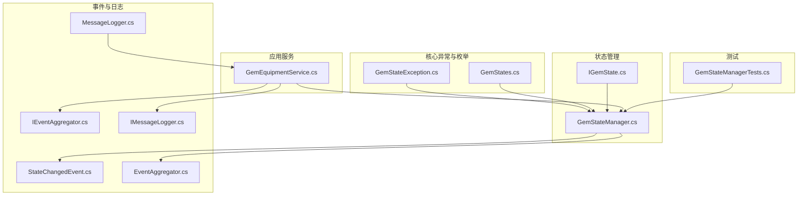
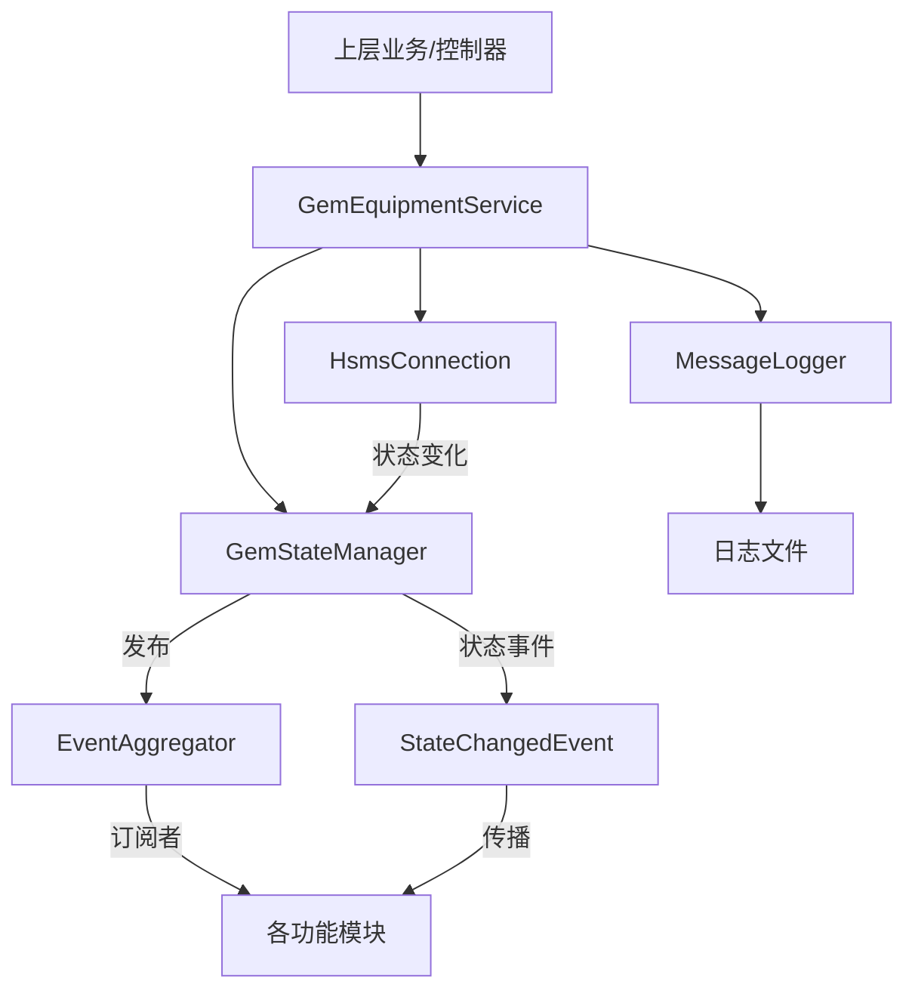
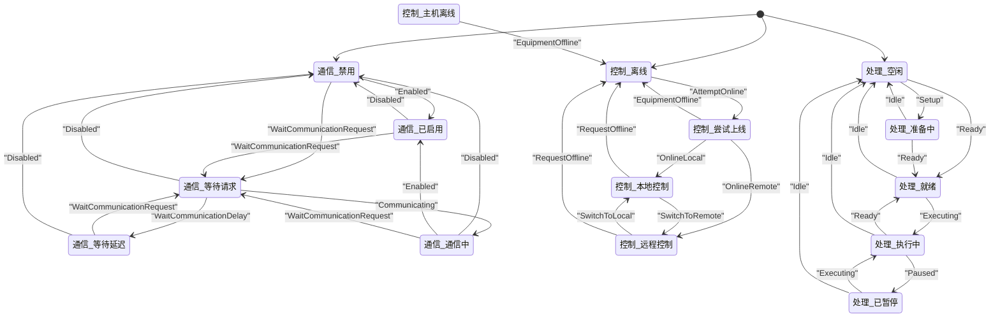
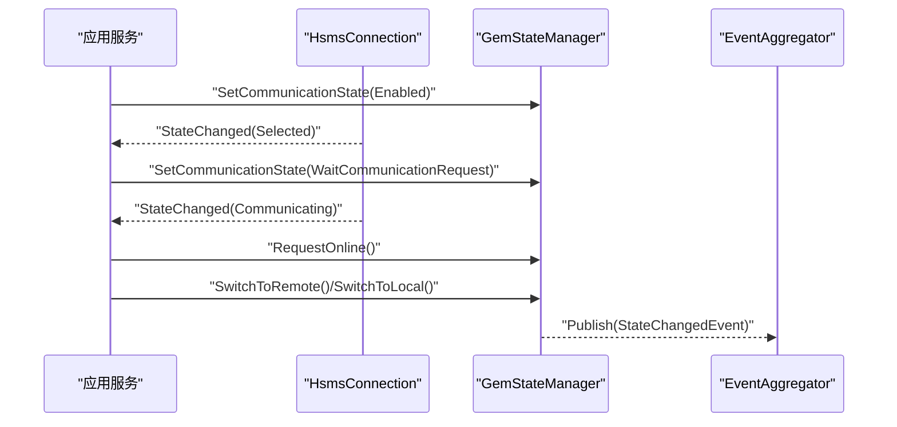
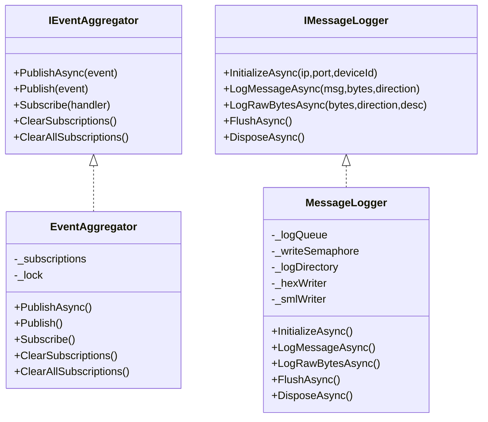
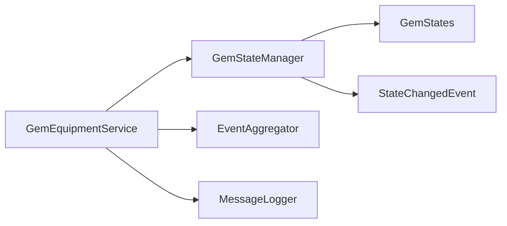

# 状态管理问题

<cite>
**本文引用的文件**
- [GemStateException.cs](file://WebGem/SECS2GEM/Core/Exceptions/GemStateException.cs)
- [GemStateManager.cs](file://WebGem/SECS2GEM/Application/State/GemStateManager.cs)
- [GemStates.cs](file://WebGem/SECS2GEM/Core/Enums/GemStates.cs)
- [IGemState.cs](file://WebGem/SECS2GEM/Domain/Interfaces/IGemState.cs)
- [GemEquipmentService.cs](file://WebGem/SECS2GEM/Application/Services/GemEquipmentService.cs)
- [StateChangedEvent.cs](file://WebGem/SECS2GEM/Domain/Events/StateChangedEvent.cs)
- [IEventAggregator.cs](file://WebGem/SECS2GEM/Domain/Interfaces/IEventAggregator.cs)
- [EventAggregator.cs](file://WebGem/SECS2GEM/Infrastructure/Services/EventAggregator.cs)
- [IMessageLogger.cs](file://WebGem/SECS2GEM/Infrastructure/Logging/IMessageLogger.cs)
- [MessageLogger.cs](file://WebGem/SECS2GEM/Infrastructure/Logging/MessageLogger.cs)
- [GemStateManagerTests.cs](file://WebGem/SECS2GEM.Tests/GemStateManagerTests.cs)
</cite>

## 目录
1. [简介](#简介)
2. [项目结构](#项目结构)
3. [核心组件](#核心组件)
4. [架构总览](#架构总览)
5. [详细组件分析](#详细组件分析)
6. [依赖关系分析](#依赖关系分析)
7. [性能考量](#性能考量)
8. [故障排除指南](#故障排除指南)
9. [结论](#结论)
10. [附录](#附录)

## 简介
本指南聚焦于SECS/GEM状态管理问题，特别是GemStateException异常的触发原因与解决方法。内容覆盖GEM状态机的三类状态（通信、控制、处理）及其转换规则、状态同步与一致性问题、状态丢失排查、调试与监控方法，以及状态持久化与恢复机制的故障排除建议。读者可据此快速定位并修复状态相关问题。

## 项目结构
围绕状态管理的关键模块与文件如下：
- 异常与状态枚举：Core/Exceptions、Core/Enums
- 状态管理器：Application/State
- 接口与事件：Domain/Interfaces、Domain/Events
- 应用服务：Application/Services
- 事件聚合与日志：Infrastructure/Services、Infrastructure/Logging
- 测试：SECS2GEM.Tests

**图表来源**
- [GemStateException.cs:1-151](file://WebGem/SECS2GEM/Core/Exceptions/GemStateException.cs#L1-L151)
- [GemStateManager.cs:1-492](file://WebGem/SECS2GEM/Application/State/GemStateManager.cs#L1-L492)
- [GemStates.cs:1-176](file://WebGem/SECS2GEM/Core/Enums/GemStates.cs#L1-L176)
- [IGemState.cs:1-166](file://WebGem/SECS2GEM/Domain/Interfaces/IGemState.cs#L1-L166)
- [GemEquipmentService.cs:1-456](file://WebGem/SECS2GEM/Application/Services/GemEquipmentService.cs#L1-L456)
- [StateChangedEvent.cs:1-110](file://WebGem/SECS2GEM/Domain/Events/StateChangedEvent.cs#L1-L110)
- [IEventAggregator.cs:1-67](file://WebGem/SECS2GEM/Domain/Interfaces/IEventAggregator.cs#L1-L67)
- [EventAggregator.cs:1-219](file://WebGem/SECS2GEM/Infrastructure/Services/EventAggregator.cs#L1-L219)
- [IMessageLogger.cs:1-70](file://WebGem/SECS2GEM/Infrastructure/Logging/IMessageLogger.cs#L1-L70)
- [MessageLogger.cs:1-438](file://WebGem/SECS2GEM/Infrastructure/Logging/MessageLogger.cs#L1-L438)
- [GemStateManagerTests.cs:1-365](file://WebGem/SECS2GEM.Tests/GemStateManagerTests.cs#L1-L365)

**章节来源**
- [GemStateManager.cs:1-492](file://WebGem/SECS2GEM/Application/State/GemStateManager.cs#L1-L492)
- [GemEquipmentService.cs:1-456](file://WebGem/SECS2GEM/Application/Services/GemEquipmentService.cs#L1-L456)

## 核心组件
- GemStateException：封装GEM状态错误类型与异常信息，支持多种错误类型（无效状态转换、操作不允许、通信未建立、设备离线、非远程控制），并提供静态工厂方法快速构造异常。
- GemStateManager：状态机实现，管理通信、控制、处理三类状态，提供状态转换验证、事件发布、状态变量与设备常量管理，并内置标准状态变量注册。
- 状态枚举：定义通信、控制、处理状态及报警类别，确保状态转换规则与协议一致。
- 应用服务：GemEquipmentService整合连接、消息分发与状态管理，负责状态变化事件的传播与自动上线/切控逻辑。
- 事件与日志：事件聚合器用于解耦事件发布；消息记录器用于异步记录消息，辅助状态一致性与问题复盘。

**章节来源**
- [GemStateException.cs:1-151](file://WebGem/SECS2GEM/Core/Exceptions/GemStateException.cs#L1-L151)
- [GemStateManager.cs:1-492](file://WebGem/SECS2GEM/Application/State/GemStateManager.cs#L1-L492)
- [GemStates.cs:1-176](file://WebGem/SECS2GEM/Core/Enums/GemStates.cs#L1-L176)
- [GemEquipmentService.cs:1-456](file://WebGem/SECS2GEM/Application/Services/GemEquipmentService.cs#L1-L456)
- [IEventAggregator.cs:1-67](file://WebGem/SECS2GEM/Domain/Interfaces/IEventAggregator.cs#L1-L67)
- [EventAggregator.cs:1-219](file://WebGem/SECS2GEM/Infrastructure/Services/EventAggregator.cs#L1-L219)
- [IMessageLogger.cs:1-70](file://WebGem/SECS2GEM/Infrastructure/Logging/IMessageLogger.cs#L1-L70)
- [MessageLogger.cs:1-438](file://WebGem/SECS2GEM/Infrastructure/Logging/MessageLogger.cs#L1-L438)

## 架构总览
下图展示状态管理在系统中的位置与交互：

**图表来源**
- [GemEquipmentService.cs:1-456](file://WebGem/SECS2GEM/Application/Services/GemEquipmentService.cs#L1-L456)
- [GemStateManager.cs:1-492](file://WebGem/SECS2GEM/Application/State/GemStateManager.cs#L1-L492)
- [EventAggregator.cs:1-219](file://WebGem/SECS2GEM/Infrastructure/Services/EventAggregator.cs#L1-L219)
- [StateChangedEvent.cs:1-110](file://WebGem/SECS2GEM/Domain/Events/StateChangedEvent.cs#L1-L110)
- [MessageLogger.cs:1-438](file://WebGem/SECS2GEM/Infrastructure/Logging/MessageLogger.cs#L1-L438)

## 详细组件分析

### GemStateManager 状态机与转换规则
- 通信状态（Communication State）
  - 支持 Disabled → Enabled/WaitCommunicationRequest → WaitCommunicationDelay → Communicating 的闭环转换。
  - 离开 Communicating 时会重置控制状态为 EquipmentOffline，防止状态不一致。
- 控制状态（Control State）
  - EquipmentOffline → AttemptOnline → OnlineLocal/OnlineRemote，或回退至 EquipmentOffline。
  - OnlineLocal/OnlineRemote 可相互切换，HostOffline 仅从在线态进入。
- 处理状态（Processing State）
  - Idle → Setup/Ready，Ready → Executing，Executing → Paused/Ready/Idle，Paused → Executing/Idle。
- 状态变量与设备常量
  - 提供注册、查询、动态值获取与范围校验能力，支持只读与回调通知。

**图表来源**
- [GemStateManager.cs:352-455](file://WebGem/SECS2GEM/Application/State/GemStateManager.cs#L352-L455)
- [GemStates.cs:10-120](file://WebGem/SECS2GEM/Core/Enums/GemStates.cs#L10-L120)

**章节来源**
- [GemStateManager.cs:196-455](file://WebGem/SECS2GEM/Application/State/GemStateManager.cs#L196-L455)
- [GemStates.cs:10-120](file://WebGem/SECS2GEM/Core/Enums/GemStates.cs#L10-L120)

### GemEquipmentService 中的状态联动
- 启动时将通信状态置为 Enabled。
- 连接建立（Selected）时置为 WaitCommunicationRequest，断开时回退为 Enabled。
- 进入 Communicating 且配置允许时自动 RequestOnline，并根据初始控制模式切换到 Local 或 Remote。
- 订阅状态变化事件，发布统一的 StateChangedEvent 供上层订阅。

**图表来源**
- [GemEquipmentService.cs:140-398](file://WebGem/SECS2GEM/Application/Services/GemEquipmentService.cs#L140-L398)
- [GemStateManager.cs:263-347](file://WebGem/SECS2GEM/Application/State/GemStateManager.cs#L263-L347)
- [StateChangedEvent.cs:11-52](file://WebGem/SECS2GEM/Domain/Events/StateChangedEvent.cs#L11-L52)
- [EventAggregator.cs:25-67](file://WebGem/SECS2GEM/Infrastructure/Services/EventAggregator.cs#L25-L67)

**章节来源**
- [GemEquipmentService.cs:140-398](file://WebGem/SECS2GEM/Application/Services/GemEquipmentService.cs#L140-L398)

### 事件与日志：状态一致性与可观测性
- 事件聚合：IEventAggregator 提供统一发布/订阅入口，支持异步与同步处理，异常隔离，避免单个订阅者异常影响整体。
- 状态事件：StateChangedEvent 统一承载通信/控制/处理状态变化，便于集中监控与告警。
- 消息日志：MessageLogger 异步写入 HEX/SML 日志，支持按日期/大小轮换与保留期清理，便于回溯消息与状态变迁。

**图表来源**
- [IEventAggregator.cs:1-67](file://WebGem/SECS2GEM/Domain/Interfaces/IEventAggregator.cs#L1-L67)
- [EventAggregator.cs:1-219](file://WebGem/SECS2GEM/Infrastructure/Services/EventAggregator.cs#L1-L219)
- [IMessageLogger.cs:1-70](file://WebGem/SECS2GEM/Infrastructure/Logging/IMessageLogger.cs#L1-L70)
- [MessageLogger.cs:1-438](file://WebGem/SECS2GEM/Infrastructure/Logging/MessageLogger.cs#L1-L438)

**章节来源**
- [IEventAggregator.cs:1-67](file://WebGem/SECS2GEM/Domain/Interfaces/IEventAggregator.cs#L1-L67)
- [EventAggregator.cs:1-219](file://WebGem/SECS2GEM/Infrastructure/Services/EventAggregator.cs#L1-L219)
- [IMessageLogger.cs:1-70](file://WebGem/SECS2GEM/Infrastructure/Logging/IMessageLogger.cs#L1-L70)
- [MessageLogger.cs:1-438](file://WebGem/SECS2GEM/Infrastructure/Logging/MessageLogger.cs#L1-L438)

## 依赖关系分析
- GemEquipmentService 依赖 GemStateManager 并通过事件聚合器对外发布状态变化。
- GemStateManager 依赖状态枚举与事件接口，内部维护状态锁与并发容器。
- MessageLogger 与 IEventAggregator 独立存在，分别服务于日志与事件领域，通过应用服务间接关联。

**图表来源**
- [GemEquipmentService.cs:1-456](file://WebGem/SECS2GEM/Application/Services/GemEquipmentService.cs#L1-L456)
- [GemStateManager.cs:1-492](file://WebGem/SECS2GEM/Application/State/GemStateManager.cs#L1-L492)
- [GemStates.cs:1-176](file://WebGem/SECS2GEM/Core/Enums/GemStates.cs#L1-L176)
- [StateChangedEvent.cs:1-110](file://WebGem/SECS2GEM/Domain/Events/StateChangedEvent.cs#L1-L110)
- [MessageLogger.cs:1-438](file://WebGem/SECS2GEM/Infrastructure/Logging/MessageLogger.cs#L1-L438)

**章节来源**
- [GemEquipmentService.cs:1-456](file://WebGem/SECS2GEM/Application/Services/GemEquipmentService.cs#L1-L456)
- [GemStateManager.cs:1-492](file://WebGem/SECS2GEM/Application/State/GemStateManager.cs#L1-L492)

## 性能考量
- 状态转换采用锁保护，避免并发冲突；事件发布支持异步并行处理，降低阻塞风险。
- 消息日志采用生产者-消费者模式与信号量串行写入，减少IO抖动。
- 建议：对高频状态事件订阅者进行限流与背压处理，避免风暴效应。

[本节为通用指导，无需特定文件来源]

## 故障排除指南

### 1. GemStateException 异常触发原因与解决
- 无效状态转换（InvalidTransition）
  - 触发条件：尝试从当前状态直接跳转到不允许的目标状态。
  - 解决步骤：
    - 核对状态转换矩阵，确认是否遗漏前置状态（如必须先 Enabled 再 WaitCommunicationRequest）。
    - 若为自动流程，请检查连接状态与事件顺序，确保按序进入 Communicating 再 RequestOnline。
- 操作不允许（OperationNotAllowed）
  - 触发条件：在当前状态下执行了协议禁止的操作（如离线时请求上线）。
  - 解决步骤：
    - 在执行操作前，先检查 IsOnline/IsRemoteControl 等属性，或捕获异常并回退到安全状态。
- 通信未建立（NotCommunicating）
  - 触发条件：在未进入 Communicating 状态时发起通信相关操作。
  - 解决步骤：
    - 确保连接已 Selected 并进入 WaitCommunicationRequest，再进入 Communicating。
- 设备离线（EquipmentOffline）
  - 触发条件：在设备离线状态下执行需要在线的操作。
  - 解决步骤：
    - 先通过 RequestOnline 进入 AttemptOnline，再切换到 Local/Remote。
- 非远程控制（NotRemoteControl）
  - 触发条件：在非远程控制模式下执行仅允许远程控制的操作。
  - 解决步骤：
    - 先 SwitchToRemote，再执行远程控制操作。

**章节来源**
- [GemStateException.cs:6-148](file://WebGem/SECS2GEM/Core/Exceptions/GemStateException.cs#L6-L148)
- [GemStateManager.cs:263-347](file://WebGem/SECS2GEM/Application/State/GemStateManager.cs#L263-L347)
- [GemEquipmentService.cs:372-384](file://WebGem/SECS2GEM/Application/Services/GemEquipmentService.cs#L372-L384)

### 2. 状态转换问题排查
- 常见问题
  - 通信状态：从 Communicating 直接设置为 Offline 导致异常。
  - 控制状态：AttemptOnline 与 OnlineLocal/OnlineRemote 之间切换不一致。
  - 处理状态：Executing 与 Paused 之间跳转导致数据不一致。
- 排查步骤
  - 使用状态事件日志（StateChangedEvent）核对状态链路。
  - 在应用服务中订阅状态变化，打印 OldState/NewState/Reason。
  - 结合消息日志（HEX/SML）定位事件发生的时间点与上下文。

**章节来源**
- [GemStateManager.cs:352-455](file://WebGem/SECS2GEM/Application/State/GemStateManager.cs#L352-L455)
- [StateChangedEvent.cs:11-52](file://WebGem/SECS2GEM/Domain/Events/StateChangedEvent.cs#L11-L52)
- [MessageLogger.cs:99-145](file://WebGem/SECS2GEM/Infrastructure/Logging/MessageLogger.cs#L99-L145)

### 3. 状态同步与一致性检查
- 同步要点
  - 通信状态变化会触发控制状态重置（离开 Communicating 时），避免悬挂状态。
  - 控制状态变化通过事件发布，订阅者应幂等处理。
- 一致性检查
  - 使用事件聚合器统计各状态事件数量，对比预期序列。
  - 在关键节点（进入 Communicating、RequestOnline、SwitchToRemote/Local）打点记录。
  - 对高频状态事件进行采样与去重，避免重复处理。

**章节来源**
- [GemStateManager.cs:213-240](file://WebGem/SECS2GEM/Application/State/GemStateManager.cs#L213-L240)
- [EventAggregator.cs:25-67](file://WebGem/SECS2GEM/Infrastructure/Services/EventAggregator.cs#L25-L67)

### 4. 状态丢失与恢复
- 状态丢失场景
  - 进程重启后未恢复状态；连接断开导致状态回退；异常分支未正确回滚。
- 恢复策略
  - 启动时将通信状态置为 Enabled，等待连接 Selected 后再推进。
  - 在进入 Communicating 后根据配置自动 RequestOnline 并切换控制模式。
  - 对关键状态变量与设备常量进行持久化（如外部存储），重启后加载。
- 验证方法
  - 通过测试用例验证初始状态与标准变量注册。
  - 使用单元测试覆盖典型状态转换路径。

**章节来源**
- [GemEquipmentService.cs:140-174](file://WebGem/SECS2GEM/Application/Services/GemEquipmentService.cs#L140-L174)
- [GemStateManager.cs:464-489](file://WebGem/SECS2GEM/Application/State/GemStateManager.cs#L464-L489)
- [GemStateManagerTests.cs:21-46](file://WebGem/SECS2GEM.Tests/GemStateManagerTests.cs#L21-L46)

### 5. 调试与监控方法
- 事件监控
  - 订阅 StateChangedEvent，记录时间戳、状态类型、旧值、新值、原因。
  - 使用 IEventAggregator 的 Subscribe/PublishAsync 方法进行端到端验证。
- 日志分析
  - 启用 MessageLogger，结合 HEX/SML 日志定位状态变化前后消息。
  - 按日期/大小轮换日志，定期清理过期文件。
- 单元测试辅助
  - 使用 GemStateManagerTests 验证状态转换边界与事件触发。
  - 为每个状态转换编写独立测试，覆盖正向与反向路径。

**章节来源**
- [StateChangedEvent.cs:11-52](file://WebGem/SECS2GEM/Domain/Events/StateChangedEvent.cs#L11-L52)
- [IEventAggregator.cs:22-65](file://WebGem/SECS2GEM/Domain/Interfaces/IEventAggregator.cs#L22-L65)
- [EventAggregator.cs:25-67](file://WebGem/SECS2GEM/Infrastructure/Services/EventAggregator.cs#L25-L67)
- [MessageLogger.cs:65-94](file://WebGem/SECS2GEM/Infrastructure/Logging/MessageLogger.cs#L65-L94)
- [GemStateManagerTests.cs:48-219](file://WebGem/SECS2GEM.Tests/GemStateManagerTests.cs#L48-L219)

### 6. 不同GEM状态的管理要点
- 通信状态（COMM_ACK/ONLINE/CONTROL）
  - COMM_ACK：关注 Enabled → WaitCommunicationRequest → Communicating 的链路完整性。
  - ONLINE：确保 AttemptOnline 成功后切换到 Local/Remote，或在需要时 RequestOffline。
  - CONTROL：严格区分 AttemptOnline 与 OnlineLocal/OnlineRemote 的互斥与回退路径。
- 处理状态（Idle/Setup/Ready/Executing/Paused）
  - 保证执行路径的可逆性，避免在 Executing 时直接跳转到 Idle。
  - Paused 与 Executing 的双向转换需配合业务逻辑校验。

**章节来源**
- [GemStates.cs:10-120](file://WebGem/SECS2GEM/Core/Enums/GemStates.cs#L10-L120)
- [GemStateManager.cs:352-455](file://WebGem/SECS2GEM/Application/State/GemStateManager.cs#L352-L455)

### 7. 状态持久化与恢复机制故障排除
- 建议方案
  - 将关键状态（通信/控制/处理）与状态变量、设备常量序列化存储。
  - 启动时加载并校验状态一致性，必要时回放事件或重放消息。
- 常见问题
  - 存储格式不兼容；恢复后状态与实际设备不符。
- 排查步骤
  - 对比恢复前后的状态事件序列，定位差异点。
  - 使用日志回放工具重现问题场景。

[本节为通用指导，无需特定文件来源]

### 8. 状态变更日志分析与一致性检查实用技巧
- 日志结构
  - 时间戳、状态类型、旧值、新值、原因、来源。
- 分析技巧
  - 使用时间窗口聚合状态变化频率，识别异常波动。
  - 对比 Expected vs Actual 状态序列，定位缺失或多余的状态事件。
  - 结合消息日志定位状态变化的触发事件（如 S1F13、S2F13 等）。

**章节来源**
- [StateChangedEvent.cs:11-52](file://WebGem/SECS2GEM/Domain/Events/StateChangedEvent.cs#L11-L52)
- [MessageLogger.cs:99-145](file://WebGem/SECS2GEM/Infrastructure/Logging/MessageLogger.cs#L99-L145)

## 结论
通过明确状态转换规则、完善事件与日志监控、严格执行异常处理与恢复策略，可显著降低GEM状态管理问题的发生率与影响面。建议在开发与运维流程中固化状态一致性检查与回放验证机制，持续提升系统的稳定性与可维护性。

## 附录
- 关键状态转换矩阵与验证逻辑位于状态管理器内部，可通过单元测试覆盖。
- 事件与日志组件相对独立，便于替换与扩展，建议在生产环境开启必要的日志级别与事件订阅。

**章节来源**
- [GemStateManager.cs:352-455](file://WebGem/SECS2GEM/Application/State/GemStateManager.cs#L352-L455)
- [GemStateManagerTests.cs:48-219](file://WebGem/SECS2GEM.Tests/GemStateManagerTests.cs#L48-L219)