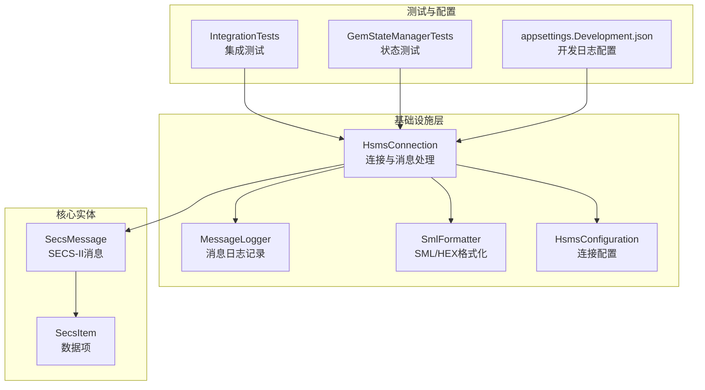
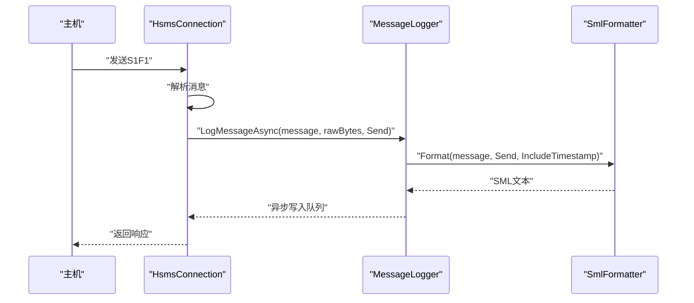
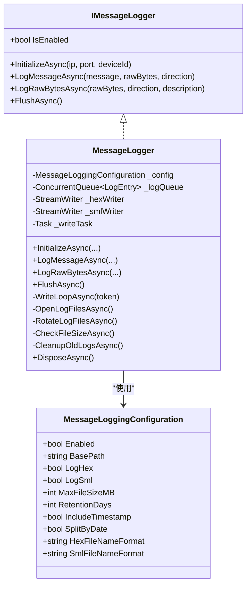
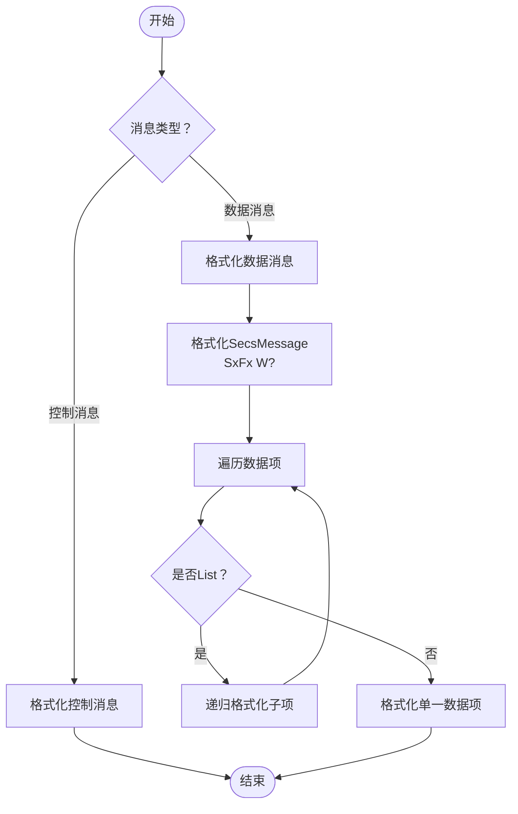
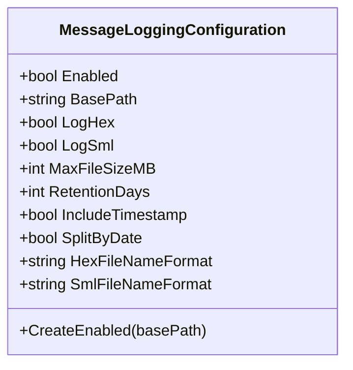
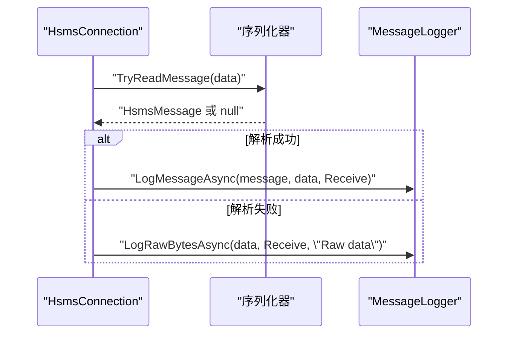
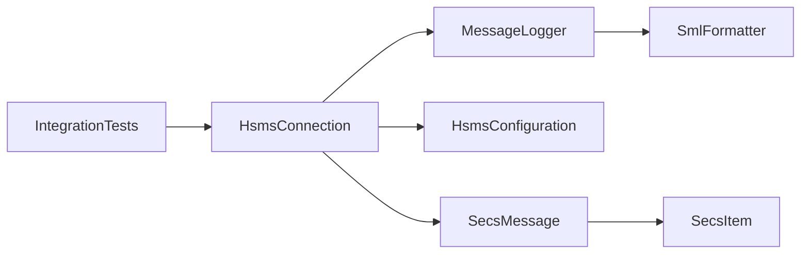

# 调试工具和技巧

<cite>
**本文档引用的文件**
- [MessageLogger.cs](file://WebGem/SECS2GEM/Infrastructure/Logging/MessageLogger.cs)
- [MessageLoggingConfiguration.cs](file://WebGem/SECS2GEM/Infrastructure/Logging/MessageLoggingConfiguration.cs)
- [IMessageLogger.cs](file://WebGem/SECS2GEM/Infrastructure/Logging/IMessageLogger.cs)
- [SmlFormatter.cs](file://WebGem/SECS2GEM/Infrastructure/Logging/SmlFormatter.cs)
- [HsmsConnection.cs](file://WebGem/SECS2GEM/Infrastructure/Connection/HsmsConnection.cs)
- [HsmsConfiguration.cs](file://WebGem/SECS2GEM/Infrastructure/Configuration/HsmsConfiguration.cs)
- [SecsMessage.cs](file://WebGem/SECS2GEM/Core/Entities/SecsMessage.cs)
- [SecsItem.cs](file://WebGem/SECS2GEM/Core/Entities/SecsItem.cs)
- [MessageContext.cs](file://WebGem/SECS2GEM/Infrastructure/Connection/MessageContext.cs)
- [IntegrationTests.cs](file://WebGem/SECS2GEM.Tests/IntegrationTests.cs)
- [GemStateManagerTests.cs](file://WebGem/SECS2GEM.Tests/GemStateManagerTests.cs)
- [appsettings.Development.json](file://WebGem/WebGem/appsettings.Development.json)
- [SECS2GEM.csproj](file://WebGem/SECS2GEM/SECS2GEM.csproj)
</cite>

## 目录
1. [简介](#简介)
2. [项目结构](#项目结构)
3. [核心组件](#核心组件)
4. [架构总览](#架构总览)
5. [详细组件分析](#详细组件分析)
6. [依赖关系分析](#依赖关系分析)
7. [性能考虑](#性能考虑)
8. [故障排除指南](#故障排除指南)
9. [结论](#结论)
10. [附录](#附录)

## 简介
本指南面向SECS2GEM项目的开发者与运维人员，聚焦于调试工具与技巧，涵盖以下主题：
- MessageLogger日志系统：使用方法、配置选项与最佳实践
- SML格式消息的查看与分析技巧
- MessageLoggingConfiguration日志级别与过滤规则
- 断点调试、异常跟踪与性能分析
- 在Visual Studio与其他IDE中的调试配置
- 日志分析与问题定位的实用工具与脚本建议

## 项目结构
SECS2GEM采用分层架构，核心通信逻辑集中在基础设施层，日志与序列化、连接管理、配置等模块相互协作。与调试相关的关键模块包括：
- 日志系统：Infrastructure/Logging（MessageLogger、MessageLoggingConfiguration、SmlFormatter）
- 连接与消息处理：Infrastructure/Connection（HsmsConnection、MessageContext）
- 协议实体：Core/Entities（SecsMessage、SecsItem）
- 配置：Infrastructure/Configuration（HsmsConfiguration）
- 测试与示例：SECS2GEM.Tests（集成测试、状态管理测试）

**图表来源**
- [HsmsConnection.cs:120-140](file://WebGem/SECS2GEM/Infrastructure/Connection/HsmsConnection.cs#L120-L140)
- [MessageLogger.cs:23-60](file://WebGem/SECS2GEM/Infrastructure/Logging/MessageLogger.cs#L23-L60)
- [SmlFormatter.cs:23-54](file://WebGem/SECS2GEM/Infrastructure/Logging/SmlFormatter.cs#L23-L54)
- [HsmsConfiguration.cs:15-133](file://WebGem/SECS2GEM/Infrastructure/Configuration/HsmsConfiguration.cs#L15-L133)
- [SecsMessage.cs:18-104](file://WebGem/SECS2GEM/Core/Entities/SecsMessage.cs#L18-L104)
- [SecsItem.cs:23-66](file://WebGem/SECS2GEM/Core/Entities/SecsItem.cs#L23-L66)
- [IntegrationTests.cs:14-38](file://WebGem/SECS2GEM.Tests/IntegrationTests.cs#L14-L38)
- [GemStateManagerTests.cs:10-17](file://WebGem/SECS2GEM.Tests/GemStateManagerTests.cs#L10-L17)
- [appsettings.Development.json:1-8](file://WebGem/WebGem/appsettings.Development.json#L1-L8)

**章节来源**
- [HsmsConnection.cs:120-140](file://WebGem/SECS2GEM/Infrastructure/Connection/HsmsConnection.cs#L120-L140)
- [MessageLogger.cs:23-60](file://WebGem/SECS2GEM/Infrastructure/Logging/MessageLogger.cs#L23-L60)
- [SmlFormatter.cs:23-54](file://WebGem/SECS2GEM/Infrastructure/Logging/SmlFormatter.cs#L23-L54)
- [HsmsConfiguration.cs:15-133](file://WebGem/SECS2GEM/Infrastructure/Configuration/HsmsConfiguration.cs#L15-L133)
- [SecsMessage.cs:18-104](file://WebGem/SECS2GEM/Core/Entities/SecsMessage.cs#L18-L104)
- [SecsItem.cs:23-66](file://WebGem/SECS2GEM/Core/Entities/SecsItem.cs#L23-L66)
- [IntegrationTests.cs:14-38](file://WebGem/SECS2GEM.Tests/IntegrationTests.cs#L14-L38)
- [GemStateManagerTests.cs:10-17](file://WebGem/SECS2GEM.Tests/GemStateManagerTests.cs#L10-L17)
- [appsettings.Development.json:1-8](file://WebGem/WebGem/appsettings.Development.json#L1-L8)

## 核心组件
本节聚焦调试相关的四大核心组件及其职责：
- MessageLogger：异步消息日志记录器，支持HEX与SML双格式输出，具备文件轮转、保留期清理、时间戳控制等能力
- MessageLoggingConfiguration：日志配置对象，控制启用状态、输出格式、文件大小、保留期、时间戳与日期分割等
- SmlFormatter：SML/HEX格式化器，将消息与数据项转换为人类可读的文本格式
- HsmsConnection：HSMS连接实现，负责消息发送/接收、事务管理、心跳与异常处理，并在关键节点调用日志记录

**章节来源**
- [MessageLogger.cs:23-114](file://WebGem/SECS2GEM/Infrastructure/Logging/MessageLogger.cs#L23-L114)
- [MessageLoggingConfiguration.cs:10-81](file://WebGem/SECS2GEM/Infrastructure/Logging/MessageLoggingConfiguration.cs#L10-L81)
- [SmlFormatter.cs:23-54](file://WebGem/SECS2GEM/Infrastructure/Logging/SmlFormatter.cs#L23-L54)
- [HsmsConnection.cs:650-688](file://WebGem/SECS2GEM/Infrastructure/Connection/HsmsConnection.cs#L650-L688)

## 架构总览
SECS2GEM的调试相关架构围绕“连接-消息-日志”主线展开。HsmsConnection在消息收发过程中调用MessageLogger进行记录；SmlFormatter负责将消息与数据项格式化为SML或HEX文本；MessageLoggingConfiguration贯穿于连接配置与日志记录器初始化。

**图表来源**
- [HsmsConnection.cs:650-688](file://WebGem/SECS2GEM/Infrastructure/Connection/HsmsConnection.cs#L650-L688)
- [MessageLogger.cs:99-114](file://WebGem/SECS2GEM/Infrastructure/Logging/MessageLogger.cs#L99-L114)
- [SmlFormatter.cs:28-54](file://WebGem/SECS2GEM/Infrastructure/Logging/SmlFormatter.cs#L28-L54)

## 详细组件分析

### MessageLogger日志系统
MessageLogger采用生产者-消费者模式，使用并发队列与后台任务异步写入，避免阻塞主通信线程。其特性包括：
- 目录结构：按{BasePath}/{IP}-{Port}-{DeviceId}/组织日志
- 文件轮转：支持按日期分割与文件大小限制
- 输出格式：可独立开启/关闭HEX与SML输出
- 时间戳：可选包含时间戳
- 清理策略：按保留天数自动删除旧文件

**图表来源**
- [IMessageLogger.cs:23-68](file://WebGem/SECS2GEM/Infrastructure/Logging/IMessageLogger.cs#L23-L68)
- [MessageLogger.cs:23-94](file://WebGem/SECS2GEM/Infrastructure/Logging/MessageLogger.cs#L23-L94)
- [MessageLoggingConfiguration.cs:10-81](file://WebGem/SECS2GEM/Infrastructure/Logging/MessageLoggingConfiguration.cs#L10-L81)

**章节来源**
- [MessageLogger.cs:23-438](file://WebGem/SECS2GEM/Infrastructure/Logging/MessageLogger.cs#L23-L438)
- [IMessageLogger.cs:23-68](file://WebGem/SECS2GEM/Infrastructure/Logging/IMessageLogger.cs#L23-L68)
- [MessageLoggingConfiguration.cs:10-81](file://WebGem/SECS2GEM/Infrastructure/Logging/MessageLoggingConfiguration.cs#L10-L81)

### SML格式消息查看与分析
SmlFormatter提供两类格式化能力：
- SML格式：将SecsMessage与SecsItem树形结构转换为标准SML文本，便于阅读与比对
- HEX格式：将原始字节以十六进制与ASCII形式展示，便于底层协议分析

SML格式要点：
- Stream/Function/W-Bit与数据项层级清晰
- 字符串、二进制、布尔、整数、浮点等格式均能正确呈现
- 支持转义与截断显示（长二进制数据）

**图表来源**
- [SmlFormatter.cs:76-141](file://WebGem/SECS2GEM/Infrastructure/Logging/SmlFormatter.cs#L76-L141)
- [SecsMessage.cs:18-104](file://WebGem/SECS2GEM/Core/Entities/SecsMessage.cs#L18-L104)
- [SecsItem.cs:23-66](file://WebGem/SECS2GEM/Core/Entities/SecsItem.cs#L23-L66)

**章节来源**
- [SmlFormatter.cs:28-322](file://WebGem/SECS2GEM/Infrastructure/Logging/SmlFormatter.cs#L28-L322)
- [SecsMessage.cs:18-104](file://WebGem/SECS2GEM/Core/Entities/SecsMessage.cs#L18-L104)
- [SecsItem.cs:23-66](file://WebGem/SECS2GEM/Core/Entities/SecsItem.cs#L23-L66)

### MessageLoggingConfiguration配置详解
关键配置项与行为：
- Enabled：全局开关
- BasePath：日志根目录
- LogHex/LogSml：分别控制HEX与SML输出
- MaxFileSizeMB：单文件最大大小，超限触发轮转
- RetentionDays：日志保留天数，0表示不清理
- IncludeTimestamp：是否包含时间戳
- SplitByDate：是否按日期分割文件
- HexFileNameFormat/SmlFileNameFormat：文件名模板

**图表来源**
- [MessageLoggingConfiguration.cs:10-81](file://WebGem/SECS2GEM/Infrastructure/Logging/MessageLoggingConfiguration.cs#L10-L81)

**章节来源**
- [MessageLoggingConfiguration.cs:10-81](file://WebGem/SECS2GEM/Infrastructure/Logging/MessageLoggingConfiguration.cs#L10-L81)

### HsmsConnection与日志集成
HsmsConnection在以下关键节点调用日志记录：
- 发送消息后记录发送日志（LogSentMessageAsync）
- 接收消息后记录接收日志（LogReceivedMessageAsync）
- 初始化时根据配置调用MessageLogger.InitializeAsync

**图表来源**
- [HsmsConnection.cs:570-688](file://WebGem/SECS2GEM/Infrastructure/Connection/HsmsConnection.cs#L570-L688)

**章节来源**
- [HsmsConnection.cs:570-688](file://WebGem/SECS2GEM/Infrastructure/Connection/HsmsConnection.cs#L570-L688)

### MessageContext与上下文调试
MessageContext在处理主消息时提供回复能力与上下文信息（SystemBytes、DeviceId、ReceivedTime等），便于在调试时追踪消息来源与生命周期。

**章节来源**
- [MessageContext.cs:12-63](file://WebGem/SECS2GEM/Infrastructure/Connection/MessageContext.cs#L12-L63)

## 依赖关系分析
- HsmsConnection依赖MessageLogger进行日志记录，依赖HsmsConfiguration进行连接参数与日志配置传递
- MessageLogger依赖SmlFormatter进行SML/HEX格式化
- SecsMessage与SecsItem为日志内容的核心载体
- 测试用例通过IntegrationTests验证连接与消息流程，辅助调试

**图表来源**
- [HsmsConnection.cs:120-140](file://WebGem/SECS2GEM/Infrastructure/Connection/HsmsConnection.cs#L120-L140)
- [MessageLogger.cs:23-60](file://WebGem/SECS2GEM/Infrastructure/Logging/MessageLogger.cs#L23-L60)
- [SmlFormatter.cs:23-54](file://WebGem/SECS2GEM/Infrastructure/Logging/SmlFormatter.cs#L23-L54)
- [HsmsConfiguration.cs:15-133](file://WebGem/SECS2GEM/Infrastructure/Configuration/HsmsConfiguration.cs#L15-L133)
- [SecsMessage.cs:18-104](file://WebGem/SECS2GEM/Core/Entities/SecsMessage.cs#L18-L104)
- [SecsItem.cs:23-66](file://WebGem/SECS2GEM/Core/Entities/SecsItem.cs#L23-L66)
- [IntegrationTests.cs:14-38](file://WebGem/SECS2GEM.Tests/IntegrationTests.cs#L14-L38)

**章节来源**
- [HsmsConnection.cs:120-140](file://WebGem/SECS2GEM/Infrastructure/Connection/HsmsConnection.cs#L120-L140)
- [MessageLogger.cs:23-60](file://WebGem/SECS2GEM/Infrastructure/Logging/MessageLogger.cs#L23-L60)
- [SmlFormatter.cs:23-54](file://WebGem/SECS2GEM/Infrastructure/Logging/SmlFormatter.cs#L23-L54)
- [HsmsConfiguration.cs:15-133](file://WebGem/SECS2GEM/Infrastructure/Configuration/HsmsConfiguration.cs#L15-L133)
- [SecsMessage.cs:18-104](file://WebGem/SECS2GEM/Core/Entities/SecsMessage.cs#L18-L104)
- [SecsItem.cs:23-66](file://WebGem/SECS2GEM/Core/Entities/SecsItem.cs#L23-L66)
- [IntegrationTests.cs:14-38](file://WebGem/SECS2GEM.Tests/IntegrationTests.cs#L14-L38)

## 性能考虑
- 异步写入：MessageLogger使用后台任务与信号量控制，降低日志写入对主通信线程的影响
- 批量刷新：后台循环批量写入并定时刷新，减少频繁IO
- 文件轮转：基于大小与日期的轮转策略，避免单文件过大影响性能
- 缓冲区与队列：使用ConcurrentQueue与Channel优化并发场景下的吞吐

**章节来源**
- [MessageLogger.cs:176-223](file://WebGem/SECS2GEM/Infrastructure/Logging/MessageLogger.cs#L176-L223)
- [HsmsConnection.cs:405-418](file://WebGem/SECS2GEM/Infrastructure/Connection/HsmsConnection.cs#L405-L418)

## 故障排除指南
常见问题与排查步骤：
- 无法看到日志文件
  - 检查MessageLoggingConfiguration.Enabled与BasePath
  - 确认HsmsConnection初始化时调用了InitializeAsync
  - 查看日志目录权限与磁盘空间
- SML/HEX输出为空
  - 检查LogHex/LogSml开关
  - 确认IncludeTimestamp与SplitByDate设置
- 日志文件过大或未轮转
  - 调整MaxFileSizeMB与SplitByDate
  - 检查RetentionDays与CleanupOldLogsAsync执行情况
- 消息解析失败
  - 使用LogRawBytesAsync记录原始字节，结合SmlFormatter.FormatHex进行分析
- 连接异常与断开
  - 关注HsmsConnection中的异常捕获与DisconnectAsync流程
  - 检查T7/T6等超时配置与心跳失败阈值

**章节来源**
- [MessageLogger.cs:368-395](file://WebGem/SECS2GEM/Infrastructure/Logging/MessageLogger.cs#L368-L395)
- [HsmsConnection.cs:298-400](file://WebGem/SECS2GEM/Infrastructure/Connection/HsmsConnection.cs#L298-L400)
- [HsmsConfiguration.cs:178-199](file://WebGem/SECS2GEM/Infrastructure/Configuration/HsmsConfiguration.cs#L178-L199)

## 结论
SECS2GEM提供了完善的日志与消息格式化能力，配合灵活的配置选项与异步写入机制，能够满足复杂工业通信场景下的调试需求。通过合理配置MessageLoggingConfiguration、利用SmlFormatter进行消息分析、结合HsmsConnection的调试点与测试用例，可以高效定位问题并优化性能。

## 附录

### 在Visual Studio中调试SECS2GEM项目
- 启动配置
  - 使用WebGem.slnx解决方案打开项目
  - 在SECS2GEM.Simulator或WebGem中设置启动项目
- 断点调试
  - 在HsmsConnection的接收/发送循环、消息处理分支设置断点
  - 在MessageLogger的写入循环与文件轮转逻辑设置断点
- 异常跟踪
  - 在HsmsConnection的ReceiveLoopAsync与SendLoopAsync中捕获异常
  - 使用Call Stack查看调用链路
- 性能分析
  - 使用.NET Profiler或性能探查器分析MessageLogger写入热点
  - 关注WriteLoopAsync与FlushAsync的执行频率

**章节来源**
- [HsmsConnection.cs:547-725](file://WebGem/SECS2GEM/Infrastructure/Connection/HsmsConnection.cs#L547-L725)
- [MessageLogger.cs:176-223](file://WebGem/SECS2GEM/Infrastructure/Logging/MessageLogger.cs#L176-L223)

### 日志分析与问题定位工具与脚本建议
- 文本搜索
  - 使用正则表达式匹配SML中的SxFx模式，快速定位特定消息
  - 搜索HEX文件中的特定字节序列，定位异常帧
- 分割与合并
  - 使用文件轮转后的日期后缀进行分段分析
  - 对多日志文件进行合并，形成完整会话视图
- 自动化脚本
  - Python/PowerShell脚本统计SML中各消息出现频次
  - 统计HEX文件中错误帧比例与分布，辅助定位网络问题

[本节为通用实践建议，无需特定源码引用]