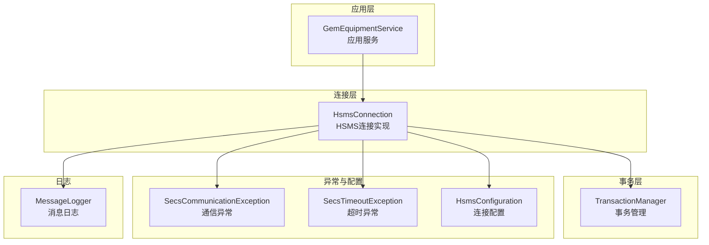
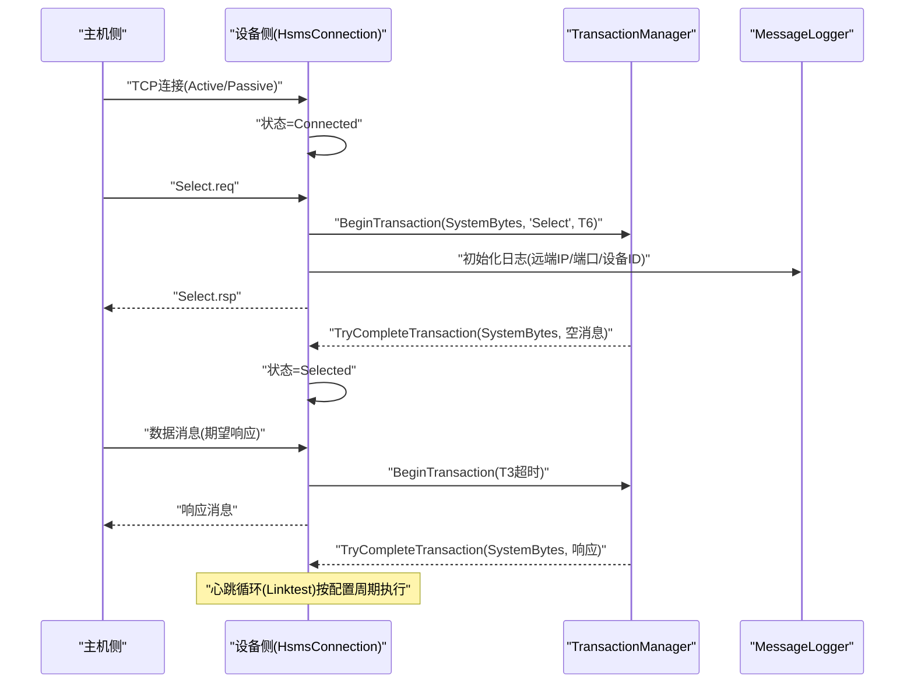
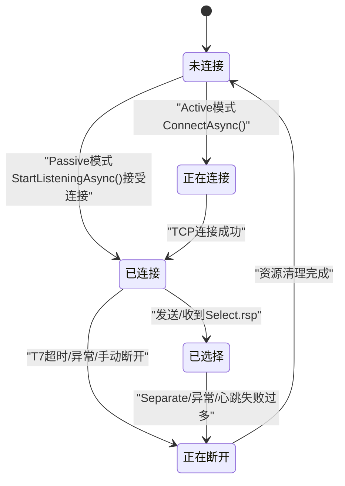
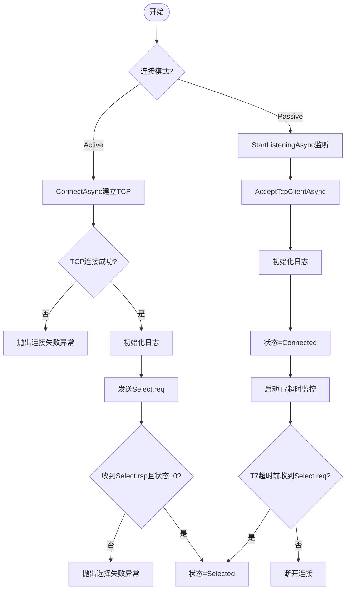
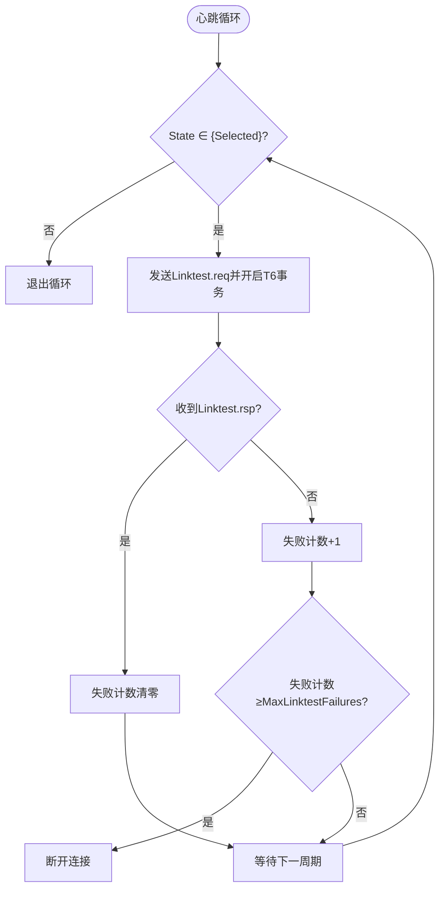
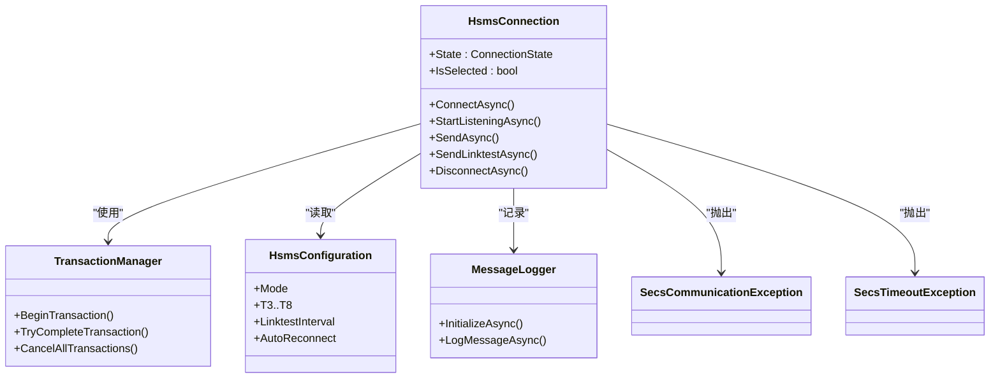

# 连接问题

<cite>
**本文引用的文件**
- [ConnectionState.cs](file://WebGem/SECS2GEM/Core/Enums/ConnectionState.cs)
- [HsmsConnection.cs](file://WebGem/SECS2GEM/Infrastructure/Connection/HsmsConnection.cs)
- [ISecsConnection.cs](file://WebGem/SECS2GEM/Domain/Interfaces/ISecsConnection.cs)
- [HsmsConfiguration.cs](file://WebGem/SECS2GEM/Infrastructure/Configuration/HsmsConfiguration.cs)
- [SecsCommunicationException.cs](file://WebGem/SECS2GEM/Core/Exceptions/SecsCommunicationException.cs)
- [SecsTimeoutException.cs](file://WebGem/SECS2GEM/Core/Exceptions/SecsTimeoutException.cs)
- [TransactionManager.cs](file://WebGem/SECS2GEM/Infrastructure/Services/TransactionManager.cs)
- [GemEquipmentService.cs](file://WebGem/SECS2GEM/Application/Services/GemEquipmentService.cs)
- [MessageLogger.cs](file://WebGem/SECS2GEM/Infrastructure/Logging/MessageLogger.cs)
- [IntegrationTests.cs](file://WebGem/SECS2GEM.Tests/IntegrationTests.cs)
</cite>

## 目录
1. [简介](#简介)
2. [项目结构](#项目结构)
3. [核心组件](#核心组件)
4. [架构总览](#架构总览)
5. [详细组件分析](#详细组件分析)
6. [依赖关系分析](#依赖关系分析)
7. [性能考量](#性能考量)
8. [故障排除指南](#故障排除指南)
9. [结论](#结论)
10. [附录](#附录)

## 简介
本指南聚焦于SECS2GEM在HSMS连接阶段与运行期常见的连接问题，覆盖HSMS连接失败、连接超时、网络中断、心跳失败、选择失败等典型场景。文档基于代码库中的连接实现、状态机、异常体系与配置项，提供可操作的诊断步骤、错误码与状态含义、重试与恢复策略，以及连接监控与健康检查最佳实践。

## 项目结构
SECS2GEM围绕“连接-事务-消息-日志”四个维度组织代码：
- 连接层：负责TCP连接、HSMS会话建立、心跳与断开
- 事务层：负责消息级事务的创建、等待、超时与完成
- 异常层：统一抽象通信与超时错误类型
- 配置层：集中管理网络、超时、心跳、缓冲区与自动重连等参数
- 日志层：异步记录消息与原始字节，辅助排障

图表来源
- [HsmsConnection.cs:30-139](file://WebGem/SECS2GEM/Infrastructure/Connection/HsmsConnection.cs#L30-L139)
- [TransactionManager.cs:24-118](file://WebGem/SECS2GEM/Infrastructure/Services/TransactionManager.cs#L24-L118)
- [HsmsConfiguration.cs:15-228](file://WebGem/SECS2GEM/Infrastructure/Configuration/HsmsConfiguration.cs#L15-L228)
- [MessageLogger.cs:23-94](file://WebGem/SECS2GEM/Infrastructure/Logging/MessageLogger.cs#L23-L94)
- [SecsCommunicationException.cs:64-152](file://WebGem/SECS2GEM/Core/Exceptions/SecsCommunicationException.cs#L64-L152)
- [SecsTimeoutException.cs:57-160](file://WebGem/SECS2GEM/Core/Exceptions/SecsTimeoutException.cs#L57-L160)

章节来源
- [HsmsConnection.cs:13-139](file://WebGem/SECS2GEM/Infrastructure/Connection/HsmsConnection.cs#L13-L139)
- [HsmsConfiguration.cs:15-228](file://WebGem/SECS2GEM/Infrastructure/Configuration/HsmsConfiguration.cs#L15-L228)

## 核心组件
- 连接状态机：ConnectionState定义了NotConnected、Connecting、Connected、Selected、Disconnecting五种状态，严格遵循SEMI E37的HSMS生命周期。
- 连接接口：ISecsConnection定义了连接、断开、发送、心跳等能力，并提供状态变化与消息到达事件。
- 连接实现：HsmsConnection封装Active/Passive两种模式，内置Channel异步发送队列、心跳循环、T7超时监控与断开清理。
- 事务管理：TransactionManager负责事务ID生成、事务注册与超时回调，支撑T3/T6/T7/T8等超时语义。
- 异常体系：SecsCommunicationException与SecsTimeoutException分别承载连接/发送/接收/心跳失败与各类超时类型。
- 配置中心：HsmsConfiguration集中管理端口、模式、超时、心跳、缓冲区、自动重连与重连延迟等参数。
- 日志系统：MessageLogger异步写入HEX/SML日志，支持按日期与大小轮换，保留策略可配置。

章节来源
- [ConnectionState.cs:10-41](file://WebGem/SECS2GEM/Core/Enums/ConnectionState.cs#L10-L41)
- [ISecsConnection.cs:56-142](file://WebGem/SECS2GEM/Domain/Interfaces/ISecsConnection.cs#L56-L142)
- [HsmsConnection.cs:30-418](file://WebGem/SECS2GEM/Infrastructure/Connection/HsmsConnection.cs#L30-L418)
- [TransactionManager.cs:24-201](file://WebGem/SECS2GEM/Infrastructure/Services/TransactionManager.cs#L24-L201)
- [SecsCommunicationException.cs:64-152](file://WebGem/SECS2GEM/Core/Exceptions/SecsCommunicationException.cs#L64-L152)
- [SecsTimeoutException.cs:57-160](file://WebGem/SECS2GEM/Core/Exceptions/SecsTimeoutException.cs#L57-L160)
- [HsmsConfiguration.cs:15-228](file://WebGem/SECS2GEM/Infrastructure/Configuration/HsmsConfiguration.cs#L15-L228)
- [MessageLogger.cs:23-438](file://WebGem/SECS2GEM/Infrastructure/Logging/MessageLogger.cs#L23-L438)

## 架构总览
下图展示连接建立与数据通路的关键节点与交互：

图表来源
- [HsmsConnection.cs:146-186](file://WebGem/SECS2GEM/Infrastructure/Connection/HsmsConnection.cs#L146-L186)
- [HsmsConnection.cs:520-541](file://WebGem/SECS2GEM/Infrastructure/Connection/HsmsConnection.cs#L520-L541)
- [HsmsConnection.cs:747-791](file://WebGem/SECS2GEM/Infrastructure/Connection/HsmsConnection.cs#L747-L791)
- [TransactionManager.cs:46-72](file://WebGem/SECS2GEM/Infrastructure/Services/TransactionManager.cs#L46-L72)
- [MessageLogger.cs:65-94](file://WebGem/SECS2GEM/Infrastructure/Logging/MessageLogger.cs#L65-L94)

## 详细组件分析

### 连接状态机与状态含义
- NotConnected：TCP未建立，初始态；断开或异常后回到此状态。
- Connecting（仅Active）：主动发起TCP连接中；成功后进入Connected。
- Connected：TCP已建立，尚未完成HSMS会话；Passive端接受到连接即进入；Active端发送Select.req后进入Selected。
- Selected：HSMS会话建立，可进行数据通信；心跳正常时保持。
- Disconnecting：正在断开，发送Separate请求并清理资源。

图表来源
- [ConnectionState.cs:10-41](file://WebGem/SECS2GEM/Core/Enums/ConnectionState.cs#L10-L41)
- [HsmsConnection.cs:146-186](file://WebGem/SECS2GEM/Infrastructure/Connection/HsmsConnection.cs#L146-L186)
- [HsmsConnection.cs:280-296](file://WebGem/SECS2GEM/Infrastructure/Connection/HsmsConnection.cs#L280-L296)
- [HsmsConnection.cs:747-791](file://WebGem/SECS2GEM/Infrastructure/Connection/HsmsConnection.cs#L747-L791)

章节来源
- [ConnectionState.cs:10-41](file://WebGem/SECS2GEM/Core/Enums/ConnectionState.cs#L10-L41)
- [HsmsConnection.cs:64-78](file://WebGem/SECS2GEM/Infrastructure/Connection/HsmsConnection.cs#L64-L78)

### 连接建立流程与关键错误
- Active模式：ConnectAsync建立TCP，初始化日志，发送Select.req并等待Select.rsp；失败时回滚至NotConnected并抛出通信异常。
- Passive模式：StartListeningAsync启动监听，AcceptTcpClientAsync接受连接，初始化日志；进入Connected后启动T7超时监控，若超时未收到Select.req则断开。
- 选择失败：当收到Select.rsp携带非0状态码时，视为SelectFailed；应用侧可据此决定重试或告警。
- 未选择发送：在Selected前发送数据会触发NotSelected异常。

图表来源
- [HsmsConnection.cs:146-186](file://WebGem/SECS2GEM/Infrastructure/Connection/HsmsConnection.cs#L146-L186)
- [HsmsConnection.cs:191-296](file://WebGem/SECS2GEM/Infrastructure/Connection/HsmsConnection.cs#L191-L296)
- [HsmsConnection.cs:747-764](file://WebGem/SECS2GEM/Infrastructure/Connection/HsmsConnection.cs#L747-L764)
- [SecsCommunicationException.cs:114-141](file://WebGem/SECS2GEM/Core/Exceptions/SecsCommunicationException.cs#L114-L141)

章节来源
- [HsmsConnection.cs:146-186](file://WebGem/SECS2GEM/Infrastructure/Connection/HsmsConnection.cs#L146-L186)
- [HsmsConnection.cs:191-296](file://WebGem/SECS2GEM/Infrastructure/Connection/HsmsConnection.cs#L191-L296)
- [SecsCommunicationException.cs:114-141](file://WebGem/SECS2GEM/Core/Exceptions/SecsCommunicationException.cs#L114-L141)

### 超时类型与错误码
- T3回复超时：发送Primary消息后等待Secondary响应超时，抛出T3Reply超时异常。
- T6控制超时：Select/Deselect/Linktest等控制消息响应超时，抛出T6Control超时异常。
- T7未选择超时：TCP已连接但Passive端在T7时间内未收到Select.req，断开连接。
- T8网络字符间隔超时：消息传输中字符间隔超限，体现为接收异常。
- 连接超时：TCP连接建立超时，抛出Connect超时异常。
- 通信错误类型：
  - ConnectionFailed：TCP连接失败
  - SelectFailed：Select请求被拒绝
  - NotSelected：在未Selected状态下发送数据
  - LinktestFailed：心跳请求无响应

章节来源
- [SecsTimeoutException.cs:6-48](file://WebGem/SECS2GEM/Core/Exceptions/SecsTimeoutException.cs#L6-L48)
- [SecsTimeoutException.cs:129-159](file://WebGem/SECS2GEM/Core/Exceptions/SecsTimeoutException.cs#L129-L159)
- [SecsCommunicationException.cs:6-55](file://WebGem/SECS2GEM/Core/Exceptions/SecsCommunicationException.cs#L6-L55)
- [SecsCommunicationException.cs:114-151](file://WebGem/SECS2GEM/Core/Exceptions/SecsCommunicationException.cs#L114-L151)

### 心跳与断开机制
- 心跳：Selected状态下按配置周期发送Linktest.req并等待响应；失败计数达到阈值后断开。
- 分离：收到Separate.req或主动调用DisconnectAsync时，先尝试发送Separate请求，随后清理资源并进入NotConnected。
- T7超时：Passive端在Connected状态下等待Select.req，超时则断开。

图表来源
- [HsmsConnection.cs:693-723](file://WebGem/SECS2GEM/Infrastructure/Connection/HsmsConnection.cs#L693-L723)
- [HsmsConnection.cs:775-786](file://WebGem/SECS2GEM/Infrastructure/Connection/HsmsConnection.cs#L775-L786)
- [HsmsConnection.cs:301-337](file://WebGem/SECS2GEM/Infrastructure/Connection/HsmsConnection.cs#L301-L337)

章节来源
- [HsmsConnection.cs:693-723](file://WebGem/SECS2GEM/Infrastructure/Connection/HsmsConnection.cs#L693-L723)
- [HsmsConnection.cs:301-337](file://WebGem/SECS2GEM/Infrastructure/Connection/HsmsConnection.cs#L301-L337)

## 依赖关系分析
- HsmsConnection依赖配置、序列化、事务管理、消息日志与异常类型。
- TransactionManager为消息级事务提供超时与完成回调，支撑T3/T6/T7/T8语义。
- 应用层通过GemEquipmentService暴露IsConnected（基于HsmsConnection.IsSelected）与设备状态。

图表来源
- [HsmsConnection.cs:30-139](file://WebGem/SECS2GEM/Infrastructure/Connection/HsmsConnection.cs#L30-L139)
- [TransactionManager.cs:24-118](file://WebGem/SECS2GEM/Infrastructure/Services/TransactionManager.cs#L24-L118)
- [HsmsConfiguration.cs:15-228](file://WebGem/SECS2GEM/Infrastructure/Configuration/HsmsConfiguration.cs#L15-L228)
- [MessageLogger.cs:23-94](file://WebGem/SECS2GEM/Infrastructure/Logging/MessageLogger.cs#L23-L94)
- [SecsCommunicationException.cs:64-152](file://WebGem/SECS2GEM/Core/Exceptions/SecsCommunicationException.cs#L64-L152)
- [SecsTimeoutException.cs:57-160](file://WebGem/SECS2GEM/Core/Exceptions/SecsTimeoutException.cs#L57-L160)

章节来源
- [GemEquipmentService.cs:36-79](file://WebGem/SECS2GEM/Application/Services/GemEquipmentService.cs#L36-L79)
- [HsmsConnection.cs:64-83](file://WebGem/SECS2GEM/Infrastructure/Connection/HsmsConnection.cs#L64-L83)

## 性能考量
- 异步I/O与Channel：发送队列采用无界Channel，避免阻塞；接收/发送/心跳三任务并发，提升吞吐。
- 缓冲区大小：ReceiveBufferSize与SendBufferSize可调，默认64KB，可根据网络环境与消息大小调整。
- 心跳与T7：合理的心跳间隔与最大失败次数可降低无效连接占用；T7超时避免被动端长时间悬挂。
- 日志异步：MessageLogger后台写入，避免影响主通信线程；建议按需开启HEX/SML与轮换策略。

章节来源
- [HsmsConnection.cs:405-418](file://WebGem/SECS2GEM/Infrastructure/Connection/HsmsConnection.cs#L405-L418)
- [HsmsConfiguration.cs:102-114](file://WebGem/SECS2GEM/Infrastructure/Configuration/HsmsConfiguration.cs#L102-L114)
- [MessageLogger.cs:176-223](file://WebGem/SECS2GEM/Infrastructure/Logging/MessageLogger.cs#L176-L223)

## 故障排除指南

### 一、HSMS连接失败（TCP无法建立）
- 现象
  - Active模式ConnectAsync抛出连接失败异常
  - Passive模式StartListeningAsync后无连接接入
- 诊断步骤
  - 检查IP/端口配置与可达性（Ping/Telnet/Netstat）
  - 确认防火墙/安全组放行端口
  - 核对设备ID与会话一致性
  - 查看日志目录与权限（MessageLogger初始化）
- 解决方案
  - 修正IP/端口与设备ID
  - 开启防火墙相应端口
  - 调整T3/T6/T7等超时参数以适配网络延迟
  - 启用消息日志定位握手阶段问题

章节来源
- [HsmsConnection.cs:146-186](file://WebGem/SECS2GEM/Infrastructure/Connection/HsmsConnection.cs#L146-L186)
- [HsmsConnection.cs:191-213](file://WebGem/SECS2GEM/Infrastructure/Connection/HsmsConnection.cs#L191-L213)
- [SecsCommunicationException.cs:114-121](file://WebGem/SECS2GEM/Core/Exceptions/SecsCommunicationException.cs#L114-L121)
- [MessageLogger.cs:65-94](file://WebGem/SECS2GEM/Infrastructure/Logging/MessageLogger.cs#L65-L94)

### 二、连接超时（T3/T6/T7/连接超时）
- 现象
  - 发送数据后等待响应超时（T3Reply）
  - 控制消息（Select/Deselect/Linktest）无响应（T6Control）
  - Passive端在T7内未收到Select.req（T7NotSelected）
  - TCP连接建立超时（Connect）
- 诊断步骤
  - 检查对端是否正确处理Select请求
  - 观察心跳是否持续（Linktest往返）
  - 核对T3/T6/T7/T8配置是否过短
  - 使用抓包工具确认消息往返
- 解决方案
  - 适当增大T3/T6/T7/T8与心跳间隔
  - 优化网络路径与MTU
  - 在应用层捕获超时异常并记录Reason

章节来源
- [SecsTimeoutException.cs:129-159](file://WebGem/SECS2GEM/Core/Exceptions/SecsTimeoutException.cs#L129-L159)
- [HsmsConnection.cs:280-296](file://WebGem/SECS2GEM/Infrastructure/Connection/HsmsConnection.cs#L280-L296)
- [HsmsConnection.cs:486-500](file://WebGem/SECS2GEM/Infrastructure/Connection/HsmsConnection.cs#L486-L500)

### 三、网络中断与心跳失败
- 现象
  - 心跳连续失败达到阈值后断开
  - 接收循环异常导致自动断开
- 诊断步骤
  - 检查链路稳定性与丢包率
  - 确认防火墙/代理未中断长连接
  - 查看心跳失败计数与最近一次Linktest往返
- 解决方案
  - 提高心跳间隔与最大失败次数
  - 启用自动重连（AutoReconnect）并设置合理T5
  - 增加日志级别以便快速定位

章节来源
- [HsmsConnection.cs:693-723](file://WebGem/SECS2GEM/Infrastructure/Connection/HsmsConnection.cs#L693-L723)
- [HsmsConnection.cs:595-609](file://WebGem/SECS2GEM/Infrastructure/Connection/HsmsConnection.cs#L595-L609)

### 四、选择失败（SelectFailed）
- 现象
  - Select.rsp返回非0状态码
- 诊断步骤
  - 检查设备是否处于可接受连接的状态
  - 确认设备ID与会话一致
- 解决方案
  - 修正设备状态或会话参数
  - 重试选择或检查对端实现

章节来源
- [SecsCommunicationException.cs:137-141](file://WebGem/SECS2GEM/Core/Exceptions/SecsCommunicationException.cs#L137-L141)
- [HsmsConnection.cs:751-757](file://WebGem/SECS2GEM/Infrastructure/Connection/HsmsConnection.cs#L751-L757)

### 五、未选择发送（NotSelected）
- 现象
  - 在Selected前发送数据抛出NotSelected异常
- 诊断步骤
  - 确认是否已完成Select流程
  - 检查应用层是否正确等待Selected状态
- 解决方案
  - 确保先发送Select请求并等待Select.rsp
  - 在应用层订阅StateChanged事件跟踪状态

章节来源
- [SecsCommunicationException.cs:146-151](file://WebGem/SECS2GEM/Core/Exceptions/SecsCommunicationException.cs#L146-L151)
- [ISecsConnection.cs:96-101](file://WebGem/SECS2GEM/Domain/Interfaces/ISecsConnection.cs#L96-L101)

### 六、网络配置检查清单
- 基础
  - IP/端口是否正确且可达
  - 防火墙/安全组放行端口
  - 设备ID与会话一致
- 超时与心跳
  - T3/T6/T7/T8是否过短
  - Linktest间隔与最大失败次数是否合理
- 缓冲区与性能
  - 接收/发送缓冲区大小是否合适
  - 日志是否开启及轮换策略
- 自动重连
  - AutoReconnect是否启用
  - T5重连延迟是否合理

章节来源
- [HsmsConfiguration.cs:17-228](file://WebGem/SECS2GEM/Infrastructure/Configuration/HsmsConfiguration.cs#L17-L228)
- [MessageLogger.cs:23-94](file://WebGem/SECS2GEM/Infrastructure/Logging/MessageLogger.cs#L23-L94)

### 七、连接重试机制与错误恢复策略
- 重试策略
  - AutoReconnect启用时，断开后按T5或自定义ReconnectDelay等待后重连
  - 对于T7未选择超时，断开后可立即重试或等待T5
- 恢复策略
  - 心跳失败过多：断开并清理资源，等待下次重连
  - 通信异常：记录异常类型与远程端点，必要时降级处理
- 最佳实践
  - 在应用层订阅StateChanged事件，记录状态变化与Reason
  - 对超时异常进行分类统计，动态调整超时参数

章节来源
- [HsmsConfiguration.cs:117-127](file://WebGem/SECS2GEM/Infrastructure/Configuration/HsmsConfiguration.cs#L117-L127)
- [HsmsConnection.cs:301-337](file://WebGem/SECS2GEM/Infrastructure/Connection/HsmsConnection.cs#L301-L337)
- [ISecsConnection.cs:96-101](file://WebGem/SECS2GEM/Domain/Interfaces/ISecsConnection.cs#L96-L101)

### 八、连接监控与健康检查最佳实践
- 监控指标
  - 连接状态（NotConnected/Connecting/Connected/Selected/Disconnecting）
  - 心跳成功率与失败计数
  - 事务活跃数与超时次数
  - 日志写入速率与文件大小
- 健康检查
  - 定期发送Linktest并记录往返
  - 检查T3/T6/T7/T8超时统计
  - 观察日志目录空间与轮换情况
- 告警与记录
  - 对异常断开与超时进行分级告警
  - 记录RemoteEndpoint与Reason便于溯源

章节来源
- [ISecsConnection.cs:96-101](file://WebGem/SECS2GEM/Domain/Interfaces/ISecsConnection.cs#L96-L101)
- [TransactionManager.cs:33-118](file://WebGem/SECS2GEM/Infrastructure/Services/TransactionManager.cs#L33-L118)
- [MessageLogger.cs:176-223](file://WebGem/SECS2GEM/Infrastructure/Logging/MessageLogger.cs#L176-L223)

## 结论
SECS2GEM的连接实现以清晰的状态机与完善的异常/超时体系为基础，结合异步I/O与心跳监控，能够稳定地处理HSMS连接生命周期中的各类问题。通过合理配置超时与心跳参数、启用自动重连与消息日志、并建立完善的监控与告警机制，可显著提升系统的可用性与可维护性。

## 附录

### A. 连接建立与数据通信集成测试要点
- 通过IntegrationTests验证：
  - 设备可接受连接（Passive模式）
  - Select请求与响应的正确性
  - S1F1/S1F13等消息的往返
  - Linktest心跳的响应
- 建议在测试中观察日志输出与状态变化事件，定位握手与数据阶段问题。

章节来源
- [IntegrationTests.cs:53-168](file://WebGem/SECS2GEM.Tests/IntegrationTests.cs#L53-L168)
- [MessageLogger.cs:99-145](file://WebGem/SECS2GEM/Infrastructure/Logging/MessageLogger.cs#L99-L145)