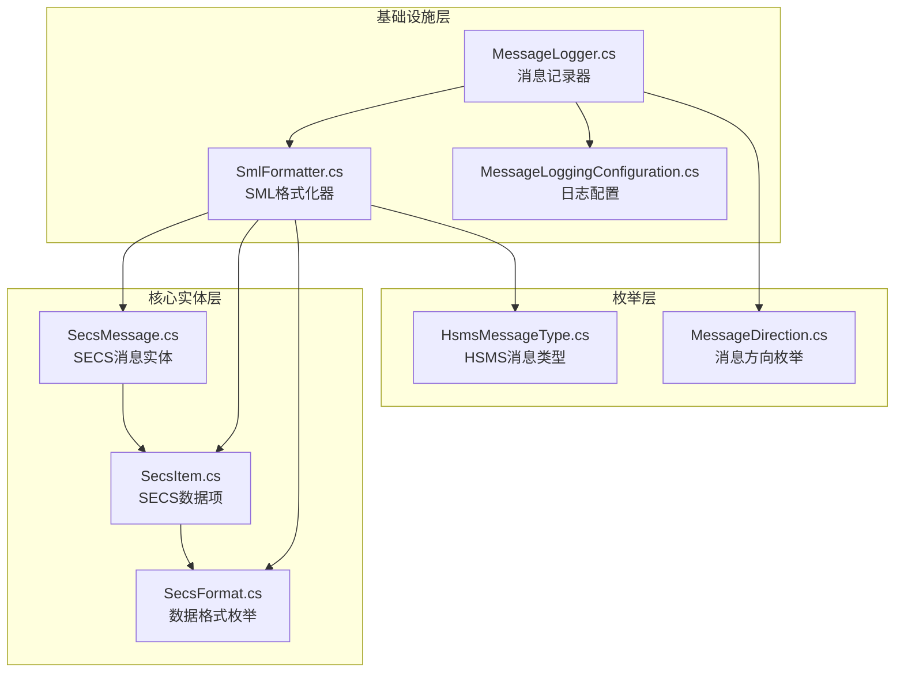
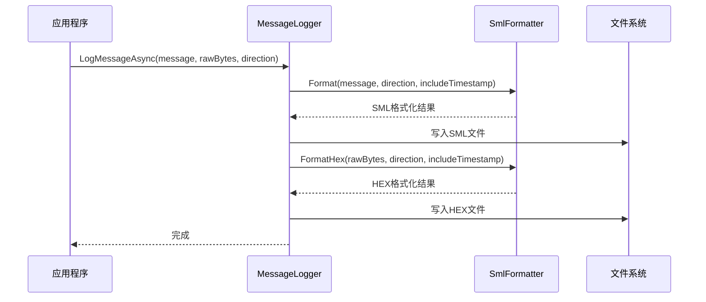
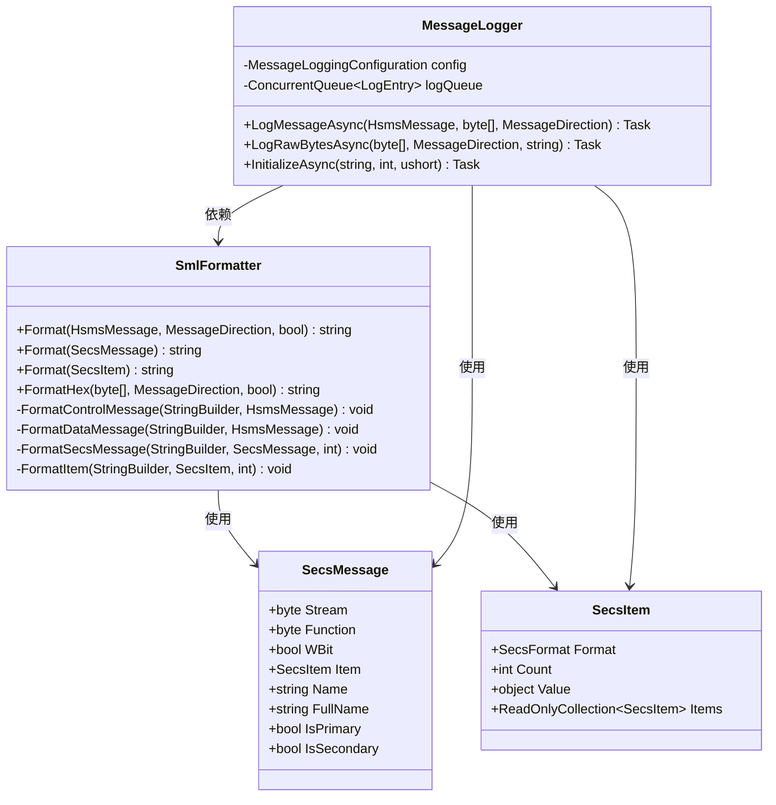

# SML格式化

<cite>
**本文档引用的文件**
- [SmlFormatter.cs](file://WebGem/SECS2GEM/Infrastructure/Logging/SmlFormatter.cs)
- [MessageLogger.cs](file://WebGem/SECS2GEM/Infrastructure/Logging/MessageLogger.cs)
- [MessageLoggingConfiguration.cs](file://WebGem/SECS2GEM/Infrastructure/Logging/MessageLoggingConfiguration.cs)
- [SecsMessage.cs](file://WebGem/SECS2GEM/Core/Entities/SecsMessage.cs)
- [SecsItem.cs](file://WebGem/SECS2GEM/Core/Entities/SecsItem.cs)
- [SecsFormat.cs](file://WebGem/SECS2GEM/Core/Enums/SecsFormat.cs)
- [HsmsMessageType.cs](file://WebGem/SECS2GEM/Core/Enums/HsmsMessageType.cs)
- [MessageReceivedEvent.cs](file://WebGem/SECS2GEM/Domain/Events/MessageReceivedEvent.cs)
- [SecsSerializer.cs](file://WebGem/SECS2GEM/Infrastructure/Serialization/SecsSerializer.cs)
- [messages_20260331.sml](file://WebGem/SECS2GEM.Simulator/bin/Debug/net9.0-windows/logs/127_0_0_1-5000-0/messages_20260331.sml)
</cite>

## 目录
1. [简介](#简介)
2. [项目结构](#项目结构)
3. [核心组件](#核心组件)
4. [架构概览](#架构概览)
5. [详细组件分析](#详细组件分析)
6. [依赖关系分析](#依赖关系分析)
7. [性能考虑](#性能考虑)
8. [故障排除指南](#故障排除指南)
9. [结论](#结论)
10. [附录](#附录)

## 简介

SML（SECS Message Language）是SECS协议的标准文本表示格式，用于以人类可读的方式展示SECS-II消息。本文档详细介绍了SECS2GEM项目中SML格式化的实现，包括SmlFormatter类的功能、SECS消息到SML格式的转换过程、SML格式的标准结构和语法规则。

SML格式化器提供了将HSMS消息转换为SML格式的能力，支持控制消息和数据消息的格式化输出。该实现遵循SEMI标准，确保与SECS-II协议的完全兼容性。

## 项目结构

SEML格式化功能主要分布在以下模块中：



**图表来源**
- [SmlFormatter.cs:1-322](file://WebGem/SECS2GEM/Infrastructure/Logging/SmlFormatter.cs#L1-L322)
- [MessageLogger.cs:1-438](file://WebGem/SECS2GEM/Infrastructure/Logging/MessageLogger.cs#L1-L438)
- [SecsMessage.cs:1-209](file://WebGem/SECS2GEM/Core/Entities/SecsMessage.cs#L1-L209)

**章节来源**
- [SmlFormatter.cs:1-322](file://WebGem/SECS2GEM/Infrastructure/Logging/SmlFormatter.cs#L1-L322)
- [MessageLogger.cs:1-438](file://WebGem/SECS2GEM/Infrastructure/Logging/MessageLogger.cs#L1-L438)

## 核心组件

### SmlFormatter类

SmlFormatter是SML格式化的核心类，提供了静态方法来格式化各种SECS消息类型。

#### 主要功能
- 将HSMS消息转换为SML格式
- 将SecsMessage对象转换为SML格式
- 将SecsItem对象转换为SML格式
- 格式化原始字节为HEX格式

#### 核心方法
- `Format(HsmsMessage, MessageDirection, bool)`: 格式化完整的HSMS消息
- `Format(SecsMessage)`: 格式化SECS消息
- `Format(SecsItem)`: 格式化数据项
- `FormatHex(byte[], MessageDirection, bool)`: 格式化字节为HEX

**章节来源**
- [SmlFormatter.cs:23-74](file://WebGem/SECS2GEM/Infrastructure/Logging/SmlFormatter.cs#L23-L74)

### MessageLogger类

MessageLogger实现了消息记录功能，使用生产者-消费者模式异步写入日志。

#### 主要特性
- 异步写入，避免阻塞通信线程
- 支持按日期分割文件
- 文件大小限制和自动轮换
- 支持HEX和SML两种格式的日志

**章节来源**
- [MessageLogger.cs:23-114](file://WebGem/SECS2GEM/Infrastructure/Logging/MessageLogger.cs#L23-L114)

### MessageLoggingConfiguration类

提供了消息日志的配置选项，包括启用/禁用、文件路径、格式选择等。

**章节来源**
- [MessageLoggingConfiguration.cs:10-81](file://WebGem/SECS2GEM/Infrastructure/Logging/MessageLoggingConfiguration.cs#L10-L81)

## 架构概览



**图表来源**
- [MessageLogger.cs:99-114](file://WebGem/SECS2GEM/Infrastructure/Logging/MessageLogger.cs#L99-L114)
- [SmlFormatter.cs:28-54](file://WebGem/SECS2GEM/Infrastructure/Logging/SmlFormatter.cs#L28-L54)

## 详细组件分析

### SML格式标准结构

SML格式遵循SEMI标准，具有以下结构特征：

#### 基本格式
```
[时间戳] 方向标识
消息内容
.
```

#### 控制消息格式
```
[时间戳] << RECV 或 >> SEND
  Select.req
  SessionId=65535 SystemBytes=250
.
```

#### 数据消息格式
```
[时间戳] << RECV 或 >> SEND
  SessionId=0 SystemBytes=1
  S1F4
  <L [3]
    <A "4565">
    <A "489488">
    <BOOLEAN FALSE>
  >
.
```

**章节来源**
- [SmlFormatter.cs:76-103](file://WebGem/SECS2GEM/Infrastructure/Logging/SmlFormatter.cs#L76-L103)
- [messages_20260331.sml:1-718](file://WebGem/SECS2GEM.Simulator/bin/Debug/net9.0-windows/logs/127_0_0_1-5000-0/messages_20260331.sml#L1-L718)

### 数据项格式化规则

SmlFormatter根据不同的SECS格式类型采用相应的格式化策略：

#### 字符串类型格式化
- ASCII: `<A "字符串值">`
- JIS8: `<J "字符串值">`
- Unicode: `<U "字符串值">`

#### 数值类型格式化
- 有符号整数: `<I1/I2/I4/I8 值>`
- 无符号整数: `<U1/U2/U4/U8 值>`
- 浮点数: `<F4/F8 值>`

#### 布尔类型格式化
- `<BOOLEAN TRUE/FALSE>`
- 多值: `<BOOLEAN [n] T F T>`

#### 二进制类型格式化
- 空值: `<B>`
- 少量数据: `<B 0xXX 0xYY>`
- 大量数据: `<B [长度] 0xXX 0xYY ...>`

**章节来源**
- [SmlFormatter.cs:143-246](file://WebGem/SECS2GEM/Infrastructure/Logging/SmlFormatter.cs#L143-L246)

### 消息类型映射

SmlFormatter支持多种HSMS消息类型的格式化：

| HSMS类型 | 映射名称 | 描述 |
|---------|----------|------|
| SelectRequest | Select.req | 选择请求 |
| SelectResponse | Select.rsp | 选择响应 |
| DeselectRequest | Deselect.req | 取消选择请求 |
| DeselectResponse | Deselect.rsp | 取消选择响应 |
| LinktestRequest | Linktest.req | 链路测试请求 |
| LinktestResponse | Linktest.rsp | 链路测试响应 |
| RejectRequest | Reject.req | 拒绝请求 |
| SeparateRequest | Separate.req | 分离请求 |

**章节来源**
- [SmlFormatter.cs:78-89](file://WebGem/SECS2GEM/Infrastructure/Logging/SmlFormatter.cs#L78-L89)

### 时间戳和消息方向

#### 时间戳格式
- 格式: `[yyyy-MM-dd HH:mm:ss.fff]`
- 可配置是否包含时间戳

#### 消息方向标识
- 发送: `>> SEND`
- 接收: `<< RECV`

**章节来源**
- [SmlFormatter.cs:32-37](file://WebGem/SECS2GEM/Infrastructure/Logging/SmlFormatter.cs#L32-L37)

## 依赖关系分析



**图表来源**
- [SmlFormatter.cs:23-322](file://WebGem/SECS2GEM/Infrastructure/Logging/SmlFormatter.cs#L23-L322)
- [MessageLogger.cs:23-438](file://WebGem/SECS2GEM/Infrastructure/Logging/MessageLogger.cs#L23-L438)
- [SecsMessage.cs:18-209](file://WebGem/SECS2GEM/Core/Entities/SecsMessage.cs#L18-L209)
- [SecsItem.cs:23-480](file://WebGem/SECS2GEM/Core/Entities/SecsItem.cs#L23-L480)

**章节来源**
- [SmlFormatter.cs:1-322](file://WebGem/SECS2GEM/Infrastructure/Logging/SmlFormatter.cs#L1-L322)
- [MessageLogger.cs:1-438](file://WebGem/SECS2GEM/Infrastructure/Logging/MessageLogger.cs#L1-L438)

## 性能考虑

### 异步写入机制
MessageLogger使用生产者-消费者模式，通过ConcurrentQueue缓冲消息，避免阻塞通信线程。

### 批量写入优化
- 后台任务每100ms批量处理队列中的消息
- 减少文件I/O操作次数
- 提高整体系统性能

### 文件管理策略
- 按日期自动分割日志文件
- 支持文件大小限制和轮换
- 自动清理过期日志文件

**章节来源**
- [MessageLogger.cs:176-223](file://WebGem/SECS2GEM/Infrastructure/Logging/MessageLogger.cs#L176-L223)
- [MessageLogger.cs:309-366](file://WebGem/SECS2GEM/Infrastructure/Logging/MessageLogger.cs#L309-L366)

## 故障排除指南

### 常见问题及解决方案

#### 格式化失败
当数据项格式化过程中发生异常时，SmlFormatter会返回格式化失败标记：
```
<A "(格式化失败)">
<BOOLEAN ?>
<B (格式化失败)>
```

#### 文件写入错误
MessageLogger在后台写入过程中会忽略写入错误，确保系统稳定性：
- 继续执行后续写入操作
- 不中断消息记录流程

#### 内存溢出问题
- 使用StringBuilder进行字符串拼接
- 异步写入避免大量内存占用
- 合理配置日志文件大小限制

**章节来源**
- [SmlFormatter.cs:164-169](file://WebGem/SECS2GEM/Infrastructure/Logging/SmlFormatter.cs#L164-L169)
- [MessageLogger.cs:218-222](file://WebGem/SECS2GEM/Infrastructure/Logging/MessageLogger.cs#L218-L222)

### 调试建议

1. **启用详细日志**: 设置`IncludeTimestamp = true`获取精确的时间信息
2. **检查文件权限**: 确保应用程序有权限写入日志目录
3. **监控磁盘空间**: 定期检查日志文件大小，避免磁盘空间不足
4. **验证消息格式**: 确保SECS消息数据符合预期格式

## 结论

SML格式化器为SECS-II协议提供了完整的文本表示解决方案。通过SmlFormatter类，开发者可以轻松地将复杂的SECS消息转换为人类可读的SML格式，便于调试、分析和审计。

该实现具有以下优势：
- 完全符合SEMI标准
- 支持所有SECS-II数据格式
- 提供异步高性能的日志记录
- 具备完善的错误处理机制
- 支持灵活的配置选项

## 附录

### SML格式API使用示例

#### 基本使用方法
```csharp
// 格式化完整的HSMS消息
string sml = SmlFormatter.Format(hsmsMessage, MessageDirection.Sent);

// 格式化SECS消息
string sml = SmlFormatter.Format(secsMessage);

// 格式化数据项
string sml = SmlFormatter.Format(secsItem);

// 格式化原始字节
string hex = SmlFormatter.FormatHex(rawBytes, MessageDirection.Received);
```

#### 配置选项
```csharp
var config = new MessageLoggingConfiguration
{
    Enabled = true,
    BasePath = "logs",
    LogHex = true,
    LogSml = true,
    IncludeTimestamp = true,
    SplitByDate = true,
    MaxFileSizeMB = 50,
    RetentionDays = 30
};
```

### SECS-II协议兼容性

SML格式化器完全兼容SECS-II协议标准，支持：
- 所有SECS格式类型（List、Binary、Boolean、ASCII、JIS8、Unicode、I1/I2/I4/I8、U1/U2/U4/U8、F4/F8）
- 控制消息和数据消息的正确格式化
- Stream/Function/W-Bit的准确表示
- 嵌套数据结构的递归格式化

**章节来源**
- [SecsFormat.cs:13-112](file://WebGem/SECS2GEM/Core/Enums/SecsFormat.cs#L13-L112)
- [SecsMessage.cs:18-209](file://WebGem/SECS2GEM/Core/Entities/SecsMessage.cs#L18-L209)