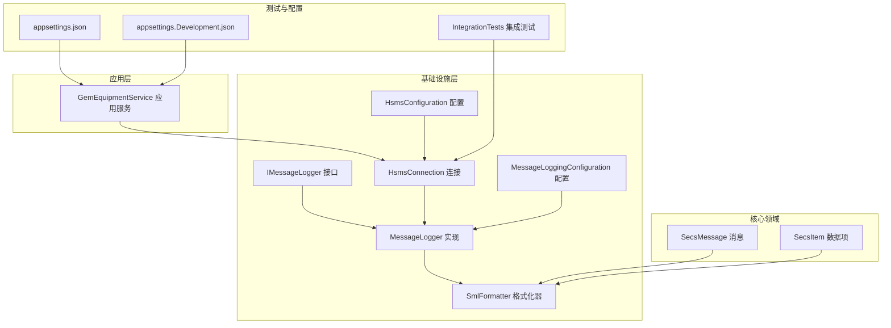
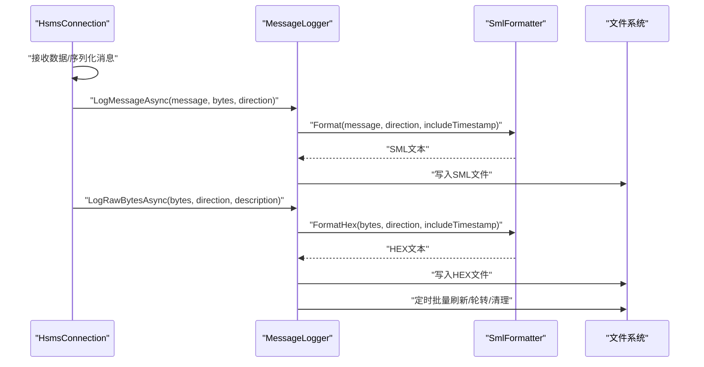
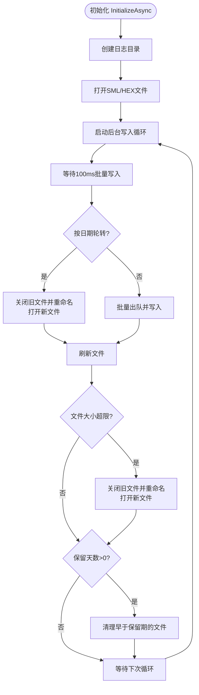
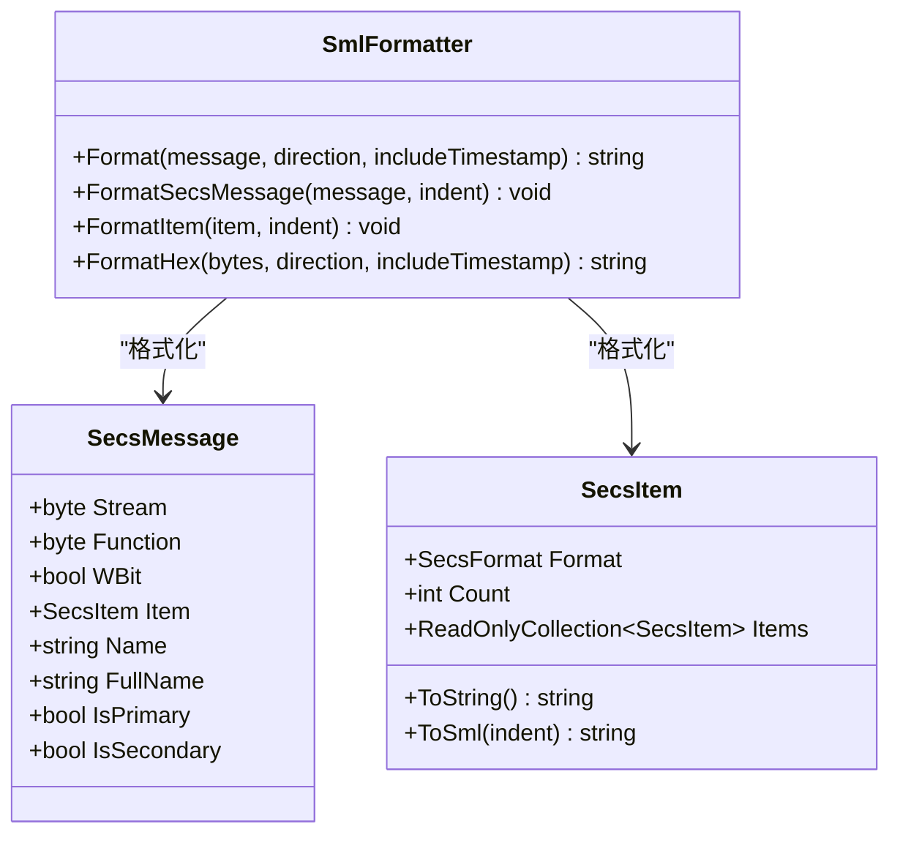
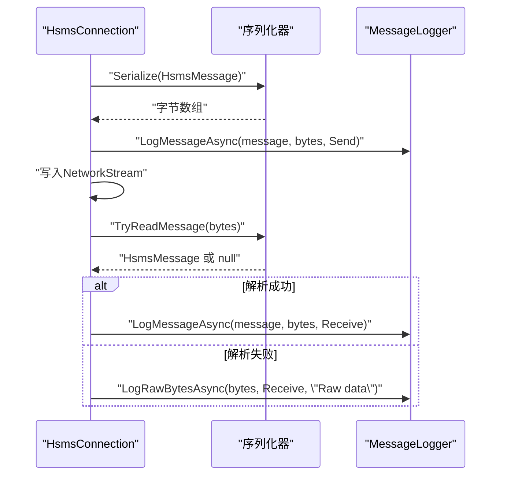
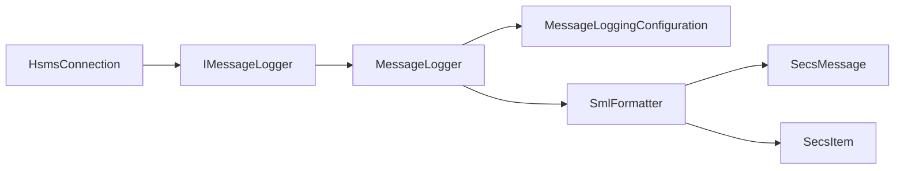

# 日志和监控

<cite>
**本文引用的文件**
- [MessageLogger.cs](file://WebGem/SECS2GEM/Infrastructure/Logging/MessageLogger.cs)
- [IMessageLogger.cs](file://WebGem/SECS2GEM/Infrastructure/Logging/IMessageLogger.cs)
- [MessageLoggingConfiguration.cs](file://WebGem/SECS2GEM/Infrastructure/Logging/MessageLoggingConfiguration.cs)
- [SmlFormatter.cs](file://WebGem/SECS2GEM/Infrastructure/Logging/SmlFormatter.cs)
- [HsmsConnection.cs](file://WebGem/SECS2GEM/Infrastructure/Connection/HsmsConnection.cs)
- [HsmsConfiguration.cs](file://WebGem/SECS2GEM/Infrastructure/Configuration/HsmsConfiguration.cs)
- [SecsMessage.cs](file://WebGem/SECS2GEM/Core/Entities/SecsMessage.cs)
- [SecsItem.cs](file://WebGem/SECS2GEM/Core/Entities/SecsItem.cs)
- [GemEquipmentService.cs](file://WebGem/SECS2GEM/Application/Services/GemEquipmentService.cs)
- [IntegrationTests.cs](file://WebGem/SECS2GEM.Tests/IntegrationTests.cs)
- [appsettings.json](file://WebGem/WebGem/appsettings.json)
- [appsettings.Development.json](file://WebGem/WebGem/appsettings.Development.json)
</cite>

## 目录
1. [简介](#简介)
2. [项目结构](#项目结构)
3. [核心组件](#核心组件)
4. [架构总览](#架构总览)
5. [详细组件分析](#详细组件分析)
6. [依赖关系分析](#依赖关系分析)
7. [性能考量](#性能考量)
8. [故障排查指南](#故障排查指南)
9. [结论](#结论)
10. [附录](#附录)

## 简介
本文件面向SECS2-GEM项目，聚焦于消息日志与监控体系，重点覆盖以下方面：
- MessageLogger日志记录器的实现与使用，包括日志级别、格式化选项、输出目标与轮转策略
- SML（SEMI Events Message Language）格式支持与消息格式化能力
- 日志配置选项与性能优化建议
- 监控指标与告警机制现状与扩展建议
- 日志分析工具与调试技巧
- 第三方监控系统集成思路
- 日志轮转与存储策略
- 故障诊断与性能分析方法

## 项目结构
日志与监控相关代码主要分布在以下模块：
- Infrastructure/Logging：日志接口、实现、配置与SML格式化器
- Infrastructure/Connection：HSMS连接层，负责消息收发与日志记录调用
- Infrastructure/Configuration：连接与日志配置对象
- Core/Entities：SECS消息与数据项模型
- Application/Services：应用服务，组合连接与状态管理
- Tests：集成测试，验证日志记录行为
- WebGem：ASP.NET Core应用配置（日志框架配置）

图表来源
- [MessageLogger.cs:23-438](file://WebGem/SECS2GEM/Infrastructure/Logging/MessageLogger.cs#L23-L438)
- [IMessageLogger.cs:24-70](file://WebGem/SECS2GEM/Infrastructure/Logging/IMessageLogger.cs#L24-L70)
- [MessageLoggingConfiguration.cs:10-82](file://WebGem/SECS2GEM/Infrastructure/Logging/MessageLoggingConfiguration.cs#L10-L82)
- [SmlFormatter.cs:23-322](file://WebGem/SECS2GEM/Infrastructure/Logging/SmlFormatter.cs#L23-L322)
- [HsmsConnection.cs:30-906](file://WebGem/SECS2GEM/Infrastructure/Connection/HsmsConnection.cs#L30-L906)
- [HsmsConfiguration.cs:15-266](file://WebGem/SECS2GEM/Infrastructure/Configuration/HsmsConfiguration.cs#L15-L266)
- [SecsMessage.cs:18-209](file://WebGem/SECS2GEM/Core/Entities/SecsMessage.cs#L18-L209)
- [SecsItem.cs:23-480](file://WebGem/SECS2GEM/Core/Entities/SecsItem.cs#L23-L480)
- [GemEquipmentService.cs:33-200](file://WebGem/SECS2GEM/Application/Services/GemEquipmentService.cs#L33-L200)
- [IntegrationTests.cs:14-194](file://WebGem/SECS2GEM.Tests/IntegrationTests.cs#L14-L194)
- [appsettings.json:1-9](file://WebGem/WebGem/appsettings.json#L1-L9)
- [appsettings.Development.json:1-8](file://WebGem/WebGem/appsettings.Development.json#L1-L8)

章节来源
- [MessageLogger.cs:1-438](file://WebGem/SECS2GEM/Infrastructure/Logging/MessageLogger.cs#L1-L438)
- [IMessageLogger.cs:1-70](file://WebGem/SECS2GEM/Infrastructure/Logging/IMessageLogger.cs#L1-L70)
- [MessageLoggingConfiguration.cs:1-82](file://WebGem/SECS2GEM/Infrastructure/Logging/MessageLoggingConfiguration.cs#L1-L82)
- [SmlFormatter.cs:1-322](file://WebGem/SECS2GEM/Infrastructure/Logging/SmlFormatter.cs#L1-L322)
- [HsmsConnection.cs:1-906](file://WebGem/SECS2GEM/Infrastructure/Connection/HsmsConnection.cs#L1-L906)
- [HsmsConfiguration.cs:1-266](file://WebGem/SECS2GEM/Infrastructure/Configuration/HsmsConfiguration.cs#L1-L266)
- [SecsMessage.cs:1-209](file://WebGem/SECS2GEM/Core/Entities/SecsMessage.cs#L1-L209)
- [SecsItem.cs:1-480](file://WebGem/SECS2GEM/Core/Entities/SecsItem.cs#L1-L480)
- [GemEquipmentService.cs:1-200](file://WebGem/SECS2GEM/Application/Services/GemEquipmentService.cs#L1-L200)
- [IntegrationTests.cs:1-194](file://WebGem/SECS2GEM.Tests/IntegrationTests.cs#L1-L194)
- [appsettings.json:1-9](file://WebGem/WebGem/appsettings.json#L1-L9)
- [appsettings.Development.json:1-8](file://WebGem/WebGem/appsettings.Development.json#L1-L8)

## 核心组件
- IMessageLogger：日志记录器接口，定义初始化、记录消息、记录原始字节、刷新与释放等契约
- MessageLogger：基于生产者-消费者模式的高性能异步日志实现，支持HEX与SML双格式输出、按日期与大小轮转、自动清理旧日志
- MessageLoggingConfiguration：日志配置对象，控制开关、输出格式、文件大小、保留天数、时间戳、文件名模板等
- SmlFormatter：SML与HEX格式化器，将HSMS消息与原始字节转换为标准文本格式
- HsmsConnection：HSMS连接实现，负责消息收发并在合适时机调用日志记录器
- HsmsConfiguration：连接配置，包含消息日志配置嵌入项
- SecsMessage/SecsItem：SECS协议消息与数据项模型，支撑SML格式化

章节来源
- [IMessageLogger.cs:24-70](file://WebGem/SECS2GEM/Infrastructure/Logging/IMessageLogger.cs#L24-L70)
- [MessageLogger.cs:23-438](file://WebGem/SECS2GEM/Infrastructure/Logging/MessageLogger.cs#L23-L438)
- [MessageLoggingConfiguration.cs:10-82](file://WebGem/SECS2GEM/Infrastructure/Logging/MessageLoggingConfiguration.cs#L10-L82)
- [SmlFormatter.cs:23-322](file://WebGem/SECS2GEM/Infrastructure/Logging/SmlFormatter.cs#L23-L322)
- [HsmsConnection.cs:30-906](file://WebGem/SECS2GEM/Infrastructure/Connection/HsmsConnection.cs#L30-L906)
- [HsmsConfiguration.cs:15-266](file://WebGem/SECS2GEM/Infrastructure/Configuration/HsmsConfiguration.cs#L15-L266)
- [SecsMessage.cs:18-209](file://WebGem/SECS2GEM/Core/Entities/SecsMessage.cs#L18-L209)
- [SecsItem.cs:23-480](file://WebGem/SECS2GEM/Core/Entities/SecsItem.cs#L23-L480)

## 架构总览
MessageLogger通过异步队列与后台任务实现非阻塞写入，SmlFormatter负责SML与HEX格式化，HsmsConnection在发送/接收消息时调用日志记录器，形成“连接层-日志层”的解耦设计。

图表来源
- [HsmsConnection.cs:650-688](file://WebGem/SECS2GEM/Infrastructure/Connection/HsmsConnection.cs#L650-L688)
- [MessageLogger.cs:99-145](file://WebGem/SECS2GEM/Infrastructure/Logging/MessageLogger.cs#L99-L145)
- [SmlFormatter.cs:28-54](file://WebGem/SECS2GEM/Infrastructure/Logging/SmlFormatter.cs#L28-L54)
- [SmlFormatter.cs:260-276](file://WebGem/SECS2GEM/Infrastructure/Logging/SmlFormatter.cs#L260-L276)

## 详细组件分析

### MessageLogger 实现与特性
- 生产者-消费者模式：使用并发队列与信号量保护写入，后台任务批量写入，降低IO频率
- 输出格式：支持SML与HEX两种格式；可选时间戳
- 文件轮转：按日期分割与按大小轮转；旧文件重命名并保留至设定天数
- 目录结构：按“基础路径/IP-端口-设备ID”组织日志目录
- 异常容错：后台写入循环捕获异常并继续运行，避免影响主业务

图表来源
- [MessageLogger.cs:65-94](file://WebGem/SECS2GEM/Infrastructure/Logging/MessageLogger.cs#L65-L94)
- [MessageLogger.cs:176-223](file://WebGem/SECS2GEM/Infrastructure/Logging/MessageLogger.cs#L176-L223)
- [MessageLogger.cs:284-304](file://WebGem/SECS2GEM/Infrastructure/Logging/MessageLogger.cs#L284-L304)
- [MessageLogger.cs:309-366](file://WebGem/SECS2GEM/Infrastructure/Logging/MessageLogger.cs#L309-L366)
- [MessageLogger.cs:371-395](file://WebGem/SECS2GEM/Infrastructure/Logging/MessageLogger.cs#L371-L395)

章节来源
- [MessageLogger.cs:23-438](file://WebGem/SECS2GEM/Infrastructure/Logging/MessageLogger.cs#L23-L438)

### SmlFormatter：SML与HEX格式化
- SML格式化：将HSMS消息与SecsMessage/SecsItem转换为标准SML文本，支持缩进与多格式数据项
- HEX格式化：将原始字节输出为十六进制dump，包含偏移、HEX与ASCII三列
- 字符串转义：对SML字符串进行转义，保证可读性与兼容性
- 控制消息与数据消息分别处理，确保输出一致性

图表来源
- [SmlFormatter.cs:23-322](file://WebGem/SECS2GEM/Infrastructure/Logging/SmlFormatter.cs#L23-L322)
- [SecsMessage.cs:18-209](file://WebGem/SECS2GEM/Core/Entities/SecsMessage.cs#L18-L209)
- [SecsItem.cs:23-480](file://WebGem/SECS2GEM/Core/Entities/SecsItem.cs#L23-L480)

章节来源
- [SmlFormatter.cs:23-322](file://WebGem/SECS2GEM/Infrastructure/Logging/SmlFormatter.cs#L23-L322)
- [SecsMessage.cs:18-209](file://WebGem/SECS2GEM/Core/Entities/SecsMessage.cs#L18-L209)
- [SecsItem.cs:23-480](file://WebGem/SECS2GEM/Core/Entities/SecsItem.cs#L23-L480)

### HsmsConnection：日志记录调用点
- 发送路径：序列化消息后记录发送侧日志，若无法解析则记录原始字节
- 接收路径：解析成功即记录SML，否则记录原始字节
- 生命周期：连接建立后初始化日志器，断开连接时释放资源

图表来源
- [HsmsConnection.cs:650-688](file://WebGem/SECS2GEM/Infrastructure/Connection/HsmsConnection.cs#L650-L688)
- [HsmsConnection.cs:549-610](file://WebGem/SECS2GEM/Infrastructure/Connection/HsmsConnection.cs#L549-L610)

章节来源
- [HsmsConnection.cs:549-688](file://WebGem/SECS2GEM/Infrastructure/Connection/HsmsConnection.cs#L549-L688)

### 配置与初始化
- MessageLoggingConfiguration：控制日志开关、输出格式、文件大小、保留天数、时间戳、文件名模板
- HsmsConfiguration：在连接配置中嵌入MessageLogging，便于集中管理
- GemEquipmentService：应用服务组合连接与状态管理，日志配置随连接生效

章节来源
- [MessageLoggingConfiguration.cs:10-82](file://WebGem/SECS2GEM/Infrastructure/Logging/MessageLoggingConfiguration.cs#L10-L82)
- [HsmsConfiguration.cs:129-131](file://WebGem/SECS2GEM/Infrastructure/Configuration/HsmsConfiguration.cs#L129-L131)
- [GemEquipmentService.cs:110-133](file://WebGem/SECS2GEM/Application/Services/GemEquipmentService.cs#L110-L133)

## 依赖关系分析
- HsmsConnection 依赖 IMessageLogger 接口，通过构造函数注入，默认使用 MessageLogger 实现
- MessageLogger 依赖 SmlFormatter 进行格式化，并依赖文件系统进行写入与轮转
- MessageLogger 依赖 MessageLoggingConfiguration 控制行为
- SmlFormatter 依赖 SecsMessage/SecsItem 进行SML格式化

图表来源
- [HsmsConnection.cs:122-139](file://WebGem/SECS2GEM/Infrastructure/Connection/HsmsConnection.cs#L122-L139)
- [MessageLogger.cs:25-60](file://WebGem/SECS2GEM/Infrastructure/Logging/MessageLogger.cs#L25-L60)
- [SmlFormatter.cs:23-322](file://WebGem/SECS2GEM/Infrastructure/Logging/SmlFormatter.cs#L23-L322)
- [SecsMessage.cs:18-209](file://WebGem/SECS2GEM/Core/Entities/SecsMessage.cs#L18-L209)
- [SecsItem.cs:23-480](file://WebGem/SECS2GEM/Core/Entities/SecsItem.cs#L23-L480)

章节来源
- [HsmsConnection.cs:122-139](file://WebGem/SECS2GEM/Infrastructure/Connection/HsmsConnection.cs#L122-L139)
- [MessageLogger.cs:25-60](file://WebGem/SECS2GEM/Infrastructure/Logging/MessageLogger.cs#L25-L60)
- [SmlFormatter.cs:23-322](file://WebGem/SECS2GEM/Infrastructure/Logging/SmlFormatter.cs#L23-L322)
- [SecsMessage.cs:18-209](file://WebGem/SECS2GEM/Core/Entities/SecsMessage.cs#L18-L209)
- [SecsItem.cs:23-480](file://WebGem/SECS2GEM/Core/Entities/SecsItem.cs#L23-L480)

## 性能考量
- 异步写入与批量刷新：后台任务每100ms批量写入一次，减少频繁IO
- 文件刷新策略：手动刷新，避免AutoFlush带来的性能损耗
- 并发控制：使用信号量保护写入，避免竞态
- 轮转与清理：按日期与大小轮转，保留期清理，避免无限增长
- 建议
  - 在高吞吐场景下，适当增大MaxFileSizeMB以减少轮转频率
  - 若磁盘IO受限，可考虑调整批量写入间隔或启用更高效的存储介质
  - 对于大量原始字节日志，优先使用SML而非HEX以减小体积

章节来源
- [MessageLogger.cs:176-223](file://WebGem/SECS2GEM/Infrastructure/Logging/MessageLogger.cs#L176-L223)
- [MessageLogger.cs:309-366](file://WebGem/SECS2GEM/Infrastructure/Logging/MessageLogger.cs#L309-L366)
- [MessageLoggingConfiguration.cs:39-45](file://WebGem/SECS2GEM/Infrastructure/Logging/MessageLoggingConfiguration.cs#L39-L45)

## 故障排查指南
- 日志未生成
  - 检查配置：Enabled、BasePath、LogHex/LogSml
  - 检查初始化：InitializeAsync是否被调用（连接建立后）
  - 检查目录权限：进程是否有写入权限
- 日志过大
  - 调整MaxFileSizeMB或启用SplitByDate
  - 设置RetentionDays以自动清理旧文件
- 日志轮转异常
  - 检查文件是否被外部程序占用
  - 确认文件名模板与日期格式正确
- SML/HEX格式异常
  - 检查SmlFormatter对特定格式的支持范围
  - 确保消息解析成功后再记录SML
- 集成测试参考
  - 通过IntegrationTests验证连接、选择、链路测试与S1F1/S1F13等消息交互，间接验证日志记录路径

章节来源
- [MessageLoggingConfiguration.cs:15-82](file://WebGem/SECS2GEM/Infrastructure/Logging/MessageLoggingConfiguration.cs#L15-L82)
- [MessageLogger.cs:65-94](file://WebGem/SECS2GEM/Infrastructure/Logging/MessageLogger.cs#L65-L94)
- [MessageLogger.cs:284-304](file://WebGem/SECS2GEM/Infrastructure/Logging/MessageLogger.cs#L284-L304)
- [MessageLogger.cs:309-366](file://WebGem/SECS2GEM/Infrastructure/Logging/MessageLogger.cs#L309-L366)
- [IntegrationTests.cs:54-168](file://WebGem/SECS2GEM.Tests/IntegrationTests.cs#L54-L168)

## 结论
MessageLogger提供了高性能、可配置的日志记录能力，结合SmlFormatter实现了SML与HEX双格式输出，并通过轮转与清理策略保障长期稳定运行。HsmsConnection将其无缝集成到消息生命周期中，形成清晰的职责边界。建议在生产环境中根据吞吐量与存储策略调整配置，并结合第三方监控系统进行指标采集与告警。

## 附录

### 日志级别与格式化选项
- 日志级别：接口未定义独立级别，但可通过配置控制输出内容（SML/HEX、时间戳）
- 格式化选项：IncludeTimestamp、LogHex、LogSml、HexFileNameFormat、SmlFileNameFormat
- 输出目标：本地文件系统（按IP-端口-设备ID组织目录）

章节来源
- [IMessageLogger.cs:24-70](file://WebGem/SECS2GEM/Infrastructure/Logging/IMessageLogger.cs#L24-L70)
- [MessageLoggingConfiguration.cs:49-65](file://WebGem/SECS2GEM/Infrastructure/Logging/MessageLoggingConfiguration.cs#L49-L65)

### 监控指标与告警机制
- 现状：日志系统本身不直接提供指标与告警，但可作为外部监控系统的输入源
- 建议指标
  - 消息速率：每秒发送/接收消息数
  - 日志文件大小：按设备维度统计
  - 轮转次数：按日期/大小轮转统计
  - 解析失败率：无法解析的原始字节比例
- 建议告警
  - 日志文件增长异常
  - 轮转失败
  - 解析失败率突增
- 建议集成
  - 将日志目录纳入Prometheus Node Exporter或类似采集器
  - 使用日志聚合平台（如ELK/EFK）进行指标计算与可视化

[本节为概念性建议，无需代码来源]

### 日志分析工具与调试技巧
- 分析工具
  - 文本编辑器/IDE：查找关键字、正则匹配
  - 日志聚合平台：全文检索、时间序列分析
  - 自定义脚本：按设备、时间、消息类型统计
- 调试技巧
  - 临时开启SML与HEX双输出，定位问题消息
  - 使用较小MaxFileSizeMB快速验证轮转逻辑
  - 在测试环境模拟高并发消息流，观察后台写入性能

[本节为通用实践，无需代码来源]

### 第三方监控系统集成
- 方案一：文件系统监控
  - 监控日志目录文件大小与变更
  - 通过告警规则触发通知
- 方案二：日志聚合
  - 将日志导入ELK/EFK，建立仪表板与告警
- 方案三：指标导出
  - 基于日志统计生成自定义指标，接入Prometheus/Grafana

[本节为通用实践，无需代码来源]

### 日志轮转与存储策略
- 轮转条件：按日期分割、按大小轮转
- 存储策略：保留N天，到期删除；文件名追加时间戳后缀
- 建议
  - 云端或共享存储：注意并发写入与锁竞争
  - 归档策略：超出保留期后压缩归档

章节来源
- [MessageLogger.cs:190-207](file://WebGem/SECS2GEM/Infrastructure/Logging/MessageLogger.cs#L190-L207)
- [MessageLogger.cs:309-366](file://WebGem/SECS2GEM/Infrastructure/Logging/MessageLogger.cs#L309-L366)
- [MessageLogger.cs:371-395](file://WebGem/SECS2GEM/Infrastructure/Logging/MessageLogger.cs#L371-L395)
- [MessageLoggingConfiguration.cs:45-55](file://WebGem/SECS2GEM/Infrastructure/Logging/MessageLoggingConfiguration.cs#L45-L55)

### 故障诊断与性能分析方法
- 诊断步骤
  - 确认日志目录存在且可写
  - 检查配置项是否生效
  - 观察后台任务是否运行
  - 分析轮转与清理是否按预期执行
- 性能分析
  - 统计后台写入耗时与队列积压
  - 评估磁盘IO瓶颈
  - 调整批量写入间隔与文件大小阈值

章节来源
- [MessageLogger.cs:176-223](file://WebGem/SECS2GEM/Infrastructure/Logging/MessageLogger.cs#L176-L223)
- [MessageLogger.cs:309-366](file://WebGem/SECS2GEM/Infrastructure/Logging/MessageLogger.cs#L309-L366)