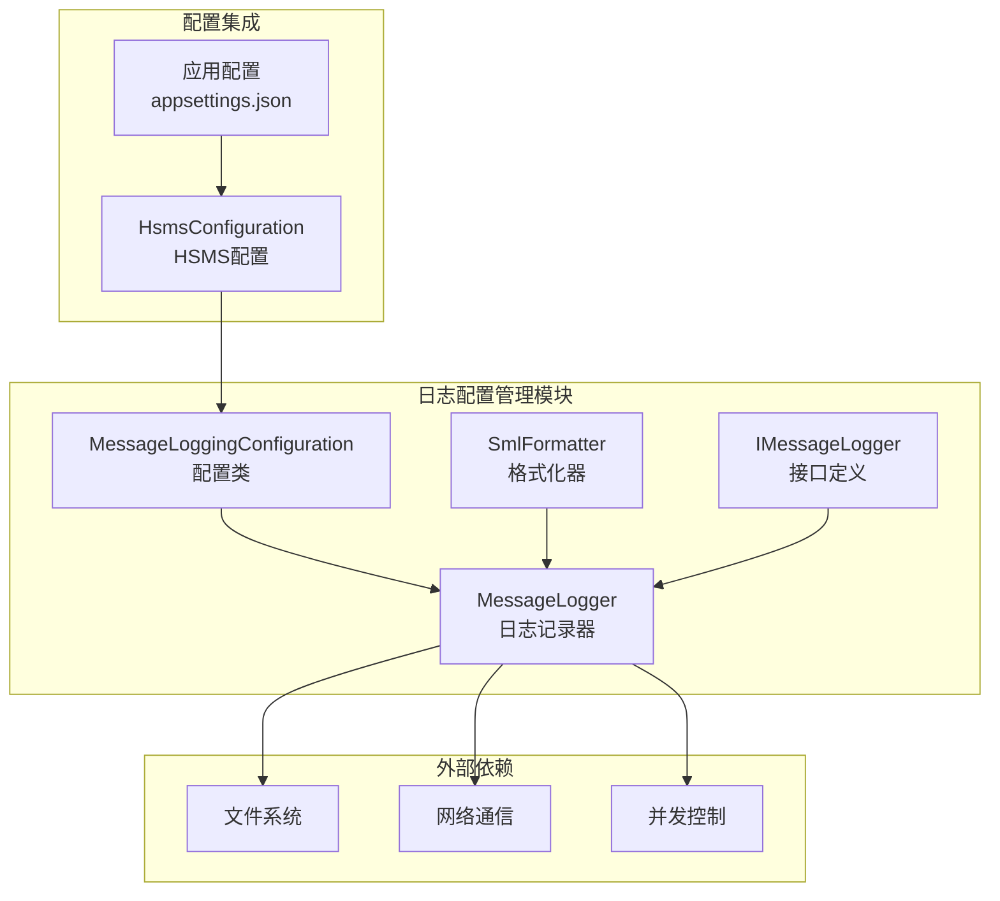
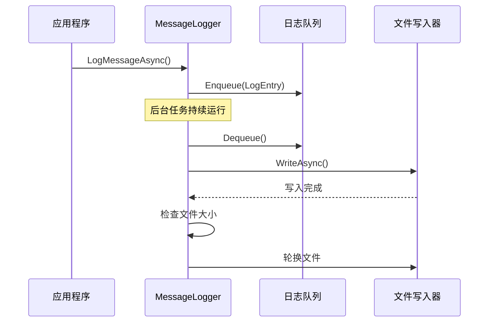
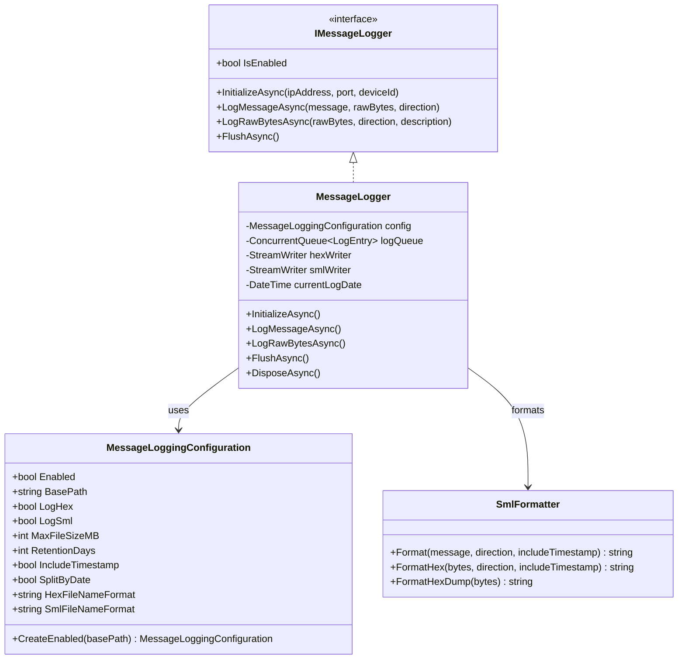
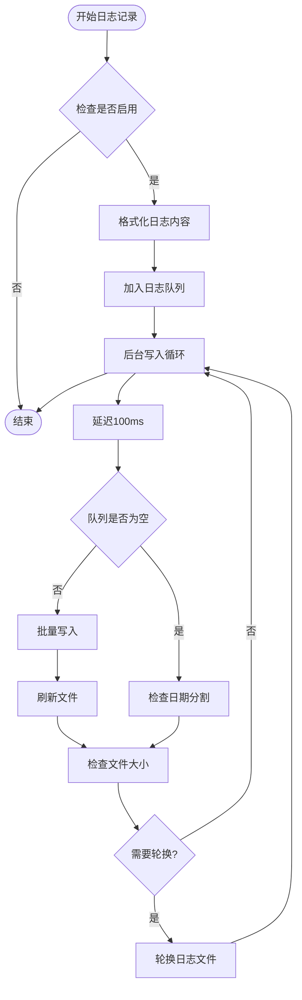
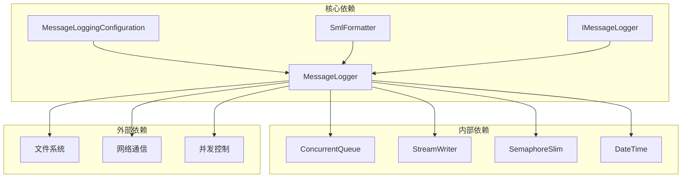

# 日志配置管理

<cite>
**本文档引用的文件**
- [MessageLoggingConfiguration.cs](file://WebGem/SECS2GEM/Infrastructure/Logging/MessageLoggingConfiguration.cs)
- [MessageLogger.cs](file://WebGem/SECS2GEM/Infrastructure/Logging/MessageLogger.cs)
- [SmlFormatter.cs](file://WebGem/SECS2GEM/Infrastructure/Logging/SmlFormatter.cs)
- [IMessageLogger.cs](file://WebGem/SECS2GEM/Infrastructure/Logging/IMessageLogger.cs)
- [HsmsConfiguration.cs](file://WebGem/SECS2GEM/Infrastructure/Configuration/HsmsConfiguration.cs)
- [appsettings.json](file://WebGem/WebGem/appsettings.json)
- [appsettings.Development.json](file://WebGem/WebGem/appsettings.Development.json)
</cite>

## 目录
1. [简介](#简介)
2. [项目结构](#项目结构)
3. [核心组件](#核心组件)
4. [架构概览](#架构概览)
5. [详细组件分析](#详细组件分析)
6. [依赖关系分析](#依赖关系分析)
7. [性能考虑](#性能考虑)
8. [故障排除指南](#故障排除指南)
9. [结论](#结论)
10. [附录](#附录)

## 简介

本文件详细说明了SECS2GEM项目中的日志配置管理系统，重点介绍`MessageLoggingConfiguration`类的配置选项和参数设置。该系统提供了完整的消息日志记录功能，支持HEX和SML两种格式，具备智能文件管理和自动清理机制。

日志配置管理是SECS/GEM通信协议调试和监控的重要工具，能够帮助开发者和运维人员深入理解设备与主机之间的通信过程，快速定位问题并进行性能优化。

## 项目结构

日志配置管理模块位于SECS2GEM项目的基础设施层，采用分层架构设计：



**图表来源**
- [MessageLoggingConfiguration.cs:1-82](file://WebGem/SECS2GEM/Infrastructure/Logging/MessageLoggingConfiguration.cs#L1-L82)
- [MessageLogger.cs:1-438](file://WebGem/SECS2GEM/Infrastructure/Logging/MessageLogger.cs#L1-L438)
- [HsmsConfiguration.cs:130-131](file://WebGem/SECS2GEM/Infrastructure/Configuration/HsmsConfiguration.cs#L130-L131)

**章节来源**
- [MessageLoggingConfiguration.cs:1-82](file://WebGem/SECS2GEM/Infrastructure/Logging/MessageLoggingConfiguration.cs#L1-L82)
- [MessageLogger.cs:1-438](file://WebGem/SECS2GEM/Infrastructure/Logging/MessageLogger.cs#L1-L438)
- [HsmsConfiguration.cs:130-131](file://WebGem/SECS2GEM/Infrastructure/Configuration/HsmsConfiguration.cs#L130-L131)

## 核心组件

### MessageLoggingConfiguration 配置类

`MessageLoggingConfiguration`是日志配置的核心类，提供了完整的日志记录参数设置：

#### 主要配置属性

| 属性名称 | 类型 | 默认值 | 描述 |
|---------|------|--------|------|
| Enabled | bool | true | 是否启用消息日志记录 |
| BasePath | string | "logs" | 日志文件的基础存储路径 |
| LogHex | bool | true | 是否记录HEX格式日志 |
| LogSml | bool | true | 是否记录SML格式日志 |
| MaxFileSizeMB | int | 50 | 单个日志文件的最大大小（MB） |
| RetentionDays | int | 30 | 日志文件的最大保留天数 |
| IncludeTimestamp | bool | true | 是否在日志中包含时间戳 |
| SplitByDate | bool | true | 是否按日期分割日志文件 |
| HexFileNameFormat | string | "messages_{0:yyyyMMdd}.hex" | HEX文件名格式模板 |
| SmlFileNameFormat | string | "messages_{0:yyyyMMdd}.sml" | SML文件名格式模板 |

#### 配置方法

- **CreateEnabled(basePath)**: 创建默认启用的日志配置实例
- **默认构造函数**: 创建完整的配置实例，包含所有默认参数

**章节来源**
- [MessageLoggingConfiguration.cs:10-81](file://WebGem/SECS2GEM/Infrastructure/Logging/MessageLoggingConfiguration.cs#L10-L81)

### MessageLogger 日志记录器

`MessageLogger`实现了异步日志记录功能，采用生产者-消费者模式：

#### 核心特性

- **异步写入**: 使用`ConcurrentQueue`和`SemaphoreSlim`确保线程安全
- **智能文件管理**: 支持按日期分割和文件大小限制
- **自动清理**: 定期清理过期日志文件
- **格式化支持**: 提供HEX和SML两种日志格式

#### 工作流程



**图表来源**
- [MessageLogger.cs:99-114](file://WebGem/SECS2GEM/Infrastructure/Logging/MessageLogger.cs#L99-L114)
- [MessageLogger.cs:176-223](file://WebGem/SECS2GEM/Infrastructure/Logging/MessageLogger.cs#L176-L223)

**章节来源**
- [MessageLogger.cs:23-438](file://WebGem/SECS2GEM/Infrastructure/Logging/MessageLogger.cs#L23-L438)

### SmlFormatter 格式化器

`SmlFormatter`负责将SECS消息转换为人类可读的SML格式：

#### 格式化能力

- **SML格式**: 标准的SECS消息语言格式
- **HEX格式**: 原始字节的十六进制转储
- **时间戳**: 可选的时间戳包含
- **消息方向**: 显示消息发送/接收方向

**章节来源**
- [SmlFormatter.cs:23-322](file://WebGem/SECS2GEM/Infrastructure/Logging/SmlFormatter.cs#L23-L322)

## 架构概览

日志配置管理采用模块化设计，各组件职责明确：



**图表来源**
- [MessageLoggingConfiguration.cs:10-81](file://WebGem/SECS2GEM/Infrastructure/Logging/MessageLoggingConfiguration.cs#L10-L81)
- [IMessageLogger.cs:33-68](file://WebGem/SECS2GEM/Infrastructure/Logging/IMessageLogger.cs#L33-L68)
- [MessageLogger.cs:25-60](file://WebGem/SECS2GEM/Infrastructure/Logging/MessageLogger.cs#L25-L60)
- [SmlFormatter.cs:23-54](file://WebGem/SECS2GEM/Infrastructure/Logging/SmlFormatter.cs#L23-L54)

## 详细组件分析

### 配置选项详解

#### 启用/禁用控制

- **Enabled属性**: 控制整个日志系统的开关
- **IsEnabled属性**: 组合了配置启用状态和初始化状态
- **条件检查**: 在日志记录前检查`IsEnabled`状态

#### 基础路径配置

- **BasePath**: 日志文件的基础存储位置
- **目录结构**: 自动生成`{BasePath}/{IP}-{Port}-{DeviceId}/`结构
- **IP安全处理**: 自动替换IP地址中的特殊字符

#### 输出格式选择

- **LogHex**: 控制HEX格式日志的生成
- **LogSml**: 控制SML格式日志的生成
- **格式化器**: 使用`SmlFormatter`进行内容格式化

#### 文件命名格式化

- **HexFileNameFormat**: HEX文件名模板，默认`messages_{0:yyyyMMdd}.hex`
- **SmlFileNameFormat**: SML文件名模板，默认`messages_{0:yyyyMMdd}.sml`
- **日期格式**: 支持自定义日期格式化

#### 日期分割配置

- **SplitByDate**: 控制是否按日期分割文件
- **轮换机制**: 每天自动创建新的日志文件
- **文件头信息**: 新文件自动包含启动时间和格式信息

#### 文件大小限制

- **MaxFileSizeMB**: 单个文件最大大小限制
- **轮换触发**: 当文件大小超过限制时自动轮换
- **重命名策略**: 添加时间戳后缀区分历史文件

#### 保留期配置和自动清理

- **RetentionDays**: 日志文件保留天数
- **自动清理**: 启动时异步执行清理任务
- **过期判断**: 基于最后修改时间判断是否过期

**章节来源**
- [MessageLoggingConfiguration.cs:15-65](file://WebGem/SECS2GEM/Infrastructure/Logging/MessageLoggingConfiguration.cs#L15-L65)
- [MessageLogger.cs:65-94](file://WebGem/SECS2GEM/Infrastructure/Logging/MessageLogger.cs#L65-L94)
- [MessageLogger.cs:309-366](file://WebGem/SECS2GEM/Infrastructure/Logging/MessageLogger.cs#L309-L366)
- [MessageLogger.cs:371-395](file://WebGem/SECS2GEM/Infrastructure/Logging/MessageLogger.cs#L371-L395)

### 日志记录流程

#### 异步写入机制



**图表来源**
- [MessageLogger.cs:176-223](file://WebGem/SECS2GEM/Infrastructure/Logging/MessageLogger.cs#L176-L223)
- [MessageLogger.cs:190-207](file://WebGem/SECS2GEM/Infrastructure/Logging/MessageLogger.cs#L190-L207)

#### 日志内容格式

- **HEX格式**: 包含原始字节的十六进制转储
- **SML格式**: 标准的SECS消息语言格式
- **时间戳**: 可选的时间戳信息
- **消息方向**: 明确标识发送或接收方向

**章节来源**
- [MessageLogger.cs:99-145](file://WebGem/SECS2GEM/Infrastructure/Logging/MessageLogger.cs#L99-L145)
- [SmlFormatter.cs:28-54](file://WebGem/SECS2GEM/Infrastructure/Logging/SmlFormatter.cs#L28-L54)

### 配置加载和验证机制

#### 配置集成

- **HsmsConfiguration集成**: `MessageLoggingConfiguration`作为HSMS配置的一部分
- **默认配置**: 自动创建默认的日志配置实例
- **外部配置**: 支持通过应用配置文件进行外部配置

#### 验证机制

虽然`MessageLoggingConfiguration`本身没有专门的验证方法，但其配置参数遵循以下规则：

- **数值范围**: 文件大小和保留天数必须为非负整数
- **路径有效性**: 基础路径必须是有效的文件系统路径
- **格式兼容性**: 文件名格式必须符合.NET格式化规范

**章节来源**
- [HsmsConfiguration.cs:130-131](file://WebGem/SECS2GEM/Infrastructure/Configuration/HsmsConfiguration.cs#L130-L131)
- [MessageLoggingConfiguration.cs:70-79](file://WebGem/SECS2GEM/Infrastructure/Logging/MessageLoggingConfiguration.cs#L70-L79)

## 依赖关系分析

日志配置管理模块的依赖关系清晰明确：



**图表来源**
- [MessageLogger.cs:25-37](file://WebGem/SECS2GEM/Infrastructure/Logging/MessageLogger.cs#L25-L37)
- [MessageLogger.cs:244-279](file://WebGem/SECS2GEM/Infrastructure/Logging/MessageLogger.cs#L244-L279)

### 组件耦合度分析

- **低耦合**: 各组件职责单一，接口清晰
- **高内聚**: 相关功能集中在同一模块
- **可扩展性**: 通过接口设计支持未来扩展

**章节来源**
- [IMessageLogger.cs:21-33](file://WebGem/SECS2GEM/Infrastructure/Logging/IMessageLogger.cs#L21-L33)
- [MessageLogger.cs:55-60](file://WebGem/SECS2GEM/Infrastructure/Logging/MessageLogger.cs#L55-L60)

## 性能考虑

### 异步写入优化

- **批量写入**: 后台任务每100ms批量处理队列中的日志条目
- **内存管理**: 使用`ConcurrentQueue`避免锁竞争
- **文件I/O优化**: 禁用自动刷新，手动控制刷新时机

### 内存和磁盘使用

- **队列容量**: 无固定上限，可能占用大量内存
- **文件大小限制**: 通过`MaxFileSizeMB`控制单文件大小
- **自动清理**: 通过`RetentionDays`控制磁盘空间使用

### 并发控制

- **信号量保护**: 使用`SemaphoreSlim`确保文件写入的线程安全
- **异步操作**: 所有I/O操作都是异步进行
- **异常处理**: 写入错误被忽略，不影响主业务流程

## 故障排除指南

### 常见问题及解决方案

#### 日志文件无法创建

**症状**: 启动时出现文件权限错误

**原因分析**:
- 基础路径不存在或无写权限
- IP地址包含特殊字符导致路径无效

**解决方法**:
- 确保基础路径存在且具有写权限
- 检查IP地址格式是否正确

#### 日志文件过大

**症状**: 磁盘空间不足

**原因分析**:
- `MaxFileSizeMB`设置过小
- 日志量超出预期

**解决方法**:
- 调整`MaxFileSizeMB`参数
- 考虑启用自动清理机制

#### 日志丢失

**症状**: 部分日志记录丢失

**原因分析**:
- 应用程序异常退出
- 队列溢出

**解决方法**:
- 确保正确调用`DisposeAsync()`
- 考虑增加队列容量

**章节来源**
- [MessageLogger.cs:400-435](file://WebGem/SECS2GEM/Infrastructure/Logging/MessageLogger.cs#L400-L435)
- [MessageLogger.cs:214-222](file://WebGem/SECS2GEM/Infrastructure/Logging/MessageLogger.cs#L214-L222)

## 结论

SECS2GEM的日志配置管理系统提供了完整而灵活的消息日志记录功能。通过`MessageLoggingConfiguration`类，用户可以精确控制日志的各个方面，包括格式、存储位置、文件管理策略等。

系统的主要优势包括：

- **模块化设计**: 各组件职责明确，易于维护和扩展
- **高性能**: 异步写入和批量处理确保低延迟
- **智能化**: 自动文件轮换和清理机制
- **灵活性**: 支持多种配置选项和自定义格式

对于生产环境部署，建议根据实际需求调整配置参数，并定期监控磁盘使用情况和日志完整性。

## 附录

### 配置文件示例

#### 基础配置示例

```json
{
  "Logging": {
    "LogLevel": {
      "Default": "Information",
      "Microsoft.AspNetCore": "Warning"
    }
  }
}
```

#### 日志配置最佳实践

1. **开发环境**: 启用所有日志格式，较小的文件大小限制
2. **测试环境**: 启用关键日志格式，适中的保留期
3. **生产环境**: 启用必要的日志格式，较长的保留期

#### 性能调优建议

1. **文件大小**: 根据磁盘空间和访问频率调整`MaxFileSizeMB`
2. **保留期**: 根据合规要求和存储成本调整`RetentionDays`
3. **格式选择**: 在调试时启用SML格式，在生产环境中仅启用必要格式
4. **时间戳**: 在性能敏感场景下可考虑禁用时间戳

### 配置参数参考表

| 参数名称 | 类型 | 默认值 | 建议范围 | 说明 |
|---------|------|--------|----------|------|
| Enabled | bool | true | true/false | 是否启用日志记录 |
| BasePath | string | "logs" | 有效路径 | 日志文件存储路径 |
| LogHex | bool | true | true/false | 是否记录HEX格式 |
| LogSml | bool | true | true/false | 是否记录SML格式 |
| MaxFileSizeMB | int | 50 | 10-1000 | 单文件最大大小(MB) |
| RetentionDays | int | 30 | 0-365 | 日志保留天数 |
| IncludeTimestamp | bool | true | true/false | 是否包含时间戳 |
| SplitByDate | bool | true | true/false | 是否按日期分割 |
| HexFileNameFormat | string | "messages_{0:yyyyMMdd}.hex" | 日期格式 | HEX文件名模板 |
| SmlFileNameFormat | string | "messages_{0:yyyyMMdd}.sml" | 日期格式 | SML文件名模板 |