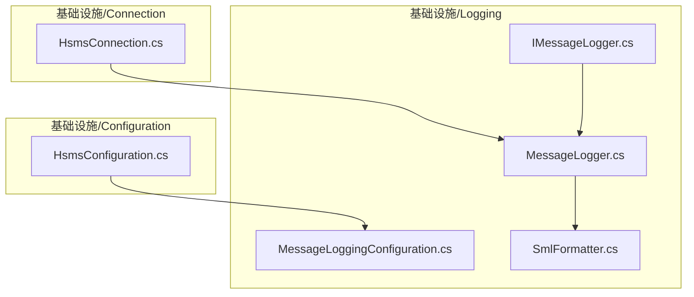
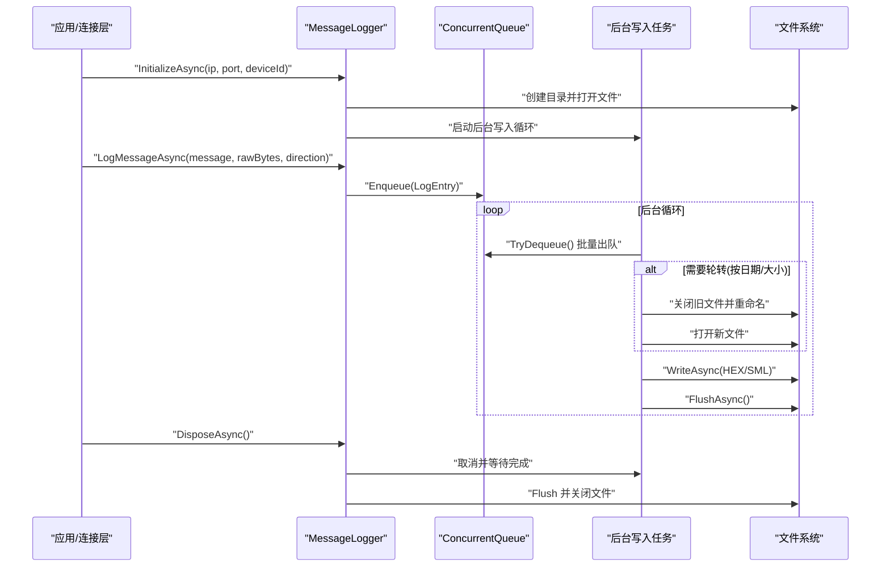
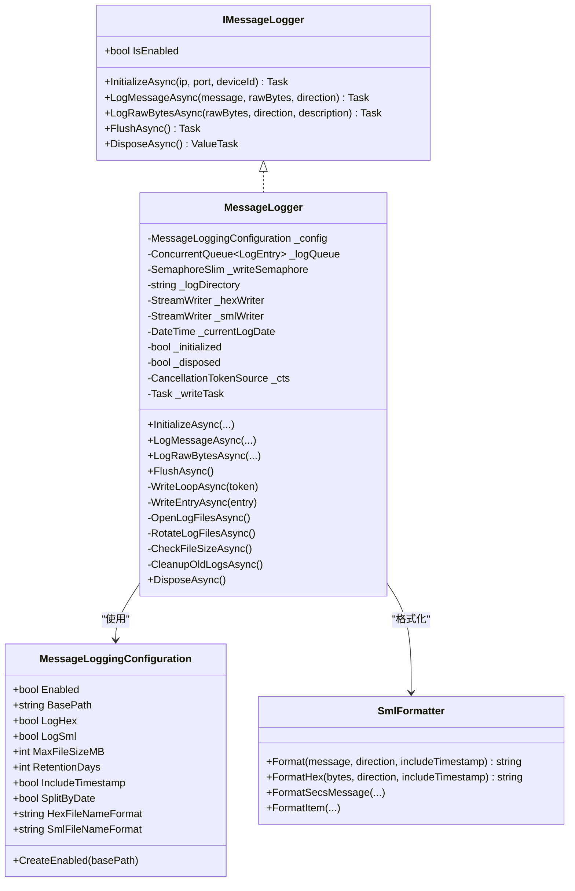

# 消息日志记录

<cite>
**本文引用的文件**
- [MessageLogger.cs](file://WebGem/SECS2GEM/Infrastructure/Logging/MessageLogger.cs)
- [IMessageLogger.cs](file://WebGem/SECS2GEM/Infrastructure/Logging/IMessageLogger.cs)
- [MessageLoggingConfiguration.cs](file://WebGem/SECS2GEM/Infrastructure/Logging/MessageLoggingConfiguration.cs)
- [SmlFormatter.cs](file://WebGem/SECS2GEM/Infrastructure/Logging/SmlFormatter.cs)
- [HsmsConnection.cs](file://WebGem/SECS2GEM/Infrastructure/Connection/HsmsConnection.cs)
- [HsmsConfiguration.cs](file://WebGem/SECS2GEM/Infrastructure/Configuration/HsmsConfiguration.cs)
</cite>

## 目录
1. [简介](#简介)
2. [项目结构](#项目结构)
3. [核心组件](#核心组件)
4. [架构总览](#架构总览)
5. [详细组件分析](#详细组件分析)
6. [依赖关系分析](#依赖关系分析)
7. [性能考量](#性能考量)
8. [故障排查指南](#故障排查指南)
9. [结论](#结论)
10. [附录](#附录)

## 简介
本文件面向“消息日志记录器”的使用者与维护者，系统性阐述 MessageLogger 类的实现原理与使用方法。重点包括：
- 生产者-消费者模式设计与异步写入机制
- ConcurrentQueue 缓冲区与写入并发控制
- 日志初始化流程、目录结构与文件命名规则
- 日志条目格式（HEX 与 SML）与内容组织
- 日志记录 API 的使用方法（LogMessageAsync、LogRawBytesAsync）
- 日志轮转机制（按日期与文件大小）
- 日志清理策略与保留期配置
- 性能优化建议与内存管理注意事项
- 实际使用示例与最佳实践

## 项目结构
围绕消息日志记录的相关文件位于基础设施层的 Logging 子模块，并与连接层（HsmsConnection）和配置层（HsmsConfiguration）紧密协作。

图表来源
- [MessageLogger.cs:1-438](file://WebGem/SECS2GEM/Infrastructure/Logging/MessageLogger.cs#L1-L438)
- [IMessageLogger.cs:1-70](file://WebGem/SECS2GEM/Infrastructure/Logging/IMessageLogger.cs#L1-L70)
- [MessageLoggingConfiguration.cs:1-82](file://WebGem/SECS2GEM/Infrastructure/Logging/MessageLoggingConfiguration.cs#L1-L82)
- [SmlFormatter.cs:1-322](file://WebGem/SECS2GEM/Infrastructure/Logging/SmlFormatter.cs#L1-L322)
- [HsmsConnection.cs:120-319](file://WebGem/SECS2GEM/Infrastructure/Connection/HsmsConnection.cs#L120-L319)
- [HsmsConfiguration.cs:1-266](file://WebGem/SECS2GEM/Infrastructure/Configuration/HsmsConfiguration.cs#L1-L266)

章节来源
- [MessageLogger.cs:1-438](file://WebGem/SECS2GEM/Infrastructure/Logging/MessageLogger.cs#L1-L438)
- [IMessageLogger.cs:1-70](file://WebGem/SECS2GEM/Infrastructure/Logging/IMessageLogger.cs#L1-L70)
- [MessageLoggingConfiguration.cs:1-82](file://WebGem/SECS2GEM/Infrastructure/Logging/MessageLoggingConfiguration.cs#L1-L82)
- [SmlFormatter.cs:1-322](file://WebGem/SECS2GEM/Infrastructure/Logging/SmlFormatter.cs#L1-L322)
- [HsmsConnection.cs:120-319](file://WebGem/SECS2GEM/Infrastructure/Connection/HsmsConnection.cs#L120-L319)
- [HsmsConfiguration.cs:1-266](file://WebGem/SECS2GEM/Infrastructure/Configuration/HsmsConfiguration.cs#L1-L266)

## 核心组件
- MessageLogger：实现 IMessageLogger 接口，负责消息日志的异步写入、轮转与清理。
- IMessageLogger：定义日志记录器的公共接口，采用策略模式便于替换实现。
- MessageLoggingConfiguration：集中管理日志配置（启用开关、基础路径、格式、大小限制、保留期、按日期轮转等）。
- SmlFormatter：提供 SML 与 HEX 格式的日志内容生成。
- HsmsConnection：在连接建立后调用 InitializeAsync 初始化日志记录器，并在消息收发时通过 IMessageLogger 记录。

章节来源
- [MessageLogger.cs:23-60](file://WebGem/SECS2GEM/Infrastructure/Logging/MessageLogger.cs#L23-L60)
- [IMessageLogger.cs:24-68](file://WebGem/SECS2GEM/Infrastructure/Logging/IMessageLogger.cs#L24-L68)
- [MessageLoggingConfiguration.cs:10-81](file://WebGem/SECS2GEM/Infrastructure/Logging/MessageLoggingConfiguration.cs#L10-L81)
- [SmlFormatter.cs:23-54](file://WebGem/SECS2GEM/Infrastructure/Logging/SmlFormatter.cs#L23-L54)
- [HsmsConnection.cs:173-174](file://WebGem/SECS2GEM/Infrastructure/Connection/HsmsConnection.cs#L173-L174)

## 架构总览
MessageLogger 采用“生产者-消费者”模式：上层（如 HsmsConnection）将日志条目入队，后台任务从队列取出并批量写入文件；通过 SemaphoreSlim 保证写入并发安全；通过 ConcurrentQueue 提供无锁入队能力；支持按日期与文件大小轮转；支持基于保留期的自动清理。

图表来源
- [MessageLogger.cs:65-94](file://WebGem/SECS2GEM/Infrastructure/Logging/MessageLogger.cs#L65-L94)
- [MessageLogger.cs:176-223](file://WebGem/SECS2GEM/Infrastructure/Logging/MessageLogger.cs#L176-L223)
- [MessageLogger.cs:228-239](file://WebGem/SECS2GEM/Infrastructure/Logging/MessageLogger.cs#L228-L239)
- [MessageLogger.cs:244-279](file://WebGem/SECS2GEM/Infrastructure/Logging/MessageLogger.cs#L244-L279)
- [MessageLogger.cs:284-304](file://WebGem/SECS2GEM/Infrastructure/Logging/MessageLogger.cs#L284-L304)
- [MessageLogger.cs:309-366](file://WebGem/SECS2GEM/Infrastructure/Logging/MessageLogger.cs#L309-L366)
- [MessageLogger.cs:400-435](file://WebGem/SECS2GEM/Infrastructure/Logging/MessageLogger.cs#L400-L435)

## 详细组件分析

### MessageLogger 类设计与实现
- 设计要点
  - 生产者-消费者：使用 ConcurrentQueue 作为无锁缓冲区，后台任务批量写入，降低 IO 次数。
  - 并发控制：使用 SemaphoreSlim 保护文件写入，避免多线程竞争。
  - 异步生命周期：InitializeAsync 初始化目录与文件，后台任务写入，DisposeAsync 刷新并关闭。
  - 轮转策略：按日期分割与文件大小限制双重保障。
  - 清理策略：基于 RetentionDays 的自动清理。

- 关键字段与类型
  - 配置：MessageLoggingConfiguration
  - 缓冲区：ConcurrentQueue<LogEntry>
  - 并发控制：SemaphoreSlim
  - 文件句柄：StreamWriter（HEX 与 SML 各一个）
  - 当前日期：DateTime（用于按日期轮转）

- 日志条目结构
  - LogEntry：包含 HexContent、SmlContent、Timestamp，分别对应 HEX 与 SML 的格式化内容及写入时间。

- 初始化流程
  - 构造函数：保存配置，初始化队列与信号量。
  - InitializeAsync：构建目录名（IP-端口-设备ID，IP 中的冒号与点替换为下划线）、创建目录、打开文件、启动后台写入任务、可选触发旧日志清理。

- 写入流程
  - LogMessageAsync/LogRawBytesAsync：根据配置决定是否生成 HEX/SML 内容，封装为 LogEntry 入队。
  - WriteLoopAsync：每 100ms 轮询一次，批量出队并写入，必要时刷新文件。
  - WriteEntryAsync：将 HEX/SML 内容写入对应文件流。
  - FlushAsync：清空队列并刷新文件，确保数据落盘。

- 轮转机制
  - 按日期轮转：SplitByDate=true 且日期变更时，先关闭旧文件，更新日期，再打开新文件。
  - 按大小轮转：CheckFileSizeAsync 检查文件长度，超过 MaxFileSizeMB 限制则重命名旧文件并在末尾追加时间戳后缀，随后打开新文件。

- 清理策略
  - CleanupOldLogsAsync：遍历目录下的 .hex 与 .sml 文件，删除最后修改时间早于保留截止日期的文件。

- 资源释放
  - DisposeAsync：取消后台任务，等待完成，FlushAsync，依次释放文件句柄与同步原语。

章节来源
- [MessageLogger.cs:23-60](file://WebGem/SECS2GEM/Infrastructure/Logging/MessageLogger.cs#L23-L60)
- [MessageLogger.cs:65-94](file://WebGem/SECS2GEM/Infrastructure/Logging/MessageLogger.cs#L65-L94)
- [MessageLogger.cs:99-145](file://WebGem/SECS2GEM/Infrastructure/Logging/MessageLogger.cs#L99-L145)
- [MessageLogger.cs:150-171](file://WebGem/SECS2GEM/Infrastructure/Logging/MessageLogger.cs#L150-L171)
- [MessageLogger.cs:176-223](file://WebGem/SECS2GEM/Infrastructure/Logging/MessageLogger.cs#L176-L223)
- [MessageLogger.cs:228-239](file://WebGem/SECS2GEM/Infrastructure/Logging/MessageLogger.cs#L228-L239)
- [MessageLogger.cs:244-279](file://WebGem/SECS2GEM/Infrastructure/Logging/MessageLogger.cs#L244-L279)
- [MessageLogger.cs:284-304](file://WebGem/SECS2GEM/Infrastructure/Logging/MessageLogger.cs#L284-L304)
- [MessageLogger.cs:309-366](file://WebGem/SECS2GEM/Infrastructure/Logging/MessageLogger.cs#L309-L366)
- [MessageLogger.cs:371-395](file://WebGem/SECS2GEM/Infrastructure/Logging/MessageLogger.cs#L371-L395)
- [MessageLogger.cs:400-435](file://WebGem/SECS2GEM/Infrastructure/Logging/MessageLogger.cs#L400-L435)

### 接口与配置
- IMessageLogger
  - IsEnabled：指示日志器是否启用且已完成初始化。
  - InitializeAsync：初始化日志目录与文件。
  - LogMessageAsync：记录 HSMS 消息（含原始字节与方向）。
  - LogRawBytesAsync：记录原始字节（可选描述）。
  - FlushAsync：刷新缓冲区并落盘。

- MessageLoggingConfiguration
  - Enabled：是否启用日志。
  - BasePath：日志根目录，默认“logs”。
  - LogHex/LogSml：是否记录 HEX/SML。
  - MaxFileSizeMB：单文件最大大小（MB）。
  - RetentionDays：保留天数（0 表示不清理）。
  - IncludeTimestamp：是否包含时间戳。
  - SplitByDate：是否按日期分割。
  - HexFileNameFormat/SmlFileNameFormat：文件名模板（默认按日期）。
  - CreateEnabled：便捷构造函数。

章节来源
- [IMessageLogger.cs:33-68](file://WebGem/SECS2GEM/Infrastructure/Logging/IMessageLogger.cs#L33-L68)
- [MessageLoggingConfiguration.cs:10-81](file://WebGem/SECS2GEM/Infrastructure/Logging/MessageLoggingConfiguration.cs#L10-L81)

### 格式化器
- SmlFormatter
  - Format(HsmsMessage,...)：生成 SML 文本，包含时间戳与方向标识，递归格式化数据项。
  - FormatHex(...)：生成 HEX dump 文本，包含时间戳与方向标识。
  - Format(SecsMessage/SecsItem)：独立格式化 SECS 消息与数据项，支持多种格式编码。

章节来源
- [SmlFormatter.cs:23-54](file://WebGem/SECS2GEM/Infrastructure/Logging/SmlFormatter.cs#L23-L54)
- [SmlFormatter.cs:258-276](file://WebGem/SECS2GEM/Infrastructure/Logging/SmlFormatter.cs#L258-L276)
- [SmlFormatter.cs:281-319](file://WebGem/SECS2GEM/Infrastructure/Logging/SmlFormatter.cs#L281-L319)

### 使用示例与集成点
- 在 HsmsConnection 中，连接成功后调用 InitializeAsync 完成日志器初始化；随后在消息收发路径中调用 IMessageLogger 的记录方法。
- 示例调用位置
  - InitializeAsync 调用：在连接建立后立即初始化日志器。
  - LogMessageAsync/LogRawBytesAsync：在消息接收或发送路径中调用，传入消息对象、原始字节与方向。

章节来源
- [HsmsConnection.cs:173-174](file://WebGem/SECS2GEM/Infrastructure/Connection/HsmsConnection.cs#L173-L174)
- [HsmsConnection.cs:248-250](file://WebGem/SECS2GEM/Infrastructure/Connection/HsmsConnection.cs#L248-L250)

## 依赖关系分析
- MessageLogger 依赖
  - IMessageLogger：接口契约，便于替换实现。
  - MessageLoggingConfiguration：集中配置。
  - SmlFormatter：内容格式化。
  - System.IO：文件写入与轮转。
  - System.Threading：后台任务与并发控制。

- 与其他模块的关系
  - HsmsConnection 通过 IMessageLogger 注入日志能力，无需感知具体存储细节。
  - HsmsConfiguration 暴露 MessageLogging 配置，贯穿连接与日志初始化。

图表来源
- [IMessageLogger.cs:33-68](file://WebGem/SECS2GEM/Infrastructure/Logging/IMessageLogger.cs#L33-L68)
- [MessageLogger.cs:23-60](file://WebGem/SECS2GEM/Infrastructure/Logging/MessageLogger.cs#L23-L60)
- [MessageLogger.cs:228-239](file://WebGem/SECS2GEM/Infrastructure/Logging/MessageLogger.cs#L228-L239)
- [MessageLogger.cs:244-279](file://WebGem/SECS2GEM/Infrastructure/Logging/MessageLogger.cs#L244-L279)
- [MessageLogger.cs:284-304](file://WebGem/SECS2GEM/Infrastructure/Logging/MessageLogger.cs#L284-L304)
- [MessageLogger.cs:309-366](file://WebGem/SECS2GEM/Infrastructure/Logging/MessageLogger.cs#L309-L366)
- [MessageLogger.cs:371-395](file://WebGem/SECS2GEM/Infrastructure/Logging/MessageLogger.cs#L371-L395)
- [MessageLogger.cs:400-435](file://WebGem/SECS2GEM/Infrastructure/Logging/MessageLogger.cs#L400-L435)
- [MessageLoggingConfiguration.cs:10-81](file://WebGem/SECS2GEM/Infrastructure/Logging/MessageLoggingConfiguration.cs#L10-L81)
- [SmlFormatter.cs:23-54](file://WebGem/SECS2GEM/Infrastructure/Logging/SmlFormatter.cs#L23-L54)
- [SmlFormatter.cs:258-276](file://WebGem/SECS2GEM/Infrastructure/Logging/SmlFormatter.cs#L258-L276)

## 性能考量
- 队列与批处理
  - 使用 ConcurrentQueue 作为无锁缓冲区，避免锁竞争；后台任务每 100ms 轮询一次，批量出队写入，降低 IO 次数。
- 文件写入优化
  - 使用 StreamWriter 并关闭 AutoFlush，减少频繁刷盘；在循环末尾统一 FlushAsync，确保数据及时落盘。
- 并发控制
  - 使用 SemaphoreSlim 保护文件写入，避免多线程同时写同一文件导致的数据交错。
- 轮转与清理
  - 按日期轮转与大小轮转结合，避免单文件过大；RetentionDays 控制磁盘占用上限。
- 内存管理
  - LogEntry 仅包含字符串与时间戳，生命周期短；SmlFormatter 使用 StringBuilder 生成内容，避免重复分配。
- I/O 与线程
  - 后台任务使用 Task.Delay(100) 控制轮询频率，兼顾实时性与 CPU 占用；异常被捕获并忽略，保证后台任务稳定运行。

[本节为通用性能建议，不直接分析特定文件，故无章节来源]

## 故障排查指南
- 初始化失败
  - 确认 BasePath 可写；确认 IP 地址与端口合法；确认设备 ID 合法。
- 文件无法写入
  - 检查文件句柄是否被外部程序占用；确认磁盘空间充足；检查权限。
- 轮转异常
  - 若按日期轮转失败，检查 SplitByDate 配置；若按大小轮转失败，检查 MaxFileSizeMB 与文件大小计算。
- 清理失败
  - 检查 RetentionDays 配置；确认文件未被占用；查看异常日志。
- 资源释放
  - 确保在应用关闭时调用 DisposeAsync，避免资源泄漏。

章节来源
- [MessageLogger.cs:400-435](file://WebGem/SECS2GEM/Infrastructure/Logging/MessageLogger.cs#L400-L435)
- [MessageLogger.cs:371-395](file://WebGem/SECS2GEM/Infrastructure/Logging/MessageLogger.cs#L371-L395)

## 结论
MessageLogger 通过生产者-消费者与异步写入机制，实现了对 HSMS 通讯消息的高效日志记录；借助 ConcurrentQueue 与 SemaphoreSlim，在保证线程安全的同时降低了开销；按日期与大小的双轮转策略以及基于保留期的清理机制，确保了长期运行的稳定性与可维护性。配合 SmlFormatter 的标准化输出，便于问题定位与审计。

[本节为总结性内容，不直接分析特定文件，故无章节来源]

## 附录

### 日志初始化与目录结构
- 初始化步骤
  - 构建目录名：BasePath/{SafeIP}-{Port}-{DeviceId}/，其中 SafeIP 将 IP 中的冒号与点替换为下划线。
  - 创建目录并打开 HEX 与 SML 文件（按需），写入文件头信息。
  - 启动后台写入任务；可选触发旧日志清理。
- 目录结构
  - 顶层 BasePath 下按设备维度划分子目录，便于多设备隔离与管理。

章节来源
- [MessageLogger.cs:65-94](file://WebGem/SECS2GEM/Infrastructure/Logging/MessageLogger.cs#L65-L94)
- [MessageLogger.cs:244-279](file://WebGem/SECS2GEM/Infrastructure/Logging/MessageLogger.cs#L244-L279)

### 文件命名规则
- HEX 文件名：默认按日期命名，模板为 messages_{yyyyMMdd}.hex。
- SML 文件名：默认按日期命名，模板为 messages_{yyyyMMdd}.sml。
- 轮转时重命名：在文件大小达到阈值时，将现有文件重命名为带时间戳后缀的新名称，随后打开新文件。

章节来源
- [MessageLoggingConfiguration.cs:60-65](file://WebGem/SECS2GEM/Infrastructure/Logging/MessageLoggingConfiguration.cs#L60-L65)
- [MessageLogger.cs:309-366](file://WebGem/SECS2GEM/Infrastructure/Logging/MessageLogger.cs#L309-L366)

### 日志条目格式与内容组织
- SML 格式
  - 包含时间戳与方向标识（发送/接收），随后是消息头与数据项的层级化表示。
  - 支持多种 SECS 格式编码（ASCII/JIS8/Unicode/二进制/布尔/整数/浮点等）。
- HEX 格式
  - 包含时间戳与方向标识，随后是标准十六进制转储（偏移、HEX、ASCII 三列）。

章节来源
- [SmlFormatter.cs:23-54](file://WebGem/SECS2GEM/Infrastructure/Logging/SmlFormatter.cs#L23-L54)
- [SmlFormatter.cs:258-276](file://WebGem/SECS2GEM/Infrastructure/Logging/SmlFormatter.cs#L258-L276)
- [SmlFormatter.cs:281-319](file://WebGem/SECS2GEM/Infrastructure/Logging/SmlFormatter.cs#L281-L319)

### 日志记录 API 使用说明
- InitializeAsync
  - 参数：ipAddress、port、deviceId
  - 返回：Task
  - 作用：创建日志目录、打开文件、启动后台写入任务、可选清理旧日志
- LogMessageAsync
  - 参数：HsmsMessage、byte[] rawBytes、MessageDirection
  - 返回：Task
  - 作用：记录 HSMS 消息（按配置生成 HEX/SML）
- LogRawBytesAsync
  - 参数：byte[] rawBytes、MessageDirection、description（可选）
  - 返回：Task
  - 作用：记录原始字节（可选描述文本）
- FlushAsync
  - 返回：Task
  - 作用：清空队列并刷新文件

章节来源
- [IMessageLogger.cs:46-67](file://WebGem/SECS2GEM/Infrastructure/Logging/IMessageLogger.cs#L46-L67)

### 日志轮转与清理策略
- 按日期轮转
  - 条件：SplitByDate=true 且日期变更
  - 动作：关闭旧文件 → 更新日期 → 打开新文件
- 按大小轮转
  - 条件：文件大小超过 MaxFileSizeMB
  - 动作：关闭旧文件 → 重命名旧文件（添加时间戳后缀）→ 打开新文件
- 清理策略
  - 条件：RetentionDays > 0
  - 动作：删除最后修改时间早于保留截止日期的 .hex/.sml 文件

章节来源
- [MessageLogger.cs:190-207](file://WebGem/SECS2GEM/Infrastructure/Logging/MessageLogger.cs#L190-L207)
- [MessageLogger.cs:309-366](file://WebGem/SECS2GEM/Infrastructure/Logging/MessageLogger.cs#L309-L366)
- [MessageLogger.cs:371-395](file://WebGem/SECS2GEM/Infrastructure/Logging/MessageLogger.cs#L371-L395)

### 性能优化与内存管理建议
- 合理设置 MaxFileSizeMB 与 RetentionDays，平衡 IO 与磁盘占用。
- 在高吞吐场景下，适当增大后台轮询间隔（谨慎评估延迟）。
- 使用 IncludeTimestamp=false 可减少字符串拼接开销（视需求而定）。
- 避免在热路径中频繁创建临时对象，SmlFormatter 已内部优化。

章节来源
- [MessageLogger.cs:176-223](file://WebGem/SECS2GEM/Infrastructure/Logging/MessageLogger.cs#L176-L223)
- [MessageLogger.cs:309-366](file://WebGem/SECS2GEM/Infrastructure/Logging/MessageLogger.cs#L309-L366)

### 实际使用示例与最佳实践
- 示例：在 HsmsConnection 建立连接后调用 InitializeAsync，随后在消息收发路径中调用 LogMessageAsync/LogRawBytesAsync。
- 最佳实践
  - 在应用启动时配置 MessageLoggingConfiguration，明确 BasePath、格式与轮转策略。
  - 对于生产环境，建议启用 SplitByDate 与合理的 MaxFileSizeMB，并设置 RetentionDays。
  - 在应用关闭时调用 DisposeAsync，确保数据落盘与资源释放。

章节来源
- [HsmsConnection.cs:173-174](file://WebGem/SECS2GEM/Infrastructure/Connection/HsmsConnection.cs#L173-L174)
- [HsmsConnection.cs:248-250](file://WebGem/SECS2GEM/Infrastructure/Connection/HsmsConnection.cs#L248-L250)
- [MessageLoggingConfiguration.cs:70-81](file://WebGem/SECS2GEM/Infrastructure/Logging/MessageLoggingConfiguration.cs#L70-L81)