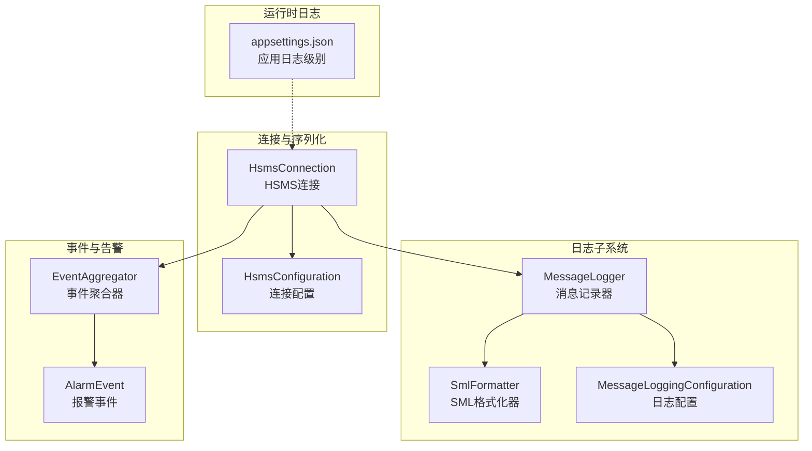
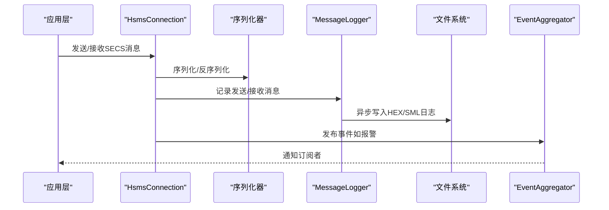
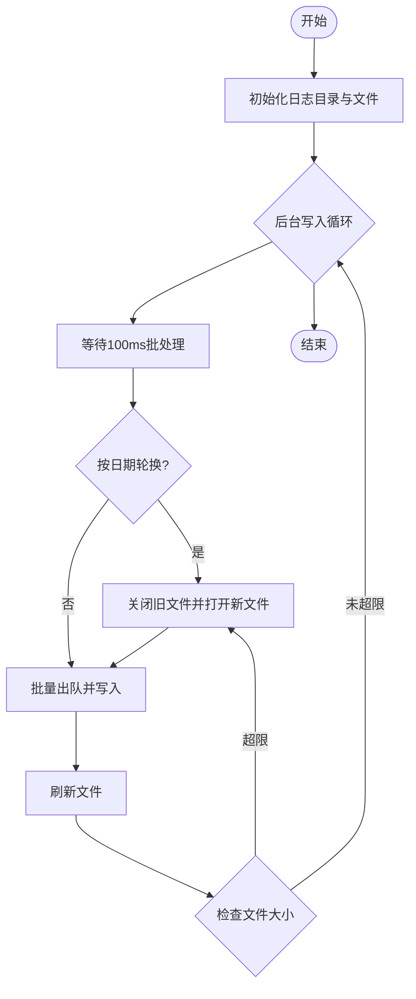
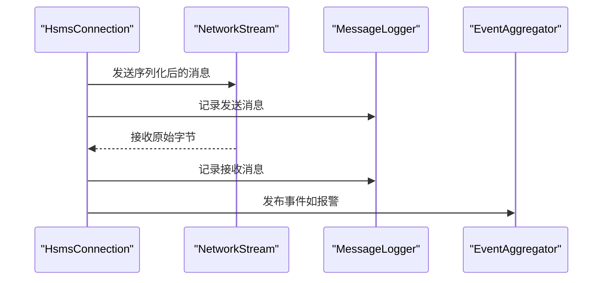
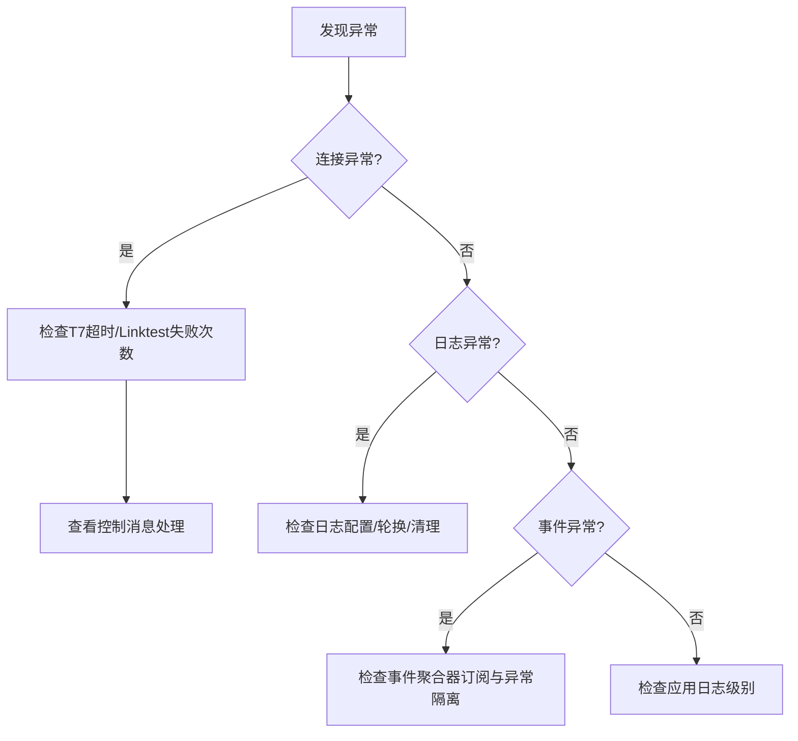

# 监控指标和告警

<cite>
**本文引用的文件**
- [MessageLogger.cs](file://WebGem/SECS2GEM/Infrastructure/Logging/MessageLogger.cs)
- [IMessageLogger.cs](file://WebGem/SECS2GEM/Infrastructure/Logging/IMessageLogger.cs)
- [MessageLoggingConfiguration.cs](file://WebGem/SECS2GEM/Infrastructure/Logging/MessageLoggingConfiguration.cs)
- [SmlFormatter.cs](file://WebGem/SECS2GEM/Infrastructure/Logging/SmlFormatter.cs)
- [HsmsConnection.cs](file://WebGem/SECS2GEM/Infrastructure/Connection/HsmsConnection.cs)
- [HsmsConfiguration.cs](file://WebGem/SECS2GEM/Infrastructure/Configuration/HsmsConfiguration.cs)
- [EventAggregator.cs](file://WebGem/SECS2GEM/Infrastructure/Services/EventAggregator.cs)
- [IEventAggregator.cs](file://WebGem/SECS2GEM/Domain/Interfaces/IEventAggregator.cs)
- [AlarmEvent.cs](file://WebGem/SECS2GEM/Domain/Events/AlarmEvent.cs)
- [SecsMessage.cs](file://WebGem/SECS2GEM/Core/Entities/SecsMessage.cs)
- [HsmsMessageType.cs](file://WebGem/SECS2GEM/Core/Enums/HsmsMessageType.cs)
- [appsettings.json](file://WebGem/WebGem/appsettings.json)
- [appsettings.Development.json](file://WebGem/WebGem/appsettings.Development.json)
- [messages_20260331.sml](file://WebGem/SECS2GEM.Simulator/bin/Debug/net9.0-windows/logs/127_0_0_1-5000-0/messages_20260331.sml)
</cite>

## 目录
1. [简介](#简介)
2. [项目结构](#项目结构)
3. [核心组件](#核心组件)
4. [架构总览](#架构总览)
5. [详细组件分析](#详细组件分析)
6. [依赖关系分析](#依赖关系分析)
7. [性能考量](#性能考量)
8. [故障排查指南](#故障排查指南)
9. [结论](#结论)
10. [附录](#附录)

## 简介
本文件面向SECS/GEM监控指标与告警系统，基于仓库现有代码实现，系统性梳理日志系统提供的监控指标（消息吞吐量、日志文件大小、写入延迟、错误率统计）、告警阈值配置与触发机制、性能监控指标的收集与报告方法、监控数据导出与可视化方案、与外部监控系统（如Prometheus、Grafana）的集成方式、日志分析工具与调试技巧、故障诊断流程与性能分析方法、监控最佳实践与运维建议，以及监控数据的存储与保留策略。

## 项目结构
围绕监控与告警的关键模块包括：
- 日志子系统：消息记录器、SML格式化器、日志配置
- 连接与事务：HSMS连接、序列化、事务管理、心跳与超时
- 事件与告警：事件聚合器、报警事件模型
- 配置：HSMS连接配置、消息日志配置
- 运行时日志：ASP.NET Core应用日志配置

**图表来源**
- [MessageLogger.cs:23-438](file://WebGem/SECS2GEM/Infrastructure/Logging/MessageLogger.cs#L23-L438)
- [SmlFormatter.cs:23-322](file://WebGem/SECS2GEM/Infrastructure/Logging/SmlFormatter.cs#L23-L322)
- [MessageLoggingConfiguration.cs:10-82](file://WebGem/SECS2GEM/Infrastructure/Logging/MessageLoggingConfiguration.cs#L10-L82)
- [HsmsConnection.cs:30-906](file://WebGem/SECS2GEM/Infrastructure/Connection/HsmsConnection.cs#L30-L906)
- [HsmsConfiguration.cs:15-266](file://WebGem/SECS2GEM/Infrastructure/Configuration/HsmsConfiguration.cs#L15-L266)
- [EventAggregator.cs:17-219](file://WebGem/SECS2GEM/Infrastructure/Services/EventAggregator.cs#L17-L219)
- [AlarmEvent.cs:12-57](file://WebGem/SECS2GEM/Domain/Events/AlarmEvent.cs#L12-L57)
- [appsettings.json:1-10](file://WebGem/WebGem/appsettings.json#L1-L10)

**章节来源**
- [MessageLogger.cs:23-438](file://WebGem/SECS2GEM/Infrastructure/Logging/MessageLogger.cs#L23-L438)
- [HsmsConnection.cs:30-906](file://WebGem/SECS2GEM/Infrastructure/Connection/HsmsConnection.cs#L30-L906)
- [EventAggregator.cs:17-219](file://WebGem/SECS2GEM/Infrastructure/Services/EventAggregator.cs#L17-L219)
- [HsmsConfiguration.cs:15-266](file://WebGem/SECS2GEM/Infrastructure/Configuration/HsmsConfiguration.cs#L15-L266)
- [appsettings.json:1-10](file://WebGem/WebGem/appsettings.json#L1-L10)

## 核心组件
- 消息记录器（MessageLogger）
  - 异步生产者-消费者模式写入日志，避免阻塞通讯线程
  - 支持按日期分割文件与文件大小限制，自动轮换与清理
  - 提供刷新缓冲区能力，确保数据落盘
- SML格式化器（SmlFormatter）
  - 将HSMS消息与SECS-II数据项转换为标准SML文本格式
  - 支持HEX与SML双格式输出，便于审计与分析
- 日志配置（MessageLoggingConfiguration）
  - 控制是否启用日志、日志路径、文件大小上限、保留天数、是否包含时间戳、按日期分割、文件名格式等
- HSMS连接（HsmsConnection）
  - 管理TCP连接、消息收发、心跳与超时、事务管理、日志记录
  - 在发送/接收路径均调用日志记录器，确保可观测性
- 事件聚合器（EventAggregator）
  - 观察者模式实现，支持异步/同步事件发布，异常隔离
  - 用于报警事件等业务事件的通知分发
- 报警事件（AlarmEvent）
  - 表达S5F1报警/报警清除语义，包含报警ID、报警码、报警文本及类别
- 应用日志配置（appsettings.json）
  - 定义默认日志级别与Microsoft.AspNetCore警告级别，便于整体运行时监控

**章节来源**
- [MessageLogger.cs:23-438](file://WebGem/SECS2GEM/Infrastructure/Logging/MessageLogger.cs#L23-L438)
- [SmlFormatter.cs:23-322](file://WebGem/SECS2GEM/Infrastructure/Logging/SmlFormatter.cs#L23-L322)
- [MessageLoggingConfiguration.cs:10-82](file://WebGem/SECS2GEM/Infrastructure/Logging/MessageLoggingConfiguration.cs#L10-L82)
- [HsmsConnection.cs:30-906](file://WebGem/SECS2GEM/Infrastructure/Connection/HsmsConnection.cs#L30-L906)
- [EventAggregator.cs:17-219](file://WebGem/SECS2GEM/Infrastructure/Services/EventAggregator.cs#L17-L219)
- [AlarmEvent.cs:12-57](file://WebGem/SECS2GEM/Domain/Events/AlarmEvent.cs#L12-L57)
- [appsettings.json:1-10](file://WebGem/WebGem/appsettings.json#L1-L10)

## 架构总览
下图展示监控相关组件在系统中的交互关系与数据流向：

**图表来源**
- [HsmsConnection.cs:547-725](file://WebGem/SECS2GEM/Infrastructure/Connection/HsmsConnection.cs#L547-L725)
- [MessageLogger.cs:176-223](file://WebGem/SECS2GEM/Infrastructure/Logging/MessageLogger.cs#L176-L223)
- [EventAggregator.cs:25-45](file://WebGem/SECS2GEM/Infrastructure/Services/EventAggregator.cs#L25-L45)

## 详细组件分析

### 消息记录器（MessageLogger）与监控指标
- 指标定义与来源
  - 消息吞吐量：通过记录队列入队与出队速率估算；日志写入循环每100ms批量处理，可作为采样窗口
  - 日志文件大小：按配置的最大文件大小（MB）轮换，轮换时重命名旧文件并打开新文件
  - 写入延迟：记录器内部使用信号量与异步写入，延迟主要来自磁盘IO与批量刷新
  - 错误率统计：写入循环内捕获异常并忽略，可作为“写入失败”指标的基础来源
- 关键行为
  - 初始化：创建目录、打开文件、启动后台写入任务、按需清理旧日志
  - 写入：按HEX/SML分别写入，支持时间戳与消息方向标记
  - 轮换：按日期或文件大小触发，重命名旧文件并打开新文件
  - 清理：按保留天数删除过期日志文件
  - 刷新：手动刷新缓冲区，确保数据落盘

**图表来源**
- [MessageLogger.cs:176-366](file://WebGem/SECS2GEM/Infrastructure/Logging/MessageLogger.cs#L176-L366)

**章节来源**
- [MessageLogger.cs:65-94](file://WebGem/SECS2GEM/Infrastructure/Logging/MessageLogger.cs#L65-L94)
- [MessageLogger.cs:176-223](file://WebGem/SECS2GEM/Infrastructure/Logging/MessageLogger.cs#L176-L223)
- [MessageLogger.cs:284-304](file://WebGem/SECS2GEM/Infrastructure/Logging/MessageLogger.cs#L284-L304)
- [MessageLogger.cs:309-366](file://WebGem/SECS2GEM/Infrastructure/Logging/MessageLogger.cs#L309-L366)
- [MessageLogger.cs:371-395](file://WebGem/SECS2GEM/Infrastructure/Logging/MessageLogger.cs#L371-L395)

### SML格式化器与日志内容
- SML格式化器将SECS消息与数据项转换为标准文本，便于审计与可视化
- HEX格式化器输出十六进制转储，便于底层网络分析
- 两者均可选择是否包含时间戳，支持不同粒度的可观测性需求

**章节来源**
- [SmlFormatter.cs:28-54](file://WebGem/SECS2GEM/Infrastructure/Logging/SmlFormatter.cs#L28-L54)
- [SmlFormatter.cs:260-276](file://WebGem/SECS2GEM/Infrastructure/Logging/SmlFormatter.cs#L260-L276)

### 日志配置与阈值
- 启用开关：是否记录HEX与SML
- 文件大小：最大文件大小（MB），超限轮换
- 保留策略：保留天数，到期删除
- 分割策略：按日期分割或按大小轮换
- 时间戳：是否包含时间戳
- 文件名格式：支持自定义文件名模板

**章节来源**
- [MessageLoggingConfiguration.cs:10-82](file://WebGem/SECS2GEM/Infrastructure/Logging/MessageLoggingConfiguration.cs#L10-L82)

### HSMS连接与监控集成点
- 发送/接收路径均调用日志记录器，确保消息级可观测性
- 心跳与超时：Linktest循环、T7超时、最大心跳失败次数，用于连接健康度评估
- 事务管理：用于消息往返跟踪与超时控制

**图表来源**
- [HsmsConnection.cs:615-688](file://WebGem/SECS2GEM/Infrastructure/Connection/HsmsConnection.cs#L615-L688)
- [HsmsConnection.cs:693-723](file://WebGem/SECS2GEM/Infrastructure/Connection/HsmsConnection.cs#L693-L723)

**章节来源**
- [HsmsConnection.cs:547-725](file://WebGem/SECS2GEM/Infrastructure/Connection/HsmsConnection.cs#L547-L725)

### 事件聚合器与告警
- 事件聚合器提供异步/同步发布能力，异常隔离，支持订阅与取消订阅
- 报警事件模型表达S5F1语义，包含报警ID、报警码、报警文本与类别
- 建议：通过事件聚合器订阅AlarmEvent，实现告警上报与通知

**章节来源**
- [EventAggregator.cs:25-45](file://WebGem/SECS2GEM/Infrastructure/Services/EventAggregator.cs#L25-L45)
- [IEventAggregator.cs:22-67](file://WebGem/SECS2GEM/Domain/Interfaces/IEventAggregator.cs#L22-L67)
- [AlarmEvent.cs:12-57](file://WebGem/SECS2GEM/Domain/Events/AlarmEvent.cs#L12-L57)

### SECS消息与协议指标
- SECS消息实体包含Stream/Function/W-Bit等协议字段，可用于统计消息类型分布、是否期望回复等
- 有助于构建“消息类型占比”、“请求/响应比例”等指标

**章节来源**
- [SecsMessage.cs:18-139](file://WebGem/SECS2GEM/Core/Entities/SecsMessage.cs#L18-L139)

### HSMS消息类型与控制面健康
- HSMS消息类型枚举涵盖数据消息、选择/取消选择、链路测试、拒绝、分离等
- 用于统计控制消息比例、链路测试成功率等

**章节来源**
- [HsmsMessageType.cs:10-67](file://WebGem/SECS2GEM/Core/Enums/HsmsMessageType.cs#L10-L67)

## 依赖关系分析
- MessageLogger依赖MessageLoggingConfiguration与SmlFormatter
- HsmsConnection依赖MessageLogger、ISecsSerializer、ITransactionManager、HsmsConfiguration
- EventAggregator提供事件发布/订阅能力，AlarmEvent作为事件载体
- 应用日志配置影响整体运行时可观测性

```mermaid
classDiagram
class MessageLogger {
+InitializeAsync(ip, port, deviceId)
+LogMessageAsync(message, raw, dir)
+LogRawBytesAsync(bytes, dir, desc)
+FlushAsync()
+DisposeAsync()
}
class MessageLoggingConfiguration {
+Enabled
+BasePath
+LogHex
+LogSml
+MaxFileSizeMB
+RetentionDays
+IncludeTimestamp
+SplitByDate
+HexFileNameFormat
+SmlFileNameFormat
}
class SmlFormatter {
+Format(message, dir, ts)
+FormatHex(bytes, dir, ts)
}
class HsmsConnection {
+ConnectAsync()
+SendAsync()
+SendLinktestAsync()
+DisconnectAsync()
}
class HsmsConfiguration {
+DeviceId
+IpAddress
+Port
+Mode
+T3..T7
+LinktestInterval
+MaxLinktestFailures
+MessageLogging
}
class EventAggregator {
+PublishAsync()
+Subscribe()
+ClearSubscriptions()
}
class AlarmEvent {
+AlarmId
+AlarmCode
+AlarmText
+IsSet
+Category
}
MessageLogger --> MessageLoggingConfiguration : "使用"
MessageLogger --> SmlFormatter : "格式化"
HsmsConnection --> MessageLogger : "记录消息"
HsmsConnection --> HsmsConfiguration : "使用"
EventAggregator --> AlarmEvent : "发布/订阅"
```

**图表来源**
- [MessageLogger.cs:23-438](file://WebGem/SECS2GEM/Infrastructure/Logging/MessageLogger.cs#L23-L438)
- [MessageLoggingConfiguration.cs:10-82](file://WebGem/SECS2GEM/Infrastructure/Logging/MessageLoggingConfiguration.cs#L10-L82)
- [SmlFormatter.cs:23-322](file://WebGem/SECS2GEM/Infrastructure/Logging/SmlFormatter.cs#L23-L322)
- [HsmsConnection.cs:30-906](file://WebGem/SECS2GEM/Infrastructure/Connection/HsmsConnection.cs#L30-L906)
- [HsmsConfiguration.cs:15-266](file://WebGem/SECS2GEM/Infrastructure/Configuration/HsmsConfiguration.cs#L15-L266)
- [EventAggregator.cs:17-219](file://WebGem/SECS2GEM/Infrastructure/Services/EventAggregator.cs#L17-L219)
- [AlarmEvent.cs:12-57](file://WebGem/SECS2GEM/Domain/Events/AlarmEvent.cs#L12-L57)

**章节来源**
- [MessageLogger.cs:23-438](file://WebGem/SECS2GEM/Infrastructure/Logging/MessageLogger.cs#L23-L438)
- [HsmsConnection.cs:30-906](file://WebGem/SECS2GEM/Infrastructure/Connection/HsmsConnection.cs#L30-L906)
- [EventAggregator.cs:17-219](file://WebGem/SECS2GEM/Infrastructure/Services/EventAggregator.cs#L17-L219)

## 性能考量
- 异步写入与批量处理
  - 写入循环每100ms批量处理队列，减少频繁IO与锁竞争
  - 使用信号量保护文件写入，避免并发写入冲突
- 文件轮换与清理
  - 按日期或大小轮换，避免单文件过大影响IO性能
  - 按保留天数清理旧日志，控制磁盘占用
- 心跳与超时
  - Linktest间隔与最大失败次数决定连接健康判定灵敏度
  - T7超时用于被动模式下的连接存活检测
- 缓冲区与消息大小
  - 接收/发送缓冲区大小影响吞吐与内存占用
  - 最大消息大小限制防止异常大包导致内存压力

**章节来源**
- [MessageLogger.cs:176-223](file://WebGem/SECS2GEM/Infrastructure/Logging/MessageLogger.cs#L176-L223)
- [MessageLogger.cs:309-366](file://WebGem/SECS2GEM/Infrastructure/Logging/MessageLogger.cs#L309-L366)
- [HsmsConnection.cs:693-723](file://WebGem/SECS2GEM/Infrastructure/Connection/HsmsConnection.cs#L693-L723)
- [HsmsConfiguration.cs:96-133](file://WebGem/SECS2GEM/Infrastructure/Configuration/HsmsConfiguration.cs#L96-L133)

## 故障排查指南
- 连接问题
  - 检查T7超时与Linktest失败次数，确认被动模式下是否在超时后断开
  - 查看Separate/Reject等控制消息处理逻辑
- 日志问题
  - 检查日志配置是否启用、BasePath是否存在权限
  - 查看文件轮换与清理是否按预期执行
  - 核对SML/HEX输出是否包含时间戳，便于定位问题时间点
- 事件问题
  - 确认事件聚合器订阅是否正确，异常是否被隔离
  - 检查AlarmEvent的IsSet与Category字段是否符合预期

**图表来源**
- [HsmsConnection.cs:280-296](file://WebGem/SECS2GEM/Infrastructure/Connection/HsmsConnection.cs#L280-L296)
- [MessageLogger.cs:371-395](file://WebGem/SECS2GEM/Infrastructure/Logging/MessageLogger.cs#L371-L395)
- [EventAggregator.cs:170-181](file://WebGem/SECS2GEM/Infrastructure/Services/EventAggregator.cs#L170-L181)
- [appsettings.json:1-10](file://WebGem/WebGem/appsettings.json#L1-L10)

**章节来源**
- [HsmsConnection.cs:280-296](file://WebGem/SECS2GEM/Infrastructure/Connection/HsmsConnection.cs#L280-L296)
- [MessageLogger.cs:371-395](file://WebGem/SECS2GEM/Infrastructure/Logging/MessageLogger.cs#L371-L395)
- [EventAggregator.cs:170-181](file://WebGem/SECS2GEM/Infrastructure/Services/EventAggregator.cs#L170-L181)
- [appsettings.json:1-10](file://WebGem/WebGem/appsettings.json#L1-L10)

## 结论
本系统通过消息记录器与SML/HEX日志输出实现了高粒度的可观测性，结合HSMS连接的心跳与超时机制、事件聚合器的告警分发，形成了完整的监控与告警闭环。日志配置提供了灵活的阈值与保留策略，满足不同环境的性能与合规要求。建议在此基础上引入外部监控系统，实现更丰富的可视化与自动化告警。

## 附录

### 监控指标清单与采集方法
- 消息吞吐量
  - 来源：消息记录器队列入队/出队速率（采样窗口100ms）
  - 方法：统计每秒入队数量与写入数量差值
- 日志文件大小
  - 来源：当前日志文件大小与最大文件大小配置
  - 方法：轮换前检查，超限即轮换
- 写入延迟
  - 来源：异步写入与批量刷新
  - 方法：测量从入队到FlushAsync完成的时间
- 错误率统计
  - 来源：写入循环异常捕获
  - 方法：统计异常次数与总写入次数比值

**章节来源**
- [MessageLogger.cs:176-223](file://WebGem/SECS2GEM/Infrastructure/Logging/MessageLogger.cs#L176-L223)
- [MessageLogger.cs:309-366](file://WebGem/SECS2GEM/Infrastructure/Logging/MessageLogger.cs#L309-L366)

### 告警阈值配置与触发机制
- 阈值配置
  - 日志文件大小：MaxFileSizeMB
  - 保留天数：RetentionDays
  - 心跳失败次数：MaxLinktestFailures
  - T7超时：T7Timeout
- 触发机制
  - 文件轮换：大小超限或日期变更
  - 连接断开：心跳失败次数达到阈值或T7超时
  - 告警事件：通过EventAggregator发布AlarmEvent

**章节来源**
- [MessageLoggingConfiguration.cs:39-45](file://WebGem/SECS2GEM/Infrastructure/Logging/MessageLoggingConfiguration.cs#L39-L45)
- [HsmsConfiguration.cs:88-92](file://WebGem/SECS2GEM/Infrastructure/Configuration/HsmsConfiguration.cs#L88-L92)
- [HsmsConfiguration.cs:66-74](file://WebGem/SECS2GEM/Infrastructure/Configuration/HsmsConfiguration.cs#L66-L74)
- [EventAggregator.cs:25-45](file://WebGem/SECS2GEM/Infrastructure/Services/EventAggregator.cs#L25-L45)
- [AlarmEvent.cs:12-57](file://WebGem/SECS2GEM/Domain/Events/AlarmEvent.cs#L12-L57)

### 性能监控指标收集与报告
- 指标类型
  - 连接健康：心跳成功率、T7超时次数
  - 消息健康：消息类型分布、请求/响应比例、往返时延
  - IO健康：日志写入QPS、写入延迟、文件轮换频率
- 报告建议
  - 每分钟/每小时聚合一次，生成趋势图与告警阈值对比

**章节来源**
- [HsmsConnection.cs:693-723](file://WebGem/SECS2GEM/Infrastructure/Connection/HsmsConnection.cs#L693-L723)
- [SecsMessage.cs:18-139](file://WebGem/SECS2GEM/Core/Entities/SecsMessage.cs#L18-L139)
- [MessageLogger.cs:176-223](file://WebGem/SECS2GEM/Infrastructure/Logging/MessageLogger.cs#L176-L223)

### 监控数据导出与可视化方案
- 导出
  - 日志文件：SML/HEX文件可直接导入分析工具
  - 运行时日志：应用日志级别配置，便于集中化收集
- 可视化
  - 建议：Grafana仪表板展示吞吐量、延迟、错误率、心跳成功率、文件大小与轮换频率
  - 指标来源：日志文件统计与应用日志聚合

**章节来源**
- [appsettings.json:1-10](file://WebGem/WebGem/appsettings.json#L1-L10)
- [messages_20260331.sml:68-667](file://WebGem/SECS2GEM.Simulator/bin/Debug/net9.0-windows/logs/127_0_0_1-5000-0/messages_20260331.sml#L68-L667)

### 与外部监控系统集成
- Prometheus
  - 方案：通过应用日志聚合与指标导出（如Prometheus Exporter）实现指标抓取
  - 指标映射：连接状态、消息类型计数、心跳失败、文件大小等
- Grafana
  - 方案：连接Prometheus数据源，创建面板展示关键指标趋势与告警
- 建议
  - 统一日志格式与标签，便于Prometheus抓取与Grafana查询

[本节为概念性说明，无需代码来源]

### 日志分析工具与调试技巧
- SML分析
  - 使用SML格式化器输出的SML文件进行协议一致性检查
- HEX分析
  - 使用HEX转储定位底层网络问题
- 调试技巧
  - 启用IncludeTimestamp，便于时间轴对齐
  - 在开发环境适当降低MaxFileSizeMB以便快速轮换验证

**章节来源**
- [SmlFormatter.cs:260-276](file://WebGem/SECS2GEM/Infrastructure/Logging/SmlFormatter.cs#L260-L276)
- [MessageLoggingConfiguration.cs:49-55](file://WebGem/SECS2GEM/Infrastructure/Logging/MessageLoggingConfiguration.cs#L49-L55)

### 故障诊断流程与性能分析
- 连接异常
  - 检查T7超时与Linktest失败次数，必要时调整超时参数
- 日志异常
  - 检查日志路径权限、轮换策略与保留策略
- 性能异常
  - 分析写入延迟与文件轮换频率，优化缓冲区大小与轮换阈值

**章节来源**
- [HsmsConfiguration.cs:66-74](file://WebGem/SECS2GEM/Infrastructure/Configuration/HsmsConfiguration.cs#L66-L74)
- [HsmsConfiguration.cs:88-92](file://WebGem/SECS2GEM/Infrastructure/Configuration/HsmsConfiguration.cs#L88-L92)
- [MessageLogger.cs:309-366](file://WebGem/SECS2GEM/Infrastructure/Logging/MessageLogger.cs#L309-L366)

### 监控最佳实践与运维建议
- 最佳实践
  - 启用SML与HEX双格式日志，兼顾协议审计与底层分析
  - 合理设置MaxFileSizeMB与RetentionDays，平衡IO与存储成本
  - 使用IncludeTimestamp提升问题定位效率
- 运维建议
  - 定期巡检日志目录空间，确保轮换与清理正常
  - 结合应用日志级别，集中化收集与告警

**章节来源**
- [MessageLoggingConfiguration.cs:39-45](file://WebGem/SECS2GEM/Infrastructure/Logging/MessageLoggingConfiguration.cs#L39-L45)
- [MessageLoggingConfiguration.cs:49-55](file://WebGem/SECS2GEM/Infrastructure/Logging/MessageLoggingConfiguration.cs#L49-L55)
- [appsettings.json:1-10](file://WebGem/WebGem/appsettings.json#L1-L10)

### 监控数据的存储与保留策略
- 存储位置
  - BasePath下按IP-端口-设备ID组织的日志目录
- 保留策略
  - RetentionDays天数后删除过期文件
- 轮换策略
  - 按日期或文件大小轮换，超限重命名并开启新文件

**章节来源**
- [MessageLoggingConfiguration.cs:23-45](file://WebGem/SECS2GEM/Infrastructure/Logging/MessageLoggingConfiguration.cs#L23-L45)
- [MessageLogger.cs:371-395](file://WebGem/SECS2GEM/Infrastructure/Logging/MessageLogger.cs#L371-L395)
- [MessageLogger.cs:284-304](file://WebGem/SECS2GEM/Infrastructure/Logging/MessageLogger.cs#L284-L304)