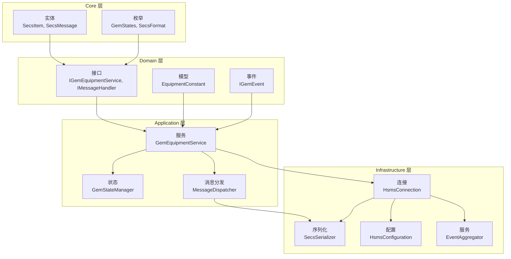
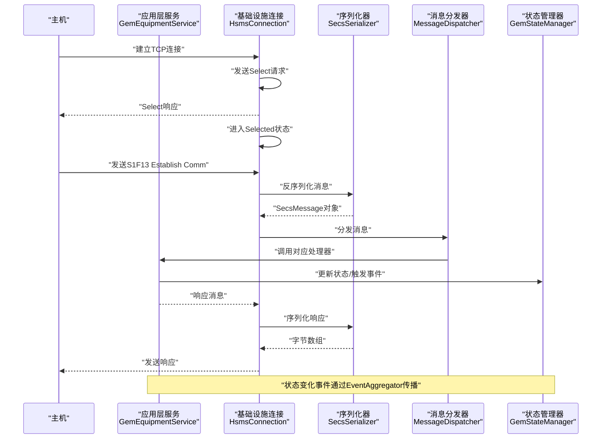
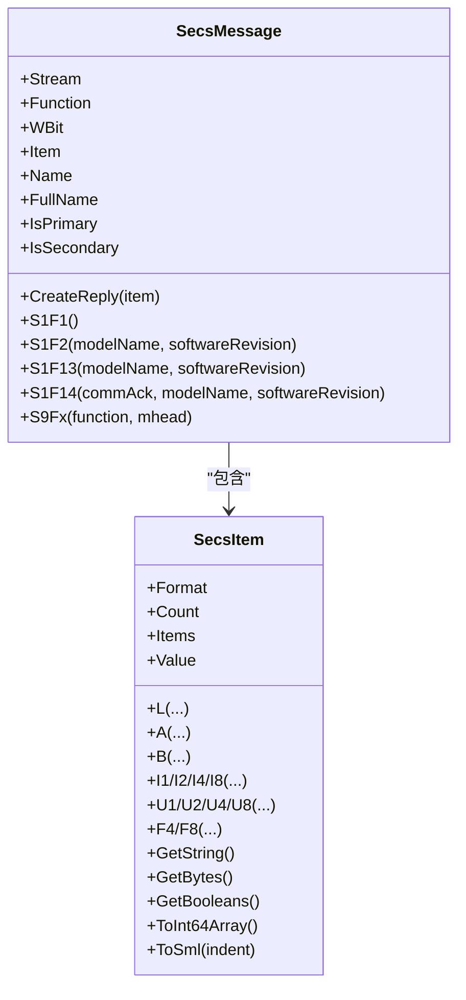
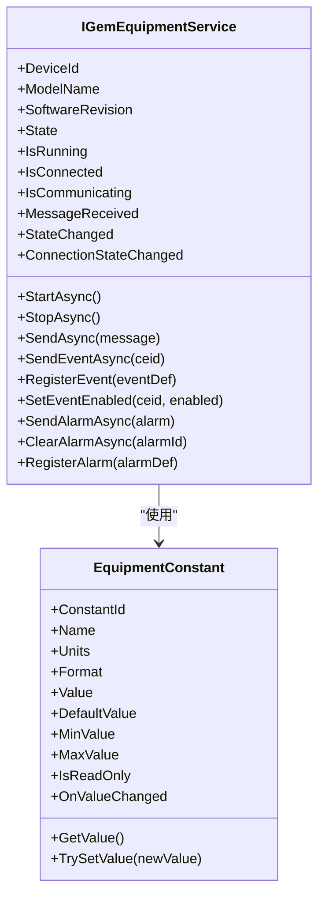
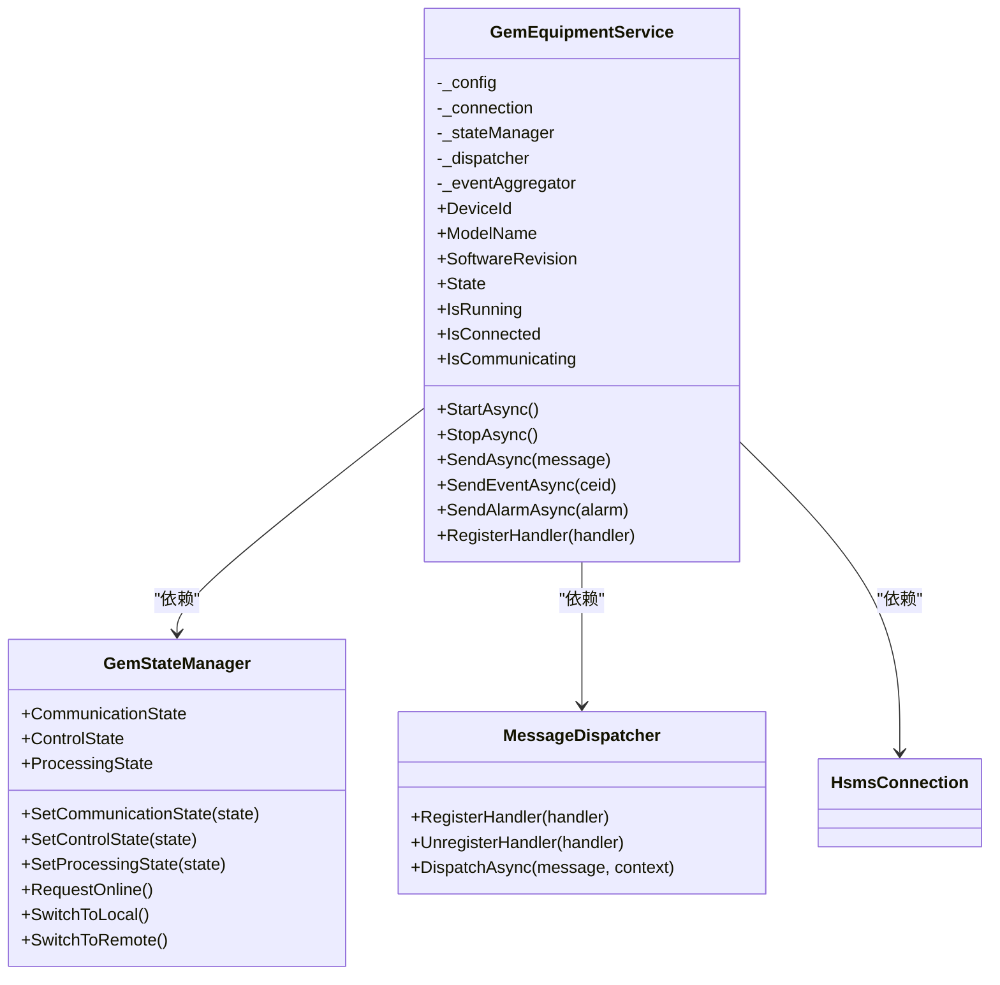
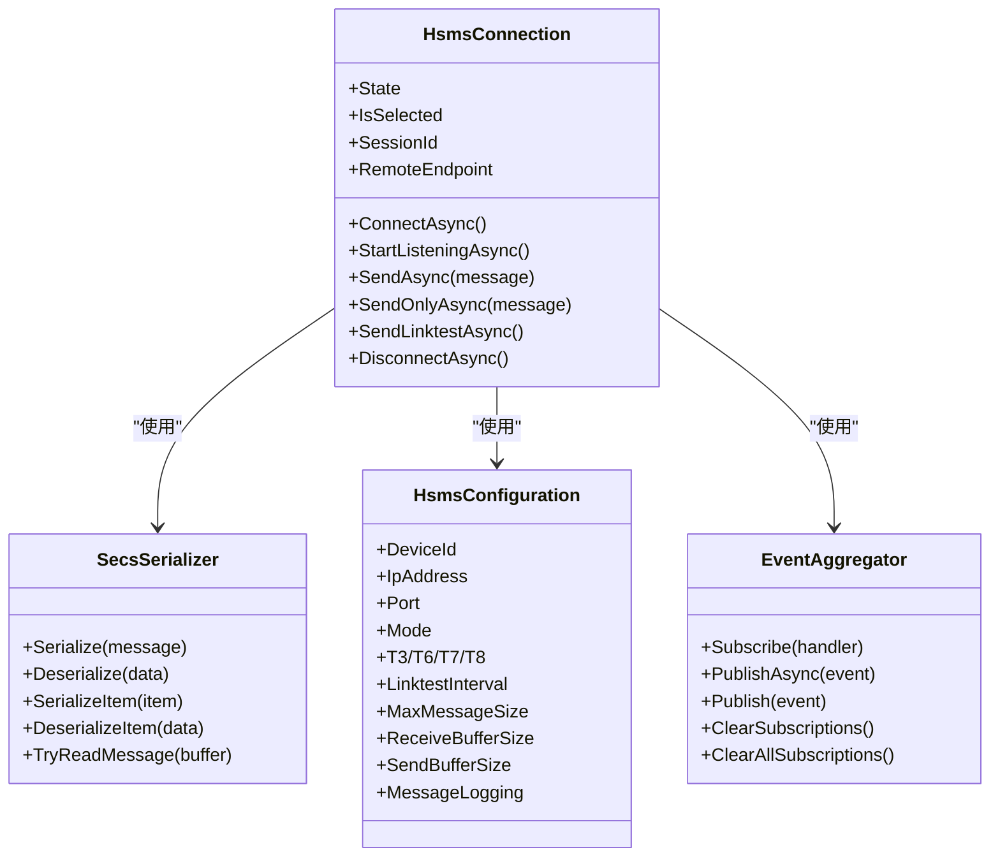
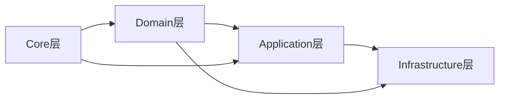

# 分层架构设计

<cite>
**本文档引用的文件**
- [SECS2GEM.csproj](file://WebGem/SECS2GEM/SECS2GEM.csproj)
- [SecsItem.cs](file://WebGem/SECS2GEM/Core/Entities/SecsItem.cs)
- [SecsMessage.cs](file://WebGem/SECS2GEM/Core/Entities/SecsMessage.cs)
- [GemStates.cs](file://WebGem/SECS2GEM/Core/Enums/GemStates.cs)
- [IGemEquipmentService.cs](file://WebGem/SECS2GEM/Domain/Interfaces/IGemEquipmentService.cs)
- [GemEquipmentService.cs](file://WebGem/SECS2GEM/Application/Services/GemEquipmentService.cs)
- [GemStateManager.cs](file://WebGem/SECS2GEM/Application/State/GemStateManager.cs)
- [MessageDispatcher.cs](file://WebGem/SECS2GEM/Application/Messaging/MessageDispatcher.cs)
- [HsmsConnection.cs](file://WebGem/SECS2GEM/Infrastructure/Connection/HsmsConnection.cs)
- [SecsSerializer.cs](file://WebGem/SECS2GEM/Infrastructure/Serialization/SecsSerializer.cs)
- [HsmsConfiguration.cs](file://WebGem/SECS2GEM/Infrastructure/Configuration/HsmsConfiguration.cs)
- [EventAggregator.cs](file://WebGem/SECS2GEM/Infrastructure/Services/EventAggregator.cs)
- [IGemEvent.cs](file://WebGem/SECS2GEM/Domain/Events/IGemEvent.cs)
- [EquipmentConstant.cs](file://WebGem/SECS2GEM/Domain/Models/EquipmentConstant.cs)
</cite>

## 目录
1. [简介](#简介)
2. [项目结构](#项目结构)
3. [核心组件](#核心组件)
4. [架构总览](#架构总览)
5. [详细组件分析](#详细组件分析)
6. [依赖关系分析](#依赖关系分析)
7. [性能考虑](#性能考虑)
8. [故障排除指南](#故障排除指南)
9. [结论](#结论)

## 简介
本项目采用分层架构设计，围绕SECS/GEM协议实现设备侧的通信与状态管理。架构分为四层：
- Core层：基础实体与枚举，提供不可变的数据结构与协议常量
- Domain层：领域模型与接口，定义业务契约与事件模型
- Application层：业务逻辑与服务编排，负责消息分发、状态管理与事件聚合
- Infrastructure层：基础设施与连接管理，负责网络连接、序列化与事务管理

该架构通过清晰的职责划分与依赖方向，实现了良好的可维护性、可测试性与可扩展性。

## 项目结构
项目采用按层组织的目录结构，每层包含明确的职责域：
- Core：基础实体与枚举，不依赖其他层
- Domain：领域模型与接口，依赖Core
- Application：业务服务与状态管理，依赖Domain与Infrastructure
- Infrastructure：连接与序列化，依赖Core与Domain

图表来源
- [SecsItem.cs:1-480](file://WebGem/SECS2GEM/Core/Entities/SecsItem.cs#L1-L480)
- [SecsMessage.cs:1-209](file://WebGem/SECS2GEM/Core/Entities/SecsMessage.cs#L1-L209)
- [GemStates.cs:1-176](file://WebGem/SECS2GEM/Core/Enums/GemStates.cs#L1-L176)
- [IGemEquipmentService.cs:1-160](file://WebGem/SECS2GEM/Domain/Interfaces/IGemEquipmentService.cs#L1-L160)
- [GemEquipmentService.cs:1-456](file://WebGem/SECS2GEM/Application/Services/GemEquipmentService.cs#L1-L456)
- [GemStateManager.cs:1-492](file://WebGem/SECS2GEM/Application/State/GemStateManager.cs#L1-L492)
- [MessageDispatcher.cs:1-123](file://WebGem/SECS2GEM/Application/Messaging/MessageDispatcher.cs#L1-L123)
- [HsmsConnection.cs:1-906](file://WebGem/SECS2GEM/Infrastructure/Connection/HsmsConnection.cs#L1-L906)
- [SecsSerializer.cs:1-662](file://WebGem/SECS2GEM/Infrastructure/Serialization/SecsSerializer.cs#L1-L662)
- [HsmsConfiguration.cs:1-266](file://WebGem/SECS2GEM/Infrastructure/Configuration/HsmsConfiguration.cs#L1-L266)
- [EventAggregator.cs:1-219](file://WebGem/SECS2GEM/Infrastructure/Services/EventAggregator.cs#L1-L219)
- [IGemEvent.cs:1-51](file://WebGem/SECS2GEM/Domain/Events/IGemEvent.cs#L1-L51)
- [EquipmentConstant.cs:1-122](file://WebGem/SECS2GEM/Domain/Models/EquipmentConstant.cs#L1-L122)

章节来源
- [SECS2GEM.csproj:1-10](file://WebGem/SECS2GEM/SECS2GEM.csproj#L1-L10)

## 核心组件
本节概述各层的核心组件及其职责。

- Core层
  - 实体：SecsItem（不可变SECS-II数据项）、SecsMessage（不可变SECS-II消息）
  - 枚举：GemStates（通信/控制/处理状态）、SecsFormat（数据格式）
  - 作用：提供协议级别的数据结构与常量，保证线程安全与类型安全

- Domain层
  - 接口：IGemEquipmentService（设备服务外观接口）、IMessageHandler（消息处理器接口）
  - 模型：EquipmentConstant（设备常量）
  - 事件：IGemEvent/GemEventBase（事件基类）
  - 作用：定义业务契约与事件模型，向上层暴露稳定的接口

- Application层
  - 服务：GemEquipmentService（设备服务实现，外观模式）
  - 状态：GemStateManager（状态机与状态变量管理）
  - 分发：MessageDispatcher（消息处理器分发器）
  - 作用：编排业务流程，封装复杂交互，提供统一入口

- Infrastructure层
  - 连接：HsmsConnection（HSMS连接实现，状态机+异步队列）
  - 序列化：SecsSerializer（SECS-II消息序列化/反序列化）
  - 配置：HsmsConfiguration（连接参数与超时配置）
  - 服务：EventAggregator（事件聚合器）
  - 作用：提供基础设施能力，屏蔽底层细节

章节来源
- [SecsItem.cs:1-480](file://WebGem/SECS2GEM/Core/Entities/SecsItem.cs#L1-L480)
- [SecsMessage.cs:1-209](file://WebGem/SECS2GEM/Core/Entities/SecsMessage.cs#L1-L209)
- [GemStates.cs:1-176](file://WebGem/SECS2GEM/Core/Enums/GemStates.cs#L1-L176)
- [IGemEquipmentService.cs:1-160](file://WebGem/SECS2GEM/Domain/Interfaces/IGemEquipmentService.cs#L1-L160)
- [GemEquipmentService.cs:1-456](file://WebGem/SECS2GEM/Application/Services/GemEquipmentService.cs#L1-L456)
- [GemStateManager.cs:1-492](file://WebGem/SECS2GEM/Application/State/GemStateManager.cs#L1-L492)
- [MessageDispatcher.cs:1-123](file://WebGem/SECS2GEM/Application/Messaging/MessageDispatcher.cs#L1-L123)
- [HsmsConnection.cs:1-906](file://WebGem/SECS2GEM/Infrastructure/Connection/HsmsConnection.cs#L1-L906)
- [SecsSerializer.cs:1-662](file://WebGem/SECS2GEM/Infrastructure/Serialization/SecsSerializer.cs#L1-L662)
- [HsmsConfiguration.cs:1-266](file://WebGem/SECS2GEM/Infrastructure/Configuration/HsmsConfiguration.cs#L1-L266)
- [EventAggregator.cs:1-219](file://WebGem/SECS2GEM/Infrastructure/Services/EventAggregator.cs#L1-L219)
- [IGemEvent.cs:1-51](file://WebGem/SECS2GEM/Domain/Events/IGemEvent.cs#L1-L51)
- [EquipmentConstant.cs:1-122](file://WebGem/SECS2GEM/Domain/Models/EquipmentConstant.cs#L1-L122)

## 架构总览
下图展示了数据在各层之间的传递路径与交互关系。

图表来源
- [GemEquipmentService.cs:1-456](file://WebGem/SECS2GEM/Application/Services/GemEquipmentService.cs#L1-L456)
- [HsmsConnection.cs:1-906](file://WebGem/SECS2GEM/Infrastructure/Connection/HsmsConnection.cs#L1-L906)
- [SecsSerializer.cs:1-662](file://WebGem/SECS2GEM/Infrastructure/Serialization/SecsSerializer.cs#L1-L662)
- [MessageDispatcher.cs:1-123](file://WebGem/SECS2GEM/Application/Messaging/MessageDispatcher.cs#L1-L123)
- [GemStateManager.cs:1-492](file://WebGem/SECS2GEM/Application/State/GemStateManager.cs#L1-L492)

## 详细组件分析

### Core层：基础实体与枚举
- SecsItem
  - 不可变设计，支持递归结构，提供类型安全的值访问与SML输出
  - 工厂方法创建不同格式的数据项，隐藏构造复杂性
- SecsMessage
  - 不可变消息封装，包含Stream/Function/W-Bit与数据项
  - 提供常用消息工厂方法（如S1F1/S1F2/S1F13/S1F14等）
- 枚举
  - GemStates：通信/控制/处理状态
  - SecsFormat：SECS-II数据格式

图表来源
- [SecsItem.cs:1-480](file://WebGem/SECS2GEM/Core/Entities/SecsItem.cs#L1-L480)
- [SecsMessage.cs:1-209](file://WebGem/SECS2GEM/Core/Entities/SecsMessage.cs#L1-L209)

章节来源
- [SecsItem.cs:1-480](file://WebGem/SECS2GEM/Core/Entities/SecsItem.cs#L1-L480)
- [SecsMessage.cs:1-209](file://WebGem/SECS2GEM/Core/Entities/SecsMessage.cs#L1-L209)
- [GemStates.cs:1-176](file://WebGem/SECS2GEM/Core/Enums/GemStates.cs#L1-L176)

### Domain层：领域模型与接口
- IGemEquipmentService
  - 设备服务外观接口，定义生命周期、消息发送、事件报告、报警管理与事件订阅
- IMessageHandler
  - 消息处理器接口，定义CanHandle/HandleAsync/Priority
- EquipmentConstant
  - 设备常量定义，支持范围校验与变更回调
- IGemEvent/GemEventBase
  - 事件基类，统一事件时间戳与来源

图表来源
- [IGemEquipmentService.cs:1-160](file://WebGem/SECS2GEM/Domain/Interfaces/IGemEquipmentService.cs#L1-L160)
- [EquipmentConstant.cs:1-122](file://WebGem/SECS2GEM/Domain/Models/EquipmentConstant.cs#L1-L122)

章节来源
- [IGemEquipmentService.cs:1-160](file://WebGem/SECS2GEM/Domain/Interfaces/IGemEquipmentService.cs#L1-L160)
- [EquipmentConstant.cs:1-122](file://WebGem/SECS2GEM/Domain/Models/EquipmentConstant.cs#L1-L122)
- [IGemEvent.cs:1-51](file://WebGem/SECS2GEM/Domain/Events/IGemEvent.cs#L1-L51)

### Application层：业务逻辑与服务编排
- GemEquipmentService
  - 外观模式实现，整合连接、消息分发、状态管理与事件聚合
  - 生命周期：StartAsync/StopAsync，自动注册默认处理器
  - 事件上报：消息接收、状态变化、连接状态变化
- GemStateManager
  - 状态机实现，管理通信/控制/处理三类状态
  - 支持状态变量与设备常量管理
- MessageDispatcher
  - 责任链+策略模式，按优先级分发消息到处理器
  - 未匹配时返回S9F7错误

图表来源
- [GemEquipmentService.cs:1-456](file://WebGem/SECS2GEM/Application/Services/GemEquipmentService.cs#L1-L456)
- [GemStateManager.cs:1-492](file://WebGem/SECS2GEM/Application/State/GemStateManager.cs#L1-L492)
- [MessageDispatcher.cs:1-123](file://WebGem/SECS2GEM/Application/Messaging/MessageDispatcher.cs#L1-L123)

章节来源
- [GemEquipmentService.cs:1-456](file://WebGem/SECS2GEM/Application/Services/GemEquipmentService.cs#L1-L456)
- [GemStateManager.cs:1-492](file://WebGem/SECS2GEM/Application/State/GemStateManager.cs#L1-L492)
- [MessageDispatcher.cs:1-123](file://WebGem/SECS2GEM/Application/Messaging/MessageDispatcher.cs#L1-L123)

### Infrastructure层：基础设施与连接管理
- HsmsConnection
  - 状态模式：NotConnected/Connecting/Connected/Selected/Disconnecting
  - 异步队列：Channel实现发送队列
  - 超时与心跳：T3/T6/T7/T8超时，Linktest心跳
  - 控制消息处理：Select/Deselect/Linktest/Separate
- SecsSerializer
  - SECS-II消息序列化/反序列化，大端序编码
  - 支持TryReadMessage增量解析
- HsmsConfiguration
  - 连接参数、超时参数、心跳参数、缓冲区大小、消息日志配置
- EventAggregator
  - 观察者模式，异步/同步事件发布，异常隔离

图表来源
- [HsmsConnection.cs:1-906](file://WebGem/SECS2GEM/Infrastructure/Connection/HsmsConnection.cs#L1-L906)
- [SecsSerializer.cs:1-662](file://WebGem/SECS2GEM/Infrastructure/Serialization/SecsSerializer.cs#L1-L662)
- [HsmsConfiguration.cs:1-266](file://WebGem/SECS2GEM/Infrastructure/Configuration/HsmsConfiguration.cs#L1-L266)
- [EventAggregator.cs:1-219](file://WebGem/SECS2GEM/Infrastructure/Services/EventAggregator.cs#L1-L219)

章节来源
- [HsmsConnection.cs:1-906](file://WebGem/SECS2GEM/Infrastructure/Connection/HsmsConnection.cs#L1-L906)
- [SecsSerializer.cs:1-662](file://WebGem/SECS2GEM/Infrastructure/Serialization/SecsSerializer.cs#L1-L662)
- [HsmsConfiguration.cs:1-266](file://WebGem/SECS2GEM/Infrastructure/Configuration/HsmsConfiguration.cs#L1-L266)
- [EventAggregator.cs:1-219](file://WebGem/SECS2GEM/Infrastructure/Services/EventAggregator.cs#L1-L219)

## 依赖关系分析
- 层间依赖方向
  - Core → Domain：Core提供实体与枚举，Domain使用它们
  - Domain → Application：Application依赖Domain接口与模型
  - Infrastructure → Application：Application依赖Infrastructure提供的连接与序列化
- 内部耦合
  - Application层内部通过接口解耦（IGemEquipmentService、IMessageHandler）
  - Infrastructure层内部通过配置与服务解耦（HsmsConfiguration、EventAggregator）

图表来源
- [IGemEquipmentService.cs:1-160](file://WebGem/SECS2GEM/Domain/Interfaces/IGemEquipmentService.cs#L1-L160)
- [GemEquipmentService.cs:1-456](file://WebGem/SECS2GEM/Application/Services/GemEquipmentService.cs#L1-L456)
- [HsmsConnection.cs:1-906](file://WebGem/SECS2GEM/Infrastructure/Connection/HsmsConnection.cs#L1-L906)

章节来源
- [IGemEquipmentService.cs:1-160](file://WebGem/SECS2GEM/Domain/Interfaces/IGemEquipmentService.cs#L1-L160)
- [GemEquipmentService.cs:1-456](file://WebGem/SECS2GEM/Application/Services/GemEquipmentService.cs#L1-L456)
- [HsmsConnection.cs:1-906](file://WebGem/SECS2GEM/Infrastructure/Connection/HsmsConnection.cs#L1-L906)

## 性能考虑
- 异步与并发
  - Infrastructure层使用Channel实现发送队列，避免阻塞
  - 接收/发送/心跳分别在独立任务中运行，提高吞吐
- 序列化优化
  - 使用Span与大端序编码，减少内存拷贝
  - TryReadMessage支持增量解析，降低解析成本
- 状态管理
  - 状态机使用锁保护，避免竞态；状态变量与设备常量使用并发容器
- 超时与心跳
  - 合理配置T3/T6/T7/T8与心跳间隔，平衡可靠性与性能

## 故障排除指南
- 连接问题
  - 检查HsmsConfiguration参数（IP/端口/模式/超时）
  - 查看HsmsConnection状态变化事件，定位断开原因
- 消息处理
  - 若无处理器处理，MessageDispatcher返回S9F7；检查处理器注册与优先级
- 序列化异常
  - SecsSerializer抛出格式异常时，检查消息长度与格式字节
- 状态异常
  - GemStateManager提供状态转换验证；检查状态转换合法性

章节来源
- [HsmsConfiguration.cs:1-266](file://WebGem/SECS2GEM/Infrastructure/Configuration/HsmsConfiguration.cs#L1-L266)
- [HsmsConnection.cs:1-906](file://WebGem/SECS2GEM/Infrastructure/Connection/HsmsConnection.cs#L1-L906)
- [SecsSerializer.cs:1-662](file://WebGem/SECS2GEM/Infrastructure/Serialization/SecsSerializer.cs#L1-L662)
- [MessageDispatcher.cs:1-123](file://WebGem/SECS2GEM/Application/Messaging/MessageDispatcher.cs#L1-L123)
- [GemStateManager.cs:1-492](file://WebGem/SECS2GEM/Application/State/GemStateManager.cs#L1-L492)

## 结论
本项目通过清晰的分层架构实现了SECS/GEM协议的设备侧实现：
- Core层提供稳定的基础数据结构
- Domain层定义业务契约与事件模型
- Application层编排业务流程，提供统一入口
- Infrastructure层屏蔽底层细节，提供可靠连接与序列化能力

该架构具备良好的可维护性（职责清晰）、可测试性（接口隔离）与可扩展性（插件化处理器与配置化连接），适合在工业自动化场景中长期演进。