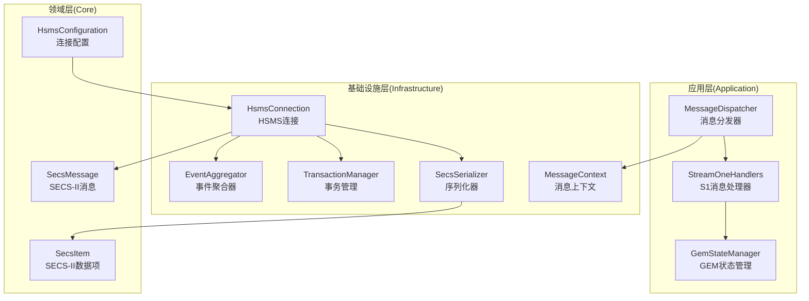
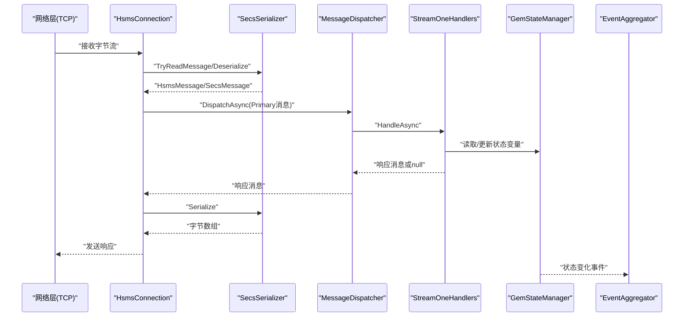
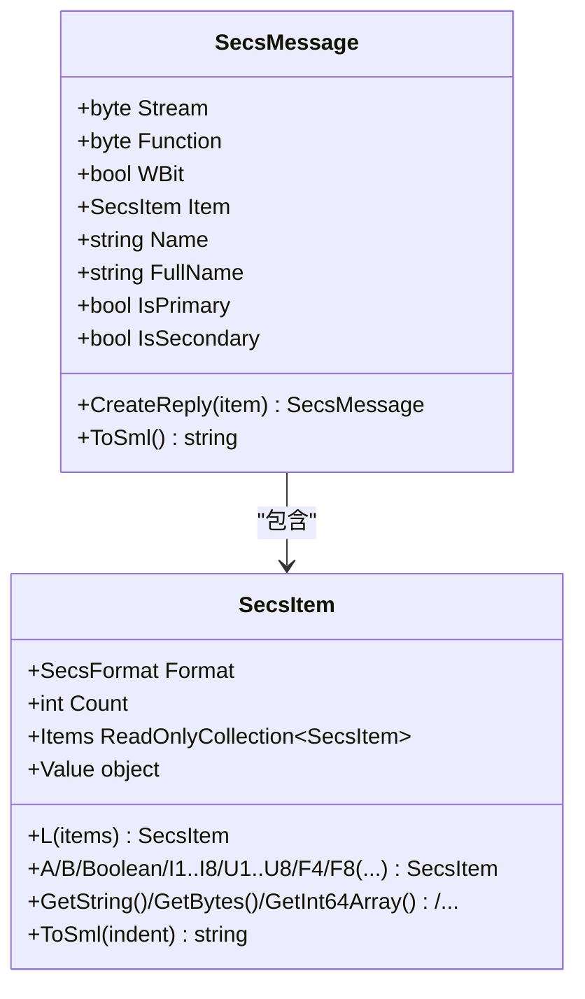
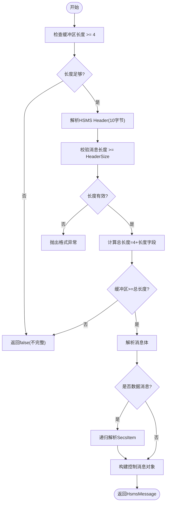
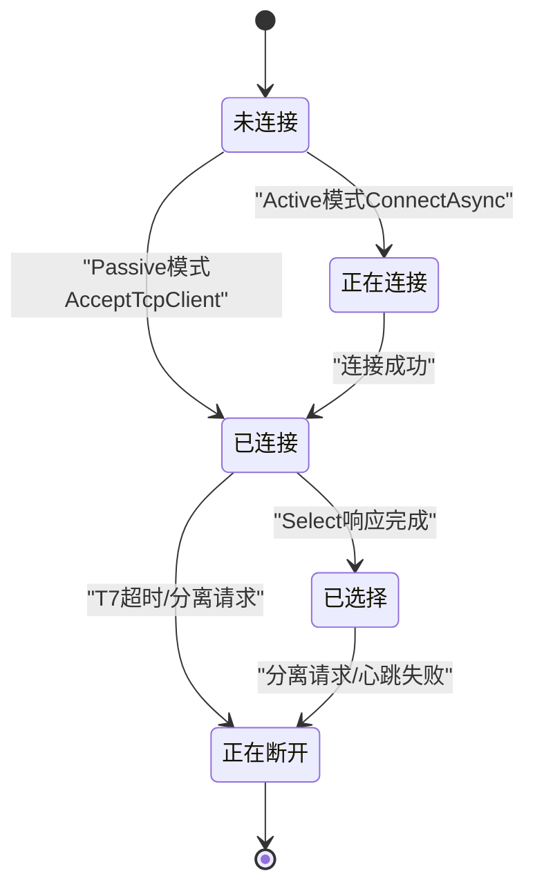
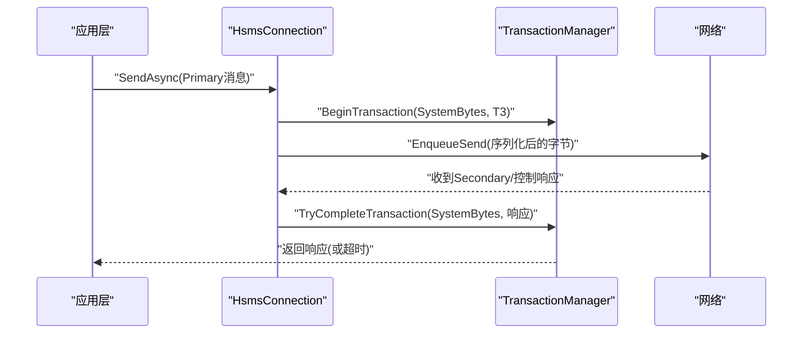
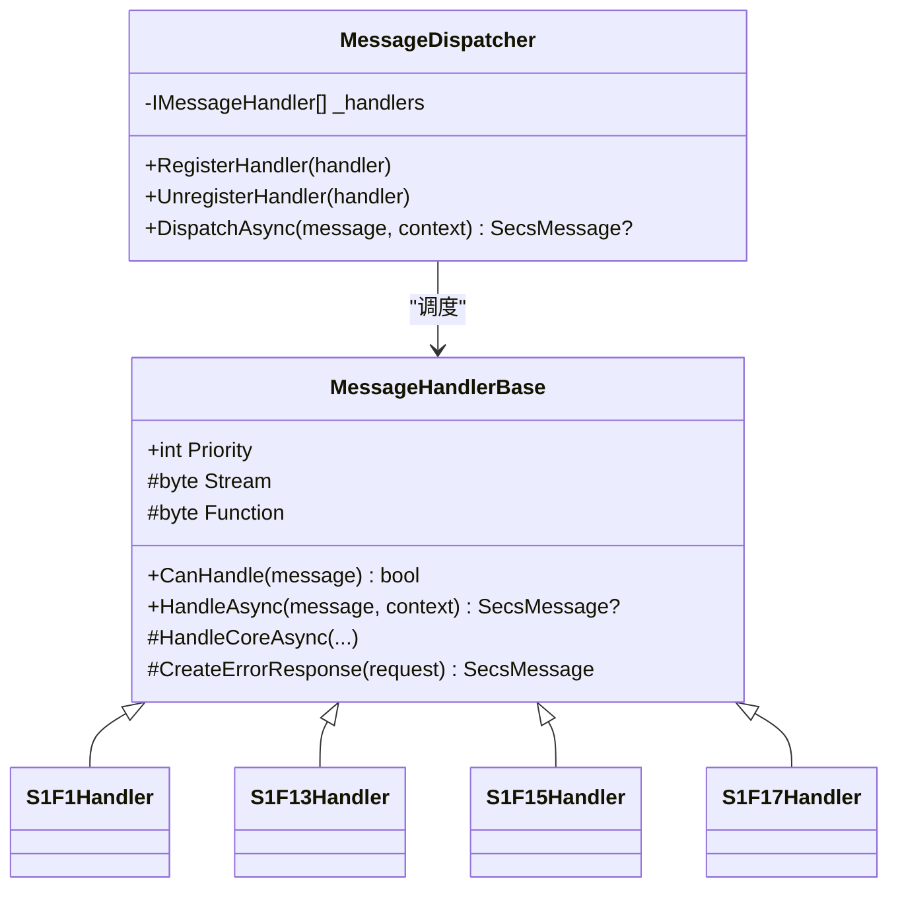
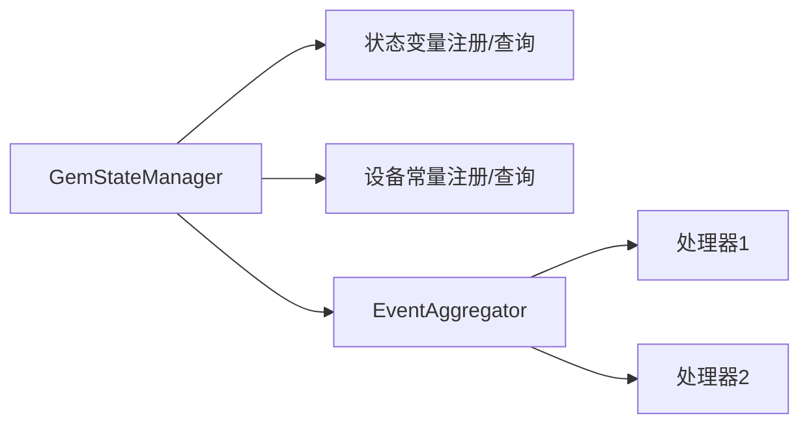
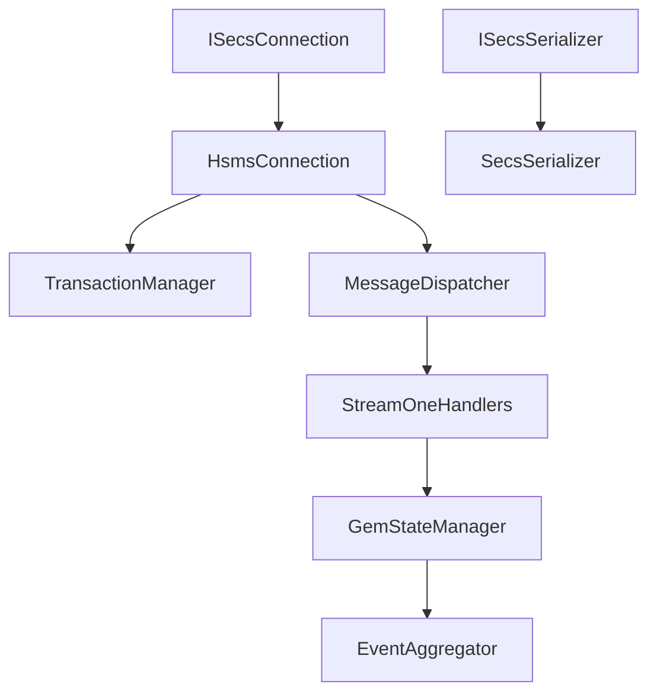

# 数据流设计

<cite>
**本文引用的文件**
- [SecsMessage.cs](file://WebGem/SECS2GEM/Core/Entities/SecsMessage.cs)
- [SecsItem.cs](file://WebGem/SECS2GEM/Core/Entities/SecsItem.cs)
- [SecsSerializer.cs](file://WebGem/SECS2GEM/Infrastructure/Serialization/SecsSerializer.cs)
- [HsmsConnection.cs](file://WebGem/SECS2GEM/Infrastructure/Connection/HsmsConnection.cs)
- [MessageContext.cs](file://WebGem/SECS2GEM/Infrastructure/Connection/MessageContext.cs)
- [ISecsConnection.cs](file://WebGem/SECS2GEM/Domain/Interfaces/ISecsConnection.cs)
- [ISecsSerializer.cs](file://WebGem/SECS2GEM/Domain/Interfaces/ISecsSerializer.cs)
- [TransactionManager.cs](file://WebGem/SECS2GEM/Infrastructure/Services/TransactionManager.cs)
- [MessageDispatcher.cs](file://WebGem/SECS2GEM/Application/Messaging/MessageDispatcher.cs)
- [StreamOneHandlers.cs](file://WebGem/SECS2GEM/Application/Handlers/StreamOneHandlers.cs)
- [GemStateManager.cs](file://WebGem/SECS2GEM/Application/State/GemStateManager.cs)
- [HsmsConfiguration.cs](file://WebGem/SECS2GEM/Infrastructure/Configuration/HsmsConfiguration.cs)
- [IGemEvent.cs](file://WebGem/SECS2GEM/Domain/Events/IGemEvent.cs)
- [EventAggregator.cs](file://WebGem/SECS2GEM/Infrastructure/Services/EventAggregator.cs)
- [ConnectionState.cs](file://WebGem/SECS2GEM/Core/Enums/ConnectionState.cs)
- [GemStates.cs](file://WebGem/SECS2GEM/Core/Enums/GemStates.cs)
- [HsmsMessageType.cs](file://WebGem/SECS2GEM/Core/Enums/HsmsMessageType.cs)
- [SecsFormat.cs](file://WebGem/SECS2GEM/Core/Enums/SecsFormat.cs)
</cite>

## 目录
1. [简介](#简介)
2. [项目结构](#项目结构)
3. [核心组件](#核心组件)
4. [架构总览](#架构总览)
5. [详细组件分析](#详细组件分析)
6. [依赖关系分析](#依赖关系分析)
7. [性能考量](#性能考量)
8. [故障排查指南](#故障排查指南)
9. [结论](#结论)
10. [附录](#附录)

## 简介
本文件面向SECS2-GEM项目的“数据流设计”，系统性阐述从消息接收到底层连接管理的完整数据流路径，重点覆盖以下方面：
- SECS-II消息的序列化/反序列化过程
- 状态变量的数据传递机制与事件传播路径
- 从网络层到应用层的数据流转时序
- 数据在不同架构层之间的转换与验证机制
- 数据一致性保证、错误处理与异常传播策略
- 异步处理与并发控制机制

## 项目结构
SECS2GEM采用分层架构，主要分为领域层（Core）、基础设施层（Infrastructure）、应用层（Application）与域事件层（Domain）。核心数据实体与协议定义位于Core；序列化、连接、事务、事件聚合等基础设施能力位于Infrastructure；应用层负责消息分发与业务处理器；域事件用于跨模块解耦。

图表来源
- [MessageDispatcher.cs:1-123](file://WebGem/SECS2GEM/Application/Messaging/MessageDispatcher.cs#L1-123)
- [StreamOneHandlers.cs:1-211](file://WebGem/SECS2GEM/Application/Handlers/StreamOneHandlers.cs#L1-211)
- [GemStateManager.cs:1-492](file://WebGem/SECS2GEM/Application/State/GemStateManager.cs#L1-492)
- [HsmsConnection.cs:1-906](file://WebGem/SECS2GEM/Infrastructure/Connection/HsmsConnection.cs#L1-906)
- [TransactionManager.cs:1-201](file://WebGem/SECS2GEM/Infrastructure/Services/TransactionManager.cs#L1-201)
- [SecsSerializer.cs:1-662](file://WebGem/SECS2GEM/Infrastructure/Serialization/SecsSerializer.cs#L1-662)
- [MessageContext.cs:1-65](file://WebGem/SECS2GEM/Infrastructure/Connection/MessageContext.cs#L1-65)
- [EventAggregator.cs:1-219](file://WebGem/SECS2GEM/Infrastructure/Services/EventAggregator.cs#L1-219)
- [SecsMessage.cs:1-209](file://WebGem/SECS2GEM/Core/Entities/SecsMessage.cs#L1-209)
- [SecsItem.cs:1-480](file://WebGem/SECS2GEM/Core/Entities/SecsItem.cs#L1-480)
- [HsmsConfiguration.cs:1-266](file://WebGem/SECS2GEM/Infrastructure/Configuration/HsmsConfiguration.cs#L1-266)

章节来源
- [MessageDispatcher.cs:1-123](file://WebGem/SECS2GEM/Application/Messaging/MessageDispatcher.cs#L1-123)
- [HsmsConnection.cs:1-906](file://WebGem/SECS2GEM/Infrastructure/Connection/HsmsConnection.cs#L1-906)
- [SecsSerializer.cs:1-662](file://WebGem/SECS2GEM/Infrastructure/Serialization/SecsSerializer.cs#L1-662)
- [GemStateManager.cs:1-492](file://WebGem/SECS2GEM/Application/State/GemStateManager.cs#L1-492)

## 核心组件
- SECS-II消息与数据项：不可变设计，提供流畅的构建API与SML输出，支持递归结构与多格式编码。
- 序列化器：实现HSMS消息与字节数组的双向转换，严格遵循大端序与SECS-II格式规范。
- 连接管理：基于状态机的HSMS连接，支持主动/被动模式、心跳、T7超时、日志记录与事务管理。
- 事务管理：基于SystemBytes的请求-响应关联，支持超时、取消与并发安全。
- 消息分发与处理器：责任链+策略模式，按优先级匹配处理器，统一异常与错误响应。
- GEM状态管理：封装通信/控制/处理三态机，提供状态变量与设备常量的注册与查询。
- 事件聚合：观察者模式实现，支持异步/同步处理器，异常隔离与订阅生命周期管理。

章节来源
- [SecsMessage.cs:1-209](file://WebGem/SECS2GEM/Core/Entities/SecsMessage.cs#L1-209)
- [SecsItem.cs:1-480](file://WebGem/SECS2GEM/Core/Entities/SecsItem.cs#L1-480)
- [SecsSerializer.cs:1-662](file://WebGem/SECS2GEM/Infrastructure/Serialization/SecsSerializer.cs#L1-662)
- [HsmsConnection.cs:1-906](file://WebGem/SECS2GEM/Infrastructure/Connection/HsmsConnection.cs#L1-906)
- [TransactionManager.cs:1-201](file://WebGem/SECS2GEM/Infrastructure/Services/TransactionManager.cs#L1-201)
- [MessageDispatcher.cs:1-123](file://WebGem/SECS2GEM/Application/Messaging/MessageDispatcher.cs#L1-123)
- [StreamOneHandlers.cs:1-211](file://WebGem/SECS2GEM/Application/Handlers/StreamOneHandlers.cs#L1-211)
- [GemStateManager.cs:1-492](file://WebGem/SECS2GEM/Application/State/GemStateManager.cs#L1-492)
- [EventAggregator.cs:1-219](file://WebGem/SECS2GEM/Infrastructure/Services/EventAggregator.cs#L1-219)

## 架构总览
下图展示了从网络层到应用层的端到端数据流，涵盖序列化/反序列化、消息分发、状态更新与事件传播。

图表来源
- [HsmsConnection.cs:547-800](file://WebGem/SECS2GEM/Infrastructure/Connection/HsmsConnection.cs#L547-800)
- [SecsSerializer.cs:90-177](file://WebGem/SECS2GEM/Infrastructure/Serialization/SecsSerializer.cs#L90-177)
- [MessageDispatcher.cs:60-91](file://WebGem/SECS2GEM/Application/Messaging/MessageDispatcher.cs#L60-91)
- [StreamOneHandlers.cs:88-211](file://WebGem/SECS2GEM/Application/Handlers/StreamOneHandlers.cs#L88-211)
- [GemStateManager.cs:110-150](file://WebGem/SECS2GEM/Application/State/GemStateManager.cs#L110-150)
- [EventAggregator.cs:23-67](file://WebGem/SECS2GEM/Infrastructure/Services/EventAggregator.cs#L23-67)

## 详细组件分析

### SECS-II消息与数据项
- 不可变设计确保线程安全，提供流畅的构建API与SML输出，便于调试与日志记录。
- 数据项支持List递归结构与多种格式（ASCII/JIS8/Unicode、Binary、Boolean、I1/I2/I4/I8、U1/U2/U4/U8、F4/F8），格式码与长度字节按SECS-II标准编码。
- 通过静态工厂方法简化创建，值访问器提供类型安全的读取与自动类型转换。

图表来源
- [SecsMessage.cs:18-209](file://WebGem/SECS2GEM/Core/Entities/SecsMessage.cs#L18-209)
- [SecsItem.cs:23-480](file://WebGem/SECS2GEM/Core/Entities/SecsItem.cs#L23-480)

章节来源
- [SecsMessage.cs:18-209](file://WebGem/SECS2GEM/Core/Entities/SecsMessage.cs#L18-209)
- [SecsItem.cs:23-480](file://WebGem/SECS2GEM/Core/Entities/SecsItem.cs#L23-480)

### 序列化/反序列化流程
- 序列化：计算Header大小与数据项大小，写入长度前缀（大端序）、HSMS Header与数据项，递归处理List与各基础格式。
- 反序列化：先解析长度与Header，再根据数据消息类型解析SecsItem树，支持不完整数据检测与长度校验。
- 错误处理：针对不完整数据、非法格式码、超长消息长度抛出相应异常，保障协议一致性。

图表来源
- [SecsSerializer.cs:136-177](file://WebGem/SECS2GEM/Infrastructure/Serialization/SecsSerializer.cs#L136-177)
- [SecsSerializer.cs:90-126](file://WebGem/SECS2GEM/Infrastructure/Serialization/SecsSerializer.cs#L90-126)

章节来源
- [SecsSerializer.cs:46-177](file://WebGem/SECS2GEM/Infrastructure/Serialization/SecsSerializer.cs#L46-177)

### 连接管理与状态机
- 状态机：NotConnected → Connecting → Connected → Selected → Disconnecting，遵循HSMS标准。
- 主动/被动模式：Active模式调用ConnectAsync，Passive模式调用StartListeningAsync；被动模式下监听并接受首个连接，后续拒绝多余连接。
- 心跳与T7超时：周期性发送Linktest，失败累计超过阈值断开；被动模式下T7超时未收到Select请求则断开。
- 日志记录：发送/接收消息均记录原始字节与解析后的消息，便于审计与排障。

图表来源
- [ConnectionState.cs:10-61](file://WebGem/SECS2GEM/Core/Enums/ConnectionState.cs#L10-61)
- [HsmsConnection.cs:146-337](file://WebGem/SECS2GEM/Infrastructure/Connection/HsmsConnection.cs#L146-337)
- [HsmsConnection.cs:280-296](file://WebGem/SECS2GEM/Infrastructure/Connection/HsmsConnection.cs#L280-296)

章节来源
- [HsmsConnection.cs:141-420](file://WebGem/SECS2GEM/Infrastructure/Connection/HsmsConnection.cs#L141-420)
- [ConnectionState.cs:10-61](file://WebGem/SECS2GEM/Core/Enums/ConnectionState.cs#L10-61)

### 事务管理与并发控制
- 事务ID：使用原子自增SystemBytes作为事务键，确保唯一性与并发安全。
- 事务容器：ConcurrentDictionary维护活跃事务，超时自动清理，取消所有事务时保证资源回收。
- 等待机制：基于TaskCompletionSource异步等待响应，支持与外部取消令牌合并，超时抛出T3超时异常。

图表来源
- [HsmsConnection.cs:427-453](file://WebGem/SECS2GEM/Infrastructure/Connection/HsmsConnection.cs#L427-453)
- [TransactionManager.cs:46-72](file://WebGem/SECS2GEM/Infrastructure/Services/TransactionManager.cs#L46-72)
- [TransactionManager.cs:160-174](file://WebGem/SECS2GEM/Infrastructure/Services/TransactionManager.cs#L160-174)

章节来源
- [TransactionManager.cs:24-118](file://WebGem/SECS2GEM/Infrastructure/Services/TransactionManager.cs#L24-118)
- [HsmsConnection.cs:427-541](file://WebGem/SECS2GEM/Infrastructure/Connection/HsmsConnection.cs#L427-541)

### 消息分发与处理器
- 分发器：维护处理器列表，按优先级排序，遍历匹配CanHandle，委托处理器HandleAsync。
- 处理器基类：统一异常捕获与错误响应（S9F7），支持自定义错误创建。
- S1消息处理器：Are You There、Establish Communications、Request OFF-LINE/ON-LINE等，结合GEM状态管理器更新状态与变量。

图表来源
- [MessageDispatcher.cs:27-123](file://WebGem/SECS2GEM/Application/Messaging/MessageDispatcher.cs#L27-123)
- [StreamOneHandlers.cs:20-211](file://WebGem/SECS2GEM/Application/Handlers/StreamOneHandlers.cs#L20-211)

章节来源
- [MessageDispatcher.cs:27-123](file://WebGem/SECS2GEM/Application/Messaging/MessageDispatcher.cs#L27-123)
- [StreamOneHandlers.cs:88-211](file://WebGem/SECS2GEM/Application/Handlers/StreamOneHandlers.cs#L88-211)

### 状态变量与事件传播
- 状态变量：注册标准SVID（如时钟、控制状态），支持按ID读取/设置，提供只读集合。
- 设备常量：注册ECID，支持条件设置，提供只读集合。
- 事件传播：状态变化通过EventAggregator异步广播，处理器异常被隔离，不影响其他订阅者。

图表来源
- [GemStateManager.cs:110-194](file://WebGem/SECS2GEM/Application/State/GemStateManager.cs#L110-194)
- [EventAggregator.cs:17-106](file://WebGem/SECS2GEM/Infrastructure/Services/EventAggregator.cs#L17-106)

章节来源
- [GemStateManager.cs:22-492](file://WebGem/SECS2GEM/Application/State/GemStateManager.cs#L22-492)
- [EventAggregator.cs:17-219](file://WebGem/SECS2GEM/Infrastructure/Services/EventAggregator.cs#L17-219)

### 消息上下文与回复机制
- MessageContext封装SystemBytes、DeviceId、连接与GEM状态，并提供ReplyAsync便捷方法。
- 处理器在HandleCoreAsync中通过上下文向连接发送回复，确保与请求一一对应。

章节来源
- [MessageContext.cs:12-65](file://WebGem/SECS2GEM/Infrastructure/Connection/MessageContext.cs#L12-65)
- [StreamOneHandlers.cs:94-114](file://WebGem/SECS2GEM/Application/Handlers/StreamOneHandlers.cs#L94-114)

## 依赖关系分析
- 接口契约：ISecsConnection与ISecsSerializer定义清晰边界，便于替换与测试。
- 松耦合：消息分发器与处理器通过接口解耦；事件聚合器通过泛型约束实现类型安全。
- 并发安全：事务管理器使用原子计数与并发字典；状态管理器使用锁与并发集合。

图表来源
- [ISecsConnection.cs:56-144](file://WebGem/SECS2GEM/Domain/Interfaces/ISecsConnection.cs#L56-144)
- [ISecsSerializer.cs:21-61](file://WebGem/SECS2GEM/Domain/Interfaces/ISecsSerializer.cs#L21-61)
- [HsmsConnection.cs:30-139](file://WebGem/SECS2GEM/Infrastructure/Connection/HsmsConnection.cs#L30-139)
- [TransactionManager.cs:24-118](file://WebGem/SECS2GEM/Infrastructure/Services/TransactionManager.cs#L24-118)
- [MessageDispatcher.cs:27-123](file://WebGem/SECS2GEM/Application/Messaging/MessageDispatcher.cs#L27-123)
- [StreamOneHandlers.cs:20-211](file://WebGem/SECS2GEM/Application/Handlers/StreamOneHandlers.cs#L20-211)
- [GemStateManager.cs:22-492](file://WebGem/SECS2GEM/Application/State/GemStateManager.cs#L22-492)
- [EventAggregator.cs:17-219](file://WebGem/SECS2GEM/Infrastructure/Services/EventAggregator.cs#L17-219)

章节来源
- [ISecsConnection.cs:56-144](file://WebGem/SECS2GEM/Domain/Interfaces/ISecsConnection.cs#L56-144)
- [ISecsSerializer.cs:21-61](file://WebGem/SECS2GEM/Domain/Interfaces/ISecsSerializer.cs#L21-61)

## 性能考量
- 缓冲区与批量处理：接收缓冲区与Channel队列减少系统调用开销；TryReadMessage支持粘包处理，避免频繁分配。
- 大端序与Span：序列化/反序列化使用Span与BinaryPrimitives，降低装箱与拷贝成本。
- 并发与超时：事务超时与心跳失败快速失败，避免资源长时间占用。
- 日志开销：消息日志可配置开关，避免在高吞吐场景下的I/O瓶颈。

## 故障排查指南
- 序列化异常：检查消息长度字段、格式码与长度字节数是否符合规范；关注不完整数据与超长消息。
- 连接问题：查看状态机转换日志，确认T7超时、心跳失败次数与分离请求；检查被动模式下是否正确接受首个连接。
- 事务超时：核对T3超时配置与处理器耗时；确认TryCompleteTransaction是否被调用。
- 错误响应：Primary消息无处理器时返回S9F7；处理器内部异常在基类中被捕获并返回S9F7或null（无W-Bit）。
- 事件异常：事件聚合器对单个订阅者的异常进行隔离，不影响其他订阅者；建议在订阅处理器中增加日志记录。

章节来源
- [SecsSerializer.cs:136-177](file://WebGem/SECS2GEM/Infrastructure/Serialization/SecsSerializer.cs#L136-177)
- [HsmsConnection.cs:547-610](file://WebGem/SECS2GEM/Infrastructure/Connection/HsmsConnection.cs#L547-610)
- [TransactionManager.cs:102-110](file://WebGem/SECS2GEM/Infrastructure/Services/TransactionManager.cs#L102-110)
- [MessageDispatcher.cs:83-91](file://WebGem/SECS2GEM/Application/Messaging/MessageDispatcher.cs#L83-91)
- [EventAggregator.cs:168-197](file://WebGem/SECS2GEM/Infrastructure/Services/EventAggregator.cs#L168-197)

## 结论
SECS2-GEM通过清晰的分层架构与严谨的协议实现，提供了可靠的SECS-II数据流处理能力。从底层的HSMS连接与事务管理，到中间层的序列化与消息分发，再到上层的状态管理与事件传播，整体设计兼顾了正确性、可扩展性与可维护性。建议在生产环境中结合配置参数（如T3/T6/T7、心跳间隔、最大消息大小）进行压测与调优，并完善异常与事件日志以便快速定位问题。

## 附录
- 配置要点：HsmsConfiguration集中管理网络、超时、心跳与缓冲区参数；可通过CreatePassive/CreateActive便捷创建典型配置。
- 协议枚举：ConnectionState、HsmsMessageType、GemStates、SecsFormat等枚举定义了协议与状态的标准化表达。

章节来源
- [HsmsConfiguration.cs:15-266](file://WebGem/SECS2GEM/Infrastructure/Configuration/HsmsConfiguration.cs#L15-266)
- [ConnectionState.cs:10-61](file://WebGem/SECS2GEM/Core/Enums/ConnectionState.cs#L10-61)
- [HsmsMessageType.cs:10-67](file://WebGem/SECS2GEM/Core/Enums/HsmsMessageType.cs#L10-67)
- [GemStates.cs:10-176](file://WebGem/SECS2GEM/Core/Enums/GemStates.cs#L10-176)
- [SecsFormat.cs:13-112](file://WebGem/SECS2GEM/Core/Enums/SecsFormat.cs#L13-112)