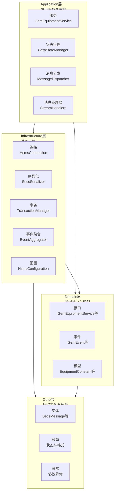
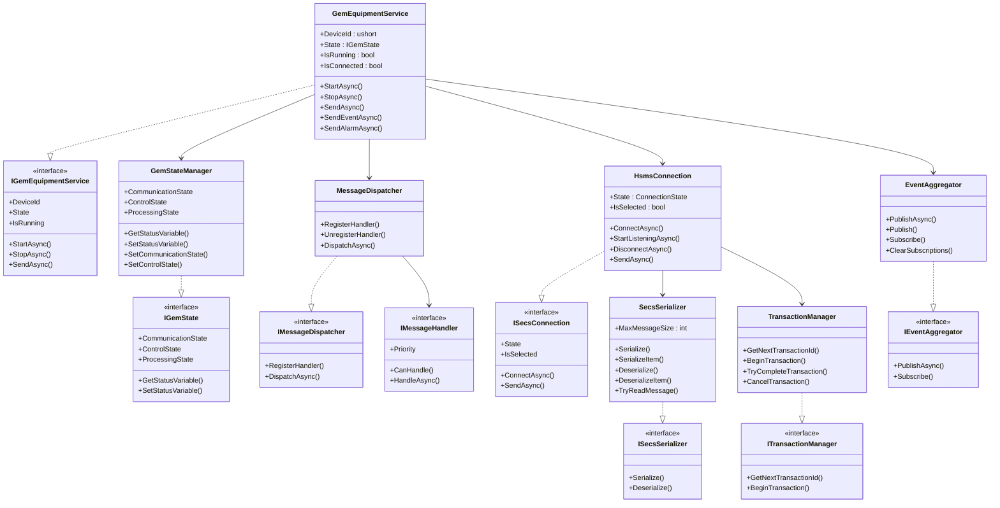
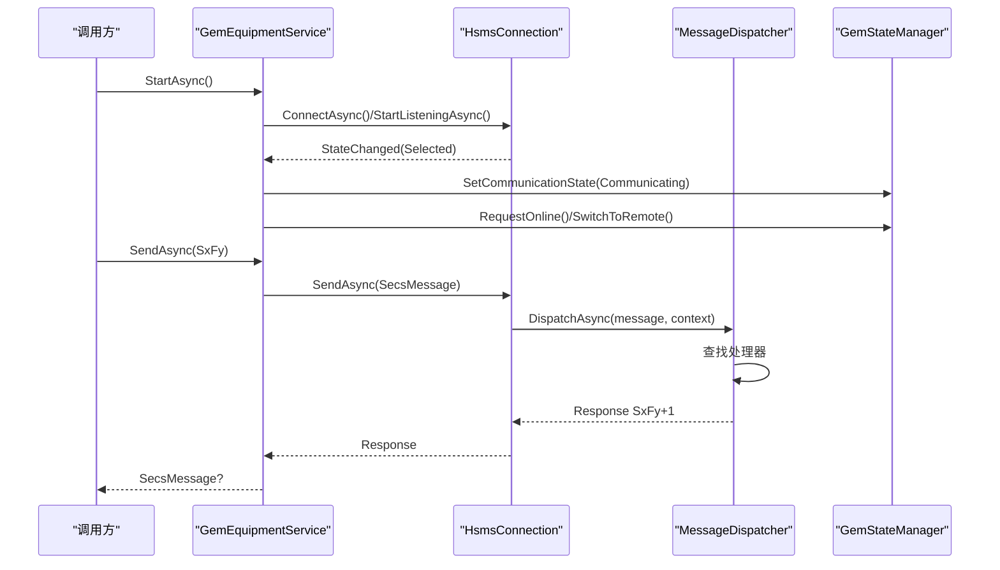
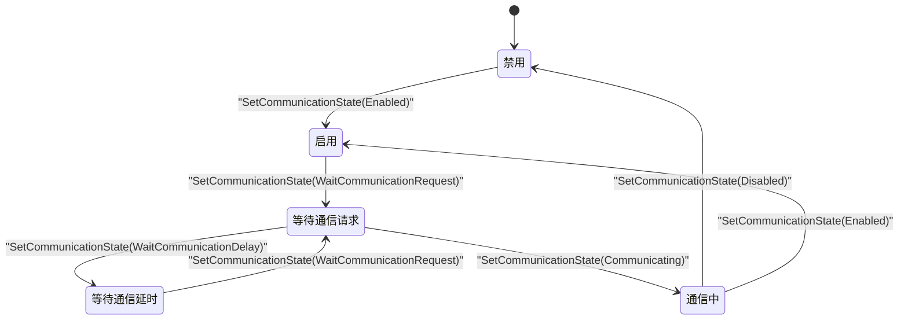
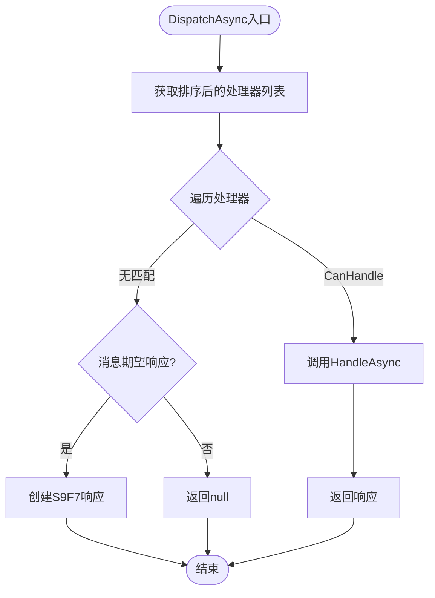
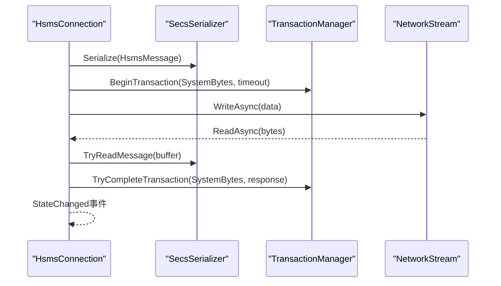
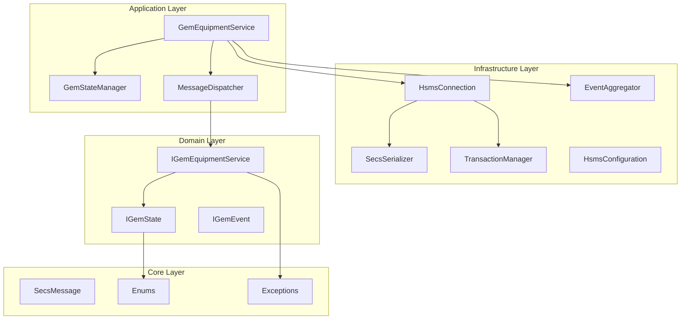

# 整体架构概览

<cite>
**本文档引用的文件**
- [SECS2GEM.csproj](file://WebGem/SECS2GEM/SECS2GEM.csproj)
- [SecsMessage.cs](file://WebGem/SECS2GEM/Core/Entities/SecsMessage.cs)
- [IGemEquipmentService.cs](file://WebGem/SECS2GEM/Domain/Interfaces/IGemEquipmentService.cs)
- [GemEquipmentService.cs](file://WebGem/SECS2GEM/Application/Services/GemEquipmentService.cs)
- [HsmsConnection.cs](file://WebGem/SECS2GEM/Infrastructure/Connection/HsmsConnection.cs)
- [MessageDispatcher.cs](file://WebGem/SECS2GEM/Application/Messaging/MessageDispatcher.cs)
- [GemStateManager.cs](file://WebGem/SECS2GEM/Application/State/GemStateManager.cs)
- [EventAggregator.cs](file://WebGem/SECS2GEM/Infrastructure/Services/EventAggregator.cs)
- [SecsSerializer.cs](file://WebGem/SECS2GEM/Infrastructure/Serialization/SecsSerializer.cs)
- [TransactionManager.cs](file://WebGem/SECS2GEM/Infrastructure/Services/TransactionManager.cs)
- [HsmsConfiguration.cs](file://WebGem/SECS2GEM/Infrastructure/Configuration/HsmsConfiguration.cs)
- [EquipmentConstant.cs](file://WebGem/SECS2GEM/Domain/Models/EquipmentConstant.cs)
- [IGemEvent.cs](file://WebGem/SECS2GEM/Domain/Events/IGemEvent.cs)
- [SECS2GEM_Class_Diagram.md](file://WebGem/SECS2GEM/SECS2GEM_Class_Diagram.md)
</cite>

## 目录
1. [引言](#引言)
2. [项目结构](#项目结构)
3. [核心组件](#核心组件)
4. [架构总览](#架构总览)
5. [详细组件分析](#详细组件分析)
6. [依赖分析](#依赖分析)
7. [性能考虑](#性能考虑)
8. [故障排除指南](#故障排除指南)
9. [结论](#结论)

## 引言
本项目旨在实现SECS/GEM协议栈的.NET实现，围绕SECS-II消息处理与GEM设备状态管理展开。整体采用分层架构设计，将业务逻辑与基础设施解耦，通过接口驱动的方式实现松耦合与高内聚，便于扩展与维护。

## 项目结构
项目采用典型的四层架构：
- Core层：提供协议实体、枚举与异常定义，确保跨层共享与协议一致性。
- Domain层：定义领域接口、事件与模型，承载业务规则与状态定义。
- Application层：编排业务流程，整合连接、状态与消息分发，对外暴露统一服务接口。
- Infrastructure层：提供网络连接、序列化、事务与事件聚合等基础设施能力。

**图表来源**
- [SECS2GEM_Class_Diagram.md:630-666](file://WebGem/SECS2GEM/SECS2GEM_Class_Diagram.md#L630-L666)

**章节来源**
- [SECS2GEM.csproj:1-10](file://WebGem/SECS2GEM/SECS2GEM.csproj#L1-L10)
- [SECS2GEM_Class_Diagram.md:630-666](file://WebGem/SECS2GEM/SECS2GEM_Class_Diagram.md#L630-L666)

## 核心组件
- 协议实体与消息模型：Core层提供SECS-II消息与HSMS消息的完整建模，确保序列化/反序列化与协议一致性。
- 领域接口与事件：Domain层定义设备服务接口、事件基类与模型，形成清晰的业务边界。
- 应用服务编排：Application层通过GemEquipmentService整合连接、状态与消息分发，提供统一的设备服务入口。
- 基础设施能力：Infrastructure层提供网络连接、序列化、事务与事件聚合等通用能力，支撑上层业务。

**章节来源**
- [SecsMessage.cs:18-209](file://WebGem/SECS2GEM/Core/Entities/SecsMessage.cs#L18-L209)
- [IGemEquipmentService.cs:25-159](file://WebGem/SECS2GEM/Domain/Interfaces/IGemEquipmentService.cs#L25-L159)
- [GemEquipmentService.cs:33-455](file://WebGem/SECS2GEM/Application/Services/GemEquipmentService.cs#L33-L455)
- [HsmsConnection.cs:30-800](file://WebGem/SECS2GEM/Infrastructure/Connection/HsmsConnection.cs#L30-L800)
- [MessageDispatcher.cs:27-123](file://WebGem/SECS2GEM/Application/Messaging/MessageDispatcher.cs#L27-L123)
- [GemStateManager.cs:22-492](file://WebGem/SECS2GEM/Application/State/GemStateManager.cs#L22-L492)
- [EventAggregator.cs:17-219](file://WebGem/SECS2GEM/Infrastructure/Services/EventAggregator.cs#L17-L219)
- [SecsSerializer.cs:27-662](file://WebGem/SECS2GEM/Infrastructure/Serialization/SecsSerializer.cs#L27-L662)
- [TransactionManager.cs:24-201](file://WebGem/SECS2GEM/Infrastructure/Services/TransactionManager.cs#L24-L201)
- [HsmsConfiguration.cs:15-266](file://WebGem/SECS2GEM/Infrastructure/Configuration/HsmsConfiguration.cs#L15-L266)

## 架构总览
整体架构遵循接口驱动、松耦合、高内聚的设计原则：
- 接口驱动：Domain层定义接口，Application层实现，Infrastructure层提供具体实现，通过接口解耦。
- 松耦合：各层之间通过接口交互，Application层对Infrastructure层仅依赖抽象接口。
- 高内聚：每层内部职责明确，Application层负责业务编排，Infrastructure层负责基础设施能力。

**图表来源**
- [SECS2GEM_Class_Diagram.md:5-166](file://WebGem/SECS2GEM/SECS2GEM_Class_Diagram.md#L5-L166)

**章节来源**
- [SECS2GEM_Class_Diagram.md:5-166](file://WebGem/SECS2GEM/SECS2GEM_Class_Diagram.md#L5-L166)

## 详细组件分析

### 应用服务组件（GemEquipmentService）
- 职责：作为设备服务外观，整合连接、状态管理、消息分发与事件聚合，提供统一的设备服务入口。
- 依赖关系：依赖HsmsConnection进行网络通信，依赖GemStateManager管理GEM状态，依赖MessageDispatcher分发消息，依赖EventAggregator发布事件。
- 生命周期：支持StartAsync/StopAsync，根据配置决定主动/被动连接模式；在通信状态变化时自动切换在线模式。
- 事件与报告：支持事件报告与报警上报，封装S6F11与S5F1消息的构造与发送。

**图表来源**
- [GemEquipmentService.cs:140-202](file://WebGem/SECS2GEM/Application/Services/GemEquipmentService.cs#L140-L202)
- [HsmsConnection.cs:427-541](file://WebGem/SECS2GEM/Infrastructure/Connection/HsmsConnection.cs#L427-L541)
- [MessageDispatcher.cs:67-91](file://WebGem/SECS2GEM/Application/Messaging/MessageDispatcher.cs#L67-L91)
- [GemStateManager.cs:201-241](file://WebGem/SECS2GEM/Application/State/GemStateManager.cs#L201-L241)

**章节来源**
- [GemEquipmentService.cs:33-455](file://WebGem/SECS2GEM/Application/Services/GemEquipmentService.cs#L33-L455)

### 状态管理组件（GemStateManager）
- 职责：封装GEM协议的通信、控制与处理三态机，管理状态变量与设备常量，提供状态转换验证。
- 状态转换：通信状态（Disabled/Enabled/WaitCommunicationRequest/WaitCommunicationDelay/Communicating）、控制状态（EquipmentOffline/AttemptOnline/OnlineLocal/OnlineRemote/HostOffline）与处理状态（Idle/Setup/Ready/Executing/Paused）。
- 事件发布：状态变化时发布事件，供上层订阅。

**图表来源**
- [GemStateManager.cs:357-455](file://WebGem/SECS2GEM/Application/State/GemStateManager.cs#L357-L455)

**章节来源**
- [GemStateManager.cs:22-492](file://WebGem/SECS2GEM/Application/State/GemStateManager.cs#L22-L492)

### 消息分发组件（MessageDispatcher）
- 职责：责任链+策略模式组合，维护处理器列表，按优先级匹配并委托处理。
- 动态注册：支持运行时注册/注销处理器，覆盖默认行为。
- 错误处理：无匹配处理器时，若消息期望响应则返回S9F7错误。

**图表来源**
- [MessageDispatcher.cs:67-121](file://WebGem/SECS2GEM/Application/Messaging/MessageDispatcher.cs#L67-L121)

**章节来源**
- [MessageDispatcher.cs:27-123](file://WebGem/SECS2GEM/Application/Messaging/MessageDispatcher.cs#L27-L123)

### 连接组件（HsmsConnection）
- 职责：基于HSMS协议的TCP连接管理，支持Active/Passive模式，自动Select/Deselect/Linktest。
- 异步处理：使用Channel实现发送队列，独立接收/发送/心跳任务，线程安全。
- 事务管理：与TransactionManager协作，实现Primary消息的响应等待与超时处理。
- 日志记录：集成MessageLogger记录收发消息，支持原始字节与SML格式。

**图表来源**
- [HsmsConnection.cs:427-541](file://WebGem/SECS2GEM/Infrastructure/Connection/HsmsConnection.cs#L427-L541)
- [SecsSerializer.cs:139-177](file://WebGem/SECS2GEM/Infrastructure/Serialization/SecsSerializer.cs#L139-L177)
- [TransactionManager.cs:46-72](file://WebGem/SECS2GEM/Infrastructure/Services/TransactionManager.cs#L46-L72)

**章节来源**
- [HsmsConnection.cs:30-800](file://WebGem/SECS2GEM/Infrastructure/Connection/HsmsConnection.cs#L30-L800)

### 序列化组件（SecsSerializer）
- 职责：实现SECS-II数据项的序列化与反序列化，支持多种数据格式与大端序编码。
- 性能优化：使用Span与预分配缓冲区，减少GC压力；支持TryReadMessage一次性读取完整消息。
- 错误处理：严格的格式校验与异常抛出，便于上层定位问题。

**章节来源**
- [SecsSerializer.cs:27-662](file://WebGem/SECS2GEM/Infrastructure/Serialization/SecsSerializer.cs#L27-L662)

### 事务管理组件（TransactionManager）
- 职责：管理消息事务生命周期，提供事务ID生成、事务创建、完成与超时处理。
- 并发安全：使用Interlocked与ConcurrentDictionary保证线程安全。
- 超时机制：基于CancellationTokenSource实现超时取消，抛出对应异常。

**章节来源**
- [TransactionManager.cs:24-201](file://WebGem/SECS2GEM/Infrastructure/Services/TransactionManager.cs#L24-L201)

### 配置组件（HsmsConfiguration）
- 职责：集中管理HSMS连接参数（IP、端口、模式、超时、心跳、缓冲区大小等），提供默认值与验证。
- 灵活配置：支持静态工厂方法创建Active/Passive模式配置，便于快速初始化。

**章节来源**
- [HsmsConfiguration.cs:15-266](file://WebGem/SECS2GEM/Infrastructure/Configuration/HsmsConfiguration.cs#L15-L266)

### 事件聚合组件（EventAggregator）
- 职责：观察者模式实现，支持异步/同步事件处理，异常隔离，订阅凭证用于取消订阅。
- 并发安全：使用ConcurrentDictionary按事件类型存储订阅者，避免并发修改。

**章节来源**
- [EventAggregator.cs:17-219](file://WebGem/SECS2GEM/Infrastructure/Services/EventAggregator.cs#L17-L219)

### 领域模型（EquipmentConstant）
- 职责：设备常量定义，支持只读/范围校验与值变更回调，提供默认值与当前值访问。
- 业务价值：为S2F13/S2F14查询与S2F15/S2F16设置提供统一模型。

**章节来源**
- [EquipmentConstant.cs:12-122](file://WebGem/SECS2GEM/Domain/Models/EquipmentConstant.cs#L12-L122)

### 领域事件（IGemEvent）
- 职责：事件基接口与抽象基类，统一事件的时间戳与来源标识，便于事件聚合与追踪。

**章节来源**
- [IGemEvent.cs:10-51](file://WebGem/SECS2GEM/Domain/Events/IGemEvent.cs#L10-L51)

## 依赖分析
- 层间依赖：Application依赖Infrastructure与Domain；Infrastructure依赖Domain与Core；Domain依赖Core。
- 组件耦合：Application层通过接口依赖Infrastructure层，降低耦合度；Infrastructure层内部组件通过抽象接口协作。
- 循环依赖：未发现循环依赖，接口契约清晰。

**图表来源**
- [SECS2GEM_Class_Diagram.md:630-666](file://WebGem/SECS2GEM/SECS2GEM_Class_Diagram.md#L630-L666)

**章节来源**
- [SECS2GEM_Class_Diagram.md:630-666](file://WebGem/SECS2GEM/SECS2GEM_Class_Diagram.md#L630-L666)

## 性能考虑
- 异步与并发：连接层使用Channel与多任务模型，提升吞吐与响应性；状态管理与事件聚合使用并发容器，保证线程安全。
- 序列化优化：使用Span与预分配缓冲区，减少内存分配；TryReadMessage一次性解析完整消息，降低解析成本。
- 事务超时：TransactionManager提供超时控制，避免长时间占用资源；连接层对关键操作设置超时，防止阻塞。
- 缓冲区与消息大小：HsmsConfiguration提供可配置的缓冲区与最大消息大小，平衡内存占用与性能。

## 故障排除指南
- 连接失败：检查HsmsConfiguration的IP/端口与模式配置，查看连接状态事件与异常信息。
- 通信超时：检查T3/T6/T7等超时配置，确认网络稳定性与心跳设置。
- 消息解析错误：检查消息格式与长度，查看序列化异常与日志输出。
- 事务超时：检查事务超时设置与处理器处理耗时，必要时调整超时阈值。
- 状态异常：检查状态转换规则与事件发布，确认状态机一致性。

**章节来源**
- [HsmsConnection.cs:301-337](file://WebGem/SECS2GEM/Infrastructure/Connection/HsmsConnection.cs#L301-L337)
- [SecsSerializer.cs:139-177](file://WebGem/SECS2GEM/Infrastructure/Serialization/SecsSerializer.cs#L139-L177)
- [TransactionManager.cs:160-174](file://WebGem/SECS2GEM/Infrastructure/Services/TransactionManager.cs#L160-L174)
- [GemStateManager.cs:357-455](file://WebGem/SECS2GEM/Application/State/GemStateManager.cs#L357-L455)

## 结论
本项目通过清晰的分层架构与接口驱动设计，实现了SECS/GEM协议栈的模块化与可扩展性。Application层负责业务编排，Infrastructure层提供稳定的基础能力，Domain层承载业务规则，Core层确保协议一致性。该架构为后续的功能扩展与维护奠定了坚实基础。