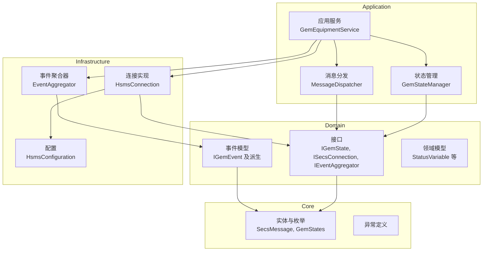
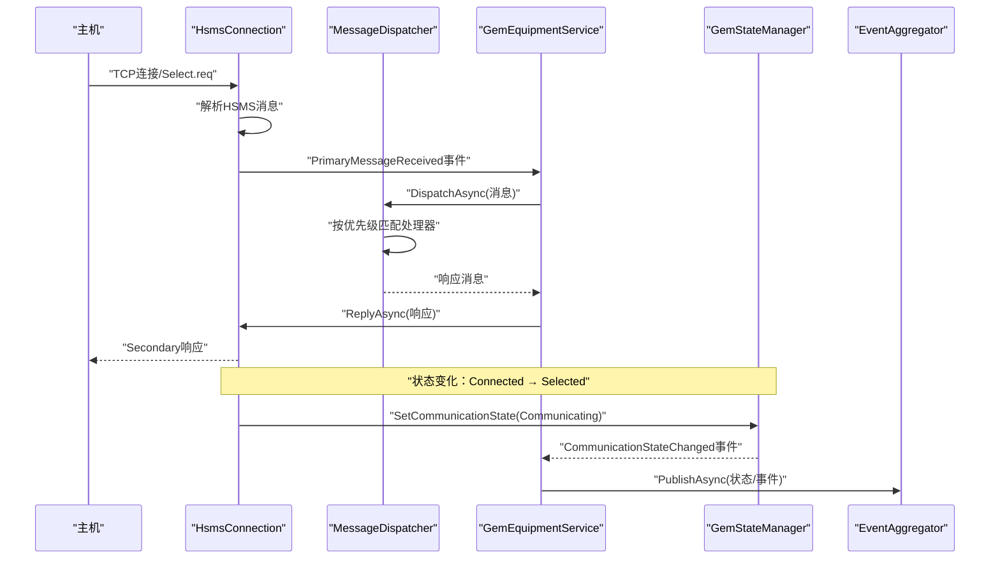
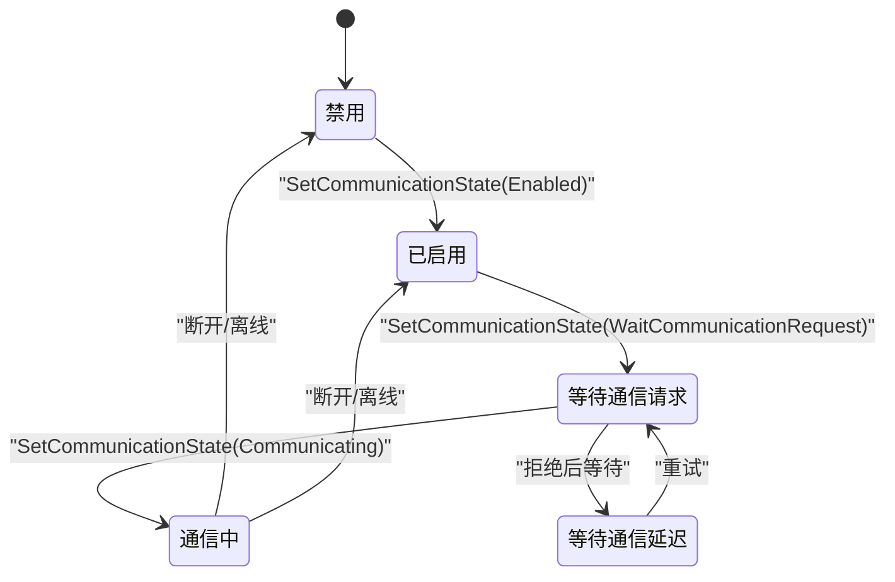
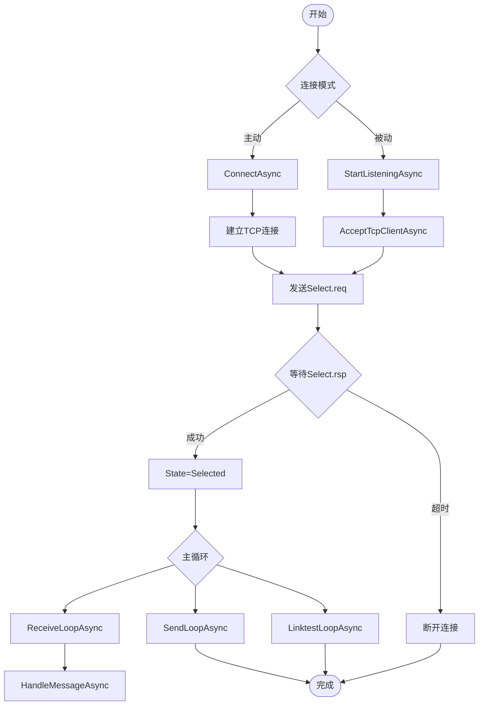
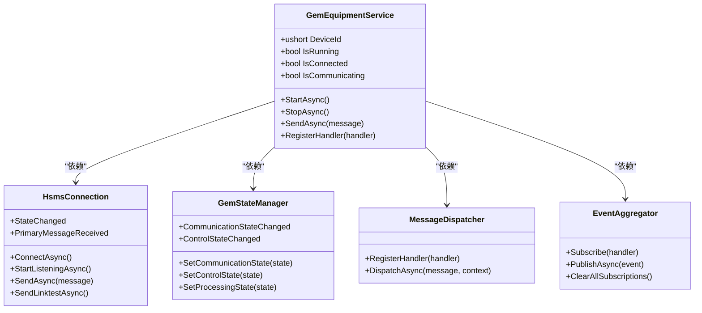
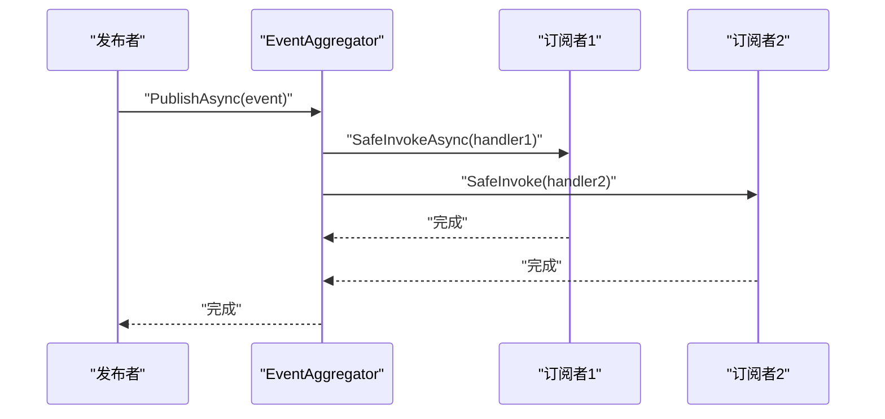
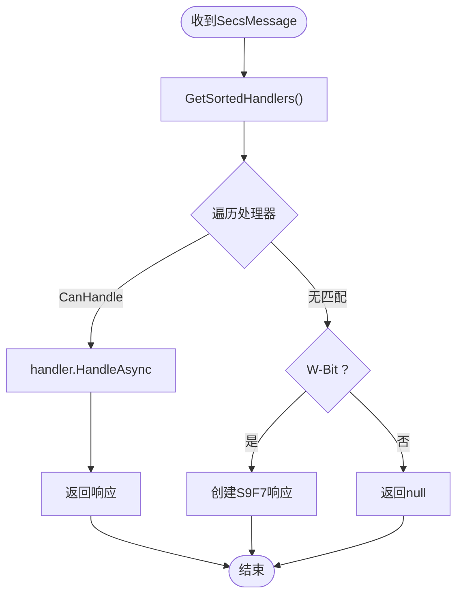
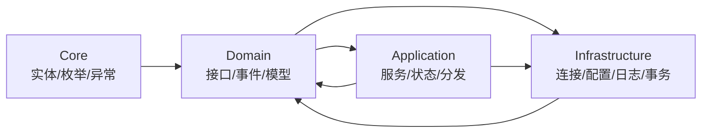

# 架构设计

<cite>
**本文引用的文件**
- [SECS2GEM.csproj](file://WebGem/SECS2GEM/SECS2GEM.csproj)
- [GemStates.cs](file://WebGem/SECS2GEM/Core/Enums/GemStates.cs)
- [IGemState.cs](file://WebGem/SECS2GEM/Domain/Interfaces/IGemState.cs)
- [GemStateManager.cs](file://WebGem/SECS2GEM/Application/State/GemStateManager.cs)
- [IEventAggregator.cs](file://WebGem/SECS2GEM/Domain/Interfaces/IEventAggregator.cs)
- [EventAggregator.cs](file://WebGem/SECS2GEM/Infrastructure/Services/EventAggregator.cs)
- [IGemEvent.cs](file://WebGem/SECS2GEM/Domain/Events/IGemEvent.cs)
- [ISecsConnection.cs](file://WebGem/SECS2GEM/Domain/Interfaces/ISecsConnection.cs)
- [HsmsConnection.cs](file://WebGem/SECS2GEM/Infrastructure/Connection/HsmsConnection.cs)
- [GemEquipmentService.cs](file://WebGem/SECS2GEM/Application/Services/GemEquipmentService.cs)
- [SecsMessage.cs](file://WebGem/SECS2GEM/Core/Entities/SecsMessage.cs)
- [HsmsConfiguration.cs](file://WebGem/SECS2GEM/Infrastructure/Configuration/HsmsConfiguration.cs)
- [MessageDispatcher.cs](file://WebGem/SECS2GEM/Application/Messaging/MessageDispatcher.cs)
- [StatusVariable.cs](file://WebGem/SECS2GEM/Domain/Models/StatusVariable.cs)
- [README.md](file://README.md)
</cite>

## 目录
1. [引言](#引言)
2. [项目结构](#项目结构)
3. [核心组件](#核心组件)
4. [架构总览](#架构总览)
5. [详细组件分析](#详细组件分析)
6. [依赖分析](#依赖分析)
7. [性能考虑](#性能考虑)
8. [故障排查指南](#故障排查指南)
9. [结论](#结论)
10. [附录](#附录)

## 引言
本项目实现基于SEMI E30（SECS/GEM）协议的设备侧通信栈，采用分层架构（Core → Domain → Application → Infrastructure），围绕HSMS（SECS消息服务）进行设备与主机之间的双向通信。本文档聚焦于整体架构设计、分层职责、设计模式应用（状态模式、模板方法模式、外观模式、观察者模式）、模块化与接口驱动开发优势、数据流与控制流、技术决策与权衡，并提供系统集成与扩展指导。

## 项目结构
项目采用多层分层组织，每层职责清晰、边界明确：
- Core：协议与领域基础实体、枚举与异常定义，确保跨层共享与协议一致性。
- Domain：领域接口、事件与模型，抽象业务契约与事件机制。
- Application：应用服务、状态管理与消息分发，协调各层协作。
- Infrastructure：连接实现、序列化、日志与事务管理，提供基础设施能力。

**图表来源**
- [GemEquipmentService.cs:1-456](file://WebGem/SECS2GEM/Application/Services/GemEquipmentService.cs#L1-456)
- [GemStateManager.cs:1-492](file://WebGem/SECS2GEM/Application/State/GemStateManager.cs#L1-492)
- [MessageDispatcher.cs:1-123](file://WebGem/SECS2GEM/Application/Messaging/MessageDispatcher.cs#L1-123)
- [HsmsConnection.cs:1-906](file://WebGem/SECS2GEM/Infrastructure/Connection/HsmsConnection.cs#L1-906)
- [HsmsConfiguration.cs:1-266](file://WebGem/SECS2GEM/Infrastructure/Configuration/HsmsConfiguration.cs#L1-266)
- [IGemState.cs:1-166](file://WebGem/SECS2GEM/Domain/Interfaces/IGemState.cs#L1-166)
- [ISecsConnection.cs:1-144](file://WebGem/SECS2GEM/Domain/Interfaces/ISecsConnection.cs#L1-144)
- [IEventAggregator.cs:1-67](file://WebGem/SECS2GEM/Domain/Interfaces/IEventAggregator.cs#L1-67)
- [IGemEvent.cs:1-51](file://WebGem/SECS2GEM/Domain/Events/IGemEvent.cs#L1-51)
- [SecsMessage.cs:1-209](file://WebGem/SECS2GEM/Core/Entities/SecsMessage.cs#L1-209)
- [StatusVariable.cs:1-61](file://WebGem/SECS2GEM/Domain/Models/StatusVariable.cs#L1-61)

**章节来源**
- [SECS2GEM.csproj:1-10](file://WebGem/SECS2GEM/SECS2GEM.csproj#L1-10)
- [README.md:1-1](file://README.md#L1-L1)

## 核心组件
- 应用服务（外观模式）：GemEquipmentService 作为统一入口，整合连接、状态、消息分发与事件聚合，向上提供简洁API。
- 状态管理（状态模式）：GemStateManager 封装通信/控制/处理三类状态机与状态变量/设备常量，提供状态转换验证与事件通知。
- 连接实现（状态模式+模板方法）：HsmsConnection 实现HSMS连接生命周期、消息收发、事务管理与心跳；内部使用状态机管理连接状态。
- 事件聚合（观察者模式）：EventAggregator 解耦事件发布与订阅，支持异步/同步处理与异常隔离。
- 消息分发（责任链+策略）：MessageDispatcher 维护处理器列表，按优先级匹配并委托处理，支持动态注册/注销。
- 协议实体与配置：SecsMessage、HsmsConfiguration 等提供协议与配置支撑。

**章节来源**
- [GemEquipmentService.cs:1-456](file://WebGem/SECS2GEM/Application/Services/GemEquipmentService.cs#L1-456)
- [GemStateManager.cs:1-492](file://WebGem/SECS2GEM/Application/State/GemStateManager.cs#L1-492)
- [HsmsConnection.cs:1-906](file://WebGem/SECS2GEM/Infrastructure/Connection/HsmsConnection.cs#L1-906)
- [EventAggregator.cs:1-219](file://WebGem/SECS2GEM/Infrastructure/Services/EventAggregator.cs#L1-219)
- [MessageDispatcher.cs:1-123](file://WebGem/SECS2GEM/Application/Messaging/MessageDispatcher.cs#L1-123)
- [SecsMessage.cs:1-209](file://WebGem/SECS2GEM/Core/Entities/SecsMessage.cs#L1-209)
- [HsmsConfiguration.cs:1-266](file://WebGem/SECS2GEM/Infrastructure/Configuration/HsmsConfiguration.cs#L1-266)

## 架构总览
下图展示从消息接收到底层连接管理的完整路径，体现分层职责与交互关系：

**图表来源**
- [HsmsConnection.cs:727-800](file://WebGem/SECS2GEM/Infrastructure/Connection/HsmsConnection.cs#L727-800)
- [GemEquipmentService.cs:320-400](file://WebGem/SECS2GEM/Application/Services/GemEquipmentService.cs#L320-400)
- [MessageDispatcher.cs:60-91](file://WebGem/SECS2GEM/Application/Messaging/MessageDispatcher.cs#L60-91)
- [GemStateManager.cs:196-350](file://WebGem/SECS2GEM/Application/State/GemStateManager.cs#L196-350)
- [EventAggregator.cs:23-67](file://WebGem/SECS2GEM/Infrastructure/Services/EventAggregator.cs#L23-67)

## 详细组件分析

### 状态管理（状态模式）
- 设计要点：封装通信/控制/处理三类状态机，提供状态转换验证与事件通知；状态变量与设备常量注册与访问。
- 关键行为：
  - 通信状态转换：Disabled ↔ Enabled ↔ WaitCommunicationRequest → WaitCommunicationDelay → Communicating，以及回退路径。
  - 控制状态转换：EquipmentOffline ↔ AttemptOnline ↔ OnlineLocal/OnlineRemote，支持HostOffline与相互切换。
  - 处理状态转换：Idle/Setup/Ready/Executing/Paused 的有限状态机。
- 并发与线程安全：使用锁保护状态变更，ConcurrentDictionary 存储状态变量与设备常量。

**图表来源**
- [GemStateManager.cs:352-455](file://WebGem/SECS2GEM/Application/State/GemStateManager.cs#L352-455)
- [GemStates.cs:10-41](file://WebGem/SECS2GEM/Core/Enums/GemStates.cs#L10-41)

**章节来源**
- [IGemState.cs:1-166](file://WebGem/SECS2GEM/Domain/Interfaces/IGemState.cs#L1-166)
- [GemStateManager.cs:1-492](file://WebGem/SECS2GEM/Application/State/GemStateManager.cs#L1-492)
- [GemStates.cs:1-176](file://WebGem/SECS2GEM/Core/Enums/GemStates.cs#L1-176)

### 连接实现（状态模式+模板方法）
- 设计要点：使用状态机管理 NotConnected/Connecting/Connected/Selected/Disconnecting；模板方法风格的接收/发送/心跳循环；Channel实现异步消息队列。
- 关键行为：
  - 主动/被动两种模式：ConnectAsync 与 StartListeningAsync。
  - Select/Deselect/Linktest 控制消息处理与事务管理。
  - T7 超时监控与心跳失败阈值断开。
  - 日志记录与消息序列化。
- 线程模型：接收/发送/心跳三个后台任务，取消令牌控制生命周期。

**图表来源**
- [HsmsConnection.cs:141-420](file://WebGem/SECS2GEM/Infrastructure/Connection/HsmsConnection.cs#L141-420)
- [HsmsConnection.cs:545-725](file://WebGem/SECS2GEM/Infrastructure/Connection/HsmsConnection.cs#L545-725)
- [ISecsConnection.cs:56-142](file://WebGem/SECS2GEM/Domain/Interfaces/ISecsConnection.cs#L56-142)

**章节来源**
- [ISecsConnection.cs:1-144](file://WebGem/SECS2GEM/Domain/Interfaces/ISecsConnection.cs#L1-144)
- [HsmsConnection.cs:1-906](file://WebGem/SECS2GEM/Infrastructure/Connection/HsmsConnection.cs#L1-906)

### 应用服务（外观模式）
- 设计要点：GemEquipmentService 作为外观，整合连接、状态、消息分发与事件聚合，提供统一的 Start/Stop、消息发送、事件/报警上报等能力。
- 关键行为：
  - 生命周期：StartAsync 根据配置启动连接，StopAsync 断开并重置状态。
  - 事件桥接：连接状态变化、消息接收、状态变化通过事件聚合器广播。
  - 默认处理器注册：按Stream分类注册标准处理器，支持自定义扩展。

**图表来源**
- [GemEquipmentService.cs:1-456](file://WebGem/SECS2GEM/Application/Services/GemEquipmentService.cs#L1-456)
- [HsmsConnection.cs:1-906](file://WebGem/SECS2GEM/Infrastructure/Connection/HsmsConnection.cs#L1-906)
- [GemStateManager.cs:1-492](file://WebGem/SECS2GEM/Application/State/GemStateManager.cs#L1-492)
- [MessageDispatcher.cs:1-123](file://WebGem/SECS2GEM/Application/Messaging/MessageDispatcher.cs#L1-123)
- [EventAggregator.cs:1-219](file://WebGem/SECS2GEM/Infrastructure/Services/EventAggregator.cs#L1-219)

**章节来源**
- [GemEquipmentService.cs:1-456](file://WebGem/SECS2GEM/Application/Services/GemEquipmentService.cs#L1-456)

### 事件聚合（观察者模式）
- 设计要点：IEventAggregator 抽象事件发布/订阅；EventAggregator 使用并发字典存储订阅者，支持异步/同步处理器，异常隔离，返回 IDisposable 便于取消订阅。
- 关键行为：
  - PublishAsync/Publish：遍历订阅者并安全调用，异步任务并行执行。
  - Subscribe：支持 Func<TEvent, Task> 与 Action<TEvent> 两种处理器。
  - ClearSubscriptions/ClearAllSubscriptions：清理订阅。

**图表来源**
- [IEventAggregator.cs:1-67](file://WebGem/SECS2GEM/Domain/Interfaces/IEventAggregator.cs#L1-67)
- [EventAggregator.cs:23-67](file://WebGem/SECS2GEM/Infrastructure/Services/EventAggregator.cs#L23-67)

**章节来源**
- [IEventAggregator.cs:1-67](file://WebGem/SECS2GEM/Domain/Interfaces/IEventAggregator.cs#L1-67)
- [EventAggregator.cs:1-219](file://WebGem/SECS2GEM/Infrastructure/Services/EventAggregator.cs#L1-219)
- [IGemEvent.cs:1-51](file://WebGem/SECS2GEM/Domain/Events/IGemEvent.cs#L1-51)

### 消息分发（责任链+策略）
- 设计要点：MessageDispatcher 维护处理器列表，按 Priority 排序，遍历 CanHandle 找到首个可处理的处理器，委托 HandleAsync 并返回响应；无处理器时根据 W-Bit 返回 S9F7。
- 关键行为：
  - RegisterHandler/UnregisterHandler：动态注册/注销处理器。
  - DispatchAsync：线程安全地获取排序后的处理器列表，逐个匹配。

**图表来源**
- [MessageDispatcher.cs:60-91](file://WebGem/SECS2GEM/Application/Messaging/MessageDispatcher.cs#L60-91)
- [SecsMessage.cs:18-120](file://WebGem/SECS2GEM/Core/Entities/SecsMessage.cs#L18-120)

**章节来源**
- [MessageDispatcher.cs:1-123](file://WebGem/SECS2GEM/Application/Messaging/MessageDispatcher.cs#L1-123)
- [SecsMessage.cs:1-209](file://WebGem/SECS2GEM/Core/Entities/SecsMessage.cs#L1-209)

### 配置与协议支撑
- HsmsConfiguration：集中管理 HSMS 连接参数（IP/端口/模式、超时/T3-T8、心跳、缓冲区、消息日志等），并提供 TimeSpan 辅助属性与校验。
- SecsMessage：不可变设计，提供流畅的工厂方法与SML输出，支持Primary/Secondary与W-Bit语义。

**章节来源**
- [HsmsConfiguration.cs:1-266](file://WebGem/SECS2GEM/Infrastructure/Configuration/HsmsConfiguration.cs#L1-266)
- [SecsMessage.cs:1-209](file://WebGem/SECS2GEM/Core/Entities/SecsMessage.cs#L1-209)

## 依赖分析
- 层内依赖：
  - Application 依赖 Domain 接口与 Core 实体，实现业务编排。
  - Infrastructure 实现 Domain 接口，提供连接、序列化、日志与事务等基础设施。
- 层间依赖：
  - Core 为 Domain 与 Application 提供基础类型与协议定义。
  - Domain 为 Application 与 Infrastructure 提供契约与事件模型。
- 设计模式与解耦：
  - 外观模式：GemEquipmentService 降低上层复杂度。
  - 观察者模式：EventAggregator 解耦事件发布与订阅。
  - 状态模式：GemStateManager 与 HsmsConnection 将状态封装为对象。
  - 责任链+策略：MessageDispatcher 将处理逻辑解耦为可插拔处理器。

**图表来源**
- [GemEquipmentService.cs:1-456](file://WebGem/SECS2GEM/Application/Services/GemEquipmentService.cs#L1-456)
- [HsmsConnection.cs:1-906](file://WebGem/SECS2GEM/Infrastructure/Connection/HsmsConnection.cs#L1-906)
- [IGemState.cs:1-166](file://WebGem/SECS2GEM/Domain/Interfaces/IGemState.cs#L1-166)
- [IEventAggregator.cs:1-67](file://WebGem/SECS2GEM/Domain/Interfaces/IEventAggregator.cs#L1-67)

**章节来源**
- [GemEquipmentService.cs:1-456](file://WebGem/SECS2GEM/Application/Services/GemEquipmentService.cs#L1-456)
- [HsmsConnection.cs:1-906](file://WebGem/SECS2GEM/Infrastructure/Connection/HsmsConnection.cs#L1-906)
- [IGemState.cs:1-166](file://WebGem/SECS2GEM/Domain/Interfaces/IGemState.cs#L1-166)
- [IEventAggregator.cs:1-67](file://WebGem/SECS2GEM/Domain/Interfaces/IEventAggregator.cs#L1-67)

## 性能考虑
- 异步与并发：
  - 使用 Channel 实现发送队列，避免阻塞主线程。
  - 接收/发送/心跳三任务并行，提升吞吐。
- 内存与序列化：
  - 通过 HsmsConfiguration.MaxMessageSize 控制消息上限，避免内存压力。
  - 序列化器按需初始化并共享配置。
- 超时与健壮性：
  - T3/T6/T7/T8 超时参数可调，平衡可靠性与性能。
  - 心跳失败阈值与断开策略减少无效连接占用。
- 线程安全：
  - 状态管理使用锁保护，ConcurrentDictionary 用于状态变量与设备常量。

[本节为通用性能讨论，无需特定文件引用]

## 故障排查指南
- 连接问题：
  - 检查 HsmsConfiguration 的 IP/端口/模式与超时参数。
  - 关注 HsmsConnection 的 StateChanged 事件与断开原因。
- 消息处理：
  - 若无处理器能处理消息，将返回 S9F7；检查 MessageDispatcher 的处理器注册顺序与优先级。
- 事件订阅：
  - 使用 EventAggregator 的 Subscribe 返回的 IDisposable 进行取消订阅，避免重复订阅。
- 状态异常：
  - 状态转换验证失败时返回 false；检查当前状态与转换规则。

**章节来源**
- [HsmsConfiguration.cs:175-228](file://WebGem/SECS2GEM/Infrastructure/Configuration/HsmsConfiguration.cs#L175-228)
- [HsmsConnection.cs:97-118](file://WebGem/SECS2GEM/Infrastructure/Connection/HsmsConnection.cs#L97-118)
- [MessageDispatcher.cs:60-91](file://WebGem/SECS2GEM/Application/Messaging/MessageDispatcher.cs#L60-91)
- [EventAggregator.cs:70-83](file://WebGem/SECS2GEM/Infrastructure/Services/EventAggregator.cs#L70-83)
- [GemStateManager.cs:352-455](file://WebGem/SECS2GEM/Application/State/GemStateManager.cs#L352-455)

## 结论
本项目通过清晰的分层架构与多种设计模式，实现了高内聚、低耦合的SECS/GEM设备侧通信栈。外观模式简化了上层调用，状态模式封装了复杂的状态流转，观察者模式解耦了事件发布与订阅，责任链+策略模式使消息处理具备良好的扩展性。结合完善的配置与超时控制，系统在可靠性与性能之间取得良好平衡，适合在工业自动化场景中集成与扩展。

[本节为总结性内容，无需特定文件引用]

## 附录
- 系统集成建议：
  - 通过 GemEquipmentService 的 StartAsync/StopAsync 生命周期管理连接。
  - 使用 RegisterHandler 动态扩展消息处理能力。
  - 通过 EventAggregator 订阅状态/事件/报警，实现监控与告警。
- 扩展指导：
  - 新增消息处理器：实现 IMessageHandler 接口并注册到 MessageDispatcher。
  - 自定义状态变量：通过 GemStateManager.RegisterStatusVariable 注册。
  - 调整连接参数：通过 HsmsConfiguration 修改超时、心跳与缓冲区大小。

[本节为通用指导内容，无需特定文件引用]