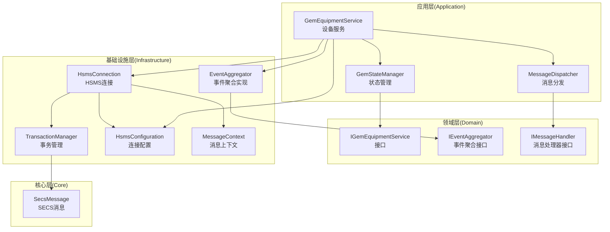
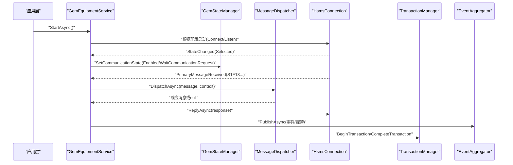
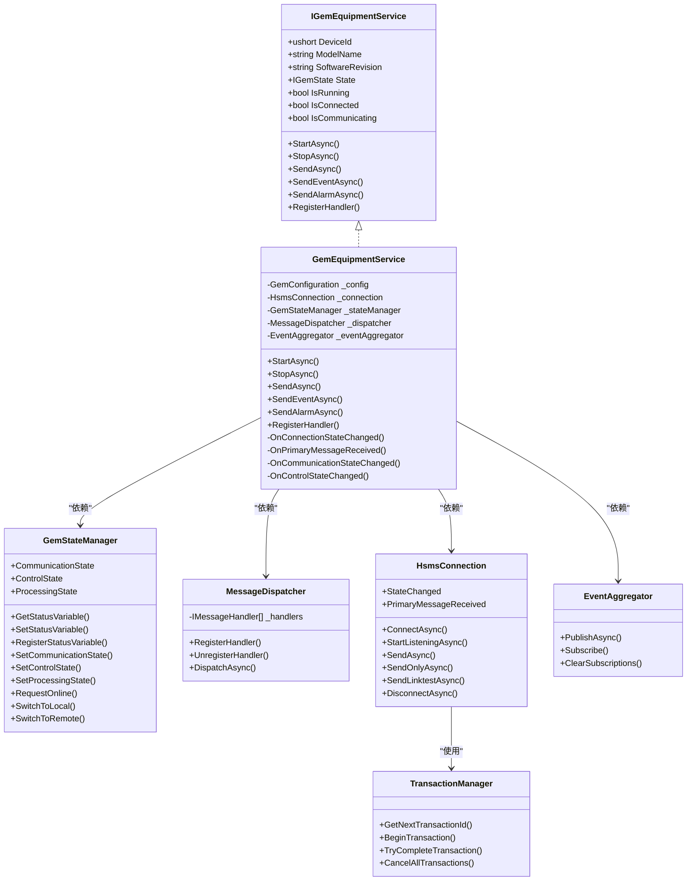
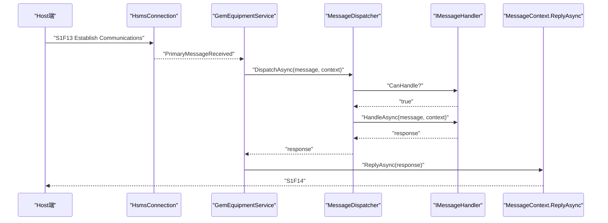
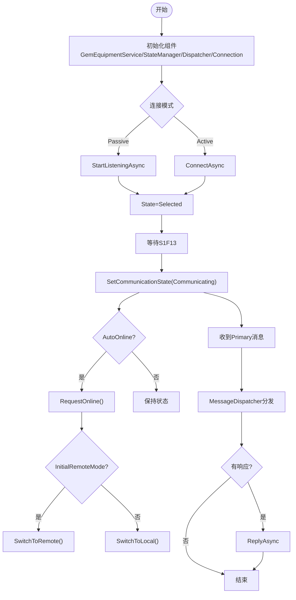
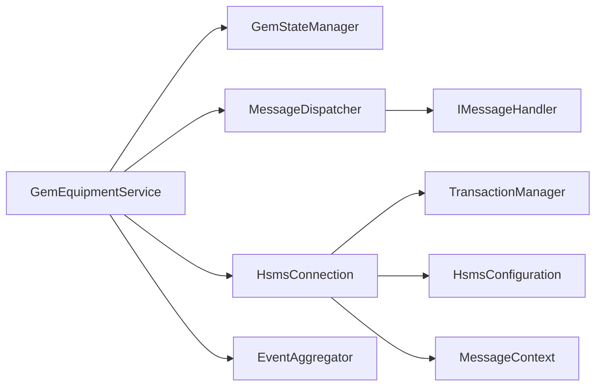

# 组件交互关系

<cite>
**本文档引用的文件**
- [GemEquipmentService.cs](file://WebGem/SECS2GEM/Application/Services/GemEquipmentService.cs)
- [GemStateManager.cs](file://WebGem/SECS2GEM/Application/State/GemStateManager.cs)
- [MessageDispatcher.cs](file://WebGem/SECS2GEM/Application/Messaging/MessageDispatcher.cs)
- [HsmsConnection.cs](file://WebGem/SECS2GEM/Infrastructure/Connection/HsmsConnection.cs)
- [IGemEquipmentService.cs](file://WebGem/SECS2GEM/Domain/Interfaces/IGemEquipmentService.cs)
- [IEventAggregator.cs](file://WebGem/SECS2GEM/Domain/Interfaces/IEventAggregator.cs)
- [EventAggregator.cs](file://WebGem/SECS2GEM/Infrastructure/Services/EventAggregator.cs)
- [HsmsConfiguration.cs](file://WebGem/SECS2GEM/Infrastructure/Configuration/HsmsConfiguration.cs)
- [MessageContext.cs](file://WebGem/SECS2GEM/Infrastructure/Connection/MessageContext.cs)
- [IMessageHandler.cs](file://WebGem/SECS2GEM/Domain/Interfaces/IMessageHandler.cs)
- [TransactionManager.cs](file://WebGem/SECS2GEM/Infrastructure/Services/TransactionManager.cs)
- [SecsMessage.cs](file://WebGem/SECS2GEM/Core/Entities/SecsMessage.cs)
</cite>

## 目录
1. [简介](#简介)
2. [项目结构](#项目结构)
3. [核心组件](#核心组件)
4. [架构总览](#架构总览)
5. [详细组件分析](#详细组件分析)
6. [依赖关系分析](#依赖关系分析)
7. [性能考量](#性能考量)
8. [故障排查指南](#故障排查指南)
9. [结论](#结论)

## 简介
本文件聚焦SECS2-GEM项目中核心组件的交互关系与通信机制，围绕以下关键组件展开：GemEquipmentService（设备服务）、GemStateManager（状态管理）、MessageDispatcher（消息分发器）、HsmsConnection（HSMS连接）。文档将深入分析它们之间的协作方式、依赖注入与事件传递、消息路由机制、生命周期管理与初始化顺序，并总结解耦策略、接口抽象设计以及性能优化点与潜在瓶颈。

## 项目结构
项目采用分层架构，核心代码位于SECS2GEM工程内，按领域与基础设施进行模块划分：
- Application层：服务、状态、消息分发
- Domain层：接口、事件、模型
- Infrastructure层：连接、序列化、事务、事件聚合
- Core层：实体、枚举、异常

图表来源
- [GemEquipmentService.cs:33-133](file://WebGem/SECS2GEM/Application/Services/GemEquipmentService.cs#L33-L133)
- [GemStateManager.cs:22-107](file://WebGem/SECS2GEM/Application/State/GemStateManager.cs#L22-L107)
- [MessageDispatcher.cs:27-91](file://WebGem/SECS2GEM/Application/Messaging/MessageDispatcher.cs#L27-L91)
- [HsmsConnection.cs:30-139](file://WebGem/SECS2GEM/Infrastructure/Connection/HsmsConnection.cs#L30-L139)
- [EventAggregator.cs:17-67](file://WebGem/SECS2GEM/Infrastructure/Services/EventAggregator.cs#L17-L67)
- [TransactionManager.cs:24-59](file://WebGem/SECS2GEM/Infrastructure/Services/TransactionManager.cs#L24-L59)
- [HsmsConfiguration.cs:15-133](file://WebGem/SECS2GEM/Infrastructure/Configuration/HsmsConfiguration.cs#L15-L133)
- [MessageContext.cs:12-54](file://WebGem/SECS2GEM/Infrastructure/Connection/MessageContext.cs#L12-L54)
- [SecsMessage.cs:18-104](file://WebGem/SECS2GEM/Core/Entities/SecsMessage.cs#L18-L104)

章节来源
- [GemEquipmentService.cs:15-40](file://WebGem/SECS2GEM/Application/Services/GemEquipmentService.cs#L15-L40)
- [HsmsConnection.cs:15-30](file://WebGem/SECS2GEM/Infrastructure/Connection/HsmsConnection.cs#L15-L30)

## 核心组件
本节对四个核心组件进行概览式说明，后续章节将深入其交互细节。

- GemEquipmentService：外观模式封装，负责连接管理、消息分发、状态变更、事件与报警上报、生命周期管理。
- GemStateManager：GEM状态机实现，维护通信/控制/处理三类状态及其转换规则，提供状态变量与设备常量管理。
- MessageDispatcher：责任链+策略模式，维护处理器列表，按优先级匹配并委托处理，支持动态注册/注销。
- HsmsConnection：HSMS连接实现，支持主动/被动模式、事务管理、心跳、日志、异步收发与状态机驱动。

章节来源
- [IGemEquipmentService.cs:6-25](file://WebGem/SECS2GEM/Domain/Interfaces/IGemEquipmentService.cs#L6-L25)
- [GemStateManager.cs:8-22](file://WebGem/SECS2GEM/Application/State/GemStateManager.cs#L8-L22)
- [MessageDispatcher.cs:6-27](file://WebGem/SECS2GEM/Application/Messaging/MessageDispatcher.cs#L6-L27)
- [HsmsConnection.cs:15-30](file://WebGem/SECS2GEM/Infrastructure/Connection/HsmsConnection.cs#L15-L30)

## 架构总览
下图展示组件间的主要依赖与交互路径，体现“服务-状态-分发-连接”的主干流程，以及事件聚合与事务管理的横切关注点。

图表来源
- [GemEquipmentService.cs:140-174](file://WebGem/SECS2GEM/Application/Services/GemEquipmentService.cs#L140-L174)
- [HsmsConnection.cs:146-186](file://WebGem/SECS2GEM/Infrastructure/Connection/HsmsConnection.cs#L146-L186)
- [MessageDispatcher.cs:67-91](file://WebGem/SECS2GEM/Application/Messaging/MessageDispatcher.cs#L67-L91)
- [EventAggregator.cs:25-45](file://WebGem/SECS2GEM/Infrastructure/Services/EventAggregator.cs#L25-L45)
- [TransactionManager.cs:46-72](file://WebGem/SECS2GEM/Infrastructure/Services/TransactionManager.cs#L46-L72)

## 详细组件分析

### 类图：核心组件关系

图表来源
- [IGemEquipmentService.cs:25-158](file://WebGem/SECS2GEM/Domain/Interfaces/IGemEquipmentService.cs#L25-L158)
- [GemEquipmentService.cs:33-133](file://WebGem/SECS2GEM/Application/Services/GemEquipmentService.cs#L33-L133)
- [GemStateManager.cs:22-107](file://WebGem/SECS2GEM/Application/State/GemStateManager.cs#L22-L107)
- [MessageDispatcher.cs:27-91](file://WebGem/SECS2GEM/Application/Messaging/MessageDispatcher.cs#L27-L91)
- [HsmsConnection.cs:30-139](file://WebGem/SECS2GEM/Infrastructure/Connection/HsmsConnection.cs#L30-L139)
- [EventAggregator.cs:17-67](file://WebGem/SECS2GEM/Infrastructure/Services/EventAggregator.cs#L17-L67)
- [TransactionManager.cs:24-59](file://WebGem/SECS2GEM/Infrastructure/Services/TransactionManager.cs#L24-L59)

章节来源
- [GemEquipmentService.cs:106-133](file://WebGem/SECS2GEM/Application/Services/GemEquipmentService.cs#L106-L133)
- [GemStateManager.cs:22-107](file://WebGem/SECS2GEM/Application/State/GemStateManager.cs#L22-L107)
- [MessageDispatcher.cs:27-91](file://WebGem/SECS2GEM/Application/Messaging/MessageDispatcher.cs#L27-L91)
- [HsmsConnection.cs:30-139](file://WebGem/SECS2GEM/Infrastructure/Connection/HsmsConnection.cs#L30-L139)
- [EventAggregator.cs:17-67](file://WebGem/SECS2GEM/Infrastructure/Services/EventAggregator.cs#L17-L67)
- [TransactionManager.cs:24-59](file://WebGem/SECS2GEM/Infrastructure/Services/TransactionManager.cs#L24-L59)

### 组件协作与通信机制

- 依赖注入与装配
  - GemEquipmentService在构造函数中创建并装配各子组件：GemStateManager、MessageDispatcher、EventAggregator、HsmsConnection，并将状态管理器注入连接层以驱动状态变化。
  - HsmsConnection通过构造函数注入ISecsSerializer、ITransactionManager、IMessageLogger；默认实现来自基础设施层。
  - 配置通过HsmsConfiguration注入，支持Passive/Active模式、超时与心跳参数。

- 事件传递
  - HsmsConnection在状态变化与收到Primary消息时触发事件，GemEquipmentService订阅这些事件并转发为应用层事件（连接状态、消息接收、状态变化）。
  - EventAggregator提供跨组件的事件发布/订阅，GemEquipmentService在发送事件报告与报警后通过它发布领域事件。

- 消息路由机制
  - HsmsConnection解析底层HSMS消息后，将原始消息与上下文传入GemEquipmentService，后者交由MessageDispatcher按优先级匹配处理器。
  - IMessageHandler定义处理器接口，MessageDispatcher遍历处理器直到CanHandle返回true，随后调用HandleAsync并返回响应消息；若无处理器且消息带W-Bit，则返回S9F7错误。

- 生命周期管理与初始化顺序
  - 启动：GemEquipmentService.StartAsync -> HsmsConnection根据配置启动（Connect/Listen）-> 进入Selected状态 -> 等待S1F13 -> 设置通信状态为Communicating（可选自动上线与远程/本地切换）。
  - 停止：GemEquipmentService.StopAsync -> HsmsConnection.DisconnectAsync -> 清理事务与资源 -> 重置通信状态。

- 解耦策略与接口抽象
  - 通过接口抽象（IGemEquipmentService、IMessageHandler、IEventAggregator、ISecsConnection等）实现组件解耦，便于替换实现与测试。
  - MessageDispatcher采用策略模式，新增消息处理无需改动现有分发逻辑；支持动态注册/注销处理器。

章节来源
- [GemEquipmentService.cs:110-133](file://WebGem/SECS2GEM/Application/Services/GemEquipmentService.cs#L110-L133)
- [HsmsConnection.cs:122-139](file://WebGem/SECS2GEM/Infrastructure/Connection/HsmsConnection.cs#L122-L139)
- [MessageDispatcher.cs:34-58](file://WebGem/SECS2GEM/Application/Messaging/MessageDispatcher.cs#L34-L58)
- [IMessageHandler.cs:63-88](file://WebGem/SECS2GEM/Domain/Interfaces/IMessageHandler.cs#L63-L88)
- [IEventAggregator.cs:22-65](file://WebGem/SECS2GEM/Domain/Interfaces/IEventAggregator.cs#L22-L65)

### 时序图：消息接收与响应流程

图表来源
- [GemEquipmentService.cs:343-358](file://WebGem/SECS2GEM/Application/Services/GemEquipmentService.cs#L343-L358)
- [MessageDispatcher.cs:67-91](file://WebGem/SECS2GEM/Application/Messaging/MessageDispatcher.cs#L67-L91)
- [MessageContext.cs:59-62](file://WebGem/SECS2GEM/Infrastructure/Connection/MessageContext.cs#L59-L62)

### 流程图：状态转换与事件处理

图表来源
- [GemEquipmentService.cs:140-174](file://WebGem/SECS2GEM/Application/Services/GemEquipmentService.cs#L140-L174)
- [GemStateManager.cs:263-348](file://WebGem/SECS2GEM/Application/State/GemStateManager.cs#L263-L348)
- [MessageDispatcher.cs:67-91](file://WebGem/SECS2GEM/Application/Messaging/MessageDispatcher.cs#L67-L91)

## 依赖关系分析
- 组件耦合与内聚
  - GemEquipmentService高内聚地封装了设备服务的完整生命周期与消息处理，通过接口与事件与外部解耦。
  - MessageDispatcher与IMessageHandler形成松耦合的策略链，便于扩展新的消息处理逻辑。
  - HsmsConnection与TransactionManager耦合紧密，共同保障事务一致性与可靠性。

- 外部依赖与集成点
  - HsmsConnection依赖网络栈、序列化器、事务管理器与消息日志器，通过构造函数注入实现可替换性。
  - EventAggregator提供跨组件事件总线能力，降低事件发布/订阅的耦合度。

图表来源
- [GemEquipmentService.cs:110-133](file://WebGem/SECS2GEM/Application/Services/GemEquipmentService.cs#L110-L133)
- [HsmsConnection.cs:122-139](file://WebGem/SECS2GEM/Infrastructure/Connection/HsmsConnection.cs#L122-L139)
- [MessageDispatcher.cs:27-58](file://WebGem/SECS2GEM/Application/Messaging/MessageDispatcher.cs#L27-L58)
- [IMessageHandler.cs:63-88](file://WebGem/SECS2GEM/Domain/Interfaces/IMessageHandler.cs#L63-L88)
- [HsmsConfiguration.cs:15-133](file://WebGem/SECS2GEM/Infrastructure/Configuration/HsmsConfiguration.cs#L15-L133)
- [MessageContext.cs:12-54](file://WebGem/SECS2GEM/Infrastructure/Connection/MessageContext.cs#L12-L54)
- [EventAggregator.cs:17-67](file://WebGem/SECS2GEM/Infrastructure/Services/EventAggregator.cs#L17-L67)
- [TransactionManager.cs:24-59](file://WebGem/SECS2GEM/Infrastructure/Services/TransactionManager.cs#L24-L59)

章节来源
- [IGemEquipmentService.cs:25-158](file://WebGem/SECS2GEM/Domain/Interfaces/IGemEquipmentService.cs#L25-L158)
- [IMessageHandler.cs:63-129](file://WebGem/SECS2GEM/Domain/Interfaces/IMessageHandler.cs#L63-L129)

## 性能考量
- 异步与并发
  - HsmsConnection使用Channel实现发送队列，接收/发送/心跳分别在独立后台任务中运行，避免阻塞主线程。
  - MessageDispatcher内部维护处理器列表并在首次访问时排序，减少每次分发的比较成本；建议在高频场景下避免频繁注册/注销处理器。

- 事务与超时
  - TransactionManager使用Interlocked生成事务ID，ConcurrentDictionary管理活跃事务，配合超时机制避免资源泄漏。
  - HsmsConnection在发送Separate/Linktest等控制消息时设置超时，防止阻塞导致的资源占用。

- 缓冲区与日志
  - 可配置的接收/发送缓冲区大小影响吞吐与内存占用；消息日志开启会带来额外IO开销，建议在生产环境谨慎启用。

- 状态转换与事件聚合
  - GemStateManager的状态转换采用锁保护，避免竞态；EventAggregator异步发布事件，异常隔离，提升整体稳定性。

章节来源
- [HsmsConnection.cs:405-418](file://WebGem/SECS2GEM/Infrastructure/Connection/HsmsConnection.cs#L405-L418)
- [MessageDispatcher.cs:96-108](file://WebGem/SECS2GEM/Application/Messaging/MessageDispatcher.cs#L96-L108)
- [TransactionManager.cs:24-59](file://WebGem/SECS2GEM/Infrastructure/Services/TransactionManager.cs#L24-L59)
- [EventAggregator.cs:25-45](file://WebGem/SECS2GEM/Infrastructure/Services/EventAggregator.cs#L25-L45)

## 故障排查指南
- 连接问题
  - 若连接无法进入Selected状态，检查HsmsConfiguration的T7超时与Passive/Active模式配置；查看HsmsConnection的日志初始化与T7超时监控。
  - 断开连接时，HsmsConnection会尝试发送Separate请求并清理资源，若异常阻塞，内部使用超时控制避免长时间阻塞。

- 消息处理失败
  - 若MessageDispatcher无法找到处理器且消息带W-Bit，将返回S9F7错误；检查是否正确注册了对应Stream/Function的处理器。
  - 确认IMessageHandler的Priority设置与CanHandle判断逻辑，避免优先级冲突或误判。

- 事务超时
  - TransactionManager在超时后会取消事务并抛出超时异常；检查T3超时配置与网络延迟，必要时增大超时时间。

- 事件发布异常
  - EventAggregator对订阅者的异常进行隔离，单个订阅异常不会影响其他订阅者；若事件未到达订阅者，检查订阅是否正确注册与未被提前取消。

章节来源
- [HsmsConnection.cs:280-296](file://WebGem/SECS2GEM/Infrastructure/Connection/HsmsConnection.cs#L280-L296)
- [MessageDispatcher.cs:83-91](file://WebGem/SECS2GEM/Application/Messaging/MessageDispatcher.cs#L83-L91)
- [TransactionManager.cs:104-110](file://WebGem/SECS2GEM/Infrastructure/Services/TransactionManager.cs#L104-L110)
- [EventAggregator.cs:170-181](file://WebGem/SECS2GEM/Infrastructure/Services/EventAggregator.cs#L170-L181)

## 结论
SECS2-GEM项目通过清晰的分层与接口抽象，实现了设备服务、状态管理、消息分发与HSMS连接的高内聚低耦合。GemEquipmentService作为外观模式的统一入口，协调各子组件完成连接建立、消息路由与事件上报；GemStateManager严格遵循GEM协议状态机；MessageDispatcher采用策略与责任链模式，支持灵活扩展；HsmsConnection结合事务管理与心跳机制，保障通信可靠性。整体设计在可维护性、可扩展性与性能之间取得良好平衡，适合在工业自动化场景中部署与演进。