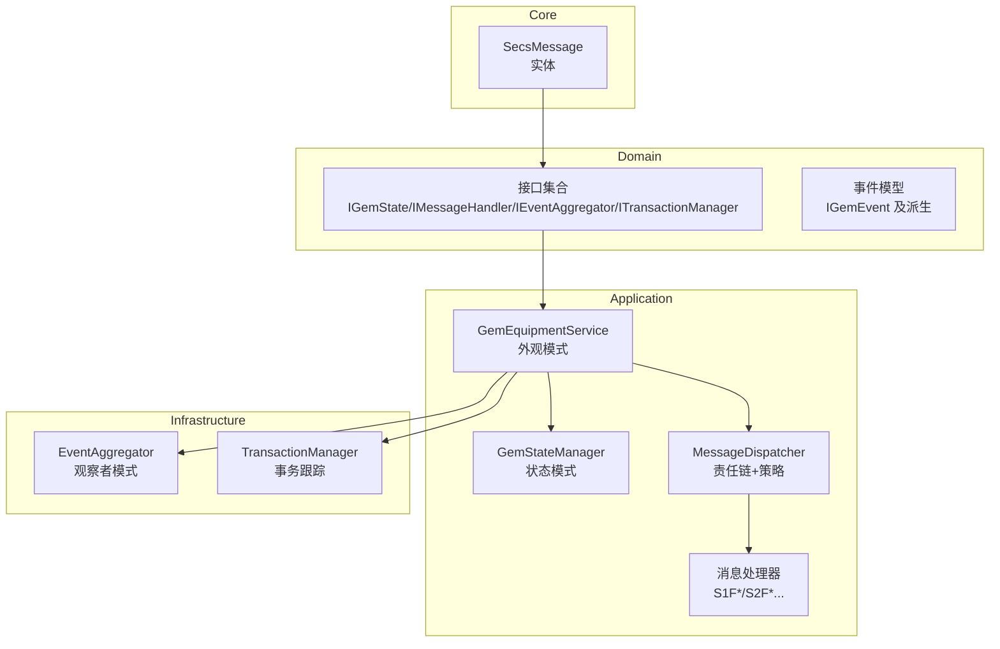
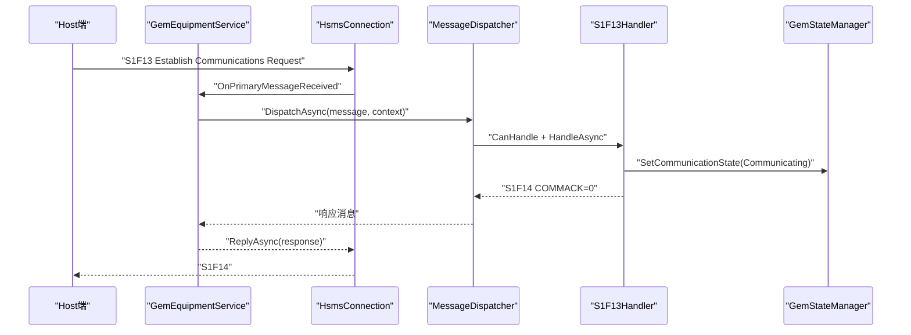
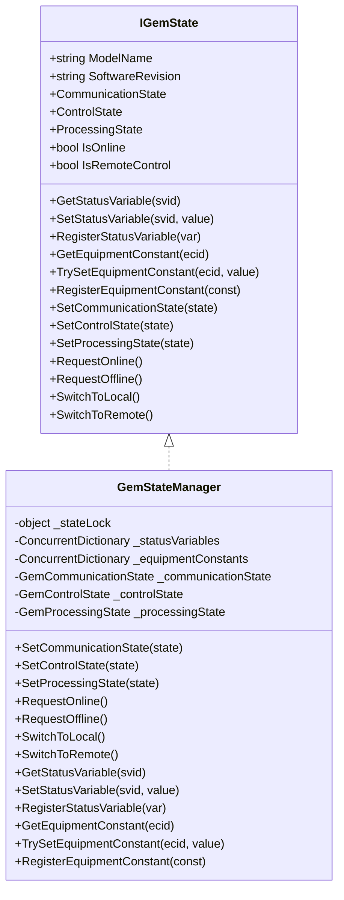
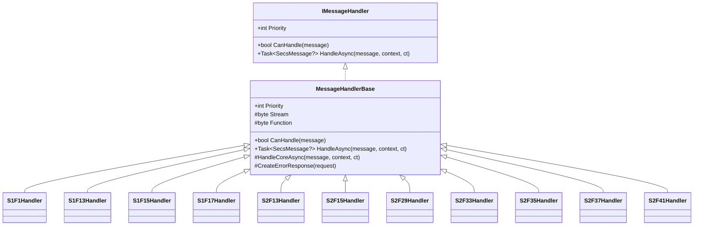
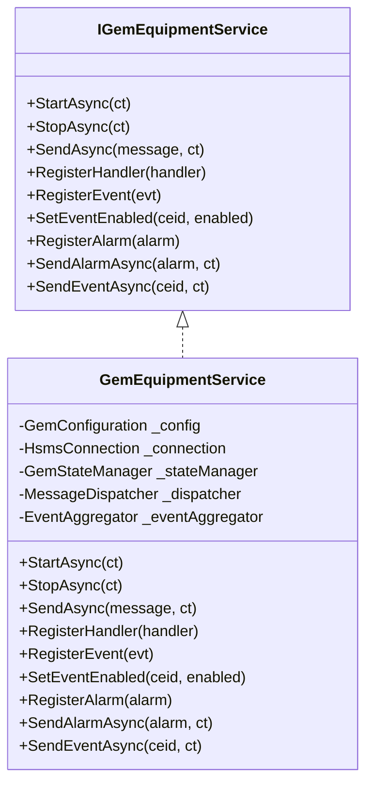
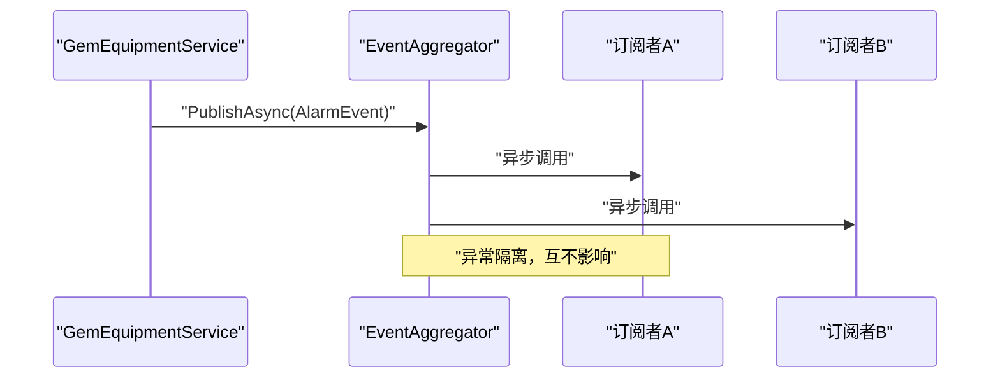
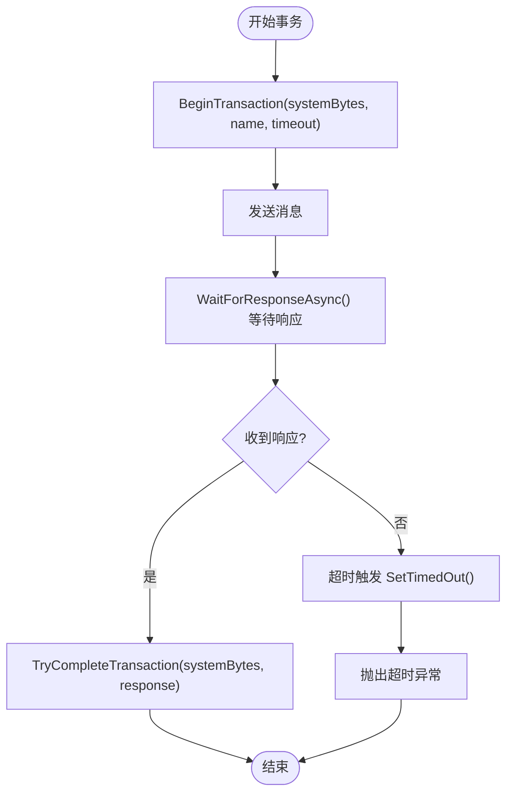
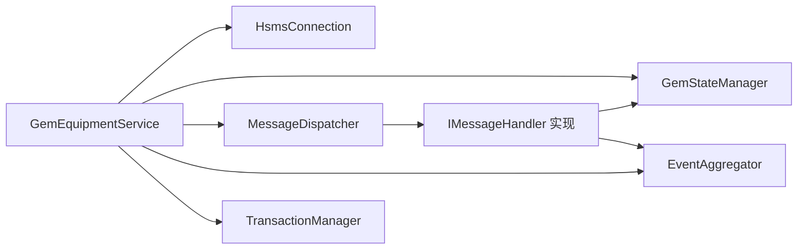

# 设计模式应用

<cite>
**本文引用的文件**
- [GemStateManager.cs](file://WebGem/SECS2GEM/Application/State/GemStateManager.cs)
- [IGemState.cs](file://WebGem/SECS2GEM/Domain/Interfaces/IGemState.cs)
- [MessageHandlerBase.cs](file://WebGem/SECS2GEM/Application/Handlers/StreamOneHandlers.cs)
- [S1F1Handler.cs](file://WebGem/SECS2GEM/Application/Handlers/StreamOneHandlers.cs)
- [S1F13Handler.cs](file://WebGem/SECS2GEM/Application/Handlers/StreamOneHandlers.cs)
- [S1F15Handler.cs](file://WebGem/SECS2GEM/Application/Handlers/StreamOneHandlers.cs)
- [S1F17Handler.cs](file://WebGem/SECS2GEM/Application/Handlers/StreamOneHandlers.cs)
- [S2F13Handler.cs](file://WebGem/SECS2GEM/Application/Handlers/StreamTwoHandlers.cs)
- [S2F15Handler.cs](file://WebGem/SECS2GEM/Application/Handlers/StreamTwoHandlers.cs)
- [S2F29Handler.cs](file://WebGem/SECS2GEM/Application/Handlers/StreamTwoHandlers.cs)
- [S2F33Handler.cs](file://WebGem/SECS2GEM/Application/Handlers/StreamTwoHandlers.cs)
- [S2F35Handler.cs](file://WebGem/SECS2GEM/Application/Handlers/StreamTwoHandlers.cs)
- [S2F37Handler.cs](file://WebGem/SECS2GEM/Application/Handlers/StreamTwoHandlers.cs)
- [S2F41Handler.cs](file://WebGem/SECS2GEM/Application/Handlers/StreamTwoHandlers.cs)
- [S5F3Handler.cs](file://WebGem/SECS2GEM/Application/Handlers/OtherStreamHandlers.cs)
- [S5F5Handler.cs](file://WebGem/SECS2GEM/Application/Handlers/OtherStreamHandlers.cs)
- [S5F7Handler.cs](file://WebGem/SECS2GEM/Application/Handlers/OtherStreamHandlers.cs)
- [S6F15Handler.cs](file://WebGem/SECS2GEM/Application/Handlers/OtherStreamHandlers.cs)
- [S6F19Handler.cs](file://WebGem/SECS2GEM/Application/Handlers/OtherStreamHandlers.cs)
- [S7F1Handler.cs](file://WebGem/SECS2GEM/Application/Handlers/OtherStreamHandlers.cs)
- [S7F3Handler.cs](file://WebGem/SECS2GEM/Application/Handlers/OtherStreamHandlers.cs)
- [S7F5Handler.cs](file://WebGem/SECS2GEM/Application/Handlers/OtherStreamHandlers.cs)
- [S7F17Handler.cs](file://WebGem/SECS2GEM/Application/Handlers/OtherStreamHandlers.cs)
- [S7F19Handler.cs](file://WebGem/SECS2GEM/Application/Handlers/OtherStreamHandlers.cs)
- [S10F3Handler.cs](file://WebGem/SECS2GEM/Application/Handlers/OtherStreamHandlers.cs)
- [S10F5Handler.cs](file://WebGem/SECS2GEM/Application/Handlers/OtherStreamHandlers.cs)
- [MessageDispatcher.cs](file://WebGem/SECS2GEM/Application/Messaging/MessageDispatcher.cs)
- [IMessageHandler.cs](file://WebGem/SECS2GEM/Domain/Interfaces/IMessageHandler.cs)
- [IEventAggregator.cs](file://WebGem/SECS2GEM/Domain/Interfaces/IEventAggregator.cs)
- [EventAggregator.cs](file://WebGem/SECS2GEM/Infrastructure/Services/EventAggregator.cs)
- [ITransactionManager.cs](file://WebGem/SECS2GEM/Domain/Interfaces/ITransactionManager.cs)
- [TransactionManager.cs](file://WebGem/SECS2GEM/Infrastructure/Services/TransactionManager.cs)
- [GemEquipmentService.cs](file://WebGem/SECS2GEM/Application/Services/GemEquipmentService.cs)
- [SecsMessage.cs](file://WebGem/SECS2GEM/Core/Entities/SecsMessage.cs)
- [IGemEvent.cs](file://WebGem/SECS2GEM/Domain/Events/IGemEvent.cs)
- [GemStateManagerTests.cs](file://WebGem/SECS2GEM.Tests/GemStateManagerTests.cs)
- [MessageHandlerTests.cs](file://WebGem/SECS2GEM.Tests/MessageHandlerTests.cs)
</cite>

## 目录
1. [引言](#引言)
2. [项目结构](#项目结构)
3. [核心组件](#核心组件)
4. [架构总览](#架构总览)
5. [详细组件分析](#详细组件分析)
6. [依赖分析](#依赖分析)
7. [性能考虑](#性能考虑)
8. [故障排查指南](#故障排查指南)
9. [结论](#结论)
10. [附录](#附录)

## 引言
本文件系统性梳理 SECS2-GEM 项目中设计模式的应用，重点覆盖以下模式及其协同：
- 状态模式：GEM 状态管理（通信/控制/处理三态）
- 模板方法模式：消息处理器基类与具体处理器
- 外观模式：设备服务对外统一入口
- 观察者模式：事件聚合器与事件系统

文档将结合代码路径定位、交互序列图与类图，解释各模式如何解决特定问题，并给出技术选型与替代方案分析。

## 项目结构
项目采用分层+领域驱动组织方式：
- Core 层：协议实体与枚举（如 SECS 消息、格式、状态枚举）
- Domain 层：领域接口与事件模型（状态接口、事件接口、消息处理器接口）
- Application 层：应用服务、状态管理、消息分发与处理器
- Infrastructure 层：基础设施（事件聚合器、事务管理器、连接与序列化）
- Tests 层：单元测试验证模式行为

**图表来源**
- [GemEquipmentService.cs:33-455](file://WebGem/SECS2GEM/Application/Services/GemEquipmentService.cs#L33-L455)
- [GemStateManager.cs:22-491](file://WebGem/SECS2GEM/Application/State/GemStateManager.cs#L22-L491)
- [MessageDispatcher.cs:27-122](file://WebGem/SECS2GEM/Application/Messaging/MessageDispatcher.cs#L27-L122)
- [EventAggregator.cs:17-218](file://WebGem/SECS2GEM/Infrastructure/Services/EventAggregator.cs#L17-L218)
- [TransactionManager.cs:24-200](file://WebGem/SECS2GEM/Infrastructure/Services/TransactionManager.cs#L24-L200)
- [SecsMessage.cs:18-209](file://WebGem/SECS2GEM/Core/Entities/SecsMessage.cs#L18-L209)

**章节来源**
- [GemEquipmentService.cs:13-455](file://WebGem/SECS2GEM/Application/Services/GemEquipmentService.cs#L13-L455)
- [GemStateManager.cs:6-491](file://WebGem/SECS2GEM/Application/State/GemStateManager.cs#L6-L491)
- [MessageDispatcher.cs:6-122](file://WebGem/SECS2GEM/Application/Messaging/MessageDispatcher.cs#L6-L122)
- [EventAggregator.cs:7-218](file://WebGem/SECS2GEM/Infrastructure/Services/EventAggregator.cs#L7-L218)
- [TransactionManager.cs:8-200](file://WebGem/SECS2GEM/Infrastructure/Services/TransactionManager.cs#L8-L200)
- [SecsMessage.cs:1-209](file://WebGem/SECS2GEM/Core/Entities/SecsMessage.cs#L1-L209)

## 核心组件
- 状态管理器：封装 GEM 三态（通信/控制/处理），提供状态变量与设备常量管理，内置状态转换校验与事件发布。
- 消息分发器：维护处理器列表，按优先级匹配，委托处理并生成响应或错误。
- 消息处理器：模板方法模式实现，统一异常与日志处理，子类仅实现核心业务逻辑。
- 事件聚合器：观察者模式实现，支持异步/同步订阅、异常隔离与取消订阅。
- 事务管理器：跟踪请求-响应事务，基于 System Bytes 匹配，支持超时与取消。
- 设备服务：外观模式封装，整合连接、状态、分发与事件，提供统一 API。

**章节来源**
- [IGemState.cs:20-164](file://WebGem/SECS2GEM/Domain/Interfaces/IGemState.cs#L20-L164)
- [IMessageHandler.cs:63-129](file://WebGem/SECS2GEM/Domain/Interfaces/IMessageHandler.cs#L63-L129)
- [IEventAggregator.cs:22-65](file://WebGem/SECS2GEM/Domain/Interfaces/IEventAggregator.cs#L22-L65)
- [ITransactionManager.cs:78-118](file://WebGem/SECS2GEM/Domain/Interfaces/ITransactionManager.cs#L78-L118)
- [GemEquipmentService.cs:33-455](file://WebGem/SECS2GEM/Application/Services/GemEquipmentService.cs#L33-L455)

## 架构总览
下图展示 SECS2-GEM 的核心交互：设备服务作为外观，协调状态、消息分发、事件与事务；消息处理器通过模板方法模式实现；状态管理器通过状态模式管理设备状态；事件聚合器通过观察者模式解耦事件发布与订阅；事务管理器贯穿请求-响应生命周期。

**图表来源**
- [GemEquipmentService.cs:340-358](file://WebGem/SECS2GEM/Application/Services/GemEquipmentService.cs#L340-L358)
- [MessageDispatcher.cs:67-91](file://WebGem/SECS2GEM/Application/Messaging/MessageDispatcher.cs#L67-L91)
- [S1F13Handler.cs:122-149](file://WebGem/SECS2GEM/Application/Handlers/StreamOneHandlers.cs#L122-L149)
- [GemStateManager.cs:196-223](file://WebGem/SECS2GEM/Application/State/GemStateManager.cs#L196-L223)

**章节来源**
- [GemEquipmentService.cs:320-400](file://WebGem/SECS2GEM/Application/Services/GemEquipmentService.cs#L320-L400)
- [MessageDispatcher.cs:60-91](file://WebGem/SECS2GEM/Application/Messaging/MessageDispatcher.cs#L60-L91)
- [StreamOneHandlers.cs:88-210](file://WebGem/SECS2GEM/Application/Handlers/StreamOneHandlers.cs#L88-L210)

## 详细组件分析

### 状态模式：GEM 状态管理
- 设计要点
  - 封装通信/控制/处理三态，提供状态转换校验与事件发布。
  - 状态变量与设备常量注册与查询，支持动态值与只读约束。
  - 线程安全：内部锁保护状态转换，ConcurrentDictionary 存储 SV/EC。
- 应用场景
  - S1F13 建立通信后进入 Communicating；S1F17 上线默认远程模式；S1F15 下线。
- 代码路径
  - 状态接口：[IGemState.cs:20-164](file://WebGem/SECS2GEM/Domain/Interfaces/IGemState.cs#L20-L164)
  - 状态实现：[GemStateManager.cs:22-491](file://WebGem/SECS2GEM/Application/State/GemStateManager.cs#L22-L491)
  - 测试验证：[GemStateManagerTests.cs:10-365](file://WebGem/SECS2GEM.Tests/GemStateManagerTests.cs#L10-L365)

**图表来源**
- [IGemState.cs:20-164](file://WebGem/SECS2GEM/Domain/Interfaces/IGemState.cs#L20-L164)
- [GemStateManager.cs:22-491](file://WebGem/SECS2GEM/Application/State/GemStateManager.cs#L22-L491)

**章节来源**
- [IGemState.cs:10-164](file://WebGem/SECS2GEM/Domain/Interfaces/IGemState.cs#L10-L164)
- [GemStateManager.cs:12-491](file://WebGem/SECS2GEM/Application/State/GemStateManager.cs#L12-L491)
- [GemStateManagerTests.cs:19-220](file://WebGem/SECS2GEM.Tests/GemStateManagerTests.cs#L19-L220)

### 模板方法模式：消息处理器基类与具体处理器
- 设计要点
  - MessageHandlerBase 定义处理流程骨架：CanHandle + HandleAsync + HandleCoreAsync。
  - 统一异常捕获与错误响应（S9F7），子类仅实现核心逻辑。
  - 通过 Stream/Function 抽象目标消息类型。
- 应用场景
  - S1F1/S1F13/S1F15/S1F17 等设备状态消息；S2F13/S2F15/S2F29/S2F33/S2F35/S2F37/S2F41 等设备控制消息；S5F3/S5F5/S5F7、S6F15/S6F19、S7F1/S7F3/S7F5/S7F17/S7F19、S10F3/S10F5 等其他消息。
- 代码路径
  - 基类与抽象：[MessageHandlerBase.cs:20-86](file://WebGem/SECS2GEM/Application/Handlers/StreamOneHandlers.cs#L20-L86)
  - S1F1/S1F13/S1F15/S1F17：[StreamOneHandlers.cs:94-210](file://WebGem/SECS2GEM/Application/Handlers/StreamOneHandlers.cs#L94-L210)
  - S2F13/S2F15/S2F29/S2F33/S2F35/S2F37/S2F41：[StreamTwoHandlers.cs:13-330](file://WebGem/SECS2GEM/Application/Handlers/StreamTwoHandlers.cs#L13-L330)
  - 其他流处理器：[OtherStreamHandlers.cs:9-275](file://WebGem/SECS2GEM/Application/Handlers/OtherStreamHandlers.cs#L9-L275)
  - 接口契约：[IMessageHandler.cs:63-88](file://WebGem/SECS2GEM/Domain/Interfaces/IMessageHandler.cs#L63-L88)
  - 测试验证：[MessageHandlerTests.cs:13-221](file://WebGem/SECS2GEM.Tests/MessageHandlerTests.cs#L13-L221)

**图表来源**
- [IMessageHandler.cs:63-88](file://WebGem/SECS2GEM/Domain/Interfaces/IMessageHandler.cs#L63-L88)
- [MessageHandlerBase.cs:20-86](file://WebGem/SECS2GEM/Application/Handlers/StreamOneHandlers.cs#L20-L86)
- [StreamOneHandlers.cs:94-210](file://WebGem/SECS2GEM/Application/Handlers/StreamOneHandlers.cs#L94-L210)
- [StreamTwoHandlers.cs:13-330](file://WebGem/SECS2GEM/Application/Handlers/StreamTwoHandlers.cs#L13-L330)
- [OtherStreamHandlers.cs:9-275](file://WebGem/SECS2GEM/Application/Handlers/OtherStreamHandlers.cs#L9-L275)

**章节来源**
- [IMessageHandler.cs:50-88](file://WebGem/SECS2GEM/Domain/Interfaces/IMessageHandler.cs#L50-L88)
- [MessageHandlerBase.cs:7-86](file://WebGem/SECS2GEM/Application/Handlers/StreamOneHandlers.cs#L7-L86)
- [StreamOneHandlers.cs:88-210](file://WebGem/SECS2GEM/Application/Handlers/StreamOneHandlers.cs#L88-L210)
- [StreamTwoHandlers.cs:7-330](file://WebGem/SECS2GEM/Application/Handlers/StreamTwoHandlers.cs#L7-L330)
- [OtherStreamHandlers.cs:6-275](file://WebGem/SECS2GEM/Application/Handlers/OtherStreamHandlers.cs#L6-L275)
- [MessageHandlerTests.cs:163-221](file://WebGem/SECS2GEM.Tests/MessageHandlerTests.cs#L163-L221)

### 外观模式：设备服务封装
- 设计要点
  - GemEquipmentService 作为外观，整合连接、状态、分发与事件，暴露简洁 API。
  - 生命周期：StartAsync/StopAsync，自动注册默认处理器，订阅连接与状态事件。
  - 事件上报：通过 EventAggregator 发布消息接收、状态变化、报警等事件。
- 应用场景
  - 启动设备服务、发送消息、注册事件/报警、注册自定义处理器。
- 代码路径
  - 外观实现：[GemEquipmentService.cs:33-455](file://WebGem/SECS2GEM/Application/Services/GemEquipmentService.cs#L33-L455)
  - 事件聚合器：[EventAggregator.cs:17-218](file://WebGem/SECS2GEM/Infrastructure/Services/EventAggregator.cs#L17-L218)
  - 事件接口：[IEventAggregator.cs:22-65](file://WebGem/SECS2GEM/Domain/Interfaces/IEventAggregator.cs#L22-L65)
  - 事件基接口：[IGemEvent.cs:10-50](file://WebGem/SECS2GEM/Domain/Events/IGemEvent.cs#L10-L50)

**图表来源**
- [GemEquipmentService.cs:33-455](file://WebGem/SECS2GEM/Application/Services/GemEquipmentService.cs#L33-L455)
- [IEventAggregator.cs:22-65](file://WebGem/SECS2GEM/Domain/Interfaces/IEventAggregator.cs#L22-L65)
- [EventAggregator.cs:17-218](file://WebGem/SECS2GEM/Infrastructure/Services/EventAggregator.cs#L17-L218)

**章节来源**
- [GemEquipmentService.cs:15-455](file://WebGem/SECS2GEM/Application/Services/GemEquipmentService.cs#L15-L455)
- [IEventAggregator.cs:8-65](file://WebGem/SECS2GEM/Domain/Interfaces/IEventAggregator.cs#L8-L65)
- [EventAggregator.cs:7-218](file://WebGem/SECS2GEM/Infrastructure/Services/EventAggregator.cs#L7-L218)

### 观察者模式：事件系统
- 设计要点
  - IEventAggregator 提供异步/同步发布与订阅，支持泛型事件类型。
  - EventAggregator 内部使用并发字典存储订阅者，异常隔离，支持取消订阅。
  - 事件类型：报警事件、集合事件触发、消息接收、状态变化等。
- 应用场景
  - 设备服务在收到消息、状态变化、报警触发时发布事件，订阅者异步处理。
- 代码路径
  - 事件聚合器：[EventAggregator.cs:17-218](file://WebGem/SECS2GEM/Infrastructure/Services/EventAggregator.cs#L17-L218)
  - 事件接口：[IEventAggregator.cs:22-65](file://WebGem/SECS2GEM/Domain/Interfaces/IEventAggregator.cs#L22-L65)
  - 事件基接口：[IGemEvent.cs:10-50](file://WebGem/SECS2GEM/Domain/Events/IGemEvent.cs#L10-L50)
  - 设备服务事件发布：[GemEquipmentService.cs:243-294](file://WebGem/SECS2GEM/Application/Services/GemEquipmentService.cs#L243-L294)

**图表来源**
- [EventAggregator.cs:25-67](file://WebGem/SECS2GEM/Infrastructure/Services/EventAggregator.cs#L25-L67)
- [GemEquipmentService.cs:243-294](file://WebGem/SECS2GEM/Application/Services/GemEquipmentService.cs#L243-L294)

**章节来源**
- [EventAggregator.cs:10-218](file://WebGem/SECS2GEM/Infrastructure/Services/EventAggregator.cs#L10-L218)
- [IEventAggregator.cs:8-65](file://WebGem/SECS2GEM/Domain/Interfaces/IEventAggregator.cs#L8-L65)
- [IGemEvent.cs:6-50](file://WebGem/SECS2GEM/Domain/Events/IGemEvent.cs#L6-L50)
- [GemEquipmentService.cs:240-294](file://WebGem/SECS2GEM/Application/Services/GemEquipmentService.cs#L240-L294)

### 事务管理：请求-响应跟踪
- 设计要点
  - ITransactionManager/ITransaction 定义事务生命周期：开始、等待响应、完成、取消、超时。
  - TransactionManager 使用 System Bytes 作为唯一键，ConcurrentDictionary 跟踪活跃事务。
  - 超时通过 CancellationTokenSource 实现，异常包装为 SecsTimeoutException。
- 应用场景
  - 设备服务发送消息并等待响应，匹配 System Bytes 完成事务。
- 代码路径
  - 事务接口：[ITransactionManager.cs:78-118](file://WebGem/SECS2GEM/Domain/Interfaces/ITransactionManager.cs#L78-L118)
  - 事务实现：[TransactionManager.cs:24-200](file://WebGem/SECS2GEM/Infrastructure/Services/TransactionManager.cs#L24-L200)
  - 设备服务使用：[GemEquipmentService.cs:192-202](file://WebGem/SECS2GEM/Application/Services/GemEquipmentService.cs#L192-L202)

**图表来源**
- [ITransactionManager.cs:98-106](file://WebGem/SECS2GEM/Domain/Interfaces/ITransactionManager.cs#L98-L106)
- [TransactionManager.cs:46-72](file://WebGem/SECS2GEM/Infrastructure/Services/TransactionManager.cs#L46-L72)
- [TransactionManager.cs:160-174](file://WebGem/SECS2GEM/Infrastructure/Services/TransactionManager.cs#L160-L174)

**章节来源**
- [ITransactionManager.cs:78-118](file://WebGem/SECS2GEM/Domain/Interfaces/ITransactionManager.cs#L78-L118)
- [TransactionManager.cs:24-200](file://WebGem/SECS2GEM/Infrastructure/Services/TransactionManager.cs#L24-L200)
- [GemEquipmentService.cs:192-202](file://WebGem/SECS2GEM/Application/Services/GemEquipmentService.cs#L192-L202)

## 依赖分析
- 组件耦合
  - GemEquipmentService 依赖连接、状态、分发、事件与事务模块，体现外观模式的“高内聚、低耦合”。
  - MessageDispatcher 依赖 IMessageHandler 列表，通过策略+责任链模式实现扩展。
  - EventAggregator 与具体事件类型解耦，通过泛型约束与接口隔离。
- 关键依赖链
  - 设备服务 → 连接/状态/分发/事件 → 处理器 → 状态/事件
  - 设备服务 → 事务管理器 → 连接

**图表来源**
- [GemEquipmentService.cs:35-133](file://WebGem/SECS2GEM/Application/Services/GemEquipmentService.cs#L35-L133)
- [MessageDispatcher.cs:27-91](file://WebGem/SECS2GEM/Application/Messaging/MessageDispatcher.cs#L27-L91)
- [IMessageHandler.cs:63-88](file://WebGem/SECS2GEM/Domain/Interfaces/IMessageHandler.cs#L63-L88)

**章节来源**
- [GemEquipmentService.cs:106-133](file://WebGem/SECS2GEM/Application/Services/GemEquipmentService.cs#L106-L133)
- [MessageDispatcher.cs:33-91](file://WebGem/SECS2GEM/Application/Messaging/MessageDispatcher.cs#L33-L91)

## 性能考虑
- 并发与锁
  - 状态管理器使用细粒度锁与并发字典，降低竞争；建议在高频状态变更场景下评估锁粒度与批量更新策略。
- 异步与隔离
  - 事件聚合器异步发布与异常隔离，避免单个订阅者失败影响整体；建议限制并发任务数量与超时策略。
- 分发效率
  - 消息分发器按优先级排序一次，后续复用排序结果；新增处理器时触发重排，建议批量注册减少排序次数。
- 事务清理
  - 事务超时自动清理，建议监控 ActiveTransactionCount，防止内存泄漏。

[本节为通用指导，无需列出具体文件来源]

## 故障排查指南
- 无处理器匹配
  - 现象：收到未知消息返回 S9F7。
  - 排查：检查 MessageDispatcher 注册处理器与 CanHandle 判断。
  - 参考：[MessageDispatcher.cs:83-91](file://WebGem/SECS2GEM/Application/Messaging/MessageDispatcher.cs#L83-L91)
- 状态转换无效
  - 现象：状态无法切换或事件未触发。
  - 排查：核对状态转换规则与前置状态；确认事件发布。
  - 参考：[GemStateManager.cs:357-455](file://WebGem/SECS2GEM/Application/State/GemStateManager.cs#L357-L455)
- 事务超时
  - 现象：WaitForResponseAsync 抛出超时异常。
  - 排查：检查 System Bytes 匹配、响应到达时机与超时配置。
  - 参考：[TransactionManager.cs:160-174](file://WebGem/SECS2GEM/Infrastructure/Services/TransactionManager.cs#L160-L174)
- 事件未被订阅
  - 现象：事件发布后无订阅者处理。
  - 排查：确认 Subscribe 返回的 IDisposable 未提前释放，异步/同步订阅类型一致。
  - 参考：[EventAggregator.cs:72-83](file://WebGem/SECS2GEM/Infrastructure/Services/EventAggregator.cs#L72-L83)

**章节来源**
- [MessageDispatcher.cs:83-91](file://WebGem/SECS2GEM/Application/Messaging/MessageDispatcher.cs#L83-L91)
- [GemStateManager.cs:357-455](file://WebGem/SECS2GEM/Application/State/GemStateManager.cs#L357-L455)
- [TransactionManager.cs:160-174](file://WebGem/SECS2GEM/Infrastructure/Services/TransactionManager.cs#L160-L174)
- [EventAggregator.cs:72-83](file://WebGem/SECS2GEM/Infrastructure/Services/EventAggregator.cs#L72-L83)

## 结论
SECS2-GEM 通过状态模式清晰表达设备状态演进，借助模板方法模式统一消息处理流程，以外观模式简化外部调用，配合观察者模式实现事件解耦。事务管理器贯穿请求-响应生命周期，保障可靠性。整体架构具备良好的可扩展性与可维护性，适合在工业通信场景中推广。

[本节为总结性内容，无需列出具体文件来源]

## 附录
- 设计模式选择的技术考量
  - 状态模式：明确状态机与转换规则，便于测试与调试；替代方案为状态机库，但会增加外部依赖。
  - 模板方法模式：统一异常与日志，减少重复代码；替代方案为中间件管道，但需额外抽象成本。
  - 外观模式：降低客户端复杂度；替代方案为直接注入依赖，但会破坏封装性。
  - 观察者模式：解耦事件发布与订阅；替代方案为回调注入，但缺乏统一调度与异常隔离。
- 与其他模式的协作
  - 状态模式与观察者模式：状态变化事件驱动事件系统。
  - 模板方法模式与责任链模式：MessageDispatcher 与 IMessageHandler 协作实现消息路由。
  - 外观模式与事务管理：设备服务统一发起事务并等待响应。

[本节为概念性内容，无需列出具体文件来源]