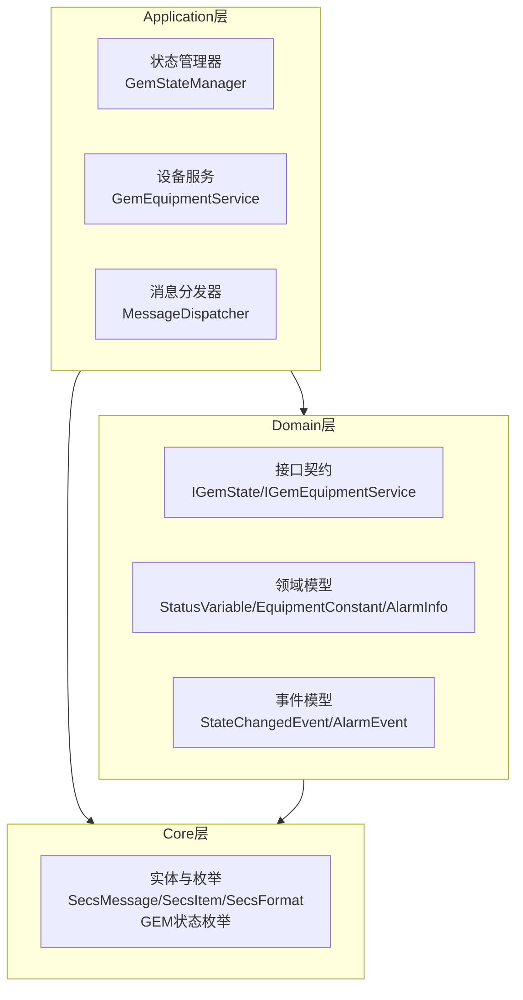
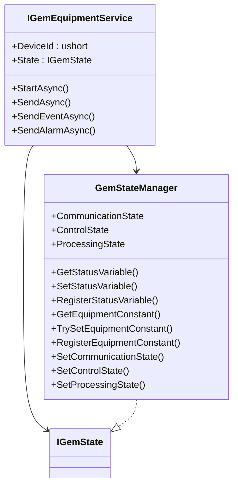
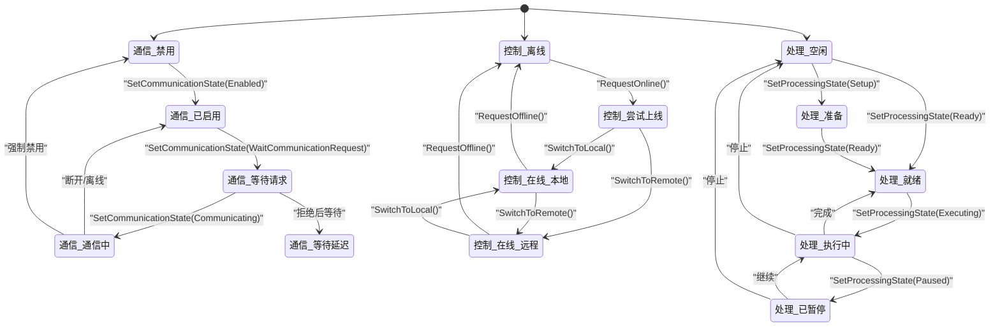
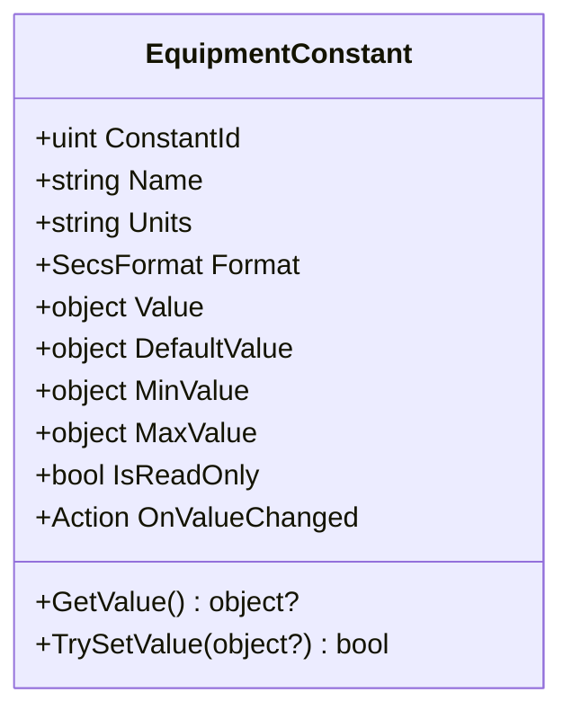
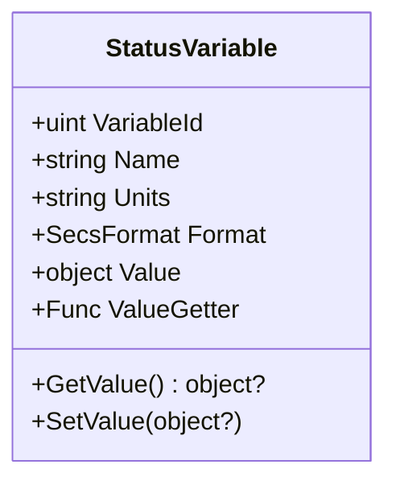
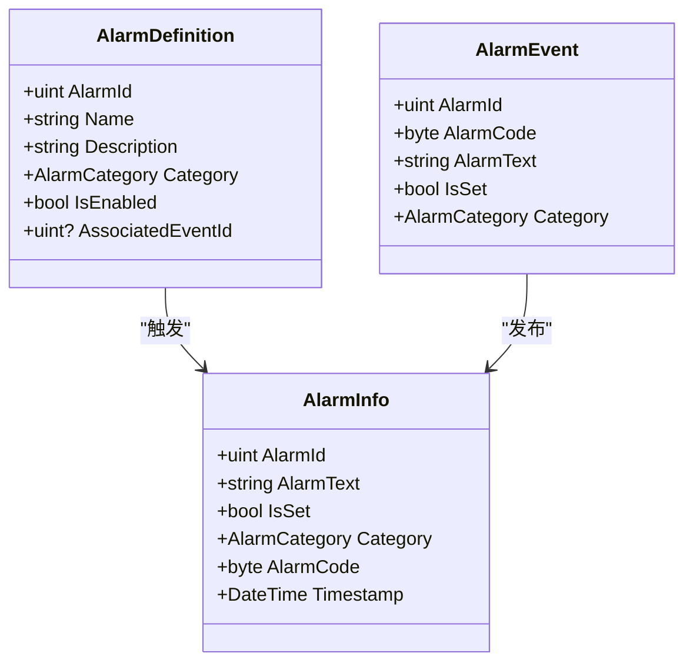
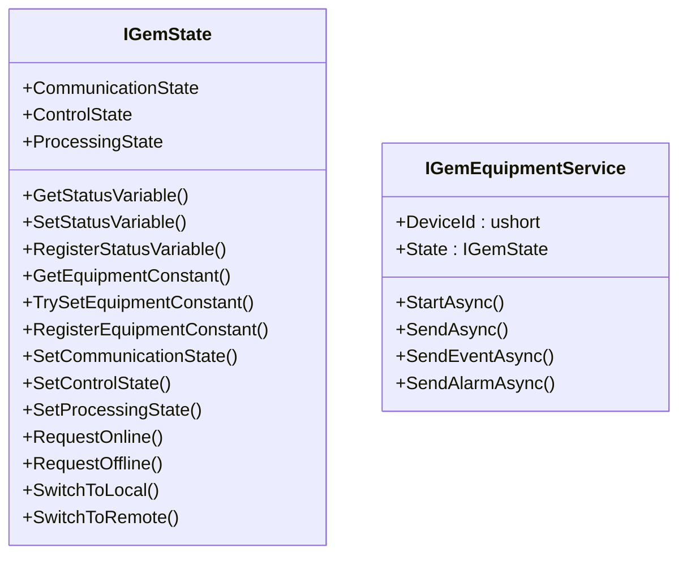
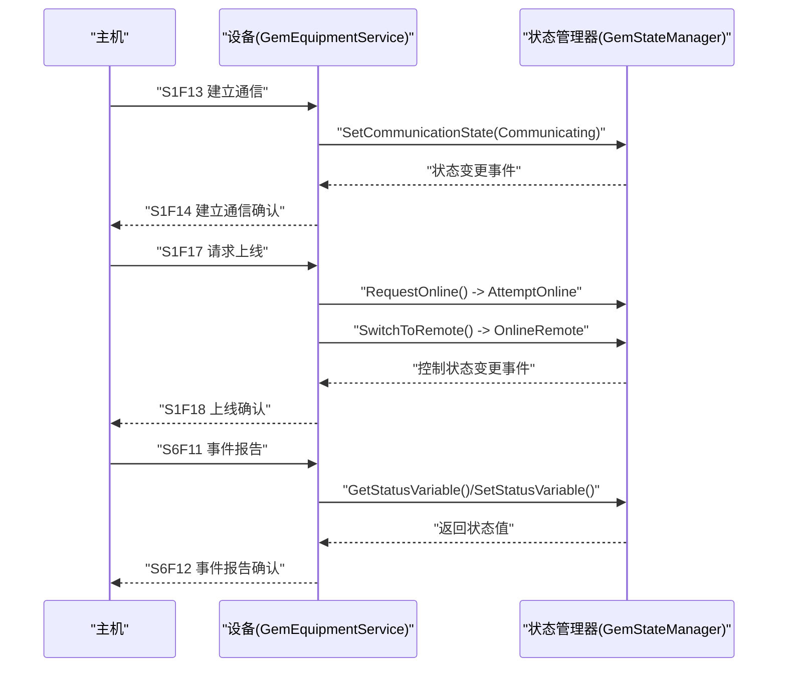
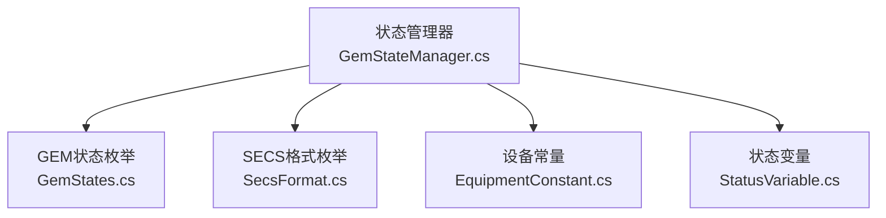

# GEM模型概念

<cite>
**本文引用的文件**
- [EquipmentConstant.cs](file://WebGem/SECS2GEM/Domain/Models/EquipmentConstant.cs)
- [StatusVariable.cs](file://WebGem/SECS2GEM/Domain/Models/StatusVariable.cs)
- [AlarmInfo.cs](file://WebGem/SECS2GEM/Domain/Models/AlarmInfo.cs)
- [GemStates.cs](file://WebGem/SECS2GEM/Core/Enums/GemStates.cs)
- [IGemState.cs](file://WebGem/SECS2GEM/Domain/Interfaces/IGemState.cs)
- [IGemEquipmentService.cs](file://WebGem/SECS2GEM/Domain/Interfaces/IGemEquipmentService.cs)
- [GemStateManager.cs](file://WebGem/SECS2GEM/Application/State/GemStateManager.cs)
- [GemStates.cs](file://WebGem/SECS2GEM/Core/Enums/GemStates.cs)
- [StateChangedEvent.cs](file://WebGem/SECS2GEM/Domain/Events/StateChangedEvent.cs)
- [AlarmEvent.cs](file://WebGem/SECS2GEM/Domain/Events/AlarmEvent.cs)
- [SecsFormat.cs](file://WebGem/SECS2GEM/Core/Enums/SecsFormat.cs)
- [GEM协议规范.md](file://WebGem/SECS2GEM/GEM_Protocol_Specification.md)
- [SECS2GEM类图.md](file://WebGem/SECS2GEM/SECS2GEM_Class_Diagram.md)
- [GemStateManagerTests.cs](file://WebGem/SECS2GEM.Tests/GemStateManagerTests.cs)
- [IntegrationTests.cs](file://WebGem/SECS2GEM.Tests/IntegrationTests.cs)
</cite>

## 目录
1. [引言](#引言)
2. [项目结构](#项目结构)
3. [核心组件](#核心组件)
4. [架构总览](#架构总览)
5. [详细组件分析](#详细组件分析)
6. [依赖分析](#依赖分析)
7. [性能考虑](#性能考虑)
8. [故障排查指南](#故障排查指南)
9. [结论](#结论)
10. [附录](#附录)

## 引言
本文件面向希望快速掌握并应用GEM通用设备模型的开发者，系统性阐述SEMI E30定义的三层状态模型：通信状态（Communicating）、控制状态（Control）与处理状态（Processing）。围绕设备常量（EquipmentConstant）、状态变量（StatusVariable）与报警系统（Alarm），给出清晰的概念、实现边界、交互流程与最佳实践。文末提供状态转换图与测试用例路径，帮助读者将理论映射到实际代码。

## 项目结构
SECS2GEM项目采用分层架构，核心位于Domain、Core与Application三层：
- Core层：实体与枚举（如SECS消息、格式、GEM状态枚举）
- Domain层：领域模型与接口（状态变量、设备常量、报警、事件、接口契约）
- Application层：状态管理器、消息分发、设备服务等应用逻辑

图表来源
- [SECS2GEM类图.md:630-667](file://WebGem/SECS2GEM/SECS2GEM_Class_Diagram.md#L630-L667)

章节来源
- [SECS2GEM类图.md:630-667](file://WebGem/SECS2GEM/SECS2GEM_Class_Diagram.md#L630-L667)

## 核心组件
- 设备常量（EquipmentConstant）：用于配置设备参数，支持只读、范围校验与变更回调；通过S2F13/S2F14查询/设置。
- 状态变量（StatusVariable）：用于表示设备实时状态，支持静态值与动态值获取器；通过S1F3/S1F4查询，S6F11事件上报。
- 报警系统（Alarm）：包含报警信息与报警定义，支持触发与清除，生成S5F1报警消息。
- GEM状态接口（IGemState）：封装通信/控制/处理三态，提供状态查询、注册与转换方法。
- 状态管理器（GemStateManager）：实现状态机与状态变量/常量的存储与访问，内置标准状态变量（如时钟、控制态）。

章节来源
- [EquipmentConstant.cs:12-122](file://WebGem/SECS2GEM/Domain/Models/EquipmentConstant.cs#L12-L122)
- [StatusVariable.cs:12-61](file://WebGem/SECS2GEM/Domain/Models/StatusVariable.cs#L12-L61)
- [AlarmInfo.cs:8-81](file://WebGem/SECS2GEM/Domain/Models/AlarmInfo.cs#L8-L81)
- [IGemState.cs:20-166](file://WebGem/SECS2GEM/Domain/Interfaces/IGemState.cs#L20-L166)
- [GemStateManager.cs:22-492](file://WebGem/SECS2GEM/Application/State/GemStateManager.cs#L22-L492)

## 架构总览
下图展示GEM设备服务如何通过状态管理器协调通信、控制与处理状态，并与消息分发、序列化、事务管理等基础设施协作。

图表来源
- [SECS2GEM类图.md:9-47](file://WebGem/SECS2GEM/SECS2GEM_Class_Diagram.md#L9-L47)
- [IGemEquipmentService.cs:25-160](file://WebGem/SECS2GEM/Domain/Interfaces/IGemEquipmentService.cs#L25-L160)
- [IGemState.cs:20-166](file://WebGem/SECS2GEM/Domain/Interfaces/IGemState.cs#L20-L166)
- [GemStateManager.cs:22-492](file://WebGem/SECS2GEM/Application/State/GemStateManager.cs#L22-L492)

## 详细组件分析

### 三层状态模型与转换

- 通信状态（Communication State）
  - 角色：描述设备与主机之间的通信可用性与建立过程
  - 状态集合：Disabled、Enabled、WaitCommunicationRequest、WaitCommunicationDelay、Communicating
  - 典型场景：S1F13建立通信、S1F14确认、S1F17请求ON-LINE、S1F15请求OFF-LINE
  - 转换规则：允许的转换由状态机验证函数约束，确保合法迁移

- 控制状态（Control State）
  - 角色：描述设备在线/离线与控制模式（本地/远程）
  - 状态集合：EquipmentOffline、AttemptOnline、HostOffline、OnlineLocal、OnlineRemote
  - 典型场景：请求上线/离线、切换本地/远程控制
  - 转换规则：离线与在线之间、本地与远程之间可互转，且支持HostOffline中间态

- 处理状态（Processing State）
  - 角色：描述设备内部加工流程状态
  - 状态集合：Idle、Setup、Ready、Executing、Paused
  - 典型场景：准备、执行、暂停与恢复
  - 转换规则：空闲→准备/就绪，就绪→执行，执行→暂停/就绪/空闲

图表来源
- [GemStateManager.cs:357-455](file://WebGem/SECS2GEM/Application/State/GemStateManager.cs#L357-L455)
- [GEM协议规范.md:542-614](file://WebGem/SECS2GEM/GEM_Protocol_Specification.md#L542-L614)

章节来源
- [GemStateManager.cs:196-350](file://WebGem/SECS2GEM/Application/State/GemStateManager.cs#L196-L350)
- [GemStates.cs:10-176](file://WebGem/SECS2GEM/Core/Enums/GemStates.cs#L10-L176)
- [GEM协议规范.md:542-614](file://WebGem/SECS2GEM/GEM_Protocol_Specification.md#L542-L614)

### 设备常量（EquipmentConstant）

- 作用：承载设备静态配置参数，如设备标识、型号、软件版本等；支持只读、范围校验与变更回调
- 关键属性：常量ID、名称、单位、数据格式、当前值/默认值、最小/最大值、只读标记
- 使用方式：通过TrySetValue进行设置，内部进行只读与范围校验，触发OnValueChanged回调
- 查询机制：GetValue优先返回当前值，否则回退默认值

图表来源
- [EquipmentConstant.cs:12-122](file://WebGem/SECS2GEM/Domain/Models/EquipmentConstant.cs#L12-L122)

章节来源
- [EquipmentConstant.cs:12-122](file://WebGem/SECS2GEM/Domain/Models/EquipmentConstant.cs#L12-L122)

### 状态变量（StatusVariable）

- 作用：表示设备实时状态，支持静态值与动态值获取器
- 关键属性：变量ID、名称、单位、数据格式、当前值、可选的动态值获取器
- 查询机制：GetValue优先调用ValueGetter，否则返回静态Value
- 应用场景：S1F3/S1F4查询，S6F11事件上报

图表来源
- [StatusVariable.cs:12-61](file://WebGem/SECS2GEM/Domain/Models/StatusVariable.cs#L12-L61)

章节来源
- [StatusVariable.cs:12-61](file://WebGem/SECS2GEM/Domain/Models/StatusVariable.cs#L12-L61)

### 报警系统（Alarm）

- 报警信息（AlarmInfo）：包含报警ID、报警文本、是否Set/Clear、报警类别、时间戳；提供AlarmCode计算
- 报警定义（AlarmDefinition）：设备支持的报警配置，包含启用状态与关联事件ID
- 事件模型：AlarmEvent用于事件总线发布，包含IsSet与Category派生属性
- 报警类别（AlarmCategory）：定义于SEMI E30，涵盖安全、参数控制、错误、状态警告、注意标志、数据完整性等

图表来源
- [AlarmInfo.cs:8-81](file://WebGem/SECS2GEM/Domain/Models/AlarmInfo.cs#L8-L81)
- [AlarmEvent.cs:12-57](file://WebGem/SECS2GEM/Domain/Events/AlarmEvent.cs#L12-L57)
- [GemStates.cs:128-176](file://WebGem/SECS2GEM/Core/Enums/GemStates.cs#L128-L176)

章节来源
- [AlarmInfo.cs:8-81](file://WebGem/SECS2GEM/Domain/Models/AlarmInfo.cs#L8-L81)
- [AlarmEvent.cs:12-57](file://WebGem/SECS2GEM/Domain/Events/AlarmEvent.cs#L12-L57)
- [GemStates.cs:128-176](file://WebGem/SECS2GEM/Core/Enums/GemStates.cs#L128-L176)

### 状态接口与设备服务

- IGemState：统一暴露通信/控制/处理状态，提供状态变量与设备常量的注册与访问，以及状态转换方法
- IGemEquipmentService：外观模式入口，负责生命周期、消息发送、事件与报警上报、状态聚合

图表来源
- [IGemState.cs:20-166](file://WebGem/SECS2GEM/Domain/Interfaces/IGemState.cs#L20-L166)
- [IGemEquipmentService.cs:25-160](file://WebGem/SECS2GEM/Domain/Interfaces/IGemEquipmentService.cs#L25-L160)

章节来源
- [IGemState.cs:20-166](file://WebGem/SECS2GEM/Domain/Interfaces/IGemState.cs#L20-L166)
- [IGemEquipmentService.cs:25-160](file://WebGem/SECS2GEM/Domain/Interfaces/IGemEquipmentService.cs#L25-L160)

### 状态转换流程（消息级）

图表来源
- [GEM协议规范.md:617-702](file://WebGem/SECS2GEM/GEM_Protocol_Specification.md#L617-L702)
- [GemStateManager.cs:263-348](file://WebGem/SECS2GEM/Application/State/GemStateManager.cs#L263-L348)

章节来源
- [GEM协议规范.md:617-702](file://WebGem/SECS2GEM/GEM_Protocol_Specification.md#L617-L702)
- [GemStateManager.cs:263-348](file://WebGem/SECS2GEM/Application/State/GemStateManager.cs#L263-L348)

## 依赖分析
- 状态管理器依赖GEM状态枚举与SECS格式枚举，以保证状态与数据编码一致性
- 设备常量与状态变量通过并发字典存储，避免多线程竞争
- 设备服务聚合状态管理器与消息分发器，形成清晰的职责边界

图表来源
- [GemStates.cs:1-176](file://WebGem/SECS2GEM/Core/Enums/GemStates.cs#L1-L176)
- [SecsFormat.cs:1-112](file://WebGem/SECS2GEM/Core/Enums/SecsFormat.cs#L1-L112)
- [EquipmentConstant.cs:12-122](file://WebGem/SECS2GEM/Domain/Models/EquipmentConstant.cs#L12-L122)
- [StatusVariable.cs:12-61](file://WebGem/SECS2GEM/Domain/Models/StatusVariable.cs#L12-L61)
- [GemStateManager.cs:22-492](file://WebGem/SECS2GEM/Application/State/GemStateManager.cs#L22-L492)

章节来源
- [GemStateManager.cs:22-492](file://WebGem/SECS2GEM/Application/State/GemStateManager.cs#L22-L492)
- [GemStates.cs:1-176](file://WebGem/SECS2GEM/Core/Enums/GemStates.cs#L1-L176)
- [SecsFormat.cs:1-112](file://WebGem/SECS2GEM/Core/Enums/SecsFormat.cs#L1-L112)

## 性能考虑
- 并发安全：状态变量与设备常量使用并发字典存储，降低锁粒度，提升高并发下的查询/设置吞吐
- 动态值获取：状态变量支持ValueGetter，避免频繁拷贝，按需计算
- 范围校验：设备常量在TrySetValue内进行范围校验，减少无效写入带来的后续处理成本
- 事件发布：状态变化事件仅在合法转换后触发，避免冗余通知

## 故障排查指南
- 状态转换失败
  - 现象：调用SetCommunicationState/SetControlState/SetProcessingState返回false
  - 排查：检查当前状态与目标状态是否在允许转换集合内；参考状态机验证函数
  - 参考路径：[GemStateManager.cs:357-455](file://WebGem/SECS2GEM/Application/State/GemStateManager.cs#L357-L455)

- 上线/离线请求无效
  - 现象：RequestOnline/RequestOffline返回false
  - 排查：确认通信状态必须为Communicating；控制状态必须为EquipmentOffline或Online*
  - 参考路径：[GemStateManager.cs:263-298](file://WebGem/SECS2GEM/Application/State/GemStateManager.cs#L263-L298)

- 设备常量设置失败
  - 现象：TrySetEquipmentConstant返回false
  - 排查：是否只读、是否越界、类型是否匹配
  - 参考路径：[EquipmentConstant.cs:76-96](file://WebGem/SECS2GEM/Domain/Models/EquipmentConstant.cs#L76-L96)

- 报警未生效
  - 现象：报警未上报或未清除
  - 排查：确认AlarmDefinition已注册、关联事件已启用、设备处于通信状态
  - 参考路径：[AlarmInfo.cs:48-81](file://WebGem/SECS2GEM/Domain/Models/AlarmInfo.cs#L48-L81)

- 单元测试参考
  - 状态机与变量/常量行为验证
  - 参考路径：
    - [GemStateManagerTests.cs:1-365](file://WebGem/SECS2GEM.Tests/GemStateManagerTests.cs#L1-L365)
    - [IntegrationTests.cs:1-194](file://WebGem/SECS2GEM.Tests/IntegrationTests.cs#L1-L194)

章节来源
- [GemStateManager.cs:357-455](file://WebGem/SECS2GEM/Application/State/GemStateManager.cs#L357-L455)
- [EquipmentConstant.cs:76-96](file://WebGem/SECS2GEM/Domain/Models/EquipmentConstant.cs#L76-L96)
- [GemStateManagerTests.cs:1-365](file://WebGem/SECS2GEM.Tests/GemStateManagerTests.cs#L1-L365)
- [IntegrationTests.cs:1-194](file://WebGem/SECS2GEM.Tests/IntegrationTests.cs#L1-L194)

## 结论
GEM通用设备模型通过明确的三层状态与严谨的状态机约束，提供了设备与主机间稳定可靠的通信与控制基础。设备常量与状态变量分别承担“静态配置”与“动态状态”的职责，报警系统则保障异常事件的及时上报。结合测试用例与类图，开发者可快速定位实现细节并进行扩展与集成。

## 附录

### GEM状态模型与消息映射
- 通信状态：S1F13/S1F14建立通信，S1F15/S1F17请求上下线
- 控制状态：S1F15/S1F17请求上下线，本地/远程切换
- 处理状态：S6F11事件上报，状态变量查询/设置

章节来源
- [GEM协议规范.md:750-800](file://WebGem/SECS2GEM/GEM_Protocol_Specification.md#L750-L800)