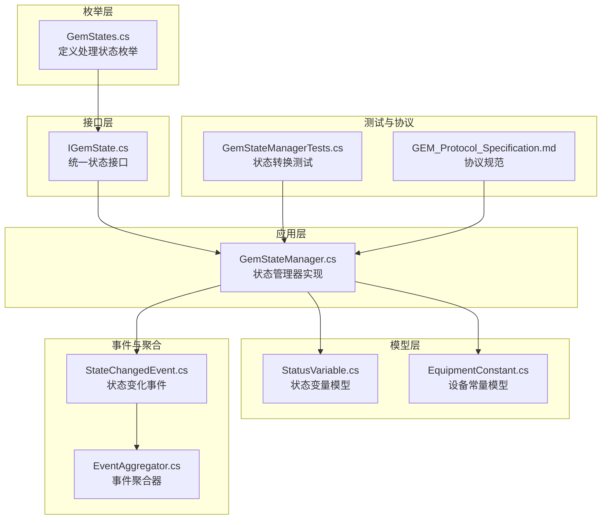
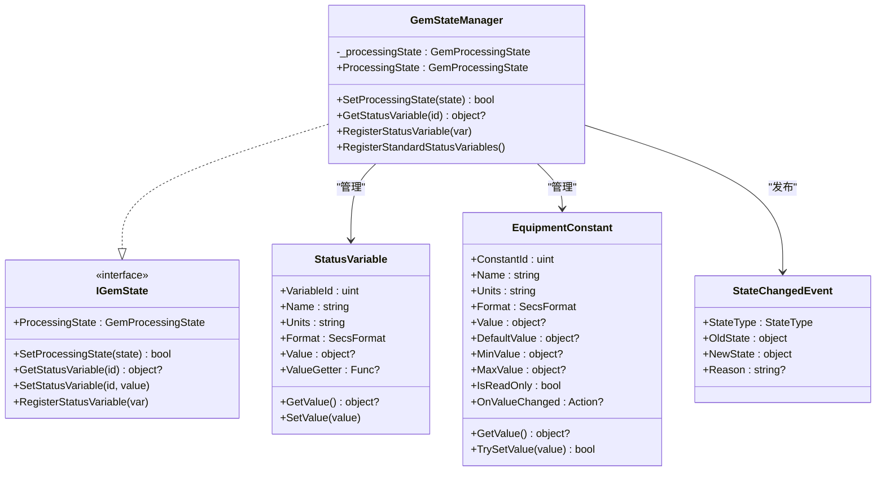
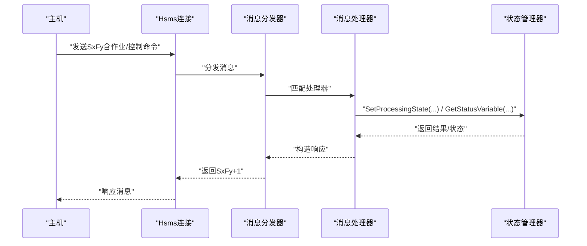
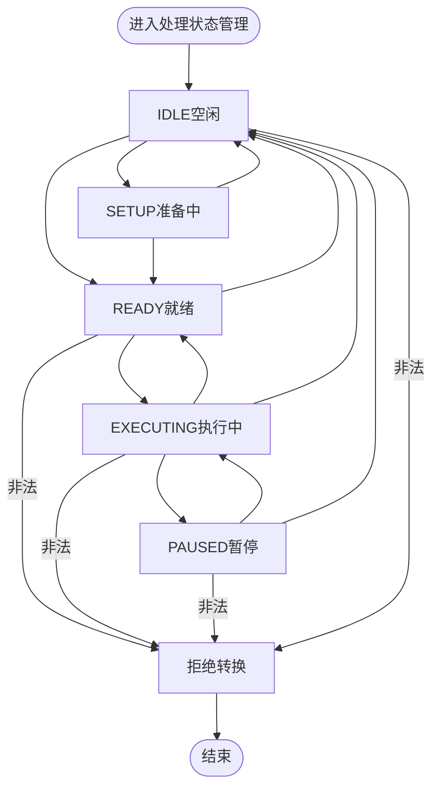
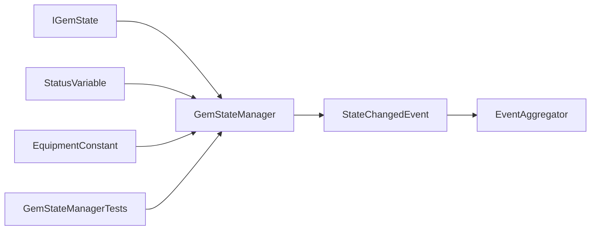

# 处理状态模型

<cite>
**本文引用的文件**
- [GemStates.cs](file://WebGem/SECS2GEM/Core/Enums/GemStates.cs)
- [IGemState.cs](file://WebGem/SECS2GEM/Domain/Interfaces/IGemState.cs)
- [GemStateManager.cs](file://WebGem/SECS2GEM/Application/State/GemStateManager.cs)
- [StatusVariable.cs](file://WebGem/SECS2GEM/Domain/Models/StatusVariable.cs)
- [EquipmentConstant.cs](file://WebGem/SECS2GEM/Domain/Models/EquipmentConstant.cs)
- [StateChangedEvent.cs](file://WebGem/SECS2GEM/Domain/Events/StateChangedEvent.cs)
- [EventAggregator.cs](file://WebGem/SECS2GEM/Infrastructure/Services/EventAggregator.cs)
- [GEM_Protocol_Specification.md](file://WebGem/SECS2GEM/GEM_Protocol_Specification.md)
- [GemStateManagerTests.cs](file://WebGem/SECS2GEM.Tests/GemStateManagerTests.cs)
- [SECS2GEM_Class_Diagram.md](file://WebGem/SECS2GEM/SECS2GEM_Class_Diagram.md)
</cite>

## 目录
1. [简介](#简介)
2. [项目结构](#项目结构)
3. [核心组件](#核心组件)
4. [架构总览](#架构总览)
5. [详细组件分析](#详细组件分析)
6. [依赖关系分析](#依赖关系分析)
7. [性能考量](#性能考量)
8. [故障排查指南](#故障排查指南)
9. [结论](#结论)
10. [附录](#附录)

## 简介
本文件系统性阐述GEM处理状态模型，聚焦于三类核心状态：IDLE（空闲）、EXECUTING（执行中）、PAUSED（暂停）。文档从状态定义、设备行为特征、工件处理能力、与生产流程的关系、状态转换触发条件与消息机制、状态监控与查询方法，以及最佳实践与故障处理策略等方面进行全面说明，并结合代码与协议规范给出可操作的指导。

## 项目结构
围绕处理状态模型的关键代码分布在以下模块：
- 枚举层：定义GEM通信/控制/处理状态枚举
- 接口层：统一的状态抽象与能力暴露
- 应用层：状态管理器实现，包含状态转换验证、事件发布、标准状态变量注册
- 模型层：状态变量与设备常量的数据结构
- 事件与聚合：状态变化事件与事件分发机制
- 测试与协议：单元测试覆盖状态转换合法性，协议文档提供状态语义

图表来源
- [GemStates.cs:89-120](file://WebGem/SECS2GEM/Core/Enums/GemStates.cs#L89-L120)
- [IGemState.cs:20-163](file://WebGem/SECS2GEM/Domain/Interfaces/IGemState.cs#L20-L163)
- [GemStateManager.cs:22-491](file://WebGem/SECS2GEM/Application/State/GemStateManager.cs#L22-L491)
- [StatusVariable.cs:12-60](file://WebGem/SECS2GEM/Domain/Models/StatusVariable.cs#L12-L60)
- [EquipmentConstant.cs:12-122](file://WebGem/SECS2GEM/Domain/Models/EquipmentConstant.cs#L12-L122)
- [StateChangedEvent.cs:11-110](file://WebGem/SECS2GEM/Domain/Events/StateChangedEvent.cs#L11-L110)
- [EventAggregator.cs:17-219](file://WebGem/SECS2GEM/Infrastructure/Services/EventAggregator.cs#L17-L219)
- [GemStateManagerTests.cs:10-365](file://WebGem/SECS2GEM.Tests/GemStateManagerTests.cs#L10-L365)
- [GEM_Protocol_Specification.md:601-616](file://WebGem/SECS2GEM/GEM_Protocol_Specification.md#L601-L616)

章节来源
- [GemStateManager.cs:22-107](file://WebGem/SECS2GEM/Application/State/GemStateManager.cs#L22-L107)
- [GEM_Protocol_Specification.md:601-616](file://WebGem/SECS2GEM/GEM_Protocol_Specification.md#L601-L616)

## 核心组件
- 处理状态枚举：定义IDLE、SETUP、READY、EXECUTING、PAUSED等状态及其语义
- 状态接口：统一暴露状态查询、转换、事件与状态变量/设备常量管理能力
- 状态管理器：实现状态转换验证、事件发布、标准状态变量注册
- 状态变量与设备常量：支撑状态查询、事件上报与配置管理
- 事件与聚合：封装状态变化事件并通过聚合器异步/同步分发

章节来源
- [GemStates.cs:89-120](file://WebGem/SECS2GEM/Core/Enums/GemStates.cs#L89-L120)
- [IGemState.cs:20-163](file://WebGem/SECS2GEM/Domain/Interfaces/IGemState.cs#L20-L163)
- [GemStateManager.cs:22-491](file://WebGem/SECS2GEM/Application/State/GemStateManager.cs#L22-L491)
- [StatusVariable.cs:12-60](file://WebGem/SECS2GEM/Domain/Models/StatusVariable.cs#L12-L60)
- [EquipmentConstant.cs:12-122](file://WebGem/SECS2GEM/Domain/Models/EquipmentConstant.cs#L12-L122)
- [StateChangedEvent.cs:11-110](file://WebGem/SECS2GEM/Domain/Events/StateChangedEvent.cs#L11-L110)
- [EventAggregator.cs:17-219](file://WebGem/SECS2GEM/Infrastructure/Services/EventAggregator.cs#L17-L219)

## 架构总览
处理状态模型采用“状态模式”实现，状态管理器集中维护当前状态并在转换时进行合法性校验，同时通过事件机制对外通知状态变化。状态变量与设备常量作为外部可观测与可配置的载体，配合协议消息实现与主机系统的交互。

图表来源
- [GemStateManager.cs:22-491](file://WebGem/SECS2GEM/Application/State/GemStateManager.cs#L22-L491)
- [IGemState.cs:20-163](file://WebGem/SECS2GEM/Domain/Interfaces/IGemState.cs#L20-L163)
- [StatusVariable.cs:12-60](file://WebGem/SECS2GEM/Domain/Models/StatusVariable.cs#L12-L60)
- [EquipmentConstant.cs:12-122](file://WebGem/SECS2GEM/Domain/Models/EquipmentConstant.cs#L12-L122)
- [StateChangedEvent.cs:11-110](file://WebGem/SECS2GEM/Domain/Events/StateChangedEvent.cs#L11-L110)

## 详细组件分析

### 处理状态定义与语义
- IDLE（空闲）：等待工作指令，设备处于准备就绪状态
- READY（就绪）：已完成准备，等待开始执行
- EXECUTING（执行中）：正在处理工件，配方执行中
- PAUSED（暂停）：处理被暂停，等待恢复指令

这些状态的语义与转换关系由协议规范明确，状态管理器实现严格的转换验证。

章节来源
- [GemStates.cs:89-120](file://WebGem/SECS2GEM/Core/Enums/GemStates.cs#L89-L120)
- [GEM_Protocol_Specification.md:601-616](file://WebGem/SECS2GEM/GEM_Protocol_Specification.md#L601-L616)

### 设备行为特征与工件处理能力
- IDLE：设备等待主机下发作业/准备指令；无工件在处理
- READY：设备完成准备，具备接收工件并开始执行的能力
- EXECUTING：设备正在执行配方，工件处于加工过程中
- PAUSED：设备暂停执行，可恢复继续或停止

状态与工件处理的关系体现在状态转换路径上：从IDLE经SETUP/READY到达EXECUTING，期间可因外部指令进入PAUSED；从EXECUTING可回到READY/IDLE，或从PAUSED恢复至EXECUTING。

章节来源
- [GemStateManagerTests.cs:176-217](file://WebGem/SECS2GEM.Tests/GemStateManagerTests.cs#L176-L217)
- [GemStateManager.cs:425-455](file://WebGem/SECS2GEM/Application/State/GemStateManager.cs#L425-L455)

### 生产流程中的状态关系
- 作业调度：主机通过S1F17（请求上线）与S1F13/S1F14（建立通信）使设备进入在线/远程控制后，再下发作业
- 工件传输：状态变化与传输动作通过事件上报（如S6F11事件报告）与状态变量查询（S1F3/S1F4）实现
- 状态监控：通过标准状态变量（如SVID 1 Clock、SVID 2 ControlState）与自定义状态变量对外提供实时状态

章节来源
- [GEM_Protocol_Specification.md:617-748](file://WebGem/SECS2GEM/GEM_Protocol_Specification.md#L617-L748)
- [GemStateManager.cs:464-487](file://WebGem/SECS2GEM/Application/State/GemStateManager.cs#L464-L487)

### 状态转换触发条件与消息机制
- 转换验证：状态管理器内置转换表，仅允许合法状态迁移
- 触发方式：可通过API调用（如SetProcessingState）或消息驱动（如主机下发命令）
- 消息流程：消息经连接层、分发器、处理器，最终调用状态管理器完成状态更新

图表来源
- [SECS2GEM_Class_Diagram.md:668-695](file://WebGem/SECS2GEM/SECS2GEM_Class_Diagram.md#L668-L695)
- [GemStateManager.cs:246-258](file://WebGem/SECS2GEM/Application/State/GemStateManager.cs#L246-L258)

章节来源
- [GemStateManager.cs:425-455](file://WebGem/SECS2GEM/Application/State/GemStateManager.cs#L425-L455)
- [SECS2GEM_Class_Diagram.md:668-695](file://WebGem/SECS2GEM/SECS2GEM_Class_Diagram.md#L668-L695)

### 状态监控与查询
- 状态查询：通过S1F3/S1F4查询状态变量，状态管理器提供GetStatusVariable/SetStatusVariable与注册能力
- 事件上报：状态变化事件通过事件聚合器异步分发，订阅方可实时获知状态变更
- 标准变量：内置Clock与ControlState等标准状态变量，便于主机侧统一监控

章节来源
- [IGemState.cs:67-94](file://WebGem/SECS2GEM/Domain/Interfaces/IGemState.cs#L67-L94)
- [StatusVariable.cs:12-60](file://WebGem/SECS2GEM/Domain/Models/StatusVariable.cs#L12-L60)
- [GemStateManager.cs:114-148](file://WebGem/SECS2GEM/Application/State/GemStateManager.cs#L114-L148)
- [EventAggregator.cs:17-219](file://WebGem/SECS2GEM/Infrastructure/Services/EventAggregator.cs#L17-L219)

### 处理状态转换流程图

图表来源
- [GemStateManager.cs:425-455](file://WebGem/SECS2GEM/Application/State/GemStateManager.cs#L425-L455)

## 依赖关系分析
- 状态管理器依赖状态接口定义，确保对外能力一致
- 状态变量与设备常量作为数据承载，被状态管理器统一管理
- 事件聚合器解耦状态变化通知与订阅者，支持异步/同步处理
- 单元测试覆盖状态转换合法性，保障实现正确性

图表来源
- [IGemState.cs:20-163](file://WebGem/SECS2GEM/Domain/Interfaces/IGemState.cs#L20-L163)
- [GemStateManager.cs:22-491](file://WebGem/SECS2GEM/Application/State/GemStateManager.cs#L22-L491)
- [EventAggregator.cs:17-219](file://WebGem/SECS2GEM/Infrastructure/Services/EventAggregator.cs#L17-L219)
- [GemStateManagerTests.cs:10-365](file://WebGem/SECS2GEM.Tests/GemStateManagerTests.cs#L10-L365)

章节来源
- [GemStateManager.cs:22-491](file://WebGem/SECS2GEM/Application/State/GemStateManager.cs#L22-L491)
- [EventAggregator.cs:17-219](file://WebGem/SECS2GEM/Infrastructure/Services/EventAggregator.cs#L17-L219)
- [GemStateManagerTests.cs:10-365](file://WebGem/SECS2GEM.Tests/GemStateManagerTests.cs#L10-L365)

## 性能考量
- 并发安全：状态管理器使用锁保护状态字段，避免竞态
- 事件分发：事件聚合器支持异步/同步处理，订阅者异常隔离，不影响整体分发
- 动态状态变量：通过ValueGetter支持动态计算，减少静态缓存带来的过期风险
- 转换验证：在进入状态前进行合法性检查，避免无效状态导致的额外开销

章节来源
- [GemStateManager.cs:24-31](file://WebGem/SECS2GEM/Application/State/GemStateManager.cs#L24-L31)
- [EventAggregator.cs:17-219](file://WebGem/SECS2GEM/Infrastructure/Services/EventAggregator.cs#L17-L219)
- [StatusVariable.cs:40-50](file://WebGem/SECS2GEM/Domain/Models/StatusVariable.cs#L40-L50)

## 故障排查指南
- 状态转换失败：检查当前状态与目标状态是否在允许转换表内；参考状态管理器的转换验证逻辑
- 事件未触发：确认事件聚合器订阅是否正确；检查处理器是否正确发布事件
- 状态变量查询为空：确认变量是否已注册；检查变量ID是否正确
- 设备常量设置失败：确认常量是否只读或超出范围；检查TrySetEquipmentConstant返回值

章节来源
- [GemStateManager.cs:425-455](file://WebGem/SECS2GEM/Application/State/GemStateManager.cs#L425-L455)
- [EventAggregator.cs:17-219](file://WebGem/SECS2GEM/Infrastructure/Services/EventAggregator.cs#L17-L219)
- [StatusVariable.cs:12-60](file://WebGem/SECS2GEM/Domain/Models/StatusVariable.cs#L12-L60)
- [EquipmentConstant.cs:74-96](file://WebGem/SECS2GEM/Domain/Models/EquipmentConstant.cs#L74-L96)

## 结论
处理状态模型通过清晰的状态定义、严格的转换验证、完善的事件与查询机制，实现了与主机系统的稳定交互。在实际生产中，建议遵循最小必要状态转换原则、及时上报状态变化、合理使用状态变量与设备常量，并通过单元测试与事件监控保障系统可靠性。

## 附录
- 状态变量与设备常量的注册与查询接口定义见状态接口与模型文件
- 协议层面的状态查询与事件上报流程见协议规范文档

章节来源
- [IGemState.cs:67-163](file://WebGem/SECS2GEM/Domain/Interfaces/IGemState.cs#L67-L163)
- [StatusVariable.cs:12-60](file://WebGem/SECS2GEM/Domain/Models/StatusVariable.cs#L12-L60)
- [EquipmentConstant.cs:12-122](file://WebGem/SECS2GEM/Domain/Models/EquipmentConstant.cs#L12-L122)
- [GEM_Protocol_Specification.md:601-748](file://WebGem/SECS2GEM/GEM_Protocol_Specification.md#L601-L748)