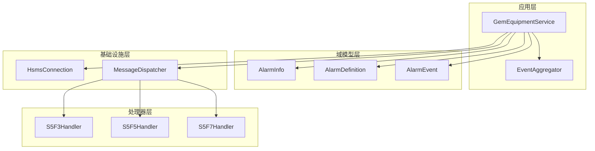
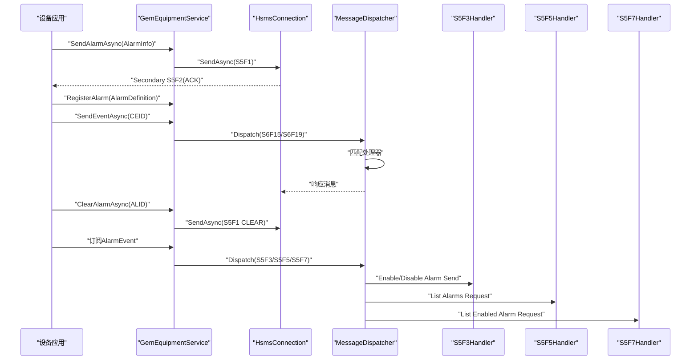
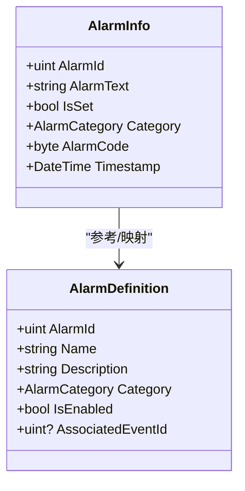
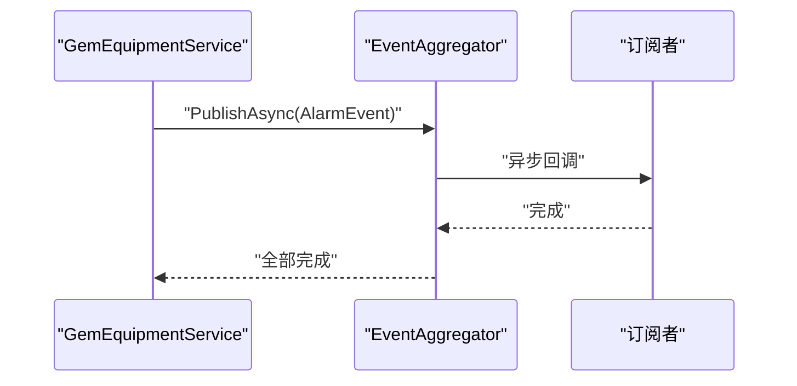
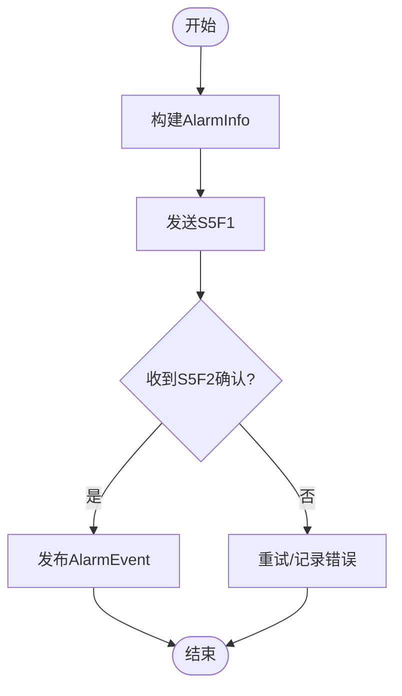
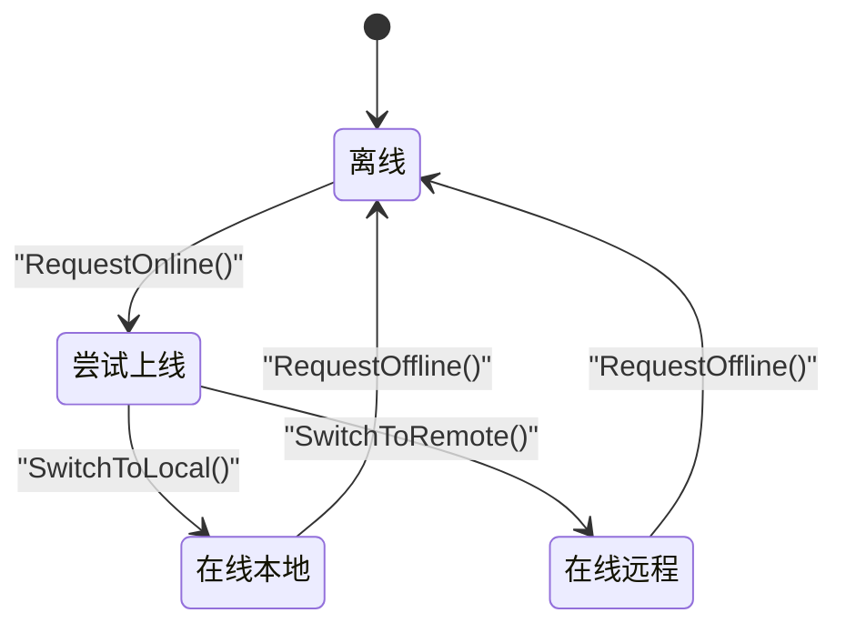
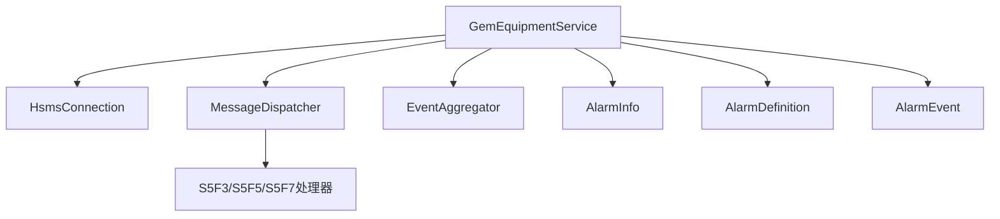

# 报警管理系统

<cite>
**本文引用的文件**
- [AlarmInfo.cs](file://WebGem/SECS2GEM/Domain/Models/AlarmInfo.cs)
- [AlarmEvent.cs](file://WebGem/SECS2GEM/Domain/Events/AlarmEvent.cs)
- [GemEquipmentService.cs](file://WebGem/SECS2GEM/Application/Services/GemEquipmentService.cs)
- [EventAggregator.cs](file://WebGem/SECS2GEM/Infrastructure/Services/EventAggregator.cs)
- [OtherStreamHandlers.cs](file://WebGem/SECS2GEM/Application/Handlers/OtherStreamHandlers.cs)
- [StreamOneHandlers.cs](file://WebGem/SECS2GEM/Application/Handlers/StreamOneHandlers.cs)
- [StreamTwoHandlers.cs](file://WebGem/SECS2GEM/Application/Handlers/StreamTwoHandlers.cs)
- [IGemEquipmentService.cs](file://WebGem/SECS2GEM/Domain/Interfaces/IGemEquipmentService.cs)
- [SECS2GEM_Class_Diagram.md](file://WebGem/SECS2GEM/SECS2GEM_Class_Diagram.md)
- [GemStateManagerTests.cs](file://WebGem/SECS2GEM.Tests/GemStateManagerTests.cs)
- [IntegrationTests.cs](file://WebGem/SECS2GEM.Tests/IntegrationTests.cs)
</cite>

## 目录
1. [简介](#简介)
2. [项目结构](#项目结构)
3. [核心组件](#核心组件)
4. [架构总览](#架构总览)
5. [详细组件分析](#详细组件分析)
6. [依赖分析](#依赖分析)
7. [性能考虑](#性能考虑)
8. [故障排除指南](#故障排除指南)
9. [结论](#结论)
10. [附录](#附录)

## 简介
本文件为GEM报警管理系统提供综合性技术文档，覆盖报警概念与分类、AlarmInfo模型设计、报警生成/传播/处理流程（含S5F1/S5F2消息机制）、报警查询/清除/状态管理、报警事件订阅与通知、报警配置最佳实践、优先级与历史记录管理，以及实际生产环境中的处理策略与故障排除方法。文档面向不同层次读者，既提供高层架构视图，也包含代码级细节与可视化图表。

## 项目结构
报警系统位于SECS2GEM工程中，采用分层架构：
- 应用层：GemEquipmentService作为外观模式入口，负责连接、消息分发、状态管理与报警发送。
- 域模型层：AlarmInfo与AlarmDefinition定义报警实体；AlarmEvent封装报警事件。
- 基础设施层：EventAggregator实现事件聚合与订阅；HsmsConnection负责底层通信。
- 处理器层：各Stream的消息处理器（如S5F3/S5F5/S5F7）实现报警相关协议交互。

**图表来源**
- [SECS2GEM_Class_Diagram.md:1-695](file://WebGem/SECS2GEM/SECS2GEM_Class_Diagram.md#L1-L695)
- [GemEquipmentService.cs:1-456](file://WebGem/SECS2GEM/Application/Services/GemEquipmentService.cs#L1-L456)
- [EventAggregator.cs:1-219](file://WebGem/SECS2GEM/Infrastructure/Services/EventAggregator.cs#L1-L219)
- [OtherStreamHandlers.cs:1-276](file://WebGem/SECS2GEM/Application/Handlers/OtherStreamHandlers.cs#L1-L276)

**章节来源**
- [SECS2GEM_Class_Diagram.md:1-695](file://WebGem/SECS2GEM/SECS2GEM_Class_Diagram.md#L1-L695)

## 核心组件
- AlarmInfo：用于S5F1报警上报的实体，包含报警ID、报警文本、是否触发、报警类别、报警码与时间戳。
- AlarmDefinition：设备支持的报警定义，包含ID、名称、描述、类别、启用状态与关联事件ID。
- AlarmEvent：报警事件对象，携带报警ID、报警码、报警文本，并可解析IsSet与Category。
- GemEquipmentService：统一入口，负责发送报警（S5F1）、清除报警、注册报警定义、注册默认处理器（含S5F3/S5F5/S5F7）。
- EventAggregator：事件聚合器，支持异步/同步发布与订阅，异常隔离，便于报警事件通知。

**章节来源**
- [AlarmInfo.cs:1-81](file://WebGem/SECS2GEM/Domain/Models/AlarmInfo.cs#L1-L81)
- [AlarmEvent.cs:1-57](file://WebGem/SECS2GEM/Domain/Events/AlarmEvent.cs#L1-L57)
- [IGemEquipmentService.cs:1-160](file://WebGem/SECS2GEM/Domain/Interfaces/IGemEquipmentService.cs#L1-L160)
- [GemEquipmentService.cs:1-456](file://WebGem/SECS2GEM/Application/Services/GemEquipmentService.cs#L1-L456)
- [EventAggregator.cs:1-219](file://WebGem/SECS2GEM/Infrastructure/Services/EventAggregator.cs#L1-L219)

## 架构总览
报警系统遵循GEM协议，通过S5F1进行报警上报，S5F3/S5F5/S5F7实现报警相关查询与控制。GemEquipmentService作为协调者，将报警实体转换为SECS消息并发送，同时发布AlarmEvent事件给订阅者。

**图表来源**
- [GemEquipmentService.cs:270-317](file://WebGem/SECS2GEM/Application/Services/GemEquipmentService.cs#L270-L317)
- [OtherStreamHandlers.cs:1-276](file://WebGem/SECS2GEM/Application/Handlers/OtherStreamHandlers.cs#L1-L276)
- [StreamOneHandlers.cs:1-211](file://WebGem/SECS2GEM/Application/Handlers/StreamOneHandlers.cs#L1-L211)
- [StreamTwoHandlers.cs:1-331](file://WebGem/SECS2GEM/Application/Handlers/StreamTwoHandlers.cs#L1-L331)

## 详细组件分析

### AlarmInfo模型设计与报警属性定义
- 核心属性
  - AlarmId：报警唯一标识（ALID）
  - AlarmText：报警文本（ALTX）
  - IsSet：是否为触发（true=Set, false=Clear）
  - Category：报警类别（枚举，来自AlarmCategory）
  - AlarmCode：组合字段，bit7表示Set/Clear，bit0-6表示类别
  - Timestamp：报警发生时间，默认UTC
- 设计要点
  - AlarmCode通过位运算将IsSet与Category合并，满足GEM协议要求
  - 时间戳便于后续历史记录与审计

**图表来源**
- [AlarmInfo.cs:8-81](file://WebGem/SECS2GEM/Domain/Models/AlarmInfo.cs#L8-L81)

**章节来源**
- [AlarmInfo.cs:1-81](file://WebGem/SECS2GEM/Domain/Models/AlarmInfo.cs#L1-L81)

### 报警事件与订阅通知机制
- AlarmEvent：封装报警事件，包含AlarmId、AlarmCode、AlarmText，并提供IsSet与Category解析。
- EventAggregator：支持异步/同步发布，订阅者可通过IDisposable取消订阅；内部异常隔离，保证单个订阅失败不影响其他订阅者。
- 订阅方式：通过IGemEquipmentService事件（如MessageReceived、StateChanged）或直接订阅AlarmEvent。

**图表来源**
- [AlarmEvent.cs:12-56](file://WebGem/SECS2GEM/Domain/Events/AlarmEvent.cs#L12-L56)
- [EventAggregator.cs:25-67](file://WebGem/SECS2GEM/Infrastructure/Services/EventAggregator.cs#L25-L67)

**章节来源**
- [AlarmEvent.cs:1-57](file://WebGem/SECS2GEM/Domain/Events/AlarmEvent.cs#L1-L57)
- [EventAggregator.cs:1-219](file://WebGem/SECS2GEM/Infrastructure/Services/EventAggregator.cs#L1-L219)

### 报警生成、传播与处理流程（S5F1/S5F2）
- 发送报警（S5F1）
  - GemEquipmentService根据AlarmInfo构造S5F1消息（ALCD, ALID, ALTX），并通过HsmsConnection发送。
  - 发送成功后发布AlarmEvent，供订阅者消费。
- 清除报警（S5F1 CLEAR）
  - 通过ClearAlarmAsync将对应AlarmInfo的IsSet设为false并重新发送S5F1。
- 查询与控制（S5F3/S5F5/S5F7）
  - S5F3：启用/禁用报警发送
  - S5F5：请求报警列表（当前简化为空列表）
  - S5F7：请求已启用报警列表（当前简化为空列表）

**图表来源**
- [GemEquipmentService.cs:270-294](file://WebGem/SECS2GEM/Application/Services/GemEquipmentService.cs#L270-L294)
- [OtherStreamHandlers.cs:7-66](file://WebGem/SECS2GEM/Application/Handlers/OtherStreamHandlers.cs#L7-L66)

**章节来源**
- [GemEquipmentService.cs:270-317](file://WebGem/SECS2GEM/Application/Services/GemEquipmentService.cs#L270-L317)
- [OtherStreamHandlers.cs:1-276](file://WebGem/SECS2GEM/Application/Handlers/OtherStreamHandlers.cs#L1-L276)

### 报警查询、清除与状态管理
- 查询
  - S5F5：请求报警列表（当前实现返回空列表）
  - S5F7：请求已启用报警列表（当前实现返回空列表）
- 清除
  - ClearAlarmAsync：将活跃报警标记为CLEAR并发送S5F1
- 状态管理
  - 仅在设备处于“通信中”（Communicating）状态时才允许发送报警
  - 通过状态机（GemStateManager）控制在线/离线与本地/远程模式切换

**图表来源**
- [StreamOneHandlers.cs:151-209](file://WebGem/SECS2GEM/Application/Handlers/StreamOneHandlers.cs#L151-L209)
- [GemStateManagerTests.cs:95-172](file://WebGem/SECS2GEM.Tests/GemStateManagerTests.cs#L95-L172)

**章节来源**
- [GemEquipmentService.cs:296-307](file://WebGem/SECS2GEM/Application/Services/GemEquipmentService.cs#L296-L307)
- [OtherStreamHandlers.cs:29-66](file://WebGem/SECS2GEM/Application/Handlers/OtherStreamHandlers.cs#L29-L66)
- [StreamOneHandlers.cs:151-209](file://WebGem/SECS2GEM/Application/Handlers/StreamOneHandlers.cs#L151-L209)
- [GemStateManagerTests.cs:95-172](file://WebGem/SECS2GEM.Tests/GemStateManagerTests.cs#L95-L172)

### 报警配置最佳实践
- 报警定义
  - 为每个设备支持的报警分配唯一ID与类别，明确IsEnabled与AssociatedEventId
  - 在设备启动前完成RegisterAlarm注册，确保S5F5/S5F7查询返回正确结果
- 报警文本
  - 使用清晰、可读性强的ALTX，便于上位系统与操作员理解
- 优先级与分类
  - 建议按设备/工艺/安全三类划分AlarmCategory，结合IsSet与Category位编码
- 自动上线与模式
  - 结合AutoOnline与InitialRemoteMode，在通信建立后自动切换至所需模式

**章节来源**
- [AlarmInfo.cs:48-81](file://WebGem/SECS2GEM/Domain/Models/AlarmInfo.cs#L48-L81)
- [GemEquipmentService.cs:407-443](file://WebGem/SECS2GEM/Application/Services/GemEquipmentService.cs#L407-L443)

### 报警历史记录管理
- 历史记录建议
  - 以AlarmInfo.Timestamp为索引，记录每次报警触发与清除事件
  - 结合AlarmEvent的IsSet与Category，便于统计与报表
- 存储与查询
  - 可将历史记录持久化至数据库或日志系统，支持按时间段、报警ID、类别过滤

[本节为通用建议，无需特定文件引用]

## 依赖分析
- 组件耦合
  - GemEquipmentService依赖HsmsConnection、MessageDispatcher、EventAggregator与状态管理器
  - AlarmInfo/AlarmDefinition与AlarmEvent形成清晰的领域模型边界
- 外部依赖
  - SECS消息序列化/反序列化由基础设施层提供
  - 事件订阅通过EventAggregator实现松耦合

**图表来源**
- [SECS2GEM_Class_Diagram.md:1-695](file://WebGem/SECS2GEM/SECS2GEM_Class_Diagram.md#L1-L695)
- [GemEquipmentService.cs:1-456](file://WebGem/SECS2GEM/Application/Services/GemEquipmentService.cs#L1-L456)

**章节来源**
- [SECS2GEM_Class_Diagram.md:1-695](file://WebGem/SECS2GEM/SECS2GEM_Class_Diagram.md#L1-L695)

## 性能考虑
- 事件发布
  - EventAggregator对异步处理器采用Task.WhenAll并行处理，提升吞吐
- 消息发送
  - 仅在通信状态（Communicating）下发送报警，避免无效网络负载
- 处理器注册
  - 默认处理器集中注册，减少重复初始化成本

[本节为通用指导，无需特定文件引用]

## 故障排除指南
- 报警未上报
  - 检查IsCommunicating状态，确保设备已完成S1F13建立通信
  - 确认SendAlarmAsync调用路径与参数（AlarmInfo）
- 报警清除无效
  - 确保ClearAlarmAsync传入正确的AlarmId且对应AlarmInfo存在于活跃集合
- 查询无结果
  - S5F5/S5F7当前实现返回空列表，需在业务层扩展或在设备端维护报警清单
- 订阅无回调
  - 检查EventAggregator订阅是否正确添加，确认异常隔离未屏蔽预期异常

**章节来源**
- [GemEquipmentService.cs:270-307](file://WebGem/SECS2GEM/Application/Services/GemEquipmentService.cs#L270-L307)
- [OtherStreamHandlers.cs:29-66](file://WebGem/SECS2GEM/Application/Handlers/OtherStreamHandlers.cs#L29-L66)
- [EventAggregator.cs:170-197](file://WebGem/SECS2GEM/Infrastructure/Services/EventAggregator.cs#L170-L197)

## 结论
本报警管理系统以AlarmInfo为核心，结合AlarmEvent与EventAggregator实现了从设备侧报警上报到上位系统通知的完整闭环。通过S5F1/S5F2消息机制与默认处理器注册，系统具备良好的扩展性与可维护性。建议在实际部署中完善报警查询与历史记录功能，并结合状态机与自动上线策略，确保报警在生产环境中稳定可靠。

[本节为总结性内容，无需特定文件引用]

## 附录
- 报警处理流程概览（基于现有实现）
  - 设备侧：RegisterAlarm → SendAlarmAsync → 发布AlarmEvent
  - 上位系统：订阅AlarmEvent → 处理报警事件
  - 查询与控制：S5F3/S5F5/S5F7（当前简化实现）

**章节来源**
- [GemEquipmentService.cs:270-317](file://WebGem/SECS2GEM/Application/Services/GemEquipmentService.cs#L270-L317)
- [OtherStreamHandlers.cs:1-276](file://WebGem/SECS2GEM/Application/Handlers/OtherStreamHandlers.cs#L1-L276)
- [IntegrationTests.cs:1-194](file://WebGem/SECS2GEM.Tests/IntegrationTests.cs#L1-L194)