# 控制状态模型

<cite>
**本文引用的文件**
- [GemStates.cs](file://WebGem/SECS2GEM/Core/Enums/GemStates.cs)
- [IGemState.cs](file://WebGem/SECS2GEM/Domain/Interfaces/IGemState.cs)
- [GemStateManager.cs](file://WebGem/SECS2GEM/Application/State/GemStateManager.cs)
- [StreamOneHandlers.cs](file://WebGem/SECS2GEM/Application/Handlers/StreamOneHandlers.cs)
- [StreamTwoHandlers.cs](file://WebGem/SECS2GEM/Application/Handlers/StreamTwoHandlers.cs)
- [StateChangedEvent.cs](file://WebGem/SECS2GEM/Domain/Events/StateChangedEvent.cs)
- [EventAggregator.cs](file://WebGem/SECS2GEM/Infrastructure/Services/EventAggregator.cs)
- [GEM_Protocol_Specification.md](file://WebGem/SECS2GEM/GEM_Protocol_Specification.md)
</cite>

## 目录
1. [简介](#简介)
2. [项目结构](#项目结构)
3. [核心组件](#核心组件)
4. [架构概览](#架构概览)
5. [详细组件分析](#详细组件分析)
6. [依赖关系分析](#依赖关系分析)
7. [性能考虑](#性能考虑)
8. [故障排除指南](#故障排除指南)
9. [结论](#结论)

## 简介

本文档全面阐述了GEM控制状态模型，重点解释控制状态的完整生命周期：OFF-LINE（离线）、ON-LINE（在线）、LOCAL（本地控制）、REMOTE（远程控制）。文档深入说明离线状态的建立和解除过程，包括S1F15/S1F16和S1F17/S1F18消息流程；解释本地控制和远程控制的区别以及两种模式下的操作权限；说明控制状态与通信状态的关系和相互影响；提供状态转换图和实际应用场景示例。

## 项目结构

该项目采用分层架构设计，主要分为以下层次：

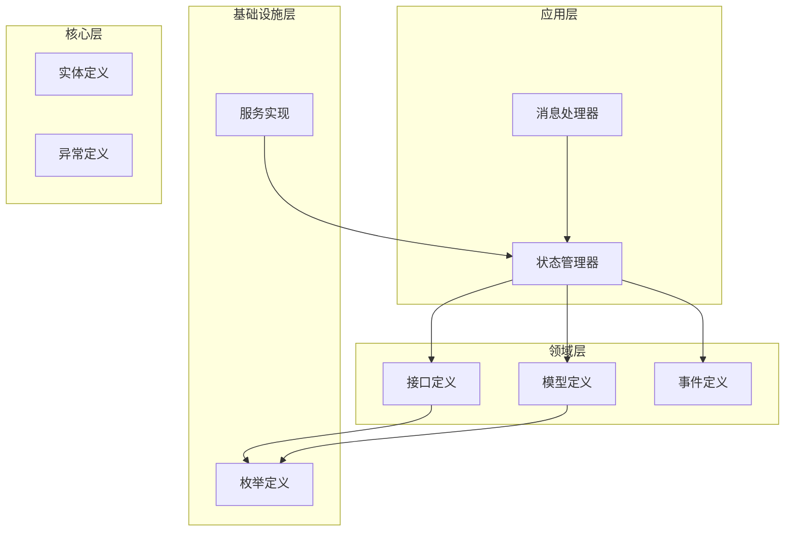

**图表来源**
- [GemStateManager.cs:1-492](file://WebGem/SECS2GEM/Application/State/GemStateManager.cs#L1-492)
- [IGemState.cs:1-166](file://WebGem/SECS2GEM/Domain/Interfaces/IGemState.cs#L1-166)

**章节来源**
- [GemStateManager.cs:1-492](file://WebGem/SECS2GEM/Application/State/GemStateManager.cs#L1-492)
- [IGemState.cs:1-166](file://WebGem/SECS2GEM/Domain/Interfaces/IGemState.cs#L1-166)

## 核心组件

### 控制状态枚举定义

控制状态模型基于SEMI E30标准定义，包含以下状态：

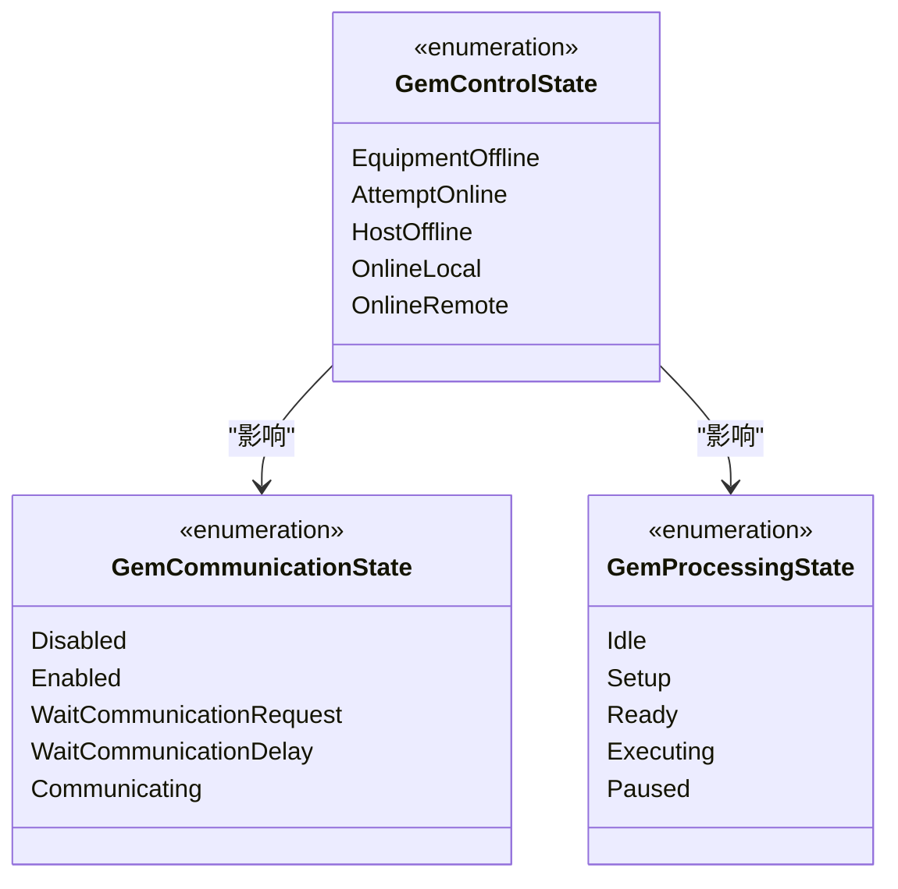

**图表来源**
- [GemStates.cs:50-81](file://WebGem/SECS2GEM/Core/Enums/GemStates.cs#L50-81)

### 状态管理接口

IGemState接口定义了完整的状态管理能力：

- **状态属性访问**：提供通信状态、控制状态、处理状态的只读访问
- **状态变量管理**：支持状态变量的注册、查询和设置
- **设备常量管理**：支持设备常量的注册、查询和设置
- **状态转换控制**：提供请求上线/离线、切换控制模式等操作

**章节来源**
- [IGemState.cs:20-166](file://WebGem/SECS2GEM/Domain/Interfaces/IGemState.cs#L20-166)

## 架构概览

### 状态管理架构

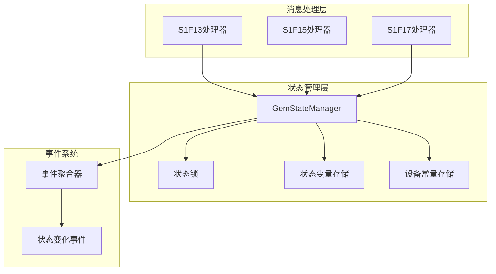

**图表来源**
- [GemStateManager.cs:22-94](file://WebGem/SECS2GEM/Application/State/GemStateManager.cs#L22-94)
- [EventAggregator.cs:17-219](file://WebGem/SECS2GEM/Infrastructure/Services/EventAggregator.cs#L17-219)

### 控制状态转换流程

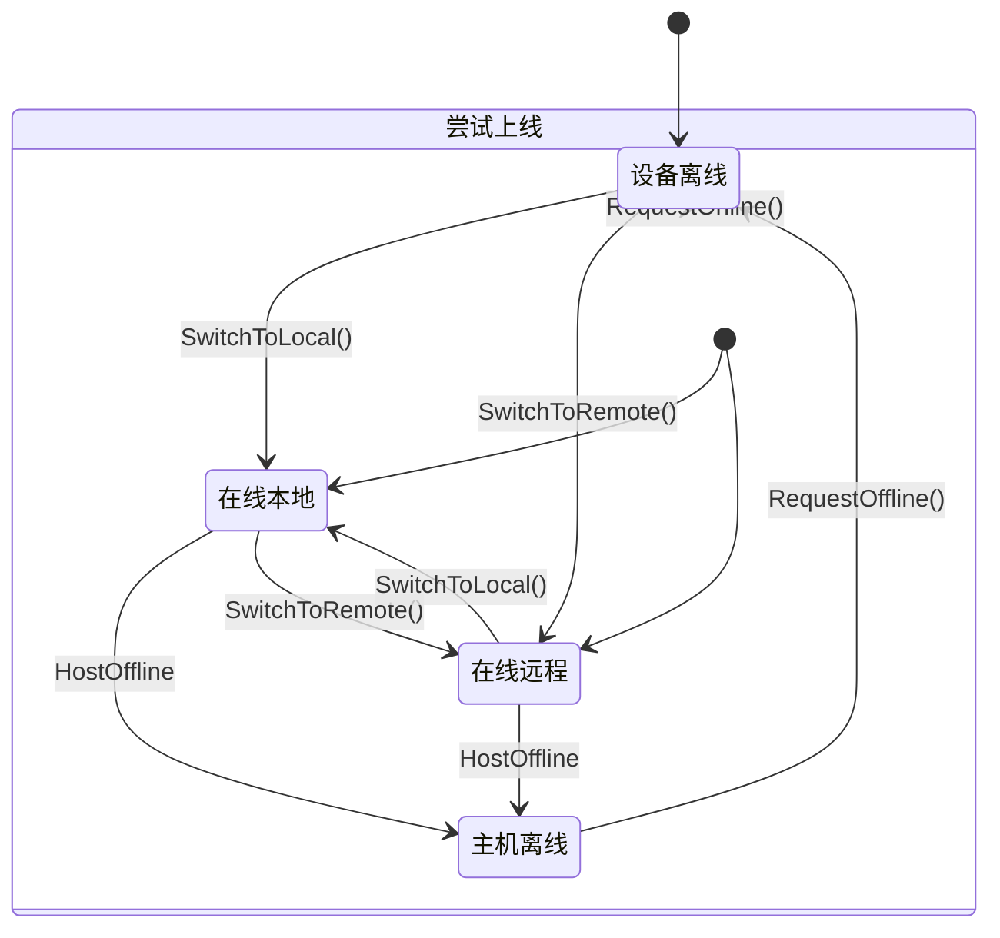

**图表来源**
- [GemStateManager.cs:392-420](file://WebGem/SECS2GEM/Application/State/GemStateManager.cs#L392-420)

## 详细组件分析

### GemStateManager实现

GemStateManager是状态管理的核心实现，采用状态模式设计：

#### 状态属性管理

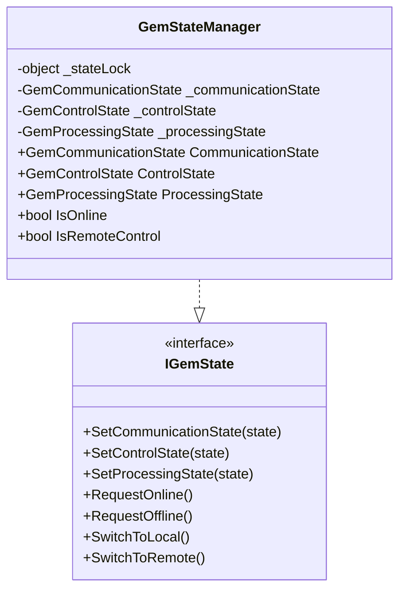

**图表来源**
- [GemStateManager.cs:22-107](file://WebGem/SECS2GEM/Application/State/GemStateManager.cs#L22-107)

#### 状态转换验证机制

状态转换通过严格的验证逻辑确保协议合规性：

**通信状态转换验证**：
- 支持Disabled ↔ Enabled双向转换
- 支持WaitCommunicationRequest状态下的多种分支
- 支持WaitCommunicationDelay的回退机制
- Communicating状态可回到任意状态

**控制状态转换验证**：
- EquipmentOffline只能进入AttemptOnline
- AttemptOnline可进入LOCAL或REMOTE或回到EquipmentOffline
- OnlineLocal和OnlineRemote可在两者间切换
- HostOffline只能从在线状态进入

**处理状态转换验证**：
- Idle状态可进入Setup或Ready
- Setup完成后必须进入Ready
- Executing状态支持暂停和完成
- Paused状态支持恢复执行

**章节来源**
- [GemStateManager.cs:352-455](file://WebGem/SECS2GEM/Application/State/GemStateManager.cs#L352-455)

### 消息处理器实现

#### S1F13/S1F14 建立通信流程

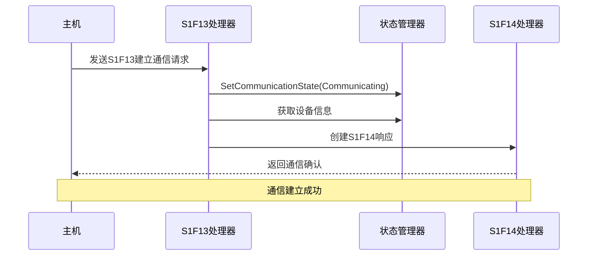

**图表来源**
- [StreamOneHandlers.cs:122-149](file://WebGem/SECS2GEM/Application/Handlers/StreamOneHandlers.cs#L122-149)

#### S1F15/S1F16 离线流程

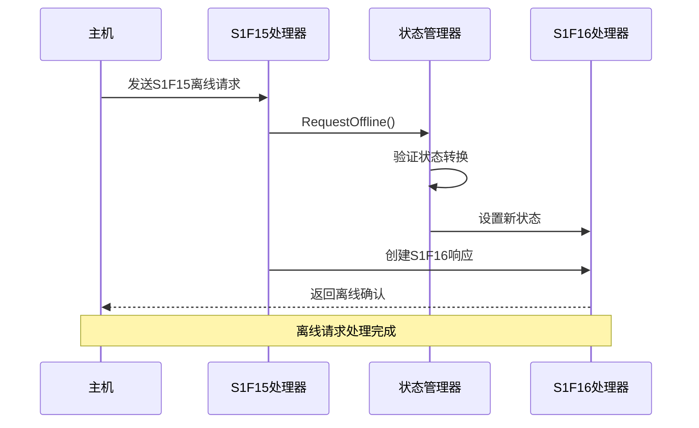

**图表来源**
- [StreamOneHandlers.cs:154-174](file://WebGem/SECS2GEM/Application/Handlers/StreamOneHandlers.cs#L154-174)

#### S1F17/S1F18 上线流程

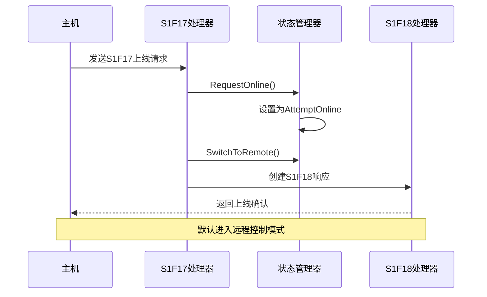

**图表来源**
- [StreamOneHandlers.cs:179-209](file://WebGem/SECS2GEM/Application/Handlers/StreamOneHandlers.cs#L179-209)

### 事件系统集成

状态变化通过事件系统通知订阅者：

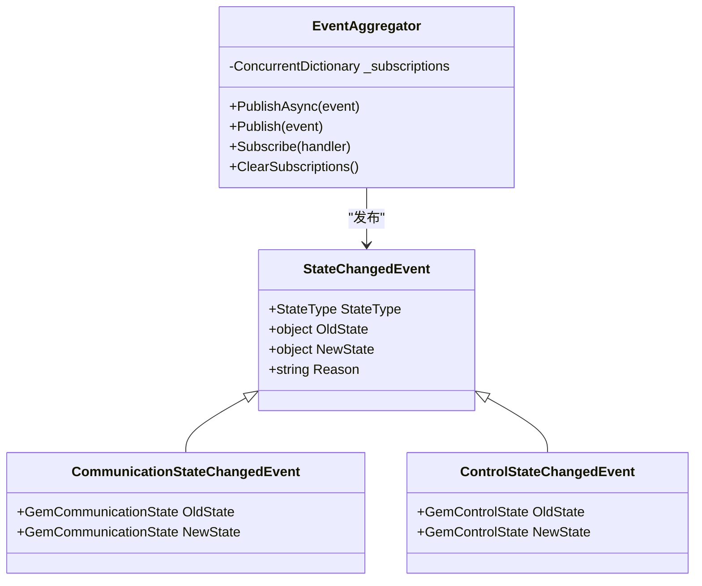

**图表来源**
- [EventAggregator.cs:17-219](file://WebGem/SECS2GEM/Infrastructure/Services/EventAggregator.cs#L17-219)
- [StateChangedEvent.cs:11-109](file://WebGem/SECS2GEM/Domain/Events/StateChangedEvent.cs#L11-109)

**章节来源**
- [StateChangedEvent.cs:1-110](file://WebGem/SECS2GEM/Domain/Events/StateChangedEvent.cs#L1-110)
- [EventAggregator.cs:1-219](file://WebGem/SECS2GEM/Infrastructure/Services/EventAggregator.cs#L1-219)

## 依赖关系分析

### 状态模型依赖关系

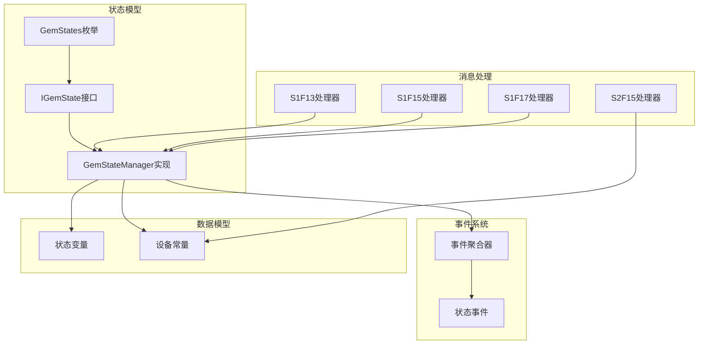

**图表来源**
- [GemStateManager.cs:1-492](file://WebGem/SECS2GEM/Application/State/GemStateManager.cs#L1-492)
- [StreamOneHandlers.cs:1-211](file://WebGem/SECS2GEM/Application/Handlers/StreamOneHandlers.cs#L1-211)
- [StreamTwoHandlers.cs:1-331](file://WebGem/SECS2GEM/Application/Handlers/StreamTwoHandlers.cs#L1-331)

### 控制状态与通信状态关系

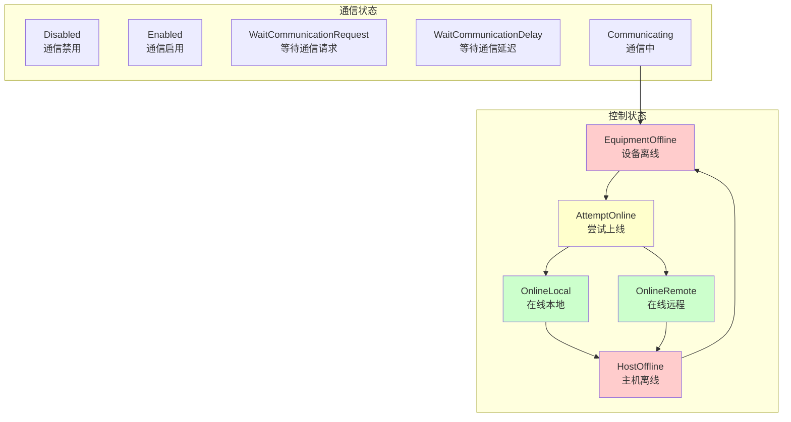

**图表来源**
- [GemStateManager.cs:213-218](file://WebGem/SECS2GEM/Application/State/GemStateManager.cs#L213-218)
- [GemStates.cs:10-41](file://WebGem/SECS2GEM/Core/Enums/GemStates.cs#L10-41)

**章节来源**
- [GemStateManager.cs:196-350](file://WebGem/SECS2GEM/Application/State/GemStateManager.cs#L196-350)

## 性能考虑

### 并发安全性

状态管理器使用双重保护机制确保线程安全：

1. **状态锁保护**：所有状态读写操作都通过_lock对象保护
2. **并发数据结构**：状态变量和设备常量使用ConcurrentDictionary
3. **原子操作**：状态转换验证和设置都是原子操作

### 事件处理优化

事件聚合器采用异步处理机制：

- **异步事件发布**：支持异步处理器的并行执行
- **异常隔离**：单个订阅者的异常不会影响其他订阅者
- **内存效率**：使用ConcurrentDictionary减少内存分配

## 故障排除指南

### 常见状态转换错误

1. **无效的控制状态转换**
   - 现象：RequestOnline()返回false
   - 原因：通信状态不是Communicating
   - 解决：先建立通信连接再请求上线

2. **离线请求失败**
   - 现象：RequestOffline()返回false
   - 原因：当前状态不是在线状态
   - 解决：检查当前控制状态

3. **控制模式切换失败**
   - 现象：SwitchToLocal()/SwitchToRemote()返回false
   - 原因：当前状态不允许切换
   - 解决：先切换到在线状态

### 调试建议

1. **启用事件监听**：订阅ControlStateChanged事件跟踪状态变化
2. **检查通信状态**：确保通信状态为Communicating
3. **验证状态转换**：使用IsValidControlTransition方法预验证

**章节来源**
- [GemStateManager.cs:392-420](file://WebGem/SECS2GEM/Application/State/GemStateManager.cs#L392-420)

## 结论

GEM控制状态模型通过严谨的状态机设计实现了设备控制的规范化管理。该实现具有以下特点：

1. **协议合规性**：完全符合SEMI E30标准要求
2. **状态一致性**：通过严格的转换验证确保状态一致性
3. **事件驱动**：基于事件系统实现松耦合的状态通知
4. **并发安全**：采用多重保护机制确保线程安全
5. **扩展性**：清晰的接口设计便于功能扩展

该状态模型为设备管理系统提供了可靠的控制基础，开发者可以根据具体需求在此基础上扩展更多的控制功能和业务逻辑。