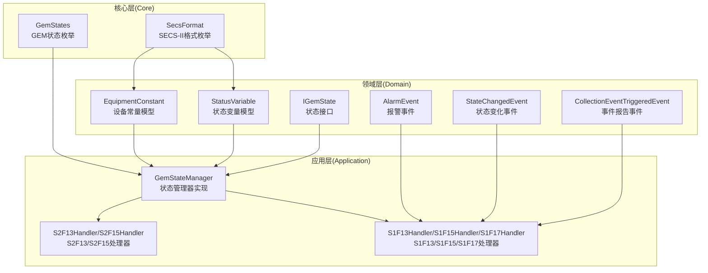
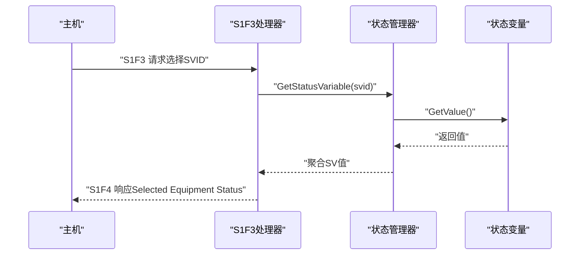
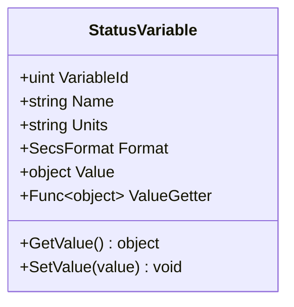
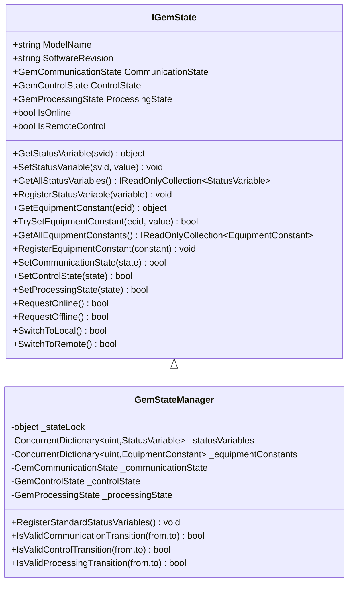
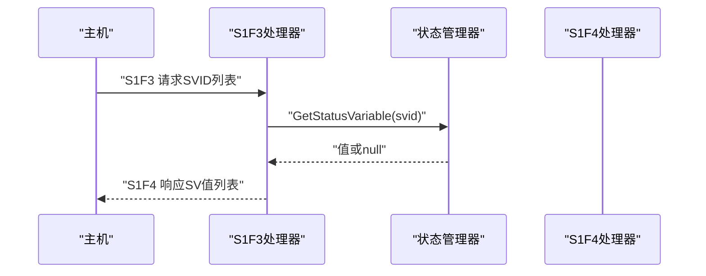
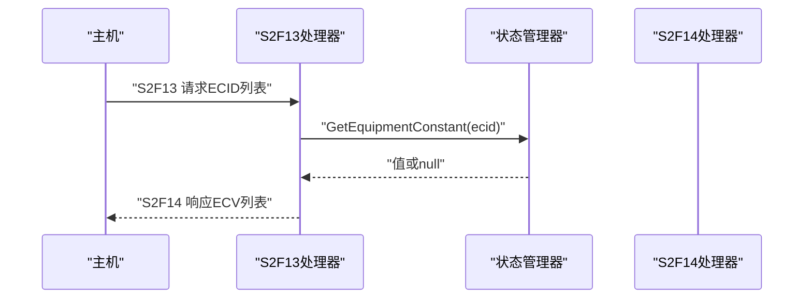
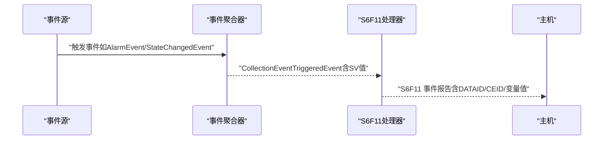
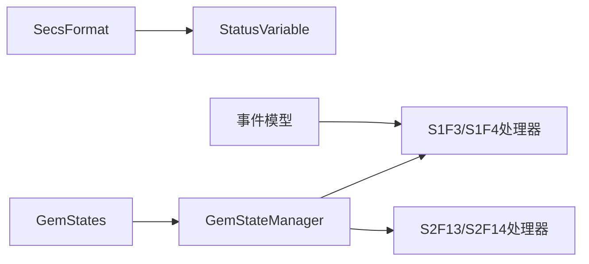

# 状态变量系统

<cite>
**本文引用的文件**
- [StatusVariable.cs](file://WebGem/SECS2GEM/Domain/Models/StatusVariable.cs)
- [IGemState.cs](file://WebGem/SECS2GEM/Domain/Interfaces/IGemState.cs)
- [GemStateManager.cs](file://WebGem/SECS2GEM/Application/State/GemStateManager.cs)
- [GemStates.cs](file://WebGem/SECS2GEM/Core/Enums/GemStates.cs)
- [SecsFormat.cs](file://WebGem/SECS2GEM/Core/Enums/SecsFormat.cs)
- [StreamOneHandlers.cs](file://WebGem/SECS2GEM/Application/Handlers/StreamOneHandlers.cs)
- [StreamTwoHandlers.cs](file://WebGem/SECS2GEM/Application/Handlers/StreamTwoHandlers.cs)
- [GEM_Protocol_Specification.md](file://WebGem/SECS2GEM/GEM_Protocol_Specification.md)
- [AlarmEvent.cs](file://WebGem/SECS2GEM/Domain/Events/AlarmEvent.cs)
- [StateChangedEvent.cs](file://WebGem/SECS2GEM/Domain/Events/StateChangedEvent.cs)
- [collectionEventTriggeredEvent.cs](file://WebGem/SECS2GEM/Domain/Events/CollectionEventTriggeredEvent.cs)
- [EquipmentConstant.cs](file://WebGem/SECS2GEM/Domain/Models/EquipmentConstant.cs)
</cite>

## 目录
1. [简介](#简介)
2. [项目结构](#项目结构)
3. [核心组件](#核心组件)
4. [架构总览](#架构总览)
5. [详细组件分析](#详细组件分析)
6. [依赖关系分析](#依赖关系分析)
7. [性能考虑](#性能考虑)
8. [故障排查指南](#故障排查指南)
9. [结论](#结论)
10. [附录](#附录)

## 简介
本文件系统性阐述GEM状态变量系统的设计与实现，覆盖状态变量的概念与分类（设备状态、工艺参数、报警状态等）、StatusVariable模型的数据结构与行为、状态变量的定义、注册与查询机制、在S1F3/S1F4消息中的应用、实时监控与历史数据记录方法，并给出命名规范、数据类型选择与性能优化建议，以及实际应用场景示例。

## 项目结构
围绕状态变量系统的关键代码分布在以下层次：
- Domain层：定义状态变量模型、设备常量模型、状态接口与事件模型
- Application层：状态管理器实现、消息处理器（S1F3/S1F4等）
- Core层：GEM状态枚举、SECS-II数据格式枚举
- 协议文档：GEM协议规范，明确S1F3/S1F4等消息用途与格式

**图表来源**
- [StatusVariable.cs:12-60](file://WebGem/SECS2GEM/Domain/Models/StatusVariable.cs#L12-L60)
- [EquipmentConstant.cs:12-122](file://WebGem/SECS2GEM/Domain/Models/EquipmentConstant.cs#L12-L122)
- [IGemState.cs:20-166](file://WebGem/SECS2GEM/Domain/Interfaces/IGemState.cs#L20-L166)
- [GemStateManager.cs:22-492](file://WebGem/SECS2GEM/Application/State/GemStateManager.cs#L22-L492)
- [GemStates.cs:10-176](file://WebGem/SECS2GEM/Core/Enums/GemStates.cs#L10-L176)
- [SecsFormat.cs:13-112](file://WebGem/SECS2GEM/Core/Enums/SecsFormat.cs#L13-L112)
- [StreamOneHandlers.cs:116-211](file://WebGem/SECS2GEM/Application/Handlers/StreamOneHandlers.cs#L116-L211)
- [StreamTwoHandlers.cs:13-138](file://WebGem/SECS2GEM/Application/Handlers/StreamTwoHandlers.cs#L13-L138)

**章节来源**
- [StatusVariable.cs:1-61](file://WebGem/SECS2GEM/Domain/Models/StatusVariable.cs#L1-L61)
- [IGemState.cs:1-166](file://WebGem/SECS2GEM/Domain/Interfaces/IGemState.cs#L1-L166)
- [GemStateManager.cs:1-492](file://WebGem/SECS2GEM/Application/State/GemStateManager.cs#L1-L492)
- [GemStates.cs:1-176](file://WebGem/SECS2GEM/Core/Enums/GemStates.cs#L1-L176)
- [SecsFormat.cs:1-112](file://WebGem/SECS2GEM/Core/Enums/SecsFormat.cs#L1-L112)
- [StreamOneHandlers.cs:1-211](file://WebGem/SECS2GEM/Application/Handlers/StreamOneHandlers.cs#L1-L211)
- [StreamTwoHandlers.cs:1-331](file://WebGem/SECS2GEM/Application/Handlers/StreamTwoHandlers.cs#L1-L331)

## 核心组件
- 状态变量模型（StatusVariable）
  - 字段：变量ID（SVID）、名称（SVNAME）、单位、数据格式（SecsFormat）、当前值、值获取器（可选动态值）
  - 行为：GetValue/SetValue，支持静态值或动态委托获取
- 状态接口（IGemState）
  - 提供状态变量的注册、查询、枚举能力；提供设备常量（EC）管理；封装GEM三态（通信/控制/处理）及其转换
- 状态管理器（GemStateManager）
  - 实现IGemState，内部以并发字典维护SV/EC集合；提供标准状态变量注册（如时钟、控制状态等）；提供状态转换验证与事件发布
- 协议与消息处理
  - S1F3/S1F4：主机查询/设备响应状态变量
  - S2F13/S2F14：设备常量查询/响应
  - S6F11：事件报告（包含状态变量值）

**章节来源**
- [StatusVariable.cs:12-60](file://WebGem/SECS2GEM/Domain/Models/StatusVariable.cs#L12-L60)
- [IGemState.cs:20-166](file://WebGem/SECS2GEM/Domain/Interfaces/IGemState.cs#L20-L166)
- [GemStateManager.cs:22-492](file://WebGem/SECS2GEM/Application/State/GemStateManager.cs#L22-L492)
- [StreamOneHandlers.cs:116-211](file://WebGem/SECS2GEM/Application/Handlers/StreamOneHandlers.cs#L116-L211)
- [StreamTwoHandlers.cs:13-138](file://WebGem/SECS2GEM/Application/Handlers/StreamTwoHandlers.cs#L13-L138)

## 架构总览
状态变量系统遵循分层设计：领域层定义模型与接口，应用层实现状态管理与消息处理，核心层提供枚举与格式定义。状态变量通过S1F3/S1F4查询，通过S6F11事件报告上报，同时与设备常量（EC）协同工作。

**图表来源**
- [StreamOneHandlers.cs:116-211](file://WebGem/SECS2GEM/Application/Handlers/StreamOneHandlers.cs#L116-L211)
- [GemStateManager.cs:114-132](file://WebGem/SECS2GEM/Application/State/GemStateManager.cs#L114-L132)
- [StatusVariable.cs:47-58](file://WebGem/SECS2GEM/Domain/Models/StatusVariable.cs#L47-L58)

## 详细组件分析

### 状态变量模型（StatusVariable）
- 设计要点
  - 支持静态值与动态值（ValueGetter），便于实时计算（如当前时间）
  - 使用SecsFormat描述数据编码格式，确保序列化一致性
  - Name/Units/Format构成标准元数据，便于S1F11/S1F12名称列表查询
- 数据结构复杂度
  - GetValue/SetValue均为O(1)
  - ValueGetter委托调用为O(1)，注意避免阻塞与高成本计算
- 错误处理
  - ValueGetter返回null时，GetValue返回null
  - 建议在委托中捕获异常并返回默认值或标记

**图表来源**
- [StatusVariable.cs:12-60](file://WebGem/SECS2GEM/Domain/Models/StatusVariable.cs#L12-L60)

**章节来源**
- [StatusVariable.cs:12-60](file://WebGem/SECS2GEM/Domain/Models/StatusVariable.cs#L12-L60)
- [SecsFormat.cs:13-112](file://WebGem/SECS2GEM/Core/Enums/SecsFormat.cs#L13-L112)

### 状态接口与状态管理器（IGemState/GemStateManager）
- 角色分工
  - IGemState：对外暴露状态变量与设备常量的统一访问接口
  - GemStateManager：内部实现，负责并发安全、状态转换验证、标准SV注册
- 并发与线程安全
  - 使用锁保护状态字段；使用并发字典存储SV/EC
- 标准状态变量
  - 内置时钟（SVID=1）与控制状态（SVID=2）等，便于快速接入
- 状态转换
  - 通信/控制/处理三态均有严格的转换规则，防止非法状态迁移

**图表来源**
- [IGemState.cs:20-166](file://WebGem/SECS2GEM/Domain/Interfaces/IGemState.cs#L20-L166)
- [GemStateManager.cs:22-492](file://WebGem/SECS2GEM/Application/State/GemStateManager.cs#L22-L492)

**章节来源**
- [IGemState.cs:20-166](file://WebGem/SECS2GEM/Domain/Interfaces/IGemState.cs#L20-L166)
- [GemStateManager.cs:22-492](file://WebGem/SECS2GEM/Application/State/GemStateManager.cs#L22-L492)

### S1F3/S1F4状态变量查询与响应
- 流程
  - 主机发送S1F3，携带所选SVID列表
  - 设备端解析请求，调用状态管理器查询对应SV值
  - 设备返回S1F4，包含对应SV值列表
- 编码与格式
  - SV值根据其SecsFormat进行编码，确保与协议一致
- 错误处理
  - 不存在的SVID返回空值或跳过，避免中断响应

**图表来源**
- [StreamOneHandlers.cs:116-211](file://WebGem/SECS2GEM/Application/Handlers/StreamOneHandlers.cs#L116-L211)
- [GemStateManager.cs:114-132](file://WebGem/SECS2GEM/Application/State/GemStateManager.cs#L114-L132)

**章节来源**
- [StreamOneHandlers.cs:116-211](file://WebGem/SECS2GEM/Application/Handlers/StreamOneHandlers.cs#L116-L211)
- [GEM_Protocol_Specification.md:758-759](file://WebGem/SECS2GEM/GEM_Protocol_Specification.md#L758-L759)

### 设备常量（EC）与S2F13/S2F14
- EC用于配置设备参数，支持查询与设置
- S2F13：查询EC值；S2F14：返回ECV列表
- EC模型支持默认值、最小/最大值约束、只读属性与变更回调

**图表来源**
- [StreamTwoHandlers.cs:13-78](file://WebGem/SECS2GEM/Application/Handlers/StreamTwoHandlers.cs#L13-L78)
- [EquipmentConstant.cs:12-122](file://WebGem/SECS2GEM/Domain/Models/EquipmentConstant.cs#L12-L122)

**章节来源**
- [StreamTwoHandlers.cs:13-78](file://WebGem/SECS2GEM/Application/Handlers/StreamTwoHandlers.cs#L13-L78)
- [EquipmentConstant.cs:12-122](file://WebGem/SECS2GEM/Domain/Models/EquipmentConstant.cs#L12-L122)

### 事件报告（S6F11）与状态变量
- S6F11用于事件驱动的数据上报，可包含状态变量值
- 事件报告事件模型包含DATAID、CEID、事件名与报告数据（含变量值列表）
- 报警事件（S5F1）与状态变化事件（S1F15/S1F17）可触发事件报告

**图表来源**
- [collectionEventTriggeredEvent.cs:9-101](file://WebGem/SECS2GEM/Domain/Events/CollectionEventTriggeredEvent.cs#L9-L101)
- [AlarmEvent.cs:12-57](file://WebGem/SECS2GEM/Domain/Events/AlarmEvent.cs#L12-L57)
- [StateChangedEvent.cs:11-110](file://WebGem/SECS2GEM/Domain/Events/StateChangedEvent.cs#L11-L110)

**章节来源**
- [collectionEventTriggeredEvent.cs:9-101](file://WebGem/SECS2GEM/Domain/Events/CollectionEventTriggeredEvent.cs#L9-L101)
- [AlarmEvent.cs:12-57](file://WebGem/SECS2GEM/Domain/Events/AlarmEvent.cs#L12-L57)
- [StateChangedEvent.cs:11-110](file://WebGem/SECS2GEM/Domain/Events/StateChangedEvent.cs#L11-L110)

### 状态变量的定义、注册与查询机制
- 定义
  - 通过构造StatusVariable对象，设置VariableId/Name/Units/Format/Value/ValueGetter
- 注册
  - 通过IGemState.RegisterStatusVariable或状态管理器的RegisterStandardStatusVariables
- 查询
  - 通过GetStatusVariable(svid)获取值；GetValue内部优先调用ValueGetter
- 设备常量（EC）对比
  - EC侧重配置参数，SV侧重运行时状态；两者均支持查询与动态更新

**章节来源**
- [StatusVariable.cs:12-60](file://WebGem/SECS2GEM/Domain/Models/StatusVariable.cs#L12-L60)
- [IGemState.cs:89-92](file://WebGem/SECS2GEM/Domain/Interfaces/IGemState.cs#L89-L92)
- [GemStateManager.cs:145-148](file://WebGem/SECS2GEM/Application/State/GemStateManager.cs#L145-L148)

### 状态变量的实时监控与历史记录
- 实时监控
  - 通过S1F3周期性查询或S6F11事件驱动上报
  - 使用ValueGetter实现动态值（如时间戳、实时传感器值）
- 历史记录
  - 建议在应用层维护时间序列存储，结合事件触发与定时采样
  - 记录DATAID/CEID/变量值与时间戳，便于回溯与报表生成

[本节为通用实践建议，无需代码来源]

### 命名规范、数据类型选择与性能优化
- 命名规范
  - SVID唯一且语义清晰；Name采用驼峰或下划线风格；Units遵循国际标准或行业约定
- 数据类型选择
  - 数值型使用I1/I2/I4/U1/U2/U4/F4/F8；布尔使用Boolean；文本使用ASCII/JIS8/Unicode；二进制使用Binary
  - 优先选择最紧凑的格式以降低带宽占用
- 性能优化
  - ValueGetter避免高成本计算与IO；必要时缓存结果并在变更时刷新
  - 并发访问使用状态管理器提供的并发容器；减少锁粒度
  - 批量查询（S1F3）时合并请求，避免多次往返

**章节来源**
- [SecsFormat.cs:13-112](file://WebGem/SECS2GEM/Core/Enums/SecsFormat.cs#L13-L112)
- [GemStateManager.cs:24-27](file://WebGem/SECS2GEM/Application/State/GemStateManager.cs#L24-L27)

## 依赖关系分析
- 状态变量依赖SECS-II格式枚举进行序列化
- 状态管理器依赖GEM状态枚举进行状态转换验证
- 消息处理器依赖状态管理器提供查询与设置能力
- 事件模型与状态管理器解耦，通过事件聚合器触发S6F11上报

**图表来源**
- [SecsFormat.cs:13-112](file://WebGem/SECS2GEM/Core/Enums/SecsFormat.cs#L13-L112)
- [GemStates.cs:10-176](file://WebGem/SECS2GEM/Core/Enums/GemStates.cs#L10-L176)
- [GemStateManager.cs:22-492](file://WebGem/SECS2GEM/Application/State/GemStateManager.cs#L22-L492)
- [StreamOneHandlers.cs:116-211](file://WebGem/SECS2GEM/Application/Handlers/StreamOneHandlers.cs#L116-L211)
- [StreamTwoHandlers.cs:13-138](file://WebGem/SECS2GEM/Application/Handlers/StreamTwoHandlers.cs#L13-L138)

**章节来源**
- [GemStateManager.cs:22-492](file://WebGem/SECS2GEM/Application/State/GemStateManager.cs#L22-L492)
- [GemStates.cs:10-176](file://WebGem/SECS2GEM/Core/Enums/GemStates.cs#L10-L176)
- [SecsFormat.cs:13-112](file://WebGem/SECS2GEM/Core/Enums/SecsFormat.cs#L13-L112)

## 性能考虑
- 查询路径
  - GetStatusVariable为O(1)查找；GetValue为O(1)委托调用
- 并发
  - 状态字段加锁；SV/EC使用并发字典；避免在ValueGetter中进行长耗时操作
- 序列化
  - 选择合适SecsFormat，避免冗余编码；批量响应时合并列表
- 事件上报
  - 事件聚合器异步处理，避免阻塞消息处理线程

[本节为通用指导，无需代码来源]

## 故障排查指南
- S1F3查询无响应
  - 检查SVID是否已注册；确认状态管理器是否正确返回值
- S1F4格式错误
  - 检查StatusVariable.Format与实际值类型是否匹配
- 状态转换失败
  - 核对状态管理器的转换验证逻辑；确认当前状态与目标状态是否允许转换
- 事件未上报
  - 检查事件聚合器是否触发；确认S6F11处理器是否正确构造响应

**章节来源**
- [GemStateManager.cs:357-455](file://WebGem/SECS2GEM/Application/State/GemStateManager.cs#L357-L455)
- [StreamOneHandlers.cs:116-211](file://WebGem/SECS2GEM/Application/Handlers/StreamOneHandlers.cs#L116-L211)
- [collectionEventTriggeredEvent.cs:9-101](file://WebGem/SECS2GEM/Domain/Events/CollectionEventTriggeredEvent.cs#L9-L101)

## 结论
状态变量系统通过清晰的模型与接口、严谨的状态转换与并发控制、完善的协议适配，实现了对设备运行状态的高效管理与上报。结合设备常量（EC）与事件报告（S6F11），可满足从实时监控到历史分析的全场景需求。建议在实际部署中严格遵循命名与格式规范，关注性能与可靠性，持续优化ValueGetter与事件上报策略。

## 附录
- 实际应用场景示例
  - 实时监控：每秒通过S1F3查询关键SV（如温度、压力），并以S6F11事件上报
  - 历史记录：基于事件聚合器收集SV值，写入时间序列数据库
  - 远程诊断：主机通过S1F3/S1F4批量查询多SVID，结合报警事件定位问题

[本节为概念性内容，无需代码来源]