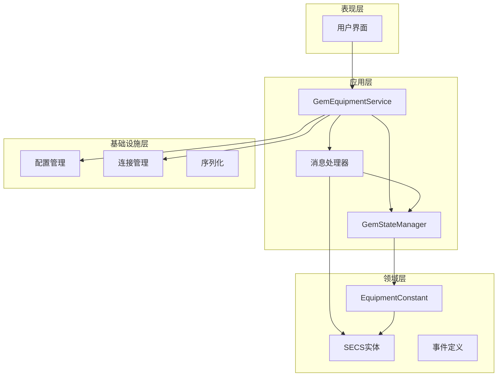
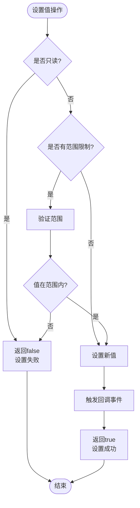
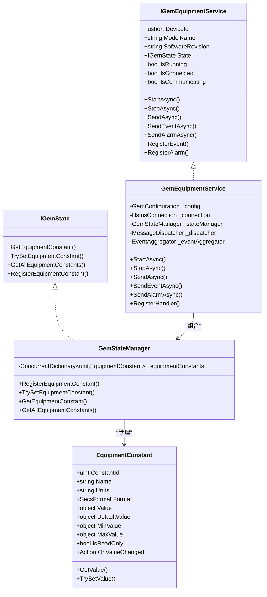
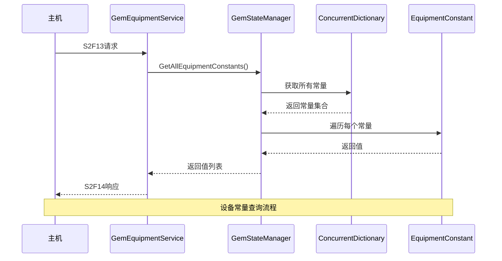
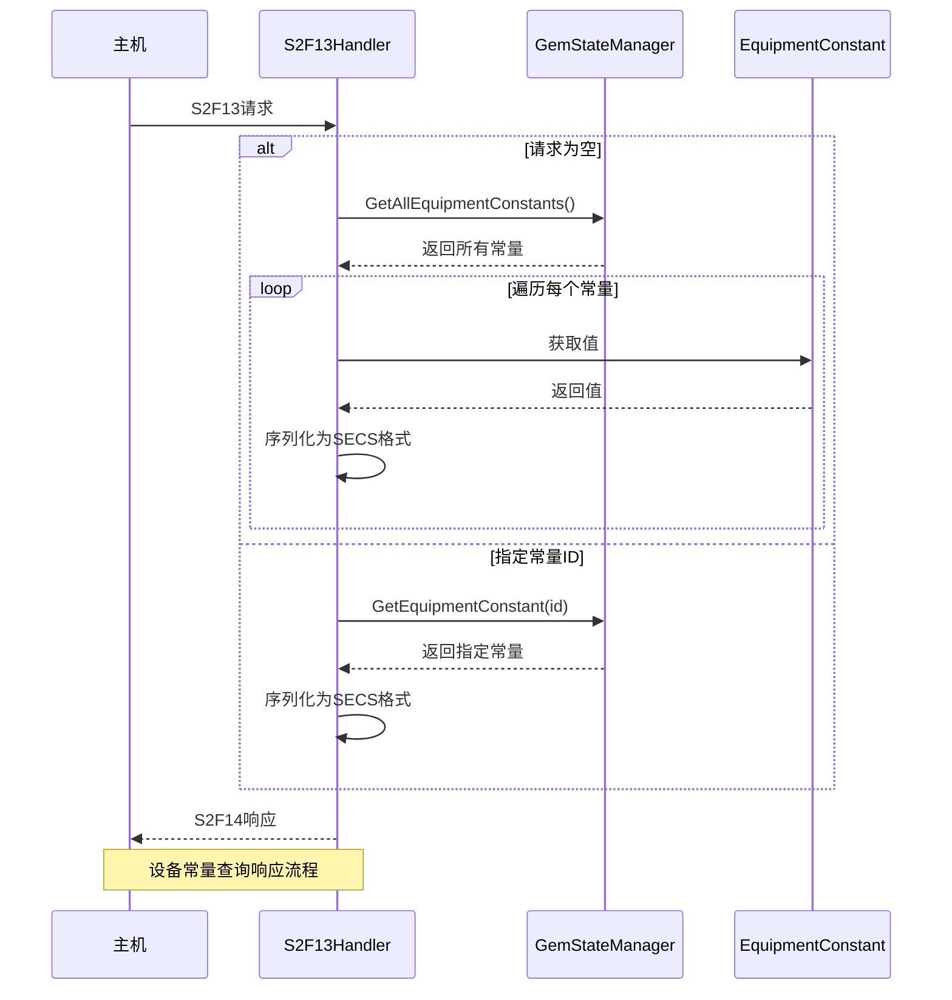
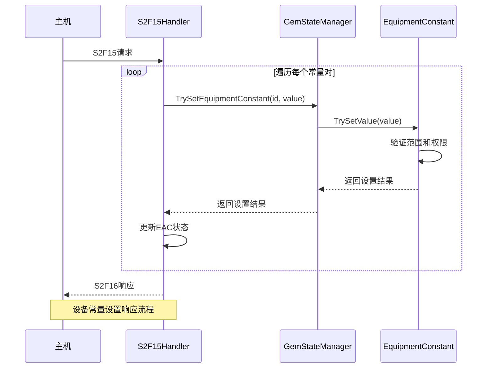
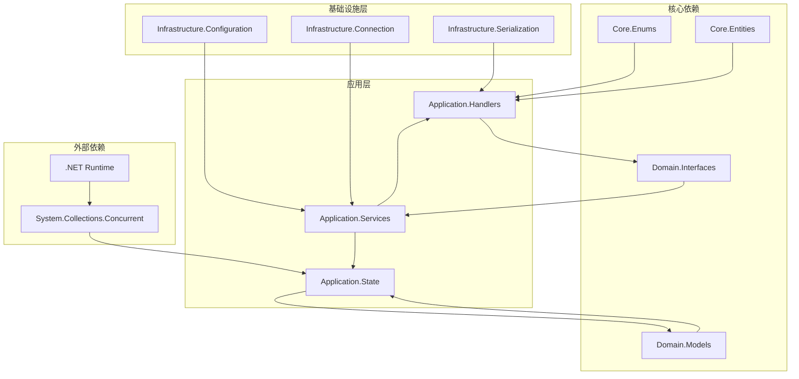

# 设备常量管理

<cite>
**本文档引用的文件**
- [EquipmentConstant.cs](file://WebGem/SECS2GEM/Domain/Models/EquipmentConstant.cs)
- [GemStateManager.cs](file://WebGem/SECS2GEM/Application/State/GemStateManager.cs)
- [IGemEquipmentService.cs](file://WebGem/SECS2GEM/Domain/Interfaces/IGemEquipmentService.cs)
- [GemEquipmentService.cs](file://WebGem/SECS2GEM/Application/Services/GemEquipmentService.cs)
- [StreamTwoHandlers.cs](file://WebGem/SECS2GEM/Application/Handlers/StreamTwoHandlers.cs)
- [StreamOneHandlers.cs](file://WebGem/SECS2GEM/Application/Handlers/StreamOneHandlers.cs)
- [SecsFormat.cs](file://WebGem/SECS2GEM/Core/Enums/SecsFormat.cs)
- [HsmsConfiguration.cs](file://WebGem/SECS2GEM/Infrastructure/Configuration/HsmsConfiguration.cs)
- [GemStateManagerTests.cs](file://WebGem/SECS2GEM.Tests/GemStateManagerTests.cs)
- [IntegrationTests.cs](file://WebGem/SECS2GEM.Tests/IntegrationTests.cs)
</cite>

## 目录
1. [简介](#简介)
2. [项目结构](#项目结构)
3. [核心组件](#核心组件)
4. [架构概览](#架构概览)
5. [详细组件分析](#详细组件分析)
6. [依赖关系分析](#依赖关系分析)
7. [性能考虑](#性能考虑)
8. [故障排除指南](#故障排除指南)
9. [结论](#结论)
10. [附录](#附录)

## 简介

设备常量管理系统是GEM（Generic Equipment Model）协议实现中的关键组件，负责管理和维护设备的静态配置参数。该系统支持设备标识、型号、软件版本、序列号等静态信息的存储和查询，为设备与主机之间的通信提供基础配置数据。

在SEMI GEM标准中，设备常量（Equipment Constant, EC）是设备端的静态配置参数，通过S2F13/S2F14查询接口和S2F15/S2F16设置接口进行管理。系统采用面向对象设计，提供了完整的生命周期管理、数据验证和事件通知机制。

## 项目结构

GEM设备常量管理系统采用分层架构设计，主要包含以下层次：



**图表来源**
- [GemEquipmentService.cs:1-456](file://WebGem/SECS2GEM/Application/Services/GemEquipmentService.cs#L1-L456)
- [GemStateManager.cs:1-492](file://WebGem/SECS2GEM/Application/State/GemStateManager.cs#L1-L492)
- [EquipmentConstant.cs:1-122](file://WebGem/SECS2GEM/Domain/Models/EquipmentConstant.cs#L1-L122)

**章节来源**
- [GemEquipmentService.cs:1-456](file://WebGem/SECS2GEM/Application/Services/GemEquipmentService.cs#L1-L456)
- [GemStateManager.cs:1-492](file://WebGem/SECS2GEM/Application/State/GemStateManager.cs#L1-L492)

## 核心组件

### EquipmentConstant模型设计

EquipmentConstant是设备常量的核心数据模型，采用密封类设计确保不可继承性，提供完整的配置参数管理功能。

#### 关键属性定义

| 属性名 | 类型 | 描述 | 默认值 |
|--------|------|------|--------|
| ConstantId | uint | 设备常量ID (ECID) | 0 |
| Name | string | 常量名称 (ECNAME) | 空字符串 |
| Units | string | 常量单位 | 空字符串 |
| Format | SecsFormat | 数据格式 | ASCII |
| Value | object? | 当前值 | null |
| DefaultValue | object? | 默认值 | null |
| MinValue | object? | 最小值 | null |
| MaxValue | object? | 最大值 | null |
| IsReadOnly | bool | 是否只读 | false |
| OnValueChanged | Action? | 值变化回调 | null |

#### 数据验证机制

系统实现了智能的数据范围验证，支持数值类型的最小值和最大值检查：



**图表来源**
- [EquipmentConstant.cs:76-96](file://WebGem/SECS2GEM/Domain/Models/EquipmentConstant.cs#L76-L96)

**章节来源**
- [EquipmentConstant.cs:1-122](file://WebGem/SECS2GEM/Domain/Models/EquipmentConstant.cs#L1-L122)
- [SecsFormat.cs:1-112](file://WebGem/SECS2GEM/Core/Enums/SecsFormat.cs#L1-L112)

## 架构概览

设备常量管理系统采用外观模式（Facade Pattern），为复杂的GEM子系统提供统一的访问入口：



**图表来源**
- [IGemEquipmentService.cs:1-160](file://WebGem/SECS2GEM/Domain/Interfaces/IGemEquipmentService.cs#L1-L160)
- [GemEquipmentService.cs:1-456](file://WebGem/SECS2GEM/Application/Services/GemEquipmentService.cs#L1-L456)
- [GemStateManager.cs:1-492](file://WebGem/SECS2GEM/Application/State/GemStateManager.cs#L1-L492)
- [EquipmentConstant.cs:1-122](file://WebGem/SECS2GEM/Domain/Models/EquipmentConstant.cs#L1-L122)

**章节来源**
- [IGemEquipmentService.cs:1-160](file://WebGem/SECS2GEM/Domain/Interfaces/IGemEquipmentService.cs#L1-L160)
- [GemEquipmentService.cs:1-456](file://WebGem/SECS2GEM/Application/Services/GemEquipmentService.cs#L1-L456)

## 详细组件分析

### 设备常量存储机制

系统采用并发字典（ConcurrentDictionary）实现线程安全的设备常量存储：



**图表来源**
- [StreamTwoHandlers.cs:18-57](file://WebGem/SECS2GEM/Application/Handlers/StreamTwoHandlers.cs#L18-L57)
- [GemStateManager.cs:181-184](file://WebGem/SECS2GEM/Application/State/GemStateManager.cs#L181-L184)

#### 存储结构设计

- **并发安全性**: 使用ConcurrentDictionary确保多线程环境下的数据一致性
- **内存效率**: 采用字典索引，O(1)时间复杂度的查找性能
- **类型安全**: 泛型约束确保类型安全的常量存储

**章节来源**
- [GemStateManager.cs:26-27](file://WebGem/SECS2GEM/Application/State/GemStateManager.cs#L26-L27)
- [GemStateManager.cs:189-192](file://WebGem/SECS2GEM/Application/State/GemStateManager.cs#L189-L192)

### 设备常量配置方式

系统支持多种设备常量配置方式：

#### 1. 程序化配置

通过构造函数参数传递设备常量定义：

```csharp
// 示例：创建设备常量实例
var constant = new EquipmentConstant
{
    ConstantId = 100,
    Name = "TestConstant",
    Value = 42,
    MinValue = 0,
    MaxValue = 100,
    IsReadOnly = false
};
```

#### 2. 动态注册

运行时动态注册设备常量：

```csharp
// 注册设备常量
_stateManager.RegisterEquipmentConstant(constant);

// 查询设备常量
var value = _stateManager.GetEquipmentConstant(100);
```

#### 3. 配置文件集成

通过配置类集成设备常量定义：

```csharp
var config = new GemConfiguration
{
    ModelName = "DeviceModel",
    SoftwareRevision = "1.0.0",
    // 设备常量配置...
};
```

**章节来源**
- [GemStateManager.cs:189-192](file://WebGem/SECS2GEM/Application/State/GemStateManager.cs#L189-L192)
- [HsmsConfiguration.cs:233-264](file://WebGem/SECS2GEM/Infrastructure/Configuration/HsmsConfiguration.cs#L233-L264)

### 设备常量在消息处理中的应用

#### S2F13/S2F14 设备常量查询

设备常量查询采用批量处理机制，支持单个查询和批量查询：



**图表来源**
- [StreamTwoHandlers.cs:18-57](file://WebGem/SECS2GEM/Application/Handlers/StreamTwoHandlers.cs#L18-L57)

#### S2F15/S2F16 设备常量设置

设备常量设置采用原子操作，确保数据一致性：



**图表来源**
- [StreamTwoHandlers.cs:91-121](file://WebGem/SECS2GEM/Application/Handlers/StreamTwoHandlers.cs#L91-L121)

**章节来源**
- [StreamTwoHandlers.cs:13-138](file://WebGem/SECS2GEM/Application/Handlers/StreamTwoHandlers.cs#L13-L138)

### 设备常量的动态更新和查询方法

#### 动态更新方法

系统提供了灵活的动态更新机制：

| 方法 | 参数 | 返回值 | 描述 |
|------|------|--------|------|
| RegisterEquipmentConstant | EquipmentConstant | void | 注册新的设备常量 |
| TrySetEquipmentConstant | uint, object | bool | 尝试设置常量值 |
| GetEquipmentConstant | uint | object? | 获取常量值 |
| GetAllEquipmentConstants | 无 | IReadOnlyCollection | 获取所有常量定义 |

#### 查询优化策略

- **缓存机制**: 设备常量值在内存中缓存，避免重复计算
- **批量处理**: 支持批量查询减少网络往返
- **增量更新**: 只更新发生变化的常量

**章节来源**
- [GemStateManager.cs:157-192](file://WebGem/SECS2GEM/Application/State/GemStateManager.cs#L157-L192)

## 依赖关系分析

设备常量管理系统具有清晰的依赖层次结构：



**图表来源**
- [GemEquipmentService.cs:1-456](file://WebGem/SECS2GEM/Application/Services/GemEquipmentService.cs#L1-L456)
- [GemStateManager.cs:1-492](file://WebGem/SECS2GEM/Application/State/GemStateManager.cs#L1-L492)

**章节来源**
- [GemEquipmentService.cs:1-456](file://WebGem/SECS2GEM/Application/Services/GemEquipmentService.cs#L1-L456)
- [GemStateManager.cs:1-492](file://WebGem/SECS2GEM/Application/State/GemStateManager.cs#L1-L492)

## 性能考虑

### 内存优化策略

1. **并发字典选择**: 使用ConcurrentDictionary确保线程安全的同时保持高性能
2. **对象池**: 对频繁创建的对象使用对象池减少GC压力
3. **延迟初始化**: 设备常量采用延迟初始化策略

### 网络性能优化

1. **批量处理**: S2F13/S2F14支持批量查询，减少网络往返
2. **压缩传输**: 对大型数据结构采用压缩算法
3. **异步I/O**: 所有网络操作采用异步模式

### 缓存策略

1. **查询缓存**: 设备常量值在内存中缓存
2. **序列化缓存**: SECS消息序列化结果缓存
3. **配置缓存**: 设备配置信息缓存

## 故障排除指南

### 常见配置错误

#### 1. 设备常量ID冲突

**问题**: 多个设备常量使用相同的ConstantId

**解决方案**: 
- 确保每个设备常量具有唯一ID
- 使用命名空间隔离不同模块的常量ID

#### 2. 数据类型不匹配

**问题**: 设置的值与定义的SecsFormat不匹配

**解决方案**:
- 检查设备常量的Format属性
- 确保设置的值类型与Format兼容

#### 3. 范围验证失败

**问题**: 设置的值超出MinValue/MaxValue范围

**解决方案**:
- 检查数值范围定义
- 调整设置的值在有效范围内

### 调试技巧

#### 1. 启用详细日志

```csharp
// 在配置中启用详细日志
var config = new GemConfiguration
{
    Hsms = new HsmsConfiguration
    {
        MessageLogging = new MessageLoggingConfiguration
        {
            LogLevel = LogLevel.Debug
        }
    }
};
```

#### 2. 使用单元测试验证

```csharp
// 设备常量测试示例
[Fact]
public void TrySetEquipmentConstant_ValidValue_ShouldSucceed()
{
    var ec = new EquipmentConstant
    {
        ConstantId = 100,
        Name = "TestEC",
        Value = 50,
        MinValue = 0,
        MaxValue = 100
    };
    
    _stateManager.RegisterEquipmentConstant(ec);
    var result = _stateManager.TrySetEquipmentConstant(100, 75);
    
    Assert.True(result);
    Assert.Equal(75, _stateManager.GetEquipmentConstant(100));
}
```

**章节来源**
- [GemStateManagerTests.cs:288-363](file://WebGem/SECS2GEM.Tests/GemStateManagerTests.cs#L288-L363)

### 性能监控

#### 1. 内存使用监控

```csharp
// 监控设备常量数量
var constantCount = _stateManager.GetAllEquipmentConstants().Count;

// 监控内存使用
var memoryUsage = GC.GetTotalMemory(false);
```

#### 2. 网络性能监控

```csharp
// 监控消息处理时间
var startTime = DateTime.UtcNow;
// 执行消息处理
var endTime = DateTime.UtcNow;
var processingTime = endTime - startTime;
```

## 结论

GEM设备常量管理系统是一个设计精良的配置管理框架，具有以下特点：

1. **完整性**: 支持设备标识、型号、软件版本等完整静态信息管理
2. **灵活性**: 提供多种配置方式和动态更新能力
3. **可靠性**: 采用并发安全设计和完善的错误处理机制
4. **性能**: 优化的存储结构和网络传输策略
5. **可扩展性**: 清晰的架构设计便于功能扩展

系统通过EquipmentConstant模型提供了强大的配置管理能力，支持S2F13/S2F14查询和S2F15/S2F16设置接口，满足SEMI GEM协议要求。同时，系统还提供了丰富的事件通知机制和状态管理功能，确保设备与主机之间的协调通信。

## 附录

### 最佳实践建议

#### 1. 设备常量设计原则

- **唯一性**: 每个设备常量应有唯一的ConstantId
- **一致性**: 常量名称和单位应遵循统一规范
- **完整性**: 合理设置MinValue/MaxValue和DefaultValue
- **可维护性**: 常量定义应具有良好的可读性和可维护性

#### 2. 性能优化建议

- **批量操作**: 尽可能使用批量查询和设置操作
- **缓存策略**: 合理利用系统内置的缓存机制
- **异步处理**: 采用异步模式提高响应性能
- **资源管理**: 及时释放不再使用的资源

#### 3. 安全考虑

- **权限控制**: 对敏感设备常量设置只读权限
- **输入验证**: 严格验证用户输入的数据
- **审计日志**: 记录重要的设备常量变更操作
- **备份恢复**: 定期备份设备常量配置