# 通信状态模型

<cite>
**本文档引用的文件**
- [GemStates.cs](file://WebGem/SECS2GEM/Core/Enums/GemStates.cs)
- [IGemState.cs](file://WebGem/SECS2GEM/Domain/Interfaces/IGemState.cs)
- [GemStateManager.cs](file://WebGem/SECS2GEM/Application/State/GemStateManager.cs)
- [SecsMessage.cs](file://WebGem/SECS2GEM/Core/Entities/SecsMessage.cs)
- [HsmsConnection.cs](file://WebGem/SECS2GEM/Infrastructure/Connection/HsmsConnection.cs)
- [TransactionManager.cs](file://WebGem/SECS2GEM/Infrastructure/Services/TransactionManager.cs)
- [StreamOneHandlers.cs](file://WebGem/SECS2GEM/Application/Handlers/StreamOneHandlers.cs)
- [GemStateManagerTests.cs](file://WebGem/SECS2GEM.Tests/GemStateManagerTests.cs)
- [MessageHandlerTests.cs](file://WebGem/SECS2GEM.Tests/MessageHandlerTests.cs)
- [StateChangedEvent.cs](file://WebGem/SECS2GEM/Domain/Events/StateChangedEvent.cs)
- [GEM协议规范.md](file://WebGem/SECS2GEM/GEM_Protocol_Specification.md)
</cite>

## 目录
1. [简介](#简介)
2. [项目结构](#项目结构)
3. [核心组件](#核心组件)
4. [架构概览](#架构概览)
5. [详细组件分析](#详细组件分析)
6. [依赖关系分析](#依赖关系分析)
7. [性能考虑](#性能考虑)
8. [故障排除指南](#故障排除指南)
9. [结论](#结论)

## 简介

本文档深入解析GEM通信状态模型，这是一个基于SEMI E30标准的工业自动化通信协议实现。系统通过状态机管理设备与主机之间的通信状态，确保在复杂的生产环境中实现可靠的设备控制和数据交换。

该通信状态模型包含三个核心状态：COMMUNICATING（通信中）、DISABLED（通信禁用）、ENABLED（通信启用），以及相关的WAIT_COMMUNICATION_REQUEST和WAIT_COMMUNICATION_DELAY状态。每个状态都有明确的进入和退出条件，形成了完整的状态转换体系。

## 项目结构

项目的通信状态管理采用分层架构设计，主要分为以下几个层次：

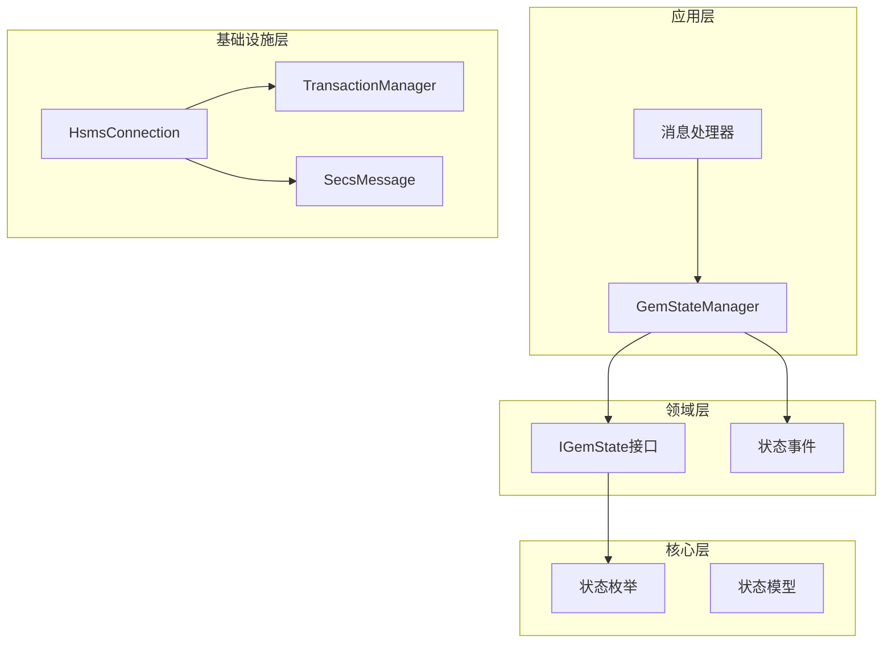

**图表来源**
- [GemStateManager.cs:1-50](file://WebGem/SECS2GEM/Application/State/GemStateManager.cs#L1-L50)
- [IGemState.cs:1-50](file://WebGem/SECS2GEM/Domain/Interfaces/IGemState.cs#L1-L50)
- [HsmsConnection.cs:1-80](file://WebGem/SECS2GEM/Infrastructure/Connection/HsmsConnection.cs#L1-L80)

**章节来源**
- [GemStateManager.cs:1-100](file://WebGem/SECS2GEM/Application/State/GemStateManager.cs#L1-L100)
- [IGemState.cs:1-80](file://WebGem/SECS2GEM/Domain/Interfaces/IGemState.cs#L1-L80)

## 核心组件

### 通信状态枚举定义

系统定义了完整的GEM通信状态体系，包含以下核心状态：

| 状态 | 描述 | 进入条件 | 退出条件 |
|------|------|----------|----------|
| **DISABLED** | 通信禁用状态 | 设备不接受通信请求 | 从其他状态转换而来 |
| **ENABLED** | 通信已启用状态 | 设备准备好接受通信 | 进入等待状态或通信中 |
| **WAIT_COMMUNICATION_REQUEST** | 等待通信请求状态 | 等待S1F13建立通信 | 接收到S1F13或超时 |
| **WAIT_COMMUNICATION_DELAY** | 通信延迟等待状态 | 通信请求被拒绝后的等待 | 延迟结束或重新请求 |
| **COMMUNICATING** | 通信中状态 | 成功建立通信连接 | 设备离线或通信异常 |

### 状态转换验证机制

系统实现了严格的验证机制，确保状态转换的合法性：

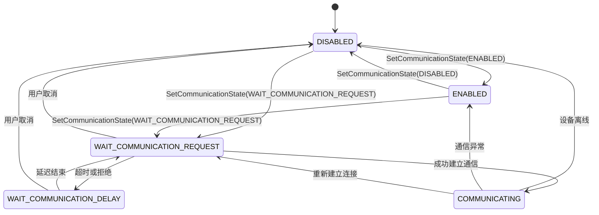

**图表来源**
- [GemStateManager.cs:357-387](file://WebGem/SECS2GEM/Application/State/GemStateManager.cs#L357-L387)

**章节来源**
- [GemStates.cs:10-41](file://WebGem/SECS2GEM/Core/Enums/GemStates.cs#L10-L41)
- [GemStateManager.cs:357-455](file://WebGem/SECS2GEM/Application/State/GemStateManager.cs#L357-L455)

## 架构概览

### 通信状态管理架构

系统采用状态模式实现通信状态管理，通过GemStateManager集中管理所有状态转换逻辑：

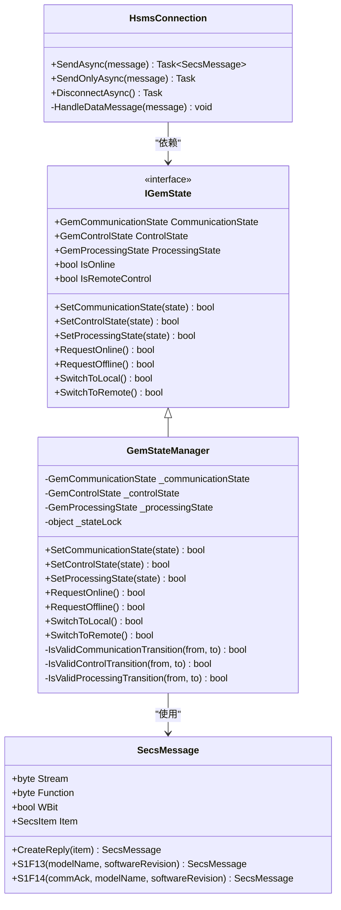

**图表来源**
- [IGemState.cs:20-163](file://WebGem/SECS2GEM/Domain/Interfaces/IGemState.cs#L20-L163)
- [GemStateManager.cs:22-491](file://WebGem/SECS2GEM/Application/State/GemStateManager.cs#L22-L491)
- [SecsMessage.cs:18-208](file://WebGem/SECS2GEM/Core/Entities/SecsMessage.cs#L18-L208)
- [HsmsConnection.cs:30-906](file://WebGem/SECS2GEM/Infrastructure/Connection/HsmsConnection.cs#L30-L906)

### 消息处理流程

系统通过消息处理器实现S1F13/S1F14通信建立流程：

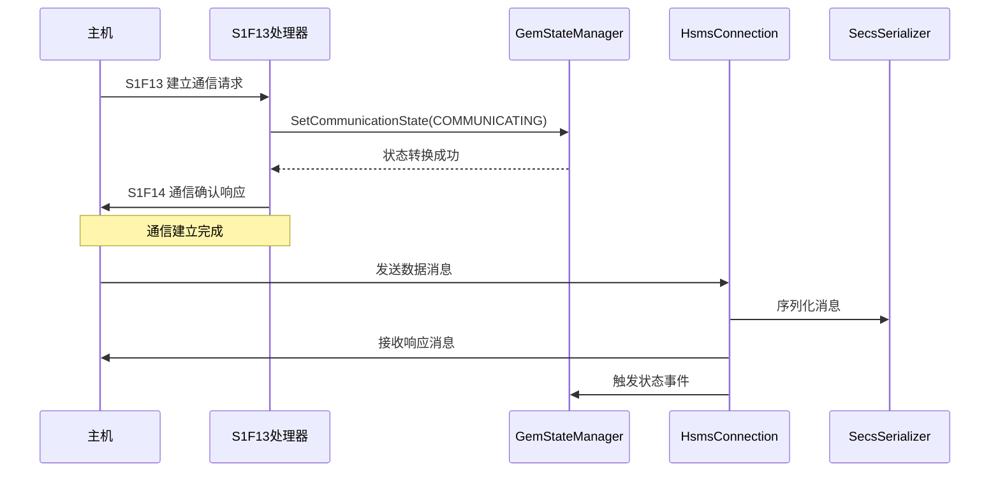

**图表来源**
- [StreamOneHandlers.cs:122-149](file://WebGem/SECS2GEM/Application/Handlers/StreamOneHandlers.cs#L122-L149)
- [GemStateManager.cs:201-223](file://WebGem/SECS2GEM/Application/State/GemStateManager.cs#L201-L223)
- [HsmsConnection.cs:427-453](file://WebGem/SECS2GEM/Infrastructure/Connection/HsmsConnection.cs#L427-L453)

**章节来源**
- [GemStateManager.cs:196-350](file://WebGem/SECS2GEM/Application/State/GemStateManager.cs#L196-L350)
- [StreamOneHandlers.cs:122-211](file://WebGem/SECS2GEM/Application/Handlers/StreamOneHandlers.cs#L122-L211)

## 详细组件分析

### GemStateManager实现

GemStateManager是通信状态管理的核心实现，负责维护和转换所有GEM状态：

#### 状态属性管理

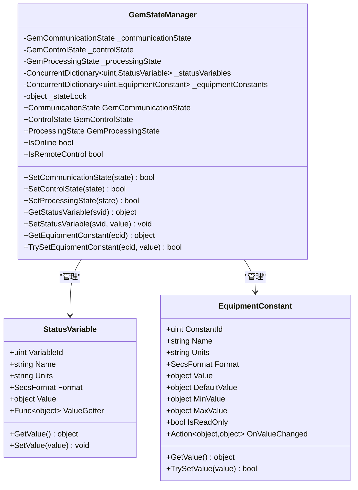

**图表来源**
- [GemStateManager.cs:22-194](file://WebGem/SECS2GEM/Application/State/GemStateManager.cs#L22-L194)

#### 状态转换验证算法

系统实现了复杂的验证算法，确保状态转换的合法性：

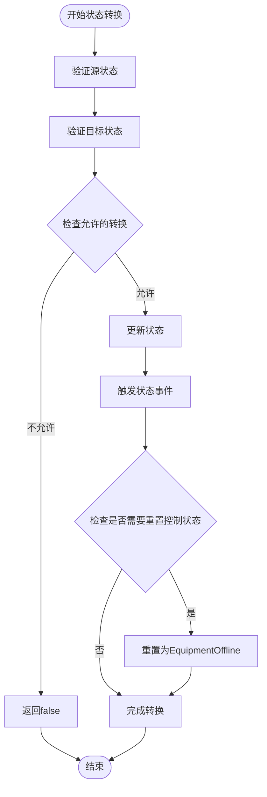

**图表来源**
- [GemStateManager.cs:357-455](file://WebGem/SECS2GEM/Application/State/GemStateManager.cs#L357-L455)

**章节来源**
- [GemStateManager.cs:22-491](file://WebGem/SECS2GEM/Application/State/GemStateManager.cs#L22-L491)

### 通信建立流程（S1F13/S1F14）

#### S1F13建立通信请求

S1F13处理器实现了完整的通信建立流程：

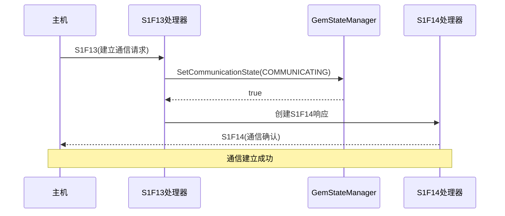

**图表来源**
- [StreamOneHandlers.cs:122-149](file://WebGem/SECS2GEM/Application/Handlers/StreamOneHandlers.cs#L122-L149)
- [GemStateManager.cs:201-223](file://WebGem/SECS2GEM/Application/State/GemStateManager.cs#L201-L223)

#### S1F14通信确认响应

S1F14处理器负责生成通信确认响应：

| COMMACK值 | 含义 | 用途 |
|-----------|------|------|
| 0 | 接受 | 通信建立成功 |
| 1 | 拒绝，已通信 | 设备已在通信中 |
| 2 | 拒绝，设备离线 | 设备处于离线状态 |

**章节来源**
- [StreamOneHandlers.cs:122-149](file://WebGem/SECS2GEM/Application/Handlers/StreamOneHandlers.cs#L122-L149)
- [GEM协议规范.md:783-802](file://WebGem/SECS2GEM/GEM_Protocol_Specification.md#L783-L802)

### 通信断开流程

#### OFF-LINE请求处理

OFF-LINE请求通过S1F15处理器实现：

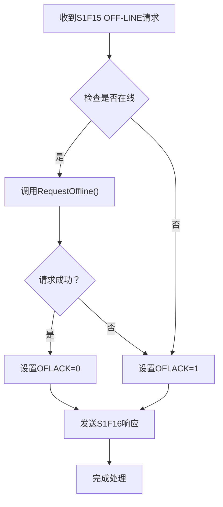

**图表来源**
- [StreamOneHandlers.cs:154-174](file://WebGem/SECS2GEM/Application/Handlers/StreamOneHandlers.cs#L154-L174)

**章节来源**
- [StreamOneHandlers.cs:154-174](file://WebGem/SECS2GEM/Application/Handlers/StreamOneHandlers.cs#L154-L174)

### W-Bit（等待位）机制

W-Bit是SECS-II协议中的重要概念，决定了消息是否期望回复：

#### W-Bit消息处理流程

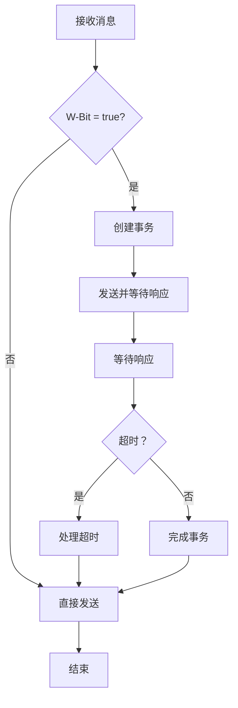

**图表来源**
- [HsmsConnection.cs:427-453](file://WebGem/SECS2GEM/Infrastructure/Connection/HsmsConnection.cs#L427-L453)
- [TransactionManager.cs:46-72](file://WebGem/SECS2GEM/Infrastructure/Services/TransactionManager.cs#L46-L72)

**章节来源**
- [SecsMessage.cs:46-55](file://WebGem/SECS2GEM/Core/Entities/SecsMessage.cs#L46-L55)
- [HsmsConnection.cs:427-453](file://WebGem/SECS2GEM/Infrastructure/Connection/HsmsConnection.cs#L427-L453)

## 依赖关系分析

### 组件耦合度分析

系统采用了松耦合的设计原则，各组件之间通过接口进行交互：

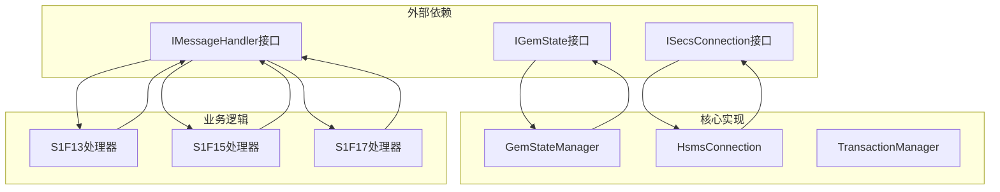

**图表来源**
- [IGemState.cs:1-166](file://WebGem/SECS2GEM/Domain/Interfaces/IGemState.cs#L1-L166)
- [HsmsConnection.cs:1-139](file://WebGem/SECS2GEM/Infrastructure/Connection/HsmsConnection.cs#L1-L139)

### 状态事件传播机制

系统通过事件机制实现状态变化的通知：

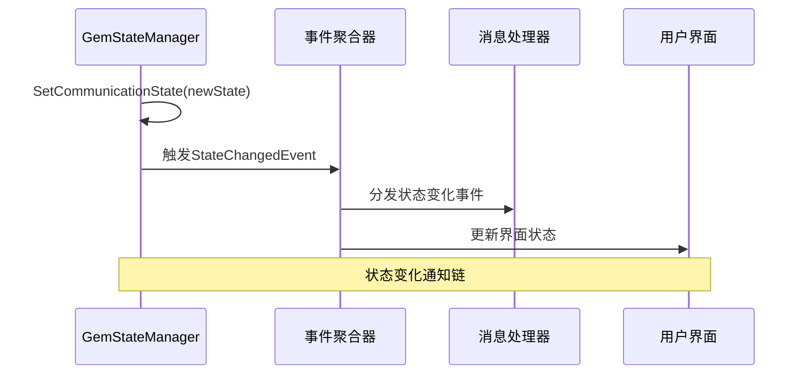

**图表来源**
- [StateChangedEvent.cs:11-71](file://WebGem/SECS2GEM/Domain/Events/StateChangedEvent.cs#L11-L71)
- [GemStateManager.cs:220-222](file://WebGem/SECS2GEM/Application/State/GemStateManager.cs#L220-L222)

**章节来源**
- [IGemState.cs:58-60](file://WebGem/SECS2GEM/Domain/Interfaces/IGemState.cs#L58-L60)
- [StateChangedEvent.cs:11-108](file://WebGem/SECS2GEM/Domain/Events/StateChangedEvent.cs#L11-L108)

## 性能考虑

### 并发安全性

系统采用了多种并发控制机制确保线程安全：

1. **状态锁保护**：使用`_stateLock`对象保护状态转换的原子性
2. **并发字典**：使用`ConcurrentDictionary`管理状态变量和设备常量
3. **事务隔离**：TransactionManager使用线程安全的数据结构

### 内存优化

1. **对象池模式**：TransactionManager复用事务对象减少GC压力
2. **延迟初始化**：状态变量和设备常量按需注册
3. **内存池**：使用缓冲区池减少内存分配

### 性能监控

系统提供了完善的性能监控机制：

- **活跃事务计数**：实时监控事务数量
- **状态转换统计**：记录状态转换频率
- **消息处理性能**：监控消息处理延迟

## 故障排除指南

### 常见问题诊断

#### 通信状态异常

**问题现象**：设备无法建立通信连接

**诊断步骤**：
1. 检查通信状态是否为DISABLED
2. 验证ENABLED状态下的WAIT_COMMUNICATION_REQUEST转换
3. 确认S1F13消息处理是否正常

**解决方案**：
- 确保状态转换验证逻辑正确
- 检查消息处理器实现
- 验证事务管理器配置

#### 状态转换失败

**问题现象**：状态转换返回false

**诊断步骤**：
1. 检查源状态和目标状态的有效性
2. 验证状态转换表中的允许转换
3. 确认状态锁保护机制

**解决方案**：
- 按照状态转换规则重新设计流程
- 检查状态转换验证算法
- 实现适当的错误处理机制

#### 事务超时问题

**问题现象**：消息发送超时

**诊断步骤**：
1. 检查T3超时配置
2. 验证网络连接稳定性
3. 确认消息序列化正确性

**解决方案**：
- 调整超时参数配置
- 实现重试机制
- 优化网络传输性能

**章节来源**
- [GemStateManagerTests.cs:48-91](file://WebGem/SECS2GEM.Tests/GemStateManagerTests.cs#L48-L91)
- [MessageHandlerTests.cs:67-104](file://WebGem/SECS2GEM.Tests/MessageHandlerTests.cs#L67-L104)

### 最佳实践建议

#### 状态管理最佳实践

1. **状态转换验证**：始终使用IsValid*Transition方法验证转换合法性
2. **事件通知**：及时触发状态变化事件通知相关组件
3. **异常处理**：实现完善的异常处理和回滚机制

#### 性能优化建议

1. **批量处理**：对于频繁的状态变化，考虑批量处理机制
2. **缓存策略**：合理使用缓存减少重复计算
3. **资源管理**：及时释放不再使用的资源

#### 安全性考虑

1. **输入验证**：严格验证所有外部输入的状态参数
2. **权限控制**：实现适当的状态访问权限控制
3. **审计日志**：记录重要的状态变化事件便于追踪

## 结论

GEM通信状态模型通过精心设计的状态机实现了可靠的设备通信管理。系统不仅满足了SEMI E30标准的要求，还提供了灵活的状态扩展机制和完善的错误处理能力。

通过本文档的详细分析，开发者可以深入理解系统的通信状态管理机制，包括状态转换逻辑、消息处理流程、事务管理等方面。这些知识对于开发和维护工业自动化系统具有重要的指导意义。

系统的模块化设计和接口抽象为未来的功能扩展奠定了良好的基础，无论是增加新的状态类型还是优化现有状态转换，都能保持系统的稳定性和可维护性。