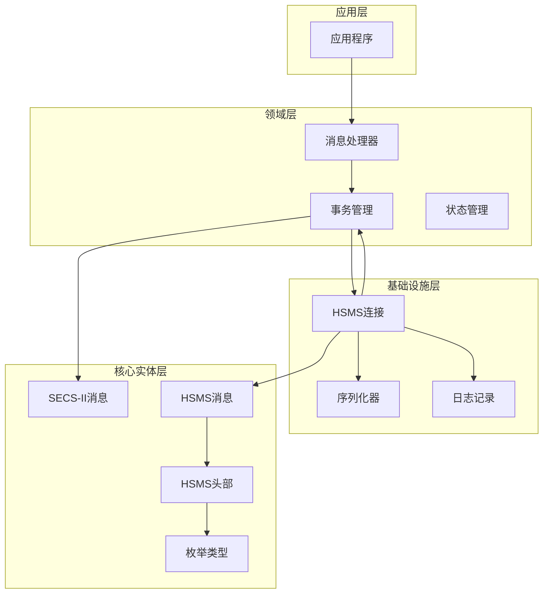
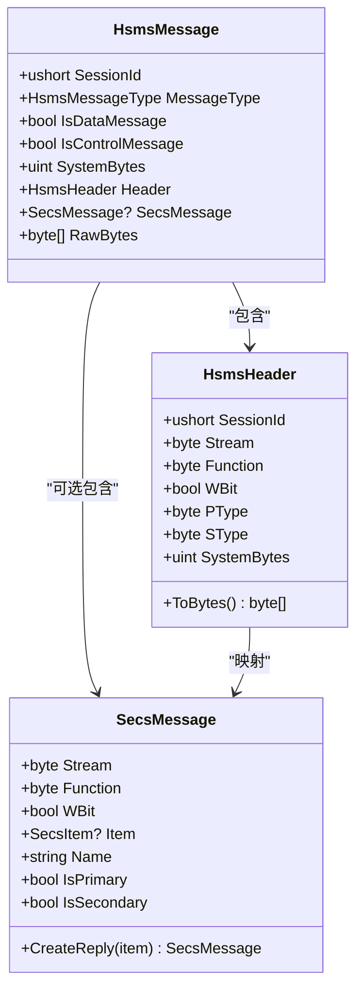
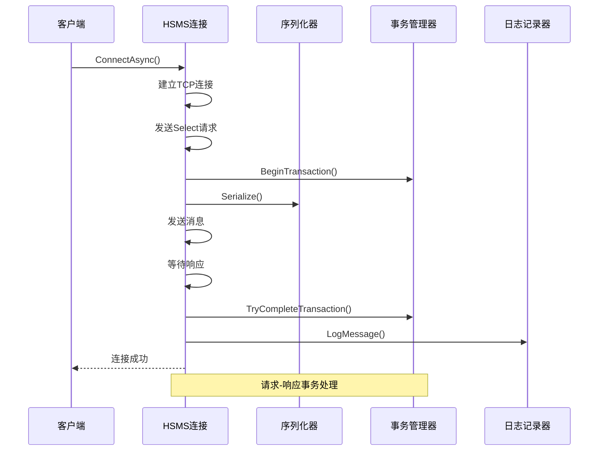
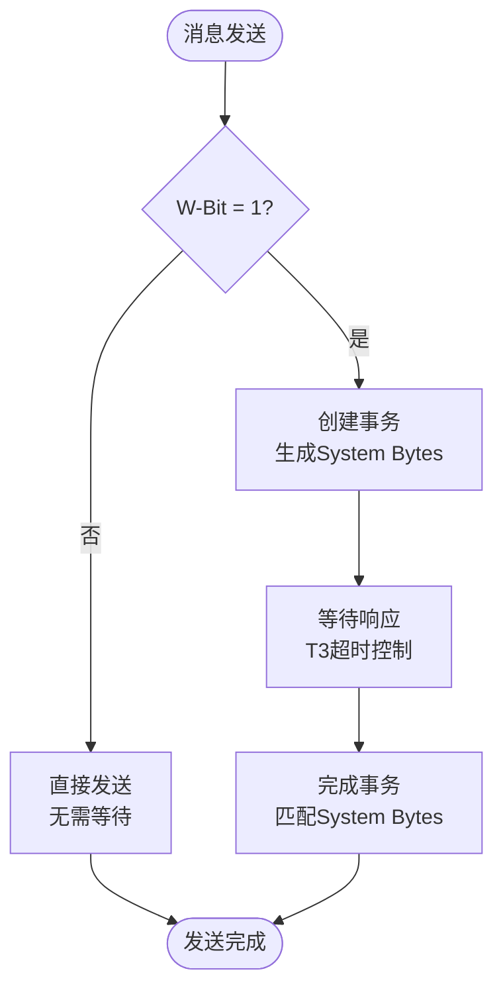
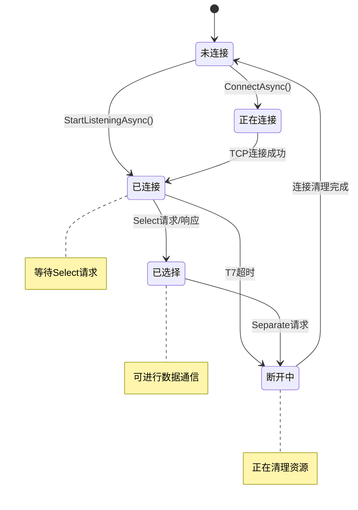
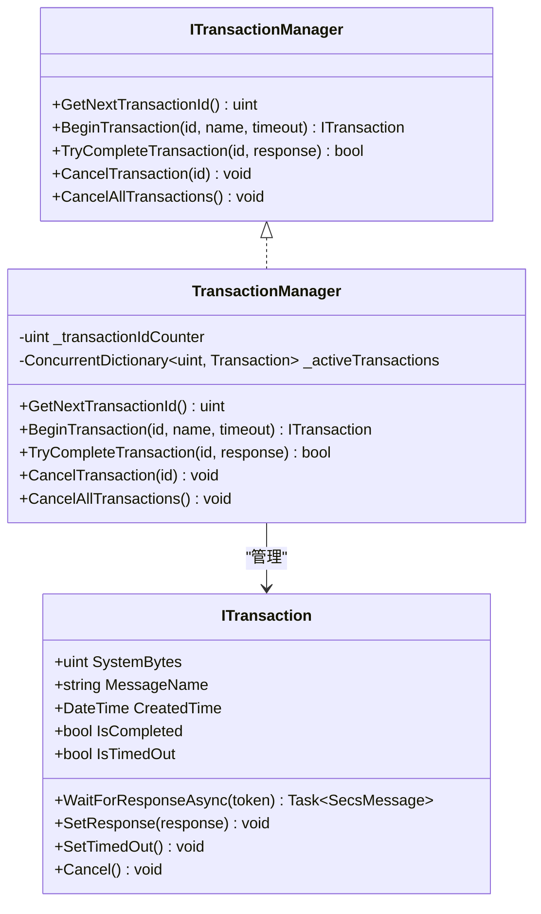
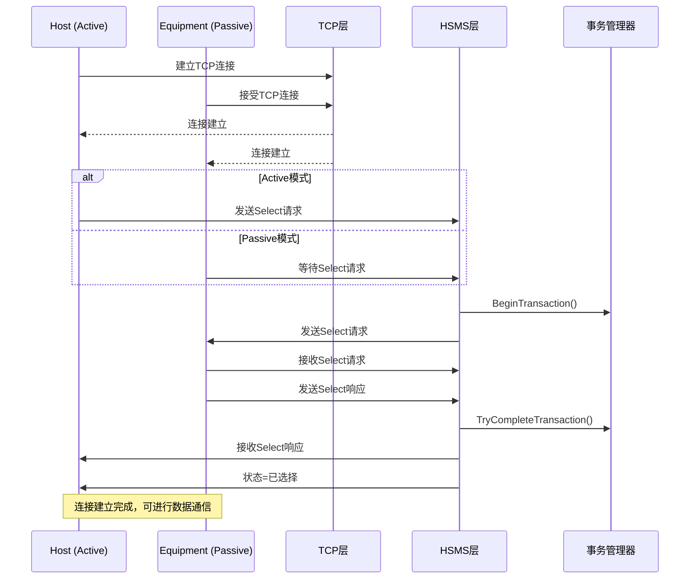
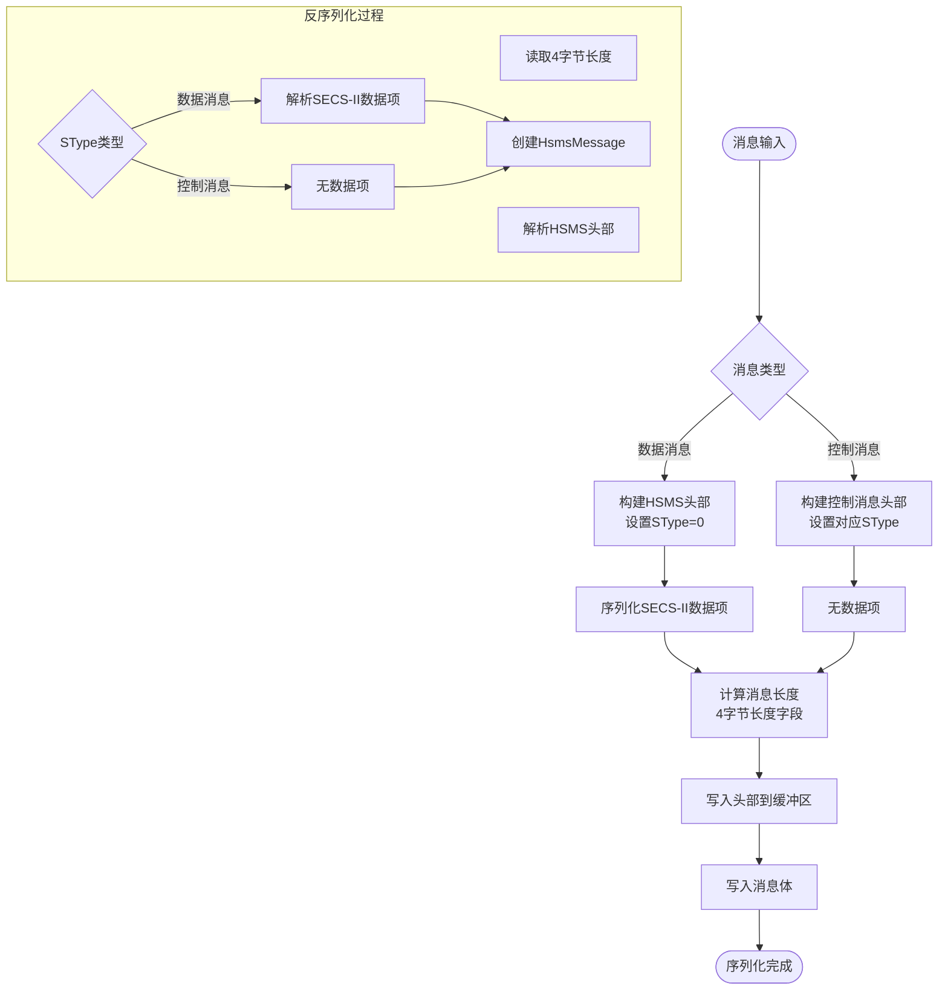
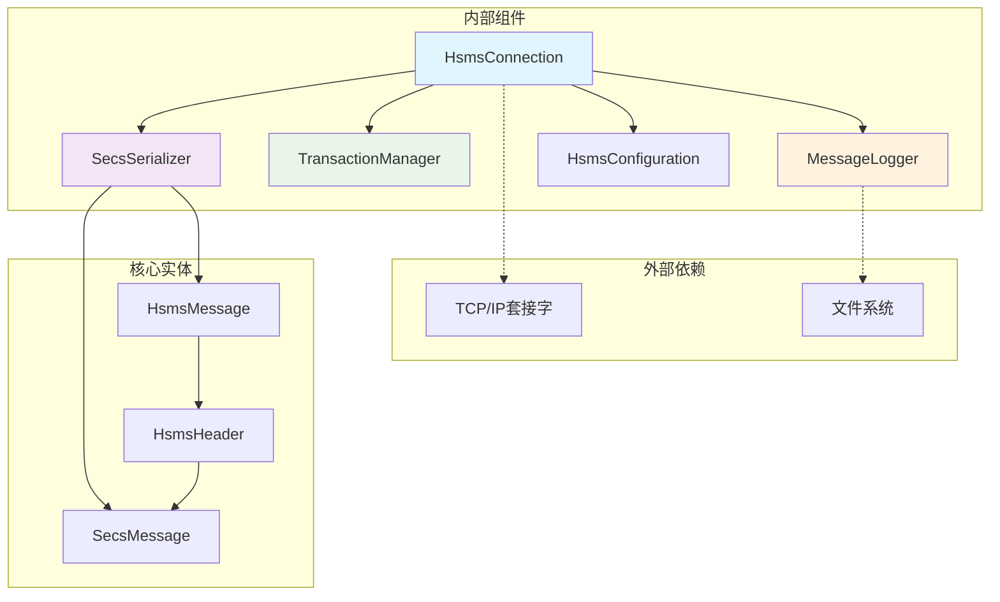

# HSMS传输机制

<cite>
**本文档引用的文件**
- [SecsMessage.cs](file://WebGem/SECS2GEM/Core/Entities/SecsMessage.cs)
- [HsmsConnection.cs](file://WebGem/SECS2GEM/Infrastructure/Connection/HsmsConnection.cs)
- [HsmsConfiguration.cs](file://WebGem/SECS2GEM/Infrastructure/Configuration/HsmsConfiguration.cs)
- [HsmsMessageType.cs](file://WebGem/SECS2GEM/Core/Enums/HsmsMessageType.cs)
- [ITransactionManager.cs](file://WebGem/SECS2GEM/Domain/Interfaces/ITransactionManager.cs)
- [TransactionManager.cs](file://WebGem/SECS2GEM/Infrastructure/Services/TransactionManager.cs)
- [ConnectionState.cs](file://WebGem/SECS2GEM/Core/Enums/ConnectionState.cs)
- [SecsSerializer.cs](file://WebGem/SECS2GEM/Infrastructure/Serialization/SecsSerializer.cs)
- [GEM_Protocol_Specification.md](file://WebGem/SECS2GEM/GEM_Protocol_Specification.md)
- [IntegrationTests.cs](file://WebGem/SECS2GEM.Tests/IntegrationTests.cs)
- [MessageLogger.cs](file://WebGem/SECS2GEM/Infrastructure/Logging/MessageLogger.cs)
</cite>

## 目录
1. [简介](#简介)
2. [项目结构](#项目结构)
3. [核心组件](#核心组件)
4. [架构概览](#架构概览)
5. [详细组件分析](#详细组件分析)
6. [依赖关系分析](#依赖关系分析)
7. [性能考虑](#性能考虑)
8. [故障排除指南](#故障排除指南)
9. [结论](#结论)

## 简介

HSMS（High-Speed Message Transfer Protocol）是SEMI E37标准定义的高速消息传输协议，专为半导体制造设备与主机之间的实时通信而设计。本项目实现了完整的HSMS传输机制，包括：

- **消息结构**：4字节消息长度字段 + 10字节消息头 + 可变长度消息体
- **会话管理**：支持主动/被动两种连接模式
- **事务处理**：基于System Bytes的请求-响应匹配机制
- **状态机**：完整的连接生命周期管理
- **超时控制**：T3-T8五种超时参数配置
- **消息序列化**：SECS-II数据项的TLV格式编码

## 项目结构

该项目采用分层架构设计，主要分为以下层次：

**图表来源**
- [HsmsConnection.cs:13-30](file://WebGem/SECS2GEM/Infrastructure/Connection/HsmsConnection.cs#L13-L30)
- [SecsMessage.cs:18-209](file://WebGem/SECS2GEM/Core/Entities/SecsMessage.cs#L18-L209)
- [HsmsMessageType.cs:10-67](file://WebGem/SECS2GEM/Core/Enums/HsmsMessageType.cs#L10-L67)

**章节来源**
- [HsmsConnection.cs:13-30](file://WebGem/SECS2GEM/Infrastructure/Connection/HsmsConnection.cs#L13-L30)
- [SecsMessage.cs:18-209](file://WebGem/SECS2GEM/Core/Entities/SecsMessage.cs#L18-L209)

## 核心组件

### HSMS消息结构

HSMS协议采用统一的消息格式，确保不同类型的通信都能在同一框架下处理：

**图表来源**
- [HsmsConnection.cs:732-800](file://WebGem/SECS2GEM/Infrastructure/Connection/HsmsConnection.cs#L732-L800)
- [SecsMessage.cs:18-209](file://WebGem/SECS2GEM/Core/Entities/SecsMessage.cs#L18-L209)

### 会话管理组件

系统支持两种连接模式，适应不同的应用场景：

| 连接模式 | 角色 | 适用场景 | 特点 |
|---------|------|----------|------|
| 主动模式 (Active) | Host | Host主动发起连接 | 需要指定目标IP和端口 |
| 被动模式 (Passive) | Equipment | Equipment等待连接 | 监听指定端口 |

**章节来源**
- [HsmsConnection.cs:146-186](file://WebGem/SECS2GEM/Infrastructure/Connection/HsmsConnection.cs#L146-L186)
- [HsmsConnection.cs:191-213](file://WebGem/SECS2GEM/Infrastructure/Connection/HsmsConnection.cs#L191-L213)

## 架构概览

系统采用事件驱动的异步架构，通过状态模式管理连接生命周期：

**图表来源**
- [HsmsConnection.cs:427-453](file://WebGem/SECS2GEM/Infrastructure/Connection/HsmsConnection.cs#L427-L453)
- [TransactionManager.cs:46-58](file://WebGem/SECS2GEM/Infrastructure/Services/TransactionManager.cs#L46-L58)

## 详细组件分析

### HSMS消息头详解

HSMS消息头是协议的核心部分，包含以下关键字段：

| 字段 | 字节位置 | 大小 | 描述 | 示例值 |
|------|----------|------|------|--------|
| Session ID | 0-1 | 2字节 | 设备会话标识符 | 0x0001 |
| Header Byte 2 | 2 | 1字节 | Stream号 + W-Bit | bit7: W-Bit, bit0-6: Stream |
| Header Byte 3 | 3 | 1字节 | Function号 | 0x01 |
| PType | 4 | 1字节 | 协议类型 | 0x00 (SECS-II) |
| SType | 5 | 1字节 | 会话类型 | 0x00 (数据消息) |
| System Bytes | 6-9 | 4字节 | 事务ID | 0x00000001 |

#### W-Bit（等待位）机制

W-Bit位于Header Byte 2的最高位，控制消息的响应行为：

**图表来源**
- [HsmsConnection.cs:427-453](file://WebGem/SECS2GEM/Infrastructure/Connection/HsmsConnection.cs#L427-L453)
- [TransactionManager.cs:160-174](file://WebGem/SECS2GEM/Infrastructure/Services/TransactionManager.cs#L160-L174)

**章节来源**
- [SecsSerializer.cs:49-77](file://WebGem/SECS2GEM/Infrastructure/Serialization/SecsSerializer.cs#L49-L77)
- [GEM_Protocol_Specification.md:116-122](file://WebGem/SECS2GEM/GEM_Protocol_Specification.md#L116-L122)

### SType会话类型定义

SType字段定义了HSMS消息的类型，系统支持以下会话类型：

| SType值 | 类型 | 描述 | 用途 |
|---------|------|------|------|
| 0 | Data Message | SECS-II数据消息 | 主要的数据传输 |
| 1 | Select Request | 选择请求 | 建立HSMS会话 |
| 2 | Select Response | 选择响应 | 确认会话建立 |
| 3 | Deselect Request | 取消选择请求 | 终止HSMS会话 |
| 4 | Deselect Response | 取消选择响应 | 确认会话终止 |
| 5 | Linktest Request | 链路测试请求 | 心跳检测 |
| 6 | Linktest Response | 链路测试响应 | 心跳响应 |
| 7 | Reject Request | 拒绝请求 | 拒绝无效控制消息 |
| 9 | Separate Request | 分离请求 | 立即断开连接 |

**章节来源**
- [HsmsMessageType.cs:10-67](file://WebGem/SECS2GEM/Core/Enums/HsmsMessageType.cs#L10-L67)
- [GEM_Protocol_Specification.md:124-136](file://WebGem/SECS2GEM/GEM_Protocol_Specification.md#L124-L136)

### 连接状态机

HSMS连接遵循严格的生命周期状态管理：

**图表来源**
- [ConnectionState.cs:10-41](file://WebGem/SECS2GEM/Core/Enums/ConnectionState.cs#L10-L41)
- [HsmsConnection.cs:280-296](file://WebGem/SECS2GEM/Infrastructure/Connection/HsmsConnection.cs#L280-L296)

**章节来源**
- [GEM_Protocol_Specification.md:138-161](file://WebGem/SECS2GEM/GEM_Protocol_Specification.md#L138-L161)

### 超时参数配置

系统提供五个关键的超时参数，用于控制不同阶段的时间限制：

| 参数 | 名称 | 描述 | 默认值 | 配置方式 |
|------|------|------|--------|----------|
| T3 | 回复超时 | 等待Secondary消息的超时 | 45秒 | HsmsConfiguration.T3 |
| T5 | 连接分离超时 | 连接断开后的重连等待 | 10秒 | HsmsConfiguration.T5 |
| T6 | 控制事务超时 | Select/Deselect/Linktest超时 | 5秒 | HsmsConfiguration.T6 |
| T7 | 未选择超时 | TCP连接后等待Select的超时 | 10秒 | HsmsConfiguration.T7 |
| T8 | 网络字符间隔超时 | 消息传输中字符间隔 | 5秒 | HsmsConfiguration.T8 |

**章节来源**
- [HsmsConfiguration.cs:39-76](file://WebGem/SECS2GEM/Infrastructure/Configuration/HsmsConfiguration.cs#L39-L76)
- [GEM_Protocol_Specification.md:163-172](file://WebGem/SECS2GEM/GEM_Protocol_Specification.md#L163-L172)

### 事务管理机制

系统采用基于System Bytes的事务管理，确保请求-响应的正确匹配：

**图表来源**
- [ITransactionManager.cs:78-118](file://WebGem/SECS2GEM/Domain/Interfaces/ITransactionManager.cs#L78-L118)
- [TransactionManager.cs:24-118](file://WebGem/SECS2GEM/Infrastructure/Services/TransactionManager.cs#L24-L118)

**章节来源**
- [TransactionManager.cs:124-201](file://WebGem/SECS2GEM/Infrastructure/Services/TransactionManager.cs#L124-L201)

### 连接建立流程

完整的连接建立过程遵循SEMI E37标准：

**图表来源**
- [HsmsConnection.cs:146-186](file://WebGem/SECS2GEM/Infrastructure/Connection/HsmsConnection.cs#L146-L186)
- [HsmsConnection.cs:520-541](file://WebGem/SECS2GEM/Infrastructure/Connection/HsmsConnection.cs#L520-L541)

**章节来源**
- [GEM_Protocol_Specification.md:173-198](file://WebGem/SECS2GEM/GEM_Protocol_Specification.md#L173-L198)

### 消息序列化与反序列化

系统实现了完整的SECS-II消息序列化机制：

**图表来源**
- [SecsSerializer.cs:49-77](file://WebGem/SECS2GEM/Infrastructure/Serialization/SecsSerializer.cs#L49-L77)
- [SecsSerializer.cs:93-126](file://WebGem/SECS2GEM/Infrastructure/Serialization/SecsSerializer.cs#L93-L126)

**章节来源**
- [SecsSerializer.cs:139-177](file://WebGem/SECS2GEM/Infrastructure/Serialization/SecsSerializer.cs#L139-L177)

## 依赖关系分析

系统采用松耦合的设计，各组件间通过接口进行交互：

**图表来源**
- [HsmsConnection.cs:30-139](file://WebGem/SECS2GEM/Infrastructure/Connection/HsmsConnection.cs#L30-L139)
- [SecsSerializer.cs:27-27](file://WebGem/SECS2GEM/Infrastructure/Serialization/SecsSerializer.cs#L27-L27)

**章节来源**
- [HsmsConnection.cs:30-139](file://WebGem/SECS2GEM/Infrastructure/Connection/HsmsConnection.cs#L30-L139)

## 性能考虑

系统在设计时充分考虑了性能优化：

### 异步I/O处理
- 使用`Channel<T>`实现无锁消息队列
- 基于`Task`和`CancellationToken`的异步编程模型
- 避免阻塞主线程，提高并发处理能力

### 内存管理
- 采用Span<T>和Memory<T>减少内存分配
- 对象池化策略减少GC压力
- 流式处理避免大对象复制

### 缓冲区优化
- 可配置的接收/发送缓冲区大小
- 批量写入减少系统调用次数
- 动态调整缓冲区大小适应不同负载

## 故障排除指南

### 常见连接问题

| 问题症状 | 可能原因 | 解决方案 |
|----------|----------|----------|
| 连接超时 | T7超时或网络延迟 | 检查T7配置，验证网络连通性 |
| 无法建立会话 | Select请求/响应失败 | 检查设备ID和会话配置 |
| 消息丢失 | T3超时或网络中断 | 增加T3超时，检查网络稳定性 |
| 心跳失败 | T6超时或链路不稳定 | 调整Linktest间隔，检查设备状态 |

### 调试技巧

1. **启用消息日志**：通过`MessageLoggingConfiguration`启用详细日志记录
2. **监控事务状态**：使用`ActiveTransactionCount`监控活跃事务数量
3. **检查缓冲区**：监控接收/发送缓冲区使用情况
4. **验证超时配置**：确保T3-T8参数适合实际网络环境

**章节来源**
- [MessageLogger.cs:99-145](file://WebGem/SECS2GEM/Infrastructure/Logging/MessageLogger.cs#L99-L145)
- [TransactionManager.cs:33-34](file://WebGem/SECS2GEM/Infrastructure/Services/TransactionManager.cs#L33-L34)

## 结论

本项目实现了符合SEMI E37标准的完整HSMS传输机制，具有以下特点：

1. **标准化实现**：严格遵循HSMS协议规范，确保与其他设备的兼容性
2. **高性能设计**：采用异步编程模型和优化的内存管理策略
3. **健壮性保障**：完善的错误处理和超时控制机制
4. **可扩展性**：模块化的架构设计便于功能扩展和维护

通过合理的配置和使用，该实现能够满足半导体制造设备通信的各种需求，为工业自动化提供了可靠的通信基础。