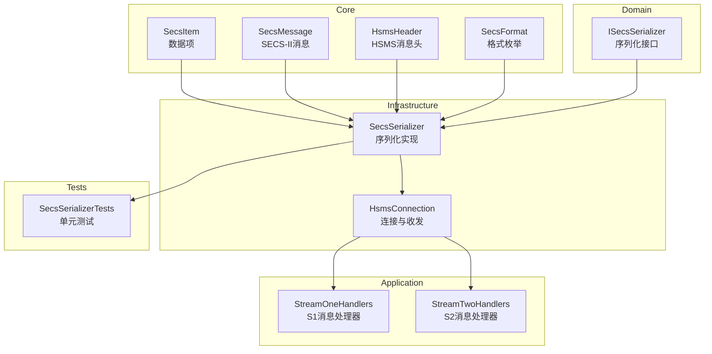
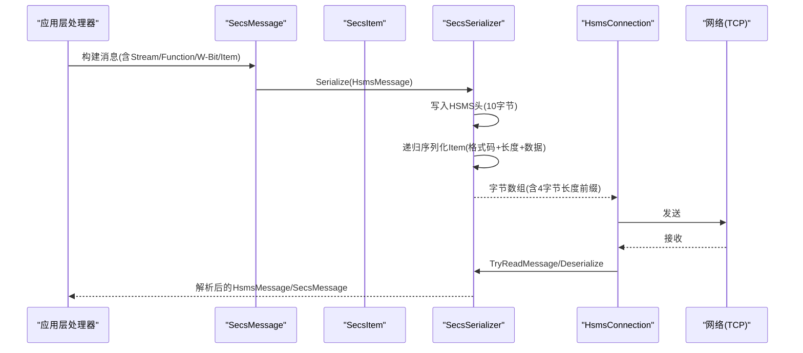
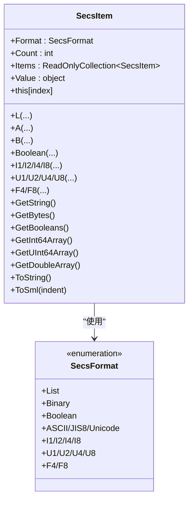
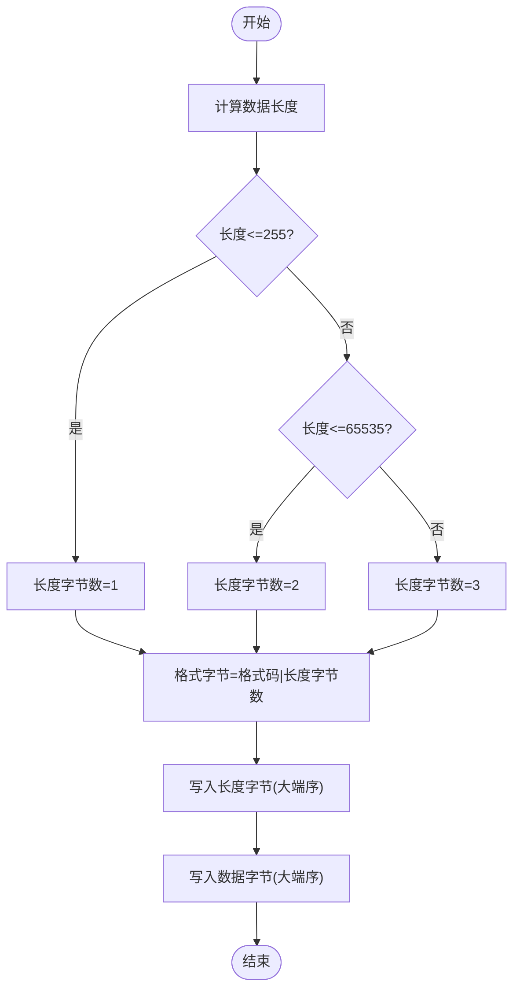
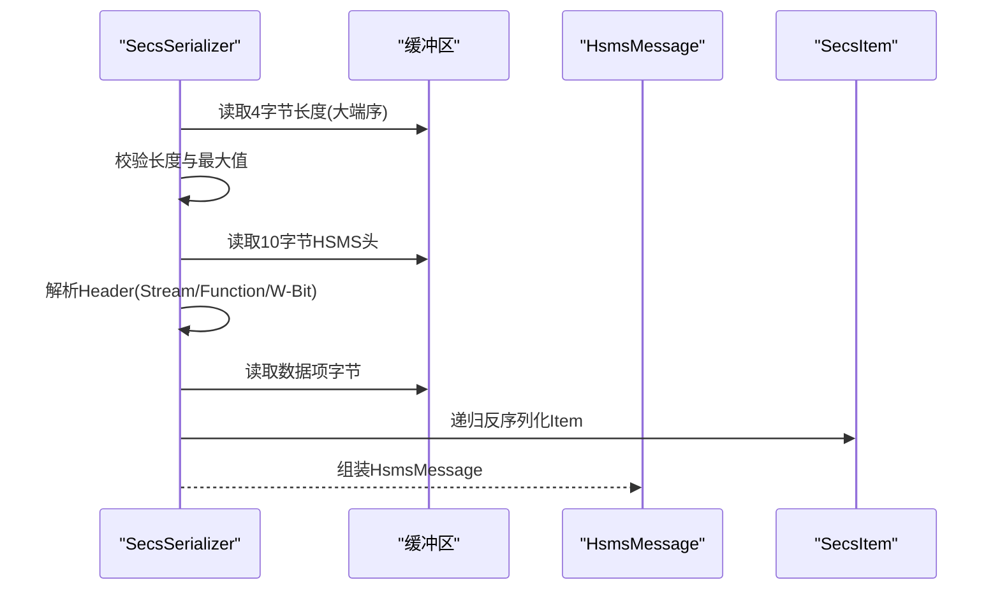
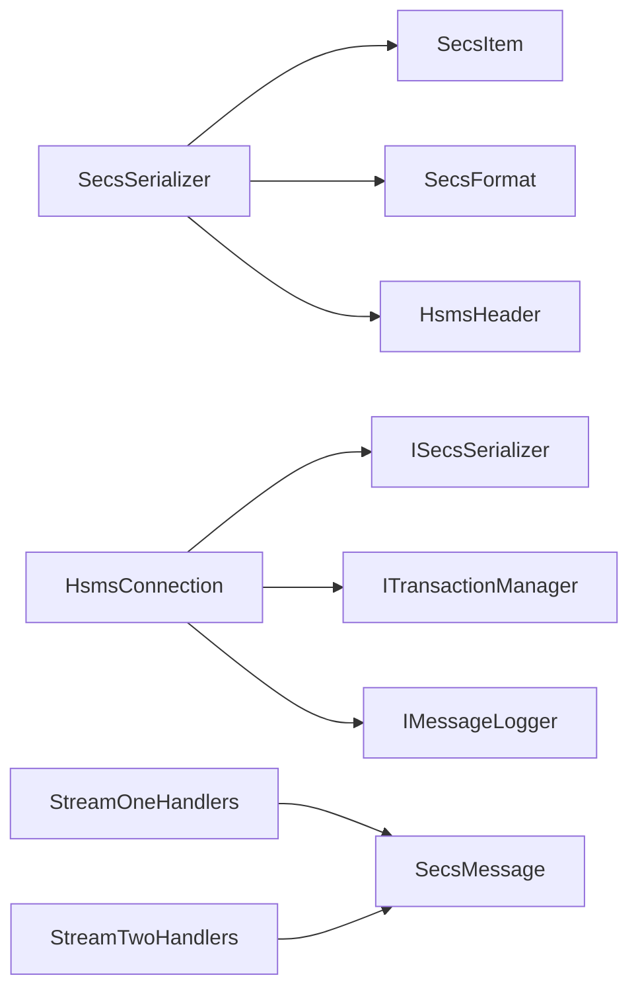

# SECS-II协议基础

<cite>
**本文引用的文件**
- [SecsItem.cs](file://WebGem/SECS2GEM/Core/Entities/SecsItem.cs)
- [SecsFormat.cs](file://WebGem/SECS2GEM/Core/Enums/SecsFormat.cs)
- [SecsMessage.cs](file://WebGem/SECS2GEM/Core/Entities/SecsMessage.cs)
- [SecsSerializer.cs](file://WebGem/SECS2GEM/Infrastructure/Serialization/SecsSerializer.cs)
- [ISecsSerializer.cs](file://WebGem/SECS2GEM/Domain/Interfaces/ISecsSerializer.cs)
- [HsmsHeader.cs](file://WebGem/SECS2GEM/Core/Entities/HsmsHeader.cs)
- [HsmsConnection.cs](file://WebGem/SECS2GEM/Infrastructure/Connection/HsmsConnection.cs)
- [SecsSerializerTests.cs](file://WebGem/SECS2GEM.Tests/SecsSerializerTests.cs)
- [GEM_Protocol_Specification.md](file://WebGem/SECS2GEM/GEM_Protocol_Specification.md)
- [StreamOneHandlers.cs](file://WebGem/SECS2GEM/Application/Handlers/StreamOneHandlers.cs)
- [StreamTwoHandlers.cs](file://WebGem/SECS2GEM/Application/Handlers/StreamTwoHandlers.cs)
</cite>

## 目录
1. [简介](#简介)
2. [项目结构](#项目结构)
3. [核心组件](#核心组件)
4. [架构总览](#架构总览)
5. [详细组件分析](#详细组件分析)
6. [依赖关系分析](#依赖关系分析)
7. [性能考量](#性能考量)
8. [故障排查指南](#故障排查指南)
9. [结论](#结论)
10. [附录](#附录)

## 简介
本文件面向SECS-II协议的基础实现与使用，围绕数据项（Item）的TLV结构、格式码（Format Code）的二进制构成、长度字段的计算规则、大端序（Big-Endian）处理以及边界情况，结合仓库中的C#实现，系统阐述如何正确地进行序列化与反序列化。同时，给出Stream/Function消息分类体系、常见数据格式类型的编码方式与使用场景，并提供从C#数据类型到SECS-II格式的映射参考路径，帮助开发者快速掌握SECS-II消息的构建与解析。

## 项目结构
本项目以分层与职责分离为核心组织方式：
- Core 层：实体与枚举（数据项、消息、消息头、格式枚举）
- Domain 层：接口契约（序列化器接口）
- Infrastructure 层：实现（序列化器、连接、日志、事务管理）
- Application 层：消息处理器（按Stream/Function分发）
- Tests 层：单元测试覆盖序列化/反序列化与往返测试

图表来源
- [SecsItem.cs:23-480](file://WebGem/SECS2GEM/Core/Entities/SecsItem.cs#L23-L480)
- [SecsMessage.cs:18-209](file://WebGem/SECS2GEM/Core/Entities/SecsMessage.cs#L18-L209)
- [HsmsHeader.cs:21-381](file://WebGem/SECS2GEM/Core/Entities/HsmsHeader.cs#L21-L381)
- [SecsFormat.cs:13-112](file://WebGem/SECS2GEM/Core/Enums/SecsFormat.cs#L13-L112)
- [ISecsSerializer.cs:21-61](file://WebGem/SECS2GEM/Domain/Interfaces/ISecsSerializer.cs#L21-L61)
- [SecsSerializer.cs:27-662](file://WebGem/SECS2GEM/Infrastructure/Serialization/SecsSerializer.cs#L27-L662)
- [HsmsConnection.cs:30-906](file://WebGem/SECS2GEM/Infrastructure/Connection/HsmsConnection.cs#L30-L906)
- [StreamOneHandlers.cs:20-211](file://WebGem/SECS2GEM/Application/Handlers/StreamOneHandlers.cs#L20-L211)
- [StreamTwoHandlers.cs:6-331](file://WebGem/SECS2GEM/Application/Handlers/StreamTwoHandlers.cs#L6-L331)
- [SecsSerializerTests.cs:10-296](file://WebGem/SECS2GEM.Tests/SecsSerializerTests.cs#L10-L296)

章节来源
- [SecsItem.cs:1-480](file://WebGem/SECS2GEM/Core/Entities/SecsItem.cs#L1-L480)
- [SecsMessage.cs:1-209](file://WebGem/SECS2GEM/Core/Entities/SecsMessage.cs#L1-L209)
- [HsmsHeader.cs:1-381](file://WebGem/SECS2GEM/Core/Entities/HsmsHeader.cs#L1-L381)
- [SecsFormat.cs:1-112](file://WebGem/SECS2GEM/Core/Enums/SecsFormat.cs#L1-L112)
- [ISecsSerializer.cs:1-61](file://WebGem/SECS2GEM/Domain/Interfaces/ISecsSerializer.cs#L1-L61)
- [SecsSerializer.cs:1-662](file://WebGem/SECS2GEM/Infrastructure/Serialization/SecsSerializer.cs#L1-L662)
- [HsmsConnection.cs:1-906](file://WebGem/SECS2GEM/Infrastructure/Connection/HsmsConnection.cs#L1-L906)
- [StreamOneHandlers.cs:1-211](file://WebGem/SECS2GEM/Application/Handlers/StreamOneHandlers.cs#L1-L211)
- [StreamTwoHandlers.cs:1-331](file://WebGem/SECS2GEM/Application/Handlers/StreamTwoHandlers.cs#L1-L331)
- [SecsSerializerTests.cs:1-296](file://WebGem/SECS2GEM.Tests/SecsSerializerTests.cs#L1-L296)

## 核心组件
- 数据项（SecsItem）：不可变对象，支持递归结构（List可包含子项），提供类型安全的值访问与SML输出。
- 消息（SecsMessage）：封装Stream/Function/W-Bit与数据项，提供常用工厂方法与响应消息创建。
- 消息头（HsmsHeader）：10字节HSMS头，包含SessionId、W-Bit、Stream、Function、PType、SType、SystemBytes。
- 格式枚举（SecsFormat）：定义各数据格式的高6位类型码，低2位长度字节数在编码时动态组合。
- 序列化器（SecsSerializer）：实现HSMS消息与字节数组的双向转换，严格遵循TLV结构、大端序与长度字节规则。
- 接口（ISecsSerializer）：定义序列化/反序列化契约，便于替换实现与测试。
- 连接（HsmsConnection）：基于TCP的HSMS连接，负责消息收发、事务管理、心跳与日志记录。
- 处理器（StreamOneHandlers/StreamTwoHandlers）：按Stream/Function分发消息，生成响应消息。

章节来源
- [SecsItem.cs:23-480](file://WebGem/SECS2GEM/Core/Entities/SecsItem.cs#L23-L480)
- [SecsMessage.cs:18-209](file://WebGem/SECS2GEM/Core/Entities/SecsMessage.cs#L18-L209)
- [HsmsHeader.cs:21-381](file://WebGem/SECS2GEM/Core/Entities/HsmsHeader.cs#L21-L381)
- [SecsFormat.cs:13-112](file://WebGem/SECS2GEM/Core/Enums/SecsFormat.cs#L13-L112)
- [SecsSerializer.cs:27-662](file://WebGem/SECS2GEM/Infrastructure/Serialization/SecsSerializer.cs#L27-L662)
- [ISecsSerializer.cs:21-61](file://WebGem/SECS2GEM/Domain/Interfaces/ISecsSerializer.cs#L21-L61)
- [HsmsConnection.cs:30-906](file://WebGem/SECS2GEM/Infrastructure/Connection/HsmsConnection.cs#L30-L906)
- [StreamOneHandlers.cs:20-211](file://WebGem/SECS2GEM/Application/Handlers/StreamOneHandlers.cs#L20-L211)
- [StreamTwoHandlers.cs:6-331](file://WebGem/SECS2GEM/Application/Handlers/StreamTwoHandlers.cs#L6-L331)

## 架构总览
下图展示了从应用层消息到网络传输的完整链路，以及序列化器在其中的关键作用。

图表来源
- [SecsSerializer.cs:49-126](file://WebGem/SECS2GEM/Infrastructure/Serialization/SecsSerializer.cs#L49-L126)
- [HsmsHeader.cs:187-322](file://WebGem/SECS2GEM/Core/Entities/HsmsHeader.cs#L187-L322)
- [HsmsConnection.cs:550-610](file://WebGem/SECS2GEM/Infrastructure/Connection/HsmsConnection.cs#L550-L610)
- [SecsMessage.cs:93-138](file://WebGem/SECS2GEM/Core/Entities/SecsMessage.cs#L93-L138)

## 详细组件分析

### 数据项（SecsItem）与TLV结构
- TLV结构：格式字节（1字节）+ 长度字节（1-3字节）+ 数据字节（可变）。
- 格式字节：高6位为格式类型，低2位为长度字节数（00=0字节，01=1字节，10=2字节，11=3字节）。
- List类型：长度表示子项数量；其他类型：长度表示字节数。
- 不可变设计：通过私有构造与只读集合保证线程安全；提供类型安全的值访问方法与SML输出。

图表来源
- [SecsItem.cs:23-480](file://WebGem/SECS2GEM/Core/Entities/SecsItem.cs#L23-L480)
- [SecsFormat.cs:13-112](file://WebGem/SECS2GEM/Core/Enums/SecsFormat.cs#L13-L112)

章节来源
- [SecsItem.cs:17-480](file://WebGem/SECS2GEM/Core/Entities/SecsItem.cs#L17-L480)
- [SecsFormat.cs:6-112](file://WebGem/SECS2GEM/Core/Enums/SecsFormat.cs#L6-L112)

### 格式码与长度字节规则
- 格式码高6位：对应数据类型（如List=0x00，ASCII=0x40，I4=0x70等）。
- 格式码低2位：长度字节数（00=0字节，01=1字节，10=2字节，11=3字节）。
- 长度字节：大端序；00表示空数据项（无长度字节与数据字节）。
- 长度选择策略：根据数据长度自动选择1/2/3字节长度。

图表来源
- [SecsSerializer.cs:237-301](file://WebGem/SECS2GEM/Infrastructure/Serialization/SecsSerializer.cs#L237-L301)
- [SecsSerializer.cs:248-279](file://WebGem/SECS2GEM/Infrastructure/Serialization/SecsSerializer.cs#L248-L279)

章节来源
- [SecsSerializer.cs:237-301](file://WebGem/SECS2GEM/Infrastructure/Serialization/SecsSerializer.cs#L237-L301)
- [SecsSerializer.cs:248-279](file://WebGem/SECS2GEM/Infrastructure/Serialization/SecsSerializer.cs#L248-L279)

### 各数据格式类型与编码方式
- List：格式码高6位为0x00；长度为子项数量；递归序列化子项。
- Binary：格式码高6位为0x20；长度为字节数；直接复制字节。
- Boolean：格式码高6位为0x24；长度为字节数；每个字节非零为true。
- ASCII/JIS-8：格式码高6位为0x40/0x44；长度为字节数；按ASCII编码。
- Unicode：格式码高6位为0x48；长度为字节数（每个字符2字节）；按大端序UTF-16编码。
- 整数：I1/I2/I4/I8；U1/U2/U4/U8；长度分别为元素个数或元素字节数；按大端序写入。
- 浮点：F4/F8；长度为元素字节数；按IEEE 754大端序写入。

章节来源
- [SecsSerializer.cs:306-411](file://WebGem/SECS2GEM/Infrastructure/Serialization/SecsSerializer.cs#L306-L411)
- [SecsSerializer.cs:522-543](file://WebGem/SECS2GEM/Infrastructure/Serialization/SecsSerializer.cs#L522-L543)

### Stream/Function消息分类体系
- Stream（1-127）：消息类别，如S1（设备状态）、S2（设备控制）、S5（异常处理）、S6（数据采集）、S7（配方管理）等。
- Function：具体功能，奇数为Primary（请求），偶数为Secondary（响应）。
- W-Bit：Header Byte 2最高位，true表示期望回复，false表示不期望回复。
- 常见消息：S1F1（Are You There）、S1F2（On Line Data）、S1F13/14（Establish Communications）、S2F13/14/15/16（设备常量）、S2F33/35/37/41（事件与远程命令）等。

章节来源
- [SecsMessage.cs:20-139](file://WebGem/SECS2GEM/Core/Entities/SecsMessage.cs#L20-L139)
- [GEM_Protocol_Specification.md:204-224](file://WebGem/SECS2GEM/GEM_Protocol_Specification.md#L204-L224)
- [StreamOneHandlers.cs:94-211](file://WebGem/SECS2GEM/Application/Handlers/StreamOneHandlers.cs#L94-L211)
- [StreamTwoHandlers.cs:13-331](file://WebGem/SECS2GEM/Application/Handlers/StreamTwoHandlers.cs#L13-L331)

### 序列化与反序列化流程
- 序列化：计算Item大小，写入HSMS头（10字节），写入数据项（递归），写入消息长度前缀（4字节，大端序）。
- 反序列化：先读取4字节长度，再解析10字节HSMS头，最后解析数据项（递归）。
- TryReadMessage：尝试从缓冲区读取完整消息，返回是否成功及消耗字节数。

图表来源
- [SecsSerializer.cs:93-126](file://WebGem/SECS2GEM/Infrastructure/Serialization/SecsSerializer.cs#L93-L126)
- [SecsSerializer.cs:139-177](file://WebGem/SECS2GEM/Infrastructure/Serialization/SecsSerializer.cs#L139-L177)
- [HsmsHeader.cs:145-162](file://WebGem/SECS2GEM/Core/Entities/HsmsHeader.cs#L145-L162)

章节来源
- [SecsSerializer.cs:49-126](file://WebGem/SECS2GEM/Infrastructure/Serialization/SecsSerializer.cs#L49-L126)
- [SecsSerializer.cs:139-177](file://WebGem/SECS2GEM/Infrastructure/Serialization/SecsSerializer.cs#L139-L177)
- [HsmsHeader.cs:145-162](file://WebGem/SECS2GEM/Core/Entities/HsmsHeader.cs#L145-L162)

### C#类型到SECS-II格式映射参考
- string -> ASCII/JIS-8/Unicode（按需求选择）
- byte[] -> Binary
- bool[] -> Boolean
- sbyte/short/int/long -> I1/I2/I4/I8
- byte/ushort/uint/ulong -> U1/U2/U4/U8
- float/double -> F4/F8
- 列表 -> L（可嵌套）

章节来源
- [SecsItem.cs:93-268](file://WebGem/SECS2GEM/Core/Entities/SecsItem.cs#L93-L268)
- [SecsFormat.cs:13-112](file://WebGem/SECS2GEM/Core/Enums/SecsFormat.cs#L13-L112)

### 边界情况与错误处理
- 空数据项：格式码低2位为00，无长度字节与数据字节。
- 长度溢出：超过最大长度（255/65535/16777215）时抛出异常。
- 不完整数据：长度字段不足或数据不足时抛出异常。
- 反序列化错误：格式码无效或长度不匹配时抛出异常。
- 连接异常：网络中断、心跳失败、T7超时等触发断开。

章节来源
- [SecsSerializer.cs:154-162](file://WebGem/SECS2GEM/Infrastructure/Serialization/SecsSerializer.cs#L154-L162)
- [SecsSerializer.cs:422-476](file://WebGem/SECS2GEM/Infrastructure/Serialization/SecsSerializer.cs#L422-L476)
- [HsmsConnection.cs:280-296](file://WebGem/SECS2GEM/Infrastructure/Connection/HsmsConnection.cs#L280-L296)

## 依赖关系分析
- SecsSerializer依赖：SecsItem、SecsFormat、HsmsHeader、异常类型与二进制工具。
- HsmsConnection依赖：ISecsSerializer、ITransactionManager、IMessageLogger、HsmsConfiguration。
- 处理器依赖：IGemState、IMessageContext，通过模板方法模式统一处理流程。

图表来源
- [SecsSerializer.cs:27-662](file://WebGem/SECS2GEM/Infrastructure/Serialization/SecsSerializer.cs#L27-L662)
- [HsmsConnection.cs:30-906](file://WebGem/SECS2GEM/Infrastructure/Connection/HsmsConnection.cs#L30-L906)
- [StreamOneHandlers.cs:20-211](file://WebGem/SECS2GEM/Application/Handlers/StreamOneHandlers.cs#L20-L211)
- [StreamTwoHandlers.cs:6-331](file://WebGem/SECS2GEM/Application/Handlers/StreamTwoHandlers.cs#L6-L331)

章节来源
- [SecsSerializer.cs:1-662](file://WebGem/SECS2GEM/Infrastructure/Serialization/SecsSerializer.cs#L1-L662)
- [HsmsConnection.cs:1-906](file://WebGem/SECS2GEM/Infrastructure/Connection/HsmsConnection.cs#L1-L906)
- [StreamOneHandlers.cs:1-211](file://WebGem/SECS2GEM/Application/Handlers/StreamOneHandlers.cs#L1-L211)
- [StreamTwoHandlers.cs:1-331](file://WebGem/SECS2GEM/Application/Handlers/StreamTwoHandlers.cs#L1-L331)

## 性能考量
- 大端序与Span：使用Span与BinaryPrimitives进行高效读写，避免中间拷贝。
- 递归序列化：List类型递归调用，注意深度与内存占用。
- 缓冲区复用：TryReadMessage循环中复用接收缓冲区，减少分配。
- 通道发送：使用Channel实现异步发送队列，提高吞吐量。
- 最大消息大小：MaxMessageSize限制防止过大消息导致内存压力。

章节来源
- [SecsSerializer.cs:27-662](file://WebGem/SECS2GEM/Infrastructure/Serialization/SecsSerializer.cs#L27-L662)
- [HsmsConnection.cs:550-610](file://WebGem/SECS2GEM/Infrastructure/Connection/HsmsConnection.cs#L550-L610)

## 故障排查指南
- 序列化/反序列化失败：检查格式码与长度字节数是否匹配，确认大端序处理。
- 长度不一致：核对GetDataLength与GetNumLengthBytes的计算逻辑。
- 空数据项：确认格式码低2位为00且无长度字节与数据字节。
- 网络问题：关注心跳失败、T7超时、Separate请求等连接状态变化。
- 单元测试验证：利用往返测试与边界用例验证编码/解码正确性。

章节来源
- [SecsSerializer.cs:154-162](file://WebGem/SECS2GEM/Infrastructure/Serialization/SecsSerializer.cs#L154-L162)
- [SecsSerializerTests.cs:160-296](file://WebGem/SECS2GEM.Tests/SecsSerializerTests.cs#L160-L296)
- [HsmsConnection.cs:280-296](file://WebGem/SECS2GEM/Infrastructure/Connection/HsmsConnection.cs#L280-L296)

## 结论
本实现严格遵循SECS-II TLV结构与格式码二进制定义，采用大端序与递归解析，提供了完整的序列化/反序列化能力。通过清晰的分层设计与接口契约，既满足了高性能的网络通信需求，也便于扩展与测试。开发者可据此快速构建符合SEMI E5/E30标准的SECS-II消息，实现设备与主机间的可靠交互。

## 附录
- 常用Stream/Function参考：S1F1/S1F2/S1F13/S1F14/S2F13/S2F14/S2F15/S2F33/S2F35/S2F37/S2F41等。
- 单元测试覆盖：ASCII、U4、Binary、空List、嵌套List、往返测试、TryReadMessage等。

章节来源
- [GEM_Protocol_Specification.md:750-800](file://WebGem/SECS2GEM/GEM_Protocol_Specification.md#L750-L800)
- [SecsSerializerTests.cs:10-296](file://WebGem/SECS2GEM.Tests/SecsSerializerTests.cs#L10-L296)