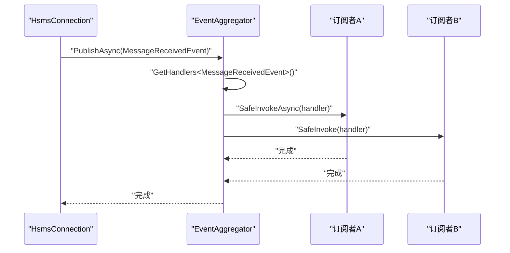
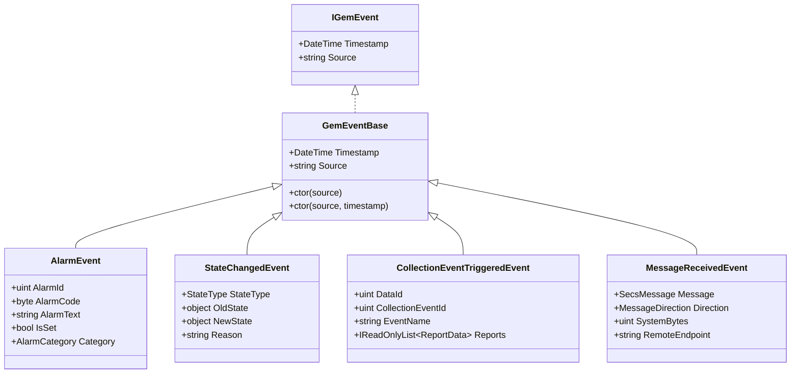
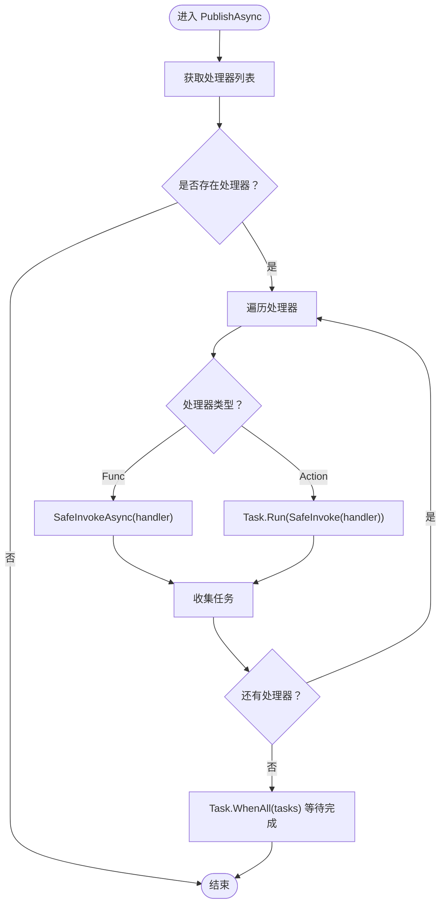
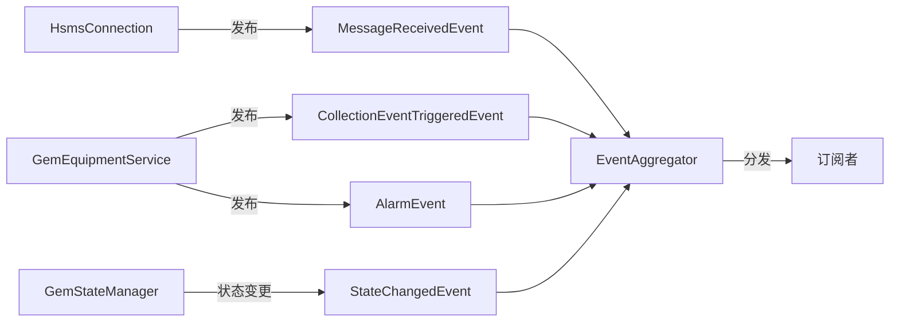

# 事件驱动架构

<cite>
**本文引用的文件**
- [IGemEvent.cs](file://WebGem/SECS2GEM/Domain/Events/IGemEvent.cs)
- [EventAggregator.cs](file://WebGem/SECS2GEM/Infrastructure/Services/EventAggregator.cs)
- [IEventAggregator.cs](file://WebGem/SECS2GEM/Domain/Interfaces/IEventAggregator.cs)
- [AlarmEvent.cs](file://WebGem/SECS2GEM/Domain/Events/AlarmEvent.cs)
- [StateChangedEvent.cs](file://WebGem/SECS2GEM/Domain/Events/StateChangedEvent.cs)
- [CollectionEventTriggeredEvent.cs](file://WebGem/SECS2GEM/Domain/Events/CollectionEventTriggeredEvent.cs)
- [MessageReceivedEvent.cs](file://WebGem/SECS2GEM/Domain/Events/MessageReceivedEvent.cs)
- [GemStateManager.cs](file://WebGem/SECS2GEM/Application/State/GemStateManager.cs)
- [HsmsConnection.cs](file://WebGem/SECS2GEM/Infrastructure/Connection/HsmsConnection.cs)
- [GemEquipmentService.cs](file://WebGem/SECS2GEM/Application/Services/GemEquipmentService.cs)
- [EventReport.cs](file://WebGem/SECS2GEM/Domain/Models/EventReport.cs)
- [MessageLogger.cs](file://WebGem/SECS2GEM/Infrastructure/Logging/MessageLogger.cs)
</cite>

## 目录
1. [简介](#简介)
2. [项目结构](#项目结构)
3. [核心组件](#核心组件)
4. [架构总览](#架构总览)
5. [详细组件分析](#详细组件分析)
6. [依赖分析](#依赖分析)
7. [性能考量](#性能考量)
8. [故障排查指南](#故障排查指南)
9. [结论](#结论)
10. [附录](#附录)

## 简介
本文件系统性阐述 SECS2GEM 项目中的事件驱动架构，重点覆盖事件接口定义（IGemEvent）与事件聚合器（EventAggregator）的设计与实现；详解多种事件类型（AlarmEvent、StateChangedEvent、CollectionEventTriggeredEvent、MessageReceivedEvent）及其在消息处理与状态管理中的应用；并提供事件发布-订阅模式的实现细节、最佳实践与性能优化建议。

## 项目结构
事件系统横跨领域层（Domain）、基础设施层（Infrastructure）与应用层（Application），形成清晰的分层职责：
- 领域层：定义事件接口与具体事件类型，确保业务语义与类型安全。
- 基础设施层：提供事件聚合器实现，负责订阅管理、异步/同步发布与异常隔离。
- 应用层：在设备服务与连接组件中触发事件，驱动状态变更与消息处理。

```mermaid
graph TB
subgraph "领域层(Domain)"
IEvt["IGemEvent 接口"]
EAlarm["AlarmEvent 报警事件"]
EState["StateChangedEvent 状态变更事件"]
ECol["CollectionEventTriggeredEvent 采集事件"]
EMsg["MessageReceivedEvent 消息接收事件"]
end
subgraph "基础设施层(Infrastructure)"
IAggr["IEventAggregator 接口"]
Aggr["EventAggregator 实现"]
Conn["HsmsConnection 连接组件"]
EqSvc["GemEquipmentService 设备服务"]
Log["MessageLogger 日志器"]
end
subgraph "应用层(Application)"
StateMgr["GemStateManager 状态管理器"]
end
IEvt --> EAlarm
IEvt --> EState
IEvt --> ECol
IEvt --> EMgs
IAggr --> Aggr
Aggr <- --> Conn
Aggr <- --> EqSvc
Aggr <- --> StateMgr
Conn --> EMgs
EqSvc --> ECol
EqSvc --> EAlarm
StateMgr --> EState
Conn --> Log
```

图表来源
- [IGemEvent.cs:10-50](file://WebGem/SECS2GEM/Domain/Events/IGemEvent.cs#L10-L50)
- [IEventAggregator.cs:22-65](file://WebGem/SECS2GEM/Domain/Interfaces/IEventAggregator.cs#L22-L65)
- [EventAggregator.cs:17-219](file://WebGem/SECS2GEM/Infrastructure/Services/EventAggregator.cs#L17-L219)
- [GemStateManager.cs:22-492](file://WebGem/SECS2GEM/Application/State/GemStateManager.cs#L22-L492)
- [HsmsConnection.cs:30-800](file://WebGem/SECS2GEM/Infrastructure/Connection/HsmsConnection.cs#L30-L800)
- [GemEquipmentService.cs:242,291:242-291](file://WebGem/SECS2GEM/Application/Services/GemEquipmentService.cs#L242-L291)

章节来源
- [IGemEvent.cs:10-50](file://WebGem/SECS2GEM/Domain/Events/IGemEvent.cs#L10-L50)
- [IEventAggregator.cs:22-65](file://WebGem/SECS2GEM/Domain/Interfaces/IEventAggregator.cs#L22-L65)
- [EventAggregator.cs:17-219](file://WebGem/SECS2GEM/Infrastructure/Services/EventAggregator.cs#L17-L219)
- [GemStateManager.cs:22-492](file://WebGem/SECS2GEM/Application/State/GemStateManager.cs#L22-L492)
- [HsmsConnection.cs:30-800](file://WebGem/SECS2GEM/Infrastructure/Connection/HsmsConnection.cs#L30-L800)
- [GemEquipmentService.cs:242,291:242-291](file://WebGem/SECS2GEM/Application/Services/GemEquipmentService.cs#L242-L291)

## 核心组件
- 事件接口与基类
  - IGemEvent：统一事件的时间戳与来源标识约束。
  - GemEventBase：提供统一构造与默认属性，便于派生事件共享行为。
- 事件聚合器
  - IEventAggregator：定义异步/同步发布、订阅与清理接口。
  - EventAggregator：基于并发字典维护订阅者列表，支持异步/同步处理器，异常隔离，提供 IDisposable 取消订阅。
- 事件类型
  - AlarmEvent：设备报警/清除事件，包含报警ID、报警码与文本。
  - StateChangedEvent：状态变更事件，区分通信/控制/处理状态类型。
  - CollectionEventTriggeredEvent：采集事件触发，携带数据ID、事件ID、事件名与报告数据。
  - MessageReceivedEvent：消息接收事件，包含消息体、方向、系统字节与远端信息。

章节来源
- [IGemEvent.cs:10-50](file://WebGem/SECS2GEM/Domain/Events/IGemEvent.cs#L10-L50)
- [IEventAggregator.cs:22-65](file://WebGem/SECS2GEM/Domain/Interfaces/IEventAggregator.cs#L22-L65)
- [EventAggregator.cs:17-219](file://WebGem/SECS2GEM/Infrastructure/Services/EventAggregator.cs#L17-L219)
- [AlarmEvent.cs:12-56](file://WebGem/SECS2GEM/Domain/Events/AlarmEvent.cs#L12-L56)
- [StateChangedEvent.cs:11-110](file://WebGem/SECS2GEM/Domain/Events/StateChangedEvent.cs#L11-L110)
- [CollectionEventTriggeredEvent.cs:9-101](file://WebGem/SECS2GEM/Domain/Events/CollectionEventTriggeredEvent.cs#L9-L101)
- [MessageReceivedEvent.cs:12-67](file://WebGem/SECS2GEM/Domain/Events/MessageReceivedEvent.cs#L12-L67)

## 架构总览
事件驱动架构采用观察者模式，通过事件聚合器实现发布-订阅解耦。消息层与状态层分别在合适时机发布事件，订阅者异步处理，互不影响。



图表来源
- [EventAggregator.cs:25-67](file://WebGem/SECS2GEM/Infrastructure/Services/EventAggregator.cs#L25-L67)
- [MessageReceivedEvent.cs:12-67](file://WebGem/SECS2GEM/Domain/Events/MessageReceivedEvent.cs#L12-L67)

## 详细组件分析

### 事件接口与基类（IGemEvent 与 GemEventBase）
- 设计要点
  - 统一时间戳与来源标识，便于审计与追踪。
  - 基类提供构造器，支持默认 UTC 时间与自定义时间戳。
- 类图



图表来源
- [IGemEvent.cs:10-50](file://WebGem/SECS2GEM/Domain/Events/IGemEvent.cs#L10-L50)
- [AlarmEvent.cs:12-56](file://WebGem/SECS2GEM/Domain/Events/AlarmEvent.cs#L12-L56)
- [StateChangedEvent.cs:11-110](file://WebGem/SECS2GEM/Domain/Events/StateChangedEvent.cs#L11-L110)
- [CollectionEventTriggeredEvent.cs:9-101](file://WebGem/SECS2GEM/Domain/Events/CollectionEventTriggeredEvent.cs#L9-L101)
- [MessageReceivedEvent.cs:12-67](file://WebGem/SECS2GEM/Domain/Events/MessageReceivedEvent.cs#L12-L67)

章节来源
- [IGemEvent.cs:10-50](file://WebGem/SECS2GEM/Domain/Events/IGemEvent.cs#L10-L50)
- [AlarmEvent.cs:12-56](file://WebGem/SECS2GEM/Domain/Events/AlarmEvent.cs#L12-L56)
- [StateChangedEvent.cs:11-110](file://WebGem/SECS2GEM/Domain/Events/StateChangedEvent.cs#L11-L110)
- [CollectionEventTriggeredEvent.cs:9-101](file://WebGem/SECS2GEM/Domain/Events/CollectionEventTriggeredEvent.cs#L9-L101)
- [MessageReceivedEvent.cs:12-67](file://WebGem/SECS2GEM/Domain/Events/MessageReceivedEvent.cs#L12-L67)

### 事件聚合器（IEventAggregator 与 EventAggregator）
- 功能特性
  - 支持泛型事件类型约束，保证类型安全。
  - 同步/异步发布：异步发布等待全部处理器完成；同步发布启动后台任务但不阻塞。
  - 订阅管理：返回 IDisposable 以便取消订阅；支持按类型清理。
  - 异常隔离：每个处理器异常被捕获，不影响其他订阅者。
- 流程图（异步发布）



图表来源
- [EventAggregator.cs:25-67](file://WebGem/SECS2GEM/Infrastructure/Services/EventAggregator.cs#L25-L67)
- [EventAggregator.cs:170-197](file://WebGem/SECS2GEM/Infrastructure/Services/EventAggregator.cs#L170-L197)

章节来源
- [IEventAggregator.cs:22-65](file://WebGem/SECS2GEM/Domain/Interfaces/IEventAggregator.cs#L22-L65)
- [EventAggregator.cs:17-219](file://WebGem/SECS2GEM/Infrastructure/Services/EventAggregator.cs#L17-L219)

### 报警事件（AlarmEvent）
- 用途：设备报警/清除事件，对应 S5F1 消息。
- 关键字段：报警ID、报警码（含 Set/Clear 位与类别）、报警文本。
- 行为：通过位运算判断是否为报警触发或清除，提取报警类别。

章节来源
- [AlarmEvent.cs:12-56](file://WebGem/SECS2GEM/Domain/Events/AlarmEvent.cs#L12-L56)

### 状态变更事件（StateChangedEvent）
- 用途：GEM 状态机状态变化通知。
- 类型细分：通信状态、控制状态、处理状态与连接状态。
- 字段：状态类型、旧值、新值、变更原因。

章节来源
- [StateChangedEvent.cs:11-110](file://WebGem/SECS2GEM/Domain/Events/StateChangedEvent.cs#L11-L110)

### 采集事件（CollectionEventTriggeredEvent）
- 用途：S6F11 事件报告触发。
- 关键字段：数据ID、采集事件ID、事件名、报告数据集合。
- 报告数据与变量值：封装 RPTID、VID、变量名与值。

章节来源
- [CollectionEventTriggeredEvent.cs:9-101](file://WebGem/SECS2GEM/Domain/Events/CollectionEventTriggeredEvent.cs#L9-L101)
- [EventReport.cs:10-159](file://WebGem/SECS2GEM/Domain/Models/EventReport.cs#L10-L159)

### 消息接收事件（MessageReceivedEvent）
- 用途：消息接收通知，可用于日志记录与消息拦截。
- 字段：消息体、方向（接收/发送）、系统字节、远端端点。

章节来源
- [MessageReceivedEvent.cs:12-67](file://WebGem/SECS2GEM/Domain/Events/MessageReceivedEvent.cs#L12-L67)

### 事件发布-订阅模式与处理机制
- 发布侧
  - HsmsConnection 在接收消息后发布 MessageReceivedEvent。
  - GemEquipmentService 在采集事件触发与报警产生时发布相应事件。
- 订阅侧
  - 订阅者通过 EventAggregator.Subscribe 注册处理器，返回 IDisposable 以便取消订阅。
  - 订阅者可为异步（Func<TEvent, Task>）或同步（Action<TEvent>）。
- 分发与处理
  - EventAggregator 按事件类型复制处理器列表，避免并发修改。
  - 异常隔离：每个处理器异常被捕获，不影响其他订阅者。

章节来源
- [HsmsConnection.cs:549-610](file://WebGem/SECS2GEM/Infrastructure/Connection/HsmsConnection.cs#L549-L610)
- [GemEquipmentService.cs:242,291:242-291](file://WebGem/SECS2GEM/Application/Services/GemEquipmentService.cs#L242-L291)
- [EventAggregator.cs:71-83](file://WebGem/SECS2GEM/Infrastructure/Services/EventAggregator.cs#L71-L83)
- [EventAggregator.cs:152-165](file://WebGem/SECS2GEM/Infrastructure/Services/EventAggregator.cs#L152-L165)

### 实际事件处理示例（路径指引）
以下为常见事件订阅与处理的代码位置指引（请在对应文件中查看具体实现）：
- 订阅消息接收事件
  - [EventAggregator.cs:71-83](file://WebGem/SECS2GEM/Infrastructure/Services/EventAggregator.cs#L71-L83)
  - [HsmsConnection.cs:549-610](file://WebGem/SECS2GEM/Infrastructure/Connection/HsmsConnection.cs#L549-L610)
- 订阅采集事件
  - [EventAggregator.cs:71-83](file://WebGem/SECS2GEM/Infrastructure/Services/EventAggregator.cs#L71-L83)
  - [GemEquipmentService.cs:242](file://WebGem/SECS2GEM/Application/Services/GemEquipmentService.cs#L242)
- 订阅报警事件
  - [EventAggregator.cs:71-83](file://WebGem/SECS2GEM/Infrastructure/Services/EventAggregator.cs#L71-L83)
  - [GemEquipmentService.cs:291](file://WebGem/SECS2GEM/Application/Services/GemEquipmentService.cs#L291)
- 订阅状态变更事件
  - [EventAggregator.cs:71-83](file://WebGem/SECS2GEM/Infrastructure/Services/EventAggregator.cs#L71-L83)
  - [GemStateManager.cs:86,91:86-91](file://WebGem/SECS2GEM/Application/State/GemStateManager.cs#L86-L91)

## 依赖分析
- 低耦合高内聚
  - 事件接口与聚合器接口位于领域层与接口层，实现位于基础设施层，避免上层直连实现细节。
- 关键依赖链
  - HsmsConnection 依赖 EventAggregator 发布 MessageReceivedEvent。
  - GemEquipmentService 依赖 EventAggregator 发布 CollectionEventTriggeredEvent 与 AlarmEvent。
  - GemStateManager 通过事件通知状态变化（事件与状态管理器之间存在事件通知，但事件聚合器用于跨组件解耦）。
- 并发与线程模型
  - EventAggregator 使用并发字典与锁保护订阅列表，异步发布使用 Task.WhenAll 并行执行。
  - HsmsConnection 的接收/发送/心跳采用独立后台任务，避免阻塞主流程。



图表来源
- [HsmsConnection.cs:549-610](file://WebGem/SECS2GEM/Infrastructure/Connection/HsmsConnection.cs#L549-L610)
- [GemEquipmentService.cs:242,291:242-291](file://WebGem/SECS2GEM/Application/Services/GemEquipmentService.cs#L242-L291)
- [GemStateManager.cs:86,91:86-91](file://WebGem/SECS2GEM/Application/State/GemStateManager.cs#L86-L91)
- [EventAggregator.cs:25-67](file://WebGem/SECS2GEM/Infrastructure/Services/EventAggregator.cs#L25-L67)

章节来源
- [HsmsConnection.cs:549-610](file://WebGem/SECS2GEM/Infrastructure/Connection/HsmsConnection.cs#L549-L610)
- [GemEquipmentService.cs:242,291:242-291](file://WebGem/SECS2GEM/Application/Services/GemEquipmentService.cs#L242-L291)
- [GemStateManager.cs:86,91:86-91](file://WebGem/SECS2GEM/Application/State/GemStateManager.cs#L86-L91)
- [EventAggregator.cs:25-67](file://WebGem/SECS2GEM/Infrastructure/Services/EventAggregator.cs#L25-L67)

## 性能考量
- 异步优先：优先使用 PublishAsync 以充分利用并行处理能力，避免阻塞。
- 异常隔离：处理器异常被捕获，不影响其他订阅者，提升整体稳定性。
- 订阅管理：及时取消不再需要的订阅，避免内存泄漏与无效分发。
- 并发安全：EventAggregator 对订阅列表进行复制与加锁，避免并发修改导致的异常。
- I/O 解耦：消息日志器采用异步写入队列，避免阻塞通信线程。

章节来源
- [EventAggregator.cs:25-67](file://WebGem/SECS2GEM/Infrastructure/Services/EventAggregator.cs#L25-L67)
- [MessageLogger.cs:176-223](file://WebGem/SECS2GEM/Infrastructure/Logging/MessageLogger.cs#L176-L223)

## 故障排查指南
- 订阅未生效
  - 检查订阅类型是否正确，确认事件类型与处理器签名匹配。
  - 确认订阅返回的 IDisposable 未提前 Dispose。
- 处理器异常
  - EventAggregator 已捕获异常，不影响其他订阅者；可在订阅者内部增加日志记录定位问题。
- 性能问题
  - 大量同步处理器会阻塞主线程；建议改为异步处理器或使用后台任务。
  - 避免在处理器中执行耗时操作，必要时委托给专用服务或队列。
- 日志与可观测性
  - 使用 MessageLogger 记录消息收发，结合事件聚合器日志定位问题。

章节来源
- [EventAggregator.cs:170-197](file://WebGem/SECS2GEM/Infrastructure/Services/EventAggregator.cs#L170-L197)
- [MessageLogger.cs:99-145](file://WebGem/SECS2GEM/Infrastructure/Logging/MessageLogger.cs#L99-L145)

## 结论
SECS2GEM 的事件驱动架构通过 IGemEvent 与 EventAggregator 实现了清晰的发布-订阅解耦，使消息处理与状态管理具备良好的扩展性与稳定性。合理使用异步处理器、及时清理订阅以及借助日志器与异常隔离策略，可进一步提升系统性能与可维护性。

## 附录
- 事件类型速览
  - AlarmEvent：设备报警/清除
  - StateChangedEvent：通信/控制/处理状态变更
  - CollectionEventTriggeredEvent：采集事件触发
  - MessageReceivedEvent：消息接收通知
- 关键实现位置
  - 事件接口与基类：[IGemEvent.cs:10-50](file://WebGem/SECS2GEM/Domain/Events/IGemEvent.cs#L10-L50)
  - 事件聚合器接口与实现：[IEventAggregator.cs:22-65](file://WebGem/SECS2GEM/Domain/Interfaces/IEventAggregator.cs#L22-L65)，[EventAggregator.cs:17-219](file://WebGem/SECS2GEM/Infrastructure/Services/EventAggregator.cs#L17-L219)
  - 事件类型定义：[AlarmEvent.cs:12-56](file://WebGem/SECS2GEM/Domain/Events/AlarmEvent.cs#L12-L56)，[StateChangedEvent.cs:11-110](file://WebGem/SECS2GEM/Domain/Events/StateChangedEvent.cs#L11-L110)，[CollectionEventTriggeredEvent.cs:9-101](file://WebGem/SECS2GEM/Domain/Events/CollectionEventTriggeredEvent.cs#L9-L101)，[MessageReceivedEvent.cs:12-67](file://WebGem/SECS2GEM/Domain/Events/MessageReceivedEvent.cs#L12-L67)
  - 状态管理器：[GemStateManager.cs:22-492](file://WebGem/SECS2GEM/Application/State/GemStateManager.cs#L22-L492)
  - 连接组件与消息处理：[HsmsConnection.cs:30-800](file://WebGem/SECS2GEM/Infrastructure/Connection/HsmsConnection.cs#L30-L800)
  - 设备服务事件发布：[GemEquipmentService.cs:242-291](file://WebGem/SECS2GEM/Application/Services/GemEquipmentService.cs#L242-L291)
  - 事件报告模型：[EventReport.cs:10-159](file://WebGem/SECS2GEM/Domain/Models/EventReport.cs#L10-L159)
  - 消息日志器：[MessageLogger.cs:23-438](file://WebGem/SECS2GEM/Infrastructure/Logging/MessageLogger.cs#L23-L438)