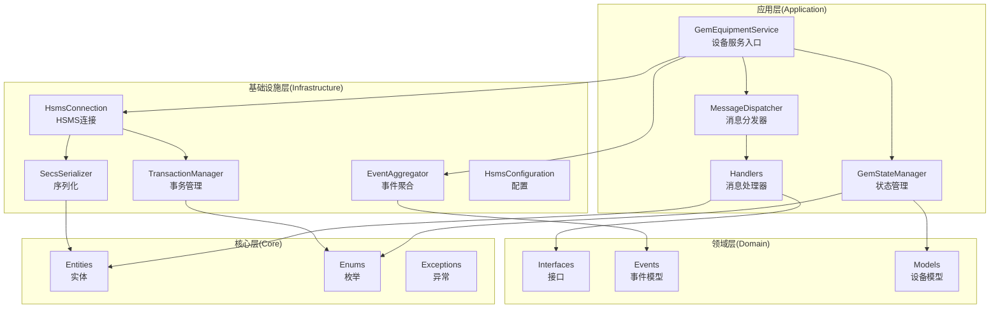
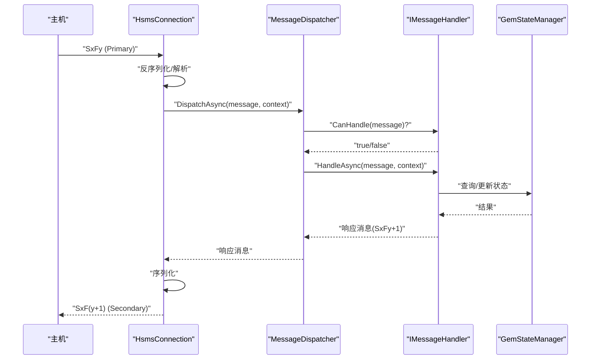
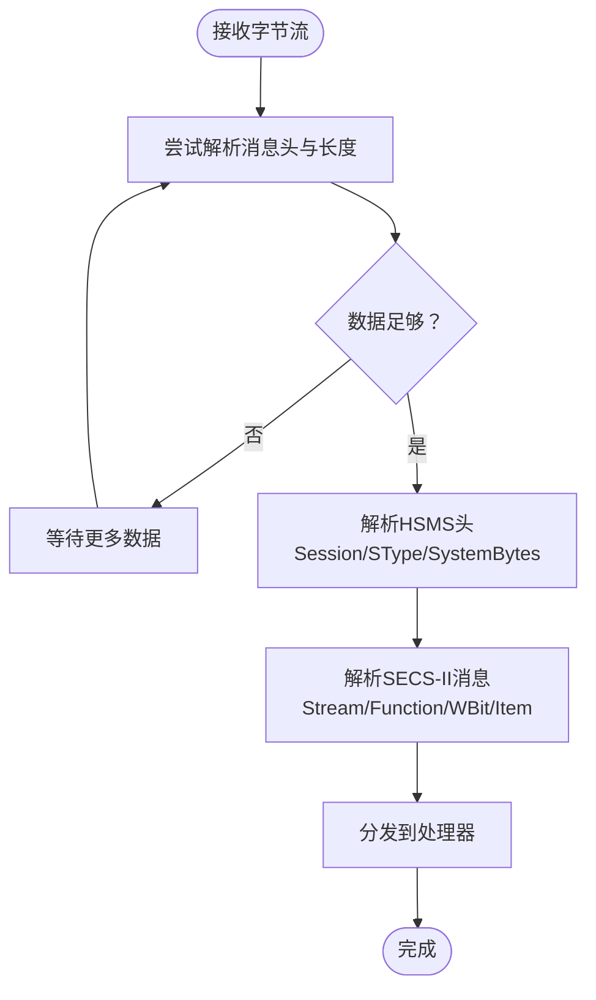
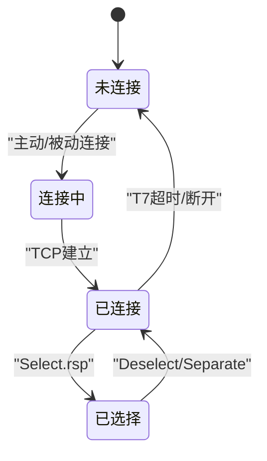
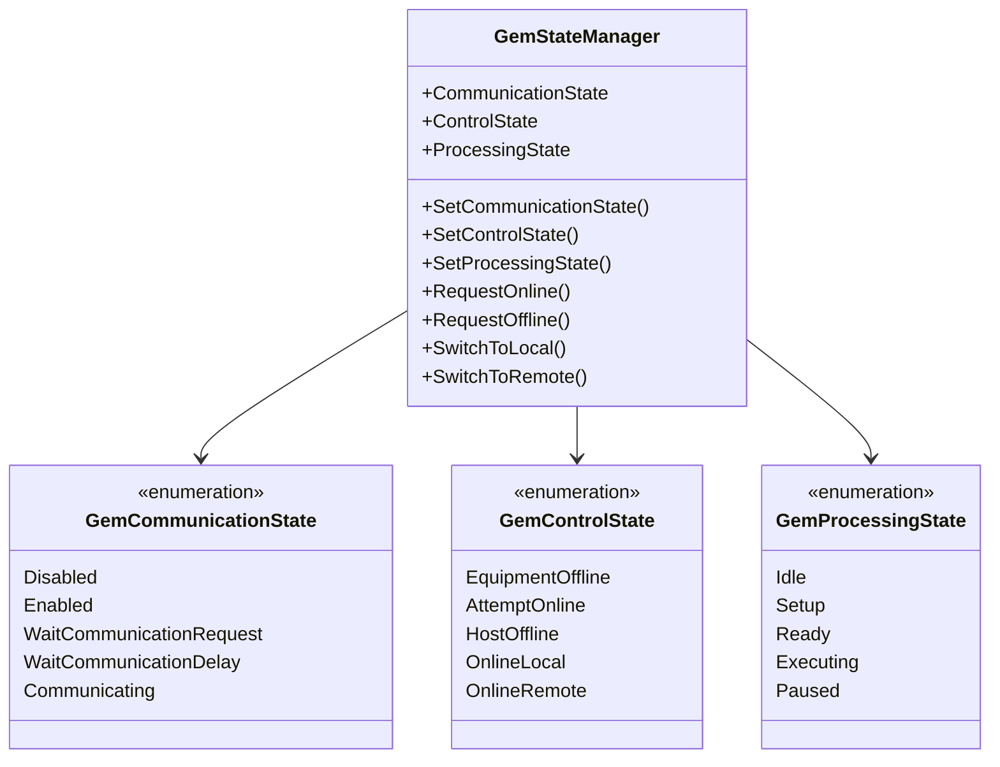
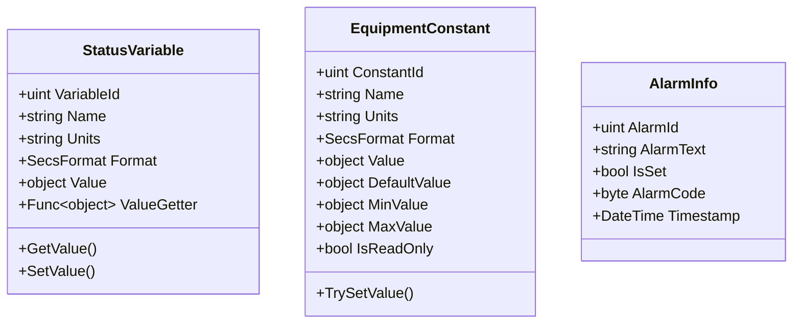
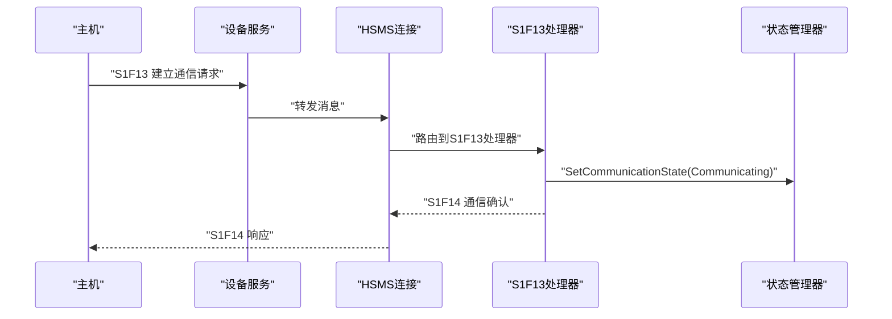
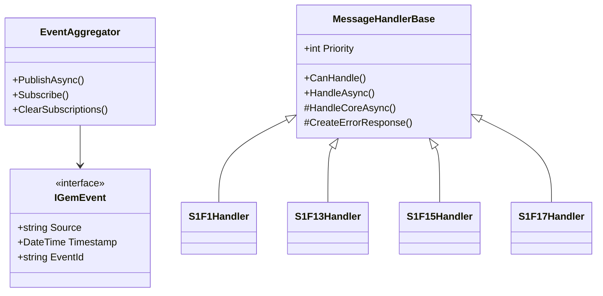
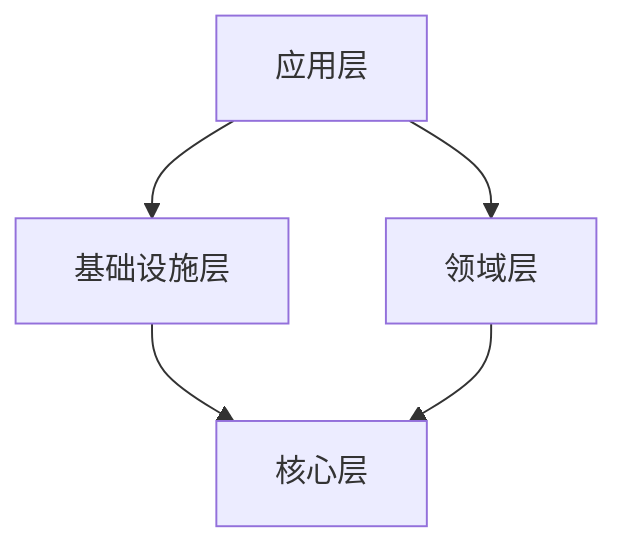

# 核心概念

<cite>
**本文引用的文件**
- [GEM协议规范文档.md](file://WebGem/SECS2GEM/GEM_Protocol_Specification.md)
- [SECS2GEM 类图.md](file://WebGem/SECS2GEM/SECS2GEM_Class_Diagram.md)
- [GemStates.cs](file://WebGem/SECS2GEM/Core/Enums/GemStates.cs)
- [ConnectionState.cs](file://WebGem/SECS2GEM/Core/Enums/ConnectionState.cs)
- [HsmsMessageType.cs](file://WebGem/SECS2GEM/Core/Enums/HsmsMessageType.cs)
- [StatusVariable.cs](file://WebGem/SECS2GEM/Domain/Models/StatusVariable.cs)
- [EquipmentConstant.cs](file://WebGem/SECS2GEM/Domain/Models/EquipmentConstant.cs)
- [AlarmInfo.cs](file://WebGem/SECS2GEM/Domain/Models/AlarmInfo.cs)
- [HsmsConfiguration.cs](file://WebGem/SECS2GEM/Infrastructure/Configuration/HsmsConfiguration.cs)
- [GemEquipmentService.cs](file://WebGem/SECS2GEM/Application/Services/GemEquipmentService.cs)
- [GemStateManager.cs](file://WebGem/SECS2GEM/Application/State/GemStateManager.cs)
- [SecsMessage.cs](file://WebGem/SECS2GEM/Core/Entities/SecsMessage.cs)
- [SecsItem.cs](file://WebGem/SECS2GEM/Core/Entities/SecsItem.cs)
- [HsmsConnection.cs](file://WebGem/SECS2GEM/Infrastructure/Connection/HsmsConnection.cs)
- [StreamOneHandlers.cs](file://WebGem/SECS2GEM/Application/Handlers/StreamOneHandlers.cs)
</cite>

## 目录
1. [简介](#简介)
2. [项目结构](#项目结构)
3. [核心组件](#核心组件)
4. [架构总览](#架构总览)
5. [详细组件分析](#详细组件分析)
6. [依赖关系分析](#依赖关系分析)
7. [性能考量](#性能考量)
8. [故障排查指南](#故障排查指南)
9. [结论](#结论)
10. [附录](#附录)

## 简介
本文件面向初学者与高级用户，系统阐述SECS-II/GEM项目的工业通信核心概念，包括：
- SECS-II协议基础与消息结构
- GEM通用设备模型与状态机
- HSMS传输机制与连接状态
- Stream/Function消息分类体系
- 设备常量、状态变量与报警系统
- 事件驱动架构与消息处理流程
- 协议规范摘要与代码示例路径

目标是帮助读者快速理解工业自动化通信的基本原理，并掌握本项目在各层面的具体实现。

## 项目结构
项目采用分层架构，清晰划分核心域、基础设施、应用与领域层，配合事件聚合与消息分发，形成松耦合、可扩展的设备通信框架。

图表来源
- [SECS2GEM 类图.md:630-667](file://WebGem/SECS2GEM/SECS2GEM_Class_Diagram.md#L630-L667)

章节来源
- [SECS2GEM 类图.md:630-667](file://WebGem/SECS2GEM/SECS2GEM_Class_Diagram.md#L630-L667)

## 核心组件
- 设备服务入口：负责生命周期管理、连接启动/停止、消息发送与事件发布。
- 状态管理器：封装GEM三态模型（通信/控制/处理），提供状态转换与查询。
- HSMS连接：抽象TCP/HSMS传输，维护连接状态、事务与心跳。
- 消息分发器：基于Stream/Function路由消息至对应处理器。
- 消息处理器：实现具体业务逻辑，如S1F1/S1F13等。
- 实体与模型：SECS-II消息/数据项、状态变量、设备常量、报警信息等。

章节来源
- [GemEquipmentService.cs:33-133](file://WebGem/SECS2GEM/Application/Services/GemEquipmentService.cs#L33-L133)
- [GemStateManager.cs:22-107](file://WebGem/SECS2GEM/Application/State/GemStateManager.cs#L22-L107)
- [HsmsConnection.cs:30-139](file://WebGem/SECS2GEM/Infrastructure/Connection/HsmsConnection.cs#L30-L139)
- [SecsMessage.cs:18-104](file://WebGem/SECS2GEM/Core/Entities/SecsMessage.cs#L18-L104)
- [SecsItem.cs:23-67](file://WebGem/SECS2GEM/Core/Entities/SecsItem.cs#L23-L67)

## 架构总览
下图展示从应用层到基础设施层的消息处理主路径：Host发起消息，经HSMS连接解包，交由消息分发器路由，处理器读取状态管理器数据并生成响应，最后通过连接层序列化回传。

图表来源
- [SECS2GEM 类图.md:669-695](file://WebGem/SECS2GEM/SECS2GEM_Class_Diagram.md#L669-L695)
- [HsmsConnection.cs:727-800](file://WebGem/SECS2GEM/Infrastructure/Connection/HsmsConnection.cs#L727-L800)
- [GemEquipmentService.cs:340-358](file://WebGem/SECS2GEM/Application/Services/GemEquipmentService.cs#L340-L358)

章节来源
- [SECS2GEM 类图.md:669-695](file://WebGem/SECS2GEM/SECS2GEM_Class_Diagram.md#L669-L695)
- [HsmsConnection.cs:727-800](file://WebGem/SECS2GEM/Infrastructure/Connection/HsmsConnection.cs#L727-L800)
- [GemEquipmentService.cs:340-358](file://WebGem/SECS2GEM/Application/Services/GemEquipmentService.cs#L340-L358)

## 详细组件分析

### SECS-II协议基础与消息结构
- Stream/Function：消息类别与功能编号，奇数为主消息（请求），偶数为辅消息（响应）。
- W-Bit：指示是否期望回复；Primary消息通常置1。
- 数据项（Item）：采用TLV结构，格式码+长度字节+数据，支持List嵌套。
- SML：结构化消息语言，便于调试与可视化。

图表来源
- [HsmsConnection.cs:550-610](file://WebGem/SECS2GEM/Infrastructure/Connection/HsmsConnection.cs#L550-L610)
- [SecsMessage.cs:18-104](file://WebGem/SECS2GEM/Core/Entities/SecsMessage.cs#L18-L104)
- [SecsItem.cs:23-67](file://WebGem/SECS2GEM/Core/Entities/SecsItem.cs#L23-L67)

章节来源
- [SecsMessage.cs:18-104](file://WebGem/SECS2GEM/Core/Entities/SecsMessage.cs#L18-L104)
- [SecsItem.cs:23-67](file://WebGem/SECS2GEM/Core/Entities/SecsItem.cs#L23-L67)
- [GEM协议规范文档.md:202-312](file://WebGem/SECS2GEM/GEM_Protocol_Specification.md#L202-L312)

### HSMS传输机制与连接状态
- HSMS消息头包含Session ID、SType、System Bytes等字段；SType区分数据/控制消息。
- 连接状态机：NOT CONNECTED → CONNECTED → SELECTED；支持Select/Deselect/Linktest/Separate等控制消息。
- 超时参数：T3（回复超时）、T6（控制事务超时）、T7（未选择超时）、T8（字符间隔超时）。

图表来源
- [HsmsMessageType.cs:10-66](file://WebGem/SECS2GEM/Core/Enums/HsmsMessageType.cs#L10-L66)
- [ConnectionState.cs:10-41](file://WebGem/SECS2GEM/Core/Enums/ConnectionState.cs#L10-L41)
- [GEM协议规范文档.md:138-172](file://WebGem/SECS2GEM/GEM_Protocol_Specification.md#L138-L172)

章节来源
- [HsmsMessageType.cs:10-66](file://WebGem/SECS2GEM/Core/Enums/HsmsMessageType.cs#L10-L66)
- [ConnectionState.cs:10-41](file://WebGem/SECS2GEM/Core/Enums/ConnectionState.cs#L10-L41)
- [HsmsConnection.cs:146-186](file://WebGem/SECS2GEM/Infrastructure/Connection/HsmsConnection.cs#L146-L186)
- [GEM协议规范文档.md:138-172](file://WebGem/SECS2GEM/GEM_Protocol_Specification.md#L138-L172)

### GEM状态模型与状态机
- 通信状态：Disabled/Enabled/WaitCommunicationRequest/WaitCommunicationDelay/Communicating。
- 控制状态：EquipmentOffline/AttemptOnline/HostOffline/OnlineLocal/OnlineRemote。
- 处理状态：Idle/Setup/Ready/Executing/Paused。
- 状态转换具备有效性校验，避免非法跳转。

图表来源
- [GemStateManager.cs:22-107](file://WebGem/SECS2GEM/Application/State/GemStateManager.cs#L22-L107)
- [GemStates.cs:10-120](file://WebGem/SECS2GEM/Core/Enums/GemStates.cs#L10-L120)

章节来源
- [GemStateManager.cs:196-350](file://WebGem/SECS2GEM/Application/State/GemStateManager.cs#L196-L350)
- [GemStates.cs:10-120](file://WebGem/SECS2GEM/Core/Enums/GemStates.cs#L10-L120)
- [GEM协议规范文档.md:542-614](file://WebGem/SECS2GEM/GEM_Protocol_Specification.md#L542-L614)

### 设备常量、状态变量与报警系统
- 状态变量（SV）：设备实时状态，可通过S1F3/S1F4查询，S6F11事件上报。
- 设备常量（EC）：设备配置参数，S2F13/S2F14查询，S2F15/S2F16设置。
- 报警（S5F1）：包含报警ID、文本、类别与Set/Clear标志，支持定义与启用。

图表来源
- [StatusVariable.cs:12-60](file://WebGem/SECS2GEM/Domain/Models/StatusVariable.cs#L12-L60)
- [EquipmentConstant.cs:12-122](file://WebGem/SECS2GEM/Domain/Models/EquipmentConstant.cs#L12-L122)
- [AlarmInfo.cs:8-81](file://WebGem/SECS2GEM/Domain/Models/AlarmInfo.cs#L8-L81)

章节来源
- [StatusVariable.cs:12-60](file://WebGem/SECS2GEM/Domain/Models/StatusVariable.cs#L12-L60)
- [EquipmentConstant.cs:12-122](file://WebGem/SECS2GEM/Domain/Models/EquipmentConstant.cs#L12-L122)
- [AlarmInfo.cs:8-81](file://WebGem/SECS2GEM/Domain/Models/AlarmInfo.cs#L8-L81)

### Stream/Function消息分类与典型流程
- S1：设备状态（S1F1/S1F2、S1F13/S1F14、S1F15/S1F16、S1F17/S1F18）。
- S2：设备控制（S2F13/S2F14、S2F15/S2F16、S2F29、S2F33/35/37、S2F41/49）。
- S5：异常处理（S5F1报警、S5F2确认、S5F3/S5F5/S5F7启用/禁用）。
- S6：数据采集（S6F11事件报告、S6F15/S6F19）。
- S7：配方管理（S7F1/S7F2/S7F3/S7F4/S7F5/S7F6/S7F17/S7F19）。
- S9：系统错误（S9F1/S9F3/S9F5/S9F7/S9F9）。
- S10：终端服务（S10F3/S10F5）。

图表来源
- [StreamOneHandlers.cs:122-148](file://WebGem/SECS2GEM/Application/Handlers/StreamOneHandlers.cs#L122-L148)
- [GemEquipmentService.cs:340-358](file://WebGem/SECS2GEM/Application/Services/GemEquipmentService.cs#L340-L358)

章节来源
- [StreamOneHandlers.cs:88-211](file://WebGem/SECS2GEM/Application/Handlers/StreamOneHandlers.cs#L88-L211)
- [GEM协议规范文档.md:750-768](file://WebGem/SECS2GEM/GEM_Protocol_Specification.md#L750-L768)

### 事件驱动架构与消息处理流程
- 事件聚合：通过EventAggregator发布/订阅设备事件（状态变更、消息收发、报警、事件触发）。
- 处理器优先级：MessageHandlerBase定义优先级，便于扩展与覆盖。
- 错误处理：处理器捕获异常并按需返回S9F7等错误消息。

图表来源
- [SECS2GEM 类图.md:480-535](file://WebGem/SECS2GEM/SECS2GEM_Class_Diagram.md#L480-L535)
- [StreamOneHandlers.cs:20-86](file://WebGem/SECS2GEM/Application/Handlers/StreamOneHandlers.cs#L20-L86)

章节来源
- [SECS2GEM 类图.md:480-535](file://WebGem/SECS2GEM/SECS2GEM_Class_Diagram.md#L480-L535)
- [GemEquipmentService.cs:319-400](file://WebGem/SECS2GEM/Application/Services/GemEquipmentService.cs#L319-L400)

### 协议规范摘要与代码示例路径
- SECS-II消息格式与数据项编码规则、长度字节选择策略、示例解析。
- HSMS消息头字段、SType定义、连接状态机与超时参数。
- GEM状态模型与消息流程（建立通信、状态查询、报警处理、事件报告、配方管理、远程命令）。

章节来源
- [GEM协议规范文档.md:202-312](file://WebGem/SECS2GEM/GEM_Protocol_Specification.md#L202-L312)
- [GEM协议规范文档.md:314-407](file://WebGem/SECS2GEM/GEM_Protocol_Specification.md#L314-L407)
- [GEM协议规范文档.md:410-455](file://WebGem/SECS2GEM/GEM_Protocol_Specification.md#L410-L455)
- [GEM协议规范文档.md:542-614](file://WebGem/SECS2GEM/GEM_Protocol_Specification.md#L542-L614)
- [GEM协议规范文档.md:617-747](file://WebGem/SECS2GEM/GEM_Protocol_Specification.md#L617-L747)

## 依赖关系分析
- 应用层依赖基础设施层（连接、序列化、事务、事件聚合）与领域层（接口、事件、模型）。
- 基础设施层依赖核心层（实体、枚举、异常）。
- 处理器依赖状态管理器与上下文接口，实现业务逻辑。

图表来源
- [SECS2GEM 类图.md:630-667](file://WebGem/SECS2GEM/SECS2GEM_Class_Diagram.md#L630-L667)

章节来源
- [SECS2GEM 类图.md:630-667](file://WebGem/SECS2GEM/SECS2GEM_Class_Diagram.md#L630-L667)

## 性能考量
- 异步I/O与通道：发送队列使用无界通道，避免阻塞；接收循环持续读取并增量解析，减少内存拷贝。
- 心跳与超时：Linktest周期性探测，失败累计超过阈值自动断开，保障连接健康。
- 缓冲区与消息大小：可配置接收/发送缓冲区与最大消息大小，平衡吞吐与内存占用。
- 事务管理：对Primary消息建立事务，结合T3超时避免无限等待。

章节来源
- [HsmsConnection.cs:405-418](file://WebGem/SECS2GEM/Infrastructure/Connection/HsmsConnection.cs#L405-L418)
- [HsmsConnection.cs:693-723](file://WebGem/SECS2GEM/Infrastructure/Connection/HsmsConnection.cs#L693-L723)
- [HsmsConfiguration.cs:96-133](file://WebGem/SECS2GEM/Infrastructure/Configuration/HsmsConfiguration.cs#L96-L133)
- [HsmsConfiguration.cs:175-228](file://WebGem/SECS2GEM/Infrastructure/Configuration/HsmsConfiguration.cs#L175-L228)

## 故障排查指南
- 连接失败：检查IP/端口、模式（Active/Passive）、T7超时；查看连接状态事件。
- 未选择状态：确认Select流程是否完成；关注T6超时。
- 通信超时：检查T3超时与处理器耗时；必要时增加超时或优化处理逻辑。
- 解析错误：核对SECS-II数据项格式与长度字节；使用SML输出辅助定位。
- 状态异常：核对状态转换规则，避免非法跳转；通过事件日志追踪状态变更。

章节来源
- [HsmsConnection.cs:146-186](file://WebGem/SECS2GEM/Infrastructure/Connection/HsmsConnection.cs#L146-L186)
- [HsmsConnection.cs:280-296](file://WebGem/SECS2GEM/Infrastructure/Connection/HsmsConnection.cs#L280-L296)
- [HsmsConnection.cs:427-453](file://WebGem/SECS2GEM/Infrastructure/Connection/HsmsConnection.cs#L427-L453)
- [GemEquipmentService.cs:360-385](file://WebGem/SECS2GEM/Application/Services/GemEquipmentService.cs#L360-L385)
- [GemStateManager.cs:352-455](file://WebGem/SECS2GEM/Application/State/GemStateManager.cs#L352-L455)

## 结论
本项目以清晰的分层架构与事件驱动设计，完整实现了SECS-II/GEM的核心通信能力：从HSMS传输、SECS-II消息解析，到GEM状态机与设备模型，再到事件驱动的消息处理与扩展机制。通过标准化的Stream/Function分类与严格的超时/事务管理，既满足初学者的学习需求，也为高级用户提供了可扩展、高性能的工业通信基础。

## 附录
- 配置要点：设备ID、IP/端口、连接模式、超时参数、心跳间隔、消息日志等。
- 常用消息：S1F1/S1F2、S1F13/S1F14、S1F15/S1F16、S1F17/S1F18、S5F1/S5F2/S5F3、S6F11、S7F1/S7F3/S7F5、S2F41/49等。
- 代码示例路径：见“协议规范摘要与代码示例路径”章节。

章节来源
- [HsmsConfiguration.cs:15-266](file://WebGem/SECS2GEM/Infrastructure/Configuration/HsmsConfiguration.cs#L15-L266)
- [GEM协议规范文档.md:750-768](file://WebGem/SECS2GEM/GEM_Protocol_Specification.md#L750-L768)