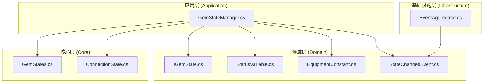
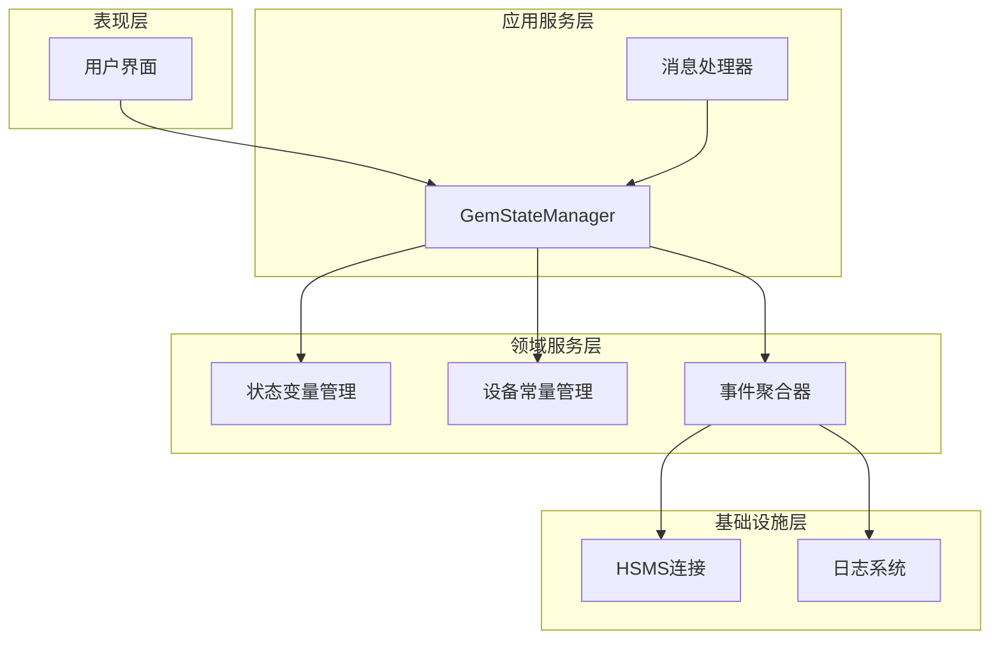
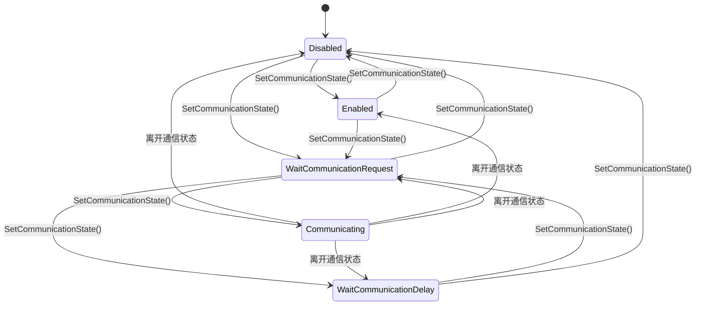
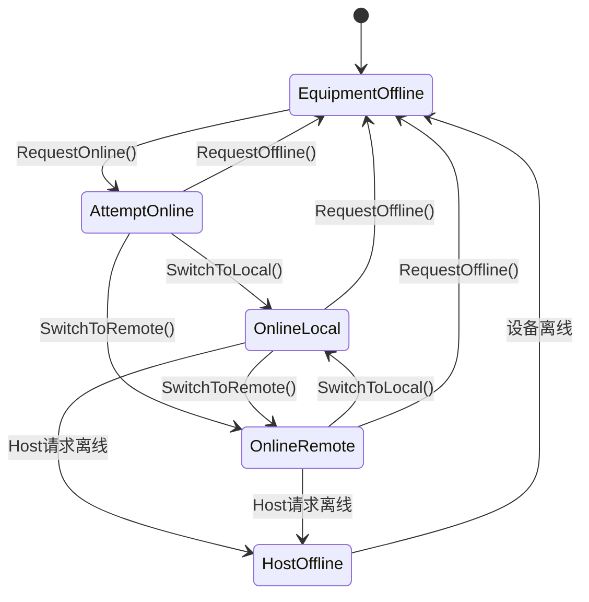
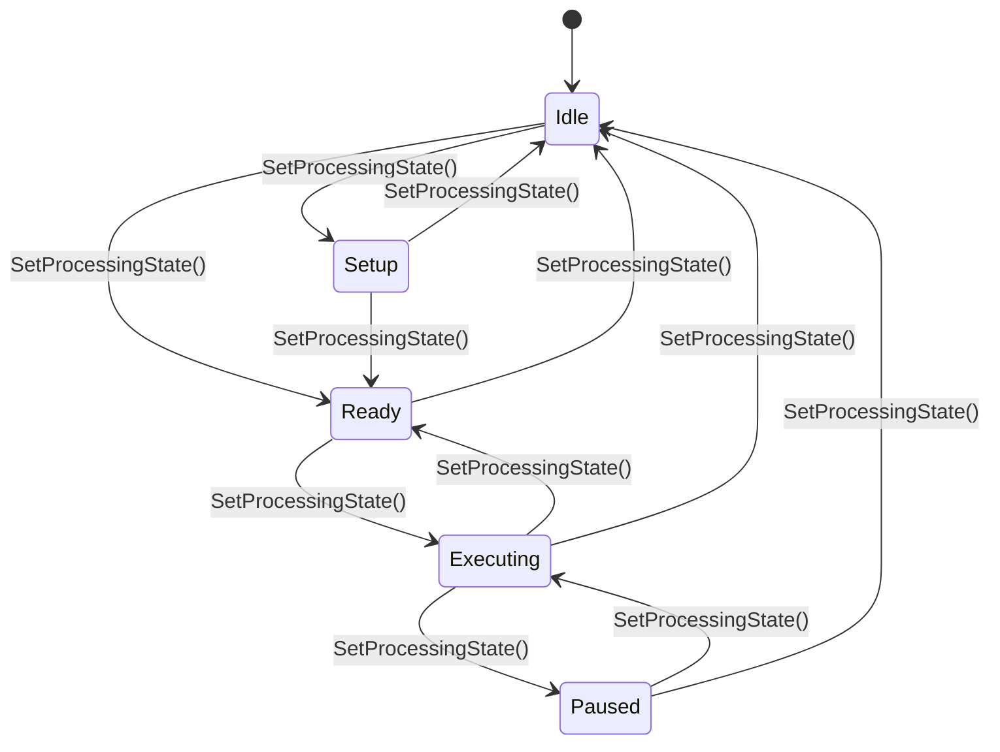
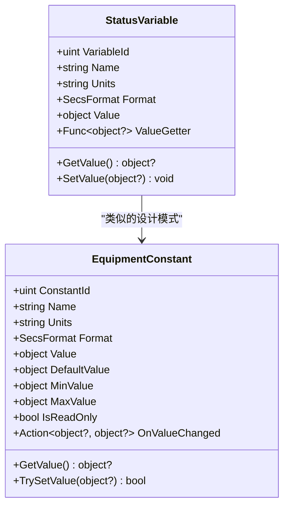
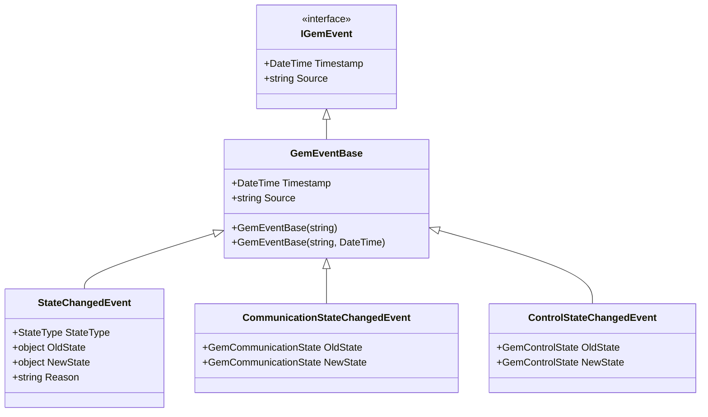
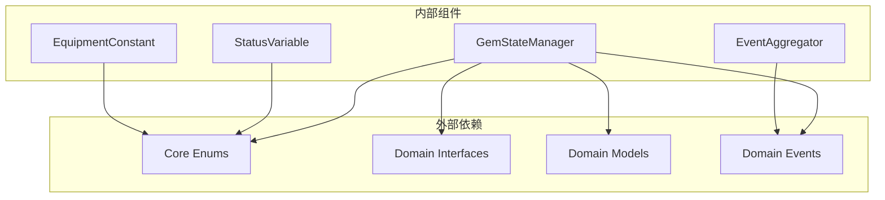
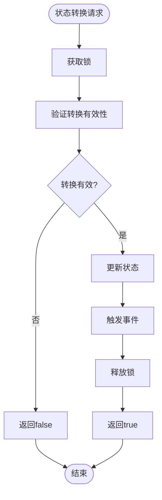

# GEM状态管理器

<cite>
**本文档引用的文件**
- [GemStateManager.cs](file://WebGem/SECS2GEM/Application/State/GemStateManager.cs)
- [IGemState.cs](file://WebGem/SECS2GEM/Domain/Interfaces/IGemState.cs)
- [GemStates.cs](file://WebGem/SECS2GEM/Core/Enums/GemStates.cs)
- [ConnectionState.cs](file://WebGem/SECS2GEM/Core/Enums/ConnectionState.cs)
- [StatusVariable.cs](file://WebGem/SECS2GEM/Domain/Models/StatusVariable.cs)
- [EquipmentConstant.cs](file://WebGem/SECS2GEM/Domain/Models/EquipmentConstant.cs)
- [StateChangedEvent.cs](file://WebGem/SECS2GEM/Domain/Events/StateChangedEvent.cs)
- [EventAggregator.cs](file://WebGem/SECS2GEM/Infrastructure/Services/EventAggregator.cs)
- [IEventAggregator.cs](file://WebGem/SECS2GEM/Domain/Interfaces/IEventAggregator.cs)
- [IGemEvent.cs](file://WebGem/SECS2GEM/Domain/Events/IGemEvent.cs)
- [GemStateManagerTests.cs](file://WebGem/SECS2GEM.Tests/GemStateManagerTests.cs)
</cite>

## 目录
1. [简介](#简介)
2. [项目结构](#项目结构)
3. [核心组件](#核心组件)
4. [架构概览](#架构概览)
5. [详细组件分析](#详细组件分析)
6. [依赖关系分析](#依赖关系分析)
7. [性能考虑](#性能考虑)
8. [故障排除指南](#故障排除指南)
9. [结论](#结论)
10. [附录](#附录)

## 简介

GEM状态管理器是SECS2GEM系统中的核心组件，负责管理半导体设备的GEM（Generic Equipment Model）状态。该模块实现了完整的状态机设计，包括通信状态管理、控制状态管理和处理状态管理，并提供了状态变量和设备常量管理系统。

本模块严格遵循SEMI E30标准，支持三种主要状态机：
- **通信状态机**：管理设备与主机之间的通信连接
- **控制状态机**：管理设备的在线/离线和控制模式
- **处理状态机**：管理设备的生产处理流程

## 项目结构

GEM状态管理器位于SECS2GEM项目的Application层，采用分层架构设计：



**图表来源**
- [GemStateManager.cs:1-492](file://WebGem/SECS2GEM/Application/State/GemStateManager.cs#L1-L492)
- [IGemState.cs:1-166](file://WebGem/SECS2GEM/Domain/Interfaces/IGemState.cs#L1-L166)

**章节来源**
- [GemStateManager.cs:1-50](file://WebGem/SECS2GEM/Application/State/GemStateManager.cs#L1-L50)
- [IGemState.cs:1-20](file://WebGem/SECS2GEM/Domain/Interfaces/IGemState.cs#L1-L20)

## 核心组件

### 状态管理器主类

GemStateManager是状态管理的核心实现类，采用单例模式设计，确保状态的一致性和线程安全性。

#### 主要特性
- **线程安全**：使用锁机制保护状态转换
- **状态隔离**：三个独立的状态机相互独立
- **事件驱动**：支持状态变化事件发布
- **扩展性**：支持自定义状态变量和设备常量

#### 状态属性
- `CommunicationState`：通信状态（Disabled/Enabled/WaitCommunicationRequest/WaitCommunicationDelay/Communicating）
- `ControlState`：控制状态（EquipmentOffline/AttemptOnline/HostOffline/OnlineLocal/OnlineRemote）
- `ProcessingState`：处理状态（Idle/Setup/Ready/Executing/Paused）

**章节来源**
- [GemStateManager.cs:22-78](file://WebGem/SECS2GEM/Application/State/GemStateManager.cs#L22-L78)
- [GemStates.cs:10-120](file://WebGem/SECS2GEM/Core/Enums/GemStates.cs#L10-L120)

### 状态接口定义

IGemState接口定义了状态管理器的标准契约，确保实现的一致性。

#### 接口方法分类
- **状态查询**：获取当前状态值
- **状态转换**：执行状态变更操作
- **状态变量管理**：管理SV和EC系统
- **事件处理**：状态变化事件订阅

**章节来源**
- [IGemState.cs:20-164](file://WebGem/SECS2GEM/Domain/Interfaces/IGemState.cs#L20-L164)

## 架构概览

GEM状态管理器采用分层架构，各层职责明确：



**图表来源**
- [GemStateManager.cs:81-93](file://WebGem/SECS2GEM/Application/State/GemStateManager.cs#L81-L93)
- [EventAggregator.cs:17-219](file://WebGem/SECS2GEM/Infrastructure/Services/EventAggregator.cs#L17-L219)

## 详细组件分析

### 状态机设计

#### 通信状态机

通信状态机管理设备与主机之间的通信连接，遵循严格的转换规则：



**图表来源**
- [GemStateManager.cs:357-387](file://WebGem/SECS2GEM/Application/State/GemStateManager.cs#L357-L387)
- [GemStates.cs:10-41](file://WebGem/SECS2GEM/Core/Enums/GemStates.cs#L10-L41)

#### 控制状态机

控制状态机管理设备的在线/离线和控制模式：



**图表来源**
- [GemStateManager.cs:392-420](file://WebGem/SECS2GEM/Application/State/GemStateManager.cs#L392-L420)
- [GemStates.cs:50-81](file://WebGem/SECS2GEM/Core/Enums/GemStates.cs#L50-L81)

#### 处理状态机

处理状态机管理设备的生产处理流程：



**图表来源**
- [GemStateManager.cs:425-455](file://WebGem/SECS2GEM/Application/State/GemStateManager.cs#L425-L455)
- [GemStates.cs:89-120](file://WebGem/SECS2GEM/Core/Enums/GemStates.cs#L89-L120)

### 状态变量系统

状态变量（SV）系统提供了设备状态信息的查询和动态更新能力。

#### StatusVariable模型



**图表来源**
- [StatusVariable.cs:12-61](file://WebGem/SECS2GEM/Domain/Models/StatusVariable.cs#L12-L61)
- [EquipmentConstant.cs:12-122](file://WebGem/SECS2GEM/Domain/Models/EquipmentConstant.cs#L12-L122)

#### 标准状态变量

系统预注册了标准状态变量：

| SVID | 名称 | 类型 | 描述 |
|------|------|------|------|
| 1 | Clock | ASCII | 设备时钟，格式为yyyyMMddHHmmss |
| 2 | ControlState | U1 | 当前控制状态的字节值 |

**章节来源**
- [GemStateManager.cs:464-487](file://WebGem/SECS2GEM/Application/State/GemStateManager.cs#L464-L487)
- [StatusVariable.cs:47-58](file://WebGem/SECS2GEM/Domain/Models/StatusVariable.cs#L47-L58)

### 设备常量管理系统

设备常量（EC）系统提供了设备配置参数的管理功能。

#### EquipmentConstant特性

- **只读支持**：防止意外修改关键配置
- **范围验证**：自动验证数值范围
- **回调机制**：值变化时触发回调
- **默认值支持**：提供默认配置值

**章节来源**
- [EquipmentConstant.cs:76-96](file://WebGem/SECS2GEM/Domain/Models/EquipmentConstant.cs#L76-L96)

### 事件发布机制

状态管理器实现了完整的事件发布机制，支持状态变化通知。

#### 事件类型



**图表来源**
- [IGemEvent.cs:10-50](file://WebGem/SECS2GEM/Domain/Events/IGemEvent.cs#L10-L50)
- [StateChangedEvent.cs:11-109](file://WebGem/SECS2GEM/Domain/Events/StateChangedEvent.cs#L11-L109)

#### 事件聚合器

EventAggregator实现了观察者模式，提供线程安全的事件发布和订阅功能。

**章节来源**
- [EventAggregator.cs:17-219](file://WebGem/SECS2GEM/Infrastructure/Services/EventAggregator.cs#L17-L219)
- [IEventAggregator.cs:22-65](file://WebGem/SECS2GEM/Domain/Interfaces/IEventAggregator.cs#L22-L65)

## 依赖关系分析

### 组件依赖图



**图表来源**
- [GemStateManager.cs:1-5](file://WebGem/SECS2GEM/Application/State/GemStateManager.cs#L1-L5)
- [EventAggregator.cs:1-4](file://WebGem/SECS2GEM/Infrastructure/Services/EventAggregator.cs#L1-L4)

### 状态转换验证

状态管理器实现了严格的转换验证逻辑，确保状态转换的合法性。

#### 转换验证流程



**图表来源**
- [GemStateManager.cs:201-258](file://WebGem/SECS2GEM/Application/State/GemStateManager.cs#L201-L258)

**章节来源**
- [GemStateManager.cs:357-455](file://WebGem/SECS2GEM/Application/State/GemStateManager.cs#L357-L455)

## 性能考虑

### 线程安全设计

状态管理器采用了多层线程安全保障：

1. **对象锁**：使用专用锁保护状态转换
2. **并发集合**：状态变量和设备常量使用ConcurrentDictionary
3. **原子操作**：状态查询使用锁保护

### 内存优化

- **延迟初始化**：状态变量和设备常量按需注册
- **值缓存**：静态状态变量值缓存
- **事件池化**：事件聚合器复用处理器列表

### 性能最佳实践

1. **批量操作**：对多个状态变量的修改建议批量处理
2. **事件订阅**：合理管理事件订阅，及时取消不需要的订阅
3. **状态查询**：避免频繁的状态查询，必要时缓存结果

## 故障排除指南

### 常见问题诊断

#### 状态转换失败

**症状**：调用SetCommunicationState/SetControlState/SetProcessingState返回false

**可能原因**：
1. 非法的状态转换
2. 线程竞争导致的状态冲突
3. 状态机约束条件不满足

**解决方案**：
1. 检查当前状态是否允许目标转换
2. 确认没有其他线程同时修改状态
3. 查看状态转换验证逻辑

#### 事件未触发

**症状**：订阅的状态变化事件没有收到通知

**可能原因**：
1. 事件订阅时机不当
2. 事件处理器异常
3. 事件聚合器配置问题

**解决方案**：
1. 确保在状态转换后立即订阅事件
2. 检查事件处理器的异常处理
3. 验证事件聚合器的配置

### 调试技巧

#### 状态监控

```csharp
// 监控状态变化
stateManager.CommunicationStateChanged += (sender, state) => {
    Console.WriteLine($"通信状态变化: {state}");
};

stateManager.ControlStateChanged += (sender, state) => {
    Console.WriteLine($"控制状态变化: {state}");
};
```

#### 状态查询

```csharp
// 查询当前状态
Console.WriteLine($"通信状态: {stateManager.CommunicationState}");
Console.WriteLine($"控制状态: {stateManager.ControlState}");
Console.WriteLine($"处理状态: {stateManager.ProcessingState}");

// 查询设备信息
Console.WriteLine($"设备型号: {stateManager.ModelName}");
Console.WriteLine($"软件版本: {stateManager.SoftwareRevision}");
```

**章节来源**
- [GemStateManagerTests.cs:83-91](file://WebGem/SECS2GEM.Tests/GemStateManagerTests.cs#L83-L91)
- [GemStateManagerTests.cs:107-118](file://WebGem/SECS2GEM.Tests/GemStateManagerTests.cs#L107-L118)

## 结论

GEM状态管理器是一个设计精良的状态管理组件，具有以下特点：

### 优势
- **完整实现**：严格按照SEMI E30标准实现
- **线程安全**：全面的并发安全保障
- **扩展性强**：支持自定义状态变量和设备常量
- **事件驱动**：完善的事件发布机制
- **测试完备**：全面的单元测试覆盖

### 最佳实践
1. **状态转换验证**：始终使用IsValid*Transition方法验证转换
2. **事件管理**：合理使用事件订阅和取消订阅
3. **状态监控**：建立状态变化监控机制
4. **性能优化**：避免不必要的状态查询和事件发布

### 改进建议
1. **状态持久化**：考虑添加状态序列化功能
2. **状态恢复**：实现状态恢复机制
3. **监控增强**：添加更详细的状态监控指标
4. **配置管理**：提供状态管理器的配置选项

## 附录

### 状态操作示例

#### 状态查询示例
```csharp
// 获取当前状态
var communicationState = stateManager.CommunicationState;
var controlState = stateManager.ControlState;
var processingState = stateManager.ProcessingState;

// 检查设备状态
var isOnline = stateManager.IsOnline;
var isRemoteControl = stateManager.IsRemoteControl;
```

#### 状态切换示例
```csharp
// 设置通信状态
stateManager.SetCommunicationState(GemCommunicationState.Enabled);

// 请求上线
stateManager.RequestOnline();

// 切换到远程控制
stateManager.SwitchToRemote();

// 设置处理状态
stateManager.SetProcessingState(GemProcessingState.Setup);
```

#### 状态同步示例
```csharp
// 获取状态变量
var clockValue = stateManager.GetStatusVariable(1);
var controlStateValue = stateManager.GetStatusVariable(2);

// 设置状态变量
stateManager.SetStatusVariable(100, "TestValue");

// 获取设备常量
var equipmentConstant = stateManager.GetEquipmentConstant(100);

// 设置设备常量
stateManager.TrySetEquipmentConstant(100, 42);
```

**章节来源**
- [GemStateManagerTests.cs:21-31](file://WebGem/SECS2GEM.Tests/GemStateManagerTests.cs#L21-L31)
- [GemStateManagerTests.cs:50-80](file://WebGem/SECS2GEM.Tests/GemStateManagerTests.cs#L50-L80)
- [GemStateManagerTests.cs:176-217](file://WebGem/SECS2GEM.Tests/GemStateManagerTests.cs#L176-L217)

### 状态转换规则表

#### 通信状态转换规则

| 当前状态 | 允许目标状态 | 说明 |
|----------|--------------|------|
| Disabled | Enabled, WaitCommunicationRequest | 启用通信 |
| Enabled | Disabled, WaitCommunicationRequest | 关闭通信或等待请求 |
| WaitCommunicationRequest | WaitCommunicationDelay, Communicating, Disabled | 超时或建立连接 |
| WaitCommunicationDelay | WaitCommunicationRequest, Disabled | 重新尝试或放弃 |
| Communicating | 任意状态 | 离开通信状态时重置 |

#### 控制状态转换规则

| 当前状态 | 允许目标状态 | 说明 |
|----------|--------------|------|
| EquipmentOffline | AttemptOnline | 请求上线 |
| AttemptOnline | OnlineLocal, OnlineRemote, EquipmentOffline | 成功上线或放弃 |
| OnlineLocal | OnlineRemote, EquipmentOffline, HostOffline | 切换控制模式或离线 |
| OnlineRemote | OnlineLocal, EquipmentOffline, HostOffline | 切换控制模式或离线 |
| HostOffline | EquipmentOffline | 主机强制离线 |

#### 处理状态转换规则

| 当前状态 | 允许目标状态 | 说明 |
|----------|--------------|------|
| Idle | Setup, Ready | 开始准备或直接就绪 |
| Setup | Ready, Idle | 完成准备或取消 |
| Ready | Executing, Idle | 开始执行或取消 |
| Executing | Paused, Ready, Idle | 暂停、完成或停止 |
| Paused | Executing, Idle | 继续或停止 |