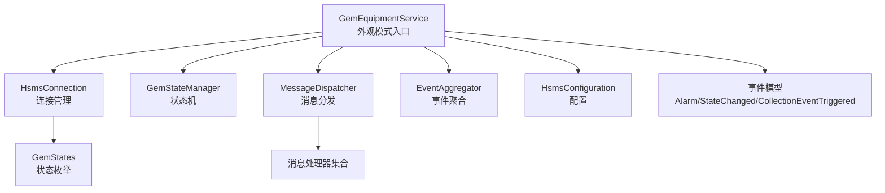
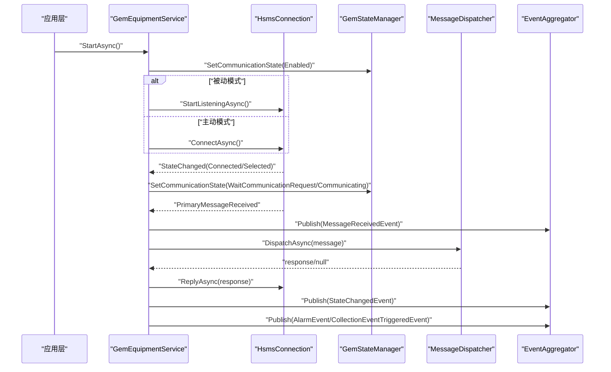
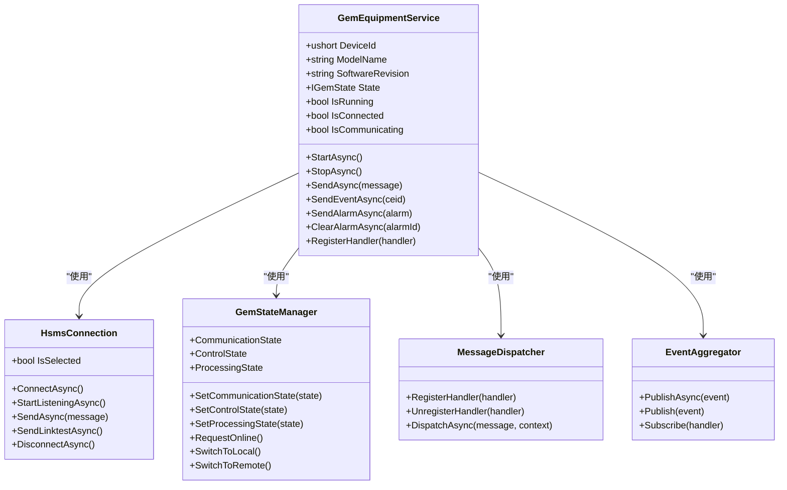

# GEM设备服务

<cite>
**本文引用的文件**
- [GemEquipmentService.cs](file://WebGem/SECS2GEM/Application/Services/GemEquipmentService.cs)
- [IGemEquipmentService.cs](file://WebGem/SECS2GEM/Domain/Interfaces/IGemEquipmentService.cs)
- [GemStateManager.cs](file://WebGem/SECS2GEM/Application/State/GemStateManager.cs)
- [HsmsConnection.cs](file://WebGem/SECS2GEM/Infrastructure/Connection/HsmsConnection.cs)
- [MessageDispatcher.cs](file://WebGem/SECS2GEM/Application/Messaging/MessageDispatcher.cs)
- [HsmsConfiguration.cs](file://WebGem/SECS2GEM/Infrastructure/Configuration/HsmsConfiguration.cs)
- [EventAggregator.cs](file://WebGem/SECS2GEM/Infrastructure/Services/EventAggregator.cs)
- [GemStates.cs](file://WebGem/SECS2GEM/Core/Enums/GemStates.cs)
- [AlarmEvent.cs](file://WebGem/SECS2GEM/Domain/Events/AlarmEvent.cs)
- [StateChangedEvent.cs](file://WebGem/SECS2GEM/Domain/Events/StateChangedEvent.cs)
- [CollectionEventTriggeredEvent.cs](file://WebGem/SECS2GEM/Domain/Events/CollectionEventTriggeredEvent.cs)
- [AlarmInfo.cs](file://WebGem/SECS2GEM/Domain/Models/AlarmInfo.cs)
</cite>

## 目录
1. [简介](#简介)
2. [项目结构](#项目结构)
3. [核心组件](#核心组件)
4. [架构总览](#架构总览)
5. [详细组件分析](#详细组件分析)
6. [依赖关系分析](#依赖关系分析)
7. [性能考虑](#性能考虑)
8. [故障排查指南](#故障排查指南)
9. [结论](#结论)
10. [附录](#附录)

## 简介
本文件面向GEM设备服务模块，围绕GemEquipmentService类进行深入说明，重点涵盖其外观模式设计、生命周期管理、事件处理机制与消息发送能力。文档同时阐述服务的启动/停止流程、连接状态管理、设备属性访问与事件报告机制，并给出与HsmsConnection、GemStateManager、MessageDispatcher等核心组件的协作方式。此外，还包含配置项说明、异常处理策略与性能优化建议，以及使用示例与最佳实践。

## 项目结构
GEM设备服务位于SECS2GEM应用层，采用“外观模式”对外提供统一入口，内部通过连接管理、消息分发、状态管理与事件聚合等子系统协同工作。下图展示与本主题相关的模块关系：

图表来源
- [GemEquipmentService.cs:33-133](file://WebGem/SECS2GEM/Application/Services/GemEquipmentService.cs#L33-L133)
- [HsmsConnection.cs:30-117](file://WebGem/SECS2GEM/Infrastructure/Connection/HsmsConnection.cs#L30-L117)
- [GemStateManager.cs:22-107](file://WebGem/SECS2GEM/Application/State/GemStateManager.cs#L22-L107)
- [MessageDispatcher.cs:27-91](file://WebGem/SECS2GEM/Application/Messaging/MessageDispatcher.cs#L27-L91)
- [EventAggregator.cs:17-67](file://WebGem/SECS2GEM/Infrastructure/Services/EventAggregator.cs#L17-L67)
- [HsmsConfiguration.cs:15-264](file://WebGem/SECS2GEM/Infrastructure/Configuration/HsmsConfiguration.cs#L15-L264)
- [GemStates.cs:10-174](file://WebGem/SECS2GEM/Core/Enums/GemStates.cs#L10-L174)
- [AlarmEvent.cs:12-54](file://WebGem/SECS2GEM/Domain/Events/AlarmEvent.cs#L12-L54)
- [StateChangedEvent.cs:11-51](file://WebGem/SECS2GEM/Domain/Events/StateChangedEvent.cs#L11-L51)
- [CollectionEventTriggeredEvent.cs:9-48](file://WebGem/SECS2GEM/Domain/Events/CollectionEventTriggeredEvent.cs#L9-L48)

章节来源
- [GemEquipmentService.cs:15-456](file://WebGem/SECS2GEM/Application/Services/GemEquipmentService.cs#L15-L456)
- [IGemEquipmentService.cs:6-160](file://WebGem/SECS2GEM/Domain/Interfaces/IGemEquipmentService.cs#L6-L160)

## 核心组件
- 外观模式入口：GemEquipmentService封装连接、状态、消息分发与事件聚合，向上提供简洁API。
- 连接管理：HsmsConnection负责TCP连接、HSMS协议控制消息、事务管理与心跳。
- 状态管理：GemStateManager维护通信/控制/处理三态机与标准状态变量。
- 消息分发：MessageDispatcher基于责任链+策略模式，按优先级匹配处理器。
- 事件聚合：EventAggregator提供异步/同步事件发布与订阅，异常隔离。
- 配置：HsmsConfiguration集中管理网络、超时、心跳与缓冲区等参数。
- 事件模型：AlarmEvent、StateChangedEvent、CollectionEventTriggeredEvent等承载业务事件。

章节来源
- [GemEquipmentService.cs:33-133](file://WebGem/SECS2GEM/Application/Services/GemEquipmentService.cs#L33-L133)
- [HsmsConnection.cs:30-117](file://WebGem/SECS2GEM/Infrastructure/Connection/HsmsConnection.cs#L30-L117)
- [GemStateManager.cs:22-107](file://WebGem/SECS2GEM/Application/State/GemStateManager.cs#L22-L107)
- [MessageDispatcher.cs:27-91](file://WebGem/SECS2GEM/Application/Messaging/MessageDispatcher.cs#L27-L91)
- [EventAggregator.cs:17-67](file://WebGem/SECS2GEM/Infrastructure/Services/EventAggregator.cs#L17-L67)
- [HsmsConfiguration.cs:15-264](file://WebGem/SECS2GEM/Infrastructure/Configuration/HsmsConfiguration.cs#L15-L264)
- [AlarmEvent.cs:12-54](file://WebGem/SECS2GEM/Domain/Events/AlarmEvent.cs#L12-L54)
- [StateChangedEvent.cs:11-51](file://WebGem/SECS2GEM/Domain/Events/StateChangedEvent.cs#L11-L51)
- [CollectionEventTriggeredEvent.cs:9-48](file://WebGem/SECS2GEM/Domain/Events/CollectionEventTriggeredEvent.cs#L9-L48)

## 架构总览
下图展示GemEquipmentService在系统中的角色与交互路径，包括启动/停止、连接状态变化、消息接收与分发、事件上报等关键流程。

图表来源
- [GemEquipmentService.cs:140-183](file://WebGem/SECS2GEM/Application/Services/GemEquipmentService.cs#L140-L183)
- [GemEquipmentService.cs:324-398](file://WebGem/SECS2GEM/Application/Services/GemEquipmentService.cs#L324-L398)
- [HsmsConnection.cs:146-186](file://WebGem/SECS2GEM/Infrastructure/Connection/HsmsConnection.cs#L146-L186)
- [MessageDispatcher.cs:67-91](file://WebGem/SECS2GEM/Application/Messaging/MessageDispatcher.cs#L67-L91)
- [EventAggregator.cs:25-45](file://WebGem/SECS2GEM/Infrastructure/Services/EventAggregator.cs#L25-L45)

## 详细组件分析

### GemEquipmentService 类（外观模式）
- 设计要点
  - 外观模式：整合HsmsConnection、GemStateManager、MessageDispatcher、EventAggregator与配置，向上暴露统一接口。
  - 生命周期：StartAsync/StopAsync/DisposeAsync，支持被动/主动两种连接模式。
  - 事件处理：订阅连接状态、消息接收、状态变化事件；通过EventAggregator发布业务事件。
  - 消息发送：封装SendAsync，确保连接处于Selected状态。
  - 事件/报警：提供SendEventAsync与SendAlarmAsync/ClearAlarmAsync，配合事件聚合器发布。

- 关键属性与事件
  - 设备标识、型号、软件版本、当前状态、运行/连接/通信状态。
  - 事件：MessageReceived、StateChanged、ConnectionStateChanged。

- 启动/停止流程
  - StartAsync：设置通信状态为Enabled；根据配置模式选择StartListeningAsync或ConnectAsync；连接成功后进入Selected并等待S1F13建立通信。
  - StopAsync：断开连接并重置通信状态为Disabled。
  - DisposeAsync：停止服务并释放底层连接资源。

- 消息处理流程
  - OnPrimaryMessageReceived：发布MessageReceivedEvent；通过MessageDispatcher分发消息；若有响应则ReplyAsync。
  - OnCommunicationStateChanged/OnControlStateChanged：发布StateChangedEvent。

- 事件报告与报警
  - SendEventAsync：校验IsCommunicating与事件定义可用性；构建S6F11消息并发送；发布CollectionEventTriggeredEvent。
  - SendAlarmAsync/ClearAlarmAsync：构造S5F1消息并发送；发布AlarmEvent；ClearAlarmAsync更新活动报警集合。

- 默认处理器注册
  - RegisterDefaultHandlers：按Stream分类注册大量标准处理器，覆盖设备状态、控制、报警、数据采集、程序管理与终端服务等。

章节来源
- [GemEquipmentService.cs:33-133](file://WebGem/SECS2GEM/Application/Services/GemEquipmentService.cs#L33-L133)
- [GemEquipmentService.cs:140-183](file://WebGem/SECS2GEM/Application/Services/GemEquipmentService.cs#L140-L183)
- [GemEquipmentService.cs:189-202](file://WebGem/SECS2GEM/Application/Services/GemEquipmentService.cs#L189-L202)
- [GemEquipmentService.cs:211-245](file://WebGem/SECS2GEM/Application/Services/GemEquipmentService.cs#L211-L245)
- [GemEquipmentService.cs:273-307](file://WebGem/SECS2GEM/Application/Services/GemEquipmentService.cs#L273-L307)
- [GemEquipmentService.cs:324-398](file://WebGem/SECS2GEM/Application/Services/GemEquipmentService.cs#L324-L398)
- [GemEquipmentService.cs:407-451](file://WebGem/SECS2GEM/Application/Services/GemEquipmentService.cs#L407-L451)

### HsmsConnection（连接管理）
- 职责
  - 管理TCP连接、HSMS控制消息（Select/Deselect/Linktest/Separate）、事务管理与心跳。
  - 支持Active/Passive两种模式；被动模式下监听端口并等待连接，主动模式发起连接。
  - 使用Channel实现异步发送队列，ReceiveLoop与SendLoop分别处理接收与发送。

- 关键流程
  - ConnectAsync/StartListeningAsync：建立连接并初始化通道与任务。
  - SendAsync：封装为HsmsMessage并入队发送；若WBit为真则创建事务等待响应。
  - 心跳：周期性发送Linktest请求，失败累计超过阈值则断开连接。
  - 控制消息处理：Select/Deselect/Linktest/Separate等控制消息的响应与状态变更。

- 异常与清理
  - 断开连接时清理资源、取消任务、取消所有事务；异常场景下保证状态一致性。

章节来源
- [HsmsConnection.cs:30-117](file://WebGem/SECS2GEM/Infrastructure/Connection/HsmsConnection.cs#L30-L117)
- [HsmsConnection.cs:146-186](file://WebGem/SECS2GEM/Infrastructure/Connection/HsmsConnection.cs#L146-L186)
- [HsmsConnection.cs:427-453](file://WebGem/SECS2GEM/Infrastructure/Connection/HsmsConnection.cs#L427-L453)
- [HsmsConnection.cs:547-610](file://WebGem/SECS2GEM/Infrastructure/Connection/HsmsConnection.cs#L547-L610)
- [HsmsConnection.cs:727-792](file://WebGem/SECS2GEM/Infrastructure/Connection/HsmsConnection.cs#L727-L792)

### GemStateManager（状态管理）
- 职责
  - 维护通信/控制/处理三态机，提供状态转换验证与事件发布。
  - 管理标准状态变量（如时钟、控制状态）与设备常量。
  - 支持RequestOnline/SwitchToLocal/SwitchToRemote等控制动作。

- 状态转换规则
  - 通信状态：Disabled/Enabled/WaitCommunicationRequest/WaitCommunicationDelay/Communicating之间按规则转换。
  - 控制状态：EquipmentOffline/AttemptOnline/HostOffline/OnlineLocal/OnlineRemote之间按规则转换。
  - 处理状态：Idle/Setup/Ready/Executing/Paused之间按规则转换。

章节来源
- [GemStateManager.cs:22-107](file://WebGem/SECS2GEM/Application/State/GemStateManager.cs#L22-L107)
- [GemStateManager.cs:196-350](file://WebGem/SECS2GEM/Application/State/GemStateManager.cs#L196-L350)
- [GemStateManager.cs:352-455](file://WebGem/SECS2GEM/Application/State/GemStateManager.cs#L352-L455)
- [GemStates.cs:10-174](file://WebGem/SECS2GEM/Core/Enums/GemStates.cs#L10-L174)

### MessageDispatcher（消息分发）
- 职责
  - 维护处理器列表，按Priority排序；遍历处理器判断CanHandle并调用HandleAsync。
  - 若无处理器处理且消息要求响应，则返回S9F7（非法数据）响应。

- 特性
  - 解耦处理器，支持动态注册/注销。
  - 优先级匹配，便于覆盖默认行为。

章节来源
- [MessageDispatcher.cs:27-91](file://WebGem/SECS2GEM/Application/Messaging/MessageDispatcher.cs#L27-L91)

### EventAggregator（事件聚合）
- 职责
  - 提供异步/同步事件发布；订阅者异常隔离，不影响其他订阅者。
  - 支持按事件类型订阅与取消订阅，返回IDisposable以便清理。

章节来源
- [EventAggregator.cs:17-67](file://WebGem/SECS2GEM/Infrastructure/Services/EventAggregator.cs#L17-L67)

### 配置（HsmsConfiguration）
- 职责
  - 集中管理网络参数（IP、端口、模式）、超时参数（T3-T8）、心跳参数、缓冲区大小、自动重连与消息日志配置。
  - 提供Validate方法进行参数校验与CreatePassive/CreateActive工厂方法。

章节来源
- [HsmsConfiguration.cs:15-264](file://WebGem/SECS2GEM/Infrastructure/Configuration/HsmsConfiguration.cs#L15-L264)

### 事件模型
- AlarmEvent：承载S5F1报警/清除事件，包含报警ID、报警码（含Set/Clear位与类别）与报警文本。
- StateChangedEvent：承载状态变化事件，区分通信/控制/处理/连接四类状态。
- CollectionEventTriggeredEvent：承载S6F11事件报告触发事件，包含DATAID、CEID、事件名与报告数据。

章节来源
- [AlarmEvent.cs:12-54](file://WebGem/SECS2GEM/Domain/Events/AlarmEvent.cs#L12-L54)
- [StateChangedEvent.cs:11-51](file://WebGem/SECS2GEM/Domain/Events/StateChangedEvent.cs#L11-L51)
- [CollectionEventTriggeredEvent.cs:9-48](file://WebGem/SECS2GEM/Domain/Events/CollectionEventTriggeredEvent.cs#L9-L48)

## 依赖关系分析
- 组件耦合
  - GemEquipmentService对HsmsConnection、GemStateManager、MessageDispatcher、EventAggregator存在强依赖，体现外观模式的“高内聚、低耦合”特征。
  - MessageDispatcher与IMessageHandler形成松散耦合，便于扩展与替换。
  - EventAggregator与具体事件类型解耦，通过泛型与类型键实现订阅/发布。

- 外部依赖
  - HsmsConnection依赖ISecsSerializer、ITransactionManager、IMessageLogger等基础设施组件。
  - 配置对象HsmsConfiguration贯穿连接与序列化层，提供参数约束与时间跨度转换。

图表来源
- [GemEquipmentService.cs:33-133](file://WebGem/SECS2GEM/Application/Services/GemEquipmentService.cs#L33-L133)
- [HsmsConnection.cs:30-117](file://WebGem/SECS2GEM/Infrastructure/Connection/HsmsConnection.cs#L30-L117)
- [GemStateManager.cs:22-107](file://WebGem/SECS2GEM/Application/State/GemStateManager.cs#L22-L107)
- [MessageDispatcher.cs:27-91](file://WebGem/SECS2GEM/Application/Messaging/MessageDispatcher.cs#L27-L91)
- [EventAggregator.cs:17-67](file://WebGem/SECS2GEM/Infrastructure/Services/EventAggregator.cs#L17-L67)

## 性能考虑
- 异步与并发
  - 使用Channel实现无锁发送队列，ReceiveLoop与SendLoop并行处理，提升吞吐。
  - EventAggregator异步发布事件，避免阻塞消息处理主路径。
- 缓冲区与超时
  - 合理设置ReceiveBufferSize/SendBufferSize与MaxMessageSize，避免内存压力。
  - T3/T6/T7等超时参数需结合网络环境调整，平衡可靠性与响应速度。
- 心跳与断线重连
  - LinktestInterval与MaxLinktestFailures决定网络健康检测灵敏度；AutoReconnect与ReconnectDelay影响可用性。
- 处理器优先级
  - 自定义处理器可通过Priority覆盖默认行为，建议仅在必要时介入，减少匹配成本。

## 故障排查指南
- 连接问题
  - 检查HsmsConfiguration参数（IP、端口、模式、T7超时）；确认防火墙与网络可达性。
  - 观察HsmsConnection.State变化与异常日志；关注T7超时导致的被动模式断开。
- 通信状态异常
  - 确认GemEquipmentService.IsConnected与IsCommunicating状态；检查GemStateManager通信状态转换是否符合预期。
  - 若进入WaitCommunicationRequest后未进入Communicating，检查S1F13是否正确处理。
- 消息处理失败
  - 确认MessageDispatcher已注册对应处理器；若无处理器处理且消息要求响应，将返回S9F7。
- 事件与报警
  - 发送报警/事件前检查IsCommunicating；查看EventAggregator订阅情况与异常隔离日志。
- 资源释放
  - StopAsync/DisposeAsync后确认连接已断开、任务已取消、通道已完成。

章节来源
- [HsmsConnection.cs:178-186](file://WebGem/SECS2GEM/Infrastructure/Connection/HsmsConnection.cs#L178-L186)
- [HsmsConnection.cs:280-296](file://WebGem/SECS2GEM/Infrastructure/Connection/HsmsConnection.cs#L280-L296)
- [MessageDispatcher.cs:83-91](file://WebGem/SECS2GEM/Application/Messaging/MessageDispatcher.cs#L83-L91)
- [EventAggregator.cs:168-197](file://WebGem/SECS2GEM/Infrastructure/Services/EventAggregator.cs#L168-L197)

## 结论
GemEquipmentService以外观模式为核心，将复杂的HSMS连接、状态机、消息分发与事件聚合整合为统一入口，既简化了上层调用，又保持了良好的扩展性与可维护性。通过合理的配置、健壮的异常处理与性能优化策略，可在工业自动化场景中稳定运行并高效处理各类GEM协议消息。

## 附录

### 使用示例（步骤说明）
- 服务初始化
  - 创建HsmsConfiguration（Passive/Active模式、设备ID、IP/端口、超时与心跳参数）。
  - 创建GemConfiguration并注入Hsms配置。
  - 实例化GemEquipmentService。
- 启动服务
  - 调用StartAsync；根据配置模式自动监听或连接。
- 事件注册
  - 订阅StateChanged、MessageReceived、ConnectionStateChanged事件。
  - 通过RegisterHandler注册自定义消息处理器。
- 报警处理
  - 调用RegisterAlarm注册报警定义；发送报警SendAlarmAsync；清除报警ClearAlarmAsync。
- 状态查询
  - 读取DeviceId、ModelName、SoftwareRevision、State、IsRunning、IsConnected、IsCommunicating。
- 事件报告
  - RegisterEvent注册事件定义；SetEventEnabled启用/禁用；SendEventAsync触发S6F11事件报告。

章节来源
- [HsmsConfiguration.cs:202-228](file://WebGem/SECS2GEM/Infrastructure/Configuration/HsmsConfiguration.cs#L202-L228)
- [GemEquipmentService.cs:110-133](file://WebGem/SECS2GEM/Application/Services/GemEquipmentService.cs#L110-L133)
- [GemEquipmentService.cs:140-158](file://WebGem/SECS2GEM/Application/Services/GemEquipmentService.cs#L140-L158)
- [GemEquipmentService.cs:312-315](file://WebGem/SECS2GEM/Application/Services/GemEquipmentService.cs#L312-L315)
- [GemEquipmentService.cs:273-307](file://WebGem/SECS2GEM/Application/Services/GemEquipmentService.cs#L273-L307)
- [GemEquipmentService.cs:250-264](file://WebGem/SECS2GEM/Application/Services/GemEquipmentService.cs#L250-L264)
- [GemEquipmentService.cs:211-245](file://WebGem/SECS2GEM/Application/Services/GemEquipmentService.cs#L211-L245)

### 配置选项（摘要）
- 网络与模式
  - DeviceId、IpAddress、Port、Mode（Passive/Active）
- 超时参数（秒）
  - T3（回复超时）、T5（分离超时）、T6（控制事务超时）、T7（未选择超时）、T8（字符间隔超时）
- 心跳参数
  - LinktestInterval、MaxLinktestFailures
- 缓冲区与消息
  - MaxMessageSize、ReceiveBufferSize、SendBufferSize、AutoReconnect、ReconnectDelay
- 消息日志
  - MessageLogging

章节来源
- [HsmsConfiguration.cs:15-264](file://WebGem/SECS2GEM/Infrastructure/Configuration/HsmsConfiguration.cs#L15-L264)

### 异常处理与最佳实践
- 异常处理
  - 连接失败：HsmsConnection抛出SecsCommunicationException；连接断开时清理资源并重置状态。
  - 未选择发送：SendAsync/LinktestAsync在非Selected状态下抛出异常。
  - 事务超时：T3/T6/T7超时触发相应异常，必要时断开连接。
- 最佳实践
  - 启动前校验HsmsConfiguration.Validate。
  - 合理设置缓冲区与消息大小，避免内存压力。
  - 使用EventAggregator异步发布事件，避免阻塞消息处理。
  - 仅在必要时注册自定义处理器，减少匹配开销。
  - 监控状态事件与连接事件，及时发现异常。

章节来源
- [HsmsConnection.cs:178-186](file://WebGem/SECS2GEM/Infrastructure/Connection/HsmsConnection.cs#L178-L186)
- [HsmsConnection.cs:429-432](file://WebGem/SECS2GEM/Infrastructure/Connection/HsmsConnection.cs#L429-L432)
- [HsmsConnection.cs:280-296](file://WebGem/SECS2GEM/Infrastructure/Connection/HsmsConnection.cs#L280-L296)
- [EventAggregator.cs:168-197](file://WebGem/SECS2GEM/Infrastructure/Services/EventAggregator.cs#L168-L197)