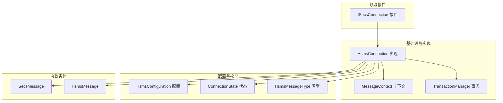
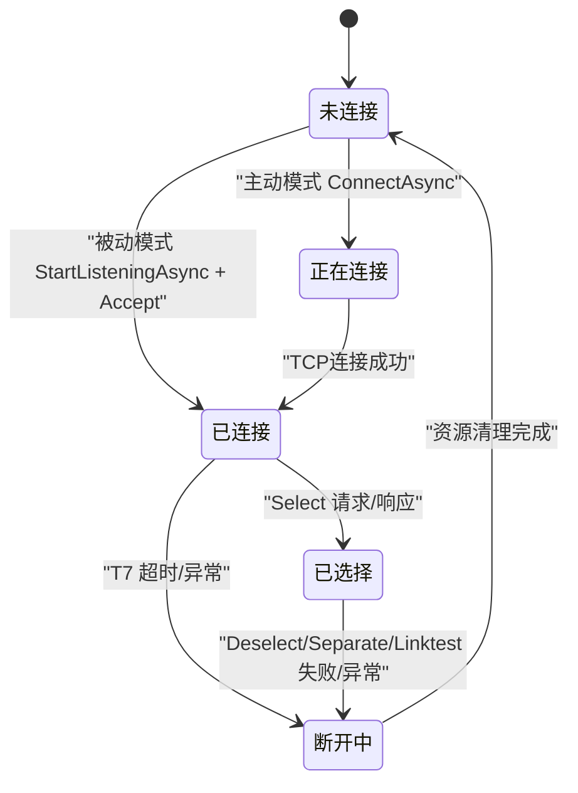
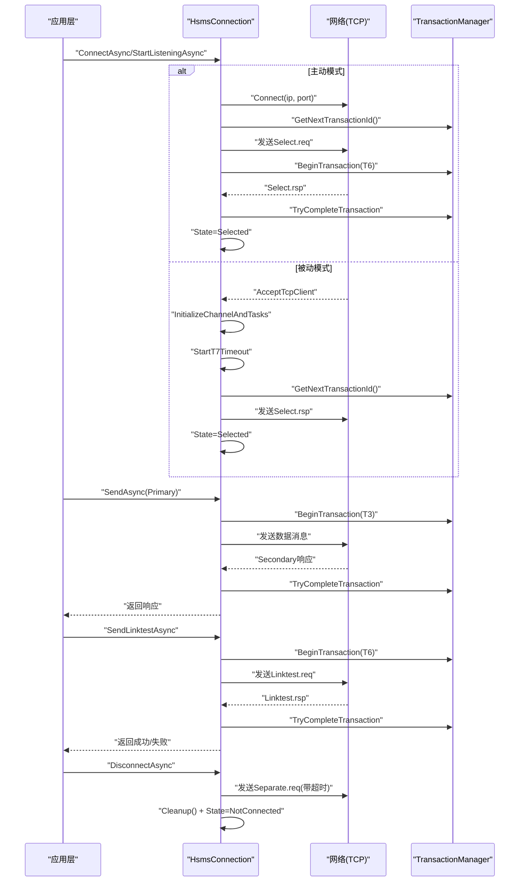
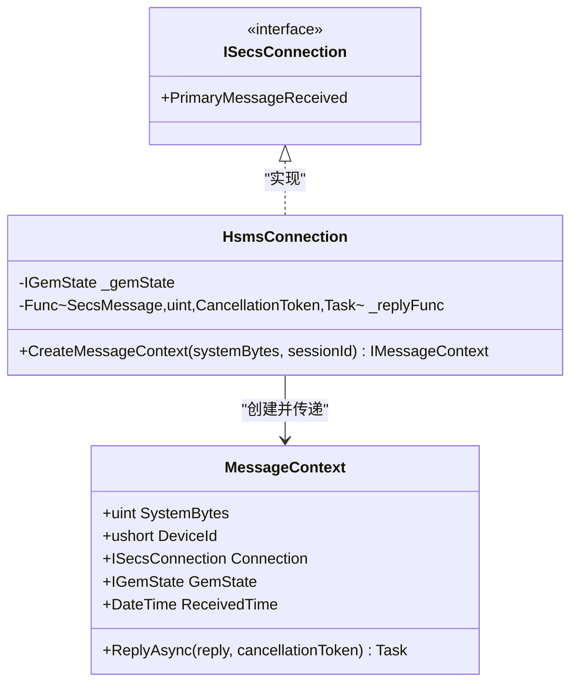
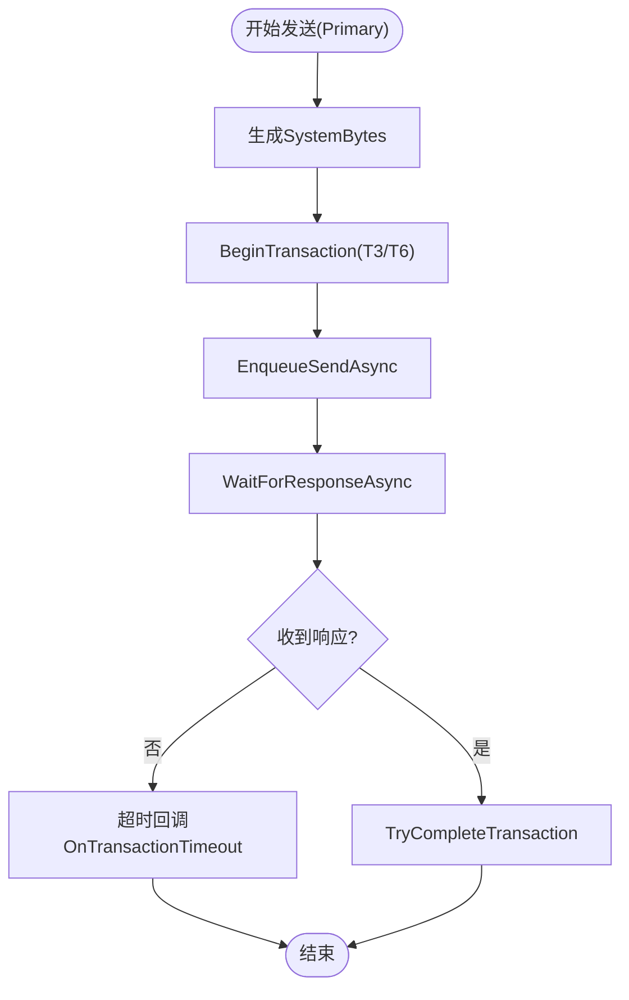
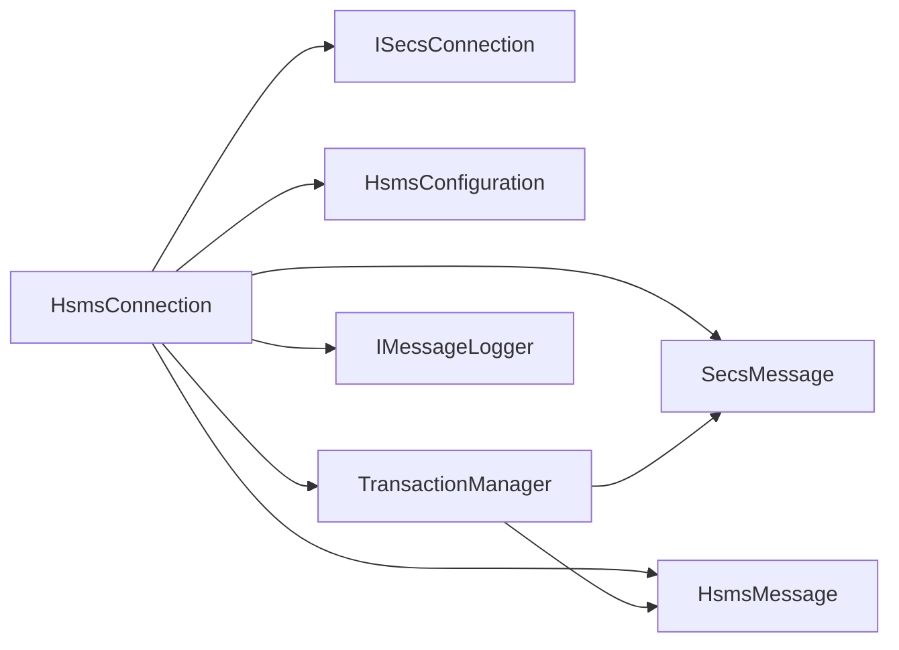

# HSMS连接管理

<cite>
**本文引用的文件**
- [HsmsConnection.cs](file://WebGem/SECS2GEM/Infrastructure/Connection/HsmsConnection.cs)
- [MessageContext.cs](file://WebGem/SECS2GEM/Infrastructure/Connection/MessageContext.cs)
- [ISecsConnection.cs](file://WebGem/SECS2GEM/Domain/Interfaces/ISecsConnection.cs)
- [HsmsConfiguration.cs](file://WebGem/SECS2GEM/Infrastructure/Configuration/HsmsConfiguration.cs)
- [ConnectionState.cs](file://WebGem/SECS2GEM/Core/Enums/ConnectionState.cs)
- [HsmsMessageType.cs](file://WebGem/SECS2GEM/Core/Enums/HsmsMessageType.cs)
- [TransactionManager.cs](file://WebGem/SECS2GEM/Infrastructure/Services/TransactionManager.cs)
- [SecsMessage.cs](file://WebGem/SECS2GEM/Core/Entities/SecsMessage.cs)
- [HsmsMessage.cs](file://WebGem/SECS2GEM/Core/Entities/HsmsMessage.cs)
</cite>

## 目录
1. [简介](#简介)
2. [项目结构](#项目结构)
3. [核心组件](#核心组件)
4. [架构总览](#架构总览)
5. [详细组件分析](#详细组件分析)
6. [依赖关系分析](#依赖关系分析)
7. [性能考虑](#性能考虑)
8. [故障排除指南](#故障排除指南)
9. [结论](#结论)
10. [附录](#附录)

## 简介
本文件面向HSMS连接管理模块，系统化阐述HsmsConnection的连接建立、维护与断开机制，覆盖主动连接与被动连接模式、心跳检测、错误恢复与事务管理。同时提供连接配置示例（IP地址、端口、超时参数、连接模式），解释MessageContext的作用与消息上下文管理，并给出连接状态监控、性能调优与故障排除建议。

## 项目结构
HSMS连接管理位于基础设施层，围绕ISecsConnection接口实现，关键文件如下：
- 连接实现：HsmsConnection.cs
- 消息上下文：MessageContext.cs
- 接口定义：ISecsConnection.cs
- 配置对象：HsmsConfiguration.cs
- 枚举类型：ConnectionState.cs、HsmsMessageType.cs
- 事务管理：TransactionManager.cs
- 协议实体：SecsMessage.cs、HsmsMessage.cs

图表来源
- [HsmsConnection.cs:30-139](file://WebGem/SECS2GEM/Infrastructure/Connection/HsmsConnection.cs#L30-L139)
- [MessageContext.cs:12-63](file://WebGem/SECS2GEM/Infrastructure/Connection/MessageContext.cs#L12-L63)
- [ISecsConnection.cs:71-142](file://WebGem/SECS2GEM/Domain/Interfaces/ISecsConnection.cs#L71-L142)
- [HsmsConfiguration.cs:15-228](file://WebGem/SECS2GEM/Infrastructure/Configuration/HsmsConfiguration.cs#L15-L228)
- [ConnectionState.cs:10-61](file://WebGem/SECS2GEM/Core/Enums/ConnectionState.cs#L10-L61)
- [HsmsMessageType.cs:10-67](file://WebGem/SECS2GEM/Core/Enums/HsmsMessageType.cs#L10-L67)
- [TransactionManager.cs:24-201](file://WebGem/SECS2GEM/Infrastructure/Services/TransactionManager.cs#L24-L201)
- [SecsMessage.cs:18-209](file://WebGem/SECS2GEM/Core/Entities/SecsMessage.cs#L18-L209)
- [HsmsMessage.cs:23-220](file://WebGem/SECS2GEM/Core/Entities/HsmsMessage.cs#L23-L220)

章节来源
- [HsmsConnection.cs:13-139](file://WebGem/SECS2GEM/Infrastructure/Connection/HsmsConnection.cs#L13-L139)
- [ISecsConnection.cs:56-142](file://WebGem/SECS2GEM/Domain/Interfaces/ISecsConnection.cs#L56-L142)

## 核心组件
- HsmsConnection：实现ISecsConnection，负责TCP连接、HSMS会话建立、消息收发、心跳与断开。
- MessageContext：封装消息上下文，提供回复能力与GEM状态访问。
- HsmsConfiguration：集中管理连接参数（IP、端口、模式、超时、心跳、缓冲区、自动重连等）。
- TransactionManager：基于SystemBytes管理事务，支持超时、完成与取消。
- 协议实体：SecsMessage与HsmsMessage承载SECS-II与HSMS消息结构。

章节来源
- [HsmsConnection.cs:30-139](file://WebGem/SECS2GEM/Infrastructure/Connection/HsmsConnection.cs#L30-L139)
- [MessageContext.cs:12-63](file://WebGem/SECS2GEM/Infrastructure/Connection/MessageContext.cs#L12-L63)
- [HsmsConfiguration.cs:15-228](file://WebGem/SECS2GEM/Infrastructure/Configuration/HsmsConfiguration.cs#L15-L228)
- [TransactionManager.cs:24-201](file://WebGem/SECS2GEM/Infrastructure/Services/TransactionManager.cs#L24-L201)
- [SecsMessage.cs:18-209](file://WebGem/SECS2GEM/Core/Entities/SecsMessage.cs#L18-L209)
- [HsmsMessage.cs:23-220](file://WebGem/SECS2GEM/Core/Entities/HsmsMessage.cs#L23-L220)

## 架构总览
HSMS连接采用状态机驱动，配合Channel异步队列与三个后台任务（接收、发送、心跳）实现高并发与低耦合。连接生命周期严格遵循SEMI E37标准的状态转换。

图表来源
- [ConnectionState.cs:10-61](file://WebGem/SECS2GEM/Core/Enums/ConnectionState.cs#L10-L61)
- [HsmsConnection.cs:146-186](file://WebGem/SECS2GEM/Infrastructure/Connection/HsmsConnection.cs#L146-L186)
- [HsmsConnection.cs:191-275](file://WebGem/SECS2GEM/Infrastructure/Connection/HsmsConnection.cs#L191-L275)
- [HsmsConnection.cs:280-296](file://WebGem/SECS2GEM/Infrastructure/Connection/HsmsConnection.cs#L280-L296)
- [HsmsConnection.cs:301-337](file://WebGem/SECS2GEM/Infrastructure/Connection/HsmsConnection.cs#L301-L337)

## 详细组件分析

### HsmsConnection：连接生命周期与消息处理
- 连接建立
  - 主动模式：ConnectAsync建立TCP，初始化通道与任务，发送Select请求并等待响应，完成后进入Selected。
  - 被动模式：StartListeningAsync启动监听，AcceptConnectionsAsync接受首个连接，初始化通道与任务，启动T7超时监控。
- 维护与断开
  - InitializeChannelAndTasks初始化发送通道与接收/发送/心跳任务；SendLinktestAsync执行心跳；DisconnectAsync发送Separate请求并清理资源。
  - ReceiveLoopAsync持续读取并解析消息；SendLoopAsync从通道出队发送；LinktestLoopAsync周期性心跳。
- 消息处理
  - HandleMessageAsync区分控制消息与数据消息；控制消息按类型处理（Select/Deselect/Linktest/Separate）；数据消息触发PrimaryMessageReceived事件并携带MessageContext。
- 错误恢复
  - T7超时断开；心跳失败累计超过阈值断开；异常捕获后进入断开流程；AutoReconnect由上层策略决定。

图表来源
- [HsmsConnection.cs:146-186](file://WebGem/SECS2GEM/Infrastructure/Connection/HsmsConnection.cs#L146-L186)
- [HsmsConnection.cs:191-275](file://WebGem/SECS2GEM/Infrastructure/Connection/HsmsConnection.cs#L191-L275)
- [HsmsConnection.cs:280-296](file://WebGem/SECS2GEM/Infrastructure/Connection/HsmsConnection.cs#L280-L296)
- [HsmsConnection.cs:301-337](file://WebGem/SECS2GEM/Infrastructure/Connection/HsmsConnection.cs#L301-L337)
- [HsmsConnection.cs:427-453](file://WebGem/SECS2GEM/Infrastructure/Connection/HsmsConnection.cs#L427-L453)
- [HsmsConnection.cs:475-500](file://WebGem/SECS2GEM/Infrastructure/Connection/HsmsConnection.cs#L475-L500)
- [HsmsConnection.cs:547-610](file://WebGem/SECS2GEM/Infrastructure/Connection/HsmsConnection.cs#L547-L610)
- [HsmsConnection.cs:615-647](file://WebGem/SECS2GEM/Infrastructure/Connection/HsmsConnection.cs#L615-L647)
- [HsmsConnection.cs:693-723](file://WebGem/SECS2GEM/Infrastructure/Connection/HsmsConnection.cs#L693-L723)
- [HsmsConnection.cs:729-814](file://WebGem/SECS2GEM/Infrastructure/Connection/HsmsConnection.cs#L729-L814)

章节来源
- [HsmsConnection.cs:146-337](file://WebGem/SECS2GEM/Infrastructure/Connection/HsmsConnection.cs#L146-L337)
- [HsmsConnection.cs:427-500](file://WebGem/SECS2GEM/Infrastructure/Connection/HsmsConnection.cs#L427-L500)
- [HsmsConnection.cs:547-723](file://WebGem/SECS2GEM/Infrastructure/Connection/HsmsConnection.cs#L547-L723)
- [HsmsConnection.cs:729-814](file://WebGem/SECS2GEM/Infrastructure/Connection/HsmsConnection.cs#L729-L814)

### MessageContext：消息上下文与回复机制
- 作用：在处理Primary消息时提供回复能力，封装SystemBytes、DeviceId、Connection、GemState与回复函数。
- 生命周期：由HsmsConnection在收到Primary消息时创建，传递给应用层处理器，处理器通过ReplyAsync发送响应。
- 与事务的关系：回复消息沿用相同的SystemBytes，确保事务一致性。

图表来源
- [MessageContext.cs:12-63](file://WebGem/SECS2GEM/Infrastructure/Connection/MessageContext.cs#L12-L63)
- [HsmsConnection.cs:819-837](file://WebGem/SECS2GEM/Infrastructure/Connection/HsmsConnection.cs#L819-L837)
- [ISecsConnection.cs:98-101](file://WebGem/SECS2GEM/Domain/Interfaces/ISecsConnection.cs#L98-L101)

章节来源
- [MessageContext.cs:12-63](file://WebGem/SECS2GEM/Infrastructure/Connection/MessageContext.cs#L12-L63)
- [HsmsConnection.cs:819-837](file://WebGem/SECS2GEM/Infrastructure/Connection/HsmsConnection.cs#L819-L837)
- [ISecsConnection.cs:98-101](file://WebGem/SECS2GEM/Domain/Interfaces/ISecsConnection.cs#L98-L101)

### 事务管理：超时、完成与取消
- 事务ID生成：原子递增，避免冲突。
- 事务注册：BeginTransaction创建并注册，超时自动回调OnTransactionTimeout。
- 响应完成：TryCompleteTransaction根据SystemBytes完成对应事务。
- 取消策略：CancelTransaction与CancelAllTransactions用于异常或断开场景。

图表来源
- [TransactionManager.cs:46-72](file://WebGem/SECS2GEM/Infrastructure/Services/TransactionManager.cs#L46-L72)
- [TransactionManager.cs:160-174](file://WebGem/SECS2GEM/Infrastructure/Services/TransactionManager.cs#L160-L174)
- [TransactionManager.cs:104-110](file://WebGem/SECS2GEM/Infrastructure/Services/TransactionManager.cs#L104-L110)
- [HsmsConnection.cs:427-453](file://WebGem/SECS2GEM/Infrastructure/Connection/HsmsConnection.cs#L427-L453)
- [HsmsConnection.cs:475-500](file://WebGem/SECS2GEM/Infrastructure/Connection/HsmsConnection.cs#L475-L500)

章节来源
- [TransactionManager.cs:24-201](file://WebGem/SECS2GEM/Infrastructure/Services/TransactionManager.cs#L24-L201)
- [HsmsConnection.cs:427-500](file://WebGem/SECS2GEM/Infrastructure/Connection/HsmsConnection.cs#L427-L500)

### 连接配置：参数说明与示例
- 基本参数
  - 设备ID/会话ID：DeviceId
  - IP地址：IpAddress（Passive绑定地址，默认0.0.0.0；Active为目标地址）
  - 端口：Port
  - 连接模式：Mode（Active/Passive）
- 超时参数（秒）
  - T3：回复超时（Primary等待Secondary）
  - T5：连接分离超时（断开后重连等待）
  - T6：控制事务超时（Select/Deselect/Linktest）
  - T7：未选择超时（TCP连接后等待Select.req）
  - T8：网络字符间隔超时
- 心跳参数
  - LinktestInterval：心跳间隔（秒，0禁用心跳）
  - MaxLinktestFailures：最大连续失败次数
- 其他
  - MaxMessageSize、ReceiveBufferSize、SendBufferSize
  - AutoReconnect、ReconnectDelay
  - MessageLogging：消息日志配置

示例（语义化描述）
- 主动模式（Host侧）
  - 模式：Active
  - 目标：IpAddress=对端IP，Port=对端端口
  - 会话：DeviceId=设备标识
  - 超时：T6/T3/T7按设备能力配置
- 被动模式（Equipment侧）
  - 模式：Passive
  - 监听：IpAddress=0.0.0.0，Port=服务端口
  - 会话：DeviceId=设备标识
  - 超时：T7用于检测未选择状态下的异常

章节来源
- [HsmsConfiguration.cs:15-228](file://WebGem/SECS2GEM/Infrastructure/Configuration/HsmsConfiguration.cs#L15-L228)
- [ConnectionState.cs:10-61](file://WebGem/SECS2GEM/Core/Enums/ConnectionState.cs#L10-L61)
- [HsmsMessageType.cs:10-67](file://WebGem/SECS2GEM/Core/Enums/HsmsMessageType.cs#L10-L67)

## 依赖关系分析
- HsmsConnection依赖
  - ISecsConnection接口：统一连接生命周期与事件。
  - HsmsConfiguration：集中配置与超时转换。
  - TransactionManager：事务ID与超时管理。
  - IMessageLogger：消息日志记录。
  - SecsMessage/HsmsMessage：协议实体。
- 内聚与解耦
  - 通过接口与依赖注入降低耦合。
  - Channel实现发送队列，隔离网络I/O与业务逻辑。

图表来源
- [HsmsConnection.cs:30-139](file://WebGem/SECS2GEM/Infrastructure/Connection/HsmsConnection.cs#L30-L139)
- [ISecsConnection.cs:71-142](file://WebGem/SECS2GEM/Domain/Interfaces/ISecsConnection.cs#L71-L142)
- [TransactionManager.cs:24-201](file://WebGem/SECS2GEM/Infrastructure/Services/TransactionManager.cs#L24-L201)
- [SecsMessage.cs:18-209](file://WebGem/SECS2GEM/Core/Entities/SecsMessage.cs#L18-L209)
- [HsmsMessage.cs:23-220](file://WebGem/SECS2GEM/Core/Entities/HsmsMessage.cs#L23-L220)

章节来源
- [HsmsConnection.cs:30-139](file://WebGem/SECS2GEM/Infrastructure/Connection/HsmsConnection.cs#L30-L139)
- [ISecsConnection.cs:71-142](file://WebGem/SECS2GEM/Domain/Interfaces/ISecsConnection.cs#L71-L142)
- [TransactionManager.cs:24-201](file://WebGem/SECS2GEM/Infrastructure/Services/TransactionManager.cs#L24-L201)

## 性能考虑
- 缓冲区与消息大小
  - ReceiveBufferSize/SendBufferSize：根据吞吐量与内存情况调整。
  - MaxMessageSize：限制单次消息大小，避免内存压力。
- 并发与队列
  - Channel无界队列提升吞吐，需结合背压策略（上层限流）。
- 心跳与超时
  - 合理设置LinktestInterval与MaxLinktestFailures，避免频繁断开。
  - T3/T6/T7依据网络RTT与设备处理能力优化。
- 日志与序列化
  - 消息日志开启会增加CPU与IO开销，生产环境建议按需启用。
  - 序列化器MaxMessageSize与缓冲区协同配置。

## 故障排除指南
- 无法连接
  - 主动模式：检查目标IP/端口与防火墙；确认ConnectAsync调用时机与状态。
  - 被动模式：确认StartListeningAsync已启动，监听端口未被占用。
- 未选择状态超时
  - 检查T7超时设置；确认对端正确响应Select请求。
- 心跳失败断开
  - 提升LinktestInterval或放宽MaxLinktestFailures；排查网络抖动。
- 发送阻塞
  - 检查发送队列积压；适当增大SendBufferSize；确认通道未被提前完成。
- 断开异常
  - 观察Separate请求是否成功发送；确保Cleanup正确释放资源。
- 事务超时
  - 调整T3/T6；确认对端处理能力；避免长时间阻塞的Secondary处理。

章节来源
- [HsmsConnection.cs:280-296](file://WebGem/SECS2GEM/Infrastructure/Connection/HsmsConnection.cs#L280-L296)
- [HsmsConnection.cs:301-337](file://WebGem/SECS2GEM/Infrastructure/Connection/HsmsConnection.cs#L301-L337)
- [HsmsConnection.cs:427-500](file://WebGem/SECS2GEM/Infrastructure/Connection/HsmsConnection.cs#L427-L500)
- [TransactionManager.cs:104-110](file://WebGem/SECS2GEM/Infrastructure/Services/TransactionManager.cs#L104-L110)

## 结论
HsmsConnection通过状态机、Channel与多任务模型实现了可靠的HSMS连接管理，覆盖主动/被动模式、心跳、事务与断开流程。合理配置HsmsConfiguration参数并结合事务与日志策略，可在稳定性与性能间取得平衡。建议在生产环境中结合监控指标（连接状态、事务数、心跳成功率、消息吞吐）持续优化。

## 附录

### 连接状态监控清单
- 连接状态事件：StateChanged
- 消息事件：PrimaryMessageReceived
- 事务统计：ActiveTransactionCount
- 心跳计数：连续失败次数
- 网络指标：发送/接收缓冲区利用率

章节来源
- [ISecsConnection.cs:96-101](file://WebGem/SECS2GEM/Domain/Interfaces/ISecsConnection.cs#L96-L101)
- [TransactionManager.cs:31-33](file://WebGem/SECS2GEM/Infrastructure/Services/TransactionManager.cs#L31-L33)
- [HsmsConnection.cs:57-78](file://WebGem/SECS2GEM/Infrastructure/Connection/HsmsConnection.cs#L57-L78)