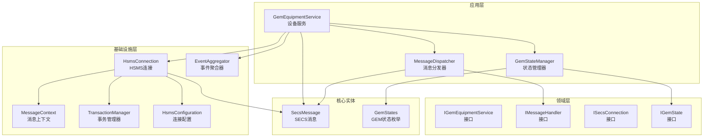
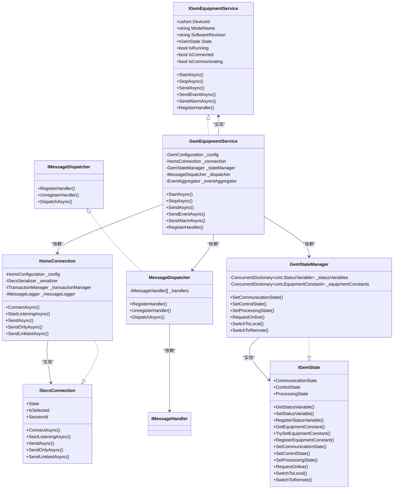
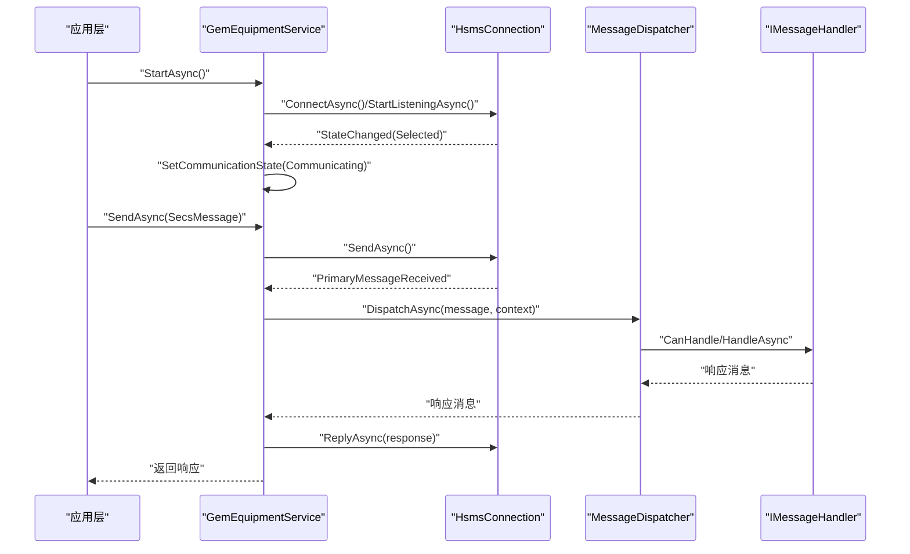
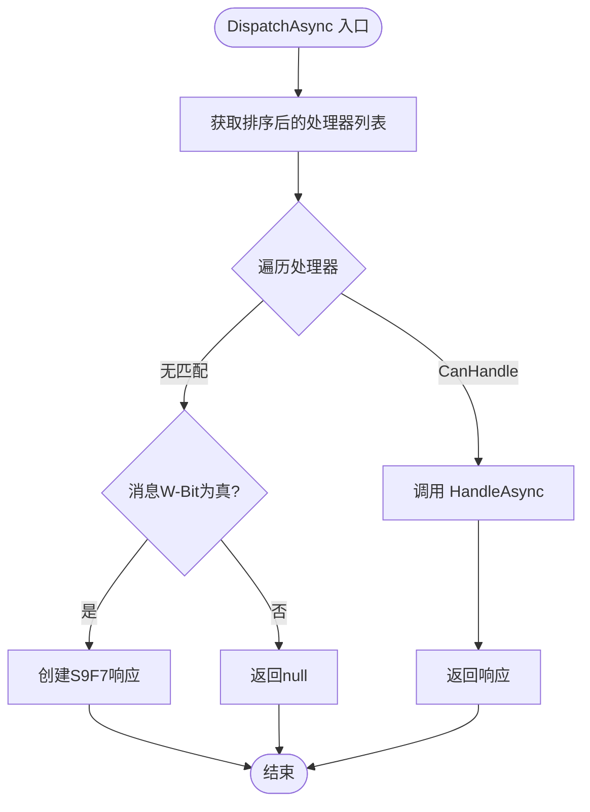
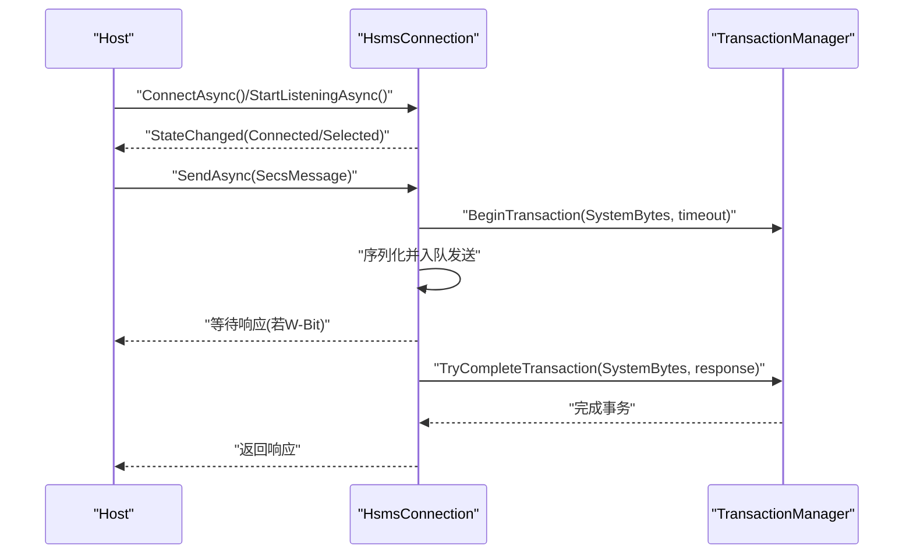
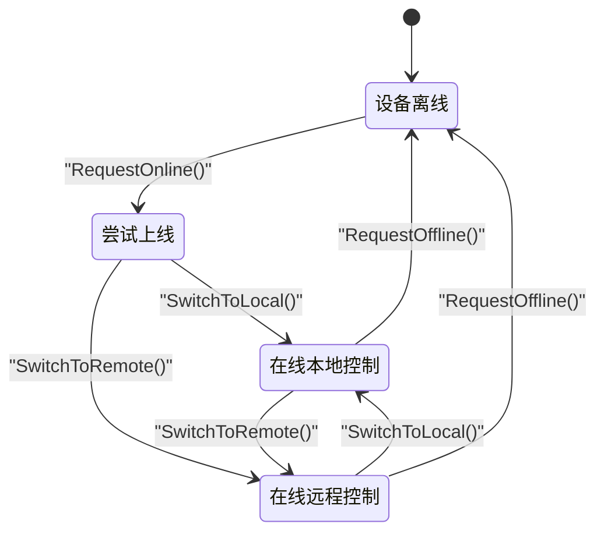
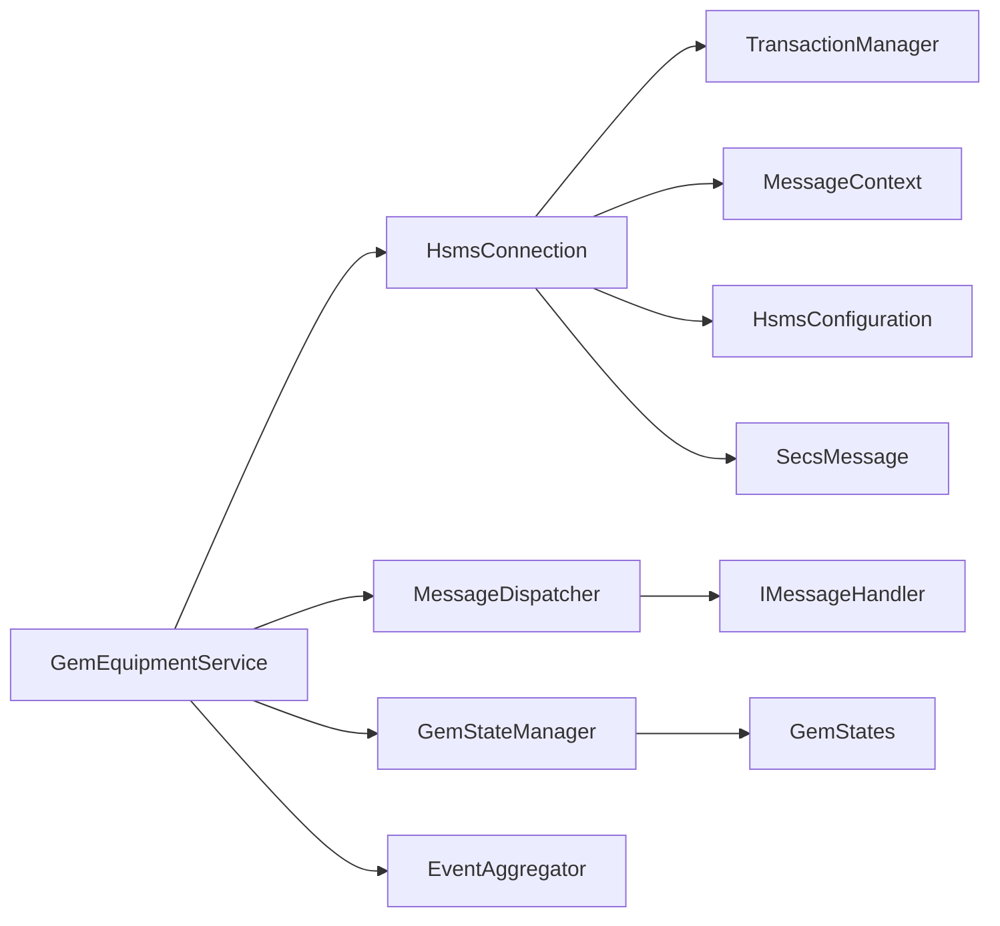

# 核心模块

<cite>
**本文引用的文件**
- [GemEquipmentService.cs](file://WebGem/SECS2GEM/Application/Services/GemEquipmentService.cs)
- [MessageDispatcher.cs](file://WebGem/SECS2GEM/Application/Messaging/MessageDispatcher.cs)
- [HsmsConnection.cs](file://WebGem/SECS2GEM/Infrastructure/Connection/HsmsConnection.cs)
- [GemStateManager.cs](file://WebGem/SECS2GEM/Application/State/GemStateManager.cs)
- [IGemEquipmentService.cs](file://WebGem/SECS2GEM/Domain/Interfaces/IGemEquipmentService.cs)
- [IMessageHandler.cs](file://WebGem/SECS2GEM/Domain/Interfaces/IMessageHandler.cs)
- [ISecsConnection.cs](file://WebGem/SECS2GEM/Domain/Interfaces/ISecsConnection.cs)
- [MessageContext.cs](file://WebGem/SECS2GEM/Infrastructure/Connection/MessageContext.cs)
- [IGemState.cs](file://WebGem/SECS2GEM/Domain/Interfaces/IGemState.cs)
- [HsmsConfiguration.cs](file://WebGem/SECS2GEM/Infrastructure/Configuration/HsmsConfiguration.cs)
- [SecsMessage.cs](file://WebGem/SECS2GEM/Core/Entities/SecsMessage.cs)
- [GemStates.cs](file://WebGem/SECS2GEM/Core/Enums/GemStates.cs)
- [EventAggregator.cs](file://WebGem/SECS2GEM/Infrastructure/Services/EventAggregator.cs)
- [TransactionManager.cs](file://WebGem/SECS2GEM/Infrastructure/Services/TransactionManager.cs)
</cite>

## 目录
1. [简介](#简介)
2. [项目结构](#项目结构)
3. [核心组件](#核心组件)
4. [架构总览](#架构总览)
5. [详细组件分析](#详细组件分析)
6. [依赖关系分析](#依赖关系分析)
7. [性能考量](#性能考量)
8. [故障排除指南](#故障排除指南)
9. [结论](#结论)
10. [附录](#附录)

## 简介
本文件聚焦SECS2-GEM项目的核心模块，系统性阐述以下关键组件的设计与实现：
- GemEquipmentService 服务：作为外观层，整合连接、消息分发与状态管理，向上提供统一的设备服务接口。
- MessageDispatcher 消息分发器：基于责任链+策略模式，动态匹配并委派消息处理器。
- HsmsConnection 连接管理：基于状态机的HSMS连接实现，负责TCP收发、事务管理、心跳与超时控制。
- GemStateManager 状态管理器：封装GEM三态（通信/控制/处理）状态机与SV/EC管理。

文档将从职责边界、接口设计、内部协作机制、数据流与控制流、配置选项、性能与扩展点、故障排除与最佳实践等方面进行深入说明，并辅以图示帮助理解。

## 项目结构
围绕“应用层-领域层-基础设施层”的分层组织，核心模块分布如下：
- 应用层 Application
  - Services：GemEquipmentService
  - Messaging：MessageDispatcher
  - State：GemStateManager
- 领域层 Domain
  - Interfaces：IGemEquipmentService、IMessageHandler、ISecsConnection、IGemState
  - Events：事件模型（用于事件上报）
  - Models：设备常量、状态变量、报警等实体
- 基础设施层 Infrastructure
  - Configuration：HsmsConfiguration
  - Connection：HsmsConnection、MessageContext
  - Services：EventAggregator、TransactionManager
  - Serialization、Logging 等支撑模块
- 核心实体 Core
  - Entities：SecsMessage、SecsItem
  - Enums：GemStates、HsmsMessageType、SecsFormat 等

**图表来源**
- [GemEquipmentService.cs:33-133](file://WebGem/SECS2GEM/Application/Services/GemEquipmentService.cs#L33-L133)
- [MessageDispatcher.cs:27-91](file://WebGem/SECS2GEM/Application/Messaging/MessageDispatcher.cs#L27-L91)
- [HsmsConnection.cs:30-139](file://WebGem/SECS2GEM/Infrastructure/Connection/HsmsConnection.cs#L30-L139)
- [GemStateManager.cs:22-107](file://WebGem/SECS2GEM/Application/State/GemStateManager.cs#L22-L107)
- [IGemEquipmentService.cs:25-158](file://WebGem/SECS2GEM/Domain/Interfaces/IGemEquipmentService.cs#L25-L158)
- [IMessageHandler.cs:63-129](file://WebGem/SECS2GEM/Domain/Interfaces/IMessageHandler.cs#L63-L129)
- [ISecsConnection.cs:71-142](file://WebGem/SECS2GEM/Domain/Interfaces/ISecsConnection.cs#L71-L142)
- [IGemState.cs:20-163](file://WebGem/SECS2GEM/Domain/Interfaces/IGemState.cs#L20-L163)
- [MessageContext.cs:12-62](file://WebGem/SECS2GEM/Infrastructure/Connection/MessageContext.cs#L12-L62)
- [EventAggregator.cs:17-106](file://WebGem/SECS2GEM/Infrastructure/Services/EventAggregator.cs#L17-L106)
- [TransactionManager.cs:24-99](file://WebGem/SECS2GEM/Infrastructure/Services/TransactionManager.cs#L24-L99)
- [HsmsConfiguration.cs:15-228](file://WebGem/SECS2GEM/Infrastructure/Configuration/HsmsConfiguration.cs#L15-L228)
- [SecsMessage.cs:18-104](file://WebGem/SECS2GEM/Core/Entities/SecsMessage.cs#L18-L104)
- [GemStates.cs:10-120](file://WebGem/SECS2GEM/Core/Enums/GemStates.cs#L10-L120)

**章节来源**
- [GemEquipmentService.cs:13-133](file://WebGem/SECS2GEM/Application/Services/GemEquipmentService.cs#L13-L133)
- [HsmsConnection.cs:13-139](file://WebGem/SECS2GEM/Infrastructure/Connection/HsmsConnection.cs#L13-L139)
- [MessageDispatcher.cs:6-91](file://WebGem/SECS2GEM/Application/Messaging/MessageDispatcher.cs#L6-L91)
- [GemStateManager.cs:8-107](file://WebGem/SECS2GEM/Application/State/GemStateManager.cs#L8-L107)

## 核心组件
本节概述四大核心组件的职责与协作方式，为后续深入分析打下基础。

- GemEquipmentService
  - 职责：统一入口，协调连接、分发与状态；提供事件/报警上报能力；注册默认处理器。
  - 关键点：生命周期管理（Start/Stop）、事件桥接（连接/消息/状态）、对外API（发送消息、事件/报警上报）。
- MessageDispatcher
  - 职责：维护处理器列表，按优先级匹配并委派处理；对未处理消息按W-Bit返回S9F7。
  - 关键点：线程安全（锁保护）、排序缓存、动态注册/注销。
- HsmsConnection
  - 职责：HSMS连接生命周期、消息序列化/反序列化、事务管理、心跳与超时、日志记录。
  - 关键点：状态机（NotConnected/Connecting/Connected/Selected/Disconnecting）、Channel异步队列、后台任务。
- GemStateManager
  - 职责：GEM三态状态机与SV/EC管理；状态转换验证；事件上报。
  - 关键点：状态转换规则、并发安全、标准SV注册。

**章节来源**
- [IGemEquipmentService.cs:9-24](file://WebGem/SECS2GEM/Domain/Interfaces/IGemEquipmentService.cs#L9-L24)
- [IMessageHandler.cs:53-62](file://WebGem/SECS2GEM/Domain/Interfaces/IMessageHandler.cs#L53-L62)
- [ISecsConnection.cs:59-70](file://WebGem/SECS2GEM/Domain/Interfaces/ISecsConnection.cs#L59-L70)
- [IGemState.cs:6-19](file://WebGem/SECS2GEM/Domain/Interfaces/IGemState.cs#L6-L19)

## 架构总览
下图展示核心模块间的关系与交互路径，强调“应用层”作为协调者，“基础设施层”提供底层能力，“领域层”定义契约。

**图表来源**
- [IGemEquipmentService.cs:25-158](file://WebGem/SECS2GEM/Domain/Interfaces/IGemEquipmentService.cs#L25-L158)
- [IMessageHandler.cs:63-129](file://WebGem/SECS2GEM/Domain/Interfaces/IMessageHandler.cs#L63-L129)
- [ISecsConnection.cs:71-142](file://WebGem/SECS2GEM/Domain/Interfaces/ISecsConnection.cs#L71-L142)
- [IGemState.cs:20-163](file://WebGem/SECS2GEM/Domain/Interfaces/IGemState.cs#L20-L163)
- [GemEquipmentService.cs:33-133](file://WebGem/SECS2GEM/Application/Services/GemEquipmentService.cs#L33-L133)
- [MessageDispatcher.cs:27-91](file://WebGem/SECS2GEM/Application/Messaging/MessageDispatcher.cs#L27-L91)
- [HsmsConnection.cs:30-139](file://WebGem/SECS2GEM/Infrastructure/Connection/HsmsConnection.cs#L30-L139)
- [GemStateManager.cs:22-107](file://WebGem/SECS2GEM/Application/State/GemStateManager.cs#L22-L107)

## 详细组件分析

### GemEquipmentService 服务
- 职责边界
  - 作为外观层，统一暴露设备服务API，屏蔽底层复杂性。
  - 协调连接（HsmsConnection）、消息分发（MessageDispatcher）、状态（GemStateManager）与事件聚合（EventAggregator）。
- 内部协作机制
  - 构造函数内创建并注入依赖，订阅连接与状态事件，注册默认处理器。
  - 生命周期：StartAsync根据配置启动连接；StopAsync断开并重置状态。
  - 消息处理：OnPrimaryMessageReceived发布消息事件，交由MessageDispatcher分发，必要时通过MessageContext回发响应。
  - 事件/报警：SendEventAsync/SendAlarmAsync构建S6F11/S5F1消息并发送，同时通过EventAggregator发布领域事件。
- 接口设计
  - 对外提供Start/Stop、SendAsync、事件/报警上报、处理器注册等接口。
  - 事件：MessageReceived、StateChanged、ConnectionStateChanged。
- 使用模式
  - 初始化：传入GemConfiguration（包含HsmsConfiguration、设备型号、软件版本、初始控制状态、自动上线与初始模式）。
  - 启动：调用StartAsync，等待连接与通信建立。
  - 上报：SendEventAsync/ SendAlarmAsync用于业务事件与报警上报。
  - 扩展：RegisterHandler注册自定义处理器覆盖默认行为。
- 代码示例路径
  - [构造与依赖注入:110-133](file://WebGem/SECS2GEM/Application/Services/GemEquipmentService.cs#L110-L133)
  - [生命周期管理:140-183](file://WebGem/SECS2GEM/Application/Services/GemEquipmentService.cs#L140-L183)
  - [消息分发与响应:343-358](file://WebGem/SECS2GEM/Application/Services/GemEquipmentService.cs#L343-L358)
  - [事件/报警上报:211-245](file://WebGem/SECS2GEM/Application/Services/GemEquipmentService.cs#L211-L245)
  - [处理器注册:448-451](file://WebGem/SECS2GEM/Application/Services/GemEquipmentService.cs#L448-L451)

**图表来源**
- [GemEquipmentService.cs:140-183](file://WebGem/SECS2GEM/Application/Services/GemEquipmentService.cs#L140-L183)
- [HsmsConnection.cs:427-453](file://WebGem/SECS2GEM/Infrastructure/Connection/HsmsConnection.cs#L427-L453)
- [MessageDispatcher.cs:67-91](file://WebGem/SECS2GEM/Application/Messaging/MessageDispatcher.cs#L67-L91)
- [IMessageHandler.cs:75-87](file://WebGem/SECS2GEM/Domain/Interfaces/IMessageHandler.cs#L75-L87)

**章节来源**
- [GemEquipmentService.cs:33-454](file://WebGem/SECS2GEM/Application/Services/GemEquipmentService.cs#L33-L454)
- [IGemEquipmentService.cs:25-158](file://WebGem/SECS2GEM/Domain/Interfaces/IGemEquipmentService.cs#L25-L158)

### MessageDispatcher 消息分发器
- 职责边界
  - 维护处理器集合，按优先级匹配首个可处理的处理器；未匹配时按W-Bit返回S9F7。
- 内部协作机制
  - Register/Unregister：线程安全地增删处理器，标记排序失效。
  - DispatchAsync：获取排序后的处理器列表，遍历CanHandle，委托HandleAsync。
  - 排序策略：按Priority升序，首次访问时缓存排序结果，后续复用。
- 接口设计
  - IMessageDispatcher：注册/注销/分发。
  - IMessageHandler：处理器接口（优先级、CanHandle、HandleAsync）。
- 性能与扩展
  - 排序缓存减少重复排序开销；支持动态注册/覆盖默认处理器。
- 代码示例路径
  - [注册/注销处理器:37-58](file://WebGem/SECS2GEM/Application/Messaging/MessageDispatcher.cs#L37-L58)
  - [分发流程:67-91](file://WebGem/SECS2GEM/Application/Messaging/MessageDispatcher.cs#L67-L91)
  - [排序与S9F7响应:96-120](file://WebGem/SECS2GEM/Application/Messaging/MessageDispatcher.cs#L96-L120)

**图表来源**
- [MessageDispatcher.cs:67-120](file://WebGem/SECS2GEM/Application/Messaging/MessageDispatcher.cs#L67-L120)
- [IMessageHandler.cs:75-87](file://WebGem/SECS2GEM/Domain/Interfaces/IMessageHandler.cs#L75-L87)

**章节来源**
- [MessageDispatcher.cs:27-121](file://WebGem/SECS2GEM/Application/Messaging/MessageDispatcher.cs#L27-L121)
- [IMessageHandler.cs:63-129](file://WebGem/SECS2GEM/Domain/Interfaces/IMessageHandler.cs#L63-L129)

### HsmsConnection 连接管理
- 职责边界
  - HSMS连接生命周期管理（Active/Passive）、消息收发、事务管理、心跳与超时、日志记录。
- 内部协作机制
  - 状态机：NotConnected → Connecting → Connected → Selected → Disconnecting。
  - 异步任务：接收循环、发送循环、心跳循环；Channel承载发送队列。
  - 事务管理：TransactionManager负责SystemBytes生成与响应等待。
  - 控制消息处理：Select/Deselect/Linktest/Separate等控制消息的收发与状态更新。
- 接口设计
  - ISecsConnection：连接状态、事件、Connect/Listen/Send/Linktest等。
  - MessageContext：向处理器提供ReplyAsync能力。
- 性能与可靠性
  - Channel异步队列避免阻塞；心跳失败阈值断开；T7超时限制Passive等待。
- 代码示例路径
  - [连接/监听/断开:146-337](file://WebGem/SECS2GEM/Infrastructure/Connection/HsmsConnection.cs#L146-L337)
  - [发送与事务:427-453](file://WebGem/SECS2GEM/Infrastructure/Connection/HsmsConnection.cs#L427-L453)
  - [接收循环与消息解析:550-610](file://WebGem/SECS2GEM/Infrastructure/Connection/HsmsConnection.cs#L550-L610)
  - [心跳循环:693-723](file://WebGem/SECS2GEM/Infrastructure/Connection/HsmsConnection.cs#L693-L723)
  - [控制消息处理:747-791](file://WebGem/SECS2GEM/Infrastructure/Connection/HsmsConnection.cs#L747-L791)
  - [消息上下文:12-62](file://WebGem/SECS2GEM/Infrastructure/Connection/MessageContext.cs#L12-L62)

**图表来源**
- [HsmsConnection.cs:427-453](file://WebGem/SECS2GEM/Infrastructure/Connection/HsmsConnection.cs#L427-L453)
- [TransactionManager.cs:46-72](file://WebGem/SECS2GEM/Infrastructure/Services/TransactionManager.cs#L46-L72)
- [ISecsConnection.cs:104-141](file://WebGem/SECS2GEM/Domain/Interfaces/ISecsConnection.cs#L104-L141)

**章节来源**
- [HsmsConnection.cs:30-800](file://WebGem/SECS2GEM/Infrastructure/Connection/HsmsConnection.cs#L30-L800)
- [ISecsConnection.cs:71-142](file://WebGem/SECS2GEM/Domain/Interfaces/ISecsConnection.cs#L71-L142)
- [MessageContext.cs:12-62](file://WebGem/SECS2GEM/Infrastructure/Connection/MessageContext.cs#L12-L62)
- [TransactionManager.cs:24-201](file://WebGem/SECS2GEM/Infrastructure/Services/TransactionManager.cs#L24-L201)

### GemStateManager 状态管理器
- 职责边界
  - 封装GEM三态（通信/控制/处理）状态机；管理SV/EC；提供状态转换验证与事件。
- 内部协作机制
  - 并发安全：状态字段加锁；SV/EC使用并发字典。
  - 状态转换：提供SetCommunicationState/SetControlState/SetProcessingState与RequestOnline/SwitchToLocal/SwitchToRemote等。
  - 标准SV：注册标准状态变量（如时钟、控制状态）。
- 接口设计
  - IGemState：状态属性、事件、SV/EC访问与状态转换。
- 代码示例路径
  - [状态属性与事件:48-93](file://WebGem/SECS2GEM/Application/State/GemStateManager.cs#L48-L93)
  - [SV/EC管理:114-192](file://WebGem/SECS2GEM/Application/State/GemStateManager.cs#L114-L192)
  - [状态转换:201-348](file://WebGem/SECS2GEM/Application/State/GemStateManager.cs#L201-L348)
  - [标准SV注册:464-487](file://WebGem/SECS2GEM/Application/State/GemStateManager.cs#L464-L487)

**图表来源**
- [GemStateManager.cs:201-348](file://WebGem/SECS2GEM/Application/State/GemStateManager.cs#L201-L348)
- [GemStates.cs:50-81](file://WebGem/SECS2GEM/Core/Enums/GemStates.cs#L50-L81)

**章节来源**
- [GemStateManager.cs:22-492](file://WebGem/SECS2GEM/Application/State/GemStateManager.cs#L22-L492)
- [IGemState.cs:20-163](file://WebGem/SECS2GEM/Domain/Interfaces/IGemState.cs#L20-L163)
- [GemStates.cs:10-120](file://WebGem/SECS2GEM/Core/Enums/GemStates.cs#L10-L120)

## 依赖关系分析
- 组件耦合
  - GemEquipmentService高内聚地编排HsmsConnection、MessageDispatcher、GemStateManager与EventAggregator。
  - MessageDispatcher与IMessageHandler松耦合，通过接口与优先级实现策略解耦。
  - HsmsConnection与TransactionManager、MessageContext紧密协作，确保事务与回发能力。
- 外部依赖
  - 配置：HsmsConfiguration提供超时、缓冲区、心跳等参数。
  - 日志：MessageLogger记录消息收发（可配置）。
  - 序列化：SecsSerializer负责消息序列化。
- 循环依赖
  - 未发现循环依赖；事件通过EventAggregator异步发布，避免强耦合。

**图表来源**
- [GemEquipmentService.cs:33-133](file://WebGem/SECS2GEM/Application/Services/GemEquipmentService.cs#L33-L133)
- [HsmsConnection.cs:30-139](file://WebGem/SECS2GEM/Infrastructure/Connection/HsmsConnection.cs#L30-L139)
- [MessageDispatcher.cs:27-91](file://WebGem/SECS2GEM/Application/Messaging/MessageDispatcher.cs#L27-L91)
- [GemStateManager.cs:22-107](file://WebGem/SECS2GEM/Application/State/GemStateManager.cs#L22-L107)
- [HsmsConfiguration.cs:15-228](file://WebGem/SECS2GEM/Infrastructure/Configuration/HsmsConfiguration.cs#L15-L228)
- [SecsMessage.cs:18-104](file://WebGem/SECS2GEM/Core/Entities/SecsMessage.cs#L18-L104)
- [GemStates.cs:10-120](file://WebGem/SECS2GEM/Core/Enums/GemStates.cs#L10-L120)

**章节来源**
- [HsmsConfiguration.cs:15-266](file://WebGem/SECS2GEM/Infrastructure/Configuration/HsmsConfiguration.cs#L15-L266)
- [EventAggregator.cs:17-106](file://WebGem/SECS2GEM/Infrastructure/Services/EventAggregator.cs#L17-L106)

## 性能考量
- 异步与并发
  - HsmsConnection使用Channel与多后台任务实现非阻塞收发与心跳；MessageDispatcher缓存排序结果降低CPU开销。
- 资源管理
  - TransactionManager使用Interlocked生成事务ID，ConcurrentDictionary管理活跃事务，避免锁竞争。
  - HsmsConnection在断开时清理资源（取消任务、关闭流、取消事务）。
- 配置优化
  - 缓冲区大小（ReceiveBufferSize/SendBufferSize）、最大消息大小（MaxMessageSize）、心跳间隔（LinktestInterval）与超时（T3/T6/T7/T8）直接影响吞吐与稳定性。
- 建议
  - 根据网络环境调整缓冲区与超时；启用消息日志仅在调试阶段；合理设置AutoOnline与InitialRemoteMode以减少握手时间。

[本节为通用指导，无需特定文件来源]

## 故障排除指南
- 连接问题
  - 现象：无法建立连接或频繁断开。
  - 排查：检查HsmsConfiguration的Mode、IpAddress、Port、T7超时；查看HsmsConnection.State事件与日志。
  - 参考路径：[连接/断开与T7超时:146-296](file://WebGem/SECS2GEM/Infrastructure/Connection/HsmsConnection.cs#L146-L296)
- 事务超时
  - 现象：SendAsync等待响应超时。
  - 排查：检查T3超时、网络延迟、处理器处理耗时；确认TransactionManager活跃事务数。
  - 参考路径：[事务管理与超时:46-110](file://WebGem/SECS2GEM/Infrastructure/Services/TransactionManager.cs#L46-L110)
- 消息未处理
  - 现象：收到Primary消息无响应。
  - 排查：确认MessageDispatcher已注册对应处理器；检查处理器Priority与CanHandle逻辑。
  - 参考路径：[消息分发与S9F7:67-120](file://WebGem/SECS2GEM/Application/Messaging/MessageDispatcher.cs#L67-L120)
- 状态异常
  - 现象：状态转换无效或状态不一致。
  - 排查：核对GemStateManager的状态转换规则；检查事件订阅与发布顺序。
  - 参考路径：[状态转换验证:357-455](file://WebGem/SECS2GEM/Application/State/GemStateManager.cs#L357-L455)
- 心跳失败
  - 现象：心跳连续失败导致断开。
  - 排查：检查LinktestInterval与MaxLinktestFailures；网络抖动与防火墙。
  - 参考路径：[心跳循环:693-723](file://WebGem/SECS2GEM/Infrastructure/Connection/HsmsConnection.cs#L693-L723)

**章节来源**
- [HsmsConnection.cs:146-296](file://WebGem/SECS2GEM/Infrastructure/Connection/HsmsConnection.cs#L146-L296)
- [TransactionManager.cs:46-110](file://WebGem/SECS2GEM/Infrastructure/Services/TransactionManager.cs#L46-L110)
- [MessageDispatcher.cs:67-120](file://WebGem/SECS2GEM/Application/Messaging/MessageDispatcher.cs#L67-L120)
- [GemStateManager.cs:357-455](file://WebGem/SECS2GEM/Application/State/GemStateManager.cs#L357-L455)

## 结论
本文件系统梳理了SECS2-GEM核心模块的设计与实现，明确了各组件的职责边界、接口契约与协作机制。GemEquipmentService作为外观层协调连接、分发与状态；MessageDispatcher通过策略与责任链实现灵活的消息处理；HsmsConnection提供稳健的HSMS连接与事务管理；GemStateManager封装GEM三态状态机与SV/EC。结合配置、性能与故障排除建议，可为实际工程落地提供清晰指引。

[本节为总结，无需特定文件来源]

## 附录
- 配置选项速览
  - HsmsConfiguration：DeviceId、IpAddress、Port、Mode、T3/T5/T6/T7/T8、LinktestInterval、MaxLinktestFailures、MaxMessageSize、ReceiveBufferSize、SendBufferSize、AutoReconnect、ReconnectDelay、MessageLogging。
  - GemConfiguration：Hsms、ModelName、SoftwareRevision、InitialControlState、AutoOnline、InitialRemoteMode。
- 常用消息工厂
  - SecsMessage提供S1F1、S1F2、S1F13、S1F14、S9Fx等常用消息工厂方法，便于快速构建标准消息。
- 事件与日志
  - EventAggregator提供异步/同步事件发布与订阅；MessageLogger按配置记录消息收发。

**章节来源**
- [HsmsConfiguration.cs:15-266](file://WebGem/SECS2GEM/Infrastructure/Configuration/HsmsConfiguration.cs#L15-L266)
- [SecsMessage.cs:140-206](file://WebGem/SECS2GEM/Core/Entities/SecsMessage.cs#L140-L206)
- [EventAggregator.cs:17-106](file://WebGem/SECS2GEM/Infrastructure/Services/EventAggregator.cs#L17-L106)