# Stream消息处理

<cite>
**本文档引用的文件**
- [StreamOneHandlers.cs](file://WebGem/SECS2GEM/Application/Handlers/StreamOneHandlers.cs)
- [StreamTwoHandlers.cs](file://WebGem/SECS2GEM/Application/Handlers/StreamTwoHandlers.cs)
- [OtherStreamHandlers.cs](file://WebGem/SECS2GEM/Application/Handlers/OtherStreamHandlers.cs)
- [MessageDispatcher.cs](file://WebGem/SECS2GEM/Application/Messaging/MessageDispatcher.cs)
- [IMessageHandler.cs](file://WebGem/SECS2GEM/Domain/Interfaces/IMessageHandler.cs)
- [SecsMessage.cs](file://WebGem/SECS2GEM/Core/Entities/SecsMessage.cs)
- [SecsItem.cs](file://WebGem/SECS2GEM/Core/Entities/SecsItem.cs)
- [EquipmentConstant.cs](file://WebGem/SECS2GEM/Domain/Models/EquipmentConstant.cs)
- [IEventAggregator.cs](file://WebGem/SECS2GEM/Domain/Interfaces/IEventAggregator.cs)
- [TransactionManager.cs](file://WebGem/SECS2GEM/Infrastructure/Services/TransactionManager.cs)
- [HsmsConfiguration.cs](file://WebGem/SECS2GEM/Infrastructure/Configuration/HsmsConfiguration.cs)
- [GemStateManager.cs](file://WebGem/SECS2GEM/Application/State/GemStateManager.cs)
- [IGemState.cs](file://WebGem/SECS2GEM/Domain/Interfaces/IGemState.cs)
- [MessageHandlerTests.cs](file://WebGem/SECS2GEM.Tests/MessageHandlerTests.cs)
- [GEM_Protocol_Specification.md](file://WebGem/SECS2GEM/GEM_Protocol_Specification.md)
</cite>

## 目录
1. [简介](#简介)
2. [项目结构](#项目结构)
3. [核心组件](#核心组件)
4. [架构概览](#架构概览)
5. [详细组件分析](#详细组件分析)
6. [依赖关系分析](#依赖关系分析)
7. [性能考虑](#性能考虑)
8. [故障排除指南](#故障排除指南)
9. [结论](#结论)

## 简介

本文档专注于SECS-II协议中Stream 1-10的消息处理机制，详细阐述主从消息配对规则、响应时机以及不同类型Stream的用途和处理流程。SECS-II（Semiconductor Equipment and Materials International Organization）是半导体制造设备与主机系统之间的标准通信协议，基于HSMS（High-Speed Message Service）实现。

在本系统中，Stream 1-10分别对应不同的设备管理功能：
- **Stream 1**: 设备状态管理（连接建立、设备状态查询）
- **Stream 2**: 设备控制（设备常量管理、事件报告、远程命令）
- **Stream 5**: 异常处理（报警管理）
- **Stream 6**: 数据采集（事件报告）
- **Stream 7**: 配方管理（工艺程序管理）
- **Stream 10**: 终端服务（显示控制）

## 项目结构

系统采用分层架构设计，主要分为以下层次：

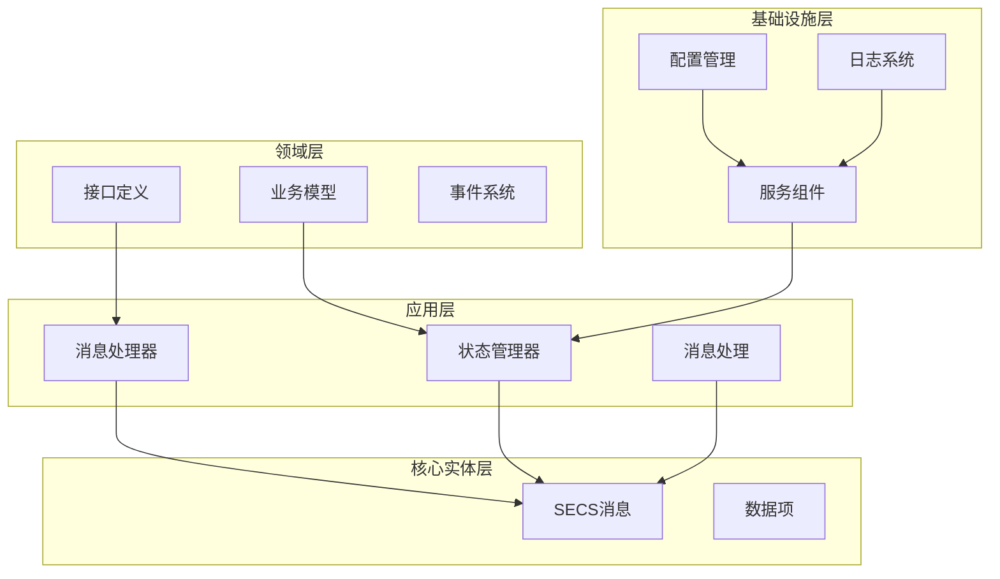

**图表来源**
- [MessageDispatcher.cs:1-123](file://WebGem/SECS2GEM/Application/Messaging/MessageDispatcher.cs#L1-123)
- [IMessageHandler.cs:1-131](file://WebGem/SECS2GEM/Domain/Interfaces/IMessageHandler.cs#L1-131)

**章节来源**
- [MessageDispatcher.cs:1-123](file://WebGem/SECS2GEM/Application/Messaging/MessageDispatcher.cs#L1-123)
- [IMessageHandler.cs:1-131](file://WebGem/SECS2GEM/Domain/Interfaces/IMessageHandler.cs#L1-131)

## 核心组件

### 消息处理器基类

系统实现了模板方法模式的消息处理器基类，提供统一的处理框架：

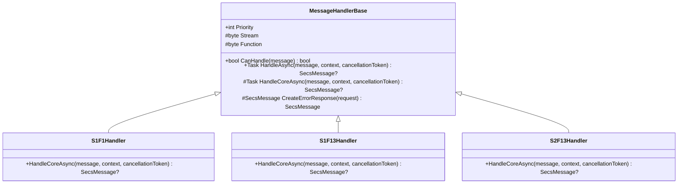

**图表来源**
- [StreamOneHandlers.cs:20-86](file://WebGem/SECS2GEM/Application/Handlers/StreamOneHandlers.cs#L20-86)
- [StreamOneHandlers.cs:94-114](file://WebGem/SECS2GEM/Application/Handlers/StreamOneHandlers.cs#L94-114)

### 消息分发器

消息分发器采用责任链+策略模式，负责将消息路由到相应的处理器：

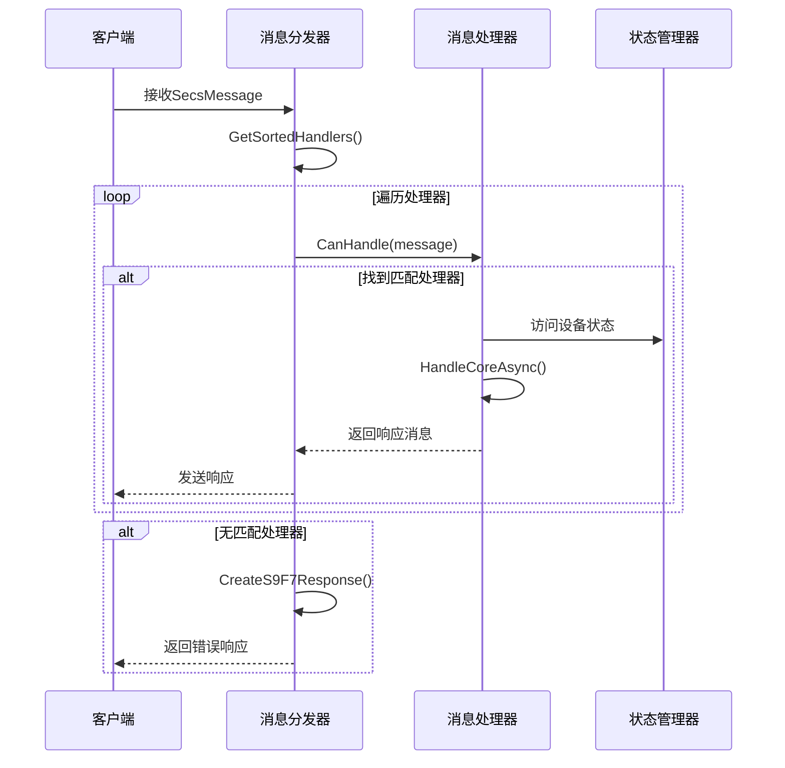

**图表来源**
- [MessageDispatcher.cs:67-91](file://WebGem/SECS2GEM/Application/Messaging/MessageDispatcher.cs#L67-91)
- [IMessageHandler.cs:63-88](file://WebGem/SECS2GEM/Domain/Interfaces/IMessageHandler.cs#L63-88)

**章节来源**
- [MessageDispatcher.cs:1-123](file://WebGem/SECS2GEM/Application/Messaging/MessageDispatcher.cs#L1-123)
- [IMessageHandler.cs:1-131](file://WebGem/SECS2GEM/Domain/Interfaces/IMessageHandler.cs#L1-131)

## 架构概览

系统采用模块化设计，各组件职责明确：

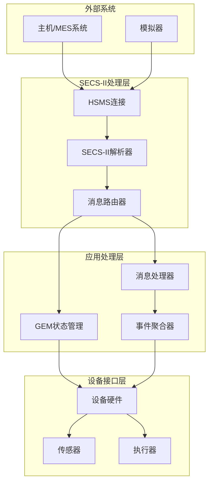

**图表来源**
- [GemStateManager.cs:22-492](file://WebGem/SECS2GEM/Application/State/GemStateManager.cs#L22-492)
- [TransactionManager.cs:24-201](file://WebGem/SECS2GEM/Infrastructure/Services/TransactionManager.cs#L24-201)

## 详细组件分析

### Stream 1 - 设备状态管理

Stream 1负责设备状态相关的消息处理，包括连接建立、设备状态查询等功能。

#### S1F1 - Are You There

S1F1是设备存在查询消息，用于检测设备是否在线：

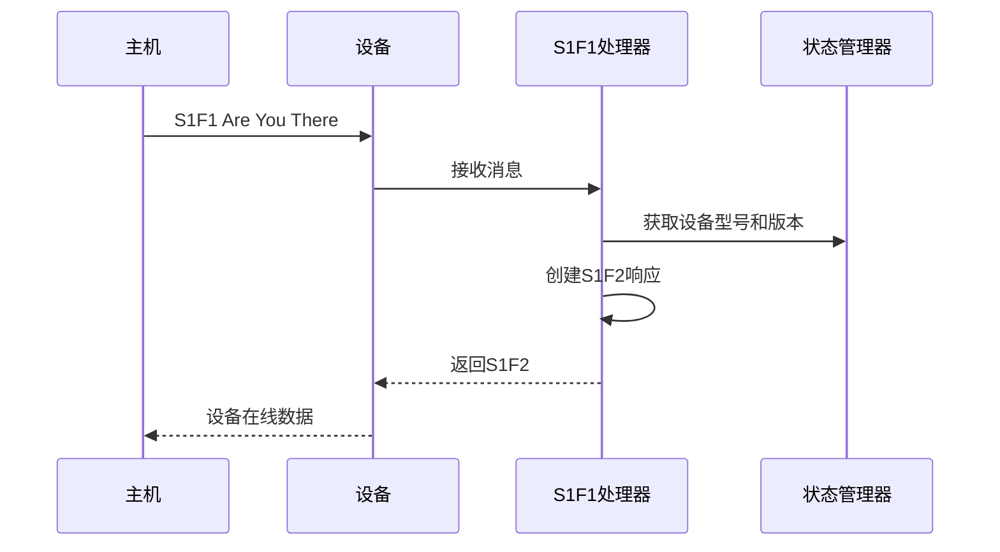

**图表来源**
- [StreamOneHandlers.cs:99-113](file://WebGem/SECS2GEM/Application/Handlers/StreamOneHandlers.cs#L99-113)

#### S1F13 - Establish Communications Request

S1F13用于建立通信连接请求：

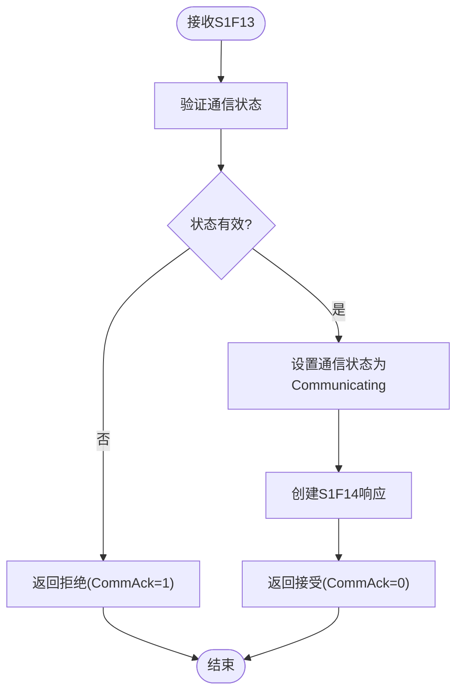

**图表来源**
- [StreamOneHandlers.cs:127-148](file://WebGem/SECS2GEM/Application/Handlers/StreamOneHandlers.cs#L127-148)

**章节来源**
- [StreamOneHandlers.cs:89-210](file://WebGem/SECS2GEM/Application/Handlers/StreamOneHandlers.cs#L89-210)

### Stream 2 - 设备控制

Stream 2处理设备控制相关消息，包括设备常量管理、事件报告和远程命令。

#### S2F13 - Equipment Constant Request

设备常量查询处理器：

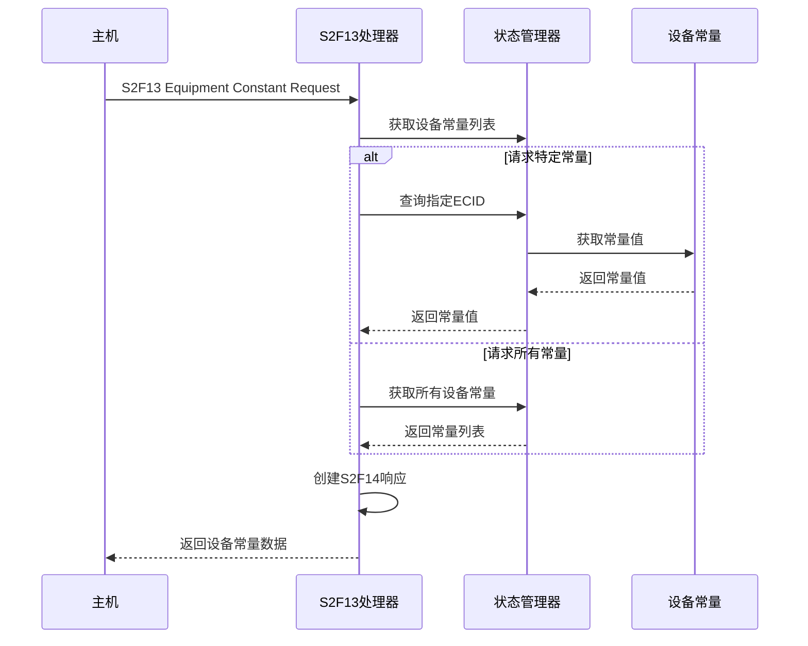

**图表来源**
- [StreamTwoHandlers.cs:18-57](file://WebGem/SECS2GEM/Application/Handlers/StreamTwoHandlers.cs#L18-57)

#### S2F41 - Host Command Send

远程命令处理处理器：

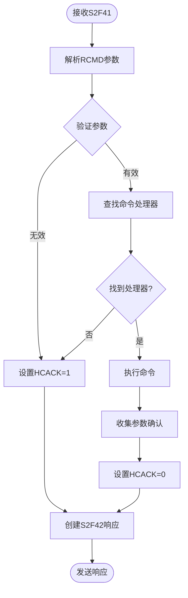

**图表来源**
- [StreamTwoHandlers.cs:285-328](file://WebGem/SECS2GEM/Application/Handlers/StreamTwoHandlers.cs#L285-328)

**章节来源**
- [StreamTwoHandlers.cs:1-331](file://WebGem/SECS2GEM/Application/Handlers/StreamTwoHandlers.cs#L1-331)

### 其他Stream处理

#### Stream 5 - 异常处理

Stream 5处理报警相关的消息：

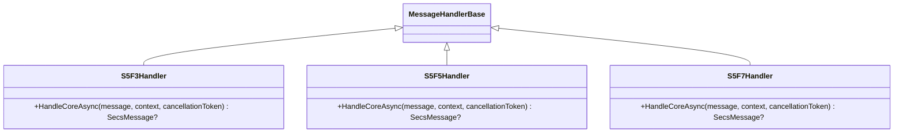

**图表来源**
- [OtherStreamHandlers.cs:9-27](file://WebGem/SECS2GEM/Application/Handlers/OtherStreamHandlers.cs#L9-27)

#### Stream 6 - 数据采集

Stream 6处理事件报告相关消息：

**图表来源**
- [OtherStreamHandlers.cs:72-113](file://WebGem/SECS2GEM/Application/Handlers/OtherStreamHandlers.cs#L72-113)

#### Stream 7 - 配方管理

Stream 7处理工艺程序管理：

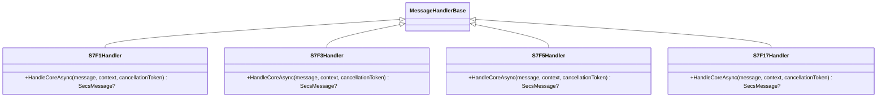

**图表来源**
- [OtherStreamHandlers.cs:118-208](file://WebGem/SECS2GEM/Application/Handlers/OtherStreamHandlers.cs#L118-208)

#### Stream 10 - 终端服务

Stream 10处理终端显示相关消息：

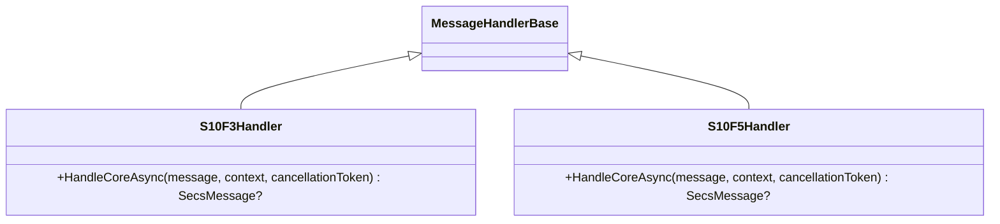

**图表来源**
- [OtherStreamHandlers.cs:233-274](file://WebGem/SECS2GEM/Application/Handlers/OtherStreamHandlers.cs#L233-274)

**章节来源**
- [OtherStreamHandlers.cs:1-276](file://WebGem/SECS2GEM/Application/Handlers/OtherStreamHandlers.cs#L1-276)

## 依赖关系分析

系统采用松耦合设计，通过接口隔离实现依赖注入：

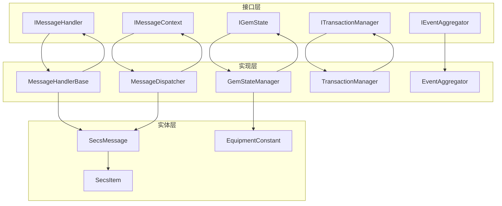

**图表来源**
- [IMessageHandler.cs:63-131](file://WebGem/SECS2GEM/Domain/Interfaces/IMessageHandler.cs#L63-131)
- [GemStateManager.cs:22-492](file://WebGem/SECS2GEM/Application/State/GemStateManager.cs#L22-492)

**章节来源**
- [IMessageHandler.cs:1-131](file://WebGem/SECS2GEM/Domain/Interfaces/IMessageHandler.cs#L1-131)
- [GemStateManager.cs:1-492](file://WebGem/SECS2GEM/Application/State/GemStateManager.cs#L1-492)

## 性能考虑

### 事务处理机制

系统实现了完整的事务管理机制，确保消息处理的可靠性和一致性：

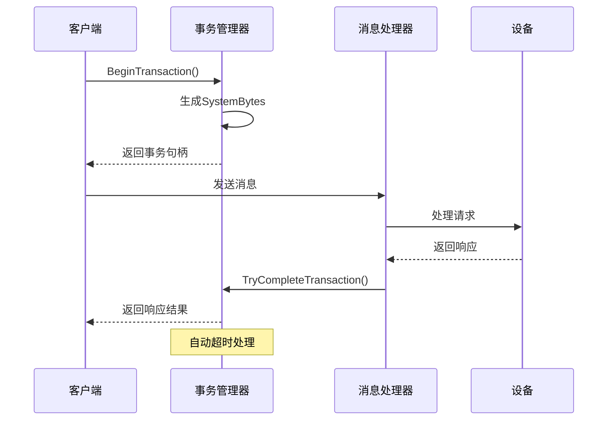

**图表来源**
- [TransactionManager.cs:46-72](file://WebGem/SECS2GEM/Infrastructure/Services/TransactionManager.cs#L46-72)

### 超时参数配置

系统提供了灵活的超时参数配置，支持不同场景的需求：

| 参数 | 名称 | 描述 | 默认值 |
|------|------|------|--------|
| T3 | Reply Timeout | 等待回复超时 | 45秒 |
| T5 | Connection Separation Timeout | 连接分离超时 | 10秒 |
| T6 | Control Transaction Timeout | 控制事务超时 | 5秒 |
| T7 | Not Selected Timeout | 未选择超时 | 10秒 |
| T8 | Network Intercharacter Timeout | 网络字符间隔超时 | 5秒 |

**章节来源**
- [TransactionManager.cs:1-201](file://WebGem/SECS2GEM/Infrastructure/Services/TransactionManager.cs#L1-201)
- [HsmsConfiguration.cs:15-266](file://WebGem/SECS2GEM/Infrastructure/Configuration/HsmsConfiguration.cs#L15-266)

## 故障排除指南

### 常见问题及解决方案

#### 消息处理失败

当消息无法被任何处理器处理时，系统会返回S9F7错误响应：

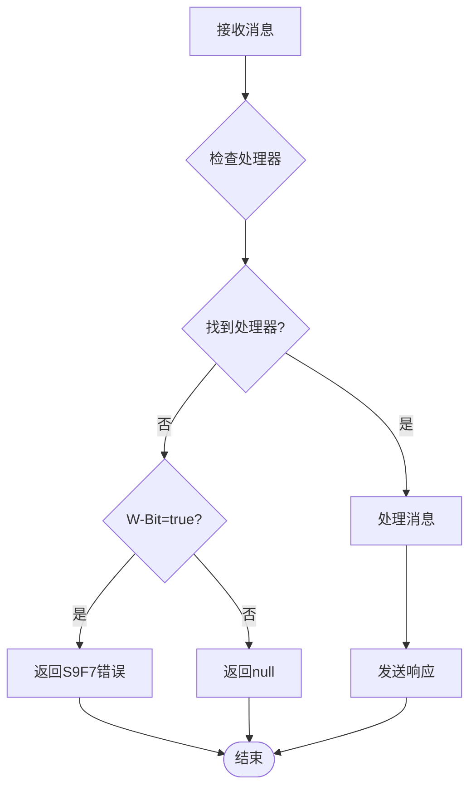

**图表来源**
- [MessageDispatcher.cs:83-91](file://WebGem/SECS2GEM/Application/Messaging/MessageDispatcher.cs#L83-91)

#### 状态转换异常

设备状态转换需要遵循严格的规则，违反规则会导致状态转换失败：

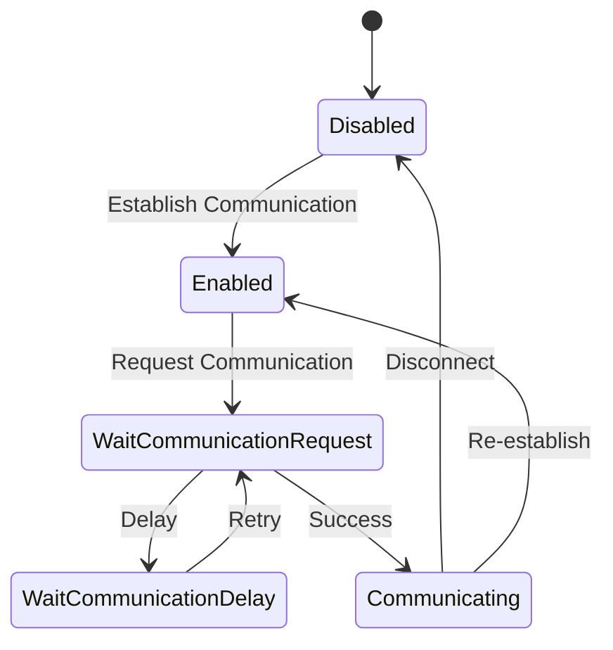

**图表来源**
- [GemStateManager.cs:357-387](file://WebGem/SECS2GEM/Application/State/GemStateManager.cs#L357-387)

### 测试验证

系统提供了完整的单元测试，验证各种消息处理场景：

**章节来源**
- [MessageHandlerTests.cs:1-279](file://WebGem/SECS2GEM.Tests/MessageHandlerTests.cs#L1-279)

## 结论

本系统为SECS-II协议中的Stream 1-10消息处理提供了完整的解决方案，具有以下特点：

1. **模块化设计**: 采用分层架构，各组件职责明确，便于维护和扩展
2. **标准化实现**: 严格遵循GEM协议规范，确保与主机系统的兼容性
3. **可靠性保障**: 实现了完整的事务管理、超时处理和错误恢复机制
4. **灵活性**: 支持动态注册处理器，可根据需求扩展新的消息类型
5. **可测试性**: 提供完善的单元测试，确保代码质量

通过合理利用这些组件和机制，可以构建稳定可靠的SECS-II设备通信系统，满足半导体制造设备与主机系统之间的数据交换需求。