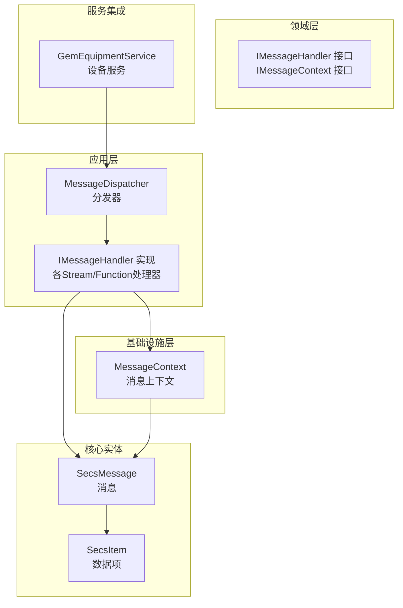
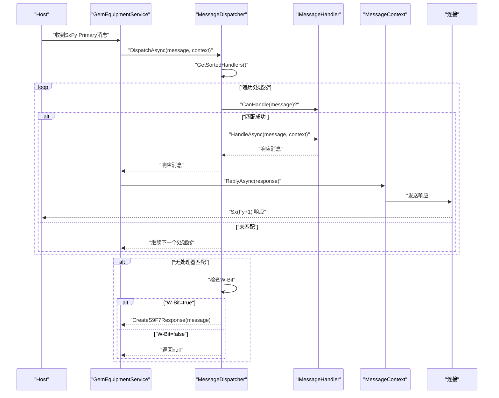
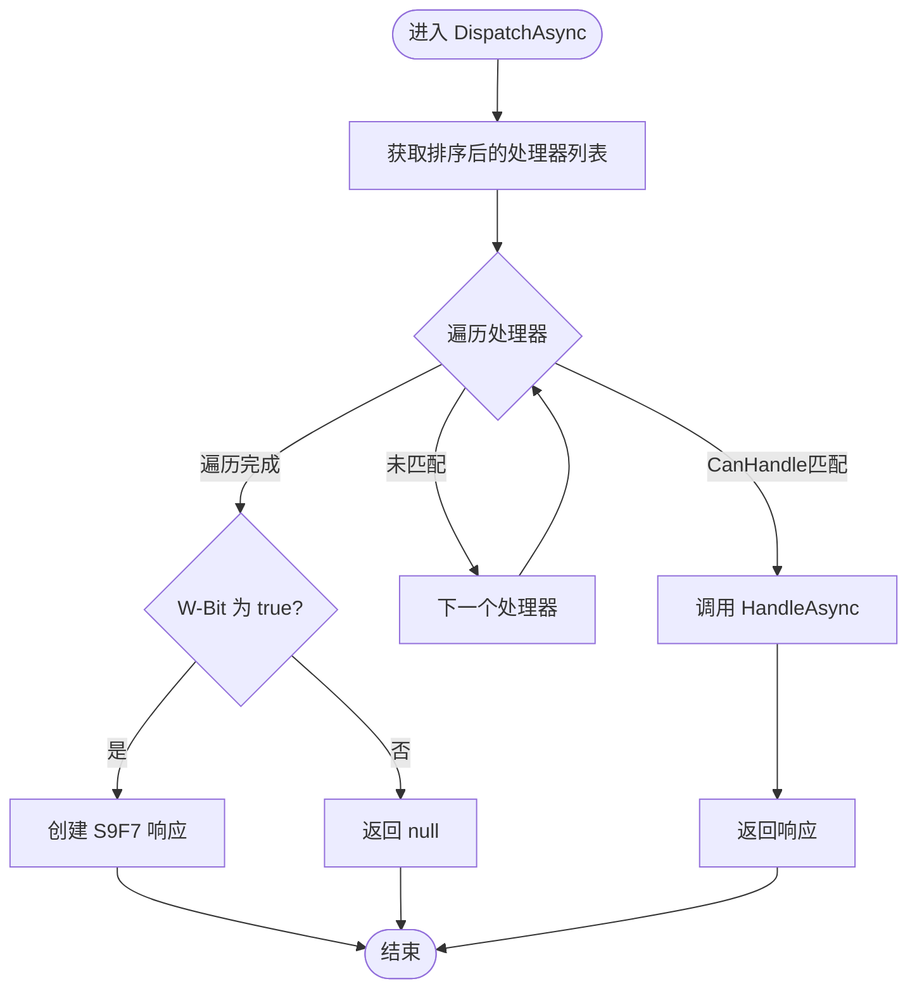
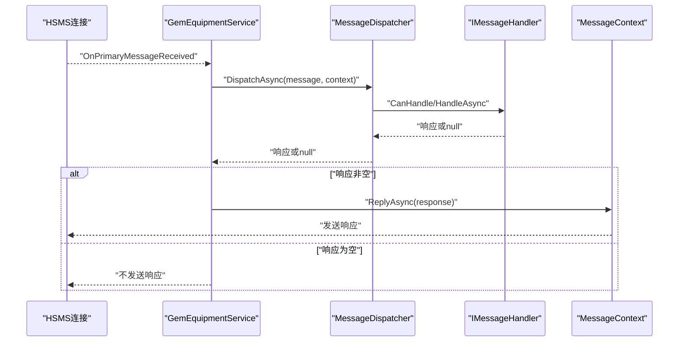
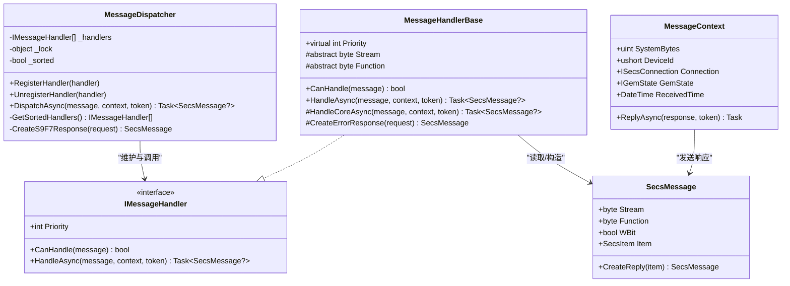

# 分发机制

<cite>
**本文引用的文件**
- [MessageDispatcher.cs](file://WebGem/SECS2GEM/Application/Messaging/MessageDispatcher.cs)
- [IMessageHandler.cs](file://WebGem/SECS2GEM/Domain/Interfaces/IMessageHandler.cs)
- [StreamOneHandlers.cs](file://WebGem/SECS2GEM/Application/Handlers/StreamOneHandlers.cs)
- [StreamTwoHandlers.cs](file://WebGem/SECS2GEM/Application/Handlers/StreamTwoHandlers.cs)
- [OtherStreamHandlers.cs](file://WebGem/SECS2GEM/Application/Handlers/OtherStreamHandlers.cs)
- [SecsMessage.cs](file://WebGem/SECS2GEM/Core/Entities/SecsMessage.cs)
- [SecsItem.cs](file://WebGem/SECS2GEM/Core/Entities/SecsItem.cs)
- [MessageContext.cs](file://WebGem/SECS2GEM/Infrastructure/Connection/MessageContext.cs)
- [GemEquipmentService.cs](file://WebGem/SECS2GEM/Application/Services/GemEquipmentService.cs)
- [MessageHandlerTests.cs](file://WebGem/SECS2GEM.Tests/MessageHandlerTests.cs)
</cite>

## 目录
1. [简介](#简介)
2. [项目结构](#项目结构)
3. [核心组件](#核心组件)
4. [架构总览](#架构总览)
5. [详细组件分析](#详细组件分析)
6. [依赖关系分析](#依赖关系分析)
7. [性能考量](#性能考量)
8. [故障排查指南](#故障排查指南)
9. [结论](#结论)
10. [附录](#附录)

## 简介
本文件围绕 SECS2GEM 的消息分发机制进行深入解析，重点阐述 MessageDispatcher 的核心算法与设计思想，包括责任链模式与策略模式的组合使用；处理器注册与注销流程、优先级排序机制、线程安全保证与性能优化策略；以及 DispatchAsync 方法的执行流程（消息遍历、处理器匹配与响应生成）。同时提供 S9F7 响应的创建逻辑与 W-Bit 标志位的处理规则说明，并给出正确的使用方式与异常处理建议。

## 项目结构
分发机制相关代码主要分布在以下模块：
- 应用层消息分发：Application/Messaging/MessageDispatcher.cs
- 接口契约：Domain/Interfaces/IMessageHandler.cs
- 处理器实现：Application/Handlers/*Handlers.cs
- 消息实体：Core/Entities/SecsMessage.cs、SecsItem.cs
- 上下文封装：Infrastructure/Connection/MessageContext.cs
- 服务集成：Application/Services/GemEquipmentService.cs
- 测试验证：SECS2GEM.Tests/MessageHandlerTests.cs

图表来源
- [MessageDispatcher.cs:1-123](file://WebGem/SECS2GEM/Application/Messaging/MessageDispatcher.cs#L1-L123)
- [IMessageHandler.cs:1-131](file://WebGem/SECS2GEM/Domain/Interfaces/IMessageHandler.cs#L1-L131)
- [MessageContext.cs:1-65](file://WebGem/SECS2GEM/Infrastructure/Connection/MessageContext.cs#L1-L65)
- [SecsMessage.cs:1-209](file://WebGem/SECS2GEM/Core/Entities/SecsMessage.cs#L1-L209)
- [SecsItem.cs:1-480](file://WebGem/SECS2GEM/Core/Entities/SecsItem.cs#L1-L480)
- [GemEquipmentService.cs:1-456](file://WebGem/SECS2GEM/Application/Services/GemEquipmentService.cs#L1-L456)

章节来源
- [MessageDispatcher.cs:1-123](file://WebGem/SECS2GEM/Application/Messaging/MessageDispatcher.cs#L1-L123)
- [IMessageHandler.cs:1-131](file://WebGem/SECS2GEM/Domain/Interfaces/IMessageHandler.cs#L1-L131)
- [GemEquipmentService.cs:1-456](file://WebGem/SECS2GEM/Application/Services/GemEquipmentService.cs#L1-L456)

## 核心组件
- MessageDispatcher：负责维护处理器列表、按优先级排序、遍历匹配处理器并委派处理，最终生成响应或 S9F7 错误响应。
- IMessageHandler：策略接口，定义 CanHandle 与 HandleAsync，支持优先级排序与异常处理。
- MessageHandlerBase：模板方法基类，统一异常处理与 S9F7 错误响应生成。
- SecsMessage/SecsItem：SECS-II 协议消息与数据项模型，包含 Stream、Function、W-Bit 等关键字段。
- MessageContext：封装上下文信息（设备ID、连接、状态、回复能力），用于处理器执行与响应发送。

章节来源
- [MessageDispatcher.cs:27-123](file://WebGem/SECS2GEM/Application/Messaging/MessageDispatcher.cs#L27-L123)
- [IMessageHandler.cs:50-131](file://WebGem/SECS2GEM/Domain/Interfaces/IMessageHandler.cs#L50-L131)
- [StreamOneHandlers.cs:20-86](file://WebGem/SECS2GEM/Application/Handlers/StreamOneHandlers.cs#L20-L86)
- [SecsMessage.cs:18-120](file://WebGem/SECS2GEM/Core/Entities/SecsMessage.cs#L18-L120)
- [MessageContext.cs:12-65](file://WebGem/SECS2GEM/Infrastructure/Connection/MessageContext.cs#L12-L65)

## 架构总览
MessageDispatcher 采用“责任链 + 策略”组合模式：
- 责任链：遍历已注册处理器，按优先级顺序匹配 CanHandle，一旦命中即委派 HandleAsync 并返回响应。
- 策略：每个处理器专注于特定的 Stream/Function 组合，实现 HandleCoreAsync，遵循模板方法统一异常处理与 S9F7 生成。

图表来源
- [GemEquipmentService.cs:343-358](file://WebGem/SECS2GEM/Application/Services/GemEquipmentService.cs#L343-L358)
- [MessageDispatcher.cs:67-91](file://WebGem/SECS2GEM/Application/Messaging/MessageDispatcher.cs#L67-L91)
- [MessageContext.cs:59-62](file://WebGem/SECS2GEM/Infrastructure/Connection/MessageContext.cs#L59-L62)

## 详细组件分析

### MessageDispatcher 核心算法与线程安全
- 处理器注册与注销
  - RegisterHandler：添加处理器并标记未排序，确保后续排序生效。
  - UnregisterHandler：移除处理器，保持列表一致性。
- 优先级排序
  - GetSortedHandlers：在锁内对处理器按 Priority 升序排序（数值越小优先级越高），并缓存排序结果直到下次变更。
- 线程安全
  - 使用私有锁对象保护处理器列表与排序状态，避免并发修改导致的竞态条件。
- 执行流程（DispatchAsync）
  - 获取排序后的处理器列表。
  - 遍历处理器，调用 CanHandle 判断是否匹配。
  - 若匹配，异步调用 HandleAsync 获取响应并立即返回。
  - 若遍历结束仍未匹配：
    - 若 W-Bit 为 true，则返回 S9F7（非法数据）响应；
    - 若 W-Bit 为 false，则返回 null（不期望响应）。

图表来源
- [MessageDispatcher.cs:67-108](file://WebGem/SECS2GEM/Application/Messaging/MessageDispatcher.cs#L67-L108)
- [MessageDispatcher.cs:113-120](file://WebGem/SECS2GEM/Application/Messaging/MessageDispatcher.cs#L113-L120)

章节来源
- [MessageDispatcher.cs:33-58](file://WebGem/SECS2GEM/Application/Messaging/MessageDispatcher.cs#L33-L58)
- [MessageDispatcher.cs:96-108](file://WebGem/SECS2GEM/Application/Messaging/MessageDispatcher.cs#L96-L108)
- [MessageDispatcher.cs:67-91](file://WebGem/SECS2GEM/Application/Messaging/MessageDispatcher.cs#L67-L91)

### IMessageHandler 接口与策略模式
- 策略接口
  - Priority：处理器优先级（数值越小优先级越高），默认 0。
  - CanHandle：判断消息是否属于该处理器。
  - HandleAsync：异步处理消息并返回响应（若不需要响应可返回 null）。
- 模式优势
  - 开闭原则：新增消息类型只需实现新处理器，无需修改现有代码。
  - 解耦：处理器之间相互独立，便于扩展与替换。

章节来源
- [IMessageHandler.cs:63-88](file://WebGem/SECS2GEM/Domain/Interfaces/IMessageHandler.cs#L63-L88)
- [IMessageHandler.cs:104-129](file://WebGem/SECS2GEM/Domain/Interfaces/IMessageHandler.cs#L104-L129)

### MessageHandlerBase 模板方法与异常处理
- 模板方法
  - HandleAsync：统一捕获异常，若消息要求响应（W-Bit 为 true）则返回 S9F7 错误响应；否则返回 null。
  - HandleCoreAsync：由子类实现具体业务逻辑。
- S9F7 错误响应
  - CreateErrorResponse：基于请求消息的 Stream 与 Function 构造 S9F7 响应。

章节来源
- [StreamOneHandlers.cs:20-86](file://WebGem/SECS2GEM/Application/Handlers/StreamOneHandlers.cs#L20-L86)

### SecsMessage 与 W-Bit 标志位
- W-Bit 定义
  - 表示是否期望回复（Primary 消息通常为 true，Secondary 消息为 false）。
- S9F7 响应
  - 当无处理器能处理且消息要求响应时，分发器会创建 S9F7（非法数据）响应，其数据项包含原始消息的 Stream 与 Function 字节。
- 响应生成
  - 可通过 SecsMessage.CreateReply 快速生成对应 Secondary 响应（Function+1，W-Bit=false）。

章节来源
- [SecsMessage.cs:46-55](file://WebGem/SECS2GEM/Core/Entities/SecsMessage.cs#L46-L55)
- [SecsMessage.cs:111-119](file://WebGem/SECS2GEM/Core/Entities/SecsMessage.cs#L111-L119)
- [MessageDispatcher.cs:113-120](file://WebGem/SECS2GEM/Application/Messaging/MessageDispatcher.cs#L113-L120)

### 处理器实现示例（Stream 1/2/5/6/7/10）
- Stream 1（设备状态）
  - S1F1：Are You There，返回设备型号与软件版本。
  - S1F13：Establish Communications Request，返回 COMMACK 与设备信息。
  - S1F15/S1F17：请求离线/在线，返回 OFLACK/ONLACK。
- Stream 2（设备控制）
  - S2F13：查询设备常量（EC）。
  - S2F15：设置设备常量（EC）。
  - S2F29：设备常量名列表请求。
  - S2F33/S2F35/S2F37：报告定义、事件报告链接、启用/禁用事件报告。
  - S2F41：主机命令发送。
- 其他常用 Stream
  - S5F3/S5F5/S5F7：报警启用/查询。
  - S6F15/S6F19：事件报告请求。
  - S7F1/S7F3/S7F5/S7F17/S7F19：配方管理。
  - S10F3/S10F5：终端显示。

章节来源
- [StreamOneHandlers.cs:94-210](file://WebGem/SECS2GEM/Application/Handlers/StreamOneHandlers.cs#L94-L210)
- [StreamTwoHandlers.cs:13-330](file://WebGem/SECS2GEM/Application/Handlers/StreamTwoHandlers.cs#L13-L330)
- [OtherStreamHandlers.cs:6-276](file://WebGem/SECS2GEM/Application/Handlers/OtherStreamHandlers.cs#L6-L276)

### 服务集成与消息分发流程
- GemEquipmentService 在收到 Primary 消息后，调用 MessageDispatcher 分发，并根据返回结果调用 MessageContext.ReplyAsync 发送响应。
- 默认处理器在服务初始化时自动注册，覆盖常见 GEM 协议消息。

图表来源
- [GemEquipmentService.cs:343-358](file://WebGem/SECS2GEM/Application/Services/GemEquipmentService.cs#L343-L358)
- [MessageDispatcher.cs:67-91](file://WebGem/SECS2GEM/Application/Messaging/MessageDispatcher.cs#L67-L91)

章节来源
- [GemEquipmentService.cs:407-453](file://WebGem/SECS2GEM/Application/Services/GemEquipmentService.cs#L407-L453)

## 依赖关系分析
- MessageDispatcher 依赖 IMessageHandler 列表，通过 CanHandle 与 HandleAsync 实现策略分发。
- IMessageHandler 的实现依赖 SecsMessage/SecsItem 进行消息解析与响应构造。
- MessageContext 为处理器提供上下文（设备ID、连接、状态、回复能力）。
- GemEquipmentService 作为外观，整合连接、状态、分发与事件聚合。

图表来源
- [MessageDispatcher.cs:27-123](file://WebGem/SECS2GEM/Application/Messaging/MessageDispatcher.cs#L27-L123)
- [IMessageHandler.cs:63-88](file://WebGem/SECS2GEM/Domain/Interfaces/IMessageHandler.cs#L63-L88)
- [StreamOneHandlers.cs:20-86](file://WebGem/SECS2GEM/Application/Handlers/StreamOneHandlers.cs#L20-L86)
- [SecsMessage.cs:18-120](file://WebGem/SECS2GEM/Core/Entities/SecsMessage.cs#L18-L120)
- [MessageContext.cs:12-65](file://WebGem/SECS2GEM/Infrastructure/Connection/MessageContext.cs#L12-L65)

章节来源
- [IMessageHandler.cs:50-131](file://WebGem/SECS2GEM/Domain/Interfaces/IMessageHandler.cs#L50-L131)
- [MessageDispatcher.cs:27-123](file://WebGem/SECS2GEM/Application/Messaging/MessageDispatcher.cs#L27-L123)

## 性能考量
- 排序缓存
  - 通过 _sorted 标记避免每次遍历时重复排序，提升处理器较多场景下的性能。
- 线程安全
  - 使用锁保护处理器列表与排序状态，防止并发修改引发的异常与数据竞争。
- 异步处理
  - 处理器 HandleAsync 采用异步实现，避免阻塞分发线程。
- 优先级短路
  - 一旦匹配到处理器即停止遍历，减少不必要的 CanHandle 调用。
- 建议
  - 处理器数量较多时，合理设置 Priority，将高频处理器置于前面，进一步缩短匹配路径。
  - 对于耗时操作，确保在处理器内部使用异步 I/O 与超时控制。

章节来源
- [MessageDispatcher.cs:96-108](file://WebGem/SECS2GEM/Application/Messaging/MessageDispatcher.cs#L96-L108)
- [MessageDispatcher.cs:74-81](file://WebGem/SECS2GEM/Application/Messaging/MessageDispatcher.cs#L74-L81)

## 故障排查指南
- 无处理器匹配
  - 现象：返回 S9F7 或 null。
  - 排查：确认是否已注册对应 Stream/Function 的处理器；检查 CanHandle 判定逻辑。
- W-Bit 与响应
  - 现象：Primary 消息未收到响应。
  - 排查：确认消息 W-Bit 设置；若需要响应但未生成，检查分发器是否返回 null。
- 异常处理
  - 现象：处理器内部异常导致无响应。
  - 排查：MessageHandlerBase 已捕获异常并按 W-Bit 返回 S9F7；若仍无响应，确认 W-Bit 是否为 true。
- 优先级问题
  - 现象：高优先级处理器未被调用。
  - 排查：检查 Priority 数值与排序逻辑；确认未发生排序缓存失效。

章节来源
- [MessageDispatcher.cs:83-91](file://WebGem/SECS2GEM/Application/Messaging/MessageDispatcher.cs#L83-L91)
- [StreamOneHandlers.cs:53-66](file://WebGem/SECS2GEM/Application/Handlers/StreamOneHandlers.cs#L53-L66)
- [MessageHandlerTests.cs:183-197](file://WebGem/SECS2GEM.Tests/MessageHandlerTests.cs#L183-L197)

## 结论
MessageDispatcher 通过“责任链 + 策略”的组合模式实现了高内聚、低耦合的消息分发体系。其优先级排序、线程安全与异步处理保障了在多处理器场景下的高效与稳定；S9F7 与 W-Bit 规则确保了协议层面的健壮性与兼容性。配合模板方法基类与完善的处理器实现，开发者可以快速扩展新的消息类型，满足 GEM 协议的多样化需求。

## 附录

### 使用示例与最佳实践
- 正确使用分发器
  - 在服务启动时注册默认处理器（参考服务初始化流程）。
  - 通过 RegisterHandler 动态注册自定义处理器；通过 UnregisterHandler 移除不再使用的处理器。
  - 在处理器中遵循模板方法，实现 HandleCoreAsync 并利用 MessageContext 获取上下文信息。
- 异常处理与错误响应
  - 处理器内部异常会被统一捕获并按 W-Bit 生成 S9F7；若不需要响应，返回 null。
  - 对于外部异常，建议在上层服务中记录日志并进行降级处理。
- S9F7 与 W-Bit 规则
  - 当消息要求响应（W-Bit=true）且无处理器匹配时，必须返回 S9F7（非法数据）。
  - 当消息不要求响应（W-Bit=false）时，返回 null 即可。

章节来源
- [GemEquipmentService.cs:407-453](file://WebGem/SECS2GEM/Application/Services/GemEquipmentService.cs#L407-L453)
- [StreamOneHandlers.cs:53-66](file://WebGem/SECS2GEM/Application/Handlers/StreamOneHandlers.cs#L53-L66)
- [MessageDispatcher.cs:83-91](file://WebGem/SECS2GEM/Application/Messaging/MessageDispatcher.cs#L83-L91)